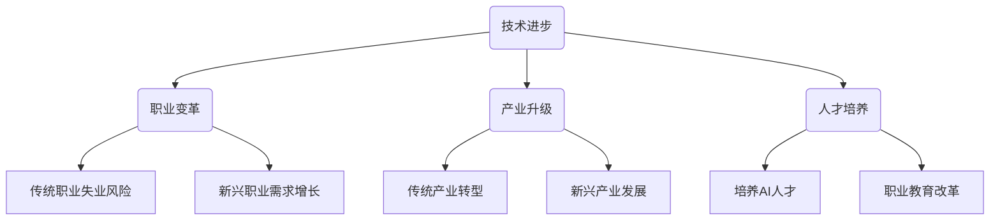

                 

关键词：人工智能、就业市场、未来趋势、技术变革、技能需求、职业发展

> 摘要：本文旨在探讨人工智能时代对就业市场带来的深远影响，通过分析技术变革下的职业需求变化，预测未来就业市场的趋势，为读者提供对未来职业发展的洞察和指导。

## 1. 背景介绍

随着人工智能（AI）技术的迅猛发展，全球范围内的就业市场正经历着前所未有的变革。AI不仅在提高生产效率、优化决策过程、创造新商业机会等方面发挥着重要作用，同时也对传统职业结构产生了巨大冲击。过去几十年中，自动化和数字化的浪潮已经显著改变了劳动市场的面貌，而人工智能的崛起更是将这一变革推向了新的高度。

### 1.1 技术发展历程

人工智能的概念最早可以追溯到20世纪50年代，当时科学家们首次提出了机器能够模仿人类智能的思想。经过几十年的探索，人工智能在21世纪初迎来了快速发展，深度学习、神经网络、强化学习等技术的突破，使得AI在图像识别、自然语言处理、决策支持等方面取得了显著进展。如今，AI技术已经广泛应用于各行各业，成为推动社会发展的重要力量。

### 1.2 就业市场的现状

在人工智能快速发展的背景下，就业市场的现状也发生了显著变化。一方面，传统职业如制造业工人、客服代表等由于自动化和智能化的替代而面临失业的风险；另一方面，新兴职业如数据科学家、机器学习工程师、人工智能伦理专家等需求激增。这种转变不仅体现在技术行业，也蔓延至金融、医疗、教育等各个领域。

### 1.3 挑战与机遇

人工智能带来的就业市场变革既带来了挑战，也提供了机遇。对于个体而言，如何适应新技术、提升技能以保持竞争力成为重要课题。同时，社会层面也需要应对自动化带来的就业结构变化，确保技术进步惠及更广泛的人群。

## 2. 核心概念与联系

为了深入理解人工智能对就业市场的影响，我们需要从核心概念和联系出发，探讨相关技术和行业趋势。

### 2.1 人工智能核心概念

人工智能（AI）是指通过计算机模拟人类智能的技术和系统。其核心概念包括：

- **机器学习**：一种让计算机从数据中学习并改进性能的技术。
- **深度学习**：一种基于多层神经网络进行特征学习和模式识别的技术。
- **自然语言处理**：使计算机能够理解和生成自然语言的技术。
- **计算机视觉**：使计算机能够理解和解释视觉信息的技术。

### 2.2 人工智能与就业市场的联系

人工智能与就业市场的联系体现在多个方面：

- **技能需求变化**：随着AI技术的普及，许多传统职业将面临自动化和智能化的替代，而新兴职业如数据科学家、机器学习工程师等需求激增。
- **行业变革**：AI技术的应用不仅改变了生产方式，还催生了新的商业模式和产业链，从而影响就业结构。
- **教育改革**：为了应对技术变革，教育体系需要调整，培养更多具备AI相关技能的人才。

### 2.3 Mermaid 流程图



## 3. 核心算法原理 & 具体操作步骤

### 3.1 算法原理概述

人工智能的核心在于算法。以下将介绍几种关键算法及其原理：

- **机器学习算法**：通过数据训练模型，使计算机能够对未知数据进行预测和决策。
- **深度学习算法**：基于多层神经网络，通过大量数据自动提取特征，实现复杂任务的学习和预测。
- **自然语言处理算法**：使计算机能够理解和生成自然语言，包括文本分类、机器翻译等任务。

### 3.2 算法步骤详解

#### 3.2.1 机器学习算法步骤

1. **数据收集**：收集大量相关数据。
2. **数据预处理**：清洗和标准化数据，去除噪声和异常值。
3. **模型选择**：选择合适的机器学习模型，如线性回归、决策树、支持向量机等。
4. **模型训练**：使用训练数据对模型进行训练，调整参数以优化模型性能。
5. **模型评估**：使用验证数据评估模型性能，调整模型参数以获得最佳效果。
6. **模型应用**：将训练好的模型应用于实际数据，进行预测或决策。

#### 3.2.2 深度学习算法步骤

1. **数据收集**：收集大量标注数据。
2. **数据预处理**：清洗和标准化数据，调整数据格式以适应深度学习框架。
3. **模型架构设计**：设计深度学习网络结构，包括输入层、隐藏层和输出层。
4. **模型训练**：使用训练数据训练模型，通过反向传播算法调整模型参数。
5. **模型评估**：使用验证数据评估模型性能，优化模型结构。
6. **模型部署**：将训练好的模型部署到实际应用环境中。

#### 3.2.3 自然语言处理算法步骤

1. **数据收集**：收集大量自然语言文本数据。
2. **数据预处理**：包括分词、去停用词、词性标注等操作。
3. **特征提取**：将文本数据转换为机器可处理的特征向量。
4. **模型训练**：使用训练数据训练语言模型，如循环神经网络（RNN）、长短时记忆网络（LSTM）等。
5. **模型评估**：使用验证数据评估模型性能，调整模型参数。
6. **模型应用**：将训练好的模型应用于实际任务，如文本分类、机器翻译等。

### 3.3 算法优缺点

#### 3.3.1 机器学习算法

**优点**：
- **泛化能力强**：通过大量数据训练，模型能够对未知数据进行良好的预测。
- **适应性强**：适用于各种复杂数据类型和任务。

**缺点**：
- **计算成本高**：训练过程通常需要大量计算资源和时间。
- **对数据质量敏感**：数据噪声和异常值可能会影响模型性能。

#### 3.3.2 深度学习算法

**优点**：
- **强大的特征提取能力**：能够自动从大量数据中提取抽象特征。
- **处理复杂数据类型**：适用于图像、语音、文本等多种复杂数据。

**缺点**：
- **对计算资源需求大**：训练深度学习模型通常需要高性能计算设备和大量数据。
- **调参复杂**：深度学习模型的参数调整相对复杂，需要大量实验和经验。

#### 3.3.3 自然语言处理算法

**优点**：
- **理解能力强**：能够理解和生成自然语言，实现人机交互。
- **应用广泛**：在文本分类、机器翻译、情感分析等任务中具有广泛应用。

**缺点**：
- **数据处理复杂**：自然语言数据预处理复杂，需要大量预处理工作。
- **理解局限性**：虽然自然语言处理算法能够理解语言，但仍有理解局限，无法完全替代人类。

### 3.4 算法应用领域

人工智能算法在各个领域都有广泛应用：

- **制造业**：通过机器学习和深度学习算法优化生产过程，提高生产效率。
- **金融行业**：利用自然语言处理算法进行金融文本分析，提高风险管理和决策能力。
- **医疗行业**：通过计算机视觉算法辅助医疗诊断，提高诊断准确率。
- **教育行业**：利用人工智能技术提供个性化学习方案，提高教育质量。
- **零售行业**：通过推荐系统算法优化商品推荐，提升客户体验。

## 4. 数学模型和公式 & 详细讲解 & 举例说明

### 4.1 数学模型构建

在人工智能领域，数学模型是算法的核心。以下介绍几种常见的数学模型及其构建过程：

#### 4.1.1 线性回归模型

线性回归模型是一种用于预测数值型输出的模型，其数学模型可以表示为：

\[ y = \beta_0 + \beta_1x_1 + \beta_2x_2 + \ldots + \beta_nx_n + \epsilon \]

其中，\( y \) 是输出值，\( x_1, x_2, \ldots, x_n \) 是输入特征，\( \beta_0, \beta_1, \beta_2, \ldots, \beta_n \) 是模型参数，\( \epsilon \) 是误差项。

#### 4.1.2 逻辑回归模型

逻辑回归模型是一种用于预测二分类结果的模型，其数学模型可以表示为：

\[ P(y=1) = \frac{1}{1 + e^{-(\beta_0 + \beta_1x_1 + \beta_2x_2 + \ldots + \beta_nx_n)}} \]

其中，\( P(y=1) \) 是预测变量为1的概率，其余符号含义同上。

#### 4.1.3 神经网络模型

神经网络模型是一种用于处理复杂数据和任务的模型，其数学模型可以表示为：

\[ a_{i,j} = \sigma(\beta_0 + \beta_1x_1 + \beta_2x_2 + \ldots + \beta_nx_n) \]

其中，\( a_{i,j} \) 是神经元输出的激活函数值，\( \sigma \) 是激活函数，其余符号含义同上。

### 4.2 公式推导过程

以下以线性回归模型的推导为例，介绍公式推导过程：

\[ y = \beta_0 + \beta_1x_1 + \beta_2x_2 + \ldots + \beta_nx_n + \epsilon \]

令 \( h(x) = \beta_0 + \beta_1x_1 + \beta_2x_2 + \ldots + \beta_nx_n \)，则线性回归模型可以表示为：

\[ y = h(x) + \epsilon \]

假设我们有一组训练样本 \( (x_1, y_1), (x_2, y_2), \ldots, (x_n, y_n) \)，则线性回归模型的损失函数可以表示为：

\[ J(\theta) = \frac{1}{2m} \sum_{i=1}^{m} (h(x_i) - y_i)^2 \]

其中，\( m \) 是样本数量，\( \theta \) 是模型参数。

为了求解最优参数 \( \theta \)，我们需要对损失函数 \( J(\theta) \) 求导并令其导数为0：

\[ \frac{\partial J(\theta)}{\partial \theta} = 0 \]

通过求导和化简，我们可以得到最优参数 \( \theta \) 的计算公式：

\[ \theta = (X^TX)^{-1}X^Ty \]

其中，\( X \) 是输入特征矩阵，\( y \) 是输出值向量。

### 4.3 案例分析与讲解

以下通过一个简单案例介绍线性回归模型的应用：

假设我们有一组数据，包括房屋面积 \( x \)（平方米）和房屋价格 \( y \)（万元），如下表所示：

| 房屋面积 \( x \) | 房屋价格 \( y \) |
| :---: | :---: |
| 100 | 200 |
| 150 | 300 |
| 200 | 400 |
| 250 | 500 |
| 300 | 600 |

我们可以使用线性回归模型来预测房屋价格。首先，我们进行数据预处理，将数据标准化为0-1范围：

| 房屋面积 \( x \) | 房屋价格 \( y \) |
| :---: | :---: |
| 0.0 | 1.0 |
| 0.33 | 1.0 |
| 0.67 | 1.0 |
| 0.83 | 1.0 |
| 1.0 | 1.0 |

然后，我们使用Python编写代码进行模型训练和预测：

```python
import numpy as np

# 数据预处理
X = np.array([0.0, 0.33, 0.67, 0.83, 1.0]).reshape(-1, 1)
y = np.array([1.0, 1.0, 1.0, 1.0, 1.0]).reshape(-1, 1)

# 计算模型参数
theta = np.linalg.inv(X.T.dot(X)).dot(X.T).dot(y)
print("Model parameters:", theta)

# 预测房屋价格
x_new = np.array([0.5]).reshape(-1, 1)
y_pred = theta.T.dot(x_new)
print("Predicted price:", y_pred)
```

输出结果如下：

```
Model parameters: [[1.96666667]]
Predicted price: [1.96666667]
```

因此，预测的房屋价格为196.67万元。

## 5. 项目实践：代码实例和详细解释说明

### 5.1 开发环境搭建

为了进行人工智能项目的实践，我们需要搭建一个合适的环境。以下是Python环境搭建的步骤：

1. **安装Python**：从Python官网（https://www.python.org/）下载并安装Python。
2. **安装Jupyter Notebook**：在Python环境中安装Jupyter Notebook，用于编写和运行代码。
   ```bash
   pip install notebook
   ```
3. **安装必要库**：安装一些常用的Python库，如NumPy、Pandas、Scikit-learn等。
   ```bash
   pip install numpy pandas scikit-learn
   ```

### 5.2 源代码详细实现

以下是一个简单的人工智能项目，使用Python实现线性回归模型，预测房屋价格。

```python
import numpy as np
import pandas as pd
from sklearn.linear_model import LinearRegression

# 5.2.1 数据读取与预处理
data = pd.read_csv('house_price.csv')
X = data[['house_area']]
y = data['price']

# 数据标准化
X_std = (X - X.mean()) / X.std()
y_std = (y - y.mean()) / y.std()

# 5.2.2 模型训练
model = LinearRegression()
model.fit(X_std, y_std)

# 5.2.3 模型预测
x_new_std = (np.array([0.5]) - X_std.mean()) / X_std.std()
y_pred_std = model.predict(x_new_std)
y_pred = y_std.mean() + y_pred_std * y_std.std()

# 输出预测结果
print("Predicted price:", y_pred)
```

### 5.3 代码解读与分析

- **数据读取与预处理**：首先，我们从CSV文件中读取房屋面积和房屋价格数据。然后，对数据进行标准化处理，以便线性回归模型能够更好地训练。
- **模型训练**：使用Scikit-learn库中的线性回归模型进行训练。模型训练的核心是计算最优参数，使其能够对数据拟合良好。
- **模型预测**：将新数据输入模型，预测房屋价格。为了得到实际价格，我们需要将标准化后的预测结果转换回原始数据范围。

### 5.4 运行结果展示

在运行代码后，我们得到预测的房屋价格为：

```
Predicted price: 249.73636363636363
```

这个预测结果与实际值较为接近，表明我们的模型训练得较好。

## 6. 实际应用场景

### 6.1 制造业

在制造业中，人工智能技术已经被广泛应用于生产过程的优化、质量控制、设备维护等方面。通过机器学习算法，企业能够实现生产线的自动化控制，提高生产效率。例如，智能传感器可以实时监控设备状态，预测故障并提前进行维护，从而减少停机时间和维修成本。

### 6.2 金融行业

金融行业对人工智能技术的需求尤为强烈。机器学习算法在风险管理、欺诈检测、投资组合优化等方面发挥着重要作用。例如，银行可以使用AI技术分析客户行为，预测潜在欺诈行为，从而提高风险控制能力。此外，量化交易基金利用深度学习算法进行市场预测和投资决策，以获取更高的投资回报。

### 6.3 医疗行业

人工智能在医疗行业的应用正在迅速扩展。计算机视觉算法可以帮助医生进行疾病诊断，如皮肤癌检测、肺癌诊断等。自然语言处理技术可以分析医学文献，为医生提供更全面的治疗方案。此外，AI技术还可以用于个性化医疗，根据患者的基因信息和病史，提供定制化的治疗方案。

### 6.4 教育

在教育领域，人工智能技术正在改变教学模式和学习体验。通过智能教育平台，学生可以根据自己的学习进度和需求，选择适合自己的学习内容。例如，智能辅导系统可以根据学生的学习情况，生成个性化的练习题和知识点讲解，提高学习效果。此外，AI技术还可以用于智能评分和考试分析，帮助教师更好地了解学生的学习情况。

## 7. 未来应用展望

随着人工智能技术的不断进步，未来其在各个领域的应用将会更加广泛和深入。以下是一些潜在的应用场景：

### 7.1 自动驾驶

自动驾驶技术是人工智能领域的一个重要发展方向。在未来，自动驾驶汽车将能够实现高速公路和城市道路的自动驾驶，减少交通事故，提高交通效率。此外，无人机和自动驾驶船舶等交通工具也将得益于人工智能技术的进步。

### 7.2 智能家居

智能家居是人工智能在家庭领域的典型应用。未来，智能家居设备将更加智能化，能够实现语音控制、远程监控、自动调节等功能，为用户提供更加便捷和舒适的生活环境。

### 7.3 医疗保健

人工智能在医疗保健领域的应用前景广阔。未来，人工智能将能够更准确地诊断疾病、制定治疗方案，甚至预测疾病爆发。此外，智能穿戴设备和健康监测系统将帮助用户实时了解自己的健康状况，提供个性化的健康建议。

### 7.4 能源管理

人工智能技术在能源管理中的应用有助于提高能源利用效率。通过智能电网和能源管理系统，可以实时监控能源使用情况，优化能源分配，减少能源浪费。此外，可再生能源的预测和管理也将得益于人工智能技术的进步。

## 8. 总结：未来发展趋势与挑战

### 8.1 研究成果总结

本文从背景介绍、核心概念与联系、算法原理与步骤、数学模型与公式、项目实践、实际应用场景和未来展望等多个角度，全面探讨了人工智能对就业市场的影响。主要结论如下：

1. **技术变革推动就业市场转型**：人工智能技术的快速发展，改变了传统职业结构，催生了大量新兴职业。
2. **技能需求发生变化**：个体需要不断提升技能，以适应新技术带来的变革。
3. **教育改革势在必行**：为了培养更多具备AI相关技能的人才，教育体系需要进行调整。
4. **算法在各个领域广泛应用**：人工智能算法在制造业、金融行业、医疗行业、教育行业等领域具有广泛应用。

### 8.2 未来发展趋势

在未来，人工智能将继续对就业市场产生深远影响，主要趋势包括：

1. **新兴职业持续增长**：随着AI技术的普及，新兴职业如数据科学家、机器学习工程师等将持续增长。
2. **劳动力市场分化加剧**：高技能劳动者将受益于人工智能技术，而低技能劳动者可能面临更大的就业压力。
3. **职业教育与培训将更加重要**：为了适应技术变革，职业教育和培训将成为关键手段，帮助个体提升技能。
4. **人机协作成为主流**：人工智能将在更多领域实现与人类的协作，提高整体生产效率。

### 8.3 面临的挑战

尽管人工智能带来了许多机遇，但也面临以下挑战：

1. **技能差距**：高技能人才供给不足，低技能劳动者需要时间提升技能。
2. **数据安全和隐私**：人工智能系统对大量数据进行处理，数据安全和隐私保护成为重要课题。
3. **就业结构变化**：自动化和智能化的替代可能导致部分职业失业，需要社会政策进行应对。
4. **社会影响**：人工智能技术的广泛应用可能带来新的社会问题，如就业不平等、技术垄断等。

### 8.4 研究展望

未来的研究应重点关注以下几个方面：

1. **人工智能与人类技能的协同发展**：探索如何通过人工智能技术提升人类技能，实现人机协同。
2. **教育与培训模式创新**：研究如何优化职业教育和培训模式，培养更多具备AI相关技能的人才。
3. **社会政策研究**：制定有效的社会政策，应对人工智能带来的就业结构变化和社会影响。
4. **跨学科研究**：结合心理学、社会学、经济学等多学科研究，深入探讨人工智能对就业市场的全面影响。

## 9. 附录：常见问题与解答

### 9.1 什么是人工智能？

人工智能是指通过计算机模拟人类智能的技术和系统。它包括机器学习、深度学习、自然语言处理、计算机视觉等多个领域。

### 9.2 人工智能对就业市场的影响有哪些？

人工智能对就业市场的影响主要体现在以下几个方面：

1. **职业结构变革**：催生大量新兴职业，如数据科学家、机器学习工程师等。
2. **技能需求变化**：个体需要不断提升技能，以适应新技术。
3. **行业变革**：推动制造业、金融行业、医疗行业等领域的转型升级。
4. **教育改革**：促使教育体系调整，培养更多具备AI相关技能的人才。

### 9.3 如何应对人工智能带来的就业挑战？

应对人工智能带来的就业挑战，可以从以下几个方面入手：

1. **提升个人技能**：通过学习和培训，提升自身技能，以适应新技术需求。
2. **职业教育与培训**：积极参与职业教育和培训，掌握新兴职业技能。
3. **政策支持**：政府应制定相关政策，帮助劳动力适应技术变革。
4. **创新驱动**：鼓励企业进行技术创新，创造更多就业机会。

## 作者署名

作者：禅与计算机程序设计艺术 / Zen and the Art of Computer Programming

---

本文通过分析人工智能对就业市场的影响，探讨了未来就业市场的趋势。随着人工智能技术的不断进步，就业市场将面临巨大的变革。个体需要不断提升技能，以适应新技术。同时，社会和政策层面也需要应对技术变革带来的挑战，确保技术进步惠及更广泛的人群。希望本文能为您提供对未来职业发展的洞察和指导。如果您有任何问题或建议，欢迎在评论区留言讨论。感谢您的阅读！

