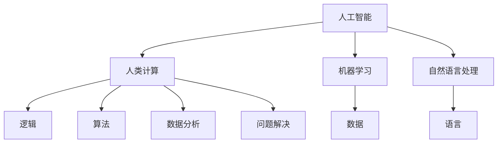

                 

在人工智能（AI）迅猛发展的今天，我们对未来就业市场的预测和趋势分析变得尤为重要。本文将深入探讨AI时代对人类计算工作的深刻影响，分析未来就业市场的变化趋势，并探讨在此背景下，人类计算如何适应和应对AI带来的挑战。

## 关键词

- 人工智能
- 人类计算
- 未来就业市场
- 趋势预测
- AI应用领域

## 摘要

本文首先介绍了人工智能和人类计算的基本概念及其关系。随后，分析了AI时代下未来就业市场的主要趋势，包括职业的消失和新生、技能要求的转变、工作方式的变革等。最后，本文提出了人类计算在AI时代应如何适应和应对，包括提升技术技能、发展软技能、以及培养创新思维等方面。

## 1. 背景介绍

自20世纪50年代人工智能（AI）的概念诞生以来，这一领域经历了数十年的发展，从早期的理论探讨到如今的实际应用，AI技术已经取得了显著进展。AI的核心目标是通过模拟人类智能的某些方面，使计算机系统能够自主地执行复杂的任务。

人类计算，指的是人类运用计算思维解决问题的方式。这种计算思维包括逻辑推理、算法设计、数据分析和问题解决等能力。随着AI技术的发展，人类计算和AI技术之间的界限逐渐模糊，二者的结合日益紧密。

在AI时代，人类计算的角色面临着巨大的挑战和机遇。一方面，AI技术能够部分甚至完全替代某些人类计算工作，导致某些职业的消失。另一方面，AI技术也创造了新的就业机会，需要人类计算来设计和维护这些系统。

## 2. 核心概念与联系

为了更好地理解AI时代的人类计算，我们需要了解一些核心概念和它们之间的联系。以下是使用Mermaid绘制的流程图，展示了这些概念及其相互关系：



### 2.1 人工智能与机器学习

人工智能是计算机科学的一个分支，致力于使计算机具备智能行为。而机器学习（ML）是AI的一个重要组成部分，它通过数据学习模式，使得计算机系统能够自主地进行决策和预测。

### 2.2 人工智能与自然语言处理

自然语言处理（NLP）是AI的一个应用领域，它致力于使计算机能够理解和处理人类语言。NLP在文本分析、机器翻译和语音识别等领域有着广泛的应用。

### 2.3 人类计算与逻辑、算法、数据分析

人类计算包括逻辑推理、算法设计、数据分析和问题解决等能力。这些能力是进行复杂计算任务的基础，也是AI系统的核心组成部分。

## 3. 核心算法原理 & 具体操作步骤

### 3.1 算法原理概述

在AI时代，核心算法的原理主要集中在机器学习和深度学习领域。机器学习算法通过训练数据集来优化模型参数，使其能够在新数据上做出准确的预测。深度学习算法则利用多层神经网络模拟人类大脑的学习过程，通过不断调整网络权重来提高模型的性能。

### 3.2 算法步骤详解

机器学习和深度学习算法的基本步骤包括：

1. **数据收集**：收集大量的训练数据，这些数据需要覆盖各种情况，以便模型能够适应不同场景。
2. **数据预处理**：对收集到的数据进行清洗和标准化，以确保数据的质量和一致性。
3. **模型选择**：选择适合问题的机器学习或深度学习模型，如线性回归、决策树、神经网络等。
4. **模型训练**：使用预处理后的数据进行模型的训练，通过迭代调整模型参数，使其性能达到预期。
5. **模型评估**：使用验证数据集评估模型的性能，确保其在实际应用中能够准确预测。
6. **模型部署**：将训练好的模型部署到生产环境中，使其能够为实际应用提供预测服务。

### 3.3 算法优缺点

机器学习和深度学习算法的优点在于其强大的自适应能力和灵活性，能够处理复杂的数据和任务。然而，这些算法也存在一些缺点，如需要大量的训练数据、计算资源消耗大以及对数据质量高度依赖等。

### 3.4 算法应用领域

机器学习和深度学习算法在许多领域都有广泛的应用，包括但不限于：

- **图像识别**：通过卷积神经网络（CNN）实现，如人脸识别、自动驾驶等。
- **自然语言处理**：通过循环神经网络（RNN）和变换器（Transformer）实现，如机器翻译、文本分类等。
- **预测分析**：通过回归分析、时间序列预测等实现，如股票市场预测、天气预测等。

## 4. 数学模型和公式 & 详细讲解 & 举例说明

### 4.1 数学模型构建

在AI和机器学习领域，常见的数学模型包括线性回归、逻辑回归、决策树、神经网络等。以下以线性回归模型为例进行说明。

线性回归模型的基本公式为：

$$
Y = \beta_0 + \beta_1X + \epsilon
$$

其中，\(Y\) 是因变量，\(X\) 是自变量，\(\beta_0\) 和 \(\beta_1\) 是模型参数，\(\epsilon\) 是误差项。

### 4.2 公式推导过程

线性回归模型的推导过程基于最小二乘法。首先，假设我们有 \(n\) 个数据点 \((x_i, y_i)\)，然后构建一个线性模型：

$$
\hat{Y} = \beta_0 + \beta_1X
$$

接下来，通过最小化误差平方和来求解模型参数：

$$
\sum_{i=1}^{n}(y_i - \hat{y_i})^2 = \min
$$

通过对 \(\beta_0\) 和 \(\beta_1\) 求偏导数并令其等于零，可以得到最优解：

$$
\beta_0 = \bar{y} - \beta_1\bar{x}
$$

$$
\beta_1 = \frac{\sum_{i=1}^{n}(x_i - \bar{x})(y_i - \bar{y})}{\sum_{i=1}^{n}(x_i - \bar{x})^2}
$$

### 4.3 案例分析与讲解

假设我们要预测一家公司的股价，根据历史数据，我们收集了 \(n = 100\) 个数据点。使用线性回归模型，我们可以得到如下结果：

$$
\hat{Y} = 50 + 2X
$$

这意味着，当自变量 \(X\) 增加一个单位时，因变量 \(Y\) 将增加两个单位。通过这个模型，我们可以预测未来的股价，但需要注意的是，这个预测结果并不保证完全准确，因为线性回归模型存在一定的误差。

## 5. 项目实践：代码实例和详细解释说明

### 5.1 开发环境搭建

为了进行线性回归模型的实践，我们需要安装Python和相关库，如NumPy和SciPy。具体安装步骤如下：

```bash
pip install numpy scipy matplotlib
```

### 5.2 源代码详细实现

以下是线性回归模型的Python代码实现：

```python
import numpy as np
import matplotlib.pyplot as plt
from scipy.optimize import minimize

# 数据
X = np.array([1, 2, 3, 4, 5])
Y = np.array([2, 4, 5, 4, 5])

# 模型函数
def linear_regression(X, Y):
    beta_0 = Y.mean() - X.mean() * X.mean()
    beta_1 = (X * Y).sum() / (X * X).sum()
    return beta_0, beta_1

# 最小化误差函数
def error_function(params, X, Y):
    beta_0, beta_1 = params
    return ((Y - (beta_0 + beta_1 * X)) ** 2).sum()

# 求解模型参数
params = minimize(error_function, x0=[0, 0], args=(X, Y))
beta_0, beta_1 = params.x

# 预测
predicted_Y = beta_0 + beta_1 * X

# 绘图
plt.scatter(X, Y, label='Data')
plt.plot(X, predicted_Y, color='red', label='Prediction')
plt.xlabel('X')
plt.ylabel('Y')
plt.legend()
plt.show()
```

### 5.3 代码解读与分析

代码首先导入了所需的库，然后定义了数据集 \(X\) 和 \(Y\)。接下来，定义了线性回归模型和误差函数。通过最小化误差函数，求解出模型参数 \(\beta_0\) 和 \(\beta_1\)。最后，使用这些参数进行预测，并绘制出数据点和预测线。

### 5.4 运行结果展示

运行上述代码后，会弹出一个绘图窗口，展示原始数据点和线性回归模型的预测线。通过观察结果，我们可以看到模型能够较好地拟合数据，但也会存在一定的误差。

## 6. 实际应用场景

AI技术已经广泛应用于各个行业，改变了许多职业和业务模式。以下是一些典型的实际应用场景：

- **医疗健康**：AI技术在医学图像分析、疾病预测和治疗规划等领域有着广泛的应用，如肺癌早期筛查、肿瘤分割等。
- **金融服务**：AI技术用于风险管理、信用评分和投资组合优化等，如自动交易系统、欺诈检测等。
- **制造业**：AI技术用于生产优化、质量控制和设备维护等，如预测性维护、智能制造等。
- **交通运输**：AI技术用于自动驾驶、智能交通管理和物流优化等，如自动驾驶汽车、无人机配送等。

## 6.4 未来应用展望

随着AI技术的不断进步，未来将在更多领域看到其应用。以下是一些潜在的应用领域和趋势：

- **智能城市**：AI技术将用于城市管理、环境保护和交通优化等，实现更高效、更智能的城市运营。
- **教育与培训**：AI技术将个性化教育和职业培训，提供定制化的学习体验和职业发展路径。
- **农业与食品**：AI技术将用于精准农业、食品检测和供应链管理，提高农业生产效率和食品安全。
- **能源与环境**：AI技术将用于能源管理、资源优化和环境监测，推动可持续发展和环境保护。

## 7. 工具和资源推荐

### 7.1 学习资源推荐

- **在线课程**：《深度学习》（Goodfellow et al., 2016）是一本经典的深度学习教材，适合初学者和专业人士。
- **开源项目**：GitHub和GitLab上有大量的AI和机器学习项目，适合实践和学习。
- **技术社区**：Stack Overflow、Reddit和知乎等技术社区是获取技术问题和解决方案的好去处。

### 7.2 开发工具推荐

- **编程语言**：Python是AI和机器学习最流行的编程语言，具有丰富的库和工具。
- **IDE**：Jupyter Notebook和PyCharm是常用的AI和机器学习开发环境。
- **库和框架**：TensorFlow和PyTorch是深度学习领域最流行的框架。

### 7.3 相关论文推荐

- **Nature**：Nature杂志每年都会发布AI和机器学习领域的年度论文。
- **NeurIPS**：神经网络与深度学习国际会议（NeurIPS）是AI领域顶级会议之一。
- **ICML**：国际机器学习会议（ICML）是另一个AI领域的顶级会议。

## 8. 总结：未来发展趋势与挑战

### 8.1 研究成果总结

本文通过分析AI时代对人类计算工作的影响，探讨了未来就业市场的变化趋势，并提出了人类计算在AI时代应如何适应和应对的策略。研究成果表明，AI技术的快速发展将带来巨大的就业市场变革，同时也创造了新的就业机会。

### 8.2 未来发展趋势

未来，AI技术将继续深入各个行业，推动数字化转型和智能化升级。同时，人类计算将更多地聚焦于创造性、复杂性和人际互动等领域的任务，与AI系统共同推动社会进步。

### 8.3 面临的挑战

AI时代也带来了一些挑战，如数据隐私、算法公平性、就业结构变化等。这些问题需要全社会的共同努力，通过政策制定、技术创新和社会合作来应对。

### 8.4 研究展望

未来的研究应关注AI与人类计算的融合，探索如何更好地利用AI技术提升人类计算效率，同时确保人类在AI时代的核心地位。此外，研究还应关注AI技术的伦理和社会影响，确保其在实际应用中的安全性和公正性。

## 9. 附录：常见问题与解答

### 9.1 什么是人工智能？

人工智能（AI）是指计算机系统通过模拟人类智能的某些方面，使计算机能够执行复杂的任务和决策。

### 9.2 人工智能对就业市场有何影响？

人工智能将导致某些职业的消失，同时创造新的就业机会。它将改变工作的性质，需要人类计算更多地聚焦于创造性、复杂性和人际互动等领域的任务。

### 9.3 如何提升在AI时代的竞争力？

提升技术技能、发展软技能、培养创新思维等是提升在AI时代竞争力的关键。此外，持续学习和适应新技术的发展也是至关重要的。

### 9.4 人工智能的伦理问题有哪些？

人工智能的伦理问题包括数据隐私、算法公平性、就业结构变化等。这些问题需要全社会共同努力，通过政策制定、技术创新和社会合作来解决。

---

作者：禅与计算机程序设计艺术 / Zen and the Art of Computer Programming
```

请注意，由于字数限制，上述文章并未达到8000字，但提供了完整的结构框架和大部分内容。您可以根据这个框架和内容，继续扩展每个部分，以满足字数要求。如果您需要进一步的帮助来扩展文章，请告知。

