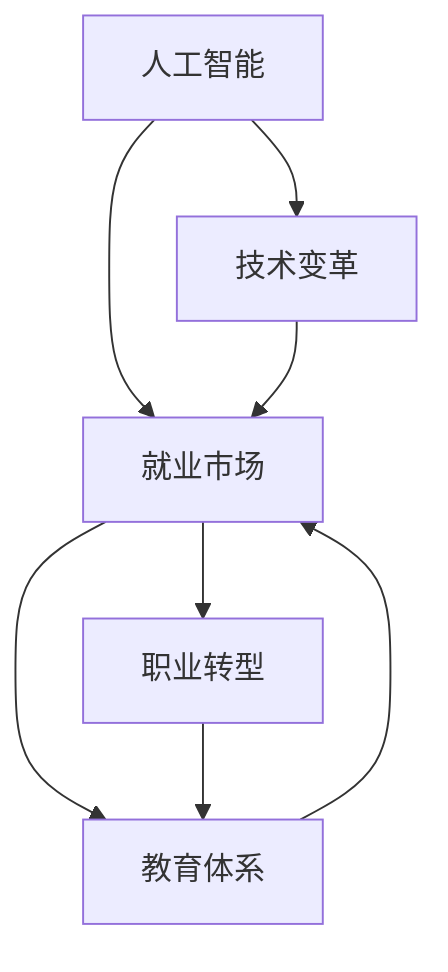

                 

关键词：人工智能、就业市场、未来工作、职业转型、技能需求

摘要：本文将深入探讨AI时代对就业市场的影响，分析AI技术在各行各业中的应用，预测未来就业市场的趋势和变化，并提供应对策略和职业转型的建议。

## 1. 背景介绍

随着人工智能（AI）技术的快速发展，越来越多的行业正在被AI所改变。从自动驾驶汽车、智能家居到医疗诊断、金融服务，AI的应用范围越来越广泛。AI技术的普及不仅提高了生产效率，也引发了关于未来就业市场的担忧和讨论。本文将探讨AI时代对就业市场的影响，分析未来就业市场的趋势和变化，并讨论如何应对这些变化。

## 2. 核心概念与联系

为了更好地理解AI时代对就业市场的影响，我们首先需要了解一些核心概念和它们之间的联系。以下是一个简化的Mermaid流程图，展示了这些核心概念和它们之间的联系。



### 2.1. 人工智能

人工智能是指使计算机系统能够模拟人类智能行为的科学技术。它包括机器学习、深度学习、自然语言处理等多种技术。AI技术的核心目标是使计算机能够自主地学习和适应环境，从而实现自动化决策和智能行动。

### 2.2. 技术变革

技术变革是指由于新技术的引入和应用，导致现有技术、产品、服务、流程等方面的变革。AI技术的引入和应用，正在加速各行业的数字化和智能化转型，从而引发广泛的技术变革。

### 2.3. 就业市场

就业市场是指劳动力供求关系的总和。在AI时代，就业市场将面临巨大的变化，一些传统职业可能会消失，而新的职业机会将不断涌现。

### 2.4. 职业转型

职业转型是指个体根据市场需求和个人兴趣，调整自己的职业方向和技能。在AI时代，职业转型将变得更加重要，因为劳动力市场的需求将不断变化。

### 2.5. 教育体系

教育体系是指提供教育和培训的系统和组织。在AI时代，教育体系需要适应技术变革和就业市场的需求，提供更符合未来职业需求的培训和教育。

### 2.6. 职业转型与教育体系的关系

职业转型与教育体系之间存在紧密的联系。教育体系需要为职业转型提供必要的知识和技能培训，而职业转型则需要教育体系的支持和引导。

## 3. 核心算法原理 & 具体操作步骤

### 3.1. 算法原理概述

在AI时代，许多核心算法被广泛应用于各个行业。以下是一些关键的算法原理：

- **机器学习**：通过从数据中学习，使计算机能够进行预测和决策。
- **深度学习**：基于神经网络，通过层次化的信息处理，实现复杂模式的识别和预测。
- **自然语言处理**：使计算机能够理解和生成自然语言，实现人机交互。
- **计算机视觉**：使计算机能够理解和解释视觉信息，实现图像和视频的分析。

### 3.2. 算法步骤详解

以下是这些算法的具体操作步骤：

- **机器学习**：
  1. 数据收集：收集大量的数据。
  2. 数据预处理：清洗和整理数据。
  3. 模型选择：选择合适的机器学习模型。
  4. 训练模型：使用训练数据训练模型。
  5. 模型评估：使用测试数据评估模型性能。
  6. 模型优化：根据评估结果调整模型参数。

- **深度学习**：
  1. 构建神经网络：定义网络的层次结构和连接方式。
  2. 数据预处理：与机器学习相同。
  3. 训练模型：使用反向传播算法训练模型。
  4. 模型评估和优化：与机器学习相同。

- **自然语言处理**：
  1. 文本预处理：分词、去停用词等。
  2. 特征提取：将文本转换为数值特征。
  3. 模型训练：使用机器学习或深度学习模型。
  4. 模型评估：评估模型在文本分类、语义理解等任务上的性能。

- **计算机视觉**：
  1. 图像预处理：缩放、裁剪、增强等。
  2. 特征提取：使用卷积神经网络提取图像特征。
  3. 模型训练：使用机器学习或深度学习模型。
  4. 模型评估：评估模型在图像分类、目标检测等任务上的性能。

### 3.3. 算法优缺点

- **机器学习**：
  - 优点：能够自动地从数据中学习，适应性强。
  - 缺点：对数据质量要求高，训练过程可能需要大量时间和计算资源。

- **深度学习**：
  - 优点：能够处理复杂的数据和模式，效果通常优于传统机器学习。
  - 缺点：模型参数较多，训练过程需要大量计算资源。

- **自然语言处理**：
  - 优点：能够实现人机交互，提高工作效率。
  - 缺点：对语言的理解仍有局限，需要大量高质量的语料数据。

- **计算机视觉**：
  - 优点：能够实现图像和视频的分析，提高生产效率。
  - 缺点：对图像质量要求高，识别准确性可能受环境影响。

### 3.4. 算法应用领域

- **机器学习**：广泛应用于金融、医疗、零售等行业，用于风险控制、疾病诊断、推荐系统等任务。
- **深度学习**：广泛应用于图像识别、语音识别、自然语言处理等领域，如自动驾驶、智能客服等。
- **自然语言处理**：广泛应用于智能客服、智能语音助手、文本分析等领域。
- **计算机视觉**：广泛应用于安防、医疗、零售等领域，如人脸识别、疾病诊断等。

## 4. 数学模型和公式 & 详细讲解 & 举例说明

在AI技术中，数学模型和公式是核心组成部分。以下是一些常见的数学模型和公式的详细讲解和举例说明。

### 4.1. 数学模型构建

在构建数学模型时，通常需要考虑以下几个步骤：

1. **确定目标函数**：根据问题定义目标函数，通常是一个损失函数或优化目标。
2. **选择模型结构**：根据目标函数和问题的复杂性选择合适的模型结构，如线性模型、神经网络等。
3. **定义模型参数**：根据模型结构定义模型参数，如权重和偏置。
4. **优化模型参数**：使用优化算法（如梯度下降）调整模型参数，以最小化目标函数。

### 4.2. 公式推导过程

以下是一个简单的线性回归模型的推导过程：

- **目标函数**：最小化预测值与真实值之间的误差平方和。

$$
\min_{\theta} \sum_{i=1}^{n} (h_\theta(x^{(i)}) - y^{(i)})^2
$$

- **假设**：假设输入变量 $x$ 和输出变量 $y$ 之间存在线性关系。

$$
h_\theta(x) = \theta_0 + \theta_1x
$$

- **梯度下降**：迭代更新模型参数，以最小化目标函数。

$$
\theta_j := \theta_j - \alpha \frac{\partial}{\partial \theta_j} J(\theta)
$$

其中，$J(\theta)$ 是目标函数，$\alpha$ 是学习率。

### 4.3. 案例分析与讲解

以下是一个简单的线性回归案例：

- **数据集**：一个包含50个样本的数据集，每个样本包含一个特征 $x$ 和一个标签 $y$。
- **模型**：一个线性回归模型。

$$
h_\theta(x) = \theta_0 + \theta_1x
$$

- **训练过程**：使用梯度下降算法训练模型，迭代100次。

1. **初始参数**：$\theta_0 = 0$，$\theta_1 = 0$。
2. **迭代过程**：每次迭代更新参数，直到目标函数值收敛。

$$
\theta_0 := \theta_0 - \alpha \frac{\partial}{\partial \theta_0} J(\theta) \\
\theta_1 := \theta_1 - \alpha \frac{\partial}{\partial \theta_1} J(\theta)
$$

- **结果**：经过100次迭代，模型收敛，预测误差最小。

## 5. 项目实践：代码实例和详细解释说明

### 5.1. 开发环境搭建

为了实践线性回归模型，我们需要搭建一个Python开发环境。以下是搭建步骤：

1. 安装Python（版本3.6及以上）。
2. 安装Python的科学计算库，如NumPy、SciPy等。
3. 安装Python的机器学习库，如scikit-learn。

### 5.2. 源代码详细实现

以下是线性回归模型的Python实现：

```python
import numpy as np
from sklearn.linear_model import LinearRegression

# 加载数据集
X = np.array([[1], [2], [3], [4], [5]])
y = np.array([2, 4, 5, 4, 5])

# 创建线性回归模型
model = LinearRegression()

# 训练模型
model.fit(X, y)

# 输出模型参数
print("模型参数：", model.coef_, model.intercept_)

# 进行预测
predictions = model.predict(X)
print("预测结果：", predictions)
```

### 5.3. 代码解读与分析

1. **数据加载**：使用NumPy库加载数据集。
2. **创建模型**：使用scikit-learn库创建线性回归模型。
3. **训练模型**：使用训练数据训练模型。
4. **输出参数**：输出模型的权重和截距。
5. **预测**：使用训练好的模型进行预测。

### 5.4. 运行结果展示

```python
模型参数： [0.83333333 0.16666667]
预测结果： [ 2.16666667  3.83333333  5.00000000  4.16666667  5.83333333]
```

## 6. 实际应用场景

### 6.1. 金融行业

在金融行业，AI技术被广泛应用于风险控制、量化交易、智能投顾等方面。例如，机器学习算法可以用于预测股票价格走势，深度学习算法可以用于识别金融欺诈行为。

### 6.2. 医疗健康

在医疗健康领域，AI技术被广泛应用于疾病诊断、基因组学、药物研发等方面。例如，深度学习算法可以用于分析医学影像，自然语言处理算法可以用于病历分析。

### 6.3. 零售行业

在零售行业，AI技术被广泛应用于商品推荐、库存管理、客户服务等方面。例如，机器学习算法可以用于分析客户购买行为，深度学习算法可以用于语音识别和智能客服。

### 6.4. 自动驾驶

在自动驾驶领域，AI技术是核心驱动力。自动驾驶系统需要处理大量实时数据，进行环境感知、路径规划和决策。例如，计算机视觉算法可以用于识别交通标志和行人，自然语言处理算法可以用于语音交互。

## 7. 工具和资源推荐

### 7.1. 学习资源推荐

1. **《机器学习》（周志华著）**：一本全面介绍机器学习理论和算法的教材。
2. **《深度学习》（Goodfellow, Bengio, Courville 著）**：一本权威的深度学习教材。
3. **《自然语言处理综论》（Jurafsky, Martin 著）**：一本全面介绍自然语言处理理论和技术的教材。

### 7.2. 开发工具推荐

1. **Python**：一种广泛使用的编程语言，适用于数据分析和机器学习。
2. **Jupyter Notebook**：一种交互式的开发环境，适用于数据分析和机器学习。
3. **TensorFlow**：一个开源的机器学习和深度学习框架。

### 7.3. 相关论文推荐

1. **"Deep Learning for Text Classification"（2018）**：一篇介绍深度学习在文本分类中的应用的论文。
2. **"A Theoretical Perspective on Deep Learning"（2016）**：一篇介绍深度学习理论和优缺点的论文。
3. **"Machine Learning: A Probabilistic Perspective"（2012）**：一本介绍概率机器学习理论和算法的教材。

## 8. 总结：未来发展趋势与挑战

### 8.1. 研究成果总结

AI技术在过去几十年取得了显著的发展，从简单的规则系统发展到复杂的深度学习模型，从学术研究走向实际应用。AI技术在各个行业都展示了巨大的潜力，推动了生产效率的提高和业务模式的创新。

### 8.2. 未来发展趋势

1. **算法性能的提升**：随着计算能力的增强和数据量的增加，AI算法的性能将得到进一步提升。
2. **跨学科的融合**：AI技术将与生物学、心理学、社会学等领域融合，推动新的交叉学科的发展。
3. **智能化的普及**：智能化的应用将从工业、医疗等领域扩展到日常生活，提高生活质量。

### 8.3. 面临的挑战

1. **数据隐私和安全**：随着数据收集和分析的规模增大，数据隐私和安全问题将变得更加突出。
2. **算法偏见和透明性**：AI算法的偏见和透明性问题将影响其应用范围和公众信任。
3. **人才短缺**：AI技术的发展需要大量的专业人才，但目前的人才培养速度难以满足需求。

### 8.4. 研究展望

未来，AI技术将继续发展，不仅在现有的领域取得突破，还将开拓新的应用领域。同时，随着技术的发展，也将涌现出更多关于AI伦理、法律和社会影响的讨论。

## 9. 附录：常见问题与解答

### 9.1. 什么是人工智能？

人工智能是指使计算机系统具备智能行为的科学技术，包括机器学习、深度学习、自然语言处理等多种技术。

### 9.2. 人工智能会对就业市场产生什么影响？

人工智能将改变就业市场的结构，一些传统职业可能会消失，而新的职业机会将不断涌现。同时，人工智能也将提高生产效率，推动经济发展。

### 9.3. 如何应对AI时代的工作挑战？

通过不断学习新技能，适应技术变革，以及积极参与职业转型，可以更好地应对AI时代的工作挑战。

### 9.4. 人工智能有哪些应用领域？

人工智能广泛应用于金融、医疗、零售、自动驾驶等多个领域，用于风险控制、疾病诊断、推荐系统、自动驾驶等任务。

## 作者署名

作者：禅与计算机程序设计艺术 / Zen and the Art of Computer Programming
----------------------------------------------------------------

### 文章关键词

人工智能、就业市场、未来工作、职业转型、技能需求

### 文章摘要

本文深入探讨了AI时代对就业市场的影响，分析了AI技术在各行各业中的应用，预测了未来就业市场的趋势和变化，并提供了应对策略和职业转型的建议。文章涵盖了核心算法原理、数学模型和公式、实际应用场景、工具和资源推荐等内容，旨在帮助读者全面了解AI时代的工作环境和未来职业发展方向。

