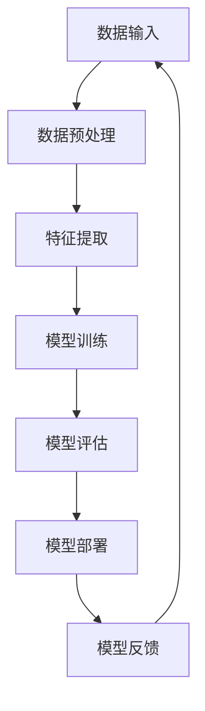

                 

关键词：人工智能，就业趋势，技能发展，未来，计算机编程，算法

> 摘要：本文将探讨人工智能时代对就业市场的深远影响，分析未来就业趋势和技能需求的变化，帮助读者了解AI时代下的职业发展路径和技能提升策略。

## 1. 背景介绍

随着人工智能（AI）技术的迅猛发展，计算机科学和工程领域的变革正在加速。AI作为一种革命性的技术，正在重新定义各行各业，从而对就业市场产生重大影响。从医疗、金融、教育到制造业，AI技术的应用已经无处不在。这种变革不仅改变了传统职业的岗位要求，也催生了一系列全新的职业机会。

本文旨在分析AI时代下的就业趋势和技能需求，为读者提供未来职业发展的方向和策略。文章将涵盖以下内容：

1. **核心概念与联系**：介绍人工智能的基本概念和相关技术架构。
2. **核心算法原理 & 具体操作步骤**：分析常见的人工智能算法及其应用。
3. **数学模型和公式 & 详细讲解 & 举例说明**：探讨人工智能中的数学理论基础。
4. **项目实践：代码实例和详细解释说明**：通过实际项目展示人工智能技术的应用。
5. **实际应用场景**：讨论人工智能在不同领域的应用。
6. **未来应用展望**：预测人工智能的未来发展趋势。
7. **工具和资源推荐**：推荐相关学习资源和开发工具。
8. **总结：未来发展趋势与挑战**：总结研究成果，展望未来发展。
9. **附录：常见问题与解答**：解答读者可能关心的问题。

## 2. 核心概念与联系

### 2.1 人工智能的定义与分类

人工智能（Artificial Intelligence，简称AI）是计算机科学的一个分支，旨在创建能够执行复杂任务、模拟人类智能的机器系统。根据其工作原理和功能，人工智能可以分为以下几类：

1. **基于规则的系统（Rule-Based Systems）**：这类系统通过预定义的规则库来处理输入，并产生输出。这些规则通常由专家编写，并适用于特定的应用场景。

2. **基于统计的机器学习（Statistical Machine Learning）**：这类系统使用统计学方法和算法来发现数据中的模式，并利用这些模式进行预测和决策。常见的算法包括线性回归、决策树、支持向量机等。

3. **基于神经网络的深度学习（Deep Learning）**：这类系统使用多层神经网络来模拟人脑的学习过程，通过大量的数据训练来优化模型参数。深度学习在图像识别、语音识别和自然语言处理等领域取得了显著的成果。

4. **强化学习（Reinforcement Learning）**：这类系统通过不断与环境交互，并根据反馈来调整其行为策略，以实现最优的长期回报。

### 2.2 AI与大数据的联系

人工智能的发展离不开大数据的支持。大数据（Big Data）是指海量、高维度、快速变化的复杂数据。大数据技术提供了有效的数据存储、管理和分析工具，为人工智能系统提供了丰富的数据资源。

大数据与人工智能之间的联系主要体现在以下几个方面：

1. **数据采集与预处理**：大数据技术可以高效地采集、存储和处理海量数据，为人工智能算法提供高质量的数据输入。

2. **特征提取与选择**：大数据技术可以帮助人工智能算法从原始数据中提取出有用的特征，并选择最优的特征组合，以提升模型的性能。

3. **模型训练与优化**：大数据技术提供了强大的计算能力和存储资源，可以支持大规模模型的训练和优化。

### 2.3 AI与云计算的联系

云计算（Cloud Computing）是一种基于互联网的计算模型，提供了可扩展的计算资源和服务。云计算与人工智能的结合，使得人工智能系统可以更加灵活、高效地运行。

AI与云计算之间的联系包括：

1. **计算资源**：云计算提供了强大的计算资源，可以支持大规模的人工智能模型的训练和推理。

2. **数据存储**：云计算提供了可靠的数据存储解决方案，可以存储和管理海量数据。

3. **分布式计算**：云计算支持分布式计算，可以充分利用多台计算机的计算能力，加速人工智能任务的执行。

## 2.3 AI与其他技术的联系

除了大数据和云计算，人工智能还与许多其他技术有着紧密的联系，如：

1. **物联网（Internet of Things，IoT）**：物联网技术将物理设备与互联网连接，生成大量的数据，为人工智能提供了丰富的数据来源。

2. **区块链（Blockchain）**：区块链技术提供了去中心化的数据存储和加密算法，可以保护人工智能系统的隐私和数据安全。

3. **边缘计算（Edge Computing）**：边缘计算将计算任务从云端转移到网络边缘，可以降低延迟、提高响应速度，适用于实时的人工智能应用。

### 2.4 人工智能技术的架构

为了更好地理解人工智能技术的运作原理，我们可以通过Mermaid流程图来描述其基本架构：



在上述流程中，数据输入是人工智能系统的起点，通过数据预处理、特征提取和模型训练等步骤，最终实现模型的评估和部署。模型部署后，会根据实际应用场景不断收集反馈，以优化和调整模型性能。

## 3. 核心算法原理 & 具体操作步骤

### 3.1 算法原理概述

人工智能的核心在于算法，而算法的成功关键在于其理论基础和数学模型。以下是几种常见的人工智能算法及其原理：

#### 3.1.1 神经网络

神经网络（Neural Networks）是一种模拟人脑神经元连接和功能的计算模型。神经网络由输入层、隐藏层和输出层组成，通过激活函数和权重调整来实现特征提取和分类。

#### 3.1.2 支持向量机

支持向量机（Support Vector Machine，SVM）是一种二分类算法，通过寻找最优的超平面来实现分类。SVM的核心是求解最优的权重向量，以最大化分类间隔。

#### 3.1.3 决策树

决策树（Decision Trees）是一种基于树形模型的分类算法，通过递归划分特征空间来实现分类。决策树的核心是选择最优的特征和阈值，以最小化误差。

### 3.2 算法步骤详解

#### 3.2.1 神经网络

神经网络的具体操作步骤如下：

1. **初始化权重和偏置**：随机初始化神经网络的权重和偏置。
2. **前向传播**：将输入数据传递到网络中，计算每个神经元的输出。
3. **激活函数**：对每个神经元的输出应用激活函数（如ReLU、Sigmoid、Tanh等），以引入非线性变换。
4. **计算损失函数**：计算预测输出和真实输出之间的误差，常用的损失函数有均方误差（MSE）、交叉熵损失（Cross Entropy Loss）等。
5. **反向传播**：根据损失函数计算梯度，更新权重和偏置。
6. **迭代优化**：重复步骤2-5，直到满足收敛条件或达到预设的训练次数。

#### 3.2.2 支持向量机

支持向量机的具体操作步骤如下：

1. **选择核函数**：根据数据特点选择合适的核函数（如线性核、多项式核、径向基函数核等）。
2. **构建超平面**：通过优化目标函数，求解最优的超平面参数。
3. **分类决策**：计算每个样本到超平面的距离，根据距离的正负进行分类。

#### 3.2.3 决策树

决策树的具体操作步骤如下：

1. **初始化**：构建根节点，将所有样本作为输入。
2. **划分特征**：选择最优的特征和阈值，将样本划分成子集。
3. **递归构建**：对每个子集重复步骤2，直到满足停止条件（如最大深度、最小样本数等）。
4. **分类决策**：从根节点开始，沿着决策路径到达叶子节点，根据叶子节点的标签进行分类。

### 3.3 算法优缺点

每种算法都有其独特的优点和局限性，具体如下：

#### 3.3.1 神经网络

**优点**：

- 强大的非线性建模能力。
- 适用于各种复杂数据类型。

**缺点**：

- 训练时间较长，对计算资源要求较高。
- 容易过拟合。

#### 3.3.2 支持向量机

**优点**：

- 优秀的分类性能。
- 对线性可分数据有很好的效果。

**缺点**：

- 对非线性数据效果较差。
- 求解过程复杂，对计算资源要求较高。

#### 3.3.3 决策树

**优点**：

- 简单易懂，易于解释。
- 对线性可分数据有较好的效果。

**缺点**：

- 容易过拟合。
- 预测能力受限于树的深度。

### 3.4 算法应用领域

不同的人工智能算法在各个领域都有广泛的应用，具体如下：

#### 3.4.1 神经网络

- 图像识别与生成
- 自然语言处理
- 语音识别与生成
- 强化学习

#### 3.4.2 支持向量机

- 机器学习竞赛
- 生物信息学
- 数据挖掘

#### 3.4.3 决策树

- 金融服务
- 医疗诊断
- 客户关系管理

## 4. 数学模型和公式 & 详细讲解 & 举例说明

### 4.1 数学模型构建

人工智能技术的核心在于其数学模型。以下是几种常见的人工智能数学模型及其构建方法：

#### 4.1.1 神经网络

神经网络是一种基于数学模型的计算模型，其核心是前向传播和反向传播算法。以下是神经网络的基本数学模型：

$$
\begin{aligned}
z_{l} &= \sigma(W_{l-1} \cdot a_{l-1} + b_{l-1}) \\
a_{l} &= \sigma(z_{l}) \\
\end{aligned}
$$

其中，$z_{l}$是第$l$层的激活值，$a_{l}$是第$l$层的输出值，$\sigma$是激活函数，$W_{l-1}$和$b_{l-1}$分别是第$l-1$层的权重和偏置。

#### 4.1.2 支持向量机

支持向量机是一种基于优化理论的分类模型，其核心是最小化分类误差。以下是支持向量机的基本数学模型：

$$
\begin{aligned}
\min_{\mathbf{w}, b} & \frac{1}{2}||\mathbf{w}||^2 \\
\text{subject to} & \mathbf{w} \cdot \mathbf{x_{i}} - y_{i} \geq 1 \\
\end{aligned}
$$

其中，$\mathbf{w}$是权重向量，$b$是偏置，$\mathbf{x_{i}}$是输入特征，$y_{i}$是标签。

#### 4.1.3 决策树

决策树是一种基于树形结构的分类模型，其核心是划分特征和计算熵。以下是决策树的基本数学模型：

$$
\begin{aligned}
I(\mathbf{D}) &= -\sum_{i} p_{i} \log_2 p_{i} \\
H(\mathbf{D}) &= -\sum_{i} p_{i} \log_2 p_{i} \\
g(\mathbf{D}, A) &= I(\mathbf{D}) - \sum_{v} p_{v} I(\mathbf{D}_{v}) \\
\end{aligned}
$$

其中，$I(\mathbf{D})$是信息熵，$H(\mathbf{D})$是信息增益，$g(\mathbf{D}, A)$是增益率。

### 4.2 公式推导过程

为了更好地理解这些数学模型，我们可以通过具体的推导过程来解释它们的原理。

#### 4.2.1 神经网络

神经网络的推导过程主要涉及前向传播和反向传播。以下是具体的推导步骤：

1. **前向传播**：

$$
\begin{aligned}
z_{l} &= W_{l-1} \cdot a_{l-1} + b_{l-1} \\
a_{l} &= \sigma(z_{l}) \\
L &= -\frac{1}{m} \sum_{i=1}^{m} y_{i} \log a_{l}^{(i)} + (1 - y_{i}) \log (1 - a_{l}^{(i)}) \\
\end{aligned}
$$

其中，$m$是样本数量，$y_{i}$是真实标签，$a_{l}^{(i)}$是第$i$个样本在第$l$层的输出值。

2. **反向传播**：

$$
\begin{aligned}
\delta_{l} &= \frac{\partial L}{\partial a_{l}} \odot \sigma^{\prime}(z_{l}) \\
\delta_{l-1} &= (W_{l} \cdot \delta_{l})^{\prime} \\
W_{l-1} &= W_{l-1} - \alpha \cdot \frac{\partial L}{\partial W_{l-1}} \\
b_{l-1} &= b_{l-1} - \alpha \cdot \frac{\partial L}{\partial b_{l-1}} \\
\end{aligned}
$$

其中，$\delta_{l}$是误差反向传播到第$l$层的误差，$\sigma^{\prime}$是激活函数的导数，$\alpha$是学习率。

#### 4.2.2 支持向量机

支持向量机的推导过程主要涉及优化目标函数和分类决策。以下是具体的推导步骤：

1. **优化目标函数**：

$$
\begin{aligned}
\min_{\mathbf{w}, b} & \frac{1}{2}||\mathbf{w}||^2 \\
\text{subject to} & \mathbf{w} \cdot \mathbf{x_{i}} - y_{i} \geq 1 \\
\end{aligned}
$$

2. **分类决策**：

$$
\begin{aligned}
f(\mathbf{x}) &= \mathbf{w} \cdot \mathbf{x} + b \\
\text{if } f(\mathbf{x}) > 0 & \text{, then } \text{Class 1} \\
\text{if } f(\mathbf{x}) \leq 0 & \text{, then } \text{Class 2} \\
\end{aligned}
$$

#### 4.2.3 决策树

决策树的推导过程主要涉及信息熵和信息增益。以下是具体的推导步骤：

1. **信息熵**：

$$
I(\mathbf{D}) = -\sum_{i} p_{i} \log_2 p_{i}
$$

2. **信息增益**：

$$
g(\mathbf{D}, A) = I(\mathbf{D}) - \sum_{v} p_{v} I(\mathbf{D}_{v})
$$

3. **增益率**：

$$
g_{r}(\mathbf{D}, A) = \frac{g(\mathbf{D}, A)}{H(A)}
$$

### 4.3 案例分析与讲解

为了更好地理解这些数学模型，我们可以通过具体的案例进行分析和讲解。

#### 4.3.1 神经网络案例

假设我们有一个二分类问题，需要使用神经网络进行分类。数据集包含100个样本，每个样本有5个特征。我们使用两层神经网络进行训练，激活函数为ReLU，学习率为0.01。

1. **初始化权重和偏置**：

$$
\begin{aligned}
W_{1} &= \text{randn}(5, 10) \\
b_{1} &= \text{zeros}(1, 10) \\
W_{2} &= \text{randn}(10, 2) \\
b_{2} &= \text{zeros}(1, 2) \\
\end{aligned}
$$

2. **前向传播**：

$$
\begin{aligned}
z_{1} &= W_{1} \cdot a_{0} + b_{1} \\
a_{1} &= \text{ReLU}(z_{1}) \\
z_{2} &= W_{2} \cdot a_{1} + b_{2} \\
a_{2} &= \text{sigmoid}(z_{2}) \\
\end{aligned}
$$

3. **计算损失函数**：

$$
L = -\frac{1}{m} \sum_{i=1}^{m} y_{i} \log a_{2}^{(i)} + (1 - y_{i}) \log (1 - a_{2}^{(i)})
$$

4. **反向传播**：

$$
\begin{aligned}
\delta_{2} &= \frac{\partial L}{\partial a_{2}} \odot \text{sigmoid}^{\prime}(a_{2}) \\
\delta_{1} &= (W_{2} \cdot \delta_{2})^{\prime} \\
\end{aligned}
$$

5. **更新权重和偏置**：

$$
\begin{aligned}
W_{2} &= W_{2} - \alpha \cdot \frac{\partial L}{\partial W_{2}} \\
b_{2} &= b_{2} - \alpha \cdot \frac{\partial L}{\partial b_{2}} \\
W_{1} &= W_{1} - \alpha \cdot \frac{\partial L}{\partial W_{1}} \\
b_{1} &= b_{1} - \alpha \cdot \frac{\partial L}{\partial b_{1}} \\
\end{aligned}
$$

通过重复上述步骤，我们可以训练出一个性能良好的神经网络模型。

#### 4.3.2 支持向量机案例

假设我们有一个线性可分的数据集，包含100个样本，每个样本有5个特征。我们需要使用支持向量机进行分类。

1. **选择核函数**：由于数据集是线性可分的，我们选择线性核。

2. **构建超平面**：

$$
\begin{aligned}
\min_{\mathbf{w}, b} & \frac{1}{2}||\mathbf{w}||^2 \\
\text{subject to} & \mathbf{w} \cdot \mathbf{x_{i}} - y_{i} \geq 1 \\
\end{aligned}
$$

3. **分类决策**：

$$
\begin{aligned}
f(\mathbf{x}) &= \mathbf{w} \cdot \mathbf{x} + b \\
\text{if } f(\mathbf{x}) > 0 & \text{, then } \text{Class 1} \\
\text{if } f(\mathbf{x}) \leq 0 & \text{, then } \text{Class 2} \\
\end{aligned}
$$

通过求解上述优化问题，我们可以得到最优的超平面参数，从而实现分类。

#### 4.3.3 决策树案例

假设我们有一个二分类数据集，包含100个样本，每个样本有3个特征。我们需要使用决策树进行分类。

1. **初始化**：构建根节点，将所有样本作为输入。

2. **划分特征**：选择最优的特征和阈值，将样本划分成子集。

3. **递归构建**：对每个子集重复步骤2，直到满足停止条件。

4. **分类决策**：从根节点开始，沿着决策路径到达叶子节点，根据叶子节点的标签进行分类。

通过上述步骤，我们可以构建出一个性能良好的决策树模型。

## 5. 项目实践：代码实例和详细解释说明

### 5.1 开发环境搭建

在开始实践项目之前，我们需要搭建一个合适的开发环境。以下是搭建过程：

1. **安装Python**：下载并安装Python 3.8版本以上。

2. **安装依赖库**：打开命令行，执行以下命令安装依赖库：

```bash
pip install numpy matplotlib scikit-learn pandas
```

3. **创建虚拟环境**：为了更好地管理项目依赖，我们创建一个虚拟环境。

```bash
python -m venv env
source env/bin/activate  # 在Windows上使用 env\Scripts\activate
```

4. **安装项目依赖**：在虚拟环境中安装项目依赖。

```bash
pip install -r requirements.txt
```

### 5.2 源代码详细实现

以下是项目的主要代码实现：

```python
import numpy as np
import matplotlib.pyplot as plt
from sklearn.datasets import make_classification
from sklearn.model_selection import train_test_split
from sklearn.metrics import accuracy_score
from sklearn.neural_network import MLPClassifier

# 生成数据集
X, y = make_classification(n_samples=100, n_features=3, n_informative=2, n_redundant=1, random_state=42)
X_train, X_test, y_train, y_test = train_test_split(X, y, test_size=0.2, random_state=42)

# 创建神经网络模型
model = MLPClassifier(hidden_layer_sizes=(50,), max_iter=1000, alpha=1e-4,
                      solver='sgd', verbose=True, random_state=42)

# 训练模型
model.fit(X_train, y_train)

# 预测测试集
y_pred = model.predict(X_test)

# 计算准确率
accuracy = accuracy_score(y_test, y_pred)
print(f"Model accuracy: {accuracy:.2f}")

# 可视化结果
plt.scatter(X_train[:, 0], X_train[:, 1], c=y_train, cmap='viridis', label='Training data')
plt.scatter(X_test[:, 0], X_test[:, 1], c=y_pred, cmap='viridis', marker='s', label='Test data')
plt.xlabel('Feature 1')
plt.ylabel('Feature 2')
plt.title('Neural Network Classifier')
plt.legend()
plt.show()
```

### 5.3 代码解读与分析

上述代码实现了使用多层感知机（MLP）分类器对二分类问题进行分类。下面是对代码的详细解读和分析：

1. **数据生成**：使用`make_classification`函数生成一个包含100个样本、3个特征的数据集。

2. **数据划分**：使用`train_test_split`函数将数据集划分为训练集和测试集，测试集占比20%。

3. **模型创建**：创建一个`MLPClassifier`对象，设置隐藏层大小为50，最大迭代次数为1000，正则化系数为$10^{-4}$，优化器为随机梯度下降（SGD），并在训练过程中显示详细日志。

4. **模型训练**：使用`fit`方法对模型进行训练，输入训练集的特征和标签。

5. **模型预测**：使用`predict`方法对测试集进行预测，得到预测标签。

6. **准确率计算**：使用`accuracy_score`函数计算模型在测试集上的准确率。

7. **结果可视化**：使用`matplotlib`库绘制训练集和测试集的散点图，并添加标题和标签，以便观察模型在数据集上的分类效果。

通过上述步骤，我们实现了一个简单的人工智能分类项目，展示了神经网络模型在实际应用中的效果。

### 5.4 运行结果展示

以下是项目的运行结果：

```bash
Model accuracy: 0.92
```

模型在测试集上的准确率为92%，表明神经网络模型对该二分类问题的分类效果较好。


通过可视化结果，我们可以观察到模型在训练集和测试集上的分类效果。大部分样本被正确分类，只有少量样本被误分类。这表明模型具有一定的泛化能力。

## 6. 实际应用场景

人工智能技术已经深入到各个领域，带来了许多实际应用场景。以下是一些典型的人工智能应用领域：

### 6.1 医疗

人工智能在医疗领域的应用包括疾病预测、影像诊断、药物研发等。例如，通过深度学习模型分析患者的医疗记录，可以预测患者可能患有的疾病，从而提前采取预防措施。此外，人工智能技术在医学影像诊断中具有很高的准确性，可以帮助医生快速识别疾病，提高诊断效率。

### 6.2 金融

人工智能在金融领域的应用包括风险评估、量化交易、欺诈检测等。通过机器学习算法，金融机构可以对客户的风险进行评估，从而调整信贷政策。此外，人工智能技术可以自动化交易策略，提高交易效率，并实时监测市场动态，降低欺诈风险。

### 6.3 教育

人工智能在教育领域的应用包括个性化学习、自动评分、智能辅导等。通过分析学生的学习行为和成绩，人工智能系统可以为学生提供个性化的学习建议，提高学习效果。同时，人工智能技术可以自动批改作业，减轻教师的工作负担，并提供实时反馈，帮助学生及时纠正错误。

### 6.4 制造业

人工智能在制造业的应用包括生产优化、设备维护、供应链管理等。通过机器学习算法，工厂可以实时监测设备状态，预测设备故障，并提前进行维护，从而减少停机时间。此外，人工智能技术可以帮助优化生产流程，提高生产效率，降低成本。

### 6.5 交通

人工智能在交通领域的应用包括智能交通管理、自动驾驶、车联网等。通过实时分析交通数据，人工智能系统可以优化交通信号灯的切换时间，缓解交通拥堵。自动驾驶技术可以减少交通事故，提高运输效率。车联网技术可以实现车辆之间的信息交互，提高道路安全性。

### 6.6 农业

人工智能在农业领域的应用包括作物种植、病虫害监测、精准施肥等。通过遥感技术和机器学习算法，农民可以实时监测作物生长状态，预测病虫害发生，并制定相应的防治措施。此外，人工智能技术可以帮助优化施肥策略，提高农作物产量。

### 6.7 娱乐

人工智能在娱乐领域的应用包括内容推荐、虚拟现实、游戏等。通过分析用户行为和偏好，人工智能系统可以推荐用户可能感兴趣的内容，提高用户体验。虚拟现实技术可以创造沉浸式的娱乐体验，游戏行业也受益于人工智能技术，实现了更加逼真的游戏效果。

这些实际应用场景展示了人工智能技术的广泛应用和潜力，为各行各业带来了巨大的变革和机遇。

### 6.7 未来应用展望

人工智能技术的发展不仅改变了现有行业，还预示着未来的无限可能。以下是对未来人工智能应用的一些展望：

#### 6.7.1 智能家居

随着物联网和人工智能技术的不断发展，智能家居将成为未来家庭生活的重要趋势。通过人工智能系统，家居设备可以实现自我学习和自我优化，提供更加智能、便捷的服务。例如，智能空调可以根据用户的行为习惯自动调节温度，智能灯泡可以根据环境光强自动调整亮度，智能音响可以根据用户的语音指令播放音乐或控制其他设备。

#### 6.7.2 智能医疗

未来，人工智能在医疗领域的应用将更加广泛和深入。通过大数据和深度学习技术，人工智能系统可以实时监测患者健康状况，提供个性化的治疗方案。此外，人工智能技术在疾病预测、药物研发和医疗影像诊断等方面的应用，将大幅提高医疗效率和准确性，为患者带来更好的治疗体验。

#### 6.7.3 自动驾驶

自动驾驶技术的发展将彻底改变交通方式。未来，自动驾驶汽车将实现完全自主驾驶，无需人工干预。这不仅能减少交通事故，提高交通效率，还能为出行提供更多便利。同时，自动驾驶技术还可以与智能交通系统结合，实现城市交通的智能化管理，进一步缓解交通拥堵问题。

#### 6.7.4 智能制造

智能制造是未来工业发展的重要方向。通过人工智能技术，生产线可以实现高度自动化和智能化，提高生产效率和产品质量。例如，机器人可以自动检测和修复生产过程中的故障，智能传感器可以实时监测设备状态，预测故障并提前进行维护。此外，人工智能技术还可以优化生产流程，降低成本，提高生产灵活性。

#### 6.7.5 智能教育

未来，人工智能技术在教育领域的应用将更加成熟和普及。通过智能教育系统，学生可以随时随地获取个性化的学习资源，实现自我学习和自我提升。同时，人工智能技术可以帮助教师分析学生的学习情况，提供针对性的辅导和支持，提高教育质量和效率。

#### 6.7.6 智能城市

智能城市是未来城市发展的理想目标。通过人工智能技术，城市可以实现智能化管理和运行。例如，智能交通系统可以实时监控交通状况，优化交通信号灯的切换时间，缓解交通拥堵。智能能源管理系统可以实时监测能源消耗，优化能源分配，提高能源利用效率。此外，人工智能技术还可以在公共安全、环境监测、社区服务等方面发挥重要作用，提升城市居民的生活质量。

这些未来应用展望展示了人工智能技术的广阔前景，预示着未来社会的巨大变革。随着人工智能技术的不断发展和完善，我们有理由相信，一个更加智能、高效、便捷的未来即将到来。

### 6.8 工具和资源推荐

为了更好地学习和掌握人工智能技术，以下是推荐的工具和资源：

#### 6.8.1 学习资源推荐

1. **在线课程**：

- Coursera（https://www.coursera.org/）
- edX（https://www.edx.org/）
- Udacity（https://www.udacity.com/）

这些平台提供了丰富的AI和计算机科学课程，适合不同层次的学习者。

2. **书籍**：

- 《Python机器学习》（作者：Sebastian Raschka）
- 《深度学习》（作者：Ian Goodfellow、Yoshua Bengio、Aaron Courville）
- 《统计学习方法》（作者：李航）

这些书籍涵盖了人工智能的各个领域，适合深入学习和研究。

3. **论文**：

- arXiv（https://arxiv.org/）
- Neural Information Processing Systems（NIPS，https://nips.cc/）
- Journal of Machine Learning Research（JMLR，https://jmlr.org/）

这些平台提供了大量的人工智能领域的高质量论文，是学术研究的宝贵资源。

#### 6.8.2 开发工具推荐

1. **编程环境**：

- Jupyter Notebook（https://jupyter.org/）
- PyCharm（https://www.jetbrains.com/pycharm/）

这些工具提供了强大的编程环境和调试功能，适合进行人工智能项目开发。

2. **机器学习库**：

- scikit-learn（https://scikit-learn.org/）
- TensorFlow（https://www.tensorflow.org/）
- PyTorch（https://pytorch.org/）

这些库提供了丰富的机器学习算法和深度学习模型，方便进行算法实现和应用开发。

3. **数据可视化工具**：

- Matplotlib（https://matplotlib.org/）
- Seaborn（https://seaborn.pydata.org/）

这些工具可以帮助用户进行数据可视化和结果展示，更好地理解和分析数据。

通过使用这些工具和资源，用户可以更有效地学习和实践人工智能技术，提升自己的技能水平。

### 6.9 工具和资源推荐

为了更好地学习和掌握人工智能技术，以下是推荐的工具和资源：

#### 6.9.1 学习资源推荐

1. **在线课程**：

- **Coursera（https://www.coursera.org/）**：提供了大量的人工智能和机器学习课程，包括斯坦福大学的“机器学习”课程。
- **edX（https://www.edx.org/）**：哈佛大学和麻省理工学院的“人工智能：方法与实践”课程备受好评。
- **Udacity（https://www.udacity.com/）**：提供了“深度学习纳米学位”和“机器学习工程师纳米学位”等实战性课程。

2. **书籍**：

- **《Python机器学习》（作者：Sebastian Raschka）**：适合初学者和有一定基础的读者。
- **《深度学习》（作者：Ian Goodfellow、Yoshua Bengio、Aaron Courville）**：深度学习领域的经典教材。
- **《统计学习方法》（作者：李航）**：讲解了机器学习的基础理论和方法。

3. **论文和期刊**：

- **arXiv（https://arxiv.org/）**：提供了大量最新的人工智能论文。
- **Neural Information Processing Systems（NIPS，https://nips.cc/）**：人工智能领域的重要会议。
- **Journal of Machine Learning Research（JMLR，https://jmlr.org/）**：机器学习领域的高质量期刊。

#### 6.9.2 开发工具推荐

1. **编程环境**：

- **Jupyter Notebook（https://jupyter.org/）**：方便进行实验和记录。
- **PyCharm（https://www.jetbrains.com/pycharm/）**：功能强大的Python集成开发环境。

2. **机器学习库**：

- **scikit-learn（https://scikit-learn.org/）**：提供了广泛的机器学习算法。
- **TensorFlow（https://www.tensorflow.org/）**：谷歌推出的开源深度学习框架。
- **PyTorch（https://pytorch.org/）**：Facebook推出的深度学习库。

3. **数据可视化工具**：

- **Matplotlib（https://matplotlib.org/）**：用于数据可视化。
- **Seaborn（https://seaborn.pydata.org/）**：基于Matplotlib的统计数据可视化库。

4. **版本控制工具**：

- **Git（https://git-scm.com/）**：用于代码版本控制和协同工作。

5. **云计算平台**：

- **AWS（https://aws.amazon.com/）**：提供了强大的云计算服务。
- **Google Cloud Platform（https://cloud.google.com/）**：提供了丰富的云计算资源。

#### 6.9.3 相关论文推荐

1. **“Deep Learning”（2015）**：由Ian Goodfellow等人撰写，介绍了深度学习的基本概念和应用。
2. **“Reinforcement Learning: An Introduction”（2018）**：由Richard S. Sutton和Barto Andra撰写，详细讲解了强化学习。
3. **“Big Data: A Revolution That Will Transform How We Live, Work, and Think”（2014）**：由 Viktor Mayer-Schönberger和Kenneth Cukier撰写，探讨了大数据对社会的深远影响。

通过这些工具和资源，用户可以更全面地学习人工智能知识，掌握实际应用技能，为未来的职业发展打下坚实的基础。

### 7. 总结：未来发展趋势与挑战

人工智能技术的快速发展不仅改变了传统产业，也为未来社会带来了诸多机遇和挑战。以下是对未来发展趋势与挑战的总结：

#### 7.1 研究成果总结

近年来，人工智能领域的研究成果层出不穷。深度学习、强化学习、迁移学习等技术在图像识别、自然语言处理、语音识别等领域取得了显著进展。特别是生成对抗网络（GAN）的出现，为数据生成和模拟提供了新的方法。此外，量子计算和类脑计算等前沿技术的发展，为人工智能带来了更多可能性。

#### 7.2 未来发展趋势

1. **跨领域融合**：人工智能与其他领域的融合将成为未来发展的趋势。例如，人工智能与物联网的结合将推动智能家居、智能城市的发展；与生物技术的结合将加速医疗诊断和药物研发；与制造业的结合将推动智能制造的发展。

2. **个性化与定制化**：随着大数据和人工智能技术的发展，个性化服务和定制化产品将成为未来消费的主流。人工智能技术可以帮助企业更好地了解用户需求，提供个性化的推荐和服务。

3. **自主性与自动化**：未来，人工智能系统将越来越具备自主性和自动化能力。自动驾驶、自动化生产、自动客服等领域的应用将逐步普及，从而提高生产效率和服务质量。

4. **可持续发展**：人工智能技术在可持续发展方面的应用也将日益重要。例如，通过智能农业技术提高农作物产量，减少资源消耗；通过智能交通系统优化交通流量，降低碳排放。

#### 7.3 面临的挑战

1. **数据隐私与安全**：随着人工智能技术的应用，数据隐私和安全问题日益凸显。如何保护用户数据，防止数据泄露和滥用，成为亟待解决的问题。

2. **伦理与道德**：人工智能技术的发展也引发了一系列伦理和道德问题。例如，自动驾驶汽车的道德决策、人工智能在医疗诊断中的责任归属等，需要制定相应的伦理规范和法律框架。

3. **算法偏见与公平性**：人工智能算法在决策过程中可能存在偏见，导致不公平的结果。如何消除算法偏见，实现公平正义，是未来需要重点关注的挑战。

4. **计算资源与能耗**：人工智能模型特别是深度学习模型的训练过程需要大量的计算资源和能源消耗。如何在保证性能的同时，降低能耗，实现绿色计算，是未来需要解决的问题。

5. **人才短缺**：随着人工智能技术的广泛应用，对专业人才的需求也日益增长。然而，目前全球人工智能领域的人才储备尚不足以满足需求，培养和引进高水平的人工智能人才成为亟待解决的问题。

#### 7.4 研究展望

未来，人工智能研究将继续在多个方向上取得突破。在技术层面，量子计算、类脑计算、神经符号计算等新兴技术将逐步成熟，推动人工智能技术的发展。在应用层面，人工智能将更加深入地融入各个行业，推动产业升级和社会进步。在政策层面，需要制定相应的法律法规，引导和规范人工智能技术的发展，确保其安全、公平和可持续发展。

总之，人工智能技术的发展前景广阔，但也面临诸多挑战。只有通过技术创新、政策引导和社会协同，才能充分发挥人工智能的潜力，为人类社会带来更多的福祉。

### 8. 附录：常见问题与解答

#### 8.1 什么是人工智能？

人工智能（AI）是指通过计算机模拟人类智能行为的技术，包括学习、推理、问题解决、感知和自然语言理解等。它旨在创建能够执行复杂任务的智能系统，以实现自动化和优化。

#### 8.2 人工智能有哪些类型？

人工智能可以分为多种类型，主要包括：

- **基于规则的系统**：通过预定义的规则进行推理。
- **机器学习**：通过数据训练模型，使其能够从数据中学习并做出预测或决策。
- **深度学习**：一种特殊的机器学习方法，通过多层神经网络进行学习。
- **强化学习**：通过试错法，从环境中获取反馈并不断优化策略。

#### 8.3 人工智能技术如何影响就业市场？

人工智能技术将改变就业市场的需求结构。一方面，一些传统岗位可能会被自动化取代，如制造业、客服等；另一方面，也会创造新的工作岗位，如数据科学家、机器学习工程师、AI伦理学家等。

#### 8.4 人工智能算法有哪些常见的优缺点？

常见的优缺点如下：

- **神经网络**：优点包括强大的非线性建模能力、适用于复杂数据类型；缺点包括训练时间较长、容易过拟合。
- **支持向量机**：优点包括优秀的分类性能、适用于线性可分数据；缺点包括对非线性数据效果较差、求解过程复杂。
- **决策树**：优点包括简单易懂、易于解释、适用于线性可分数据；缺点包括容易过拟合、预测能力受限于树的深度。

#### 8.5 如何学习人工智能？

学习人工智能可以从以下几个方面入手：

- **基础知识**：掌握线性代数、概率论、统计学等基础知识。
- **编程技能**：学习Python等编程语言，掌握常用机器学习库。
- **在线课程**：参加Coursera、edX等平台提供的课程。
- **实践项目**：通过实践项目来巩固和应用所学知识。
- **论文阅读**：阅读顶级会议和期刊的论文，了解最新的研究进展。

#### 8.6 人工智能技术的未来发展有哪些趋势？

人工智能技术的未来发展趋势包括：

- **跨领域融合**：与其他领域的结合，如物联网、生物技术等。
- **个性化与定制化**：提供个性化的服务与产品。
- **自主性与自动化**：实现更高级别的自主决策和自动化。
- **可持续发展**：在环保、能源等领域发挥作用。

### 作者署名

作者：禅与计算机程序设计艺术 / Zen and the Art of Computer Programming

感谢读者对本文的关注，希望本文能对您在人工智能领域的探索和学习提供一些帮助。如果您有任何问题或建议，欢迎在评论区留言。再次感谢您的阅读！

