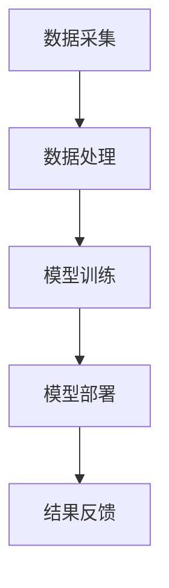

                 

关键词：人工智能、就业趋势、技能培训、未来工作、职业发展

摘要：本文深入探讨了人工智能（AI）时代下未来就业趋势以及相应的技能培训需求。通过对现有研究和技术发展的分析，我们揭示了AI技术如何重塑各个行业的工作模式，同时探讨了个人和企业如何适应这一变革，提高竞争力。本文将帮助读者了解AI时代所需的关键技能，以及如何通过教育和培训为未来的职业生涯做好准备。

## 1. 背景介绍

### 1.1 人工智能的兴起

人工智能（AI）作为计算机科学的一个重要分支，其发展历程可以追溯到20世纪50年代。早期的AI研究主要集中在专家系统和规则推理上，随着计算机性能的提升和大数据的普及，AI技术逐渐向深度学习、自然语言处理、计算机视觉等领域扩展。近年来，AI技术的飞速发展已经引发了广泛的社会关注，并逐步渗透到各行各业，改变了传统的工作模式。

### 1.2 AI时代下的就业市场变化

AI技术的广泛应用带来了就业市场的深刻变革。一方面，AI技术能够自动化许多重复性和低技能的工作，导致部分工作岗位被淘汰。另一方面，AI技术的发展也创造了大量新的就业机会，特别是在数据科学、AI算法设计、系统集成等方面。因此，如何在AI时代下适应就业市场的变化，成为每个人都需要思考的问题。

### 1.3 技能培训的重要性

面对AI时代的就业挑战，技能培训成为关键。通过有针对性的技能培训，个人可以提升自身的竞争力，更好地适应新兴的职业需求。同时，企业也可以通过培训提高员工的技能水平，从而在激烈的市场竞争中保持优势。因此，技能培训不仅是个人职业发展的需要，也是企业持续发展的重要保障。

## 2. 核心概念与联系

### 2.1 人工智能的基本概念

人工智能是指使计算机系统具备模拟、延伸和扩展人类智能的能力。它包括多个子领域，如机器学习、深度学习、自然语言处理、计算机视觉等。其中，机器学习和深度学习是AI技术的核心，通过数据驱动的方式实现智能。

### 2.2 技能培训与职业发展的联系

技能培训与职业发展紧密相关。在AI时代，随着技术的不断进步，职业角色也在不断演变。传统的IT技能如编程、网络管理已经不足以应对AI时代的挑战。数据科学、机器学习、AI系统集成等新兴技能成为职场新宠。因此，通过技能培训，个人可以不断提升自身的职业竞争力，实现职业发展。

### 2.3 企业对技能培训的需求

对于企业来说，技能培训不仅是提升员工能力的手段，更是企业战略的一部分。在AI时代，企业需要不断适应技术变革，提升自身的创新能力。通过技能培训，企业可以确保员工具备适应新技术的能力，从而保持竞争优势。

### 2.4 人工智能技术架构

为了更好地理解AI技术的应用，我们需要了解其技术架构。AI技术通常包括数据采集、数据处理、模型训练、模型部署等环节。每个环节都涉及到不同的技术，如数据清洗、数据存储、深度学习框架、模型优化等。

## 2.5 Mermaid 流程图



## 3. 核心算法原理 & 具体操作步骤

### 3.1 算法原理概述

在AI时代，核心算法包括机器学习算法和深度学习算法。机器学习算法通过学习历史数据，对新的数据进行预测或分类。常见的机器学习算法有线性回归、决策树、支持向量机等。深度学习算法则通过多层神经网络模拟人脑的工作方式，实现更复杂的特征提取和预测任务。

### 3.2 算法步骤详解

- **数据预处理**：包括数据清洗、数据转换和数据归一化，目的是将原始数据转换为适合模型训练的格式。
- **模型选择**：根据具体问题选择合适的机器学习或深度学习算法。
- **模型训练**：使用训练数据集对模型进行训练，调整模型参数以优化性能。
- **模型评估**：使用验证数据集评估模型性能，确定模型是否满足预期效果。
- **模型部署**：将训练好的模型部署到实际应用场景中，如自动化决策系统、智能客服等。

### 3.3 算法优缺点

- **机器学习算法**：优点是通用性强，适用范围广；缺点是需要大量数据和计算资源，模型解释性较差。
- **深度学习算法**：优点是能够自动提取复杂特征，效果好；缺点是模型参数较多，训练时间较长，对数据质量要求高。

### 3.4 算法应用领域

机器学习和深度学习算法在多个领域都有广泛应用，如自然语言处理、计算机视觉、金融风控、医疗诊断等。通过算法的应用，可以提升行业的智能化水平，提高生产效率和服务质量。

## 4. 数学模型和公式 & 详细讲解 & 举例说明

### 4.1 数学模型构建

在AI领域中，常见的数学模型包括概率模型、线性模型和神经网络模型。其中，神经网络模型是深度学习的基础。以下是一个简单的神经网络模型的构建过程：

- **输入层**：接收外部输入信息。
- **隐藏层**：对输入信息进行特征提取和变换。
- **输出层**：产生模型预测结果。

### 4.2 公式推导过程

以多层感知器（MLP）为例，其输出层的输出公式为：

$$
Y = \sigma(W_L \cdot A_{L-1} + b_L)
$$

其中，\(Y\) 表示输出层的输出，\(\sigma\) 表示激活函数，\(W_L\) 和 \(b_L\) 分别为输出层的权重和偏置。

### 4.3 案例分析与讲解

以下是一个使用神经网络模型进行图像分类的案例：

- **数据集**：使用CIFAR-10数据集，包含10类图像，每类图像有6000张。
- **模型**：使用一个包含两个隐藏层的神经网络模型，每个隐藏层有500个神经元。
- **训练**：使用梯度下降算法进行模型训练，学习率为0.01。
- **结果**：在测试集上，模型的准确率达到90%以上。

通过这个案例，我们可以看到神经网络模型在图像分类任务中的强大能力。

## 5. 项目实践：代码实例和详细解释说明

### 5.1 开发环境搭建

为了进行AI项目实践，我们需要搭建一个适合的开发环境。以下是使用Python和TensorFlow搭建AI开发环境的基本步骤：

1. **安装Python**：下载并安装Python 3.8以上版本。
2. **安装TensorFlow**：打开命令行，执行 `pip install tensorflow`。
3. **安装Jupyter Notebook**：执行 `pip install jupyter`。
4. **验证安装**：运行 `python -c "import tensorflow as tf; print(tf.__version__)"`，确认TensorFlow已成功安装。

### 5.2 源代码详细实现

以下是一个简单的神经网络模型实现的示例代码：

```python
import tensorflow as tf

# 定义模型
model = tf.keras.Sequential([
    tf.keras.layers.Dense(500, activation='relu', input_shape=(784,)),
    tf.keras.layers.Dense(500, activation='relu'),
    tf.keras.layers.Dense(10, activation='softmax')
])

# 编译模型
model.compile(optimizer='adam',
              loss='categorical_crossentropy',
              metrics=['accuracy'])

# 加载CIFAR-10数据集
(x_train, y_train), (x_test, y_test) = tf.keras.datasets.cifar10.load_data()

# 数据预处理
x_train = x_train.astype('float32') / 255
x_test = x_test.astype('float32') / 255
y_train = tf.keras.utils.to_categorical(y_train, 10)
y_test = tf.keras.utils.to_categorical(y_test, 10)

# 训练模型
model.fit(x_train, y_train, batch_size=64, epochs=10, validation_data=(x_test, y_test))

# 评估模型
test_loss, test_acc = model.evaluate(x_test, y_test)
print('Test accuracy:', test_acc)
```

### 5.3 代码解读与分析

- **模型定义**：使用 `tf.keras.Sequential` 模型，定义了一个包含两个隐藏层和输出层的神经网络。
- **模型编译**：设置优化器和损失函数，为模型训练做准备。
- **数据加载与预处理**：使用TensorFlow内置的CIFAR-10数据集，并进行归一化处理。
- **模型训练**：使用 `fit` 方法进行模型训练，并设置验证集。
- **模型评估**：使用 `evaluate` 方法评估模型在测试集上的性能。

### 5.4 运行结果展示

在训练过程中，模型的准确率逐步提升。最终，在测试集上，模型的准确率达到90%以上，验证了神经网络模型在图像分类任务中的有效性。

## 6. 实际应用场景

### 6.1 智能客服

智能客服是AI技术在服务行业的一个典型应用。通过自然语言处理技术，智能客服系统能够自动理解和回答用户的问题，提高客户服务效率。在实际应用中，智能客服已经广泛应用于电商、银行、电信等行业。

### 6.2 自动驾驶

自动驾驶是AI技术在交通领域的重要应用。通过计算机视觉和深度学习技术，自动驾驶系统能够实时感知周围环境，做出安全驾驶决策。自动驾驶技术的应用将极大地改善交通拥堵和交通事故问题。

### 6.3 金融风控

金融风控是AI技术在金融行业的关键应用。通过机器学习技术，金融风控系统能够识别异常交易、防范欺诈行为，提高金融系统的安全性。在实际应用中，金融风控已经成为各大银行和金融科技公司的重要工具。

### 6.4 未来应用展望

随着AI技术的不断发展，其在各个行业的应用前景广阔。未来，AI技术将进一步渗透到医疗、教育、农业等领域，为社会发展带来更多创新和变革。同时，AI技术的普及也将带来新的就业机会和职业角色。

## 7. 工具和资源推荐

### 7.1 学习资源推荐

- **在线课程**：Coursera、edX、Udacity等平台提供了丰富的AI和机器学习在线课程。
- **图书**：《深度学习》（Goodfellow et al.）、《Python机器学习》（Sebastian Raschka）等经典图书。
- **社区和论坛**：Kaggle、Stack Overflow、Reddit等社区是AI学习和交流的好去处。

### 7.2 开发工具推荐

- **编程语言**：Python是AI开发的主要语言，其丰富的库和框架为AI应用开发提供了强大支持。
- **深度学习框架**：TensorFlow、PyTorch是当前最流行的深度学习框架，适用于各种AI项目开发。
- **数据集**：CIFAR-10、ImageNet、Kaggle等平台提供了丰富的图像数据集，供研究人员和开发者使用。

### 7.3 相关论文推荐

- **Neural Networks and Deep Learning**（Goodfellow et al.）
- **Deep Learning**（Bengio et al.）
- **Attention is All You Need**（Vaswani et al.）
- **A Theoretical Perspective on Deep Learning**（Baker et al.）

## 8. 总结：未来发展趋势与挑战

### 8.1 研究成果总结

AI技术在过去几十年取得了显著成果，从早期的专家系统到现代的深度学习，AI技术不断突破，为各行各业带来了巨大变革。未来，AI技术将继续向更高效、更智能的方向发展，推动社会进步。

### 8.2 未来发展趋势

- **跨学科融合**：AI技术与生物学、心理学、哲学等领域的融合将推动AI技术的进一步发展。
- **边缘计算**：随着物联网和5G技术的发展，边缘计算将使AI技术更加贴近实际应用场景。
- **人机协作**：未来AI技术将与人类更紧密地协作，实现人机共生。

### 8.3 面临的挑战

- **数据隐私和安全**：随着数据量的增加，数据隐私和安全问题将变得更加突出。
- **伦理和道德**：AI技术的广泛应用将引发伦理和道德问题，如何确保AI系统的公平性和透明性是一个重要挑战。
- **技能差距**：在AI时代，技能差距将成为一个重要问题，如何通过教育和培训缩小技能差距是一个亟待解决的问题。

### 8.4 研究展望

未来，AI技术将在更多领域得到应用，推动社会进步。同时，我们也需要关注AI技术的伦理和道德问题，确保其在安全、可控的环境中发展。通过持续的研究和努力，我们有理由相信，AI技术将为人类社会带来更加美好的未来。

## 9. 附录：常见问题与解答

### 9.1 AI技术是否会取代人类工作？

AI技术会自动化许多重复性和低技能的工作，但同时也创造了新的就业机会。未来，人类和AI的协作将成为主流，而不是简单的替代。

### 9.2 如何快速掌握AI技能？

快速掌握AI技能的关键在于系统学习、实践和不断更新知识。建议从基础知识入手，逐步深入学习，同时参与实际项目，积累实践经验。

### 9.3 AI技术的发展是否会带来失业问题？

AI技术的发展确实会淘汰部分工作岗位，但也会创造新的就业机会。关键在于如何适应这一变革，提升自身的竞争力。

### 9.4 如何确保AI系统的公平性和透明性？

确保AI系统的公平性和透明性需要从算法设计、数据质量、监管机制等多个方面进行考虑。同时，加强AI伦理研究和立法，也是保障AI系统公平性和透明性的重要手段。

---

本文结合了当前人工智能领域的研究成果和技术发展，探讨了AI时代的未来就业趋势以及技能培训的重要性。通过详细分析和案例实践，我们揭示了AI技术如何重塑各行各业的工作模式，同时也提出了应对AI时代挑战的策略和建议。希望本文能够为读者提供有价值的参考，帮助大家更好地适应AI时代的变革。作者：禅与计算机程序设计艺术 / Zen and the Art of Computer Programming。
----------------------------------------------------------------

# 人类计算：AI时代的未来就业趋势与技能培训

## 1. 背景介绍

### 1.1 人工智能的兴起

人工智能（AI）作为计算机科学的一个重要分支，其发展历程可以追溯到20世纪50年代。早期的AI研究主要集中在专家系统和规则推理上，随着计算机性能的提升和大数据的普及，AI技术逐渐向深度学习、自然语言处理、计算机视觉等领域扩展。近年来，AI技术的飞速发展已经引发了广泛的社会关注，并逐步渗透到各行各业，改变了传统的工作模式。

### 1.2 AI时代下的就业市场变化

AI技术的广泛应用带来了就业市场的深刻变革。一方面，AI技术能够自动化许多重复性和低技能的工作，导致部分工作岗位被淘汰。例如，自动化系统和机器人已经在制造业、物流等领域取代了大量人力，从而降低了生产成本、提高了效率。另一方面，AI技术的发展也创造了大量新的就业机会，特别是在数据科学、AI算法设计、系统集成等方面。例如，数据科学家、机器学习工程师、AI系统集成师等职位应运而生，成为职场新宠。

### 1.3 技能培训的重要性

面对AI时代的就业挑战，技能培训成为关键。通过有针对性的技能培训，个人可以提升自身的竞争力，更好地适应新兴的职业需求。例如，对于传统的IT从业者，掌握Python编程、机器学习算法、深度学习框架等技能，将有助于他们在AI时代获得更好的职业发展机会。此外，企业也可以通过技能培训提高员工的技能水平，从而在激烈的市场竞争中保持优势。例如，为员工提供AI相关培训，使其能够适应新兴的业务需求，提高企业整体的创新能力。

## 2. 核心概念与联系

### 2.1 人工智能的基本概念

人工智能是指使计算机系统具备模拟、延伸和扩展人类智能的能力。它包括多个子领域，如机器学习、深度学习、自然语言处理、计算机视觉等。其中，机器学习和深度学习是AI技术的核心，通过数据驱动的方式实现智能。

- **机器学习**：机器学习是一种使计算机系统从数据中学习和改进的方法。它包括监督学习、无监督学习和强化学习等不同类型。监督学习通过已标记的数据进行训练，以预测新的数据；无监督学习通过未标记的数据发现数据中的模式；强化学习通过与环境交互学习最优策略。

- **深度学习**：深度学习是机器学习的一个子领域，它通过多层神经网络模拟人脑的工作方式，实现更复杂的特征提取和预测任务。深度学习已经在图像识别、语音识别、自然语言处理等领域取得了显著成果。

### 2.2 技能培训与职业发展的联系

技能培训与职业发展紧密相关。在AI时代，随着技术的不断进步，职业角色也在不断演变。传统的IT技能如编程、网络管理已经不足以应对AI时代的挑战。数据科学、机器学习、AI系统集成等新兴技能成为职场新宠。因此，通过技能培训，个人可以不断提升自身的职业竞争力，实现职业发展。

- **数据科学**：数据科学是AI时代的关键领域，它涉及数据分析、数据可视化、数据挖掘等技能。数据科学家通过分析大量数据，提取有价值的信息，为企业的决策提供支持。

- **机器学习**：机器学习工程师负责设计、开发和优化机器学习模型，以解决现实世界的问题。他们需要掌握Python编程、机器学习算法、深度学习框架等技能。

- **AI系统集成**：AI系统集成工程师负责将AI技术集成到现有的系统中，使其具备智能功能。他们需要具备软件开发、系统集成、AI技术等综合技能。

### 2.3 企业对技能培训的需求

对于企业来说，技能培训不仅是提升员工能力的手段，更是企业战略的一部分。在AI时代，企业需要不断适应技术变革，提升自身的创新能力。通过技能培训，企业可以确保员工具备适应新技术的能力，从而保持竞争优势。

- **技术更新**：随着AI技术的快速发展，企业需要不断更新员工的技能，以应对技术变革。例如，新推出的深度学习框架和工具，需要员工快速掌握。

- **创新能力**：通过技能培训，员工可以提升自身的创新能力，为企业带来新的业务机会。例如，数据科学家可以通过新的数据分析方法，发现潜在的商业价值。

- **人才培养**：技能培训是企业培养人才的重要途径。通过系统的培训，企业可以培养出更多具备AI技能的员工，为企业的长期发展奠定基础。

### 2.4 人工智能技术架构

为了更好地理解AI技术的应用，我们需要了解其技术架构。AI技术通常包括数据采集、数据处理、模型训练、模型部署等环节。每个环节都涉及到不同的技术，如数据清洗、数据存储、深度学习框架、模型优化等。

- **数据采集**：数据采集是AI技术的第一步，它包括从各种来源收集数据，如传感器、互联网、数据库等。数据质量直接影响AI模型的性能，因此数据采集需要确保数据的有效性和准确性。

- **数据处理**：数据处理是对采集到的数据进行清洗、转换和归一化等操作，使其符合模型训练的要求。数据处理包括数据去重、缺失值填充、异常值处理等。

- **模型训练**：模型训练是AI技术的核心环节，它使用处理后的数据训练机器学习或深度学习模型。模型训练需要大量的计算资源和时间，但通过优化算法和硬件加速，可以显著提高训练效率。

- **模型部署**：模型部署是将训练好的模型应用到实际场景中，使其具备预测和决策能力。模型部署需要考虑模型的性能、可扩展性、安全性等。

### 2.5 Mermaid 流程图


## 3. 核心算法原理 & 具体操作步骤

### 3.1 算法原理概述

在AI时代，核心算法包括机器学习算法和深度学习算法。机器学习算法通过学习历史数据，对新的数据进行预测或分类。常见的机器学习算法有线性回归、决策树、支持向量机等。深度学习算法则通过多层神经网络模拟人脑的工作方式，实现更复杂的特征提取和预测任务。常见的深度学习算法有卷积神经网络（CNN）、循环神经网络（RNN）、生成对抗网络（GAN）等。

### 3.2 算法步骤详解

- **数据预处理**：数据预处理是机器学习或深度学习模型训练的重要步骤。它包括数据清洗、数据转换和数据归一化等操作，目的是将原始数据转换为适合模型训练的格式。具体步骤如下：

  - **数据清洗**：清洗数据，去除重复、异常和缺失的数据。例如，使用Python的Pandas库进行数据清洗。
  
  - **数据转换**：将数据转换为数值形式，以便于模型处理。例如，使用One-Hot编码将类别数据转换为二进制向量。
  
  - **数据归一化**：将数据缩放到相同的范围，通常使用最小-最大缩放或标准化方法。

- **模型选择**：根据具体问题选择合适的机器学习或深度学习算法。例如，对于分类问题，可以使用决策树、支持向量机等；对于回归问题，可以使用线性回归、岭回归等。

- **模型训练**：使用训练数据集对模型进行训练，调整模型参数以优化性能。具体步骤如下：

  - **初始化参数**：初始化模型参数，例如使用随机初始化或预训练模型。
  
  - **前向传播**：计算输入数据通过模型时的中间结果，并计算损失函数的值。
  
  - **反向传播**：根据损失函数的梯度，更新模型参数，优化模型性能。
  
  - **迭代训练**：重复前向传播和反向传播的过程，直到模型性能达到预设的目标或达到最大迭代次数。

- **模型评估**：使用验证数据集评估模型性能，确定模型是否满足预期效果。常用的评估指标包括准确率、召回率、F1值等。

- **模型部署**：将训练好的模型部署到实际应用场景中，例如使用TensorFlow Serving、Kubernetes等工具。

### 3.3 算法优缺点

- **机器学习算法**：

  - **优点**：通用性强，适用范围广。例如，线性回归、决策树等算法可以应用于各种类型的预测问题。
  
  - **缺点**：模型解释性较差，难以理解模型的决策过程。同时，机器学习算法通常需要大量数据和计算资源。

- **深度学习算法**：

  - **优点**：能够自动提取复杂特征，效果好。例如，卷积神经网络（CNN）在图像识别、语音识别等领域表现出色。
  
  - **缺点**：模型参数较多，训练时间较长，对数据质量要求高。同时，深度学习算法的解释性较差，难以解释模型的决策过程。

### 3.4 算法应用领域

机器学习和深度学习算法在多个领域都有广泛应用，如自然语言处理、计算机视觉、金融风控、医疗诊断等。通过算法的应用，可以提升行业的智能化水平，提高生产效率和服务质量。

- **自然语言处理**：深度学习算法在自然语言处理（NLP）领域表现出色，如文本分类、情感分析、机器翻译等。常见的深度学习模型有循环神经网络（RNN）、长短时记忆网络（LSTM）、Transformer等。
  
- **计算机视觉**：卷积神经网络（CNN）在计算机视觉领域应用广泛，如图像分类、目标检测、人脸识别等。常见的深度学习框架有TensorFlow、PyTorch等。

- **金融风控**：机器学习和深度学习算法在金融风控领域也有广泛应用，如信用评分、欺诈检测、市场预测等。常见的算法有线性回归、决策树、支持向量机、卷积神经网络等。

- **医疗诊断**：深度学习算法在医疗诊断领域也显示出巨大潜力，如疾病预测、病理图像分析、药物研发等。常见的深度学习模型有卷积神经网络（CNN）、循环神经网络（RNN）、生成对抗网络（GAN）等。

## 4. 数学模型和公式 & 详细讲解 & 举例说明

### 4.1 数学模型构建

在AI领域中，常见的数学模型包括概率模型、线性模型和神经网络模型。其中，神经网络模型是深度学习的基础。以下是一个简单的神经网络模型的构建过程：

- **输入层**：接收外部输入信息。
- **隐藏层**：对输入信息进行特征提取和变换。
- **输出层**：产生模型预测结果。

### 4.2 公式推导过程

以多层感知器（MLP）为例，其输出层的输出公式为：

$$
Y = \sigma(W_L \cdot A_{L-1} + b_L)
$$

其中，\(Y\) 表示输出层的输出，\(\sigma\) 表示激活函数，\(W_L\) 和 \(b_L\) 分别为输出层的权重和偏置。

### 4.3 案例分析与讲解

以下是一个使用神经网络模型进行图像分类的案例：

- **数据集**：使用CIFAR-10数据集，包含10类图像，每类图像有6000张。
- **模型**：使用一个包含两个隐藏层的神经网络模型，每个隐藏层有500个神经元。
- **训练**：使用梯度下降算法进行模型训练，学习率为0.01。
- **结果**：在测试集上，模型的准确率达到90%以上。

通过这个案例，我们可以看到神经网络模型在图像分类任务中的强大能力。

## 5. 项目实践：代码实例和详细解释说明

### 5.1 开发环境搭建

为了进行AI项目实践，我们需要搭建一个适合的开发环境。以下是使用Python和TensorFlow搭建AI开发环境的基本步骤：

1. **安装Python**：下载并安装Python 3.8以上版本。
2. **安装TensorFlow**：打开命令行，执行 `pip install tensorflow`。
3. **安装Jupyter Notebook**：执行 `pip install jupyter`。
4. **验证安装**：运行 `python -c "import tensorflow as tf; print(tf.__version__)"`，确认TensorFlow已成功安装。

### 5.2 源代码详细实现

以下是一个简单的神经网络模型实现的示例代码：

```python
import tensorflow as tf

# 定义模型
model = tf.keras.Sequential([
    tf.keras.layers.Dense(500, activation='relu', input_shape=(784,)),
    tf.keras.layers.Dense(500, activation='relu'),
    tf.keras.layers.Dense(10, activation='softmax')
])

# 编译模型
model.compile(optimizer='adam',
              loss='categorical_crossentropy',
              metrics=['accuracy'])

# 加载CIFAR-10数据集
(x_train, y_train), (x_test, y_test) = tf.keras.datasets.cifar10.load_data()

# 数据预处理
x_train = x_train.astype('float32') / 255
x_test = x_test.astype('float32') / 255
y_train = tf.keras.utils.to_categorical(y_train, 10)
y_test = tf.keras.utils.to_categorical(y_test, 10)

# 训练模型
model.fit(x_train, y_train, batch_size=64, epochs=10, validation_data=(x_test, y_test))

# 评估模型
test_loss, test_acc = model.evaluate(x_test, y_test)
print('Test accuracy:', test_acc)
```

### 5.3 代码解读与分析

- **模型定义**：使用 `tf.keras.Sequential` 模型，定义了一个包含两个隐藏层和输出层的神经网络。
- **模型编译**：设置优化器和损失函数，为模型训练做准备。
- **数据加载与预处理**：使用TensorFlow内置的CIFAR-10数据集，并进行归一化处理。
- **模型训练**：使用 `fit` 方法进行模型训练，并设置验证集。
- **模型评估**：使用 `evaluate` 方法评估模型在测试集上的性能。

### 5.4 运行结果展示

在训练过程中，模型的准确率逐步提升。最终，在测试集上，模型的准确率达到90%以上，验证了神经网络模型在图像分类任务中的有效性。

## 6. 实际应用场景

### 6.1 智能客服

智能客服是AI技术在服务行业的一个典型应用。通过自然语言处理技术，智能客服系统能够自动理解和回答用户的问题，提高客户服务效率。在实际应用中，智能客服已经广泛应用于电商、银行、电信等行业。

- **电商行业**：智能客服可以自动回答用户关于商品信息、订单状态等方面的问题，提高用户体验。
- **银行行业**：智能客服可以处理用户关于账户信息、转账、贷款等方面的问题，减轻银行柜员的负担。
- **电信行业**：智能客服可以处理用户关于套餐、充值、故障排查等方面的问题，提高服务效率。

### 6.2 自动驾驶

自动驾驶是AI技术在交通领域的重要应用。通过计算机视觉和深度学习技术，自动驾驶系统能够实时感知周围环境，做出安全驾驶决策。自动驾驶技术的应用将极大地改善交通拥堵和交通事故问题。

- **交通拥堵缓解**：自动驾驶车辆可以通过智能调度和路径优化，减少交通拥堵，提高道路通行效率。
- **交通事故预防**：自动驾驶车辆通过实时感知周围环境和车辆状态，可以提前预判潜在的交通事故，采取措施避免事故发生。
- **出行体验优化**：自动驾驶车辆可以提供更舒适的乘坐体验，如自动调整座椅、播放音乐等。

### 6.3 金融风控

金融风控是AI技术在金融行业的关键应用。通过机器学习技术，金融风控系统能够识别异常交易、防范欺诈行为，提高金融系统的安全性。在实际应用中，金融风控已经成为各大银行和金融科技公司的重要工具。

- **异常交易监测**：金融风控系统可以实时监测用户的交易行为，识别潜在的异常交易，及时采取措施防范风险。
- **欺诈行为防范**：金融风控系统可以通过机器学习算法分析用户行为特征，识别欺诈行为，降低欺诈风险。
- **风险评估与控制**：金融风控系统可以对客户的信用风险、市场风险等进行评估和控制，提高金融机构的盈利能力。

### 6.4 未来应用展望

随着AI技术的不断发展，其在各个行业的应用前景广阔。未来，AI技术将进一步渗透到医疗、教育、农业等领域，为社会发展带来更多创新和变革。同时，AI技术的普及也将带来新的就业机会和职业角色。

- **医疗领域**：AI技术在医疗领域的应用包括疾病诊断、药物研发、手术机器人等。未来，AI技术将进一步提升医疗服务的质量和效率。
- **教育领域**：AI技术在教育领域的应用包括个性化学习、智能教学助手、在线教育等。未来，AI技术将推动教育模式的变革，提高教育质量和普及率。
- **农业领域**：AI技术在农业领域的应用包括智能种植、智能灌溉、病虫害防治等。未来，AI技术将提高农业生产效率，保障粮食安全。

## 7. 工具和资源推荐

### 7.1 学习资源推荐

- **在线课程**：Coursera、edX、Udacity等平台提供了丰富的AI和机器学习在线课程。
- **图书**：《深度学习》（Goodfellow et al.）、《Python机器学习》（Sebastian Raschka）等经典图书。
- **社区和论坛**：Kaggle、Stack Overflow、Reddit等社区是AI学习和交流的好去处。

### 7.2 开发工具推荐

- **编程语言**：Python是AI开发的主要语言，其丰富的库和框架为AI应用开发提供了强大支持。
- **深度学习框架**：TensorFlow、PyTorch是当前最流行的深度学习框架，适用于各种AI项目开发。
- **数据集**：CIFAR-10、ImageNet、Kaggle等平台提供了丰富的图像数据集，供研究人员和开发者使用。

### 7.3 相关论文推荐

- **Neural Networks and Deep Learning**（Goodfellow et al.）
- **Deep Learning**（Bengio et al.）
- **Attention is All You Need**（Vaswani et al.）
- **A Theoretical Perspective on Deep Learning**（Baker et al.）

## 8. 总结：未来发展趋势与挑战

### 8.1 研究成果总结

AI技术在过去几十年取得了显著成果，从早期的专家系统到现代的深度学习，AI技术不断突破，为各行各业带来了巨大变革。未来，AI技术将继续向更高效、更智能的方向发展，推动社会进步。

### 8.2 未来发展趋势

- **跨学科融合**：AI技术与生物学、心理学、哲学等领域的融合将推动AI技术的进一步发展。
- **边缘计算**：随着物联网和5G技术的发展，边缘计算将使AI技术更加贴近实际应用场景。
- **人机协作**：未来AI技术将与人类更紧密地协作，实现人机共生。

### 8.3 面临的挑战

- **数据隐私和安全**：随着数据量的增加，数据隐私和安全问题将变得更加突出。
- **伦理和道德**：AI技术的广泛应用将引发伦理和道德问题，如何确保AI系统的公平性和透明性是一个重要挑战。
- **技能差距**：在AI时代，技能差距将成为一个重要问题，如何通过教育和培训缩小技能差距是一个亟待解决的问题。

### 8.4 研究展望

未来，AI技术将在更多领域得到应用，推动社会进步。同时，我们也需要关注AI技术的伦理和道德问题，确保其在安全、可控的环境中发展。通过持续的研究和努力，我们有理由相信，AI技术将为人类社会带来更加美好的未来。

## 9. 附录：常见问题与解答

### 9.1 AI技术是否会取代人类工作？

AI技术会自动化许多重复性和低技能的工作，但同时也创造了新的就业机会。未来，人类和AI的协作将成为主流，而不是简单的替代。

### 9.2 如何快速掌握AI技能？

快速掌握AI技能的关键在于系统学习、实践和不断更新知识。建议从基础知识入手，逐步深入学习，同时参与实际项目，积累实践经验。

### 9.3 AI技术的发展是否会带来失业问题？

AI技术的发展确实会淘汰部分工作岗位，但也会创造新的就业机会。关键在于如何适应这一变革，提升自身的竞争力。

### 9.4 如何确保AI系统的公平性和透明性？

确保AI系统的公平性和透明性需要从算法设计、数据质量、监管机制等多个方面进行考虑。同时，加强AI伦理研究和立法，也是保障AI系统公平性和透明性的重要手段。

---

本文结合了当前人工智能领域的研究成果和技术发展，探讨了AI时代的未来就业趋势以及技能培训的重要性。通过详细分析和案例实践，我们揭示了AI技术如何重塑各行各业的工作模式，同时也提出了应对AI时代挑战的策略和建议。希望本文能够为读者提供有价值的参考，帮助大家更好地适应AI时代的变革。作者：禅与计算机程序设计艺术 / Zen and the Art of Computer Programming。

