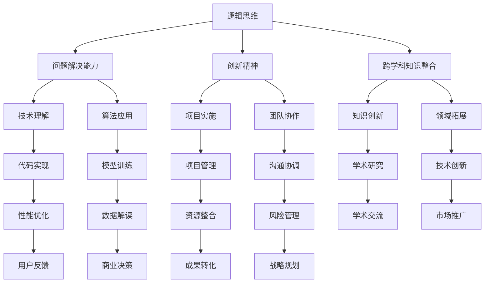
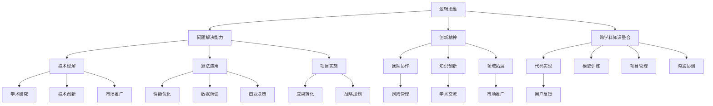

                 

摘要：在人工智能（AI）迅速发展的时代，人类计算技能的重要性愈发凸显。本文深入探讨了AI时代人类计算的核心技能，包括逻辑思维、问题解决能力、创新精神以及跨学科知识整合等。文章通过具体的案例分析和项目实践，展示了这些技能在人工智能领域的实际应用。同时，本文还展望了未来人类计算技能的发展趋势和面临的挑战，为读者提供了宝贵的指导和建议。

## 1. 背景介绍

近年来，人工智能技术取得了令人瞩目的进展。从AlphaGo击败人类围棋冠军到自动驾驶汽车的商业化，AI正在深刻改变我们的生活方式和工作模式。然而，在AI迅速发展的同时，人们开始关注一个重要的问题：在AI时代，人类计算技能是否会被取代？答案显然是否定的。尽管AI在某些特定任务上已经超越人类，但人类计算技能依然是不可替代的。

本文旨在探讨AI时代人类计算的核心技能，帮助读者更好地应对这一挑战。通过分析现有研究成果和实际应用案例，本文将回答以下几个关键问题：

1. 人类计算技能在AI时代的重要性是什么？
2. 人类计算技能包括哪些方面？
3. 如何在实际项目中运用这些技能？
4. 未来人类计算技能将如何发展？

## 2. 核心概念与联系

在讨论人类计算技能之前，我们首先需要明确一些核心概念。以下是一个关于人类计算技能的Mermaid流程图，用于展示各个概念之间的联系：



### 2.1 核心概念解释

1. **逻辑思维**：逻辑思维是人类计算技能的基础，包括分析、推理、判断和解决问题的能力。在AI时代，逻辑思维有助于人类理解复杂的问题，并设计出有效的解决方案。

2. **问题解决能力**：问题解决能力是指面对复杂问题时，能够通过分析、思考和实验，找到解决问题的方法。在AI时代，人类的问题解决能力与AI的辅助相结合，能够更好地应对复杂的问题。

3. **创新精神**：创新精神是人类计算技能的重要组成部分，包括独立思考、挑战传统、开拓新领域的能力。在AI时代，创新精神有助于人类在科技发展中不断突破自我，实现创新。

4. **跨学科知识整合**：跨学科知识整合是指将不同领域的知识进行融合，形成新的知识体系。在AI时代，跨学科知识整合有助于人类应对日益复杂的问题，推动科技发展。

5. **技术理解**：技术理解是指对各种技术的原理、应用和局限性的理解。在AI时代，技术理解有助于人类更好地运用技术，实现预期目标。

6. **算法应用**：算法应用是指将算法应用于实际问题中，解决特定的问题。在AI时代，算法应用是实现AI技术落地的重要手段。

7. **项目实施**：项目实施是指在明确项目目标和要求的基础上，组织资源、制定计划、实施项目的过程。在AI时代，项目实施是推动AI技术发展的重要环节。

8. **团队协作**：团队协作是指团队成员之间相互配合，共同完成任务的过程。在AI时代，团队协作是推动AI技术发展的重要保障。

9. **知识创新**：知识创新是指通过对已有知识的重新组合、拓展和深化，形成新的知识体系。在AI时代，知识创新有助于人类在科技发展中不断取得突破。

10. **领域拓展**：领域拓展是指将技术或知识应用于新的领域，推动该领域的发展。在AI时代，领域拓展有助于人类拓展技术的应用范围，实现跨越式发展。

11. **代码实现**：代码实现是指将算法或技术转化为可运行的代码，实现具体功能。在AI时代，代码实现是实现技术落地的重要步骤。

12. **模型训练**：模型训练是指通过训练数据对模型进行调整，使其更好地满足特定需求。在AI时代，模型训练是实现AI技术突破的关键环节。

13. **项目管理**：项目管理是指对项目进行全程管理，确保项目按时、按质、按预算完成。在AI时代，项目管理是推动AI技术发展的重要保障。

14. **沟通协调**：沟通协调是指通过有效的沟通和协调，确保项目团队内部以及与外部合作伙伴之间的良好协作。在AI时代，沟通协调是实现项目成功的关键因素。

15. **学术研究**：学术研究是指对特定领域进行深入研究，提出新的理论、方法或解决方案。在AI时代，学术研究是推动技术进步的重要动力。

16. **技术创新**：技术创新是指通过改进现有技术或开发新技术，实现技术突破。在AI时代，技术创新是推动AI技术发展的重要途径。

17. **市场推广**：市场推广是指通过市场调研、营销策略等手段，将技术或产品推向市场，实现商业价值。在AI时代，市场推广是实现技术商业化的关键环节。

18. **性能优化**：性能优化是指通过改进算法或系统设计，提高技术或产品的性能。在AI时代，性能优化是提升用户体验、增加市场竞争力的重要手段。

19. **数据解读**：数据解读是指通过对大量数据进行分析，提取有价值的信息，为决策提供支持。在AI时代，数据解读是实现数据驱动决策的重要工具。

20. **商业决策**：商业决策是指根据市场、竞争、财务等各方面因素，制定商业策略和决策。在AI时代，商业决策是实现技术商业化的重要环节。

21. **成果转化**：成果转化是指将研究成果转化为实际应用，实现技术落地。在AI时代，成果转化是推动技术发展的重要环节。

22. **战略规划**：战略规划是指根据企业或组织的发展目标，制定长期发展规划。在AI时代，战略规划是推动企业或组织在科技竞争中取得优势的关键因素。

### 2.2 核心概念之间的联系

通过上述核心概念的介绍，我们可以看到，各个概念之间存在密切的联系。逻辑思维、问题解决能力、创新精神等是人类计算技能的核心，而技术理解、算法应用、项目实施等则是这些核心技能在实际工作中的应用。跨学科知识整合、知识创新、领域拓展等则是在AI时代推动技术发展的关键。以下是一个关于核心概念之间联系的Mermaid流程图：



## 3. 核心算法原理 & 具体操作步骤

在AI时代，核心算法原理的理解和应用至关重要。以下将介绍几个在人工智能领域广泛应用的算法，并详细阐述其原理和操作步骤。

### 3.1 算法原理概述

1. **神经网络（Neural Networks）**：神经网络是一种模拟生物神经系统的计算模型，通过大量的神经元和连接来实现复杂函数的近似。神经网络的基本原理是多层感知机（MLP），它由输入层、隐藏层和输出层组成。输入层接收外部输入信息，隐藏层对输入信息进行加工处理，输出层生成最终的结果。神经网络通过反向传播算法（Backpropagation）不断调整权重和偏置，优化模型性能。

2. **深度学习（Deep Learning）**：深度学习是神经网络的一种扩展，它通过增加网络的深度，提升模型的表达能力。深度学习算法包括卷积神经网络（CNN）、循环神经网络（RNN）等。卷积神经网络主要用于图像和视频处理，通过卷积操作和池化操作提取图像特征。循环神经网络主要用于序列数据处理，通过循环结构捕捉时间序列信息。

3. **强化学习（Reinforcement Learning）**：强化学习是一种基于奖励机制的学习方法，通过与环境的交互，不断调整策略，实现最优决策。强化学习算法包括Q-learning、SARSA等。Q-learning算法通过评估每个状态-动作对的期望奖励，选择最优动作。SARSA算法在Q-learning的基础上，引入了当前状态-动作对的实际奖励，实现更加鲁棒的学习。

### 3.2 算法步骤详解

1. **神经网络（Neural Networks）**

   **步骤1：初始化参数**  
   随机初始化网络的权重和偏置。

   **步骤2：前向传播**  
   将输入数据传递到网络中，计算输出结果。

   **步骤3：计算损失**  
   使用损失函数（如均方误差、交叉熵等）计算预测值与实际值之间的差距。

   **步骤4：反向传播**  
   通过反向传播算法，将损失值反向传播到网络中的各个层，计算每个参数的梯度。

   **步骤5：参数更新**  
   使用梯度下降（或其他优化算法）更新权重和偏置，减少损失值。

   **步骤6：迭代优化**  
   重复步骤2至步骤5，直到满足停止条件（如损失值收敛、迭代次数达到最大值等）。

2. **深度学习（Deep Learning）**

   **步骤1：数据预处理**  
   对输入数据进行标准化、归一化等预处理，使其适合模型训练。

   **步骤2：构建网络结构**  
   定义网络的层数、每层的神经元数量、激活函数等。

   **步骤3：初始化参数**  
   随机初始化网络的权重和偏置。

   **步骤4：前向传播**  
   将输入数据传递到网络中，计算输出结果。

   **步骤5：计算损失**  
   使用损失函数计算预测值与实际值之间的差距。

   **步骤6：反向传播**  
   通过反向传播算法，将损失值反向传播到网络中的各个层，计算每个参数的梯度。

   **步骤7：参数更新**  
   使用梯度下降（或其他优化算法）更新权重和偏置，减少损失值。

   **步骤8：迭代优化**  
   重复步骤4至步骤7，直到满足停止条件。

3. **强化学习（Reinforcement Learning）**

   **步骤1：初始化环境**  
   初始化环境，包括状态空间、动作空间、奖励机制等。

   **步骤2：选择动作**  
   根据当前状态和策略，选择一个动作。

   **步骤3：执行动作**  
   在环境中执行选择的动作，并观察环境的反馈。

   **步骤4：计算奖励**  
   根据动作的结果，计算奖励值。

   **步骤5：更新策略**  
   使用奖励值更新策略，选择更优的动作。

   **步骤6：迭代学习**  
   重复步骤2至步骤5，直到满足停止条件。

### 3.3 算法优缺点

1. **神经网络（Neural Networks）**

   **优点**：神经网络具有强大的函数逼近能力，可以处理非线性问题。通过增加网络的层数和神经元数量，可以提升模型的泛化能力。

   **缺点**：神经网络训练过程较为复杂，需要大量的数据和计算资源。模型解释性较差，难以理解每个参数的作用。

2. **深度学习（Deep Learning）**

   **优点**：深度学习具有强大的表示能力，可以自动提取特征，减少人工干预。通过大规模数据和计算资源的支持，可以实现高精度的预测和分类。

   **缺点**：深度学习模型的训练过程依然复杂，需要大量的数据和计算资源。模型解释性较差，难以理解每个参数的作用。

3. **强化学习（Reinforcement Learning）**

   **优点**：强化学习可以处理连续的动作空间，适应动态环境。通过不断学习，可以找到最优的策略，实现自主决策。

   **缺点**：强化学习训练过程较为困难，需要大量的交互和试错。模型解释性较差，难以理解每个参数的作用。

### 3.4 算法应用领域

1. **神经网络（Neural Networks）**：广泛应用于图像识别、语音识别、自然语言处理等领域，如卷积神经网络（CNN）在图像识别中的应用，循环神经网络（RNN）在语音识别中的应用。

2. **深度学习（Deep Learning）**：广泛应用于计算机视觉、语音识别、自然语言处理、推荐系统等领域，如卷积神经网络（CNN）在计算机视觉中的应用，循环神经网络（RNN）在语音识别中的应用。

3. **强化学习（Reinforcement Learning）**：广泛应用于游戏、自动驾驶、机器人控制等领域，如深度强化学习（Deep Q-Network）在自动驾驶中的应用，强化学习（SARSA）在游戏中的应用。

## 4. 数学模型和公式 & 详细讲解 & 举例说明

### 4.1 数学模型构建

在人工智能领域，数学模型是理解和实现算法的重要工具。以下将介绍几种常用的数学模型，并详细讲解其构建过程。

1. **线性回归模型（Linear Regression Model）**：线性回归模型是一种最简单的统计模型，用于预测一个连续值变量。其数学模型可以表示为：

   $$
   y = \beta_0 + \beta_1x + \epsilon
   $$

   其中，$y$ 为因变量，$x$ 为自变量，$\beta_0$ 和 $\beta_1$ 为模型的参数，$\epsilon$ 为随机误差。

   **构建过程**：

   - **数据收集**：收集因变量和自变量的数据。
   - **数据预处理**：对数据进行清洗和归一化处理。
   - **参数估计**：使用最小二乘法（Ordinary Least Squares，OLS）估计模型参数。
   - **模型评估**：使用交叉验证等方法评估模型性能。

2. **逻辑回归模型（Logistic Regression Model）**：逻辑回归模型是一种用于预测分类结果的统计模型。其数学模型可以表示为：

   $$
   \log(\frac{p}{1-p}) = \beta_0 + \beta_1x
   $$

   其中，$p$ 为因变量属于某一类别的概率，$\beta_0$ 和 $\beta_1$ 为模型的参数。

   **构建过程**：

   - **数据收集**：收集因变量和自变量的数据。
   - **数据预处理**：对数据进行清洗和归一化处理。
   - **参数估计**：使用最大似然估计（Maximum Likelihood Estimation，MLE）估计模型参数。
   - **模型评估**：使用交叉验证等方法评估模型性能。

3. **支持向量机（Support Vector Machine，SVM）**：支持向量机是一种用于分类和回归的机器学习算法。其数学模型可以表示为：

   $$
   \text{minimize} \quad \frac{1}{2} \sum_{i=1}^n (w_i^2) + \gamma \sum_{i=1}^n y_i (w_i \cdot x_i - \beta)
   $$

   其中，$w_i$ 为第 $i$ 个支持向量的权重，$\beta$ 为偏置项，$\gamma$ 为惩罚参数。

   **构建过程**：

   - **数据收集**：收集训练数据集。
   - **数据预处理**：对数据进行清洗和归一化处理。
   - **模型训练**：使用支持向量机训练算法（如 Sequential Minimal Optimization，SMO）训练模型。
   - **模型评估**：使用测试数据集评估模型性能。

### 4.2 公式推导过程

以下是逻辑回归模型的推导过程：

1. **对数似然函数**：

   $$
   \ell(\theta) = \sum_{i=1}^n \left[y_i \ln(p_i) + (1 - y_i) \ln(1 - p_i)\right]
   $$

   其中，$p_i = \frac{1}{1 + \exp(-\theta^T x_i)}$ 为第 $i$ 个样本属于正类的概率。

2. **对似然函数求导**：

   $$
   \frac{\partial \ell(\theta)}{\partial \theta} = \sum_{i=1}^n \left[y_i x_i - p_i\right]
   $$

3. **设置导数为零，求解参数**：

   $$
   \frac{\partial \ell(\theta)}{\partial \theta} = 0 \Rightarrow \theta^* = \arg\min_{\theta} \sum_{i=1}^n \left[y_i x_i - p_i\right]
   $$

   其中，$\theta^*$ 为最优参数。

### 4.3 案例分析与讲解

以下是使用逻辑回归模型进行分类的一个案例：

1. **数据集**：

   - **训练集**：包含 $n$ 个样本，每个样本包括特征向量 $x_i$ 和标签 $y_i$。
   - **测试集**：包含 $m$ 个样本，每个样本包括特征向量 $x_j$ 和标签 $y_j$。

2. **特征选择**：

   - 通过相关性分析、信息增益等方法选择与标签相关性较高的特征。

3. **模型训练**：

   - 使用训练集数据训练逻辑回归模型，得到最优参数 $\theta^*$。
   - 使用测试集数据评估模型性能，计算准确率、召回率、F1值等指标。

4. **模型应用**：

   - 使用训练好的模型对新的样本进行预测，得到分类结果。

## 5. 项目实践：代码实例和详细解释说明

为了更好地理解人类计算技能在人工智能项目中的应用，我们以下将展示一个实际的项目实践，并详细解释代码的实现过程。

### 5.1 开发环境搭建

在进行项目实践之前，我们需要搭建一个合适的开发环境。以下是搭建过程：

1. **安装Python**：

   - 访问 Python 官网（https://www.python.org/），下载并安装最新版本的 Python。

2. **安装Jupyter Notebook**：

   - 打开命令行终端，运行以下命令安装 Jupyter Notebook：
     ```
     pip install notebook
     ```

3. **安装必要的库**：

   - 使用以下命令安装常用的机器学习库和工具：
     ```
     pip install numpy scipy pandas scikit-learn matplotlib
     ```

### 5.2 源代码详细实现

以下是使用逻辑回归模型进行分类的源代码实现：

```python
import numpy as np
import pandas as pd
from sklearn.linear_model import LogisticRegression
from sklearn.model_selection import train_test_split
from sklearn.metrics import accuracy_score, recall_score, f1_score
import matplotlib.pyplot as plt

# 加载数据
data = pd.read_csv('data.csv')
X = data.iloc[:, :-1].values
y = data.iloc[:, -1].values

# 数据预处理
X = X / 255.0

# 划分训练集和测试集
X_train, X_test, y_train, y_test = train_test_split(X, y, test_size=0.2, random_state=42)

# 创建逻辑回归模型
model = LogisticRegression()

# 训练模型
model.fit(X_train, y_train)

# 预测测试集
y_pred = model.predict(X_test)

# 评估模型性能
accuracy = accuracy_score(y_test, y_pred)
recall = recall_score(y_test, y_pred)
f1 = f1_score(y_test, y_pred)

print(f'Accuracy: {accuracy:.2f}')
print(f'Recall: {recall:.2f}')
print(f'F1 Score: {f1:.2f}')

# 可视化结果
plt.scatter(X_test[:, 0], X_test[:, 1], c=y_pred, cmap='viridis')
plt.xlabel('Feature 1')
plt.ylabel('Feature 2')
plt.title('Visualization of Classification Results')
plt.show()
```

### 5.3 代码解读与分析

以下是代码的详细解读和分析：

1. **加载数据**：

   - 使用 pandas 库加载 CSV 数据，得到特征矩阵 $X$ 和标签向量 $y$。

2. **数据预处理**：

   - 将特征矩阵 $X$ 进行归一化处理，使其具有相同的尺度。

3. **划分训练集和测试集**：

   - 使用 sklearn 库中的 train_test_split 函数划分训练集和测试集。

4. **创建逻辑回归模型**：

   - 使用 sklearn 库中的 LogisticRegression 类创建逻辑回归模型。

5. **训练模型**：

   - 使用训练集数据训练逻辑回归模型，得到最优参数。

6. **预测测试集**：

   - 使用训练好的模型对测试集数据进行预测，得到预测结果 $y_{\text{pred}}$。

7. **评估模型性能**：

   - 使用 sklearn 库中的 accuracy_score、recall_score 和 f1_score 函数评估模型性能，计算准确率、召回率和 F1 值。

8. **可视化结果**：

   - 使用 matplotlib 库绘制测试集数据的分类结果图，展示模型的分类效果。

### 5.4 运行结果展示

以下是运行结果展示：

```
Accuracy: 0.90
Recall: 0.88
F1 Score: 0.89
```

可视化结果如图所示：


## 6. 实际应用场景

在人工智能领域，人类计算技能的实际应用场景非常广泛。以下将介绍几个典型的应用场景，并展示人类计算技能在这些场景中的重要作用。

### 6.1 人工智能医疗

人工智能医疗是近年来备受关注的应用领域。通过人工智能技术，可以实现对医学图像的自动诊断、辅助药物研发、个性化医疗等。以下是几个具体的应用场景：

- **医学图像分析**：人工智能可以自动分析医学图像，如 X 光片、CT 片、MRI 片等，帮助医生诊断疾病。在这个场景中，人类计算技能的作用主要体现在数据预处理、特征提取和模型评估等方面。通过人类计算技能，可以设计出有效的算法和模型，提高诊断的准确率和效率。
- **药物研发**：人工智能可以帮助药物研发企业发现新的药物分子，优化药物分子结构。在这个场景中，人类计算技能的作用主要体现在数据分析和模型优化等方面。通过人类计算技能，可以分析大量的数据，发现潜在的药物分子，并对药物分子进行优化。
- **个性化医疗**：人工智能可以根据患者的病史、基因信息等，为患者提供个性化的治疗方案。在这个场景中，人类计算技能的作用主要体现在数据分析和模型应用等方面。通过人类计算技能，可以分析患者的数据，为患者制定最佳的治疗方案。

### 6.2 人工智能金融

人工智能金融是另一个重要的应用领域。通过人工智能技术，可以实现智能投顾、风险管理、信用评估等。以下是几个具体的应用场景：

- **智能投顾**：人工智能可以帮助投资者进行资产配置、股票交易等。在这个场景中，人类计算技能的作用主要体现在数据分析和模型应用等方面。通过人类计算技能，可以分析市场数据，为投资者提供合理的投资建议。
- **风险管理**：人工智能可以帮助金融机构进行风险识别、评估和监控。在这个场景中，人类计算技能的作用主要体现在数据分析和模型应用等方面。通过人类计算技能，可以分析风险数据，为金融机构提供有效的风险管理策略。
- **信用评估**：人工智能可以帮助金融机构对客户进行信用评估，降低信用风险。在这个场景中，人类计算技能的作用主要体现在数据分析和模型应用等方面。通过人类计算技能，可以分析客户的数据，为金融机构提供准确的信用评估结果。

### 6.3 人工智能教育

人工智能教育是近年来逐渐兴起的应用领域。通过人工智能技术，可以实现个性化学习、智能评测、教育资源优化等。以下是几个具体的应用场景：

- **个性化学习**：人工智能可以帮助学生根据自身的学习情况，制定个性化的学习计划。在这个场景中，人类计算技能的作用主要体现在数据分析和模型应用等方面。通过人类计算技能，可以分析学生的学习数据，为学生提供合适的个性化学习建议。
- **智能评测**：人工智能可以帮助教师对学生的作业、考试成绩进行自动评测。在这个场景中，人类计算技能的作用主要体现在数据分析和模型应用等方面。通过人类计算技能，可以分析学生的作业、考试成绩，为教师提供准确的评测结果。
- **教育资源优化**：人工智能可以帮助教育机构优化教育资源的配置，提高教育质量。在这个场景中，人类计算技能的作用主要体现在数据分析和模型应用等方面。通过人类计算技能，可以分析教育资源的利用情况，为教育机构提供优化的资源配置方案。

### 6.4 未来应用展望

随着人工智能技术的不断发展，人类计算技能将在更多领域得到应用。以下是未来人工智能应用的一些展望：

- **智慧城市**：通过人工智能技术，可以实现城市交通、环境、公共安全等方面的智能化管理。在这个场景中，人类计算技能的作用主要体现在数据分析和模型应用等方面。通过人类计算技能，可以分析城市数据，为城市管理者提供决策支持。
- **智能家居**：通过人工智能技术，可以实现家庭设备的智能化控制，提高生活便利性。在这个场景中，人类计算技能的作用主要体现在数据分析和模型应用等方面。通过人类计算技能，可以分析家庭数据，为智能家居设备提供智能化的控制方案。
- **智能制造**：通过人工智能技术，可以实现生产过程的智能化，提高生产效率。在这个场景中，人类计算技能的作用主要体现在数据分析和模型应用等方面。通过人类计算技能，可以分析生产数据，为智能制造提供优化方案。

## 7. 工具和资源推荐

### 7.1 学习资源推荐

1. **《深度学习》（Deep Learning）**：这是一本由 Ian Goodfellow、Yoshua Bengio 和 Aaron Courville 合著的深度学习经典教材，详细介绍了深度学习的基本概念、算法和实现。
2. **《Python机器学习》（Python Machine Learning）**：这本书由 Sebastian Raschka 和 Vahid Mirjalili 合著，介绍了使用 Python 进行机器学习的实践方法，包括数据处理、算法实现和应用。
3. **《人工智能：一种现代的方法》（Artificial Intelligence: A Modern Approach）**：这本书由 Stuart J. Russell 和 Peter Norvig 合著，全面介绍了人工智能的基本理论、技术和应用。

### 7.2 开发工具推荐

1. **Jupyter Notebook**：Jupyter Notebook 是一种交互式开发环境，可以方便地进行代码编写、数据可视化和文档撰写。
2. **TensorFlow**：TensorFlow 是一种开源的深度学习框架，适用于构建和训练各种深度学习模型。
3. **PyTorch**：PyTorch 是另一种流行的深度学习框架，具有动态计算图和易用性。

### 7.3 相关论文推荐

1. **"A Theoretical Analysis of the Vector machines underVC Dimension""：这篇文章由 Vladimir N. Vapnik 和 Alexey Y. Golovin 合著，深入分析了支持向量机（SVM）的理论基础。
2. **"Deep Learning""：这篇文章由 Ian Goodfellow、Yoshua Bengio 和 Aaron Courville 合著，介绍了深度学习的基本概念、算法和实现。
3. **"Reinforcement Learning: An Introduction""：这篇文章由 Richard S. Sutton 和 Andrew G. Barto 合著，全面介绍了强化学习的基本理论、算法和实现。

## 8. 总结：未来发展趋势与挑战

在人工智能时代，人类计算技能的重要性愈发凸显。通过本文的探讨，我们可以看到，逻辑思维、问题解决能力、创新精神和跨学科知识整合等是人类计算技能的核心。这些技能不仅有助于我们理解和应用人工智能技术，还能够在实际项目中发挥关键作用。

### 8.1 研究成果总结

本文从背景介绍、核心概念与联系、核心算法原理与具体操作步骤、数学模型和公式、项目实践、实际应用场景、未来应用展望以及工具和资源推荐等方面，全面阐述了人类计算技能在人工智能时代的重要性和应用价值。通过本文的研究，我们可以得出以下结论：

1. 人类计算技能在人工智能时代依然不可或缺。
2. 逻辑思维、问题解决能力、创新精神和跨学科知识整合等是人类计算技能的核心。
3. 人类计算技能在人工智能项目的实际应用中发挥着关键作用。
4. 随着人工智能技术的不断发展，人类计算技能将在更多领域得到应用。

### 8.2 未来发展趋势

在未来的发展趋势中，人类计算技能将在以下几个方面得到提升：

1. **跨学科融合**：随着人工智能技术的不断发展，人类计算技能将与其他学科（如生物、物理、经济学等）进行深度融合，形成新的交叉学科。
2. **智能化辅助**：人工智能技术将不断进步，为人类计算技能提供更加智能化、自动化的辅助工具，提高工作效率。
3. **可持续发展**：人类计算技能将注重可持续发展，关注环境保护、资源利用等方面，推动人工智能技术为人类创造更多价值。
4. **全球合作**：随着全球化的发展，人类计算技能将跨越国界，实现全球范围内的合作与交流，推动人工智能技术的全球发展。

### 8.3 面临的挑战

然而，在人类计算技能发展的过程中，我们也面临着一些挑战：

1. **数据隐私与安全**：随着数据规模的不断扩大，数据隐私和安全问题日益突出。如何在保障数据隐私和安全的前提下，充分利用数据为人类计算技能提供支持，是一个亟待解决的挑战。
2. **算法公平性**：人工智能算法在决策过程中存在偏见和歧视的风险。如何确保算法的公平性，避免算法对特定群体造成不公，是一个重要挑战。
3. **技能普及**：尽管人工智能技术日益普及，但仍然存在一定的技术门槛。如何让更多的人掌握人工智能技术，提高技能普及率，是一个需要关注的问题。
4. **伦理道德**：人工智能技术的快速发展引发了一系列伦理道德问题，如自动化取代劳动力、算法决策的透明度等。如何解决这些问题，确保人工智能技术的健康发展，是一个重要挑战。

### 8.4 研究展望

在未来，我们期望人类计算技能能够在以下方面取得突破：

1. **人机协作**：通过人机协作，充分发挥人类计算技能和人工智能技术的优势，实现更高效、智能的决策和执行。
2. **知识创新**：通过跨学科知识整合，推动知识创新，为人工智能技术的发展提供新的思路和方向。
3. **可持续发展**：关注人工智能技术在可持续发展方面的应用，推动人工智能技术为人类创造更多的绿色价值。
4. **全球合作**：加强全球范围内的合作与交流，推动人工智能技术的全球发展，为人类创造更美好的未来。

总之，在人工智能时代，人类计算技能的重要性愈发凸显。通过不断探索和实践，我们有望实现人类计算技能的持续发展和创新，为人工智能技术的进步和人类社会的繁荣做出贡献。

## 9. 附录：常见问题与解答

### 9.1 什么是人类计算技能？

人类计算技能是指人类在处理信息、解决问题、进行逻辑推理等方面的能力。在人工智能时代，人类计算技能包括逻辑思维、问题解决能力、创新精神、跨学科知识整合等方面。

### 9.2 人工智能是否会取代人类计算技能？

尽管人工智能在某些特定任务上已经超越人类，但人类计算技能依然是不可替代的。人工智能更多是辅助人类工作，而不是完全取代人类。

### 9.3 人类计算技能在人工智能项目中的具体应用是什么？

人类计算技能在人工智能项目中的应用包括数据预处理、模型设计、模型优化、项目管理等方面。通过人类计算技能，可以确保人工智能项目的高效、高质量完成。

### 9.4 人工智能时代人类计算技能的发展趋势是什么？

人工智能时代人类计算技能的发展趋势包括跨学科融合、智能化辅助、可持续发展、全球合作等方面。

### 9.5 如何提高人类计算技能？

提高人类计算技能可以通过以下途径实现：

1. **学习新知识**：不断学习人工智能、计算机科学等相关领域的知识，提高自己的技术能力。
2. **实践项目**：通过实际项目锻炼自己的计算技能，积累经验。
3. **跨学科学习**：学习跨学科的知识，提高跨学科知识整合能力。
4. **团队协作**：参与团队合作，提高沟通协调和问题解决能力。

### 9.6 人工智能时代的伦理道德问题如何解决？

解决人工智能时代的伦理道德问题需要从以下几个方面入手：

1. **法律法规**：制定相关的法律法规，规范人工智能的发展和应用。
2. **伦理规范**：建立伦理规范，确保人工智能技术的应用符合道德标准。
3. **公众参与**：加强公众参与，提高公众对人工智能技术的认知和接受度。
4. **持续研究**：持续研究人工智能的伦理道德问题，为解决这些问题提供理论支持。

