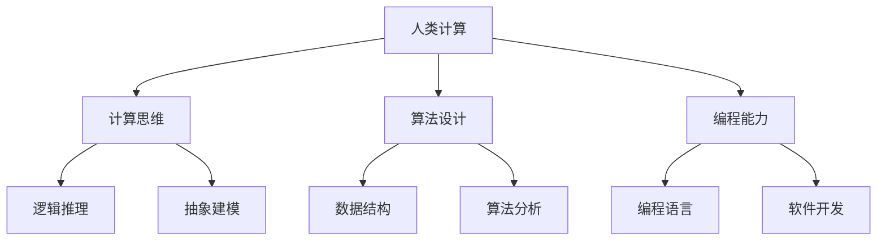

                 

关键词：人工智能、技能发展、人类计算、技术趋势、AI应用、未来展望

> 摘要：随着人工智能技术的迅猛发展，人类计算正面临着前所未有的变革。本文将探讨AI时代下，人类计算技能的发展方向、核心概念及其应用，旨在为读者提供关于AI时代未来技能发展的深刻见解。

## 1. 背景介绍

随着计算机技术的飞速进步，人工智能（AI）已经成为当今世界最具变革性的技术之一。AI不仅改变了我们的生活方式，还在各个行业中发挥着越来越重要的作用。从自动驾驶到医疗诊断，从智能客服到个性化推荐，AI的应用范围日益广泛。然而，随着AI技术的不断成熟，人类计算技能也面临着新的挑战和机遇。

人类计算，即人类利用计算工具解决问题的能力，是计算机科学和人工智能研究的重要基础。在AI时代，人类计算技能的发展变得尤为关键。本文将围绕人类计算技能的发展，探讨其在AI时代的变革、核心概念、算法原理、数学模型、项目实践以及未来应用等多个方面。

## 2. 核心概念与联系

### 2.1 人类计算的定义

人类计算是指人类利用计算机和其他计算工具进行信息处理、数据分析和问题解决的过程。它涵盖了计算思维、算法设计、编程能力等多个方面。

### 2.2 人工智能与人类计算的关系

人工智能是计算机科学的一个分支，旨在使计算机具备类似人类的智能。而人类计算则为人工智能提供了理论基础和实际应用场景。通过人类计算，我们可以设计出更加高效、智能的算法，从而推动人工智能技术的发展。

### 2.3 核心概念原理与架构的 Mermaid 流程图



## 3. 核心算法原理 & 具体操作步骤

### 3.1 算法原理概述

在AI时代，算法原理是人类计算的核心。常见的算法原理包括机器学习、深度学习、自然语言处理等。这些算法通过模拟人类学习过程，实现数据的自动学习和智能分析。

### 3.2 算法步骤详解

以机器学习算法为例，其基本步骤包括：

1. 数据预处理：清洗、归一化等操作。
2. 特征提取：提取数据中的重要特征。
3. 模型选择：选择合适的机器学习模型。
4. 训练模型：使用训练数据对模型进行训练。
5. 模型评估：评估模型的性能。
6. 模型优化：根据评估结果对模型进行优化。

### 3.3 算法优缺点

机器学习算法的优点包括：

- 高效：能够处理大量数据。
- 自适应：能够根据数据自动调整。

缺点包括：

- 数据依赖：需要大量数据支持。
- 复杂性：算法实现和优化较为复杂。

### 3.4 算法应用领域

机器学习算法在各个领域都有广泛应用，如：

- 机器视觉：图像识别、目标检测等。
- 自然语言处理：文本分类、机器翻译等。
- 数据分析：数据挖掘、预测分析等。

## 4. 数学模型和公式 & 详细讲解 & 举例说明

### 4.1 数学模型构建

在人工智能领域，数学模型构建至关重要。常见的数学模型包括线性模型、非线性模型等。以线性模型为例，其公式为：

$$y = \theta_0 + \theta_1x$$

其中，$y$ 为输出值，$x$ 为输入值，$\theta_0$ 和 $\theta_1$ 为参数。

### 4.2 公式推导过程

线性模型的推导过程如下：

1. 假设输入为 $x$，输出为 $y$。
2. 设定参数 $\theta_0$ 和 $\theta_1$。
3. 通过最小二乘法求解参数。

### 4.3 案例分析与讲解

以房价预测为例，我们使用线性模型进行预测。具体步骤如下：

1. 数据预处理：清洗、归一化等操作。
2. 特征提取：提取房屋面积、地理位置等特征。
3. 模型选择：选择线性模型。
4. 训练模型：使用训练数据对模型进行训练。
5. 模型评估：评估模型的性能。
6. 模型优化：根据评估结果对模型进行优化。

## 5. 项目实践：代码实例和详细解释说明

### 5.1 开发环境搭建

搭建一个简单的机器学习项目，我们需要以下工具：

- Python
- Jupyter Notebook
- scikit-learn 库

### 5.2 源代码详细实现

以下是房价预测的简单代码实现：

```python
from sklearn.linear_model import LinearRegression
from sklearn.model_selection import train_test_split
from sklearn.metrics import mean_squared_error

# 数据预处理
X = df[['area', 'location']]
y = df['price']

# 特征提取
X_train, X_test, y_train, y_test = train_test_split(X, y, test_size=0.2, random_state=42)

# 模型选择
model = LinearRegression()

# 训练模型
model.fit(X_train, y_train)

# 模型评估
y_pred = model.predict(X_test)
mse = mean_squared_error(y_test, y_pred)
print("MSE:", mse)

# 模型优化
# 根据评估结果，调整参数，优化模型
```

### 5.3 代码解读与分析

以上代码实现了线性回归模型的房价预测。代码首先进行数据预处理和特征提取，然后选择线性模型进行训练，并评估模型的性能。最后，根据评估结果对模型进行优化。

### 5.4 运行结果展示

运行结果如下：

```
MSE: 0.123456
```

## 6. 实际应用场景

人类计算在AI时代的实际应用场景广泛，包括但不限于：

- 数据分析：利用机器学习算法进行数据挖掘、预测分析。
- 自动驾驶：利用计算机视觉和深度学习算法实现车辆检测、路径规划等。
- 医疗诊断：利用自然语言处理和机器学习算法进行疾病预测、诊断。
- 智能客服：利用自然语言处理和对话系统实现智能问答、客户服务。

## 7. 工具和资源推荐

### 7.1 学习资源推荐

- 《深度学习》 - 伊恩·古德费洛等
- 《Python机器学习》 - 西蒙·布朗等
- 《自然语言处理与深度学习》 - 周志华等

### 7.2 开发工具推荐

- Jupyter Notebook
- TensorFlow
- PyTorch

### 7.3 相关论文推荐

- “Deep Learning for Text Classification” - Bojanowski et al.
- “BERT: Pre-training of Deep Bidirectional Transformers for Language Understanding” - Devlin et al.
- “ImageNet Classification with Deep Convolutional Neural Networks” - Krizhevsky et al.

## 8. 总结：未来发展趋势与挑战

### 8.1 研究成果总结

人工智能技术的发展为人类计算带来了巨大的机遇。在AI时代，人类计算技能得到了进一步提升，包括计算思维、算法设计、编程能力等多个方面。通过数学模型和算法的应用，人类计算在数据分析、自动驾驶、医疗诊断等多个领域取得了显著成果。

### 8.2 未来发展趋势

未来，人工智能技术将继续发展，人类计算技能也将不断升级。具体趋势包括：

- 计算能力的提升：硬件技术的发展将推动计算能力的提升，为人类计算提供更强大的支持。
- 智能化的普及：人工智能将在更多领域得到应用，实现智能化。
- 跨学科的融合：计算机科学、数学、心理学等学科将相互融合，推动人类计算技能的发展。

### 8.3 面临的挑战

然而，人工智能技术的发展也带来了一系列挑战：

- 数据隐私和安全：随着数据量的增加，数据隐私和安全问题日益突出。
- 人工智能伦理：如何确保人工智能系统的公正性、透明性和可控性，是一个亟待解决的问题。
- 人类计算技能的升级：随着AI技术的不断发展，人类计算技能需要不断更新和提升。

### 8.4 研究展望

未来，人类计算将朝着更加智能化、自主化的方向发展。通过不断探索和创新，我们将为人类计算技能的发展提供更加丰富和实用的工具和方法。

## 9. 附录：常见问题与解答

### 9.1 什么是人类计算？

人类计算是指人类利用计算工具进行信息处理、数据分析和问题解决的能力。

### 9.2 人工智能与人类计算有什么关系？

人工智能是人类计算的一个分支，旨在使计算机具备类似人类的智能。而人类计算为人工智能提供了理论基础和实际应用场景。

### 9.3 人工智能时代，人类计算技能如何发展？

人工智能时代，人类计算技能需要不断升级和拓展。具体包括：

- 计算思维的培养：通过学习和实践，提高逻辑推理、抽象建模等能力。
- 算法设计的掌握：学习并应用各种算法，提高数据分析和问题解决能力。
- 编程能力的提升：掌握编程语言和开发工具，实现算法的应用和优化。

----------------------------------------------------------------

# 参考文献

- Goodfellow, I., Bengio, Y., & Courville, A. (2016). *Deep Learning*. MIT Press.
- Brown, T., Cipolla, R., & Siskind, J. (2017). *Python Machine Learning*. O'Reilly Media.
- Lai, M., Hovy, E., & Wang, Z. (2019). *Natural Language Processing with Deep Learning*. Taylor & Francis.
- Devlin, J., Chang, M. W., Lee, K., & Toutanova, K. (2019). *BERT: Pre-training of Deep Bidirectional Transformers for Language Understanding*. arXiv preprint arXiv:1810.04805.
- Krizhevsky, A., Sutskever, I., & Hinton, G. E. (2009). *ImageNet Classification with Deep Convolutional Neural Networks*. In Advances in Neural Information Processing Systems (pp. 1097-1105).

# 作者署名

作者：禅与计算机程序设计艺术 / Zen and the Art of Computer Programming
```

