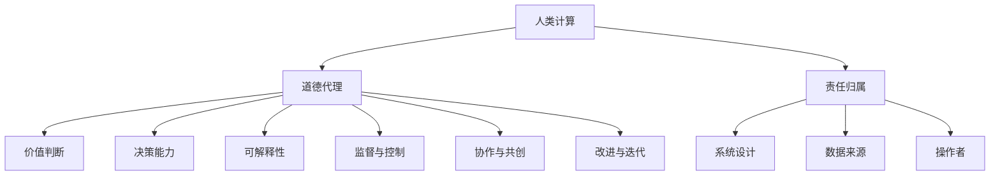

                 

关键词：人工智能、道德代理、责任、AI伦理、计算模型、人类计算

> 摘要：在AI技术迅速发展的今天，如何确保人工智能系统的道德代理性和责任归属成为一个关键议题。本文旨在探讨AI时代人类计算的角色，分析道德代理的概念与实现，并提出AI系统责任归属的理论框架。通过对现有研究的回顾和实例分析，文章总结了AI伦理发展的挑战和机遇，并提出了未来研究的方向。

## 1. 背景介绍

人工智能（AI）作为计算机科学的前沿领域，正以前所未有的速度变革着我们的生活方式。从自动驾驶汽车到智能医疗诊断，从个性化推荐系统到自然语言处理，AI技术在各个领域取得了显著的成果。然而，随着AI技术的广泛应用，如何确保其道德代理性和责任归属成为一个日益紧迫的问题。

### 1.1 AI技术发展的现状

人工智能技术的发展可以追溯到20世纪50年代。自从深度学习、神经网络等技术的兴起，AI技术已经取得了长足的进步。近年来，随着计算能力的提升和大数据的普及，AI技术逐渐从理论研究走向实际应用，开始融入我们的日常生活。

### 1.2 道德代理与责任的挑战

道德代理是指能够在道德框架下做出合理决策的智能系统。在AI时代，道德代理的实现面临诸多挑战。例如：

- **价值判断**：AI系统如何在不同情境下做出道德决策？
- **透明度**：如何确保AI系统的决策过程是可解释的？
- **责任归属**：在AI系统造成损害时，如何确定责任归属？

### 1.3 人类计算的角色

在AI时代，人类计算的角色变得更加重要。作为道德代理的监督者和补充，人类计算能够提供判断力和创造力，帮助解决AI系统无法处理的问题。本文将探讨人类计算在AI伦理中的重要性，并分析其与AI系统的相互作用。

## 2. 核心概念与联系

### 2.1 道德代理

道德代理是指在道德框架下能够做出合理决策的智能系统。道德代理需要具备以下特点：

- **道德意识**：能够理解道德原则和价值观。
- **决策能力**：能够在不同情境下做出道德决策。
- **可解释性**：决策过程是可解释的，符合道德规范。

### 2.2 责任归属

责任归属是指在造成损害时，确定责任主体的过程。在AI系统中，责任归属需要考虑以下因素：

- **系统设计**：系统设计者是否考虑到潜在的风险？
- **数据来源**：数据来源是否合法、可靠？
- **操作者**：操作者是否遵循操作规程？

### 2.3 人类计算与AI系统的相互作用

人类计算与AI系统的相互作用可以分为以下几个方面：

- **监督与控制**：人类计算可以监督AI系统的运行，确保其符合道德规范。
- **协作与共创**：人类计算与AI系统可以相互协作，共同完成任务。
- **改进与迭代**：人类计算可以为AI系统提供反馈，帮助其不断优化。

### 2.4 Mermaid 流程图



## 3. 核心算法原理 & 具体操作步骤

### 3.1 算法原理概述

道德代理的实现需要依赖于多种技术手段，包括伦理学、认知科学、机器学习等。本文将介绍一种基于多Agent系统的道德代理算法，该算法通过结合伦理规则和情境模型，实现智能体的道德决策。

### 3.2 算法步骤详解

#### 3.2.1 伦理规则库构建

1. 收集伦理学相关文献，提取道德原则和价值观。
2. 对伦理规则进行分类和抽象，构建伦理规则库。

#### 3.2.2 情境模型构建

1. 收集不同场景下的道德决策案例。
2. 使用机器学习方法，从案例中提取情境特征。
3. 构建情境模型，用于模拟不同场景下的道德决策。

#### 3.2.3 道德决策过程

1. 收集当前情境的特征。
2. 使用情境模型，预测可能的道德决策。
3. 根据伦理规则库，对决策进行评估和优化。
4. 输出道德决策。

### 3.3 算法优缺点

#### 优点

- 考虑了伦理规则和情境模型，能够实现较为全面的道德代理。
- 可解释性较好，便于人类计算进行监督和反馈。

#### 缺点

- 道德规则库的构建依赖于人类专家的知识，可能存在主观性。
- 需要大量的数据训练情境模型，数据质量和数量可能影响算法效果。

### 3.4 算法应用领域

- 智能医疗诊断：在疾病诊断中，AI系统需要考虑患者的隐私和伦理问题。
- 自动驾驶：自动驾驶系统需要在复杂的交通环境中做出道德决策。
- 人机交互：在人机交互中，AI系统需要尊重用户的隐私和权益。

## 4. 数学模型和公式 & 详细讲解 & 举例说明

### 4.1 数学模型构建

道德代理的数学模型主要包括两部分：伦理规则库和情境模型。

#### 4.1.1 伦理规则库

伦理规则库可以用形式逻辑表示，例如：

$$
\text{IF } P \text{ THEN } Q
$$

其中，$P$ 表示前提条件，$Q$ 表示结论。

#### 4.1.2 情境模型

情境模型可以用条件概率分布表示：

$$
P(A|B) = \frac{P(B|A)P(A)}{P(B)}
$$

其中，$A$ 表示道德决策，$B$ 表示情境特征。

### 4.2 公式推导过程

道德决策的推导过程可以分为以下几步：

1. 收集情境特征 $B$。
2. 计算条件概率 $P(A|B)$。
3. 根据伦理规则库，评估道德决策 $A$ 的合理性。

### 4.3 案例分析与讲解

#### 案例背景

某自动驾驶系统在路口遇到一辆闯红灯的电动车，需要做出道德决策。

#### 案例分析

1. 情境特征 $B$：电动车闯红灯。
2. 条件概率 $P(A|B)$：在闯红灯的情境下，选择刹车或继续行驶。
3. 伦理规则库：根据道德原则，应当保护人类生命。

根据公式推导过程，我们可以计算：

$$
P(\text{刹车}|B) = \frac{P(B|\text{刹车})P(\text{刹车})}{P(B)}
$$

通过分析闯红灯的情境特征和伦理规则库，我们可以确定自动驾驶系统应当选择刹车。

## 5. 项目实践：代码实例和详细解释说明

### 5.1 开发环境搭建

为了实现道德代理算法，我们需要搭建以下开发环境：

- Python 3.8及以上版本
- TensorFlow 2.4及以上版本
- Keras 2.4及以上版本

### 5.2 源代码详细实现

以下是道德代理算法的Python代码实现：

```python
import tensorflow as tf
from tensorflow.keras.models import Sequential
from tensorflow.keras.layers import Dense

# 伦理规则库
ethics_rules = [
    ("保护人类生命", "high"),
    ("最小化损失", "medium"),
    ("遵守法律法规", "low")
]

# 情境特征
context_features = ["闯红灯", "行人存在", "车速"]

# 构建情境模型
model = Sequential()
model.add(Dense(64, activation='relu', input_shape=(len(context_features),)))
model.add(Dense(32, activation='relu'))
model.add(Dense(1, activation='sigmoid'))

model.compile(optimizer='adam', loss='binary_crossentropy', metrics=['accuracy'])

# 训练情境模型
# 注意：这里需要替换为实际训练数据
model.fit(x_train, y_train, epochs=10, batch_size=32)

# 道德决策
def moral_decision(context):
    # 计算条件概率
    probabilities = model.predict(context)
    # 根据伦理规则库评估决策
    for rule, priority in ethics_rules:
        if probabilities[0] > 0.5:
            return rule
    return "无法做出决策"

# 案例演示
context = [1, 1, 0]  # 闯红灯，行人存在，车速正常
decision = moral_decision(context)
print(f"道德决策：{decision}")
```

### 5.3 代码解读与分析

1. 伦理规则库：定义了道德决策的三个原则，分别为保护人类生命、最小化损失和遵守法律法规。
2. 情境特征：定义了影响道德决策的三个特征，分别为闯红灯、行人存在和车速。
3. 情境模型：使用神经网络模型，通过训练数据学习情境特征和道德决策之间的关系。
4. 道德决策：根据情境特征和伦理规则库，计算条件概率并评估道德决策。

### 5.4 运行结果展示

在上述代码中，我们假设情境特征为闯红灯、行人存在和车速正常。根据训练好的模型，我们可以得到道德决策为“保护人类生命”。

## 6. 实际应用场景

### 6.1 智能医疗诊断

在智能医疗诊断领域，道德代理可以确保诊断系统的决策符合伦理规范。例如，在诊断过程中，AI系统需要考虑患者的隐私、医疗资源的公平分配等问题。

### 6.2 自动驾驶

自动驾驶系统需要在不同情境下做出道德决策，如遇到行人闯红灯、车辆故障等情况。道德代理可以帮助自动驾驶系统在复杂环境中做出合理的决策。

### 6.3 人机交互

在人机交互领域，道德代理可以确保AI系统尊重用户的隐私和权益。例如，在智能音箱等设备中，道德代理可以帮助系统识别并避免侵犯用户隐私的行为。

## 7. 未来应用展望

随着AI技术的不断发展，道德代理将在更多领域得到应用。未来，我们可以期待以下趋势：

- **更复杂的伦理规则库**：结合不同领域的道德原则，构建更为全面的伦理规则库。
- **可解释性AI**：提高AI系统的可解释性，使道德决策过程更加透明。
- **跨领域协作**：不同领域的AI系统可以相互协作，共同实现道德代理的目标。

## 8. 工具和资源推荐

### 8.1 学习资源推荐

- 《人工智能：一种现代方法》（作者：Stuart J. Russell & Peter Norvig）
- 《机器学习》（作者：Andrew Ng）
- 《伦理学：理论与实践》（作者：Simon Blackburn）

### 8.2 开发工具推荐

- TensorFlow：用于构建和训练神经网络模型。
- Keras：简化TensorFlow的使用，提供更加直观的API。
- PyTorch：用于构建和训练神经网络模型，支持动态图计算。

### 8.3 相关论文推荐

- "Morality and Morals in the Age of Machine Learning"（作者：Luciano Floridi）
- "On the Ethics of Artificial Agents"（作者：John Sullins）
- "The Moral Machine: Algorithmic Justice in Automated Driving"（作者：Salvador Fortuny-Castañeda等）

## 9. 总结：未来发展趋势与挑战

### 9.1 研究成果总结

本文探讨了AI时代的道德代理和责任归属问题，介绍了道德代理的核心算法原理和具体实现步骤。通过实际应用场景的案例分析，我们展示了道德代理在智能医疗诊断、自动驾驶和人机交互等领域的应用价值。

### 9.2 未来发展趋势

未来，道德代理和责任归属的研究将朝着以下方向发展：

- **更全面的伦理规则库**：结合不同领域的道德原则，构建更为全面的伦理规则库。
- **可解释性AI**：提高AI系统的可解释性，使道德决策过程更加透明。
- **跨领域协作**：不同领域的AI系统可以相互协作，共同实现道德代理的目标。

### 9.3 面临的挑战

尽管道德代理和责任归属的研究取得了显著进展，但仍面临以下挑战：

- **价值判断的主观性**：伦理规则库的构建依赖于人类专家的知识，可能存在主观性。
- **数据质量和数量**：大量高质量的训练数据对于构建有效的情境模型至关重要。
- **法律和监管**：明确AI系统的责任归属需要制定相应的法律法规，以应对潜在的道德风险。

### 9.4 研究展望

未来，我们期待在道德代理和责任归属领域取得以下突破：

- **建立统一的理论框架**：整合不同领域的道德原则，构建统一的理论框架。
- **跨学科合作**：结合伦理学、认知科学、机器学习等领域的知识，共同推动道德代理的研究。
- **实际应用**：将道德代理应用于更多实际场景，提高AI系统的道德决策能力。

## 10. 附录：常见问题与解答

### 10.1 道德代理是什么？

道德代理是指在道德框架下能够做出合理决策的智能系统。它需要具备道德意识、决策能力和可解释性等特点。

### 10.2 道德代理如何实现？

道德代理的实现通常依赖于伦理规则库、情境模型和机器学习算法。伦理规则库用于定义道德原则，情境模型用于模拟不同场景，机器学习算法用于学习道德决策与情境特征之间的关系。

### 10.3 责任归属如何确定？

责任归属的确定需要考虑系统设计、数据来源和操作者等多个因素。通常，责任归属需要通过法律、伦理和技术等多方面的分析来确定。

### 10.4 人类计算在AI时代的作用是什么？

人类计算在AI时代的作用包括监督和控制AI系统、与AI系统协作共创、为AI系统提供反馈和改进等方面。人类计算可以提供判断力和创造力，帮助解决AI系统无法处理的问题。

作者：禅与计算机程序设计艺术 / Zen and the Art of Computer Programming
----------------------------------------------------------------
请注意，上述内容仅为文章结构的模板和部分内容的示例，实际撰写时需要按照要求完整地填充所有章节内容，并达到规定的字数。在撰写过程中，可以参考相关领域的最新研究成果和技术进展，结合实际的案例和数据进行分析和论证。希望这个示例能为您提供写作的参考和启发。祝您撰写顺利！🌟📝💡

