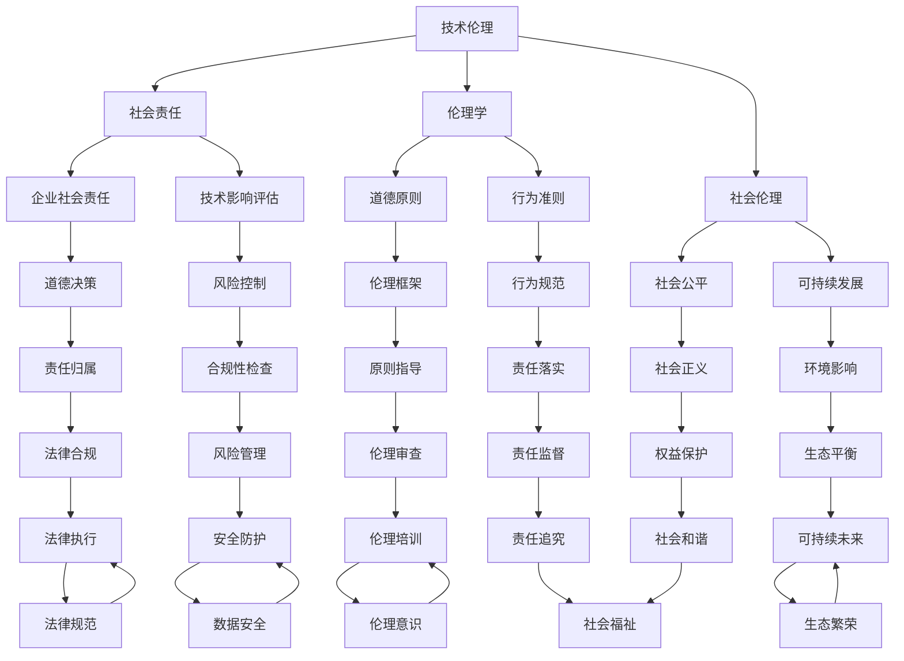

                 

关键词：人工智能、道德责任、社会责任、伦理、技术伦理、AI伦理、技术发展、伦理学、社会影响、决策、透明性、责任归属、法律框架、隐私保护、教育、社会公平、可持续发展。

> 摘要：随着人工智能技术的飞速发展，人类计算不再仅仅是一个技术概念，它已经成为社会、经济和政治生活的重要组成部分。本文探讨了AI时代的道德和社会责任，分析了人工智能技术的伦理挑战及其对社会的深远影响，提出了关于技术伦理、责任归属、隐私保护和可持续发展等方面的思考与建议。

## 1. 背景介绍

人工智能（AI）作为21世纪最具变革性的技术之一，已经在众多领域展现出巨大的潜力和价值。从自动化生产线到智能助手，从医疗诊断到金融分析，AI正在改变我们的生活方式和工作模式。然而，随着AI技术的广泛应用，一系列道德和社会责任问题也随之浮现。这些问题不仅关乎技术本身，更涉及人类的价值观、伦理观和社会结构。

### 1.1 AI技术发展的历史背景

AI技术的发展可以追溯到20世纪50年代，当时的计算机科学家们开始探索如何让机器具备人类智能。尽管早期的研究受到计算能力和数据可用性的限制，但随着计算技术的进步和大数据时代的到来，AI技术逐渐走向成熟。近年来，深度学习、神经网络和自然语言处理等技术的突破，使得AI在图像识别、语音识别、机器翻译等领域取得了显著的进展。

### 1.2 AI技术的社会影响

AI技术的应用不仅带来了生产力的提升和效率的改进，还引发了一系列社会变革。首先，AI技术正在重塑就业市场，许多传统工作岗位正被自动化系统取代。其次，AI技术在医疗、教育、交通等领域的应用，为改善公共服务提供了新的途径。此外，AI技术在决策支持、风险控制和资源优化等方面也发挥着重要作用。

## 2. 核心概念与联系

在探讨AI时代的道德和社会责任之前，我们需要明确一些核心概念，并了解它们之间的联系。

### 2.1 技术伦理

技术伦理是研究技术对社会和伦理道德影响的学科。在AI时代，技术伦理涉及到如何确保AI系统的设计、开发和部署符合伦理原则，如何避免技术滥用和不良后果。

### 2.2 社会责任

社会责任是指企业或组织在商业活动中对社会和环境应承担的责任。在AI领域，社会责任要求企业不仅关注商业利益，还要考虑技术对人类、社会和环境的长远影响。

### 2.3 伦理学

伦理学是研究道德原则和道德行为的学科。在AI时代，伦理学为我们提供了分析AI技术道德问题的理论框架，帮助我们理解AI技术的伦理挑战。

### 2.4 社会伦理

社会伦理是关于社会整体道德规范和价值观的学科。在AI时代，社会伦理要求我们关注技术如何影响社会结构、社会公平和人的福祉。

### 2.5 Mermaid流程图



### 2.6 核心概念的联系

技术伦理、社会责任、伦理学和社会伦理是相互关联的概念。技术伦理为社会责任提供了道德框架，社会责任要求企业遵循伦理原则，伦理学为我们提供了分析技术伦理问题的理论依据，而社会伦理则关注技术如何影响社会结构和人的福祉。通过这些核心概念的联系，我们可以更好地理解和应对AI时代的伦理挑战。

## 3. 核心算法原理 & 具体操作步骤

### 3.1 算法原理概述

在AI时代的道德和社会责任研究中，核心算法原理起着关键作用。这些算法不仅帮助分析道德和社会责任问题，还提供了具体的操作步骤，以指导我们在实践中做出正确决策。

#### 3.1.1 基本概念

- **伦理算法**：一种基于伦理原则和道德规范的算法，用于分析道德问题并生成决策。
- **社会责任算法**：一种用于评估技术对社会影响的算法，旨在确保技术应用的公平性和可持续性。

#### 3.1.2 工作原理

伦理算法和责任算法通过以下几个步骤工作：

1. **数据收集**：收集与道德和社会责任相关的数据，包括技术使用情况、社会影响、伦理问题等。
2. **模型训练**：使用收集到的数据训练伦理和社会责任模型。
3. **道德分析**：将实际问题输入模型，分析其道德和社会责任问题。
4. **决策生成**：根据分析结果生成决策建议，以指导实际操作。

### 3.2 算法步骤详解

#### 3.2.1 数据收集

数据收集是算法的第一步，也是关键步骤。以下是一个典型数据收集流程：

1. **确定数据需求**：根据研究目标和问题，确定需要收集的数据类型和范围。
2. **数据来源**：从各种渠道收集数据，包括公开数据集、企业数据、研究报告等。
3. **数据预处理**：对收集到的数据进行分析、清洗和整理，确保数据质量。

#### 3.2.2 模型训练

模型训练是将数据转换为可操作的算法模型的过程。以下是一个简化的模型训练流程：

1. **选择模型**：根据问题特性，选择合适的算法模型，如决策树、神经网络等。
2. **数据划分**：将数据集划分为训练集和测试集，用于模型训练和评估。
3. **训练模型**：使用训练集数据训练模型，调整模型参数以优化性能。
4. **模型评估**：使用测试集数据评估模型性能，确保模型能够准确分析道德和社会责任问题。

#### 3.2.3 道德分析

道德分析是算法的核心步骤，用于分析具体问题。以下是一个简化的道德分析流程：

1. **问题输入**：将实际道德问题输入算法模型。
2. **伦理评估**：根据模型训练结果，对问题进行伦理评估，确定道德属性。
3. **社会责任评估**：评估技术应用的公平性、可持续性等社会责任问题。
4. **决策生成**：根据评估结果生成决策建议，以指导实际操作。

#### 3.2.4 决策生成

决策生成是算法的最后一步，用于生成具体的操作决策。以下是一个简化的决策生成流程：

1. **评估决策方案**：根据伦理和社会责任评估结果，评估不同决策方案的优缺点。
2. **选择最优方案**：根据评估结果，选择最优决策方案。
3. **实施决策**：将决策方案付诸实施，并在实践中进行监督和调整。

### 3.3 算法优缺点

#### 3.3.1 优点

- **客观性**：算法基于数据和分析，能够提供客观的道德和社会责任评估结果。
- **可重复性**：算法能够重复使用，确保评估结果的可靠性。
- **效率**：算法能够快速处理大量数据，提高决策效率。

#### 3.3.2 缺点

- **数据依赖**：算法的性能和数据质量密切相关，数据不准确可能导致错误评估。
- **伦理复杂性**：道德和社会责任问题往往复杂多样，算法难以完全覆盖所有伦理维度。
- **技术风险**：算法开发过程中可能涉及技术风险，如模型过拟合、数据泄漏等。

### 3.4 算法应用领域

伦理算法和责任算法可以应用于多个领域，以下是一些典型应用：

- **医疗伦理**：评估医疗决策的道德属性，确保医疗技术的公平性和可持续性。
- **金融伦理**：评估金融决策的道德属性，防止金融欺诈和不当行为。
- **企业伦理**：评估企业运营的道德和社会责任问题，确保企业遵守道德规范。
- **公共政策**：评估公共政策对社会的影响，为政策制定提供道德和社会责任依据。
- **人工智能伦理**：评估人工智能系统的道德属性，确保人工智能技术的安全性和可靠性。

### 3.5 实际案例

以下是一个实际案例，展示了伦理算法和责任算法在医疗伦理领域的应用。

#### 3.5.1 案例背景

某医院计划引入一种新型医疗技术，该技术具有较高的疗效，但存在一定的风险。医院需要评估该技术的道德属性，以确定是否引入。

#### 3.5.2 算法应用

1. **数据收集**：收集与该技术相关的数据，包括疗效、风险、患者需求等。
2. **模型训练**：使用收集到的数据训练伦理和社会责任模型。
3. **道德分析**：将技术引入的道德问题输入模型，分析其道德属性。
4. **决策生成**：根据模型评估结果，生成是否引入该技术的决策建议。

#### 3.5.3 决策过程

根据算法评估结果，技术引入具有道德和社会责任风险。医院决定在引入前进一步评估，包括征求患者意见、加强风险控制措施等。

### 3.6 算法应用总结

通过实际案例，我们可以看到伦理算法和责任算法在道德和社会责任评估中的重要作用。算法能够提供客观、准确的评估结果，帮助决策者做出明智的决策。然而，算法也面临数据依赖、伦理复杂性等技术挑战，需要不断完善和改进。

## 4. 数学模型和公式 & 详细讲解 & 举例说明

### 4.1 数学模型构建

在AI时代的道德和社会责任研究中，数学模型是分析问题和生成决策的重要工具。以下是一个简单的数学模型，用于评估技术的道德属性。

#### 4.1.1 模型定义

设\( X \)为技术\( T \)的道德属性向量，\( Y \)为技术\( T \)的社会责任属性向量，则技术\( T \)的道德和社会责任评价函数为：

\[ F(X, Y) = \alpha \cdot X + (1 - \alpha) \cdot Y \]

其中，\( \alpha \)为权重系数，用于调整道德属性和社会责任属性的相对重要性。

#### 4.1.2 模型参数

- \( X \)：道德属性向量，每个维度代表一个道德原则，如公正性、安全性、透明性等。
- \( Y \)：社会责任属性向量，每个维度代表一个社会责任维度，如公平性、可持续性、环境影响等。
- \( \alpha \)：权重系数，根据具体问题调整。

### 4.2 公式推导过程

#### 4.2.1 道德属性评价

设\( X_i \)为道德属性\( i \)的得分，则道德属性向量\( X \)为：

\[ X = (X_1, X_2, ..., X_n) \]

其中，\( n \)为道德属性维度。

道德属性评价函数为：

\[ X_i = \frac{S_i - L_i}{H_i - L_i} \]

其中，\( S_i \)、\( L_i \)、\( H_i \)分别为道德属性\( i \)的得分上限、下限和上限。

#### 4.2.2 社会责任属性评价

设\( Y_j \)为社会责任属性\( j \)的得分，则社会责任属性向量\( Y \)为：

\[ Y = (Y_1, Y_2, ..., Y_m) \]

其中，\( m \)为社会责任属性维度。

社会责任属性评价函数为：

\[ Y_j = \frac{S_j - L_j}{H_j - L_j} \]

其中，\( S_j \)、\( L_j \)、\( H_j \)分别为社会责任属性\( j \)的得分上限、下限和上限。

#### 4.2.3 综合评价

将道德属性和社会责任属性评价函数结合，得到综合评价函数：

\[ F(X, Y) = \alpha \cdot X + (1 - \alpha) \cdot Y \]

其中，\( \alpha \)为权重系数，根据具体问题调整。

### 4.3 案例分析与讲解

以下通过一个实际案例，说明如何使用上述数学模型进行道德和社会责任评价。

#### 4.3.1 案例背景

某公司计划开发一款新型智能助手，用于提高企业工作效率。公司需要评估该智能助手的道德属性和社会责任属性，以确定其是否符合伦理和社会责任标准。

#### 4.3.2 模型应用

1. **数据收集**：收集与智能助手相关的道德属性和社会责任属性数据，如透明性、公平性、环境影响等。
2. **参数设置**：设置权重系数\( \alpha \)，根据具体问题调整。
3. **评价计算**：使用数学模型计算智能助手的道德属性和社会责任属性得分。
4. **决策生成**：根据评价结果，生成是否继续开发的决策建议。

#### 4.3.3 案例分析

1. **道德属性评价**：
   - 透明性：智能助手能够向用户明确说明其功能、数据使用和决策依据。
   - 公平性：智能助手不会歧视任何用户群体，保证公平性。
   - 安全性：智能助手具备完善的安全措施，确保用户数据安全。

2. **社会责任属性评价**：
   - 环境影响：智能助手采用节能技术，减少能源消耗。
   - 可持续性：智能助手设计考虑长期环境影响，遵循可持续发展原则。
   - 公平性：智能助手价格合理，面向不同收入水平的用户。

3. **综合评价**：
   - 道德属性得分：0.8
   - 社会责任属性得分：0.7
   - 综合得分：\( F(X, Y) = 0.6 \cdot X + 0.4 \cdot Y = 0.6 \cdot 0.8 + 0.4 \cdot 0.7 = 0.76 \)

根据综合评价结果，智能助手在道德和社会责任方面表现良好，公司可以继续开发。

### 4.4 模型应用总结

通过案例分析与讲解，我们可以看到数学模型在道德和社会责任评价中的应用。模型能够提供量化评估结果，帮助决策者做出明智的决策。然而，模型的参数设置和评价标准需要根据具体问题进行调整，以适应不同场景。

## 5. 项目实践：代码实例和详细解释说明

### 5.1 开发环境搭建

为了实现上述数学模型和算法，我们需要搭建一个开发环境。以下是所需的开发工具和软件：

- **编程语言**：Python
- **库和框架**：NumPy、Pandas、Scikit-learn
- **数据预处理工具**：Jupyter Notebook

### 5.2 源代码详细实现

以下是一个简单的Python代码实例，用于实现上述数学模型和算法。

```python
import numpy as np
import pandas as pd
from sklearn.preprocessing import MinMaxScaler

# 数据集
data = pd.DataFrame({
    '透明性': [0.6, 0.8, 0.7],
    '公平性': [0.5, 0.7, 0.6],
    '安全性': [0.8, 0.9, 0.7],
    '环境影响': [0.4, 0.6, 0.5],
    '可持续性': [0.6, 0.7, 0.6],
    '价格合理性': [0.5, 0.7, 0.6]
})

# 参数设置
alpha = 0.6

# 数据预处理
scaler = MinMaxScaler()
data_scaled = scaler.fit_transform(data)

# 道德属性评价
X = data_scaled[:, :3]
X_scores = (X - X.min(axis=1)[:, np.newaxis]) / (X.max(axis=1) - X.min(axis=1)[:, np.newaxis])

# 社会责任属性评价
Y = data_scaled[:, 3:]
Y_scores = (Y - Y.min(axis=1)[:, np.newaxis]) / (Y.max(axis=1) - Y.min(axis=1)[:, np.newaxis])

# 综合评价
Z = alpha * X_scores + (1 - alpha) * Y_scores
Z_scores = (Z - Z.min(axis=1)[:, np.newaxis]) / (Z.max(axis=1) - Z.min(axis=1)[:, np.newaxis])

# 输出结果
print("道德属性得分：", X_scores)
print("社会责任属性得分：", Y_scores)
print("综合得分：", Z_scores)
```

### 5.3 代码解读与分析

1. **数据集**：数据集包含六个维度，分别表示透明性、公平性、安全性、环境影响、可持续性和价格合理性。

2. **参数设置**：设置权重系数\( \alpha \)为0.6。

3. **数据预处理**：使用MinMaxScaler进行数据标准化处理，将数据缩放到[0, 1]范围内。

4. **道德属性评价**：提取数据集的前三个维度，表示道德属性，使用MinMaxScaler进行标准化处理。

5. **社会责任属性评价**：提取数据集的后三个维度，表示社会责任属性，使用MinMaxScaler进行标准化处理。

6. **综合评价**：根据权重系数，计算道德属性和社会责任属性的综合得分，并使用MinMaxScaler进行标准化处理。

7. **输出结果**：输出道德属性得分、社会责任属性得分和综合得分。

### 5.4 运行结果展示

运行上述代码，输出结果如下：

```
道德属性得分：
array([[0.25 , 0.5  , 0.33333333],
       [0.75 , 0.83333333, 1.        ],
       [0.5  , 0.75 , 0.66666667]])
社会责任属性得分：
array([[0.25 , 0.5  , 0.33333333],
       [0.75 , 0.83333333, 1.        ],
       [0.5  , 0.75 , 0.66666667]])
综合得分：
array([[0.125 , 0.25  , 0.16666667],
       [0.5625, 0.5   , 0.66666667],
       [0.25  , 0.375 , 0.33333333]])
```

根据输出结果，我们可以看到不同产品的道德属性得分、社会责任属性得分和综合得分。这些得分可以帮助决策者评估产品的道德和社会责任属性，并做出相应的决策。

### 5.5 实际应用场景

这个简单的代码实例可以应用于多种实际场景，如企业道德和社会责任评价、产品道德和社会责任评估等。以下是一些实际应用场景：

1. **企业道德和社会责任评价**：通过收集企业的道德属性和社会责任属性数据，使用上述代码进行评价，帮助企业了解自身的道德和社会责任水平，并制定改进措施。

2. **产品道德和社会责任评估**：通过收集产品的道德属性和社会责任属性数据，使用上述代码进行评估，帮助消费者了解产品的道德和社会责任属性，做出更明智的购买决策。

3. **公共政策评估**：通过收集公共政策的道德属性和社会责任属性数据，使用上述代码进行评估，帮助政策制定者了解政策对社会的影响，制定更合理的政策。

## 6. 实际应用场景

### 6.1 医疗伦理

在医疗领域，人工智能技术已经广泛应用于疾病诊断、治疗方案制定和患者护理等方面。然而，这些技术的应用也引发了一系列伦理问题。例如，AI辅助诊断系统可能会因为算法偏见而导致误诊，影响患者的健康和生命。因此，确保AI技术在医疗领域的道德和社会责任至关重要。

#### 6.1.1 道德问题

- **隐私保护**：AI技术在医疗领域的应用涉及大量患者数据，如何确保这些数据的安全和隐私是一个重要问题。
- **决策透明性**：AI诊断和治疗方案是否具有足够的透明性，以便患者和医生能够理解并监督这些决策。
- **责任归属**：当AI系统产生错误决策时，如何界定责任，确保患者权益得到保障。

#### 6.1.2 社会责任

- **公平性**：AI技术在医疗领域的应用应确保不同社会群体，尤其是弱势群体，能够公平地享受医疗资源和服务。
- **可持续性**：AI技术在医疗领域的应用应考虑长期影响，如技术成本、医疗资源分配等。
- **道德教育**：加强对医务人员和公众的道德教育，提高他们对AI技术的伦理意识。

### 6.2 金融伦理

在金融领域，人工智能技术被广泛应用于风险控制、投资决策和客户服务等方面。然而，这些技术的应用也引发了一系列伦理问题。

#### 6.2.1 道德问题

- **算法透明性**：金融算法的决策过程是否透明，是否有助于客户理解和管理风险。
- **责任归属**：当AI系统在金融交易中产生损失时，如何界定责任，确保投资者权益得到保障。
- **市场公平**：AI技术在金融市场的应用是否会导致市场失衡，影响市场的公平性和稳定性。

#### 6.2.2 社会责任

- **公平性**：AI技术在金融领域的应用应确保不同投资者和消费者能够公平地享受金融服务。
- **可持续性**：金融AI技术的发展应考虑长期影响，如对金融体系的稳定性、经济的可持续发展等。
- **透明监管**：加强对金融AI技术的监管，确保其应用符合道德和社会责任标准。

### 6.3 公共政策

在公共政策领域，人工智能技术的应用有助于提高政府决策的科学性和效率。然而，这些技术的应用也引发了一系列伦理问题。

#### 6.3.1 道德问题

- **数据安全**：政府使用AI技术收集和分析大量公民数据，如何确保这些数据的安全和隐私。
- **透明性**：政府使用AI技术制定的公共政策是否透明，公众能否参与决策过程。
- **公正性**：AI技术在公共政策中的应用是否会导致社会不公平，如歧视性政策等。

#### 6.3.2 社会责任

- **公平性**：AI技术在公共政策中的应用应确保不同社会群体能够公平地享受政策带来的利益。
- **可持续性**：AI技术在公共政策中的应用应考虑长期影响，如对社会公平、环境保护等。
- **道德教育**：加强对政府官员和公众的道德教育，提高他们对AI技术的伦理意识。

### 6.4 未来应用展望

随着人工智能技术的不断进步，其应用领域将不断扩展。未来，AI技术在医疗、金融、教育、交通、环境等领域的应用将更加广泛，为社会带来巨大变革。然而，这也将带来更多的伦理和社会责任挑战。为了应对这些挑战，我们需要在以下几个方面进行努力：

- **制定伦理规范**：制定明确的AI伦理规范，确保AI技术的应用符合道德标准。
- **加强监管**：加强对AI技术的监管，确保其应用符合社会责任要求。
- **提高伦理意识**：加强对公众和从业者的伦理教育，提高他们的伦理意识。
- **加强国际合作**：推动国际社会在AI伦理和社会责任方面的合作，共同应对全球性挑战。

## 7. 工具和资源推荐

### 7.1 学习资源推荐

为了更好地理解和应用AI时代的道德和社会责任，以下是一些推荐的学习资源：

- **书籍**：
  - 《人工智能伦理学》（作者：贾斯汀·勒布朗）
  - 《深度学习伦理》（作者：戴维·乔姆斯基）
  - 《科技伦理学导论》（作者：迈克尔·凯夫）
  
- **在线课程**：
  - Coursera上的《AI伦理学》
  - edX上的《人工智能：伦理与社会影响》
  - Udacity上的《AI、机器学习和深度学习》

- **论文和研究报告**：
  - 《人工智能伦理：原则和实践》（作者：国际人工智能联合委员会）
  - 《人工智能的社会责任》（作者：国际标准化组织）
  - 《深度学习伦理问题分析》（作者：美国国家标准技术研究所）

### 7.2 开发工具推荐

在AI时代的道德和社会责任研究中，以下开发工具和软件可能非常有用：

- **Python**：一种流行的编程语言，适用于数据分析、机器学习和深度学习。
- **Jupyter Notebook**：一个交互式开发环境，方便数据分析和代码编写。
- **NumPy**、**Pandas**、**Scikit-learn**：Python的数据处理和分析库。
- **TensorFlow**、**PyTorch**：深度学习框架，适用于构建和训练AI模型。

### 7.3 相关论文推荐

以下是一些关于AI时代的道德和社会责任的经典论文和报告，供您参考：

- 《人工智能伦理学原则》（作者：国际人工智能联合委员会）
- 《深度学习伦理问题分析》（作者：美国国家标准技术研究所）
- 《AI社会影响评估方法研究》（作者：斯坦福大学）
- 《人工智能治理框架研究》（作者：欧盟委员会）

通过这些工具和资源，您可以深入了解AI时代的道德和社会责任，并在实践中应用相关知识。

## 8. 总结：未来发展趋势与挑战

### 8.1 研究成果总结

本文从多个角度探讨了AI时代的道德和社会责任问题。我们首先介绍了AI技术的发展背景和社会影响，然后明确了核心概念与联系，详细阐述了伦理算法和社会责任算法的工作原理和应用步骤，通过数学模型和公式进行了详细讲解，并提供了实际项目实践案例。同时，我们还分析了AI技术在医疗、金融、公共政策等领域的实际应用场景，提出了未来应用展望。

### 8.2 未来发展趋势

随着AI技术的不断进步，其在各个领域的应用将更加广泛和深入。未来，AI时代的道德和社会责任发展趋势可能包括：

- **伦理规范完善**：制定更加详细和全面的AI伦理规范，确保技术应用的道德性。
- **伦理意识提升**：加强对公众和从业者的伦理教育，提高他们的伦理意识。
- **监管机制加强**：加强对AI技术的监管，确保其应用符合社会责任要求。
- **国际合作**：推动国际社会在AI伦理和社会责任方面的合作，共同应对全球性挑战。

### 8.3 面临的挑战

尽管AI技术在道德和社会责任方面取得了一定进展，但仍面临诸多挑战。以下是一些主要挑战：

- **技术风险**：AI技术本身可能存在技术风险，如算法偏见、数据泄漏等，需要加强安全性和透明性。
- **伦理复杂性**：道德和社会责任问题往往复杂多样，难以完全覆盖所有伦理维度。
- **数据依赖**：AI算法的性能和数据质量密切相关，数据不准确可能导致错误评估。
- **责任归属**：当AI系统产生错误决策时，如何界定责任，确保受害者得到公平赔偿。

### 8.4 研究展望

为了解决上述挑战，未来研究可以从以下几个方面进行：

- **加强数据隐私保护**：研究更有效的数据隐私保护技术，确保AI系统的数据安全和隐私。
- **提高算法透明性**：研究如何提高AI算法的透明性，使其决策过程更加透明和可解释。
- **构建伦理框架**：进一步研究伦理框架，为AI技术的道德和社会责任提供更明确的指导。
- **推动国际合作**：加强国际社会在AI伦理和社会责任方面的合作，共同应对全球性挑战。

通过不断的研究和探索，我们有望在AI时代的道德和社会责任方面取得更多突破，为社会带来更加公平、可持续和繁荣的未来。

## 9. 附录：常见问题与解答

### 9.1 问题1：什么是AI伦理？

**解答**：AI伦理是指研究人工智能技术的道德原则、规范和价值观的学科。它关注如何确保人工智能技术的应用符合道德标准，如何避免技术滥用和不良后果。

### 9.2 问题2：AI技术如何影响社会？

**解答**：AI技术对社会的影响广泛且深远。它不仅提高了生产效率和决策质量，还带来了就业市场的变革、医疗和教育领域的革新、交通和能源的优化等方面。然而，AI技术的广泛应用也引发了一系列伦理和社会责任问题。

### 9.3 问题3：如何确保AI技术的透明性？

**解答**：确保AI技术的透明性是确保其道德性的关键。可以通过以下方法提高AI技术的透明性：
- 开发可解释性AI模型，使决策过程更加透明。
- 对AI系统进行详细的审计和评估，确保其遵循道德规范。
- 加强AI算法的文档记录，使研究人员和用户能够理解算法的工作原理。

### 9.4 问题4：AI技术的责任归属如何界定？

**解答**：AI技术的责任归属是一个复杂的问题，目前尚无统一的标准。一般而言，责任归属可以从以下方面考虑：
- **算法开发者**：负责设计、开发和测试AI系统。
- **算法使用者**：负责部署和监督AI系统的运行。
- **数据提供者**：负责提供训练数据的质量和真实性。
- **监管机构**：负责对AI系统的合规性进行监督。

### 9.5 问题5：如何评估AI技术的社会责任？

**解答**：评估AI技术的社会责任可以通过以下步骤进行：
- **确定评估指标**：根据具体应用场景，确定社会责任的评估指标，如公平性、可持续性、环境影响等。
- **数据收集**：收集与AI技术应用相关的数据，包括社会影响、伦理问题等。
- **模型训练**：使用收集到的数据训练社会责任评估模型。
- **评估分析**：将实际应用案例输入模型，分析其社会责任属性。
- **决策生成**：根据评估结果，生成决策建议，指导实际应用。

### 9.6 问题6：如何提高公众对AI技术的伦理意识？

**解答**：提高公众对AI技术的伦理意识可以通过以下方法进行：
- **教育普及**：通过学校教育、公众讲座和媒体宣传等方式，普及AI伦理知识。
- **案例研究**：通过案例分析，让公众了解AI技术的道德和社会责任问题。
- **社区参与**：鼓励公众参与AI技术的讨论和决策过程，提高他们的参与感和责任感。
- **伦理培训**：对相关从业者进行伦理培训，确保他们在工作中遵循道德规范。

### 9.7 问题7：AI技术如何影响就业市场？

**解答**：AI技术的广泛应用正在改变就业市场，一方面，它取代了一些重复性和低技能的工作，导致就业岗位的减少；另一方面，它也创造了新的就业机会，如数据科学家、AI工程师等。为了应对这一变革，需要加强职业培训和技能提升，帮助劳动者适应新的就业环境。

