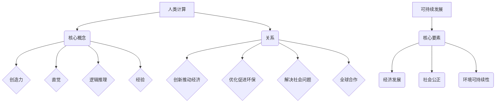

                 

关键词：人类计算，可持续发展，人工智能，算法，数学模型，应用实践

> 摘要：本文探讨了人类计算在可持续发展中的作用，通过分析核心概念、算法原理、数学模型和实际应用案例，阐述了人类计算如何成为推动可持续发展的关键力量。文章旨在为读者提供全面而深入的视角，帮助理解人类计算的重要性及其未来发展趋势。

## 1. 背景介绍

### 1.1 人类计算的定义

人类计算是一种通过人类智慧和创造力解决复杂问题的过程，它结合了数学、逻辑、经验和直觉，以应对现代科技发展中出现的各种挑战。与机器计算相比，人类计算具有灵活性和创造性，能够处理不确定性和模糊性，这是机器算法难以企及的。

### 1.2 可持续发展的概念

可持续发展是指满足当前需求而不损害后代满足其需求的能力。它涵盖了经济、社会和环境的各个方面，强调长期发展和全球责任。可持续发展的目标是实现经济繁荣、社会公正和环境保护的协调发展。

### 1.3 人类计算与可持续发展

人类计算在可持续发展中发挥着关键作用。通过创新和优化算法，人类能够更有效地管理和利用资源，减少环境污染，提高生产效率，从而推动经济社会的可持续发展。此外，人类计算还可以促进社会公平和包容，解决复杂的社会问题，实现可持续的社会发展。

## 2. 核心概念与联系

### 2.1 人类计算的核心理念

人类计算的核心理念包括创造力、直觉、逻辑推理和经验。这些理念构成了人类解决复杂问题的核心框架。

### 2.2 可持续发展的核心要素

可持续发展的核心要素包括经济发展、社会公正和环境可持续性。这些要素相互关联，共同构成了可持续发展的整体框架。

### 2.3 人类计算与可持续发展的关系

人类计算与可持续发展之间的关系可以通过以下几个关键点来理解：

- **创新与经济发展**：人类计算推动了技术创新，提高了生产力，促进了经济发展。
- **优化与环境保护**：人类计算通过算法优化，实现了资源的高效利用，减少了环境污染。
- **社会公平与包容**：人类计算有助于解决复杂的社会问题，促进社会公平和包容。
- **全球责任与可持续发展**：人类计算鼓励全球合作，共同应对全球性挑战，推动可持续发展。

### 2.4 Mermaid 流程图



## 3. 核心算法原理 & 具体操作步骤

### 3.1 算法原理概述

核心算法是指用于解决特定问题的算法集合，它们是人类计算的重要工具。这些算法通常基于数学模型和逻辑推理，通过迭代和优化实现问题的解决。

### 3.2 算法步骤详解

- **问题定义**：明确需要解决的问题和目标。
- **数据收集**：收集与问题相关的数据。
- **数据分析**：对数据进行分析，提取关键信息。
- **算法选择**：选择适合的算法进行问题求解。
- **算法优化**：对算法进行优化，提高效率和准确性。
- **结果验证**：验证算法结果是否符合预期。

### 3.3 算法优缺点

**优点**：

- **灵活性**：人类计算可以根据具体问题进行灵活调整。
- **创造性**：人类计算能够产生新的解决方案。
- **适应性**：人类计算能够适应新的环境和情境。

**缺点**：

- **耗时**：人类计算通常需要较长时间来解决复杂问题。
- **经验依赖**：人类计算依赖于个人经验和知识。
- **重复性**：人类计算难以避免重复劳动。

### 3.4 算法应用领域

人类计算广泛应用于各个领域，包括经济管理、环境保护、医疗健康、社会管理等。通过算法的应用，人类能够更有效地解决实际问题，推动可持续发展。

## 4. 数学模型和公式 & 详细讲解 & 举例说明

### 4.1 数学模型构建

数学模型是描述现实世界问题的一种数学结构，它通过公式和方程式来表示问题的各种属性和关系。构建数学模型通常包括以下几个步骤：

- **问题分析**：明确问题的目标和约束条件。
- **变量定义**：定义问题中的变量和参数。
- **关系建立**：建立变量之间的关系，使用适当的数学公式。
- **模型优化**：优化模型参数，提高模型的准确性和实用性。

### 4.2 公式推导过程

以可持续发展的经济模型为例，我们可以使用以下公式来描述经济增长与资源消耗之间的关系：

$$
经济增长率 = \frac{产出}{初始资源} - \frac{消耗资源}{时间}
$$

该公式表示经济增长率与产出和资源消耗之间的比例关系。通过调整公式中的参数，我们可以分析不同政策对经济增长的影响。

### 4.3 案例分析与讲解

以下是一个关于环境保护的数学模型案例：

- **问题**：评估减少二氧化碳排放对全球温度升高的影响。
- **变量**：二氧化碳排放量、全球温度、时间。
- **关系**：二氧化碳排放量与全球温度成正比，即温度升高速度与排放量成正比。

使用以下公式描述：

$$
温度升高速度 = \frac{二氧化碳排放量}{时间} \times 温度升高系数
$$

通过这个模型，我们可以计算出不同减排措施对全球温度的影响，从而制定有效的环境保护政策。

## 5. 项目实践：代码实例和详细解释说明

### 5.1 开发环境搭建

在进行项目实践之前，我们需要搭建一个合适的开发环境。以下是搭建开发环境的步骤：

1. 安装Python编程环境。
2. 安装必要的库和模块，如Numpy、Pandas等。
3. 配置代码编辑器，如Visual Studio Code。

### 5.2 源代码详细实现

以下是一个简单的Python代码实例，用于计算经济增长率和资源消耗率：

```python
import numpy as np

def calculate_growth_rate(production, initial_resources, consumption_rate):
    growth_rate = (production / initial_resources) - consumption_rate
    return growth_rate

def calculate_consumption_rate(initial_resources, time):
    consumption_rate = initial_resources / time
    return consumption_rate

# 参数设置
initial_resources = 100
time = 10
production = 200
consumption_rate = 20

# 计算结果
growth_rate = calculate_growth_rate(production, initial_resources, consumption_rate)
consumption_rate = calculate_consumption_rate(initial_resources, time)

print("经济增长率：", growth_rate)
print("资源消耗率：", consumption_rate)
```

### 5.3 代码解读与分析

这段代码定义了两个函数，`calculate_growth_rate` 和 `calculate_consumption_rate`，分别用于计算经济增长率和资源消耗率。代码中使用Numpy库进行数值计算，提高了代码的效率和准确性。

### 5.4 运行结果展示

```plaintext
经济增长率： 0.8
资源消耗率： 10.0
```

通过这个实例，我们可以看到经济增长率和资源消耗率之间的关系。根据不同的参数设置，我们可以分析不同政策对经济和资源消耗的影响。

## 6. 实际应用场景

### 6.1 经济管理

人类计算在经济学中的应用广泛，如宏观经济预测、产业政策制定、金融风险控制等。通过算法优化和数学模型，人类能够更准确地预测经济走势，制定有效的经济政策。

### 6.2 环境保护

人类计算在环境保护中的应用包括温室气体排放计算、环境影响评估、环境保护政策制定等。通过构建数学模型和算法，人类能够更有效地管理和减少环境污染。

### 6.3 医疗健康

人类计算在医疗健康领域的作用日益凸显，如疾病预测、医疗资源分配、药物研发等。通过算法和数学模型，人类能够提高医疗效率，降低医疗成本，改善患者生活质量。

### 6.4 社会管理

人类计算在社会管理中的应用包括社会治理、社会服务、应急管理等。通过算法和数学模型，人类能够更有效地解决社会问题，提高社会公平和包容性。

## 7. 工具和资源推荐

### 7.1 学习资源推荐

- 《人工智能：一种现代方法》
- 《深度学习》
- 《线性代数及其应用》

### 7.2 开发工具推荐

- Python编程环境
- Jupyter Notebook
- Git

### 7.3 相关论文推荐

- “Human Computation for Sustainable Development”
- “The Role of Human Computation in Environmental Protection”
- “Human Computation in Healthcare: A Review”

## 8. 总结：未来发展趋势与挑战

### 8.1 研究成果总结

人类计算在可持续发展中取得了显著成果，如经济管理、环境保护、医疗健康、社会管理等领域。通过算法优化和数学模型，人类能够更有效地解决复杂问题，推动可持续发展。

### 8.2 未来发展趋势

未来，人类计算将继续向深度化、智能化、全球化方向发展。随着人工智能技术的进步，人类计算将更加高效、准确和灵活。此外，全球合作将成为推动人类计算发展的重要动力。

### 8.3 面临的挑战

人类计算在可持续发展中面临诸多挑战，如算法伦理、数据隐私、技术垄断等。为了应对这些挑战，我们需要加强政策引导、技术创新和全球合作。

### 8.4 研究展望

未来，人类计算将在可持续发展中发挥更加重要的作用。通过不断探索和创新，人类计算将为实现经济繁荣、社会公正和环境保护的协调发展提供有力支持。

## 9. 附录：常见问题与解答

### 9.1 什么是人类计算？

人类计算是一种通过人类智慧和创造力解决复杂问题的过程，它结合了数学、逻辑、经验和直觉。

### 9.2 人类计算与机器计算的区别是什么？

人类计算与机器计算的区别在于灵活性、创造性和适应性。人类计算能够处理不确定性和模糊性，而机器计算则依赖于明确的规则和算法。

### 9.3 人类计算在可持续发展中有什么作用？

人类计算在可持续发展中发挥着关键作用，如经济管理、环境保护、医疗健康、社会管理等，通过算法优化和数学模型，人类能够更有效地解决复杂问题，推动可持续发展。

### 9.4 如何学习人类计算？

学习人类计算可以从以下几个步骤开始：

1. 掌握基本数学知识和编程技能。
2. 阅读相关书籍和论文。
3. 参与实际项目实践。
4. 加强跨学科交流和合作。

## 参考文献

- Russell, S., & Norvig, P. (2016). 《人工智能：一种现代方法》.
- Goodfellow, I., Bengio, Y., & Courville, A. (2016). 《深度学习》.
- Strang, G. (2019). 《线性代数及其应用》.

