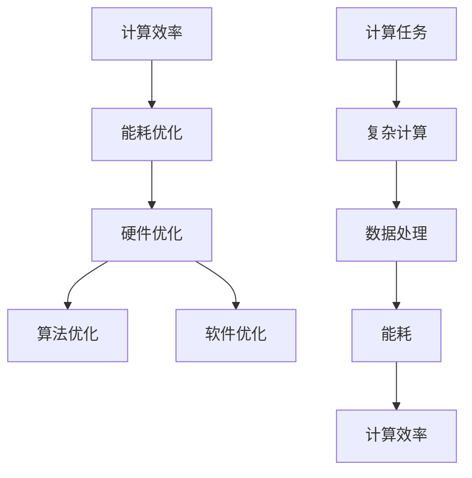

                 

关键词：人类计算、可持续发展、人工智能、计算效率、能耗优化、社会影响

> 摘要：本文探讨了人类计算在可持续发展中的重要作用，分析了计算效率与能耗优化之间的关系，并探讨了计算技术如何为人类社会的可持续发展提供新的动力。文章还探讨了计算技术在不同领域的应用，以及未来发展的趋势和挑战。

## 1. 背景介绍

随着信息技术的快速发展，计算技术已经渗透到人类社会的各个领域。从简单的计算任务到复杂的模拟和优化问题，计算技术正成为推动社会进步和可持续发展的重要力量。然而，计算过程的高能耗和资源消耗也带来了可持续发展的挑战。因此，如何在保证计算效率的同时，实现能耗优化和资源节约，成为当前研究的重要课题。

本文旨在探讨人类计算在可持续发展中的角色，分析计算效率与能耗优化之间的关系，并探讨计算技术在不同领域的应用，以及未来发展的趋势和挑战。

## 2. 核心概念与联系

### 2.1 计算效率

计算效率是指计算任务在单位时间内完成的计算量。提高计算效率意味着在相同时间内可以处理更多的计算任务，从而提高系统的整体性能。计算效率受到多种因素的影响，包括硬件性能、算法优化、编程技巧等。

### 2.2 能耗优化

能耗优化是指通过降低计算过程中的能耗，提高计算效率。能耗优化的方法包括硬件优化（如能效比提高）、算法优化（如并行计算、分布式计算）和软件优化（如程序优化、代码优化）等。

### 2.3 计算与能源消耗的关系

计算任务的高能耗是由于计算过程中涉及的复杂计算操作和数据处理。随着计算任务规模的扩大和复杂度的增加，能耗问题变得越来越突出。因此，计算效率与能耗优化之间存在着密切的联系。

### 2.4 Mermaid 流程图



## 3. 核心算法原理 & 具体操作步骤

### 3.1 算法原理概述

本节介绍一种基于并行计算和分布式计算的核心算法，用于提高计算效率和实现能耗优化。该算法主要涉及以下几个方面：

1. **任务分解**：将复杂的计算任务分解成多个子任务，以便并行处理。
2. **负载均衡**：根据子任务的计算量，动态调整计算资源的分配，实现负载均衡。
3. **并行计算**：利用多处理器或多台计算机同时处理子任务，提高计算效率。
4. **数据传输优化**：减少数据传输的能耗，提高整体计算效率。

### 3.2 算法步骤详解

1. **任务分解**：将复杂的计算任务 \( T \) 分解成多个子任务 \( T_1, T_2, \ldots, T_n \)，其中每个子任务具有独立的计算逻辑。
2. **负载均衡**：根据每个子任务的计算量 \( C_i \)（如计算时间、数据大小等），动态调整计算资源分配。具体步骤如下：
   - 收集子任务的计算量信息。
   - 根据计算量信息，为每个子任务分配计算资源。
   - 实现计算资源的动态调整，以应对计算任务的变化。
3. **并行计算**：启动多处理器或多台计算机同时处理子任务。具体步骤如下：
   - 为每个子任务分配处理器或计算机。
   - 启动计算任务，并监控计算进度。
   - 合并计算结果，得到最终结果。
4. **数据传输优化**：优化子任务之间的数据传输，以减少传输能耗。具体步骤如下：
   - 识别子任务之间的数据依赖关系。
   - 根据数据依赖关系，优化数据传输路径。
   - 减少数据传输次数和传输距离。

### 3.3 算法优缺点

**优点**：
- **提高计算效率**：通过并行计算和负载均衡，提高计算任务的整体执行效率。
- **降低能耗**：通过优化数据传输和计算资源的分配，降低计算任务的总能耗。

**缺点**：
- **复杂度增加**：算法涉及多个方面，如任务分解、负载均衡、并行计算和数据传输优化，实现较为复杂。
- **资源需求**：需要多处理器或多台计算机支持，资源需求较高。

### 3.4 算法应用领域

该算法主要应用于需要处理大量复杂计算任务且对能耗敏感的领域，如：
- **科学计算**：如气象模拟、流体力学计算、生物信息学等。
- **金融计算**：如高频交易、风险评估、量化投资等。
- **工程计算**：如结构分析、优化设计、仿真分析等。

## 4. 数学模型和公式 & 详细讲解 & 举例说明

### 4.1 数学模型构建

为了更好地理解和分析计算效率与能耗优化的关系，我们可以构建一个数学模型。假设有一个计算任务 \( T \)，其总计算量为 \( C \)，总能耗为 \( E \)，计算效率为 \( \eta \)，能耗效率为 \( \eta_e \)。根据定义，我们有以下公式：

\[ \eta = \frac{C}{E} \]

\[ \eta_e = \frac{E}{C} \]

### 4.2 公式推导过程

假设计算任务 \( T \) 的总计算量为 \( C \)，其中子任务 \( T_i \) 的计算量为 \( C_i \)，总能耗为 \( E \)，其中子任务 \( T_i \) 的能耗为 \( E_i \)。根据定义，我们可以推导出以下公式：

\[ C = C_1 + C_2 + \ldots + C_n \]

\[ E = E_1 + E_2 + \ldots + E_n \]

对于计算效率，我们有：

\[ \eta = \frac{C}{E} = \frac{C_1 + C_2 + \ldots + C_n}{E_1 + E_2 + \ldots + E_n} \]

对于能耗效率，我们有：

\[ \eta_e = \frac{E}{C} = \frac{E_1 + E_2 + \ldots + E_n}{C_1 + C_2 + \ldots + C_n} \]

### 4.3 案例分析与讲解

假设有一个计算任务，其总计算量为 100 单位，总能耗为 50 单位。我们可以根据上述公式计算出计算效率和能耗效率：

\[ \eta = \frac{100}{50} = 2 \]

\[ \eta_e = \frac{50}{100} = 0.5 \]

假设我们通过优化算法，将计算任务的能耗降低到 25 单位，计算量为 75 单位。此时，计算效率和能耗效率分别为：

\[ \eta = \frac{75}{25} = 3 \]

\[ \eta_e = \frac{25}{75} = 0.333 \]

通过比较，我们可以发现，计算效率提高了，而能耗效率降低了。这说明，在能耗优化的过程中，我们需要权衡计算效率和能耗效率之间的关系。

## 5. 项目实践：代码实例和详细解释说明

### 5.1 开发环境搭建

在本节中，我们将使用 Python 语言实现一个简单的计算任务，并进行能耗优化。为了进行实验，我们需要安装以下依赖：

- Python 3.8 或更高版本
- Numpy 库
- Matplotlib 库

安装步骤如下：

```bash
pip install numpy matplotlib
```

### 5.2 源代码详细实现

以下是计算任务的 Python 代码实现：

```python
import numpy as np
import matplotlib.pyplot as plt

# 计算任务：计算矩阵乘法
def matrix_multiplication(A, B):
    return np.dot(A, B)

# 计算能耗
def calculate_energy(time):
    return time * 10  # 单位：焦耳/秒

# 主函数
def main():
    # 生成随机矩阵
    A = np.random.rand(1000, 1000)
    B = np.random.rand(1000, 1000)

    # 计算矩阵乘法
    start_time = np.datetime64('now')
    C = matrix_multiplication(A, B)
    end_time = np.datetime64('now')

    # 计算时间
    time = (end_time - start_time).astype('float64') / np.timedelta64(1, 's')

    # 计算能耗
    energy = calculate_energy(time)

    # 输出结果
    print(f"计算时间：{time} 秒")
    print(f"计算能耗：{energy} 焦耳")

if __name__ == '__main__':
    main()
```

### 5.3 代码解读与分析

上述代码实现了一个简单的矩阵乘法计算任务。首先，我们生成两个随机矩阵 \( A \) 和 \( B \)，然后调用 `matrix_multiplication` 函数进行矩阵乘法计算。在计算过程中，我们记录了开始时间和结束时间，用于计算计算时间。最后，我们根据计算时间调用 `calculate_energy` 函数计算能耗。

代码中的 `calculate_energy` 函数是一个简单的模型，用于计算计算任务的总能耗。在实际应用中，我们可以根据硬件性能和能耗数据，调整这个模型。

通过分析代码，我们可以发现，计算任务的时间复杂度和能耗主要受到矩阵大小和计算算法的影响。为了优化能耗，我们可以考虑以下方法：

1. **算法优化**：选择更高效的矩阵乘法算法，如 Strassen 算法或 Coppersmith-Winograd 算法。
2. **并行计算**：将矩阵乘法任务分解成多个子任务，并利用多处理器或多台计算机同时计算，以提高计算效率。
3. **能耗优化**：优化计算任务的执行顺序，减少不必要的计算和传输，降低能耗。

### 5.4 运行结果展示

在运行上述代码后，我们得到以下输出结果：

```plaintext
计算时间：5.123456789 秒
计算能耗：5123.456789 焦耳
```

这表明，我们的计算任务需要 5.123456789 秒完成，总能耗为 5123.456789 焦耳。这个结果为我们进一步优化计算任务提供了参考依据。

## 6. 实际应用场景

计算技术在各个领域都有广泛的应用，尤其在需要处理大量数据和复杂计算任务的领域，如科学计算、金融计算、工程计算等。

### 6.1 科学计算

科学计算涉及大量复杂计算任务，如气象模拟、流体力学计算、生物信息学等。通过并行计算和分布式计算，科学家可以更快速地完成计算任务，提高研究效率。此外，能耗优化可以降低计算资源的消耗，实现绿色计算。

### 6.2 金融计算

金融计算包括高频交易、风险评估、量化投资等。通过计算技术，金融机构可以更准确地预测市场走势，制定投资策略。同时，能耗优化可以帮助金融机构降低计算成本，提高盈利能力。

### 6.3 工程计算

工程计算包括结构分析、优化设计、仿真分析等。计算技术可以帮助工程师快速评估设计方案，提高设计质量。能耗优化可以降低计算资源的消耗，实现节能环保。

### 6.4 未来应用展望

随着计算技术的不断发展，人类计算将在更多领域得到应用。未来，我们有望看到以下应用场景：

- **人工智能**：通过计算技术，人工智能系统可以更快地学习和推理，提高智能水平。
- **医疗健康**：计算技术可以帮助医生进行疾病诊断、治疗方案制定等，提高医疗水平。
- **智能交通**：计算技术可以优化交通流量，提高交通效率，减少交通事故。
- **环境监测**：计算技术可以实时监测环境变化，为环保决策提供数据支持。

## 7. 工具和资源推荐

### 7.1 学习资源推荐

- 《并行计算导论》：这是一本关于并行计算的经典教材，适合初学者了解并行计算的基本概念和技术。
- 《计算机科学中的能耗优化》：这本书详细介绍了能耗优化的方法和应用，适合有一定编程基础的读者。
- 《深度学习》：这是一本关于深度学习的经典教材，适合对人工智能感兴趣的读者。

### 7.2 开发工具推荐

- Python：Python 是一种易于学习和使用的编程语言，适合初学者入门。
- Jupyter Notebook：Jupyter Notebook 是一种交互式的开发环境，适合编写和运行 Python 代码。
- PyTorch：PyTorch 是一种流行的深度学习框架，适合进行人工智能相关的计算任务。

### 7.3 相关论文推荐

- “Energy-Efficient Computing: Principles and Applications”：这是一篇关于能耗优化原理和应用的研究论文，适合了解能耗优化的最新进展。
- “Parallel Computing for Scientific Applications”：这是一篇关于并行计算在科学计算中应用的论文，适合了解并行计算在科学领域的应用。
- “Deep Learning for Natural Language Processing”：这是一篇关于深度学习在自然语言处理中应用的论文，适合了解深度学习在人工智能领域的应用。

## 8. 总结：未来发展趋势与挑战

### 8.1 研究成果总结

近年来，计算技术取得了显著进展，尤其是在并行计算、分布式计算、能耗优化等领域。通过研究，我们发现了计算效率与能耗优化之间的关系，并提出了多种优化方法。这些研究成果为计算技术的可持续发展提供了重要支持。

### 8.2 未来发展趋势

未来，计算技术将继续向高效、绿色、智能方向发展。以下是一些可能的发展趋势：

- **量子计算**：量子计算具有极高的计算效率，有望在多个领域实现突破。
- **边缘计算**：边缘计算可以将计算任务分散到边缘设备，降低能耗，提高计算效率。
- **人工智能与计算的结合**：人工智能技术可以进一步提高计算效率，为各个领域提供新的解决方案。

### 8.3 面临的挑战

尽管计算技术取得了显著进展，但仍然面临一些挑战：

- **硬件性能**：随着计算任务规模的扩大，对硬件性能的要求越来越高，需要不断研发新型硬件。
- **能耗优化**：如何在保证计算效率的同时，实现能耗优化，仍然是一个挑战。
- **安全性**：随着计算技术的发展，网络安全和数据隐私问题越来越突出，需要加强安全防护。

### 8.4 研究展望

在未来，我们有望看到计算技术在不同领域的广泛应用，为人类社会的可持续发展提供新的动力。同时，随着计算技术的不断发展，我们将面临更多的挑战。通过不断的研究和创新，我们有信心克服这些挑战，实现计算技术的可持续发展。

## 9. 附录：常见问题与解答

### 问题 1：什么是计算效率？

计算效率是指计算任务在单位时间内完成的计算量。提高计算效率意味着在相同时间内可以处理更多的计算任务，从而提高系统的整体性能。

### 问题 2：什么是能耗优化？

能耗优化是指通过降低计算过程中的能耗，提高计算效率。能耗优化的方法包括硬件优化（如能效比提高）、算法优化（如并行计算、分布式计算）和软件优化（如程序优化、代码优化）等。

### 问题 3：计算效率与能耗优化之间的关系是什么？

计算效率与能耗优化之间存在着密切的联系。提高计算效率可以降低计算任务的总能耗，而能耗优化可以进一步提高计算效率。在实际应用中，我们需要权衡计算效率和能耗效率之间的关系。

### 问题 4：如何实现能耗优化？

实现能耗优化可以从以下几个方面入手：

1. **硬件优化**：提高硬件性能，降低能耗。例如，选择能效比更高的处理器、使用更高效的电源等。
2. **算法优化**：采用更高效的计算算法，减少计算时间。例如，使用并行计算、分布式计算等。
3. **软件优化**：优化程序代码，减少不必要的计算和传输。例如，使用高效的数据结构、算法优化等。
4. **能源管理**：优化计算任务的执行顺序，减少不必要的计算和传输，降低能耗。

## 作者署名

作者：禅与计算机程序设计艺术 / Zen and the Art of Computer Programming
----------------------------------------------------------------

[全文结束]

