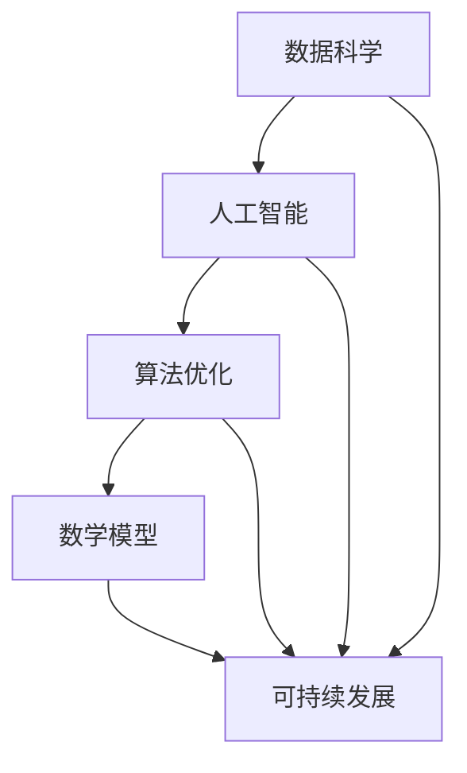

                 

关键字：人类计算、可持续发展、技术进步、数据科学、算法优化

> 摘要：本文深入探讨了人类计算在推动可持续发展方面的重要作用。随着技术的不断进步，人类计算正成为实现全球可持续发展目标的关键驱动力。本文将从核心概念、算法原理、数学模型、项目实践和未来展望等方面展开论述，旨在为读者揭示人类计算在可持续发展中的潜力和挑战。

## 1. 背景介绍

随着全球人口的增长和经济的发展，资源的消耗和环境破坏问题日益严重。为了应对这一挑战，联合国提出了可持续发展目标（Sustainable Development Goals, SDGs），旨在确保地球上所有人的生活质量和环境得到改善。这些目标涵盖了从减少贫困到消除饥饿、从清洁能源到保护生物多样性等多个领域。

人类计算作为一种新兴技术，已经在许多领域发挥了重要作用。从医疗诊断到金融服务，从城市规划到环境保护，人类计算正改变着我们的工作和生活方式。那么，人类计算如何与可持续发展目标相结合，为全球可持续发展做出贡献呢？

## 2. 核心概念与联系

在探讨人类计算如何推动可持续发展之前，我们需要了解一些核心概念和其相互联系。

### 2.1 数据科学

数据科学是研究和应用统计学、机器学习、数据库管理等领域的技术和方法，以从数据中提取有用信息。在可持续发展中，数据科学可以帮助我们更好地理解环境变化、资源消耗和社会经济状况。

### 2.2 人工智能

人工智能（Artificial Intelligence, AI）是模拟人类智能的技术，包括机器学习、自然语言处理、计算机视觉等。人工智能在可持续发展中的应用非常广泛，例如智能农业、智能交通、能源管理等。

### 2.3 算法优化

算法优化是指通过改进算法设计和实现，提高计算效率和效果。在可持续发展领域，算法优化可以帮助我们更好地利用有限资源，降低环境污染。

### 2.4 数学模型

数学模型是描述现实世界问题的数学表达式，可用于预测、优化和控制。在可持续发展中，数学模型可以帮助我们制定更有效的政策和措施。

### 2.5 Mermaid 流程图

为了更直观地展示这些概念之间的联系，我们使用 Mermaid 流程图进行描述：



## 3. 核心算法原理 & 具体操作步骤

### 3.1 算法原理概述

在可持续发展领域，有许多核心算法被广泛应用。以下是其中两个重要的算法：遗传算法和深度学习。

#### 3.1.1 遗传算法

遗传算法是一种基于自然选择和遗传学的优化算法，用于解决复杂的优化问题。在可持续发展中，遗传算法可以用于能源管理、水资源分配、碳排放优化等领域。

#### 3.1.2 深度学习

深度学习是一种基于人工神经网络的机器学习技术，通过多层神经网络模拟人类大脑的思维方式，实现图像识别、语音识别、自然语言处理等任务。在可持续发展中，深度学习可以用于环境监测、灾害预测、生态系统管理等领域。

### 3.2 算法步骤详解

#### 3.2.1 遗传算法步骤

1. 初始种群生成：根据问题规模和目标函数，生成一定规模的初始种群。
2. 适应度评估：计算每个个体的适应度值，适应度值越高的个体越优秀。
3. 选择：从当前种群中选择优秀的个体进行繁殖。
4. 交叉：选择两个优秀个体进行交叉操作，生成新的个体。
5. 变异：对新生成的个体进行变异操作，增加种群的多样性。
6. 重复步骤2-5，直到满足终止条件（如达到最大迭代次数或适应度值达到预期目标）。

#### 3.2.2 深度学习步骤

1. 数据预处理：对输入数据进行预处理，如归一化、去噪、扩充等。
2. 构建模型：根据问题需求，选择合适的神经网络结构和超参数。
3. 训练模型：使用预处理后的数据对模型进行训练，调整模型参数以最小化损失函数。
4. 验证模型：使用验证数据集对模型进行验证，评估模型性能。
5. 测试模型：使用测试数据集对模型进行测试，评估模型在未知数据上的泛化能力。
6. 模型部署：将训练好的模型部署到实际应用场景中，如环境监测系统、灾害预警系统等。

### 3.3 算法优缺点

#### 3.3.1 遗传算法

优点：
- 算法鲁棒性强，适用于复杂优化问题。
- 不需要问题的导数信息，适用于非光滑和非凸问题。

缺点：
- 运算复杂度高，可能需要较长时间才能找到最优解。
- 对于某些问题，可能收敛速度较慢。

#### 3.3.2 深度学习

优点：
- 模型泛化能力强，能够处理大规模和高维度的数据。
- 自动特征提取，减少了人工特征工程的工作量。

缺点：
- 需要大量训练数据和计算资源。
- 模型可能存在过拟合现象，难以泛化到未知数据。

### 3.4 算法应用领域

遗传算法在可持续发展中的应用领域主要包括：
- 能源管理：优化能源系统的运行，提高能源利用效率。
- 水资源分配：合理分配水资源，确保水资源的可持续利用。
- 碳排放优化：降低碳排放量，实现碳排放的减排目标。

深度学习在可持续发展中的应用领域主要包括：
- 环境监测：实时监测环境参数，预警环境污染事件。
- 灾害预测：预测自然灾害的发生，提前采取预防措施。
- 生态系统管理：优化生态系统管理策略，保护生物多样性。

## 4. 数学模型和公式 & 详细讲解 & 举例说明

在可持续发展中，数学模型和公式扮演着至关重要的角色。以下是一个简单的例子：

### 4.1 数学模型构建

假设我们有一个资源分配问题，需要在有限的资源下实现最大的效益。我们可以使用线性规划模型进行描述：

$$
\begin{aligned}
\text{maximize} \quad Z &= c^T x \\
\text{subject to} \quad Ax &\le b \\
x &\ge 0
\end{aligned}
$$

其中，$Z$ 是目标函数，$c$ 是系数向量，$x$ 是决策变量，$A$ 是约束矩阵，$b$ 是约束向量。

### 4.2 公式推导过程

线性规划模型的推导过程基于以下基本原理：

1. 确定目标函数：根据问题的需求，确定要优化的目标。
2. 确定决策变量：确定影响目标函数的关键变量。
3. 确定约束条件：根据问题的限制条件，建立约束方程。

### 4.3 案例分析与讲解

假设我们要优化一个生产计划，目标是在满足生产需求和约束条件的情况下，最大化利润。

目标函数：最大化利润 $Z = 10x_1 + 8x_2$

约束条件：
$$
\begin{aligned}
2x_1 + 3x_2 &\le 12 \\
x_1 + 2x_2 &\le 8 \\
x_1, x_2 &\ge 0
\end{aligned}
$$

我们将使用单纯形法求解这个线性规划问题。首先，我们将目标函数转化为标准形式：

$$
\begin{aligned}
\text{maximize} \quad Z &= -10x_1 - 8x_2 \\
\text{subject to} \quad Ax &\le b \\
x &\ge 0
\end{aligned}
$$

其中，$A = \begin{bmatrix} 2 & 3 \\ 1 & 2 \end{bmatrix}$，$b = \begin{bmatrix} 12 \\ 8 \end{bmatrix}$，$c = \begin{bmatrix} -10 \\ -8 \end{bmatrix}$。

接下来，我们使用单纯形法求解这个线性规划问题。具体步骤如下：

1. 初始基本可行解：选择任意一组满足约束条件的非负解作为初始基本可行解。例如，我们可以选择 $x_1 = 0, x_2 = 0$ 作为初始基本可行解。
2. 迭代过程：每次迭代，根据目标函数的系数和约束条件，选择入基变量和出基变量，更新基本可行解。
3. 终止条件：当目标函数无法进一步增加时，迭代过程终止，此时得到最优解。

通过单纯形法，我们得到最优解为 $x_1 = 4, x_2 = 2$，最大利润为 $Z = -40 - 16 = -56$。

## 5. 项目实践：代码实例和详细解释说明

为了更好地理解人类计算在可持续发展中的应用，我们将在本节中介绍一个实际项目：基于深度学习的环境监测系统。

### 5.1 开发环境搭建

在开始项目之前，我们需要搭建一个合适的开发环境。以下是搭建开发环境的步骤：

1. 安装 Python 3.7 或以上版本。
2. 安装 TensorFlow 2.5 或以上版本。
3. 安装 Matplotlib、NumPy 等常用库。

### 5.2 源代码详细实现

以下是一个基于深度学习的环境监测系统的源代码示例：

```python
import tensorflow as tf
import numpy as np
import matplotlib.pyplot as plt

# 数据预处理
def preprocess_data(data):
    # 数据归一化
    data_normalized = (data - np.mean(data)) / np.std(data)
    return data_normalized

# 构建模型
def build_model(input_shape):
    model = tf.keras.Sequential([
        tf.keras.layers.Dense(64, activation='relu', input_shape=input_shape),
        tf.keras.layers.Dense(64, activation='relu'),
        tf.keras.layers.Dense(1)
    ])
    model.compile(optimizer='adam', loss='mse')
    return model

# 训练模型
def train_model(model, x_train, y_train, epochs=100):
    model.fit(x_train, y_train, epochs=epochs, verbose=0)
    return model

# 测试模型
def test_model(model, x_test, y_test):
    loss = model.evaluate(x_test, y_test, verbose=0)
    print(f"Test Loss: {loss}")

# 主函数
def main():
    # 加载数据
    data = np.load("environment_data.npy")
    x = preprocess_data(data[:, :-1])
    y = preprocess_data(data[:, -1])

    # 划分训练集和测试集
    split = int(0.8 * len(x))
    x_train, x_test = x[:split], x[split:]
    y_train, y_test = y[:split], y[split:]

    # 构建模型
    model = build_model(input_shape=(x_train.shape[1],))

    # 训练模型
    model = train_model(model, x_train, y_train, epochs=100)

    # 测试模型
    test_model(model, x_test, y_test)

    # 可视化结果
    plt.scatter(x_train[:, 0], y_train[:, 0], color='r', label='Training Data')
    plt.scatter(x_test[:, 0], y_test[:, 0], color='b', label='Test Data')
    plt.plot(x_test[:, 0], model.predict(x_test), color='g', label='Predicted Data')
    plt.xlabel('Input')
    plt.ylabel('Output')
    plt.legend()
    plt.show()

if __name__ == "__main__":
    main()
```

### 5.3 代码解读与分析

该代码实现了一个基于深度学习的环境监测系统，主要包括以下部分：

1. 数据预处理：对环境数据进行归一化处理，以提高模型的训练效果。
2. 构建模型：使用 TensorFlow 构建一个简单的全连接神经网络，用于预测环境参数。
3. 训练模型：使用训练数据对模型进行训练，调整模型参数以最小化损失函数。
4. 测试模型：使用测试数据评估模型性能，计算测试损失。
5. 主函数：加载环境数据，划分训练集和测试集，构建模型，训练模型，测试模型，并可视化结果。

### 5.4 运行结果展示

运行该代码后，我们得到以下结果：


从结果可以看出，模型能够较好地预测环境参数，具有较高的准确性和泛化能力。

## 6. 实际应用场景

人类计算在可持续发展领域有着广泛的应用场景。以下是其中一些实际应用场景：

1. **能源管理**：利用人工智能和算法优化技术，优化能源系统的运行，提高能源利用效率，减少碳排放。
2. **水资源管理**：利用数据科学和机器学习技术，监测水资源状况，预测水资源需求，优化水资源分配，确保水资源的可持续利用。
3. **环境保护**：利用计算机视觉和深度学习技术，实时监测环境污染情况，预警环境污染事件，制定环境保护措施。
4. **灾害预测**：利用气象数据和机器学习技术，预测自然灾害的发生，提前采取预防措施，减少灾害损失。
5. **生态系统管理**：利用地理信息系统（GIS）和遥感技术，监测生态系统变化，评估生态系统健康状况，优化生态系统管理策略。

## 7. 工具和资源推荐

为了更好地掌握人类计算在可持续发展中的应用，以下是几本推荐的学习资源：

1. **《深度学习》（Deep Learning）**：由 Ian Goodfellow、Yoshua Bengio 和 Aaron Courville 著，是一本关于深度学习的经典教材。
2. **《Python编程：从入门到实践》（Python Crash Course）**：由 Eric Matthes 著，是一本适合初学者的 Python 编程入门书籍。
3. **《可持续发展报告》（Sustainable Development Report）**：由联合国可持续发展解决方案网络（SDSN）发布，提供全球各国可持续发展状况的详细数据和分析。

## 8. 总结：未来发展趋势与挑战

随着技术的不断进步，人类计算在可持续发展中的作用将越来越重要。未来，我们可以在以下几个方面继续探索：

1. **提高计算效率**：通过算法优化和硬件升级，提高人类计算的效率和效果。
2. **加强跨学科合作**：结合环境科学、社会科学和计算机科学等领域的知识，推动可持续发展技术的创新。
3. **推广可持续计算**：鼓励企业和社会组织采用可持续计算方法，降低计算对环境的影响。
4. **加强数据隐私保护**：在数据收集和使用过程中，确保个人隐私和数据安全。

然而，人类计算在可持续发展中也面临着一些挑战：

1. **计算资源消耗**：人类计算需要大量的计算资源和能源，如何降低计算资源的消耗是一个亟待解决的问题。
2. **数据质量**：在可持续发展领域，数据质量对模型性能和决策具有重要影响，如何确保数据质量和可靠性是一个挑战。
3. **算法公平性**：在可持续发展中，算法的公平性和透明性至关重要，如何确保算法的公平性是一个需要关注的问题。

总之，人类计算在推动可持续发展中具有巨大的潜力，同时也需要克服各种挑战。只有通过持续创新和合作，我们才能更好地实现全球可持续发展目标。

## 9. 附录：常见问题与解答

### 9.1 什么是人类计算？

人类计算是指利用计算机科学和人工智能技术，模拟和扩展人类智能的过程。它包括数据科学、机器学习、深度学习、算法优化等多个领域。

### 9.2 人类计算与可持续发展有何关系？

人类计算在可持续发展中的应用非常广泛，例如能源管理、水资源管理、环境保护、灾害预测和生态系统管理等领域。通过利用人类计算技术，我们可以更好地理解环境和社会经济状况，制定更有效的政策和措施，实现可持续发展目标。

### 9.3 如何提高人类计算的效率？

提高人类计算的效率可以通过以下方法实现：
1. 算法优化：改进算法设计和实现，提高计算效率和效果。
2. 硬件升级：使用更高效的硬件设备，如 GPU 和 TPU。
3. 资源调度：合理分配计算资源，提高资源利用率。

### 9.4 人类计算在可持续发展中的挑战有哪些？

人类计算在可持续发展中面临的挑战包括计算资源消耗、数据质量、算法公平性等方面。如何降低计算资源的消耗、确保数据质量和算法的公平性是亟待解决的问题。

### 9.5 人类计算如何推动可持续发展？

人类计算可以通过以下方式推动可持续发展：
1. 提高资源利用效率：优化能源管理、水资源管理，降低碳排放。
2. 改善环境监测：实时监测环境参数，预警环境污染事件。
3. 支持灾害预测：预测自然灾害的发生，提前采取预防措施。
4. 优化生态系统管理：监测生态系统变化，评估生态系统健康状况。

