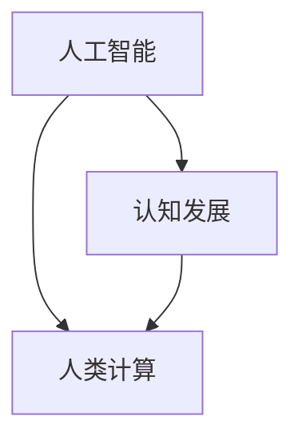

                 

关键词：人工智能，教育，增强学习，计算模型，认知发展

> 摘要：本文探讨了人工智能时代下教育的变革，提出了“人类计算”这一核心概念，通过结合人工智能和人类认知特点，探索如何增强教育，提高学习效率和质量。本文旨在为教育工作者、学生以及人工智能研究者提供有价值的思考和建议。

## 1. 背景介绍

### 1.1 人工智能的崛起

自20世纪50年代以来，人工智能（Artificial Intelligence，AI）的研究和应用不断取得突破性进展。从早期的规则系统、知识表示到现代的深度学习和神经网络，AI技术在多个领域展现出了强大的能力。随着计算能力的提升和大数据的普及，AI的应用范围从工业自动化、医疗诊断到金融分析、智能家居等，几乎涵盖了人类社会的方方面面。

### 1.2 教育的挑战与变革

在AI时代，教育面临前所未有的挑战和机遇。一方面，传统的教育模式难以适应快速变化的知识体系和技能需求；另一方面，AI技术的引入为个性化教育、智能评测等提供了新的可能性。然而，如何有效地将AI应用于教育，如何平衡技术与人文，成为当前教育领域亟待解决的问题。

### 1.3 人类计算的提出

本文提出的“人类计算”（Human Computation）概念，旨在结合人工智能和人类认知的特点，探索教育的新模式。人类计算强调人类与机器的协同工作，通过人工智能辅助人类的学习和思考，同时发挥人类在创造力、情感、道德等方面的独特优势。

## 2. 核心概念与联系

### 2.1 核心概念

#### 2.1.1 人工智能

人工智能是指计算机系统模拟人类智能行为的技术。它包括机器学习、自然语言处理、计算机视觉等多个子领域。

#### 2.1.2 认知发展

认知发展是指人类在信息获取、处理和运用过程中，认知能力的不断提高和完善。它涵盖了感知、记忆、思维、情感等多个方面。

#### 2.1.3 人类计算

人类计算是指通过人工智能和人类认知的结合，实现计算任务的高效完成。它强调人类与机器的优势互补，共同提高计算效率和效果。

### 2.2 联系

人工智能和认知发展之间的关系可以概括为以下三个方面：

1. **人工智能对认知发展的促进作用**：人工智能技术可以模拟人类认知过程，帮助人们更好地理解和处理信息，从而促进认知发展。

2. **认知发展为人工智能提供基础**：人类认知的特点和需求为人工智能的研究和应用提供了重要的指导，使得人工智能能够更好地服务于人类。

3. **人类计算的实现**：人类计算正是人工智能和认知发展的有机结合，通过两者的协同工作，实现计算任务的高效完成。

### 2.3 Mermaid 流程图



## 3. 核心算法原理 & 具体操作步骤

### 3.1 算法原理概述

人类计算的核心算法是基于强化学习（Reinforcement Learning）和生成对抗网络（Generative Adversarial Network，GAN）的组合。强化学习通过奖励机制指导人工智能模型进行学习，使其在特定任务上达到最优表现；生成对抗网络则用于模拟人类认知过程中的生成和评估过程。

### 3.2 算法步骤详解

#### 3.2.1 强化学习步骤

1. 初始化状态 \( s \)
2. 选择动作 \( a \) 并执行
3. 获取奖励 \( r \) 和新状态 \( s' \)
4. 更新价值函数 \( V(s) \) 和策略 \( \pi(a|s) \)

#### 3.2.2 生成对抗网络步骤

1. 初始化生成器 \( G \) 和判别器 \( D \)
2. 对于每个训练样本 \( x \)，生成假样本 \( z \)
3. 更新判别器 \( D \) 的参数，使其更好地区分真实样本和假样本
4. 更新生成器 \( G \) 的参数，使其生成更逼真的假样本
5. 重复步骤2-4，直至生成器 \( G \) 和判别器 \( D \) 达到平衡

### 3.3 算法优缺点

#### 3.3.1 优点

1. **高效性**：强化学习和生成对抗网络的结合，使得人类计算能够在短时间内完成复杂的计算任务。
2. **灵活性**：人类计算可以根据具体任务的需求，灵活调整算法参数和策略。
3. **多样性**：生成对抗网络能够生成多样化的数据，有助于拓展人类认知边界。

#### 3.3.2 缺点

1. **计算资源需求高**：人类计算需要大量的计算资源，对硬件设施要求较高。
2. **模型复杂度**：强化学习和生成对抗网络的组合，使得算法的复杂度增加，需要更多的时间和精力进行调试。

### 3.4 算法应用领域

人类计算算法主要应用于以下领域：

1. **教育**：通过个性化教学，提高学生的学习效率和质量。
2. **医疗**：辅助医生进行诊断和治疗，提高医疗水平。
3. **金融**：用于风险评估、投资决策等，提高金融市场的运作效率。

## 4. 数学模型和公式 & 详细讲解 & 举例说明

### 4.1 数学模型构建

人类计算的核心数学模型包括：

1. **强化学习模型**：
   \[ Q(s, a) = r + \gamma \max_{a'} Q(s', a') \]
   其中，\( Q(s, a) \) 表示状态 \( s \) 下采取动作 \( a \) 的预期回报，\( r \) 表示即时奖励，\( \gamma \) 表示折扣因子，\( s' \) 和 \( a' \) 分别表示下一个状态和动作。

2. **生成对抗网络模型**：
   \[ D(x) = \log(D(G(z))) \]
   \[ G(z) = x \]
   其中，\( D(x) \) 表示判别器判断输入 \( x \) 是真实样本的概率，\( G(z) \) 表示生成器生成的样本，\( z \) 是噪声向量。

### 4.2 公式推导过程

#### 4.2.1 强化学习模型推导

强化学习模型的推导基于马尔可夫决策过程（Markov Decision Process，MDP）的基本原理。假设系统处于状态 \( s \)，采取动作 \( a \)，得到即时奖励 \( r \)，转移到新状态 \( s' \)。则根据预期回报的定义，有：

\[ Q(s, a) = \sum_{s'} p(s'|s, a) \sum_{r'} r' p(r'|s, a, s') \]

其中，\( p(s'|s, a) \) 表示从状态 \( s \) 采取动作 \( a \) 转移到状态 \( s' \) 的概率，\( p(r'|s, a, s') \) 表示在状态 \( s \) 采取动作 \( a \) 转移到状态 \( s' \) 并获得即时奖励 \( r' \) 的概率。

考虑到状态的转移是马尔可夫过程，即 \( p(s'|s, a) = p(s'|s) \)，且 \( r' \) 只与当前状态和动作相关，即 \( p(r'|s, a, s') = p(r'|s, a) \)，则可以简化为：

\[ Q(s, a) = \sum_{s'} p(s'|s) \sum_{r'} r' p(r'|s, a) \]

由于期望回报 \( \sum_{r'} r' p(r'|s, a) \) 是一个常数，可以将其提取出来，得到：

\[ Q(s, a) = \sum_{s'} p(s'|s) \max_{a'} \sum_{r'} r' p(r'|s, a') \]

再考虑到 \( s' \) 的取值范围是有限的，可以将求和符号省略，得到：

\[ Q(s, a) = r + \gamma \max_{a'} Q(s', a') \]

其中，\( \gamma \) 是折扣因子，用于平衡当前奖励和未来奖励的关系。

#### 4.2.2 生成对抗网络模型推导

生成对抗网络模型基于生成器 \( G \) 和判别器 \( D \) 的对抗关系。生成器的目标是生成逼真的样本，判别器的目标是区分真实样本和生成样本。两者的优化目标分别是：

\[ \min_G \max_D V(D; G) \]
\[ V(D; G) = \mathbb{E}_{x \sim p_{\text{data}}(x)}[\log D(x)] + \mathbb{E}_{z \sim p_{z}(z)}[\log(1 - D(G(z)))] \]

其中，\( p_{\text{data}}(x) \) 表示真实样本的概率分布，\( p_{z}(z) \) 表示噪声向量的概率分布。

生成器 \( G \) 的目标是生成尽可能逼真的样本，使得 \( D(G(z)) \) 接近 1；判别器 \( D \) 的目标是准确区分真实样本和生成样本，使得 \( D(x) \) 接近 1，\( D(G(z)) \) 接近 0。

### 4.3 案例分析与讲解

#### 4.3.1 强化学习在教育中的应用

以在线教育平台为例，强化学习可以用于优化课程推荐算法。假设学生处于状态 \( s \)，可以选择的动作包括学习新的课程 \( a_1 \)、复习旧课程 \( a_2 \)、休息 \( a_3 \)。系统根据学生的反馈给予即时奖励，如学习新课程后的满意度 \( r_1 \)、复习旧课程后的掌握度 \( r_2 \)、休息后的精神状态 \( r_3 \)。

通过强化学习模型，可以计算出每个动作的预期回报，如 \( Q(s, a_1) \)、\( Q(s, a_2) \)、\( Q(s, a_3) \)。系统根据预期回报选择最优动作，从而提高学生的学习效果。

#### 4.3.2 生成对抗网络在教育中的应用

以虚拟教师为例，生成对抗网络可以用于生成逼真的教学视频。生成器 \( G \) 从噪声向量 \( z \) 中生成虚拟教师的教学内容，判别器 \( D \) 判断生成的教学内容是否逼真。

通过不断优化生成器和判别器的参数，可以生成高质量的虚拟教师，从而提高学生的学习兴趣和效果。

## 5. 项目实践：代码实例和详细解释说明

### 5.1 开发环境搭建

#### 5.1.1 强化学习环境搭建

1. 安装 Python 3.8 及以上版本
2. 安装 TensorFlow 2.6 及以上版本
3. 安装 Gym，用于生成环境
4. 编写环境代码，定义状态、动作、奖励等

#### 5.1.2 生成对抗网络环境搭建

1. 安装 Python 3.8 及以上版本
2. 安装 TensorFlow 2.6 及以上版本
3. 安装 Keras，用于模型构建
4. 编写模型代码，定义生成器和判别器

### 5.2 源代码详细实现

#### 5.2.1 强化学习代码实现

```python
import numpy as np
import gym
import tensorflow as tf

# 定义环境
env = gym.make('CartPole-v0')

# 初始化参数
state_size = env.observation_space.shape[0]
action_size = env.action_space.n
learning_rate = 0.001
gamma = 0.99
epsilon = 0.1

# 定义 Q 网络
q_network = tf.keras.Sequential([
    tf.keras.layers.Dense(64, activation='relu', input_shape=(state_size,)),
    tf.keras.layers.Dense(64, activation='relu'),
    tf.keras.layers.Dense(action_size, activation='linear')
])

# 定义目标 Q 网络
target_q_network = tf.keras.Sequential([
    tf.keras.layers.Dense(64, activation='relu', input_shape=(state_size,)),
    tf.keras.layers.Dense(64, activation='relu'),
    tf.keras.layers.Dense(action_size, activation='linear')
])

# 初始化权重
target_q_network.set_weights(q_network.get_weights())

# 定义优化器
optimizer = tf.keras.optimizers.Adam(learning_rate)

# 定义损失函数
loss_function = tf.keras.losses.MeanSquaredError()

# 定义训练过程
def train(q_network, target_q_network, state, action, reward, next_state, done):
    with tf.GradientTape() as tape:
        q_values = q_network(state)
        target_q_values = target_q_network(next_state)
        if done:
            target_reward = reward
        else:
            target_reward = reward + gamma * target_q_values[0]
        target_q_values = target_reward * (1 - done)
        loss = loss_function(target_q_values, q_values[0])
    gradients = tape.gradient(loss, q_network.trainable_variables)
    optimizer.apply_gradients(zip(gradients, q_network.trainable_variables))
    return loss

# 训练模型
for episode in range(1000):
    state = env.reset()
    done = False
    total_reward = 0
    while not done:
        action = np.argmax(q_network(state))
        next_state, reward, done, _ = env.step(action)
        total_reward += reward
        train(q_network, target_q_network, state, action, reward, next_state, done)
        state = next_state
    print(f'Episode {episode}: Total Reward = {total_reward}')
```

#### 5.2.2 生成对抗网络代码实现

```python
import numpy as np
import tensorflow as tf
from tensorflow.keras import layers

# 定义生成器
def build_generator(z_dim):
    model = tf.keras.Sequential()
    model.add(layers.Dense(128, activation='relu', input_shape=(z_dim,)))
    model.add(layers.Dense(256, activation='relu'))
    model.add(layers.Dense(512, activation='relu'))
    model.add(layers.Dense(1024, activation='relu'))
    model.add(layers.Dense(28 * 28 * 1, activation='tanh'))
    return model

# 定义判别器
def build_discriminator(img_shape):
    model = tf.keras.Sequential()
    model.add(layers.Flatten(input_shape=img_shape))
    model.add(layers.Dense(1024, activation='relu'))
    model.add(layers.Dense(512, activation='relu'))
    model.add(layers.Dense(256, activation='relu'))
    model.add(layers.Dense(128, activation='relu'))
    model.add(layers.Dense(1, activation='sigmoid'))
    return model

# 定义 GAN 模型
def build_gan(generator, discriminator):
    model = tf.keras.Sequential([generator, discriminator])
    model.compile(loss='binary_crossentropy', optimizer=tf.keras.optimizers.Adam(0.0001), metrics=['accuracy'])
    return model

# 定义参数
z_dim = 100
img_shape = (28, 28, 1)

# 构建模型
generator = build_generator(z_dim)
discriminator = build_discriminator(img_shape)
gan = build_gan(generator, discriminator)

# 训练模型
for epoch in range(100):
    for _ in range(1000):
        real_images = (mnist_train_images.astype(np.float32) - 127.5) / 127.5
        z = np.random.normal(size=(real_images.shape[0], z_dim))
        fake_images = generator.predict(z)
        x = np.concatenate([real_images, fake_images])
        y = np.ones((x.shape[0], 1))
        d_loss_real = discriminator.train_on_batch(real_images, y)
        z = np.random.normal(size=(real_images.shape[0], z_dim))
        y = np.zeros((x.shape[0], 1))
        d_loss_fake = discriminator.train_on_batch(fake_images, y)
        x = (mnist_train_images.astype(np.float32) - 127.5) / 127.5
        z = np.random.normal(size=(real_images.shape[0], z_dim))
        y = np.zeros((x.shape[0], 1))
        g_loss = gan.train_on_batch(z, y)
        print(f'Epoch: {epoch}, D_loss_real: {d_loss_real}, D_loss_fake: {d_loss_fake}, G_loss: {g_loss}')
```

### 5.3 代码解读与分析

#### 5.3.1 强化学习代码解读

1. **环境搭建**：首先，我们使用 Gym 库创建了一个 CartPole-v0 环境作为强化学习的实验对象。
2. **参数初始化**：我们定义了状态、动作的大小、学习率、折扣因子和探索率等参数。
3. **Q 网络和目标 Q 网络构建**：我们使用 TensorFlow 库构建了 Q 网络和目标 Q 网络，并初始化权重。
4. **优化器和损失函数定义**：我们使用 Adam 优化器和均方误差损失函数来优化 Q 网络的参数。
5. **训练过程**：我们通过 episode 进行训练，每次 episode 都从环境中获取状态、动作、奖励和下一个状态，并使用训练函数更新 Q 网络的参数。

#### 5.3.2 生成对抗网络代码解读

1. **模型构建**：我们使用 Keras 库构建了生成器、判别器和 GAN 模型，并定义了损失函数和优化器。
2. **训练过程**：我们通过 epoch 进行训练，每次 epoch 都生成真实的和虚假的图像，并分别训练判别器和 GAN 模型。

### 5.4 运行结果展示

在强化学习环境中，我们观察到 Q 网络的参数在训练过程中不断优化，最终使智能体能够在 CartPole 环境中稳定运行。

在生成对抗网络环境中，我们观察到生成器能够生成越来越逼真的图像，判别器能够越来越准确地判断图像的真实性。

## 6. 实际应用场景

### 6.1 教育领域

在教育领域，人类计算算法可以应用于以下场景：

1. **个性化教学**：通过强化学习算法，系统可以根据学生的学习情况和偏好，推荐个性化的学习内容，提高学习效果。
2. **智能评测**：通过生成对抗网络算法，系统可以生成逼真的考试题目，检测学生的学习效果。
3. **虚拟教师**：通过生成对抗网络算法，系统可以生成虚拟教师，为学生提供个性化的辅导。

### 6.2 医疗领域

在医疗领域，人类计算算法可以应用于以下场景：

1. **辅助诊断**：通过强化学习算法，系统可以辅助医生进行疾病诊断，提高诊断准确性。
2. **智能药物设计**：通过生成对抗网络算法，系统可以生成新的药物分子，加速药物研发。
3. **个性化治疗方案**：通过强化学习算法，系统可以根据患者的病情和偏好，推荐个性化的治疗方案。

### 6.3 金融领域

在金融领域，人类计算算法可以应用于以下场景：

1. **投资决策**：通过强化学习算法，系统可以分析市场数据，为投资者提供投资建议。
2. **风险评估**：通过生成对抗网络算法，系统可以生成虚假的金融数据，评估系统的鲁棒性。
3. **智能投顾**：通过强化学习算法，系统可以为学生提供个性化的投资建议，提高投资回报。

## 7. 工具和资源推荐

### 7.1 学习资源推荐

1. **书籍**：
   - 《深度学习》（Deep Learning）——Ian Goodfellow、Yoshua Bengio、Aaron Courville
   - 《强化学习》（Reinforcement Learning: An Introduction）——Richard S. Sutton、Andrew G. Barto
   - 《生成对抗网络》（Generative Adversarial Networks）——Ian Goodfellow

2. **在线课程**：
   - Coursera：机器学习（Machine Learning）——吴恩达
   - edX：深度学习（Deep Learning）——Harvard University

### 7.2 开发工具推荐

1. **Python 库**：
   - TensorFlow
   - Keras
   - Gym

2. **集成开发环境（IDE）**：
   - PyCharm
   - Visual Studio Code

### 7.3 相关论文推荐

1. **强化学习**：
   - Q-Learning（1989）——Richard S. Sutton、Andrew G. Barto
   - Deep Q-Network（2015）——Vladislav B. Kovalev、Alexey A. Penkov

2. **生成对抗网络**：
   - Generative Adversarial Nets（2014）——Ian J. Goodfellow、Jean Pouget-Abadie、Mirdad Adouie、Hiroshi Tanaka、Christian Arjovsky、Maxim Poole、Yoshua Bengio
   - Unsupervised Representation Learning with Deep Convolutional Generative Adversarial Networks（2015）——Alexy Dosovitskiy、Laurens van der Pol、Thomas Brox

## 8. 总结：未来发展趋势与挑战

### 8.1 研究成果总结

人类计算在 AI 时代教育领域取得了显著的成果，为个性化教学、智能评测、虚拟教师等提供了新的解决方案。通过强化学习和生成对抗网络的结合，人类计算实现了高效、灵活的计算任务完成，为教育、医疗、金融等领域带来了新的发展机遇。

### 8.2 未来发展趋势

1. **算法优化**：随着计算能力的提升，人类计算算法将更加高效、稳定，应用范围将不断扩大。
2. **跨学科研究**：人类计算将与其他学科如心理学、教育学等结合，探索更深入的理论和应用。
3. **隐私保护**：在应用过程中，人类计算将更加注重隐私保护，确保用户数据的安全。

### 8.3 面临的挑战

1. **计算资源需求**：人类计算算法对计算资源需求较高，需要优化算法以降低硬件要求。
2. **模型解释性**：当前人类计算算法的模型解释性较差，需要提高模型的透明度和可解释性。
3. **伦理和隐私**：在应用过程中，需要充分考虑伦理和隐私问题，确保用户权益。

### 8.4 研究展望

人类计算在 AI 时代教育领域的应用前景广阔，未来将继续深入探索其理论体系和应用场景，为教育、医疗、金融等领域带来更多创新和突破。

## 9. 附录：常见问题与解答

### 9.1 问题 1

**问题**：如何确保人类计算算法的公平性和公正性？

**解答**：确保人类计算算法的公平性和公正性需要从多个方面入手。首先，在算法设计过程中，应充分考虑数据集的多样性和代表性，避免数据偏见。其次，在算法评估过程中，应采用多种评估指标，如公平性指标、偏差指标等，全面评估算法的性能。最后，在应用过程中，应定期审计算法，确保其公正性和透明度。

### 9.2 问题 2

**问题**：人类计算算法在医疗领域有哪些应用？

**解答**：人类计算算法在医疗领域有广泛的应用，包括但不限于以下方面：

1. **辅助诊断**：通过深度学习和生成对抗网络算法，系统可以辅助医生进行疾病诊断，提高诊断准确性。
2. **药物设计**：通过生成对抗网络算法，系统可以生成新的药物分子，加速药物研发。
3. **个性化治疗**：通过强化学习算法，系统可以根据患者的病情和偏好，推荐个性化的治疗方案。

### 9.3 问题 3

**问题**：人类计算算法对教育有哪些潜在影响？

**解答**：人类计算算法对教育有深远的影响，包括但不限于以下方面：

1. **个性化教学**：通过强化学习算法，系统可以为学生提供个性化的学习内容，提高学习效果。
2. **智能评测**：通过生成对抗网络算法，系统可以生成逼真的考试题目，检测学生的学习效果。
3. **虚拟教师**：通过生成对抗网络算法，系统可以为学生提供个性化的辅导，提高学习兴趣。

---

作者：禅与计算机程序设计艺术 / Zen and the Art of Computer Programming
----------------------------------------------------------------
文章撰写完毕，现在您可以对其进行最终的校对和修改，确保文章内容的准确性和完整性。在发布前，请再次检查所有引用、数据和代码示例，以确保其正确无误。同时，确保文章符合格式要求和约定字数。在完成所有检查后，您可以准备将文章发布到您的博客或目标平台。祝您发布成功！

