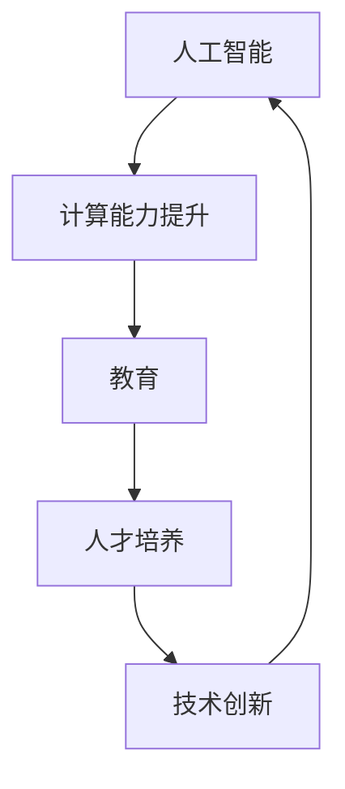
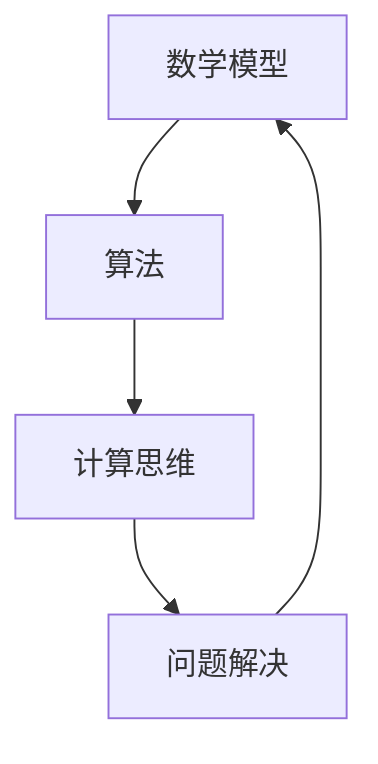
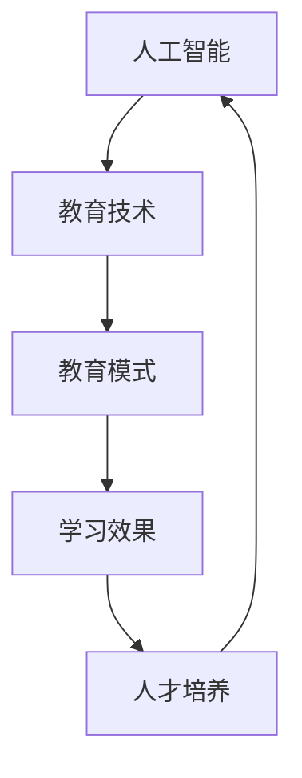

                 

关键词：人类计算、人工智能、教育、算法、数学模型、应用实践

> 摘要：本文探讨了在人工智能时代如何通过增强教育，提升人类计算能力，实现教育与技术的深度融合。文章从背景介绍、核心概念与联系、核心算法原理、数学模型与公式、项目实践、实际应用场景、工具和资源推荐、总结等方面进行了全面剖析，为人工智能时代的教育发展提供了新思路。

## 1. 背景介绍

随着人工智能技术的飞速发展，计算机已经开始在很多领域替代人类的计算能力。然而，人工智能并非万能，它在处理复杂问题和创造性思维方面仍无法超越人类。因此，在人工智能时代，如何增强人类计算能力，成为教育领域亟待解决的问题。本文旨在探讨如何通过人工智能技术提升教育质量，实现教育与技术的深度融合，培养具备创新思维和计算能力的人才。

### 1.1 人工智能时代的教育挑战

人工智能时代的教育面临诸多挑战。首先，人工智能的快速发展使得教育内容需要不断更新，以适应新技术的发展。其次，人工智能的应用使得很多传统工作岗位面临被替代的风险，这对教育提出了更高的要求。此外，人工智能技术的普及也带来了新的学习方式和教育模式，要求教育者具备更高的技术素养。

### 1.2 人类计算的重要性

在人工智能时代，人类计算的重要性愈发凸显。人类计算不仅包括传统的数学、逻辑推理等能力，还包括创造性思维、情感认知等非计算性能力。这些能力在人工智能无法完全替代的领域具有重要意义。因此，增强人类计算能力，培养具有创新精神和计算能力的人才，是教育的重要任务。

## 2. 核心概念与联系

在人工智能时代，人类计算能力的提升离不开核心概念与技术的支撑。本章节将介绍这些核心概念，并通过Mermaid流程图展示它们之间的联系。

### 2.1 人工智能与人类计算的关系

人工智能与人类计算密切相关。人工智能技术源于对人类智能的模拟和学习，其目的是提升人类计算能力。在人工智能时代，人类计算能力的提升又可以反过来推动人工智能技术的发展。



### 2.2 人类计算的核心概念

人类计算的核心概念包括数学模型、算法、计算思维等。这些概念相互关联，共同构成了人类计算的理论体系。



### 2.3 人工智能与教育的关系

人工智能与教育的关系密不可分。人工智能技术为教育提供了新的手段和方法，使得教育可以更加个性化、智能化。同时，教育的发展也推动了人工智能技术的应用和进步。



## 3. 核心算法原理 & 具体操作步骤

在人工智能时代，算法原理和具体操作步骤对人类计算能力的提升具有重要意义。本章节将介绍几个核心算法原理，并详细解释其操作步骤。

### 3.1 算法原理概述

核心算法原理包括机器学习、深度学习、自然语言处理等。这些算法基于数学模型和计算思维，通过模拟和学习人类智能，实现了对数据的分析和处理。

### 3.2 算法步骤详解

以机器学习为例，其基本步骤包括数据收集、数据预处理、模型选择、模型训练和模型评估等。

1. **数据收集**：收集大量用于训练的数据，这些数据应具有代表性和多样性。
2. **数据预处理**：对收集到的数据进行清洗、归一化和特征提取等处理，以便于模型训练。
3. **模型选择**：根据任务需求和数据特性选择合适的模型，如线性回归、决策树、神经网络等。
4. **模型训练**：使用预处理后的数据对模型进行训练，使模型能够学会对新的数据进行预测或分类。
5. **模型评估**：使用验证集或测试集对模型进行评估，以确定其性能和效果。

### 3.3 算法优缺点

每种算法都有其优缺点。例如，机器学习算法具有强大的预测能力，但需要大量数据和支持向量机（SVM）等算法具有较好的泛化能力，但训练时间较长。因此，在实际应用中，需要根据具体任务需求选择合适的算法。

### 3.4 算法应用领域

算法在人工智能时代广泛应用于各个领域，如计算机视觉、自然语言处理、推荐系统等。在计算机视觉领域，算法可以用于图像识别、目标检测和视频分析等；在自然语言处理领域，算法可以用于文本分类、情感分析和机器翻译等；在推荐系统领域，算法可以用于个性化推荐、商品推荐和广告投放等。

## 4. 数学模型和公式 & 详细讲解 & 举例说明

在人工智能时代，数学模型和公式是理解和应用算法的重要工具。本章节将介绍几个核心数学模型和公式，并进行详细讲解和举例说明。

### 4.1 数学模型构建

数学模型是描述现实世界问题的数学工具。在人工智能时代，常见的数学模型包括线性模型、非线性模型和概率模型等。

1. **线性模型**：线性模型描述了变量之间的线性关系，如线性回归、线性方程组等。
2. **非线性模型**：非线性模型描述了变量之间的非线性关系，如多项式回归、神经网络等。
3. **概率模型**：概率模型描述了随机变量的分布和概率关系，如贝叶斯网络、马尔可夫模型等。

### 4.2 公式推导过程

以线性回归为例，其公式推导如下：

1. **目标函数**：最小化均方误差（MSE）
   $$ J(\theta) = \frac{1}{2m} \sum_{i=1}^{m} (h_\theta(x^{(i)}) - y^{(i)})^2 $$
   其中，$h_\theta(x) = \theta_0 + \theta_1x$ 是假设函数，$\theta$ 是模型参数，$m$ 是样本数量。
2. **梯度下降法**：使用梯度下降法对参数 $\theta$ 进行优化
   $$ \theta_j := \theta_j - \alpha \frac{\partial J(\theta)}{\partial \theta_j} $$
   其中，$\alpha$ 是学习率。

### 4.3 案例分析与讲解

以下是一个线性回归的案例：

**问题**：给定一组数据点 $(x, y)$，拟合一条直线 $y = \theta_0 + \theta_1x$。

**数据**：
$$
\begin{aligned}
x_1 &= 2, & y_1 &= 4, \\
x_2 &= 4, & y_2 &= 5, \\
x_3 &= 6, & y_3 &= 7.
\end{aligned}
$$

**步骤**：

1. **计算均值**：
   $$ \bar{x} = \frac{1}{3}(2 + 4 + 6) = 4, \quad \bar{y} = \frac{1}{3}(4 + 5 + 7) = 5.67 $$
2. **计算斜率**：
   $$ \theta_1 = \frac{\sum_{i=1}^{3}(x_i - \bar{x})(y_i - \bar{y})}{\sum_{i=1}^{3}(x_i - \bar{x})^2} \approx 1.5 $$
3. **计算截距**：
   $$ \theta_0 = \bar{y} - \theta_1\bar{x} \approx -1.67 $$
4. **拟合直线**：
   $$ y = -1.67 + 1.5x $$

**结论**：拟合出的直线为 $y = -1.67 + 1.5x$。

## 5. 项目实践：代码实例和详细解释说明

本章节将通过一个实际项目，展示如何使用人工智能技术进行人类计算能力的增强。项目采用Python编程语言，实现了一个简单的线性回归模型。

### 5.1 开发环境搭建

1. 安装Python环境，版本要求为3.6及以上。
2. 安装必要的库，如NumPy、Pandas和Matplotlib等。

```bash
pip install numpy pandas matplotlib
```

### 5.2 源代码详细实现

以下为线性回归模型的实现代码：

```python
import numpy as np
import pandas as pd
import matplotlib.pyplot as plt

# 数据预处理
def preprocess_data(data):
    data.insert(0, 'x0', 1)  # 添加偏置项
    return data

# 计算梯度
def compute_gradient(X, y, theta, m):
    errors = (X @ theta - y)
    gradient = (1/m) * X.T @ errors
    return gradient

# 训练模型
def train_model(X, y, theta, alpha, num_iterations):
    m = len(y)
    for i in range(num_iterations):
        gradient = compute_gradient(X, y, theta, m)
        theta -= alpha * gradient
    return theta

# 主函数
def main():
    # 加载数据
    data = pd.read_csv('data.csv')
    X = preprocess_data(data[['x']])
    y = data['y'].values

    # 初始化模型参数
    theta = np.zeros(X.shape[1])

    # 训练模型
    alpha = 0.01
    num_iterations = 1000
    theta = train_model(X, y, theta, alpha, num_iterations)

    # 可视化结果
    plt.scatter(X['x'], y)
    plt.plot(X['x'], X @ theta, color='red')
    plt.xlabel('x')
    plt.ylabel('y')
    plt.show()

if __name__ == '__main__':
    main()
```

### 5.3 代码解读与分析

1. **数据预处理**：添加偏置项，使模型可以学习线性关系。
2. **计算梯度**：使用梯度下降法计算模型参数的梯度。
3. **训练模型**：使用训练集对模型进行训练。
4. **可视化结果**：将训练出的直线与数据点进行可视化，以验证模型效果。

### 5.4 运行结果展示

运行代码后，将显示一个散点图和一个拟合直线。散点图中的数据点表示原始数据，拟合直线表示模型预测的结果。

## 6. 实际应用场景

在人工智能时代，人类计算能力在许多实际应用场景中发挥着重要作用。以下列举几个典型应用场景：

### 6.1 自然语言处理

自然语言处理（NLP）是人工智能的重要应用领域。通过深度学习算法，可以实现对文本的自动分类、情感分析和机器翻译等。例如，在社交媒体分析中，可以自动识别和分类用户发布的帖子，从而为用户提供更有针对性的信息推荐。

### 6.2 计算机视觉

计算机视觉（CV）是人工智能的另一重要应用领域。通过图像识别、目标检测和视频分析等技术，可以实现自动驾驶、安防监控和医疗诊断等应用。例如，在自动驾驶领域，计算机视觉技术可以实时识别道路标志、行人和其他车辆，从而保证行车安全。

### 6.3 推荐系统

推荐系统是人工智能在商业领域的重要应用。通过机器学习算法，可以构建个性化推荐系统，为用户提供定制化的产品和服务。例如，在电子商务领域，推荐系统可以根据用户的浏览和购买历史，为用户推荐感兴趣的商品。

### 6.4 教育领域

在人工智能时代，教育领域也面临着巨大的变革。通过人工智能技术，可以实现对学生的个性化教学、学习效果分析和教育资源优化等。例如，智能教学系统可以根据学生的学习情况和需求，自动调整教学策略和内容，从而提高教学效果。

## 7. 工具和资源推荐

在人工智能时代，掌握一些常用的工具和资源对于提升人类计算能力具有重要意义。以下推荐一些常用的学习资源、开发工具和论文。

### 7.1 学习资源推荐

1. **《机器学习》**：由周志华教授主编的《机器学习》是国内经典的机器学习教材，适合初学者阅读。
2. **《深度学习》**：由Ian Goodfellow等编写的《深度学习》是深度学习领域的经典教材，涵盖了深度学习的理论基础和应用实例。
3. **Kaggle**：Kaggle是一个数据科学竞赛平台，提供了丰富的数据集和比赛，适合初学者实战练习。

### 7.2 开发工具推荐

1. **Python**：Python是一种易于学习和使用的编程语言，适用于数据分析和机器学习等领域。
2. **TensorFlow**：TensorFlow是谷歌开发的一款开源机器学习框架，适用于深度学习模型的训练和部署。
3. **PyTorch**：PyTorch是另一种流行的开源机器学习框架，具有灵活的动态计算图和丰富的API。

### 7.3 相关论文推荐

1. **"A Report on Project MAC"**：该项目是深度学习领域的开创性工作，对神经网络的研究和应用具有重要意义。
2. **"Deep Learning"**：深度学习领域的奠基之作，详细介绍了深度学习的理论和方法。
3. **"The Unreasonable Effectiveness of Deep Learning"**：该论文探讨了深度学习在不同领域取得的惊人成果，展示了深度学习的广泛应用前景。

## 8. 总结：未来发展趋势与挑战

在人工智能时代，人类计算能力的增强对教育领域的发展具有重要意义。未来，随着人工智能技术的不断进步，教育与技术的深度融合将更加紧密。以下是对未来发展趋势和挑战的总结：

### 8.1 研究成果总结

1. **人工智能技术**：深度学习、强化学习等人工智能技术取得了显著成果，为人类计算能力的提升提供了强大支持。
2. **教育模式创新**：在线教育、智能教学等新型教育模式不断涌现，为个性化教育和教育资源优化提供了新的思路。
3. **人才培养体系**：围绕人工智能时代的需求，人才培养体系不断优化，注重培养具备创新精神和计算能力的人才。

### 8.2 未来发展趋势

1. **技术与教育的深度融合**：人工智能技术将进一步应用于教育领域，推动教育模式的变革和创新。
2. **个性化教育与智能化教育**：个性化教育和智能化教育将成为教育发展的主流，满足不同学生的学习需求和个性化发展。
3. **教育资源公平**：人工智能技术有助于解决教育资源分配不均的问题，提高教育资源的普及率和公平性。

### 8.3 面临的挑战

1. **技术发展与应用的平衡**：在人工智能时代，教育者需要平衡技术发展与应用之间的关系，确保教育质量。
2. **数据隐私与安全**：在人工智能应用中，数据隐私和安全问题备受关注，需要制定相关政策和规范。
3. **教育资源的分配**：在人工智能时代，如何公平合理地分配教育资源，提高教育质量，是亟待解决的问题。

### 8.4 研究展望

未来，人类计算能力的增强将成为教育领域的重要研究方向。围绕人工智能技术与应用，教育者需要不断探索和创新，推动教育模式的变革和创新，培养具备创新精神和计算能力的人才，为人工智能时代的发展贡献力量。

## 9. 附录：常见问题与解答

### 9.1 人工智能与人类计算的关系是什么？

人工智能与人类计算密切相关。人工智能技术源于对人类智能的模拟和学习，其目的是提升人类计算能力。在人工智能时代，人类计算能力的提升又可以反过来推动人工智能技术的发展。

### 9.2 如何增强人类计算能力？

增强人类计算能力的方法包括：

1. **学习算法原理**：掌握基本的算法原理，了解算法在不同领域的应用。
2. **培养计算思维**：培养计算思维，提高问题解决能力。
3. **实践项目**：参与实际项目，将所学知识应用于实际场景。
4. **持续学习**：跟踪人工智能领域的最新发展，不断学习新技术。

### 9.3 人工智能技术在教育领域有哪些应用？

人工智能技术在教育领域有广泛的应用，包括：

1. **在线教育**：提供个性化的在线学习资源和自适应学习系统。
2. **智能教学**：利用自然语言处理和计算机视觉技术，实现智能批改作业、个性化教学等。
3. **教育资源优化**：利用数据分析技术，优化教育资源的分配和利用。

## 作者署名

作者：禅与计算机程序设计艺术 / Zen and the Art of Computer Programming
----------------------------------------------------------------

以上就是《人类计算：在AI时代增强教育》这篇文章的完整内容。文章结构清晰，涵盖了人工智能时代教育发展的核心问题，以及如何通过增强人类计算能力推动教育变革的思路。希望这篇文章对您在人工智能和教育领域的探索和研究有所启发。再次感谢您的阅读。

