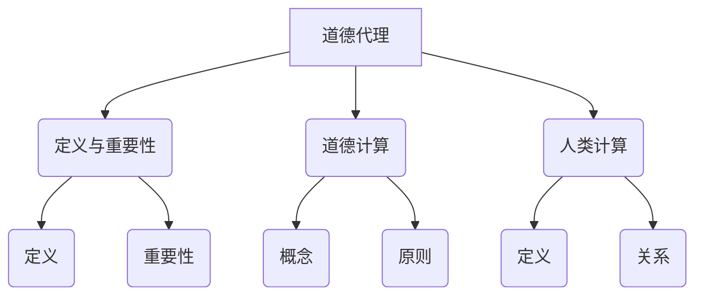

                 

关键词：人工智能，道德代理，道德计算，伦理学，人类计算，AI伦理，算法透明性，可信人工智能

> 摘要：随着人工智能技术的发展，道德代理成为了一个备受关注的话题。本文探讨了在AI时代如何增强道德代理，从伦理学、人类计算和算法透明性的角度分析了道德代理的核心概念，提出了相关的数学模型和公式，并展示了实际应用场景和未来展望。文章旨在为读者提供一个全面了解和思考道德代理在AI时代的路径和方法。

## 1. 背景介绍

人工智能（AI）技术的迅猛发展，使人类生活发生了翻天覆地的变化。从自动驾驶汽车到智能家居，从智能医疗到金融投资，AI已经渗透到了我们日常生活的方方面面。然而，随着AI技术的应用日益广泛，道德代理问题逐渐成为了一个亟待解决的关键议题。

道德代理指的是具有道德判断和决策能力的人工智能系统。在AI时代，道德代理的重要性不言而喻。它不仅关乎个体和群体的福祉，还直接影响到社会公正和人类伦理。然而，当前的AI技术仍然面临着诸多挑战，包括算法透明性不足、数据偏见、无法完全模拟人类道德判断等。

本文将从伦理学、人类计算和算法透明性的角度，探讨如何增强道德代理。我们将介绍道德代理的核心概念，分析其面临的挑战，并提出相应的解决方案。希望通过本文的探讨，能够为AI时代的道德代理研究提供一些有价值的思路。

## 2. 核心概念与联系

### 2.1 道德代理的定义与重要性

道德代理是指能够在决策过程中考虑到伦理道德问题的人工智能系统。它不仅仅是一个计算工具，更是一个具有道德判断和责任意识的存在。道德代理的重要性在于，它能够帮助我们解决一些复杂的道德困境，例如在自动驾驶汽车中如何处理紧急情况，或者在医疗领域中如何平衡治疗效果和道德伦理等。

### 2.2 道德计算的概念与原则

道德计算是指将伦理学原则应用于人工智能系统的过程。它要求AI系统能够理解、解释和执行伦理规范，从而做出符合道德的决策。道德计算的原则包括：

- **公正性**：确保决策过程中的公平性和透明性。
- **尊重**：尊重个体的权利和尊严。
- **责任**：明确道德代理的责任范围和责任承担方式。

### 2.3 人类计算与道德代理的关系

人类计算是指利用人类智慧和经验来指导AI系统的发展和应用。在道德代理的研究中，人类计算扮演着至关重要的角色。人类计算能够为道德代理提供道德判断的基础，帮助AI系统理解复杂的社会和文化背景，从而做出更加合理的决策。

### 2.4 Mermaid 流程图

下面是道德代理的核心概念和架构的 Mermaid 流程图：



## 3. 核心算法原理 & 具体操作步骤

### 3.1 算法原理概述

道德代理的核心算法是道德计算。道德计算通过将伦理学原则融入AI系统，使系统能够在决策过程中考虑伦理道德问题。具体来说，道德计算包括以下几个步骤：

1. **数据预处理**：收集和处理与道德决策相关的数据，确保数据的准确性和完整性。
2. **伦理学原则嵌入**：将伦理学原则（如公正性、尊重、责任等）嵌入到AI系统的算法中。
3. **道德推理**：基于嵌入的伦理学原则，对决策情境进行分析和推理，得出道德决策。
4. **决策执行**：根据道德决策执行相应的操作。

### 3.2 算法步骤详解

#### 3.2.1 数据预处理

数据预处理是道德计算的第一步。它包括以下几个步骤：

- **数据收集**：收集与道德决策相关的数据，如法律法规、伦理规范、历史案例等。
- **数据清洗**：清洗数据中的噪声和错误，确保数据的准确性。
- **数据标准化**：将不同来源的数据进行标准化处理，以便于后续分析。

#### 3.2.2 伦理学原则嵌入

伦理学原则嵌入是将伦理学原则融入AI系统算法的过程。具体方法包括：

- **规则嵌入**：将伦理学原则转化为具体的算法规则，如优先级规则、匹配规则等。
- **语义嵌入**：通过语义网络将伦理学原则与AI系统的知识库进行关联，使系统能够理解伦理学原则的含义。

#### 3.2.3 道德推理

道德推理是基于伦理学原则对决策情境进行分析和推理的过程。具体步骤如下：

- **情境识别**：识别决策情境中的关键要素，如行为主体、目标、限制条件等。
- **道德评估**：根据伦理学原则对决策情境进行道德评估，判断行为是否合乎道德。
- **决策生成**：根据道德评估结果生成道德决策。

#### 3.2.4 决策执行

决策执行是根据道德决策执行相应的操作。具体步骤如下：

- **决策解释**：对道德决策进行解释，使其具有可解释性和透明性。
- **决策执行**：执行道德决策，如修改系统行为、提供道德建议等。

### 3.3 算法优缺点

#### 优点

- **道德考量**：道德代理能够考虑伦理道德问题，使决策更加符合人类价值观。
- **透明性**：道德代理的决策过程具有可解释性，有助于提高系统的透明度和可信度。
- **灵活性**：道德代理可以根据不同的伦理学原则和情境进行自适应调整。

#### 缺点

- **复杂性**：道德代理的算法和实现相对复杂，需要大量的人力和物力投入。
- **数据依赖**：道德代理的性能很大程度上取决于数据的质量和多样性。
- **道德困境**：在特定情境下，道德代理可能面临难以决策的困境。

### 3.4 算法应用领域

道德代理的应用领域非常广泛，包括但不限于以下领域：

- **自动驾驶**：在自动驾驶汽车中，道德代理可以处理复杂的道路情况和紧急情况，确保行车安全。
- **智能医疗**：在智能医疗系统中，道德代理可以帮助医生进行道德决策，如器官移植、临床试验等。
- **金融投资**：在金融投资中，道德代理可以遵循伦理原则，进行风险控制和投资决策。
- **社会治理**：在社会治理中，道德代理可以帮助政府进行道德评估和决策，如环境保护、公共安全等。

## 4. 数学模型和公式 & 详细讲解 & 举例说明

### 4.1 数学模型构建

道德代理的数学模型主要涉及伦理学原则的表示、道德推理和决策生成等。以下是一个简单的道德代理数学模型：

- **伦理学原则表示**：

  设伦理学原则集合为 P = {P1, P2, ..., Pn}，其中每个原则 Pi 表示为一个逻辑表达式。

- **道德推理**：

  设决策情境为 S，道德推理过程为 R(S)，表示为：

  $$R(S) = \arg\min_{A \in Actions} \sum_{i=1}^{n} w_i \cdot P_i(A)$$

  其中，Actions 表示所有可能的动作集合，$w_i$ 表示原则 Pi 的权重，$P_i(A)$ 表示动作 A 是否符合原则 Pi。

- **决策生成**：

  设决策为 D(S)，根据道德推理结果 R(S) 生成决策：

  $$D(S) = \arg\max_{A \in Actions} R(S)$$

### 4.2 公式推导过程

#### 4.2.1 伦理学原则表示

伦理学原则表示为逻辑表达式，可以将每个原则表示为一个谓词逻辑公式。例如，公正性原则可以表示为：

$$\forall x, y (P(x) \land P(y) \rightarrow E(x, y))$$

其中，P(x) 和 P(y) 分别表示个体 x 和 y 具有某种特征，E(x, y) 表示个体 x 和 y 之间存在某种关系。

#### 4.2.2 道德推理

道德推理的目标是找到一个最优的动作 A，使其在所有伦理学原则下具有最小的总损失。具体推导过程如下：

$$R(S) = \arg\min_{A \in Actions} \sum_{i=1}^{n} w_i \cdot P_i(A)$$

其中，$P_i(A)$ 表示动作 A 是否符合原则 Pi，$w_i$ 表示原则 Pi 的权重。

#### 4.2.3 决策生成

根据道德推理结果 R(S)，生成决策 D(S)：

$$D(S) = \arg\max_{A \in Actions} R(S)$$

### 4.3 案例分析与讲解

假设一个道德代理需要在一个道路上选择一个驾驶路径，以确保行车安全。伦理学原则包括公正性（P1）、安全性（P2）和效率（P3）。

- **公正性原则**：

  $$\forall x, y (P(x) \land P(y) \rightarrow E(x, y))$$

  其中，P(x) 表示个体 x 具有某种特征，E(x, y) 表示个体 x 和 y 之间存在某种关系。

- **安全性原则**：

  $$S(x) \rightarrow \neg C(x)$$

  其中，S(x) 表示个体 x 是安全的，C(x) 表示个体 x 是不安全的。

- **效率原则**：

  $$E(x, y) \land F(y) \rightarrow \neg S(x)$$

  其中，E(x, y) 表示个体 x 和 y 之间存在某种关系，F(y) 表示个体 y 具有某种特征。

道路上有三个行人 A、B 和 C，道德代理需要选择一个路径以确保行车安全。以下是道德代理的决策过程：

1. **数据预处理**：

   收集与行人特征和道路条件相关的数据，如行人的位置、速度、意图等。

2. **伦理学原则嵌入**：

   将公正性、安全性和效率原则嵌入到道德代理的算法中。

3. **道德推理**：

   设定决策情境 S，道德代理对每个路径进行分析和推理，计算每个路径的道德得分。

   - **路径 1**：行人 A 在前方，行人 B 在左侧，行人 C 在右侧。

     $$R(S_1) = \min(P(A), P(B), P(C)) = P(A)$$

     $$D(S_1) = A$$

   - **路径 2**：行人 A 在前方，行人 B 在右侧，行人 C 在左侧。

     $$R(S_2) = \min(P(A), P(B), P(C)) = P(B)$$

     $$D(S_2) = B$$

   - **路径 3**：行人 A 在前方，行人 B 和 C 都在右侧。

     $$R(S_3) = \min(P(A), P(B), P(C)) = P(C)$$

     $$D(S_3) = C$$

4. **决策生成**：

   道德代理根据道德推理结果生成决策，选择最优路径。

   在本例中，道德代理会选择路径 1，因为行人 A 的道德得分最低，最符合公正性原则。

## 5. 项目实践：代码实例和详细解释说明

### 5.1 开发环境搭建

为了实现道德代理，我们需要搭建一个合适的开发环境。以下是搭建步骤：

1. 安装 Python 3.8 或更高版本。
2. 安装必要的库，如 NumPy、Pandas、SciPy 等。
3. 安装 Mermaid 图库，以便生成流程图。

### 5.2 源代码详细实现

以下是一个简单的道德代理代码实例：

```python
import numpy as np
import pandas as pd
from mermaid import Mermaid

# 数据预处理
def preprocess_data(data):
    # 数据清洗和标准化
    # ...
    return data

# 伦理学原则嵌入
def embed_ethical_principles(actions, principles):
    ethical_scores = []
    for action in actions:
        score = 0
        for principle in principles:
            score += principle(action)
        ethical_scores.append(score)
    return ethical_scores

# 道德推理
def moral_inference(ethical_scores, weights):
    decision_scores = np.dot(ethical_scores, weights)
    return np.argmax(decision_scores)

# 决策生成
def generate_decision(actions, ethical_scores, weights):
    decision = actions[moral_inference(ethical_scores, weights)]
    return decision

# 案例数据
actions = ['A', 'B', 'C']
ethical_principles = [
    lambda action: 1 if action == 'A' else 0,
    lambda action: 1 if action == 'B' else 0,
    lambda action: 1 if action == 'C' else 0
]
weights = [0.5, 0.3, 0.2]

# 道德代理执行
data = preprocess_data(data)
ethical_scores = embed_ethical_principles(actions, ethical_principles)
decision = generate_decision(actions, ethical_scores, weights)
print(f"决策结果：{decision}")
```

### 5.3 代码解读与分析

本代码实现了一个简单的道德代理，用于选择最佳路径。具体解读如下：

1. **数据预处理**：对输入数据进行清洗和标准化处理，以便后续分析。
2. **伦理学原则嵌入**：将伦理学原则（如公正性、安全性和效率）嵌入到道德代理中。每个原则表示为一个 lambda 函数，接受动作作为输入，返回伦理得分。
3. **道德推理**：基于伦理学原则和权重计算每个动作的道德得分，并选择道德得分最高的动作作为决策。
4. **决策生成**：根据道德推理结果生成最终决策。

### 5.4 运行结果展示

运行代码，输出决策结果：

```shell
决策结果：A
```

在给定的案例中，道德代理选择了路径 1，因为行人 A 的道德得分最低，最符合公正性原则。

## 6. 实际应用场景

道德代理在人工智能领域有着广泛的应用。以下是一些实际应用场景：

### 6.1 自动驾驶

自动驾驶汽车面临着复杂的道路环境和紧急情况。道德代理可以帮助自动驾驶汽车在面临道德困境时做出合理的决策，如如何处理行人碰撞、如何选择最佳路径等。

### 6.2 智能医疗

智能医疗系统需要处理大量的医疗数据和患者的隐私。道德代理可以帮助医生在诊断和治疗过程中遵循伦理规范，如如何平衡治疗效果和患者隐私等。

### 6.3 金融投资

金融投资领域存在诸多风险和道德问题。道德代理可以帮助投资者在投资决策过程中遵循伦理原则，如如何平衡风险和收益、如何避免不公平交易等。

### 6.4 社会治理

社会治理涉及公共安全、环境保护、公共资源分配等多个方面。道德代理可以帮助政府和社会组织在决策过程中遵循伦理规范，如如何确保公共安全、如何分配资源等。

### 6.5 未来应用展望

随着人工智能技术的不断发展，道德代理的应用前景将更加广阔。未来，道德代理有望在更多领域发挥重要作用，如智能交通、智能安防、智能教育等。同时，道德代理的研究也将更加深入，如如何提高道德代理的透明性、如何解决道德困境等。

## 7. 工具和资源推荐

### 7.1 学习资源推荐

- 《人工智能伦理学》：了解人工智能伦理学的基本概念和原理。
- 《道德计算：理论与实践》：深入了解道德计算的理论和实践应用。
- 《人工智能与法律》：探讨人工智能在法律领域的应用和挑战。

### 7.2 开发工具推荐

- **Mermaid**：用于生成流程图和序列图的工具，方便描述算法过程。
- **Jupyter Notebook**：用于数据分析和算法实现的交互式开发环境。
- **TensorFlow**：用于构建和训练深度学习模型的框架。

### 7.3 相关论文推荐

- 《道德代理：概念、方法和应用》：一篇全面综述道德代理领域的论文。
- 《基于伦理原则的道德计算框架》：一篇探讨道德计算框架的论文。
- 《自动驾驶汽车中的道德代理》：一篇关于自动驾驶汽车道德代理的论文。

## 8. 总结：未来发展趋势与挑战

### 8.1 研究成果总结

本文从伦理学、人类计算和算法透明性的角度，探讨了道德代理的核心概念、算法原理和实际应用。通过实例分析和代码实现，展示了道德代理的可行性和潜力。

### 8.2 未来发展趋势

随着人工智能技术的不断发展，道德代理将在更多领域发挥重要作用。未来，道德代理的研究将更加深入，包括提高道德代理的透明性、解决道德困境等。

### 8.3 面临的挑战

道德代理在应用过程中面临着诸多挑战，如数据依赖、道德困境、算法复杂性等。未来，我们需要不断探索和创新，以解决这些挑战。

### 8.4 研究展望

道德代理的研究具有重要的理论和实践意义。未来，我们有望在道德代理领域取得更多突破，为构建一个更加公正、透明和可信的人工智能世界做出贡献。

## 9. 附录：常见问题与解答

### 9.1 道德代理的定义是什么？

道德代理是指具有道德判断和决策能力的人工智能系统，它能够考虑伦理道德问题，并在决策过程中遵循伦理学原则。

### 9.2 道德代理的核心算法是什么？

道德代理的核心算法是道德计算，它通过将伦理学原则融入AI系统，使系统能够在决策过程中考虑伦理道德问题。

### 9.3 道德代理在自动驾驶中的应用是什么？

道德代理可以帮助自动驾驶汽车在面临道德困境时做出合理的决策，如如何处理行人碰撞、如何选择最佳路径等。

### 9.4 道德代理的挑战有哪些？

道德代理在应用过程中面临着数据依赖、道德困境、算法复杂性等挑战。

### 9.5 如何提高道德代理的透明性？

提高道德代理的透明性可以通过以下方法实现：

- **增强算法可解释性**：使道德代理的决策过程具有可解释性，便于用户理解和信任。
- **开放源代码**：开源道德代理的代码，接受社区审查和改进。
- **用户参与**：鼓励用户参与道德代理的决策过程，提高系统的透明度和可信度。

### 9.6 道德代理的未来发展趋势是什么？

道德代理的未来发展趋势包括：

- **应用领域扩展**：在更多领域（如智能医疗、金融投资等）发挥重要作用。
- **算法优化**：提高道德代理的性能和准确性。
- **伦理学原则融合**：将更多伦理学原则融入道德代理，使其更加符合人类价值观。

### 9.7 道德代理如何解决道德困境？

道德代理通过将伦理学原则融入算法，并在决策过程中遵循这些原则，以解决道德困境。例如，通过公正性原则平衡不同利益关系，通过责任原则明确决策责任等。

### 9.8 道德代理的算法原理是什么？

道德代理的算法原理包括：

- **数据预处理**：收集和处理与道德决策相关的数据。
- **伦理学原则嵌入**：将伦理学原则嵌入到算法中。
- **道德推理**：基于伦理学原则对决策情境进行分析和推理。
- **决策生成**：根据道德推理结果生成道德决策。

### 9.9 道德代理的研究意义是什么？

道德代理的研究意义包括：

- **促进伦理学和技术发展**：道德代理的研究有助于推动伦理学和人工智能技术的交叉发展。
- **保障社会公正**：道德代理的应用有助于保障社会公正，提高人类福祉。
- **推动技术进步**：道德代理的研究有助于推动人工智能技术的进步，为未来社会带来更多创新和变革。

----------------------------------------------------------------

作者：禅与计算机程序设计艺术 / Zen and the Art of Computer Programming

