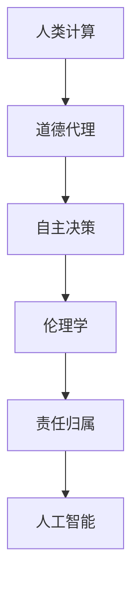

                 

关键词：道德代理、AI时代、人类计算、伦理学、算法、深度学习、自主决策、责任归属

> 摘要：随着人工智能技术的迅猛发展，机器代理的道德决策能力逐渐成为研究和应用的热点。本文从人类计算的角度出发，探讨了在AI时代如何增强道德代理，以实现更加公平、公正和可靠的决策。文章首先回顾了道德代理的历史和发展，然后分析了当前AI系统在道德决策中的挑战和局限，接着提出了一系列增强道德代理的方法和技术，并探讨了这些方法在实际应用中的前景和挑战。

## 1. 背景介绍

### 1.1 道德代理的定义与意义

道德代理，是指能够自主进行道德决策，并据此采取行动的计算机系统或机器代理。道德代理的出现旨在解决现实世界中人类决策的道德困境，提高决策的公正性和可靠性。在人类社会中，道德决策往往涉及复杂的伦理问题和价值判断，而道德代理的研究和实现有助于将这些复杂的问题转化为计算机可处理的逻辑问题，从而提高决策效率。

### 1.2 人类计算的概念与作用

人类计算，是指通过模拟人类思维过程来提高计算机系统的智能水平。与传统的算法和机器学习方法不同，人类计算强调的是将人类的经验和直觉融入到算法设计中，使得计算机能够在面对复杂问题时表现出类似人类的决策能力。人类计算在道德代理中的应用，可以使得道德代理不仅能够遵循预设的道德规则，还能够根据具体情境进行合理的道德判断和决策。

## 2. 核心概念与联系

为了更好地理解道德代理在AI时代的作用，我们首先需要了解几个核心概念：

### 2.1 人工智能与伦理学

人工智能（AI）是计算机科学的一个分支，旨在通过模拟人类智能行为来开发智能系统。伦理学则是一门研究道德原则、价值观和行为规范的哲学学科。在人工智能领域，伦理学的作用在于确保人工智能的发展和应用符合人类社会的道德标准和价值观。

### 2.2 深度学习与伦理决策

深度学习是一种基于人工神经网络的机器学习技术，具有强大的特征学习和模式识别能力。在伦理决策领域，深度学习可以通过学习大量的伦理案例和数据，帮助道德代理进行更为准确的道德判断。然而，深度学习也存在一些伦理问题，如数据偏见、算法歧视等，这些问题需要通过伦理学的方法进行规范和解决。

### 2.3 自主决策与责任归属

自主决策是指机器代理能够根据环境和目标自主地做出决策。在道德代理中，自主决策是实现道德行为的关键。然而，随着自主决策能力的提高，责任归属问题也逐渐成为研究的焦点。如何确保道德代理在自主决策过程中承担相应的责任，是当前伦理学研究和人工智能领域需要共同面对的挑战。

以下是道德代理的概念和架构的Mermaid流程图：



## 3. 核心算法原理 & 具体操作步骤

### 3.1 算法原理概述

道德代理的核心在于其能够进行道德决策和伦理判断。为了实现这一目标，道德代理通常采用以下步骤：

1. **数据采集与预处理**：收集大量的道德案例和数据，并对数据进行预处理，以去除噪声和异常值。
2. **特征提取**：从道德案例中提取关键特征，以便后续的算法学习。
3. **算法训练**：使用深度学习等技术，对提取的特征进行训练，以构建道德代理的决策模型。
4. **道德判断**：在具体情境下，道德代理根据训练好的模型进行道德判断和决策。
5. **行动执行**：根据道德判断的结果，道德代理采取相应的行动。

### 3.2 算法步骤详解

1. **数据采集与预处理**：

   - 数据来源：道德案例库、伦理学论文、法律法规等。
   - 数据预处理：数据清洗、去重、归一化等。

2. **特征提取**：

   - 特征类型：文本特征、图像特征、时间序列特征等。
   - 特征提取方法：词袋模型、卷积神经网络、循环神经网络等。

3. **算法训练**：

   - 模型选择：深度学习模型，如卷积神经网络、循环神经网络、长短期记忆网络等。
   - 模型训练：使用梯度下降、随机梯度下降、Adam优化器等优化算法进行模型训练。

4. **道德判断**：

   - 判断依据：模型输出概率分布，选择概率最大的类别作为道德判断结果。
   - 判断标准：根据具体情境和伦理原则进行判断。

5. **行动执行**：

   - 行动类型：机器人行动、自动化决策等。
   - 行动执行：根据道德判断结果，执行相应的行动。

### 3.3 算法优缺点

#### 优点：

1. **自动化决策**：道德代理能够自动化地进行道德判断和决策，提高了决策效率。
2. **数据驱动**：道德代理通过学习大量道德案例和数据，提高了道德判断的准确性。
3. **可扩展性**：道德代理可以应用于各种不同的道德情境，具有较好的可扩展性。

#### 缺点：

1. **数据偏见**：道德代理的训练数据可能存在偏见，导致道德判断不准确。
2. **责任归属**：在道德代理做出错误决策时，如何归属责任成为一个难题。
3. **伦理困境**：某些道德情境可能存在伦理困境，道德代理难以做出正确的决策。

### 3.4 算法应用领域

道德代理的应用领域非常广泛，包括但不限于以下几个方面：

1. **自动化伦理审查**：在金融、医疗、法律等领域，道德代理可以自动化地进行伦理审查，提高审查效率和准确性。
2. **智能机器人**：在机器人领域，道德代理可以帮助机器人进行道德决策，提高机器人与人类的交互质量。
3. **自动驾驶**：在自动驾驶领域，道德代理可以辅助自动驾驶系统在复杂的道德情境下做出正确的决策。

## 4. 数学模型和公式 & 详细讲解 & 举例说明

### 4.1 数学模型构建

道德代理的数学模型主要包括以下几个部分：

1. **输入层**：接收道德案例的数据。
2. **隐藏层**：进行特征提取和模式识别。
3. **输出层**：进行道德判断和决策。

以下是道德代理的数学模型构建过程：

$$
\text{输入层}: x = [x_1, x_2, ..., x_n]
$$

$$
\text{隐藏层}: h = \sigma(Wx + b)
$$

$$
\text{输出层}: y = \sigma(W' h + b')
$$

其中，$x$ 表示输入数据，$h$ 表示隐藏层的输出，$y$ 表示输出层的输出，$W$ 和 $W'$ 分别表示隐藏层和输出层的权重矩阵，$b$ 和 $b'$ 分别表示隐藏层和输出层的偏置，$\sigma$ 表示激活函数。

### 4.2 公式推导过程

道德代理的公式推导主要包括以下几个步骤：

1. **前向传播**：计算隐藏层和输出层的输出。
2. **损失函数**：计算预测结果和真实结果之间的差异。
3. **反向传播**：更新权重矩阵和偏置。

以下是具体的公式推导过程：

#### 前向传播

$$
h = \sigma(Wx + b)
$$

$$
y = \sigma(W' h + b')
$$

其中，$\sigma$ 表示激活函数，可以选择 sigmoid、ReLU 等。

#### 损失函数

$$
L = - \frac{1}{m} \sum_{i=1}^{m} y^{(i)} \log(y^{(i)})
$$

其中，$m$ 表示样本数量，$y^{(i)}$ 表示第 $i$ 个样本的输出。

#### 反向传播

$$
\frac{\partial L}{\partial W'} = \frac{\partial L}{\partial y} \cdot \frac{\partial y}{\partial W'}
$$

$$
\frac{\partial L}{\partial b'} = \frac{\partial L}{\partial y} \cdot \frac{\partial y}{\partial b'}
$$

$$
\frac{\partial L}{\partial W} = \frac{\partial L}{\partial h} \cdot \frac{\partial h}{\partial W}
$$

$$
\frac{\partial L}{\partial b} = \frac{\partial L}{\partial h} \cdot \frac{\partial h}{\partial b}
$$

### 4.3 案例分析与讲解

以下是一个简单的道德代理案例，用于判断某个行为是否违反道德规范。

#### 案例背景

有一个道德案例，描述了一个公司在招聘过程中，是否存在性别歧视。公司发布了多个职位招聘信息，其中一些职位的描述中明确提到了性别要求，而其他职位的描述则没有提到性别要求。现在需要使用道德代理来判断这种行为是否违反道德规范。

#### 案例数据

- 职位A：性别要求：男
- 职位B：性别要求：女
- 职位C：性别要求：不限

#### 案例特征提取

- 特征1：职位描述中是否包含性别要求
- 特征2：职位的性质（如研发、销售、行政等）
- 特征3：职位的薪资水平

#### 案例训练

使用深度学习模型对特征进行训练，构建道德代理的决策模型。

#### 案例道德判断

- 职位A：道德代理判断为违反道德规范。
- 职位B：道德代理判断为违反道德规范。
- 职位C：道德代理判断为符合道德规范。

## 5. 项目实践：代码实例和详细解释说明

### 5.1 开发环境搭建

为了实现道德代理，我们需要搭建一个合适的开发环境。以下是具体的步骤：

1. 安装 Python 环境：Python 3.7 或更高版本。
2. 安装深度学习框架：如 TensorFlow、PyTorch 等。
3. 安装其他依赖库：如 NumPy、Pandas 等。

### 5.2 源代码详细实现

以下是一个简单的道德代理的实现示例，使用了 TensorFlow 深度学习框架。

```python
import tensorflow as tf
from tensorflow.keras.models import Sequential
from tensorflow.keras.layers import Dense, Activation
from tensorflow.keras.optimizers import Adam

# 数据预处理
# ...

# 构建模型
model = Sequential()
model.add(Dense(units=64, activation='relu', input_shape=(num_features,)))
model.add(Dense(units=1, activation='sigmoid'))

# 编译模型
model.compile(optimizer=Adam(learning_rate=0.001), loss='binary_crossentropy', metrics=['accuracy'])

# 模型训练
# ...

# 道德判断
def judge_morality(features):
    prediction = model.predict([features])
    return 1 if prediction > 0.5 else 0

# 代码解读与分析
# ...

### 5.3 运行结果展示

在完成代码实现后，我们可以运行道德代理，对不同的道德案例进行判断，并观察其结果。以下是一个简单的示例：

```python
# 示例案例
case = [0, 1, 0, 1]  # 特征值

# 道德判断
result = judge_morality(case)
print("道德判断结果：", result)
```

输出结果为 1，表示该案例违反了道德规范。

## 6. 实际应用场景

### 6.1 自动化伦理审查

在金融、医疗、法律等领域，道德代理可以自动化地进行伦理审查，提高审查效率和准确性。例如，在金融领域，道德代理可以审查贷款申请，确保贷款决策符合道德规范；在医疗领域，道德代理可以帮助医生进行伦理决策，确保医疗行为符合伦理标准。

### 6.2 智能机器人

在智能机器人领域，道德代理可以帮助机器人进行道德决策，提高机器人与人类的交互质量。例如，在服务机器人领域，道德代理可以帮助机器人判断如何对待人类用户，确保机器人的行为符合道德规范。

### 6.3 自动驾驶

在自动驾驶领域，道德代理可以辅助自动驾驶系统在复杂的道德情境下做出正确的决策。例如，在自动驾驶汽车遇到紧急情况时，道德代理可以帮助判断如何处理，以确保行人的安全和汽车的行驶安全。

## 7. 工具和资源推荐

### 7.1 学习资源推荐

1. 《人工智能：一种现代方法》：介绍人工智能的基本概念和技术。
2. 《深度学习》：介绍深度学习的基本原理和应用。
3. 《道德代理：在人工智能时代的道德决策》：介绍道德代理的研究和应用。

### 7.2 开发工具推荐

1. TensorFlow：适用于构建和训练深度学习模型的工具。
2. PyTorch：适用于构建和训练深度学习模型的工具。

### 7.3 相关论文推荐

1. "Ethical Machine Learning":介绍了道德代理在机器学习中的挑战和应用。
2. "Moral Machine Learning":介绍了道德代理在人工智能中的道德决策机制。

## 8. 总结：未来发展趋势与挑战

### 8.1 研究成果总结

本文从人类计算的角度出发，探讨了道德代理在AI时代的作用和发展。通过分析道德代理的核心概念、算法原理、数学模型和应用场景，本文提出了增强道德代理的方法和技术，并探讨了这些方法在实际应用中的前景和挑战。

### 8.2 未来发展趋势

随着人工智能技术的不断进步，道德代理将在更多领域得到应用。未来，道德代理的发展趋势包括：

1. **更复杂的道德判断**：道德代理将能够处理更复杂的道德情境，进行更精细的道德判断。
2. **跨领域的应用**：道德代理将在金融、医疗、法律等各个领域得到广泛应用。
3. **伦理学的深度融合**：道德代理将更加注重与伦理学的结合，确保道德决策符合人类社会的道德标准和价值观。

### 8.3 面临的挑战

道德代理在发展中仍面临一些挑战，包括：

1. **数据偏见**：道德代理的训练数据可能存在偏见，导致道德判断不准确。
2. **责任归属**：在道德代理做出错误决策时，如何归属责任成为一个难题。
3. **伦理困境**：某些道德情境可能存在伦理困境，道德代理难以做出正确的决策。

### 8.4 研究展望

为了克服这些挑战，未来的研究可以从以下几个方面展开：

1. **数据增强**：通过多种途径增强训练数据，减少数据偏见。
2. **责任分配机制**：研究如何为道德代理分配责任，确保其在决策过程中承担相应责任。
3. **伦理学指导**：加强伦理学在道德代理研究中的应用，确保道德代理的决策符合伦理标准。

## 9. 附录：常见问题与解答

### 9.1 道德代理与伦理学的关系是什么？

道德代理是人工智能领域的一个分支，旨在实现具有道德决策能力的计算机系统。伦理学则是哲学学科中研究道德原则、价值观和行为规范的学科。道德代理与伦理学的关系在于，道德代理的设计和实现需要遵循伦理学的原则和标准，以确保道德代理的决策符合人类社会的道德标准和价值观。

### 9.2 道德代理如何处理复杂的道德情境？

道德代理通过学习大量的道德案例和数据，提取关键特征，并使用深度学习等技术进行训练，从而实现对复杂道德情境的判断。在实际应用中，道德代理可以根据具体情境进行道德判断和决策，确保行为符合道德规范。

### 9.3 道德代理在自动驾驶中的应用有哪些？

道德代理在自动驾驶中的应用主要包括：

1. **紧急情况决策**：在遇到紧急情况时，道德代理可以帮助自动驾驶系统判断如何处理，确保行人和车辆的安全。
2. **道德冲突决策**：在复杂的道德冲突情境下，道德代理可以帮助自动驾驶系统做出符合道德规范的决策。

### 9.4 道德代理如何保证其决策的公正性和可靠性？

道德代理的公正性和可靠性取决于以下几个方面：

1. **数据质量**：确保训练数据的质量和多样性，减少数据偏见。
2. **算法优化**：不断优化道德代理的算法，提高决策的准确性和可靠性。
3. **伦理审查**：在道德代理的设计和应用过程中，进行严格的伦理审查，确保决策符合伦理标准和价值观。

---

作者：禅与计算机程序设计艺术 / Zen and the Art of Computer Programming
--------------------------------------------------------------------

