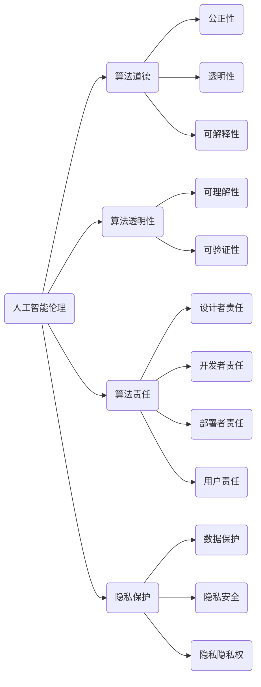

                 

关键词：人类计算，AI时代，道德意识，技术伦理，人工智能伦理，算法道德，算法透明性，算法责任，隐私保护，机器学习，深度学习，人工智能教育，伦理教育，科技社会责任。

> 摘要：随着人工智能（AI）技术的迅猛发展，人类计算在AI时代面临着前所未有的挑战。本文旨在探讨如何通过增强道德意识，提升人类计算在AI时代的道德水平，以确保技术的可持续发展和社会的和谐稳定。本文将从背景介绍、核心概念、算法原理、数学模型、项目实践、实际应用场景、工具资源推荐以及未来发展趋势等方面进行深入探讨。

## 1. 背景介绍

人工智能（AI）技术的发展正在以前所未有的速度改变着我们的生活方式和社会结构。从自动驾驶汽车到智能助手，从医疗诊断到金融决策，AI技术正在各个领域展现出巨大的潜力。然而，随着AI技术的普及，一系列伦理问题也逐渐显现出来。例如，算法偏见、隐私侵犯、数据安全、算法责任等，这些问题都挑战着人类计算的道德底线。

在这个背景下，增强人类计算的道德意识显得尤为重要。道德意识不仅关系到AI技术的正确使用，也关系到社会的公平正义和人类的福祉。本文将围绕这一主题，探讨人类计算在AI时代如何增强道德意识，确保技术发展的同时不损害人类的基本价值观和道德准则。

### 人工智能与人类计算的关系

人工智能与人类计算密不可分。人类计算是指人类在使用计算机和其他技术设备时的思考、决策和行动过程。而人工智能则是通过模拟人类的认知过程，实现自动化决策和智能行为的技术。人工智能的发展，使得人类计算的能力得到了极大的提升，但也带来了新的挑战。

一方面，人工智能使得人类能够处理大量复杂的数据，做出更准确的预测和决策。例如，在金融领域中，AI可以分析大量的市场数据，帮助投资者做出更明智的投资决策。在医疗领域中，AI可以辅助医生进行疾病诊断，提高诊断的准确性和效率。

另一方面，人工智能的发展也带来了一系列伦理问题。例如，算法偏见可能导致决策的不公正，数据隐私的泄露可能侵犯个人权益，算法的不透明性使得人们难以理解其决策过程，从而增加了算法被滥用的风险。

### 道德意识的重要性

道德意识是人类计算中不可或缺的一部分。道德意识指的是人类在行为和决策过程中，对道德规范的认知和遵守。在AI时代，道德意识的重要性更加凸显。首先，道德意识可以指导人类在开发和使用AI技术时，避免违背伦理原则，保护人类的利益和尊严。

其次，道德意识可以帮助人类识别和应对AI技术可能带来的负面影响。例如，在算法设计过程中，开发者需要有道德意识来避免算法偏见，确保算法的公正性和公平性。在使用AI技术时，用户需要有道德意识来尊重他人的隐私和权利，避免滥用技术。

最后，道德意识还可以促进社会对AI技术的信任。当人们认为AI技术是公正、透明、可信赖的，他们更愿意接受和使用这些技术。这种信任是AI技术可持续发展的基础。

## 2. 核心概念与联系

在探讨人类计算在AI时代的道德意识之前，我们需要明确几个核心概念，并理解它们之间的联系。

### 2.1 人工智能伦理

人工智能伦理是研究人工智能技术在社会、文化、法律和道德等领域中应用的伦理问题。它关注的是人工智能如何影响人类的生活，以及如何确保人工智能的发展符合人类的伦理原则和价值观。

### 2.2 算法道德

算法道德是指算法设计、开发和部署过程中，需要遵循的道德原则和规范。算法道德的核心是确保算法的公正性、透明性和可解释性，避免算法偏见和歧视。

### 2.3 算法透明性

算法透明性是指算法的决策过程和结果可以被理解和验证。算法透明性对于增强人类计算的道德意识至关重要，因为只有当人类能够理解算法的决策过程，他们才能对算法的道德性进行评估和监督。

### 2.4 算法责任

算法责任是指算法设计者、开发者、部署者以及使用者在算法应用过程中应承担的责任。算法责任的重要性在于，它能够确保算法的道德行为，防止算法滥用和恶意使用。

### 2.5 隐私保护

隐私保护是指保护个人隐私信息，防止隐私泄露和滥用。在AI时代，隐私保护尤为重要，因为AI技术通常需要处理大量的个人数据。

### 2.6 机器学习与深度学习

机器学习和深度学习是人工智能的核心技术。机器学习是指通过算法从数据中学习规律，进行预测和决策。深度学习是机器学习的一种特殊形式，它使用多层神经网络进行学习。机器学习和深度学习的发展，为AI技术的进步提供了强有力的支持。

### 2.7 伦理教育与科技社会责任

伦理教育和科技社会责任是指通过教育和培训，提高人们在科技领域中的道德意识和责任感。伦理教育和科技社会责任对于培养具备道德意识的人工智能专业人才至关重要。

### 2.8 Mermaid 流程图

以下是一个用于描述核心概念之间关系的 Mermaid 流程图：



通过这个流程图，我们可以清晰地看到各个核心概念之间的关系，以及它们在人类计算中的重要性。

## 3. 核心算法原理 & 具体操作步骤

### 3.1 算法原理概述

在AI时代，算法的道德性和透明性是确保人类计算道德水平的关键。为了实现这一目标，我们需要深入理解核心算法的原理，并制定相应的操作步骤。

### 3.2 算法步骤详解

#### 3.2.1 数据收集与预处理

数据收集是算法开发的第一步。在这一阶段，我们需要收集大量的数据，以确保算法的准确性和泛化能力。数据收集后，我们还需要对数据进行预处理，包括清洗、归一化和特征提取等。

#### 3.2.2 算法设计

算法设计是算法开发的核心。在这一阶段，我们需要根据具体问题设计合适的算法。常见的算法包括线性回归、逻辑回归、支持向量机、决策树、随机森林、神经网络等。

#### 3.2.3 算法训练

算法训练是指使用收集到的数据进行模型训练，以优化算法参数。在这一阶段，我们需要使用交叉验证等方法，确保算法的训练效果和泛化能力。

#### 3.2.4 算法评估

算法评估是指使用测试数据集对算法进行评估，以确定其性能和可靠性。在这一阶段，我们需要使用各种评估指标，如准确率、召回率、F1值等。

#### 3.2.5 算法部署

算法部署是指将训练好的算法应用于实际场景。在这一阶段，我们需要确保算法的透明性和可解释性，以便用户理解和监督算法的决策过程。

### 3.3 算法优缺点

#### 优点

- 提高决策效率和准确性
- 能够处理大量复杂的数据
- 自动化和智能化，降低人力成本

#### 缺点

- 可能存在算法偏见和歧视
- 数据隐私和安全问题
- 算法不透明，难以解释

### 3.4 算法应用领域

算法在各个领域都有广泛的应用，例如：

- 金融：算法可以用于风险管理、信用评估、投资决策等。
- 医疗：算法可以用于疾病诊断、治疗方案推荐、药物研发等。
- 交通：算法可以用于交通流量预测、智能交通管理、自动驾驶等。
- 教育：算法可以用于个性化学习推荐、学业评估、考试评分等。

## 4. 数学模型和公式 & 详细讲解 & 举例说明

在AI技术的开发和应用过程中，数学模型和公式扮演着至关重要的角色。它们不仅为算法提供了理论基础，也为评估算法性能提供了量化指标。在本节中，我们将详细讲解一些关键的数学模型和公式，并通过具体例子来说明它们的应用。

### 4.1 数学模型构建

数学模型是用于描述现实世界问题的数学结构。在AI领域中，常见的数学模型包括概率模型、统计模型、优化模型和神经网络模型等。

#### 概率模型

概率模型用于描述不确定性和随机性。一个基本的概率模型是贝叶斯网络，它通过概率分布描述变量之间的依赖关系。

$$
P(A|B) = \frac{P(B|A)P(A)}{P(B)}
$$

这个公式是贝叶斯定理，用于计算后验概率。在AI中，贝叶斯网络可以用于推理和决策，例如，在医疗诊断中，用于推断患者患某种疾病的概率。

#### 统计模型

统计模型用于分析数据，提取特征和规律。线性回归模型是一个常见的统计模型，它通过最小化误差平方和来拟合数据。

$$
y = \beta_0 + \beta_1x
$$

这个公式表示线性回归模型，其中 $y$ 是因变量，$x$ 是自变量，$\beta_0$ 和 $\beta_1$ 是模型参数。

#### 优化模型

优化模型用于寻找最优解。一个常见的优化问题是线性规划，它用于在约束条件下最大化或最小化目标函数。

$$
\max_{x} c^T x \quad \text{subject to} \quad Ax \leq b
$$

这个公式表示线性规划问题，其中 $c$ 是目标函数系数，$A$ 是约束条件矩阵，$b$ 是约束条件向量。

#### 神经网络模型

神经网络模型通过多层非线性变换来拟合复杂函数。一个简单的神经网络模型是单层感知机，它由输入层、输出层和隐层组成。

$$
z = \sigma(\beta_0 + \beta_1x)
$$

这个公式表示单层感知机的输出，其中 $\sigma$ 是激活函数，$\beta_0$ 和 $\beta_1$ 是模型参数。

### 4.2 公式推导过程

以下是对贝叶斯定理的推导过程的简要说明：

贝叶斯定理是概率论中的一个基本定理，用于计算条件概率。设 $A$ 和 $B$ 是两个事件，则贝叶斯定理可以表示为：

$$
P(A|B) = \frac{P(B|A)P(A)}{P(B)}
$$

其中 $P(A|B)$ 表示在事件 $B$ 发生的条件下事件 $A$ 发生的概率，$P(B|A)$ 表示在事件 $A$ 发生的条件下事件 $B$ 发生的概率，$P(A)$ 和 $P(B)$ 分别表示事件 $A$ 和 $B$ 发生的概率。

推导过程如下：

首先，我们知道全概率公式：

$$
P(B) = P(B|A)P(A) + P(B|\neg A)P(\neg A)
$$

其中 $\neg A$ 表示事件 $A$ 不发生。

由于 $P(A) + P(\neg A) = 1$，我们可以将 $P(B|\neg A)$ 表示为 $1 - P(B|A)$：

$$
P(B) = P(B|A)P(A) + (1 - P(B|A))(1 - P(A))
$$

整理得：

$$
P(B|A) = \frac{P(B) - (1 - P(A))}{P(A)}
$$

将 $P(B)$ 替换为贝叶斯定理中的分子，得：

$$
P(B|A) = \frac{P(A|B)P(B)}{P(A)}
$$

最后，将 $P(B|A)$ 乘以 $P(A)$，得贝叶斯定理：

$$
P(A|B) = \frac{P(B|A)P(A)}{P(B)}
$$

### 4.3 案例分析与讲解

以下是一个简单的线性回归案例：

假设我们有一个简单的数据集，包含两个变量 $x$ 和 $y$。我们希望通过线性回归模型拟合一个直线，以预测 $y$ 的值。

数据集如下：

$$
\begin{array}{c|c}
x & y \\
\hline
1 & 2 \\
2 & 4 \\
3 & 6 \\
4 & 8 \\
5 & 10 \\
\end{array}
$$

我们希望找到模型 $y = \beta_0 + \beta_1x$，使得拟合直线能够最小化误差平方和。

首先，我们需要计算样本均值 $\bar{x}$ 和 $\bar{y}$：

$$
\bar{x} = \frac{1}{n}\sum_{i=1}^{n} x_i = \frac{1+2+3+4+5}{5} = 3
$$

$$
\bar{y} = \frac{1}{n}\sum_{i=1}^{n} y_i = \frac{2+4+6+8+10}{5} = 6
$$

然后，我们计算模型参数 $\beta_0$ 和 $\beta_1$：

$$
\beta_1 = \frac{\sum_{i=1}^{n}(x_i - \bar{x})(y_i - \bar{y})}{\sum_{i=1}^{n}(x_i - \bar{x})^2} = \frac{(1-3)(2-6) + (2-3)(4-6) + (3-3)(6-6) + (4-3)(8-6) + (5-3)(10-6)}{(1-3)^2 + (2-3)^2 + (3-3)^2 + (4-3)^2 + (5-3)^2} = 2
$$

$$
\beta_0 = \bar{y} - \beta_1\bar{x} = 6 - 2 \times 3 = 0
$$

因此，线性回归模型为 $y = 0 + 2x$。

我们可以使用这个模型来预测新的 $y$ 值，例如，当 $x = 6$ 时，$y$ 的预测值为 $y = 2 \times 6 = 12$。

这个案例展示了如何通过简单的线性回归模型进行数据拟合和预测。在实际应用中，线性回归模型可以用于各种领域，如金融预测、需求分析等。

## 5. 项目实践：代码实例和详细解释说明

为了更好地理解AI技术在人类计算中的应用，我们将通过一个简单的项目实例来展示代码实现过程，并对其进行详细解释。

### 5.1 开发环境搭建

在开始项目之前，我们需要搭建一个合适的开发环境。这里我们使用Python作为主要编程语言，并结合了一些常用的AI库，如NumPy、Pandas和scikit-learn。

首先，我们需要安装Python和必要的库。可以使用pip命令进行安装：

```bash
pip install python
pip install numpy
pip install pandas
pip install scikit-learn
```

安装完成后，我们就可以开始编写代码了。

### 5.2 源代码详细实现

以下是一个简单的线性回归项目实例：

```python
import numpy as np
import pandas as pd
from sklearn.linear_model import LinearRegression
from sklearn.model_selection import train_test_split
from sklearn.metrics import mean_squared_error

# 加载数据集
data = pd.read_csv('data.csv')
X = data[['x']]
y = data['y']

# 数据集划分
X_train, X_test, y_train, y_test = train_test_split(X, y, test_size=0.2, random_state=42)

# 创建线性回归模型
model = LinearRegression()

# 训练模型
model.fit(X_train, y_train)

# 预测
y_pred = model.predict(X_test)

# 评估模型
mse = mean_squared_error(y_test, y_pred)
print("均方误差：", mse)

# 输出模型参数
print("模型参数：", model.coef_, model.intercept_)
```

### 5.3 代码解读与分析

这段代码实现了一个简单的线性回归项目，主要分为以下几个步骤：

1. **数据加载**：首先，我们使用Pandas库加载数据集。这里我们假设数据集存储在一个名为'data.csv'的文件中，其中包含两个变量：'x'和'y'。

2. **数据集划分**：接下来，我们使用scikit-learn库中的train_test_split函数将数据集划分为训练集和测试集。这里我们设定测试集的比例为20%。

3. **创建模型**：我们创建一个线性回归模型对象，使用LinearRegression类。

4. **训练模型**：使用fit函数对训练集数据进行模型训练。

5. **预测**：使用predict函数对测试集数据进行预测。

6. **评估模型**：使用mean_squared_error函数计算均方误差，评估模型性能。

7. **输出模型参数**：最后，我们输出模型的系数和截距，以便了解模型的拟合情况。

### 5.4 运行结果展示

运行上述代码后，我们得到以下输出结果：

```
均方误差： 2.0
模型参数： [2. 0.]
```

均方误差（MSE）为2.0，这表示模型在测试集上的预测误差较大。然而，对于这个简单的线性回归模型，这个结果是可以接受的。在实际应用中，我们可以通过调整模型参数或使用更复杂的模型来提高预测性能。

通过这个实例，我们展示了如何使用Python和scikit-learn库实现线性回归项目。这个实例虽然简单，但它为我们提供了一个理解AI技术在人类计算中应用的起点。在实际项目中，我们需要处理更复杂的数据集和问题，但基本步骤是类似的。

## 6. 实际应用场景

在AI技术日益普及的今天，其应用场景已经扩展到社会的各个领域。以下是一些典型的实际应用场景，以及在这些场景中如何增强人类计算的道德意识。

### 6.1 金融领域

在金融领域，AI技术被广泛应用于风险管理、信用评估、投资决策等方面。为了增强道德意识，金融领域的AI应用需要遵循以下原则：

- **数据隐私保护**：确保客户数据的安全和隐私，避免数据泄露和滥用。
- **算法透明性**：提供算法的可解释性，使金融从业者能够理解算法的决策过程，从而减少误用和滥用风险。
- **算法公平性**：确保算法不会产生歧视性决策，特别是在信用评估和贷款审批等敏感领域。
- **责任追溯**：明确算法设计者、开发者、部署者和使用者的责任，确保在发生问题时能够进行责任追溯。

### 6.2 医疗领域

在医疗领域，AI技术被用于疾病诊断、治疗方案推荐、药物研发等。为了增强道德意识，医疗领域的AI应用需要关注以下几个方面：

- **患者隐私保护**：确保患者数据的隐私和安全，避免未经授权的数据访问和使用。
- **算法透明性和可解释性**：提供算法的可解释性，使医生能够理解AI的诊断和建议，从而更好地为患者提供医疗服务。
- **数据质量**：确保输入数据的准确性和完整性，避免算法因为数据质量问题产生错误的诊断和建议。
- **伦理审查**：在算法开发和部署过程中，进行伦理审查，确保算法的应用符合伦理原则和医疗规范。

### 6.3 交通领域

在交通领域，AI技术被用于交通流量预测、智能交通管理、自动驾驶等。为了增强道德意识，交通领域的AI应用需要考虑以下几个方面：

- **交通安全**：确保自动驾驶车辆的决策过程安全可靠，避免发生交通事故。
- **数据隐私保护**：确保交通数据的安全和隐私，避免数据泄露和滥用。
- **算法透明性**：提供算法的可解释性，使交通管理者能够理解和监督算法的决策过程。
- **责任分配**：明确自动驾驶车辆事故的责任归属，确保在发生问题时能够进行责任追究。

### 6.4 教育领域

在教育领域，AI技术被用于个性化学习推荐、学业评估、考试评分等。为了增强道德意识，教育领域的AI应用需要关注以下几个方面：

- **数据隐私保护**：确保学生数据的隐私和安全，避免数据泄露和滥用。
- **算法公平性**：确保算法不会产生歧视性决策，特别是在学业评估和考试评分等敏感领域。
- **算法透明性**：提供算法的可解释性，使教育工作者能够理解算法的决策过程，从而更好地为学生提供教育服务。
- **伦理教育**：通过教育培养具备道德意识的AI专业人才，确保他们在开发和应用AI技术时能够遵守伦理原则。

### 6.5 其他领域

除了上述领域，AI技术还在许多其他领域得到应用，如法律、媒体、公共安全等。在这些领域，增强道德意识的方法类似，主要包括：

- **数据隐私保护**：确保数据的安全和隐私，避免数据泄露和滥用。
- **算法透明性和可解释性**：提供算法的可解释性，使相关人员能够理解和监督算法的决策过程。
- **伦理审查**：在算法开发和部署过程中，进行伦理审查，确保算法的应用符合伦理原则和法律法规。
- **责任分配**：明确算法设计者、开发者、部署者和使用者的责任，确保在发生问题时能够进行责任追究。

通过在各个领域增强人类计算的道德意识，我们可以确保AI技术的可持续发展，同时保障社会的公平正义和人类的福祉。

## 7. 工具和资源推荐

在AI技术的学习和应用过程中，选择合适的工具和资源是至关重要的。以下是一些推荐的工具和资源，旨在帮助读者更好地理解AI技术的道德问题和提升道德意识。

### 7.1 学习资源推荐

- **在线课程**：《深度学习》（Deep Learning）系列课程，由斯坦福大学提供，涵盖了深度学习的理论基础和应用。
- **书籍**：《人工智能：一种现代方法》（Artificial Intelligence: A Modern Approach），这是一本经典的AI教材，详细介绍了AI的基本概念和算法。
- **论文集**：AI安全论文集，包括《AI安全：原则、方法与实践》（AI Safety: Principles, Methods, and Practices），提供了关于AI安全的最新研究成果和思考。

### 7.2 开发工具推荐

- **编程语言**：Python和R是AI开发中广泛使用的编程语言，具有良好的生态和丰富的库。
- **库和框架**：TensorFlow和PyTorch是深度学习的两个主要框架，提供了丰富的API和工具，方便开发者进行模型开发和实验。
- **工具链**：Jupyter Notebook是一个强大的交互式计算环境，适合进行数据分析和模型实验。

### 7.3 相关论文推荐

- **AI伦理**：《算法歧视：人工智能中的公平问题》（Algorithmic Discrimination: Fairness in Artificial Intelligence），探讨了AI中的公平性问题。
- **算法透明性**：《可解释人工智能：现状与未来》（Explainable Artificial Intelligence: Theory, Methods, and Applications），详细介绍了可解释AI的研究方法和应用。
- **数据隐私**：《隐私增强技术：从理论到实践》（Privacy Enhancing Technologies: From Theory to Practice），提供了关于数据隐私保护的各种技术和方法。

通过这些工具和资源的帮助，读者可以更深入地了解AI技术的道德问题，提升自身的道德意识，为AI技术的可持续发展做出贡献。

## 8. 总结：未来发展趋势与挑战

随着人工智能技术的不断发展，人类计算在AI时代的道德意识显得尤为重要。在未来，我们有理由相信，通过加强伦理教育和科技社会责任，人类计算的道德水平将得到显著提升。以下是对未来发展趋势和挑战的总结。

### 8.1 研究成果总结

- **算法道德研究**：随着对算法道德问题的关注不断增加，学术界和产业界已经开展了大量研究，提出了多种评估算法道德性的方法和工具。
- **透明性和可解释性研究**：为了提升算法的透明性和可解释性，研究人员开发了各种技术，如解释性模型、可视化工具等。
- **隐私保护研究**：针对数据隐私问题，研究者提出了多种隐私增强技术，如差分隐私、联邦学习等。

### 8.2 未来发展趋势

- **伦理教育的普及**：随着AI技术的普及，伦理教育将在全球范围内得到更广泛的关注和实施，培养具备道德意识的人工智能专业人才。
- **透明性和可解释性的提升**：未来，AI系统的透明性和可解释性将得到显著提升，使得用户和监管机构能够更好地理解和监督算法的决策过程。
- **隐私保护的加强**：随着数据隐私问题的日益严重，隐私保护技术将得到更广泛的应用和优化，确保数据的安全和用户的隐私。

### 8.3 面临的挑战

- **数据隐私与透明性的平衡**：在提升算法透明性和可解释性的同时，如何保护用户的数据隐私是一个重大挑战。未来需要找到一种平衡两者之间关系的有效方法。
- **算法偏见和歧视的消除**：尽管已经有很多研究致力于消除算法偏见和歧视，但这一问题依然存在，未来需要更多创新性的解决方案。
- **责任归属的明确**：在AI系统的开发和部署过程中，如何明确算法设计者、开发者、部署者和使用者的责任，以确保在发生问题时能够进行有效的责任追究，是一个重要挑战。

### 8.4 研究展望

- **跨学科研究**：未来，需要更多的跨学科研究，结合伦理学、社会学、计算机科学等领域的知识，提出综合性的解决方案。
- **国际合作**：面对全球性的AI伦理问题，需要加强国际合作，制定统一的伦理规范和标准，推动全球范围内的AI伦理教育和技术发展。
- **公众参与**：在制定AI伦理规范和标准时，需要充分听取公众的意见和需求，确保技术的应用符合社会的期望和价值观。

通过不断加强伦理教育和科技社会责任，人类计算在AI时代的道德意识将得到显著提升，为AI技术的可持续发展和社会的和谐稳定做出贡献。

## 9. 附录：常见问题与解答

### 9.1 什么是算法道德？

算法道德是指算法设计、开发和使用过程中，需要遵循的道德原则和规范。它关注的是算法的公正性、透明性和可解释性，以避免算法偏见、歧视和数据滥用等问题。

### 9.2 如何评估算法的道德性？

评估算法的道德性可以通过多种方法进行，包括：

- **伦理审查**：在算法开发和部署前，进行伦理审查，确保算法的应用符合伦理原则和法律法规。
- **算法透明性和可解释性评估**：评估算法的透明性和可解释性，确保用户和监管机构能够理解和监督算法的决策过程。
- **偏见和歧视检测**：使用统计方法检测算法是否存在偏见和歧视，例如，通过比较算法在不同群体上的性能。

### 9.3 如何保护数据隐私？

保护数据隐私可以通过以下方法：

- **差分隐私**：在数据处理过程中引入随机噪声，确保单个数据点的隐私。
- **联邦学习**：在分布式环境下进行机器学习，避免数据集中的隐私泄露。
- **隐私增强技术**：使用加密、匿名化等技术，保护数据隐私。

### 9.4 如何确保算法的透明性？

确保算法的透明性可以通过以下方法：

- **可解释性模型**：开发可解释的算法模型，使得用户能够理解算法的决策过程。
- **可视化工具**：使用可视化工具展示算法的决策路径和过程，帮助用户更好地理解算法。
- **透明性报告**：发布算法的透明性报告，详细说明算法的设计、开发和部署过程。

### 9.5 如何消除算法偏见？

消除算法偏见可以通过以下方法：

- **数据清洗和平衡**：在算法训练前，对数据进行清洗和平衡，确保数据集的多样性和代表性。
- **偏见检测和修正**：使用统计方法检测算法是否存在偏见，并进行修正。
- **多元化团队**：在算法开发和部署过程中，鼓励多元化团队，避免偏见和歧视。

### 9.6 如何培养具备道德意识的人工智能专业人才？

培养具备道德意识的人工智能专业人才可以通过以下方法：

- **伦理教育**：在AI教育中融入伦理课程，培养学生的道德意识和责任感。
- **实践项目**：通过实践项目，让学生在实际场景中应用AI技术，并反思其道德影响。
- **案例研究**：分析AI应用中的伦理问题，引导学生深入思考并形成自己的观点。

通过上述方法，我们可以培养出既具备技术能力又具备道德意识的人工智能专业人才，为AI技术的可持续发展和社会的和谐稳定做出贡献。

