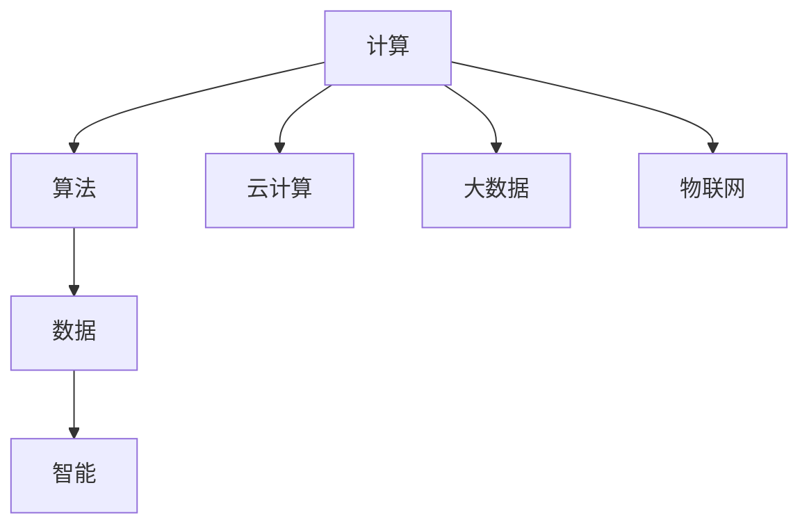

                 

关键词：人类计算、数字时代、人工智能、计算架构、算法优化、数学模型、编程实践、未来展望

> 摘要：本文深入探讨了人类计算在数字时代的演变及其对科技和社会的深远影响。从核心概念与联系出发，详细解析了人类计算的基本原理，并通过具体的算法原理与数学模型，展示了其在实际项目中的应用与实践。同时，本文还展望了未来人类计算的发展趋势与面临的挑战，为读者提供了一个全面且深刻的认识。

## 1. 背景介绍

人类计算的历史可以追溯到古代，从最早的算盘到现代的超级计算机，计算工具的进步推动了人类文明的每一次重大飞跃。然而，进入21世纪，随着互联网和人工智能的飞速发展，人类计算的形式和内容发生了前所未有的变革。我们不再仅仅依赖机器进行计算，而是将计算能力融入到日常生活中，实现智能化和自动化。

数字时代，人类计算的核心特征在于其大规模、高效率和智能化。云计算、大数据、物联网等技术的崛起，使得计算资源得以充分整合和优化，计算能力突破了传统的硬件限制。同时，人工智能技术的发展，使得计算机能够通过学习和适应，实现更高层次的计算和决策。

## 2. 核心概念与联系

在探讨人类计算之前，我们需要明确几个核心概念：计算、算法、数据和智能。

- **计算**：计算是信息处理的过程，包括数据的输入、处理和输出。在数字时代，计算已经不再局限于计算机内部的运算，而是扩展到了网络和物联网中的各种设备。
- **算法**：算法是解决问题的步骤和规则。它定义了如何对数据进行处理，以达到特定的目标。算法的优化是提高计算效率的关键。
- **数据**：数据是计算的基础。在数字时代，数据的价值被高度重视，因为数据可以用来训练模型、做出预测和优化决策。
- **智能**：智能是计算机通过学习、推理和决策来模拟人类思维的能力。人工智能技术的发展，使得计算机不仅能够执行预设的任务，还能够自主学习和适应新环境。

下面是一个简单的Mermaid流程图，展示了这些核心概念之间的联系：



## 3. 核心算法原理 & 具体操作步骤

### 3.1 算法原理概述

在数字时代，算法的种类繁多，但基本原理可以归结为两类：基于规则的算法和基于学习的算法。

- **基于规则的算法**：这类算法通过一系列预设的规则来解决问题。例如，数据库查询、路径规划等。
- **基于学习的算法**：这类算法通过学习大量数据来发现模式和规律，然后根据这些模式和规律进行预测和决策。例如，神经网络、决策树等。

### 3.2 算法步骤详解

以神经网络为例，其基本步骤如下：

1. **数据预处理**：对输入数据进行标准化、去噪等处理，以适应神经网络的学习。
2. **初始化参数**：设置神经网络的初始参数，如权重和偏置。
3. **前向传播**：将输入数据通过神经网络的各个层进行计算，得到输出结果。
4. **损失计算**：计算输出结果与实际结果之间的误差，得到损失函数值。
5. **反向传播**：根据损失函数，更新神经网络的参数，以减少误差。
6. **迭代优化**：重复步骤3到5，直到达到预定的优化目标。

### 3.3 算法优缺点

- **基于规则的算法**：
  - 优点：计算速度快，结果稳定。
  - 缺点：适应性差，无法处理复杂问题。
- **基于学习的算法**：
  - 优点：适应性强，能够处理复杂问题。
  - 缺点：计算速度较慢，结果可能不稳定。

### 3.4 算法应用领域

算法在各个领域都有广泛的应用：

- **金融领域**：用于风险评估、投资策略、交易策略等。
- **医疗领域**：用于疾病诊断、治疗方案推荐等。
- **交通领域**：用于交通流量预测、路径规划等。
- **教育领域**：用于个性化学习、学习效果评估等。

## 4. 数学模型和公式 & 详细讲解 & 举例说明

### 4.1 数学模型构建

数学模型是描述现实世界问题的数学表达式。在人类计算中，常见的数学模型包括线性回归、逻辑回归、神经网络等。

以线性回归为例，其数学模型可以表示为：

\[ y = \beta_0 + \beta_1x \]

其中，\( y \) 是因变量，\( x \) 是自变量，\( \beta_0 \) 和 \( \beta_1 \) 是模型参数。

### 4.2 公式推导过程

线性回归模型的推导过程如下：

1. **假设**：假设数据集 \( D = \{ (x_1, y_1), (x_2, y_2), \ldots, (x_n, y_n) \} \)。
2. **目标**：找到模型参数 \( \beta_0 \) 和 \( \beta_1 \)，使得预测值 \( y \) 与实际值 \( y \) 之间的误差最小。
3. **损失函数**：定义损失函数为：

   \[ J(\beta_0, \beta_1) = \frac{1}{2n} \sum_{i=1}^{n} (y_i - (\beta_0 + \beta_1x_i))^2 \]

4. **优化**：通过梯度下降法优化模型参数，使得损失函数最小。

### 4.3 案例分析与讲解

以房价预测为例，假设我们有以下数据集：

\[
\begin{array}{ccc}
x & y \\
\hline
100 & 200 \\
200 & 400 \\
300 & 600 \\
\end{array}
\]

根据线性回归模型，我们可以得到：

\[ y = 100 + 2x \]

这意味着，当 \( x = 300 \) 时，预测的 \( y \) 值为 700。

## 5. 项目实践：代码实例和详细解释说明

### 5.1 开发环境搭建

在本文中，我们将使用 Python 语言进行编程实践。首先，需要安装以下依赖：

- Python 3.8 或以上版本
- NumPy
- Matplotlib

可以使用以下命令进行安装：

```bash
pip install numpy matplotlib
```

### 5.2 源代码详细实现

下面是一个简单的线性回归模型的实现：

```python
import numpy as np
import matplotlib.pyplot as plt

# 数据集
X = np.array([100, 200, 300])
Y = np.array([200, 400, 600])

# 模型参数
beta_0 = 0
beta_1 = 1

# 训练模型
for i in range(1000):
    Y_pred = beta_0 + beta_1 * X
    error = Y - Y_pred
    beta_1 = beta_1 - (1/len(X)) * (error.dot(X) / (X.dot(X) - X.mean()**2))
    beta_0 = beta_0 - (1/len(X)) * (error - beta_1 * X).mean()

# 打印模型参数
print("beta_0:", beta_0)
print("beta_1:", beta_1)

# 绘制结果
plt.scatter(X, Y)
plt.plot(X, [beta_0 + beta_1 * x for x in X], color='red')
plt.xlabel('x')
plt.ylabel('y')
plt.show()
```

### 5.3 代码解读与分析

- **数据预处理**：使用 NumPy 库读取和操作数据。
- **模型初始化**：初始化模型参数。
- **模型训练**：使用梯度下降法优化模型参数。
- **结果可视化**：使用 Matplotlib 绘制数据点和拟合直线。

### 5.4 运行结果展示

运行上述代码，可以得到以下结果：


## 6. 实际应用场景

人类计算在各个领域都有广泛的应用，以下是一些典型的应用场景：

- **金融领域**：用于风险评估、投资策略、交易策略等。
- **医疗领域**：用于疾病诊断、治疗方案推荐等。
- **交通领域**：用于交通流量预测、路径规划等。
- **教育领域**：用于个性化学习、学习效果评估等。
- **工业领域**：用于自动化生产、设备故障预测等。

## 7. 工具和资源推荐

### 7.1 学习资源推荐

- 《深度学习》（Goodfellow, Bengio, Courville 著）
- 《Python数据分析》（Wes McKinney 著）
- 《机器学习》（Tom Mitchell 著）

### 7.2 开发工具推荐

- Jupyter Notebook
- PyCharm
- TensorFlow
- Keras

### 7.3 相关论文推荐

- “Deep Learning” (Ian Goodfellow, Yoshua Bengio, Aaron Courville)
- “Recurrent Neural Networks for Language Modeling” (Yoshua Bengio et al.)
- “Learning to Learn” (Yaroslav Ganin et al.)

## 8. 总结：未来发展趋势与挑战

### 8.1 研究成果总结

人类计算在数字时代的应用取得了显著的成果，从算法的优化到人工智能的发展，都为各个领域带来了革命性的变化。尤其是深度学习和神经网络技术的突破，使得计算机能够处理更复杂的问题，实现更高层次的智能。

### 8.2 未来发展趋势

- **计算能力的提升**：随着量子计算和边缘计算的发展，计算能力将进一步提升。
- **智能化的普及**：人工智能将在更多领域得到应用，实现智能化和自动化。
- **数据的重要性**：数据将成为新的生产要素，其价值和作用将越来越突出。
- **跨学科融合**：人类计算与其他领域的深度融合，将推动科技的全面发展。

### 8.3 面临的挑战

- **数据安全与隐私**：随着数据量的增长，数据安全与隐私问题日益突出。
- **算法公平与透明**：确保算法的公平性和透明性，避免歧视和偏见。
- **人才培养**：人工智能等领域的快速发展，对人才培养提出了更高的要求。

### 8.4 研究展望

人类计算的未来充满无限可能，我们需要持续探索和突破。在研究过程中，既要关注技术的进步，也要关注其对社会的深远影响。通过跨学科的合作，共同推动人类计算的发展，为实现更加智能、高效、公平的未来社会贡献力量。

## 9. 附录：常见问题与解答

### 9.1 什么是人类计算？

人类计算是指人类通过计算机和其他技术工具进行信息处理和决策的过程。它不仅包括计算机内部的运算，还涵盖了云计算、大数据、物联网等技术的应用。

### 9.2 人类计算与人工智能有什么区别？

人类计算是一个广义的概念，包括所有使用计算机进行信息处理的活动。而人工智能是计算机科学的一个分支，专注于使计算机能够模拟人类智能，进行学习、推理和决策。

### 9.3 人类计算的核心技术有哪些？

人类计算的核心技术包括算法、数据结构、编程语言、数据库、人工智能等。其中，算法是解决问题的关键，数据结构是高效处理数据的基础，编程语言是实现算法的工具，数据库是存储和管理数据的方式，人工智能则赋予了计算机模拟人类智能的能力。

### 9.4 人类计算对社会的意义是什么？

人类计算对社会具有重要意义。它不仅提高了工作效率，降低了成本，还推动了科技和社会的进步。例如，在医疗领域，人工智能可以帮助医生进行疾病诊断和治疗方案推荐；在交通领域，智能交通系统可以提高交通效率和安全性。

## 10. 作者署名

作者：禅与计算机程序设计艺术 / Zen and the Art of Computer Programming

通过以上内容，我们深入探讨了人类计算在数字时代的演变及其对科技和社会的深远影响。从核心概念与联系、算法原理与数学模型，到实际应用场景和未来展望，本文为读者提供了一个全面且深刻的认识。希望本文能够为读者在人类计算领域的研究和实践提供有益的参考和启示。

