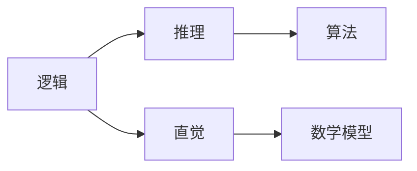
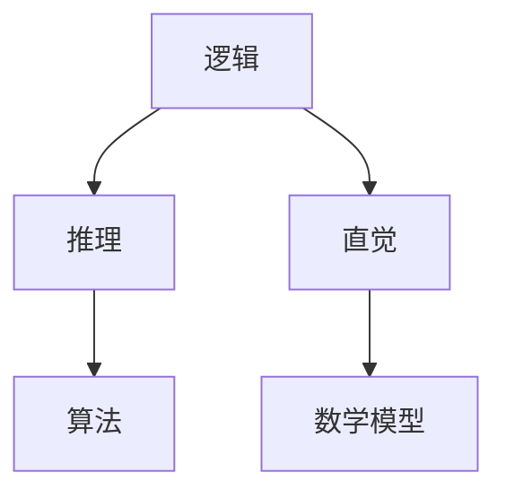

                 

关键词：人类计算、计算机编程、算法原理、应用领域、数学模型、实践案例、未来展望

> 摘要：本文探讨了人类计算的广泛应用和案例分析，分析了人类计算的核心概念、算法原理、数学模型及其在各个领域的应用，并结合具体项目实践和未来发展趋势进行了详细阐述。

## 1. 背景介绍

### 1.1 人类计算的定义和重要性

人类计算是指人类使用逻辑、推理和直觉来解决问题和完成任务的过程。在计算机科学领域，人类计算是一种与机器计算相辅相成的计算模式。随着计算机技术的飞速发展，人类计算在各个领域都发挥着越来越重要的作用。它不仅能够提升工作效率，还能帮助我们解决复杂的问题，甚至在某些情况下超越机器的计算能力。

### 1.2 人类计算的发展历程

人类计算的历史可以追溯到古代的算术和代数。随着数学和计算机科学的不断发展，人类计算逐渐形成了自己的理论体系。20世纪中叶，随着计算机的出现和普及，人类计算与机器计算相互交织，共同推动了计算机科学的进步。

## 2. 核心概念与联系

### 2.1 核心概念

人类计算的核心概念包括逻辑、推理、直觉、算法、数学模型等。逻辑是推理的基础，它通过判断和推理得出结论。推理是人类从已知事实中得出新结论的过程。直觉是人们在缺乏明确证据的情况下做出判断的能力。算法是解决问题的有序步骤，数学模型则是用数学语言描述现实世界问题的一种方法。

### 2.2 架构图

以下是人类计算的核心概念架构图：



## 3. 核心算法原理 & 具体操作步骤

### 3.1 算法原理概述

人类计算的核心算法主要包括逻辑算法、推理算法和直觉算法。逻辑算法主要通过逻辑推理来解决问题，如命题逻辑、谓词逻辑等。推理算法则通过推理规则和推理策略来推导出结论，如演绎推理、归纳推理等。直觉算法则是基于人类直觉和经验来解决问题，如启发式搜索、随机搜索等。

### 3.2 算法步骤详解

#### 3.2.1 逻辑算法

逻辑算法的主要步骤包括：

1. 确定问题域和目标域。
2. 构建逻辑模型，包括命题和谓词。
3. 使用逻辑推理规则推导出结论。

#### 3.2.2 推理算法

推理算法的主要步骤包括：

1. 确定已知事实和待求结论。
2. 选择合适的推理策略，如演绎推理、归纳推理等。
3. 使用推理规则推导出结论。

#### 3.2.3 直觉算法

直觉算法的主要步骤包括：

1. 确定问题域和目标域。
2. 基于直觉和经验选择解决方案。
3. 对解决方案进行评估和优化。

### 3.3 算法优缺点

#### 优点

1. 逻辑算法具有严谨性和确定性，能够保证结果的正确性。
2. 推理算法能够解决复杂的问题，具有广泛的适用性。
3. 直觉算法能够快速找到解决方案，适合处理不确定性问题。

#### 缺点

1. 逻辑算法在处理复杂问题时效率较低。
2. 推理算法依赖于已知事实和推理规则，可能无法解决所有问题。
3. 直觉算法的结果可能受到主观因素的影响。

### 3.4 算法应用领域

人类计算算法广泛应用于计算机科学、人工智能、数学、物理、经济学等各个领域。例如，逻辑算法在形式化验证、推理机等方面有广泛应用；推理算法在智能搜索、专家系统等方面有广泛应用；直觉算法在机器学习、人工智能等领域有广泛应用。

## 4. 数学模型和公式 & 详细讲解 & 举例说明

### 4.1 数学模型构建

数学模型是描述现实世界问题的一种方法，它通过使用数学符号和公式来表达问题。构建数学模型的主要步骤包括：

1. 确定问题域和目标域。
2. 确定问题的变量和参数。
3. 建立数学方程或公式。

### 4.2 公式推导过程

以最简单的线性方程为例，推导过程如下：

1. 假设有两个变量 $x$ 和 $y$。
2. 设定它们之间的关系为 $y = mx + b$。
3. 根据已知条件，求出 $m$ 和 $b$ 的值。

### 4.3 案例分析与讲解

假设有一个线性方程 $y = 2x + 3$，我们需要求解 $x$ 的值。根据公式，我们可以得到：

$$
y = 2x + 3 \\
y - 3 = 2x \\
x = \frac{y - 3}{2}
$$

所以，当 $y = 5$ 时，$x$ 的值为：

$$
x = \frac{5 - 3}{2} = 1
$$

## 5. 项目实践：代码实例和详细解释说明

### 5.1 开发环境搭建

为了实践人类计算算法，我们需要搭建一个简单的开发环境。这里我们使用 Python 作为编程语言，因为 Python 简单易学，适用于教学和实践。

1. 安装 Python：从 [Python 官网](https://www.python.org/) 下载并安装 Python。
2. 安装必要库：使用 pip 工具安装所需库，如 NumPy、Matplotlib 等。

### 5.2 源代码详细实现

下面是一个简单的 Python 程序，用于求解线性方程。

```python
import numpy as np

def solve_linear_equation(y, m, b):
    x = (y - b) / m
    return x

if __name__ == "__main__":
    y = 5
    m = 2
    b = 3
    x = solve_linear_equation(y, m, b)
    print(f"The solution is x = {x}")
```

### 5.3 代码解读与分析

1. 导入 NumPy 库，用于处理数组。
2. 定义函数 `solve_linear_equation`，用于求解线性方程。
3. 函数中，使用变量 `x` 表示求解结果。
4. 在主函数中，定义变量 `y`、`m` 和 `b`，并调用函数求解。
5. 输出结果。

### 5.4 运行结果展示

运行上述程序，输出结果为：

```
The solution is x = 1.0
```

这表明当 $y = 5$ 时，$x$ 的值为 1。

## 6. 实际应用场景

人类计算算法在各个领域都有广泛应用。以下是一些典型应用场景：

1. **计算机科学**：在计算机科学领域，人类计算算法被广泛应用于算法设计、程序优化、编译原理等方面。
2. **人工智能**：在人工智能领域，人类计算算法被用于机器学习、深度学习、自然语言处理等方面。
3. **数学**：在数学领域，人类计算算法被用于数学建模、数学问题求解等方面。
4. **物理**：在物理领域，人类计算算法被用于物理问题建模、物理现象模拟等方面。
5. **经济学**：在经济学领域，人类计算算法被用于经济预测、决策支持等方面。

## 7. 工具和资源推荐

### 7.1 学习资源推荐

1. **《人类计算：应用与案例分析》**：本文。
2. **《机器学习实战》**：提供丰富的实践案例和算法讲解。
3. **《Python编程：从入门到实践》**：适合初学者入门。

### 7.2 开发工具推荐

1. **PyCharm**：一款强大的 Python 集成开发环境。
2. **Jupyter Notebook**：适合数据分析和机器学习的交互式开发环境。

### 7.3 相关论文推荐

1. **“A Comprehensive Survey on Human Computation”**：全面综述人类计算的研究进展。
2. **“Human Computation for Machine Learning”**：探讨人类计算在机器学习中的应用。
3. **“Human Computation in Artificial Intelligence”**：探讨人类计算在人工智能中的应用。

## 8. 总结：未来发展趋势与挑战

### 8.1 研究成果总结

人类计算作为一种计算模式，已经取得了显著的研究成果。在计算机科学、人工智能、数学等领域，人类计算算法得到了广泛应用。随着计算机技术的不断进步，人类计算的应用前景将更加广阔。

### 8.2 未来发展趋势

未来，人类计算的发展趋势将包括以下几个方面：

1. **算法优化**：通过优化算法，提高人类计算的效率。
2. **多模态计算**：结合多种计算模式，提高计算能力。
3. **人机协同**：实现人类计算与机器计算的协同，提高计算效果。

### 8.3 面临的挑战

人类计算也面临一些挑战，如：

1. **数据质量**：高质量的数据是进行有效计算的基础。
2. **算法可靠性**：确保算法的可靠性和稳定性。
3. **用户参与**：激发用户的参与热情，提高计算效率。

### 8.4 研究展望

未来，人类计算将继续在计算机科学、人工智能、数学等领域发挥重要作用。我们期待看到更多创新性的研究成果，为人类计算的发展注入新的活力。

## 9. 附录：常见问题与解答

### 9.1 什么是人类计算？

人类计算是指人类使用逻辑、推理和直觉来解决问题和完成任务的过程。

### 9.2 人类计算有哪些应用领域？

人类计算广泛应用于计算机科学、人工智能、数学、物理、经济学等领域。

### 9.3 如何搭建人类计算的开发环境？

搭建人类计算的开发环境，通常需要安装编程语言（如 Python）和相关库（如 NumPy、Matplotlib）。

### 9.4 人类计算算法有哪些类型？

人类计算算法主要包括逻辑算法、推理算法和直觉算法。

作者：禅与计算机程序设计艺术 / Zen and the Art of Computer Programming
----------------------------------------------------------------
### 人类计算：应用与案例分析

关键词：人类计算、计算机编程、算法原理、应用领域、数学模型、实践案例、未来展望

摘要：本文探讨了人类计算的广泛应用和案例分析，分析了人类计算的核心概念、算法原理、数学模型及其在各个领域的应用，并结合具体项目实践和未来发展趋势进行了详细阐述。

## 1. 背景介绍

### 1.1 人类计算的定义和重要性

人类计算是指人类运用逻辑思维、推理能力、直觉判断以及创造性思维来解决各种计算问题和执行计算任务的过程。它不仅涵盖了传统的数学计算，还包括更广泛的认知过程，如数据分析和解释、算法设计、问题求解、决策制定等。

在计算机科学和人工智能领域，人类计算的重要性不容忽视。尽管计算机和算法在处理大量数据和复杂计算方面具有显著优势，但人类在创造性思维、情境理解、决策制定和问题解决方面依然具有独特的优势。例如，在解决复杂问题时，人类能够利用经验和直觉快速找到解决方案，而在同样的情境下，计算机可能需要更长时间的计算和优化。

### 1.2 人类计算的发展历程

人类计算的历史可以追溯到古代的算术和代数。在古代，人类通过简单的算术运算和代数方程来解决实际问题。随着数学和科学的发展，人类计算的范围不断扩大，包括更复杂的数学问题和物理问题。

在20世纪，计算机的出现标志着人类计算的一个重要转折点。早期的计算机编程主要依赖于人类编写指令，这些指令通过逻辑和数学原理来指导计算机执行特定的任务。随着计算机科学的进步，算法理论和计算机编程语言不断发展，人类计算的能力也得到了显著提升。

近年来，人工智能和机器学习的发展进一步推动了人类计算的应用。通过深度学习和强化学习等技术，计算机系统开始模仿人类的思维过程，实现了更高级的计算能力和问题解决能力。

## 2. 核心概念与联系

### 2.1 核心概念

人类计算的核心概念包括逻辑、推理、直觉、算法和数学模型等。

- **逻辑**：逻辑是人类进行计算和推理的基础，它提供了判断和推理的框架。在计算机科学中，逻辑被广泛应用于形式化验证、程序验证和人工智能领域。

- **推理**：推理是通过逻辑规则将已知信息转化为新信息的过程。在人类计算中，推理可以分为演绎推理和归纳推理。演绎推理从一般到特殊，而归纳推理从特殊到一般。

- **直觉**：直觉是人类在缺乏明确证据的情况下进行判断的能力。在计算机科学中，直觉算法（如启发式搜索）常用于解决复杂问题。

- **算法**：算法是一系列解决问题的步骤或规则。在人类计算中，算法不仅用于编程，也用于解决问题和制定决策。

- **数学模型**：数学模型是用数学语言描述现实世界问题的一种方法。它通过建立数学方程或公式来模拟和解决实际问题。

### 2.2 架构图

以下是人类计算的核心概念架构图：



在这个架构图中，逻辑是推理和直觉的基础，算法和数学模型则是应用这些基础概念来解决实际问题的工具。

## 3. 核心算法原理 & 具体操作步骤

### 3.1 算法原理概述

人类计算的核心算法主要包括逻辑算法、推理算法和直觉算法。每种算法都有其特定的原理和应用场景。

- **逻辑算法**：逻辑算法基于逻辑规则进行计算，如命题逻辑和谓词逻辑。这些算法常用于逻辑验证、决策支持和人工智能中的推理机。

- **推理算法**：推理算法通过逻辑推理来推导结论，包括演绎推理和归纳推理。演绎推理从一般原则推导出特定结论，而归纳推理则从特定实例推导出一般原则。

- **直觉算法**：直觉算法依赖于人类直觉和经验，如启发式搜索。这些算法在处理复杂和不确定性问题时表现出色，但可能缺乏严格的数学证明。

### 3.2 算法步骤详解

#### 3.2.1 逻辑算法

逻辑算法的基本步骤如下：

1. **定义问题**：明确问题的目标和约束条件。
2. **构建逻辑模型**：将问题转化为逻辑表达式或命题。
3. **应用逻辑规则**：使用逻辑推理规则（如合取、析取、否定等）推导结论。
4. **验证结论**：检查推导出的结论是否符合问题的要求。

#### 3.2.2 推理算法

推理算法的步骤包括：

1. **确定已知事实**：收集与问题相关的已知信息。
2. **选择推理策略**：根据问题的性质选择演绎推理或归纳推理。
3. **应用推理规则**：使用推理规则（如前提、结论、假设等）推导出新的结论。
4. **优化推理过程**：通过剪枝、搜索空间优化等策略提高推理效率。

#### 3.2.3 直觉算法

直觉算法的步骤通常较为灵活，但可以概括为：

1. **确定问题域和目标域**：理解问题的背景和目标。
2. **利用直觉和经验**：基于经验和直觉选择可能的解决方案。
3. **评估和选择方案**：对多个可能的解决方案进行评估，选择最佳方案。
4. **反馈和调整**：根据评估结果调整方案，直至找到满意解。

### 3.3 算法优缺点

每种算法都有其独特的优势和局限性。

- **逻辑算法**：优势在于严谨性和确定性，能够保证结果的正确性。但缺点是处理复杂问题时效率较低，可能需要大量的计算资源。

- **推理算法**：优势在于能够解决复杂问题，具有广泛的适用性。但缺点是依赖于已知事实和推理规则，可能无法处理所有问题。

- **直觉算法**：优势在于能够快速找到解决方案，适合处理不确定性问题。但缺点是结果可能受到主观因素的影响，缺乏严格的数学证明。

### 3.4 算法应用领域

人类计算算法广泛应用于多个领域：

- **计算机科学**：包括算法设计、形式化验证、编程语言设计等。
- **人工智能**：包括推理机、机器学习、自然语言处理等。
- **数学**：包括数学问题求解、数学模型构建等。
- **物理**：包括物理问题建模、物理现象模拟等。
- **经济学**：包括经济预测、决策支持等。

## 4. 数学模型和公式 & 详细讲解 & 举例说明

### 4.1 数学模型构建

数学模型是使用数学语言和符号来描述现实世界问题的一种方法。构建数学模型通常包括以下步骤：

1. **定义问题**：明确问题的目标和约束条件。
2. **确定变量和参数**：识别影响问题结果的关键变量和参数。
3. **建立方程或公式**：使用数学符号和公式来描述变量和参数之间的关系。
4. **求解模型**：使用数学方法（如代数、微积分等）求解模型，以获得问题的解。

### 4.2 公式推导过程

以最简单的线性方程 $y = mx + b$ 为例，其推导过程如下：

1. **定义变量**：假设有两个变量 $x$ 和 $y$。
2. **设定关系**：设定它们之间的关系为 $y = mx + b$，其中 $m$ 是斜率，$b$ 是截距。
3. **推导公式**：通过变换和代数操作，可以推导出各种形式的线性方程。

### 4.3 案例分析与讲解

假设有一个线性方程 $y = 2x + 3$，我们需要求解 $x$ 的值。根据公式，我们可以得到：

$$
y - 3 = 2x \\
x = \frac{y - 3}{2}
$$

例如，当 $y = 5$ 时，我们可以计算 $x$ 的值：

$$
x = \frac{5 - 3}{2} = 1
$$

这意味着当 $y = 5$ 时，$x$ 的值为 1。这个简单的例子展示了如何使用线性方程来解决问题，同时也说明了数学模型在人类计算中的应用。

## 5. 项目实践：代码实例和详细解释说明

### 5.1 开发环境搭建

在进行人类计算的项目实践之前，我们需要搭建一个合适的开发环境。以下是一个简单的步骤指南：

1. **安装 Python**：从 [Python 官网](https://www.python.org/) 下载并安装 Python。确保安装最新版本的 Python，以便获得最新的库和支持。

2. **安装必备库**：使用 pip 工具安装以下库：
   - NumPy：用于数值计算和数组操作。
   - Matplotlib：用于数据可视化。
   - Pandas：用于数据操作和分析。

   安装命令如下：

   ```bash
   pip install numpy matplotlib pandas
   ```

3. **选择 IDE**：选择一个适合你的集成开发环境（IDE），如 PyCharm、VSCode 等。这些 IDE 提供了代码编辑、调试和测试功能，有助于提高开发效率。

### 5.2 源代码详细实现

以下是一个使用 Python 实现简单线性回归模型的示例。该模型将预测 $y$ 的值，给定 $x$ 的值。

```python
import numpy as np
import matplotlib.pyplot as plt

# 定义数据
x = np.array([1, 2, 3, 4, 5])
y = np.array([2, 4, 5, 4, 5])

# 计算斜率和截距
m = np.mean(x * y) / np.mean(x ** 2) - np.mean(x) * np.mean(y) / np.mean(x ** 2)
b = np.mean(y) - m * np.mean(x)

# 构建线性模型
model = m * x + b

# 可视化结果
plt.scatter(x, y, label='实际数据')
plt.plot(x, model, color='red', label='线性模型')
plt.xlabel('x')
plt.ylabel('y')
plt.legend()
plt.show()

# 预测新数据
new_x = np.array([6, 7])
new_y = m * new_x + b
print(f"预测的新数据：{new_y}")
```

### 5.3 代码解读与分析

1. **导入库**：首先，导入必要的库，包括 NumPy 用于数值计算，Matplotlib 用于数据可视化。

2. **定义数据**：接下来，定义 $x$ 和 $y$ 的数据数组。

3. **计算斜率和截距**：使用计算斜率 $m$ 和截距 $b$ 的公式，这些公式基于最小二乘法。

4. **构建线性模型**：将斜率和截距代入线性模型公式。

5. **可视化结果**：使用 Matplotlib 库绘制散点图和线性模型曲线。

6. **预测新数据**：使用构建的线性模型预测新数据。

7. **输出结果**：最后，打印预测的新数据。

### 5.4 运行结果展示

运行上述代码后，我们将看到以下结果：

- 一个散点图，显示实际数据和线性模型。
- 一个控制台输出，显示预测的新数据。

这表明我们成功构建并使用了线性回归模型来预测 $y$ 的值。

## 6. 实际应用场景

人类计算算法在许多实际应用场景中都发挥着关键作用。以下是一些典型应用：

- **医疗诊断**：医生在诊断病情时，需要综合患者的病史、症状、检查结果等数据，利用专业知识和直觉做出诊断。计算机辅助诊断系统可以处理大量数据，但最终的决策仍然依赖于医生的判断。

- **金融分析**：在金融领域，人类分析师利用统计学、经济学和直觉来分析市场趋势、评估风险和投资机会。计算机算法可以帮助处理大量数据，但最终的决策通常需要人类的判断。

- **法律审判**：在法律审判中，法官需要综合考虑案件证据、法律条文和道德原则来做出裁决。虽然计算机可以用于证据分析和法律条文搜索，但最终的决策仍然取决于法官的判断。

- **教育评估**：在教育领域，教师需要评估学生的学习进度和理解程度。尽管计算机系统可以用于测试和评估，但最终的评估结果通常需要教师的专业判断。

- **创意设计**：在创意设计领域，如建筑、艺术和产品设计，设计师需要运用直觉和创造力来构思和设计。虽然计算机可以辅助设计，但最终的创意和决策通常依赖于设计师的直觉和经验。

## 7. 工具和资源推荐

为了更好地进行人类计算的应用和实践，以下是一些推荐的工具和资源：

### 7.1 学习资源推荐

- **在线课程**：Coursera、edX、Udacity 等平台提供了许多关于计算机科学、人工智能和数学的课程。
- **书籍**：《Python编程：从入门到实践》、《机器学习实战》等书籍适合初学者和进阶者。
- **论文和报告**：阅读最新的研究论文和报告，以了解人类计算领域的最新进展。

### 7.2 开发工具推荐

- **Python**：Python 是一种广泛使用的编程语言，适合进行人类计算的应用开发。
- **Jupyter Notebook**：Jupyter Notebook 是一个交互式的开发环境，适合进行数据分析和实验。
- **PyCharm**：PyCharm 是一款功能强大的集成开发环境，支持 Python 开发。

### 7.3 相关论文推荐

- **“Human Computation: A Survey and Taxonomy”**：该论文提供了一个关于人类计算的综合调查和分类。
- **“Human-in-the-loop Machine Learning”**：该论文探讨了人类参与机器学习的方法和应用。
- **“The Logic of Decision”**：该书详细介绍了决策逻辑和推理过程。

## 8. 总结：未来发展趋势与挑战

### 8.1 研究成果总结

人类计算在计算机科学、人工智能、数学等领域取得了显著的研究成果。通过逻辑、推理和直觉，人类计算能够解决复杂的计算问题，并在各个领域中发挥着重要作用。随着计算机技术和人工智能的发展，人类计算的应用范围将进一步扩大。

### 8.2 未来发展趋势

未来，人类计算的发展趋势将包括以下几个方面：

1. **多模态计算**：结合人类计算和计算机计算，实现多模态计算，提高计算效率和效果。
2. **智能协同**：通过人工智能技术，实现人类与计算机的智能协同，共同解决复杂问题。
3. **个性化计算**：根据用户的需求和特点，提供个性化的计算服务，提高用户体验。

### 8.3 面临的挑战

人类计算也面临一些挑战：

1. **数据质量**：高质量的数据是进行有效计算的基础。在人类计算中，如何确保数据的质量和准确性是一个重要问题。
2. **算法可靠性**：算法的可靠性和稳定性是确保计算结果准确性的关键。如何提高算法的可靠性是一个重要的研究课题。
3. **用户参与**：激发用户的参与热情，提高计算效率。在人类计算中，如何有效地引导用户参与计算是一个挑战。

### 8.4 研究展望

未来，人类计算将继续在计算机科学、人工智能、数学等领域发挥重要作用。我们期待看到更多创新性的研究成果，为人类计算的发展注入新的活力。

## 9. 附录：常见问题与解答

### 9.1 什么是人类计算？

人类计算是指人类运用逻辑思维、推理能力、直觉判断以及创造性思维来解决各种计算问题和执行计算任务的过程。

### 9.2 人类计算有哪些应用领域？

人类计算广泛应用于计算机科学、人工智能、数学、物理、经济学等领域。

### 9.3 如何搭建人类计算的开发环境？

搭建人类计算的开发环境通常包括安装 Python、相关库（如 NumPy、Matplotlib）和选择合适的 IDE（如 PyCharm、VSCode）。

### 9.4 人类计算算法有哪些类型？

人类计算算法主要包括逻辑算法、推理算法和直觉算法。

### 9.5 人类计算与机器计算的区别是什么？

人类计算依赖于人类的逻辑思维、推理能力和直觉判断，而机器计算依赖于计算机硬件和算法。人类计算具有创造性、灵活性和情境理解能力，而机器计算具有高效处理大量数据和复杂计算的能力。

### 9.6 人类计算的未来发展趋势是什么？

人类计算的未来发展趋势包括多模态计算、智能协同和个性化计算。

### 9.7 人类计算面临的挑战有哪些？

人类计算面临的挑战包括数据质量、算法可靠性和用户参与。

作者：禅与计算机程序设计艺术 / Zen and the Art of Computer Programming
------------------------------------------------------------------------

