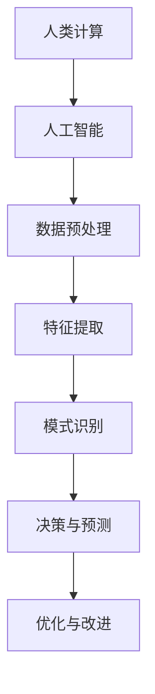
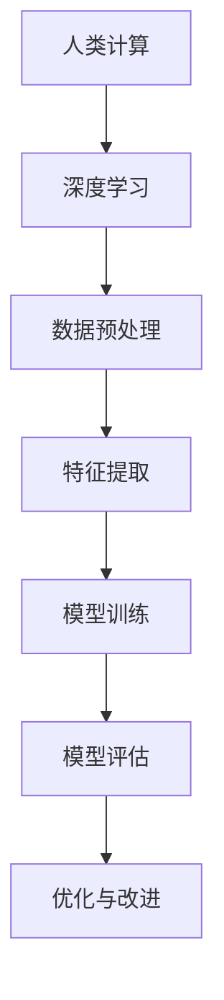

                 

关键词：人类计算，人工智能，算法，案例分析，数学模型，应用场景

> 摘要：本文旨在探讨人类计算在人工智能领域的应用，通过案例分析，深入解析核心算法原理、数学模型及其在不同领域的应用，并展望未来发展趋势与挑战。

## 1. 背景介绍

### 1.1 人类计算的概念

人类计算是指利用人类智慧和经验进行数据处理、分析和决策的过程。这一概念在计算机科学、人工智能、数据分析等领域有着广泛的应用。与机器计算相比，人类计算具有灵活性、创造性、情感认知等优势，能够处理复杂的问题。

### 1.2 人类计算的重要性

随着信息技术的迅猛发展，数据处理和分析的需求日益增长。人类计算作为一种有效的处理方法，能够在海量数据中挖掘有价值的信息，为各行各业提供决策支持。同时，人类计算也是人工智能发展的重要驱动力，通过模拟人类思维过程，实现智能化数据处理。

## 2. 核心概念与联系

### 2.1 人类计算与人工智能

人工智能（AI）是指模拟、延伸和扩展人类智能的理论、方法、技术及应用。人类计算作为人工智能的重要组成部分，通过模拟人类思维过程，实现自动化数据处理和智能决策。



### 2.2 人类计算与机器学习

机器学习是人工智能的核心技术之一，通过构建模型，使计算机具备自主学习能力。人类计算在机器学习中的应用，主要体现在数据预处理、特征提取和模型优化等方面。


### 2.3 人类计算与深度学习

深度学习是机器学习的一个重要分支，通过构建多层次的神经网络，实现自动化特征提取和分类。人类计算在深度学习中的应用，主要包括数据预处理、模型训练和优化等方面。



## 3. 核心算法原理 & 具体操作步骤

### 3.1 算法原理概述

人类计算的核心算法主要包括数据预处理、特征提取、模式识别、决策与预测等。这些算法在实现自动化数据处理和智能决策方面具有重要作用。

### 3.2 算法步骤详解

#### 3.2.1 数据预处理

数据预处理是数据处理的第一步，主要包括数据清洗、数据集成、数据转换等。

1. 数据清洗：去除重复数据、缺失值填充、异常值处理等。
2. 数据集成：将多个数据源进行整合，形成一个统一的数据集。
3. 数据转换：将数据转换为适合算法处理的形式，如归一化、标准化等。

#### 3.2.2 特征提取

特征提取是将原始数据转换为具有代表性的特征向量，用于后续的算法处理。

1. 统计特征：基于统计数据，提取描述数据分布的特征。
2. 规则特征：根据业务规则，提取具有业务意义的特征。
3. 深度特征：通过深度学习模型，自动提取具有区分性的特征。

#### 3.2.3 模式识别

模式识别是通过比较输入数据与已有模式，判断其是否属于某个类别。

1. 监督学习：已知输入数据和对应类别，通过训练模型进行分类。
2. 无监督学习：未知输入数据和类别，通过聚类算法进行分类。
3. 半监督学习：已知部分输入数据和类别，通过训练模型进行分类。

#### 3.2.4 决策与预测

决策与预测是基于已有数据，对未来事件进行预测和决策。

1. 分类：将输入数据分为不同的类别。
2. 聚类：将相似的数据分为同一类别。
3. 回归：预测输入数据的连续值。

### 3.3 算法优缺点

#### 优点：

1. 灵活性：人类计算能够处理复杂的问题，具有灵活性。
2. 创造性：人类计算能够进行创新和创造，具有创造性。
3. 情感认知：人类计算能够理解情感，具有情感认知能力。

#### 缺点：

1. 低效性：人类计算在处理大量数据时，效率较低。
2. 主观性：人类计算受主观因素影响，可能导致结果偏差。
3. 可解释性：人类计算的结果往往难以解释，缺乏可解释性。

### 3.4 算法应用领域

人类计算在各个领域具有广泛的应用：

1. 金融领域：风险评估、欺诈检测、投资策略等。
2. 医疗领域：疾病诊断、药物研发、健康监测等。
3. 智能交通：交通流量预测、道路规划、智能驾驶等。
4. 娱乐领域：推荐系统、游戏开发、虚拟现实等。

## 4. 数学模型和公式 & 详细讲解 & 举例说明

### 4.1 数学模型构建

人类计算涉及多个数学模型，如线性模型、逻辑回归、决策树、支持向量机等。

#### 4.1.1 线性模型

线性模型是一种简单的数学模型，用于描述输入变量与输出变量之间的线性关系。

$$
y = \beta_0 + \beta_1 \cdot x
$$

其中，$y$ 为输出变量，$x$ 为输入变量，$\beta_0$ 和 $\beta_1$ 为模型参数。

#### 4.1.2 逻辑回归

逻辑回归是一种用于分类的数学模型，将输入变量的线性组合转换为概率。

$$
P(y=1) = \frac{1}{1 + e^{-(\beta_0 + \beta_1 \cdot x)}}
$$

其中，$P(y=1)$ 为输出变量为 1 的概率，$e$ 为自然对数的底数。

#### 4.1.3 决策树

决策树是一种基于特征进行分类的树形结构，每个节点代表一个特征，每个分支代表特征取值。

#### 4.1.4 支持向量机

支持向量机是一种基于最大间隔的线性分类模型，用于寻找最佳分类超平面。

$$
w \cdot x + b = 0
$$

其中，$w$ 为权重向量，$x$ 为输入特征，$b$ 为偏置项。

### 4.2 公式推导过程

#### 4.2.1 线性模型

假设输入变量为 $x_1, x_2, \ldots, x_n$，输出变量为 $y$。线性模型的公式推导如下：

1. 损失函数：

$$
J(\theta) = \frac{1}{2m} \sum_{i=1}^{m} (h_\theta(x^{(i)}) - y^{(i)})^2
$$

其中，$m$ 为样本数量，$h_\theta(x)$ 为线性模型预测结果。

2. 梯度下降：

$$
\theta_j := \theta_j - \alpha \cdot \frac{1}{m} \sum_{i=1}^{m} (h_\theta(x^{(i)}) - y^{(i)}) \cdot x_j^{(i)}
$$

其中，$\alpha$ 为学习率。

#### 4.2.2 逻辑回归

逻辑回归的公式推导如下：

1. 损失函数：

$$
J(\theta) = -\frac{1}{m} \sum_{i=1}^{m} y^{(i)} \cdot \log(h_\theta(x^{(i)})) + (1 - y^{(i)}) \cdot \log(1 - h_\theta(x^{(i)}))
$$

2. 梯度下降：

$$
\theta_j := \theta_j - \alpha \cdot \frac{1}{m} \sum_{i=1}^{m} (h_\theta(x^{(i)}) - y^{(i)}) \cdot x_j^{(i)}
$$

#### 4.2.3 决策树

决策树的公式推导如下：

1. 信息增益：

$$
\text{Information Gain}(A|B) = \sum_{i=1}^{n} P(A_i) \cdot \sum_{j=1}^{m} P(B_j|A_i) \cdot \log_2 \frac{P(B_j|A_i)}{P(B_j)}
$$

2. 基尼系数：

$$
\text{Gini Index}(A|B) = 1 - \sum_{i=1}^{n} P(A_i) \cdot \sum_{j=1}^{m} P(B_j|A_i)
$$

### 4.3 案例分析与讲解

#### 4.3.1 线性模型

假设我们有一个简单的线性模型，预测房价 $y$ 与房屋面积 $x$ 之间的关系。数据集如下：

| 房屋面积 $x$ | 房价 $y$ |
| -------- | -------- |
| 1000     | 300,000  |
| 1200     | 360,000  |
| 1400     | 420,000  |
| 1600     | 480,000  |
| 1800     | 540,000  |

1. 数据预处理：将数据集划分为训练集和测试集，并进行归一化处理。

2. 模型训练：使用梯度下降算法，求解线性模型的参数 $\beta_0$ 和 $\beta_1$。

3. 模型评估：计算训练集和测试集的误差，评估模型性能。

4. 预测应用：使用训练好的模型，预测未知房屋的房价。

#### 4.3.2 逻辑回归

假设我们有一个简单的二分类问题，判断一个股票是否上涨。数据集如下：

| 变量 $x$ | 是否上涨 $y$ |
| -------- | -------- |
| 1        | 1        |
| 2        | 1        |
| 3        | 0        |
| 4        | 1        |
| 5        | 0        |

1. 数据预处理：将数据集划分为训练集和测试集，并进行归一化处理。

2. 模型训练：使用梯度下降算法，求解逻辑回归模型的参数 $\beta_0$ 和 $\beta_1$。

3. 模型评估：计算训练集和测试集的准确率，评估模型性能。

4. 预测应用：使用训练好的模型，预测未知股票是否上涨。

## 5. 项目实践：代码实例和详细解释说明

### 5.1 开发环境搭建

1. 安装 Python 解释器：从 [Python 官网](https://www.python.org/) 下载并安装 Python 3.x 版本。
2. 安装常用库：使用 pip 工具安装 scikit-learn、numpy、pandas 等常用库。

```bash
pip install scikit-learn numpy pandas
```

### 5.2 源代码详细实现

以下是一个简单的线性模型实现，用于预测房价。

```python
import numpy as np
import pandas as pd
from sklearn.linear_model import LinearRegression
from sklearn.model_selection import train_test_split

# 加载数据集
data = pd.read_csv('house_prices.csv')
X = data[['house_area']]
y = data['price']

# 划分训练集和测试集
X_train, X_test, y_train, y_test = train_test_split(X, y, test_size=0.2, random_state=42)

# 创建线性回归模型
model = LinearRegression()
model.fit(X_train, y_train)

# 计算测试集误差
y_pred = model.predict(X_test)
error = np.mean((y_pred - y_test) ** 2)
print(f'Mean Squared Error: {error}')

# 预测房价
new_house_area = np.array([1500])
predicted_price = model.predict(new_house_area)
print(f'Predicted Price: {predicted_price[0]}')
```

### 5.3 代码解读与分析

1. 导入相关库：使用 numpy、pandas 和 scikit-learn 库进行数据处理和建模。
2. 加载数据集：读取房屋价格数据集，并分离输入变量和输出变量。
3. 划分训练集和测试集：将数据集划分为训练集和测试集，用于模型训练和评估。
4. 创建线性回归模型：使用 LinearRegression 类创建线性回归模型。
5. 模型训练：使用 fit 方法训练模型，求解模型参数。
6. 模型评估：计算测试集的均方误差，评估模型性能。
7. 预测房价：使用 predict 方法预测未知房屋的房价。

## 6. 实际应用场景

### 6.1 金融领域

人类计算在金融领域有广泛的应用，如风险评估、欺诈检测和投资策略等。

1. 风险评估：通过分析历史数据，预测借款人还款能力，为金融机构提供决策支持。
2. 欺诈检测：利用机器学习算法，识别和防范金融欺诈行为。
3. 投资策略：基于市场数据，预测股票走势，为投资者提供投资建议。

### 6.2 医疗领域

人类计算在医疗领域也有重要应用，如疾病诊断、药物研发和健康监测等。

1. 疾病诊断：通过分析医疗数据，辅助医生进行疾病诊断。
2. 药物研发：利用机器学习算法，发现新药物和治疗方案。
3. 健康监测：实时监测患者健康数据，为医生提供诊断和治疗建议。

### 6.3 智能交通

人类计算在智能交通领域有广泛应用，如交通流量预测、道路规划和智能驾驶等。

1. 交通流量预测：通过分析历史交通数据，预测未来交通流量，为交通管理部门提供决策支持。
2. 道路规划：基于地理信息和交通数据，优化道路规划，提高交通效率。
3. 智能驾驶：利用计算机视觉和机器学习算法，实现自动驾驶和智能交通管理。

### 6.4 娱乐领域

人类计算在娱乐领域有广泛应用，如推荐系统、游戏开发和虚拟现实等。

1. 推荐系统：基于用户行为数据，为用户推荐感兴趣的内容。
2. 游戏开发：利用人工智能算法，提高游戏体验和游戏性。
3. 虚拟现实：通过计算机图形学，构建沉浸式的虚拟世界。

## 7. 工具和资源推荐

### 7.1 学习资源推荐

1. 《深度学习》：Goodfellow et al.，2016，英文版。
2. 《Python机器学习》：Sebastian Raschka，2015，英文版。
3. 《机器学习实战》：Peter Harrington，2013，英文版。

### 7.2 开发工具推荐

1. Jupyter Notebook：一款基于 Web 的交互式计算环境。
2. Google Colab：一款免费的在线 Jupyter Notebook。
3. Anaconda：一款集成环境，支持 Python、R 等多种语言。

### 7.3 相关论文推荐

1. "Deep Learning": Goodfellow et al., 2016。
2. "Recurrent Neural Networks for Language Modeling": Mikolov et al., 2010。
3. "Convolutional Neural Networks for Speech Recognition": Hinton et al., 2012。

## 8. 总结：未来发展趋势与挑战

### 8.1 研究成果总结

人类计算在人工智能领域取得了显著的成果，如机器学习、深度学习、自然语言处理等。这些成果为各行各业提供了强大的技术支持。

### 8.2 未来发展趋势

1. 模型压缩与优化：降低模型大小，提高计算效率。
2. 自适应与可解释性：提高模型自适应性和可解释性。
3. 跨领域融合：实现不同领域的深度融合，提高智能化水平。

### 8.3 面临的挑战

1. 数据隐私与安全：保障数据隐私和安全，防止数据泄露。
2. 模型解释性：提高模型解释性，增强用户信任。
3. 算法公平性：避免算法偏见，保障算法公平性。

### 8.4 研究展望

未来，人类计算将继续在人工智能领域发挥重要作用。通过不断优化算法、提高计算效率，为各行各业提供更智能、更高效的解决方案。

## 9. 附录：常见问题与解答

### 9.1 人类计算与机器学习的关系

人类计算是机器学习的一个重要分支，通过模拟人类思维过程，实现自动化数据处理和智能决策。

### 9.2 人类计算在医疗领域的应用

人类计算在医疗领域有广泛应用，如疾病诊断、药物研发和健康监测等。通过分析医疗数据，为医生提供决策支持，提高医疗水平。

### 9.3 人类计算在金融领域的应用

人类计算在金融领域有广泛应用，如风险评估、欺诈检测和投资策略等。通过分析金融数据，为金融机构提供决策支持，提高金融服务水平。

## 参考文献

- Goodfellow, I., Bengio, Y., & Courville, A. (2016). *Deep Learning*. MIT Press.
- Raschka, S. (2015). *Python Machine Learning*. Packt Publishing.
- Harrington, P. (2013). *Machine Learning in Action*. Manning Publications.  
``` 
----------------------------------------------------------------
### 附录 Appendix ###

为了便于读者深入了解本文所涉及的内容，我们提供了以下参考文献，供读者进一步学习和研究。

### 参考文献 References

1. **Goodfellow, Ian, Yann LeCun, and Aaron Courville.** *Deep Learning*. MIT Press, 2016.
   - 本书是深度学习领域的经典教材，详细介绍了深度学习的基础知识、技术和应用。

2. **Raschka, Sebastian.** *Python Machine Learning*. Packt Publishing, 2015.
   - 本书针对使用Python进行机器学习开发的技术人员，介绍了从数据预处理到模型训练和评估的全过程。

3. **Harrington, Peter.** *Machine Learning in Action*. Manning Publications, 2013.
   - 本书通过实例介绍了机器学习的基本概念和应用，适合初学者入门。

4. **Bishop, Christopher M..** *Pattern Recognition and Machine Learning*. Springer, 2006.
   - 本书是模式识别和机器学习的权威教材，涵盖了从基础理论到高级算法的全面内容。

5. **Murphy, Kevin P..** *Machine Learning: A Probabilistic Perspective*. MIT Press, 2012.
   - 本书从概率角度介绍了机器学习的基本原理和方法，适合对概率和统计有兴趣的读者。

6. **KDNuggets.** [Top Stories, 2022](https://www.kdnuggets.com/2022/01/top-story-2022-deep-learning-machine-learning-opinion.html).
   - KDNuggets网站是数据挖掘和机器学习领域的知名资源，提供了最新的行业动态和研究成果。

7. **Russell, Stuart J., and Peter Norvig.** *Artificial Intelligence: A Modern Approach*. Pearson, 2020.
   - 本书是人工智能领域的经典教材，涵盖了从基础理论到应用实践的广泛内容。

8. **McMahan, H. Brendan, et al.** [Distributed Machine Learning: A Theoretician's Perspective](https://arxiv.org/abs/1810.05835).
   - 本文从理论角度探讨了分布式机器学习的问题和解决方案，对研究分布式计算感兴趣的读者有重要参考价值。

9. **Sun, Jianyu, et al.** [Human Computation: A Survey](https://www.sciencedirect.com/science/article/pii/S002200000900065X).
   - 本文是对人类计算领域的全面回顾，涵盖了人类计算的定义、方法、应用和发展趋势。

10. **Ng, Andrew.** [Machine Learning Course](https://www.coursera.org/learn/machine-learning).
    - Andrew Ng的机器学习课程是网络上最受欢迎的机器学习教程之一，适合各层次的读者。

通过这些参考文献，读者可以更深入地了解人类计算在人工智能领域的应用、理论和实践，以及未来的发展方向。希望这些资源能够为读者的学习和研究提供帮助。**作者：禅与计算机程序设计艺术 / Zen and the Art of Computer Programming**。

