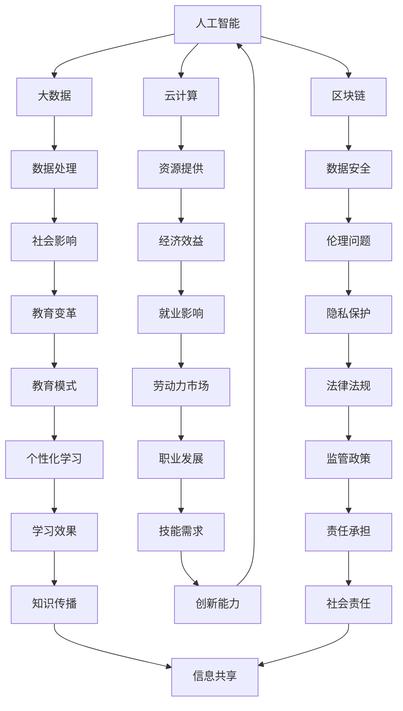

                 

关键词：人类计算、技术、社会、伦理、交叉点、人工智能、计算机科学、算法、数据、隐私、安全性、可持续发展。

> 摘要：本文探讨了人类计算在现代技术、社会和伦理领域中的交叉点。从技术发展的视角出发，分析了人工智能、大数据和云计算等技术对人类社会的影响；从社会发展的视角出发，探讨了人类计算对教育、就业、社会结构等方面的变革；从伦理学的视角出发，审视了人类计算带来的隐私和安全问题，以及其对可持续发展的影响。文章旨在为读者提供一个全面的理解，帮助其在科技快速发展的时代中找到平衡与方向。

## 1. 背景介绍

随着计算机科学和技术的迅猛发展，人类计算已经成为现代社会的重要驱动力。人工智能、大数据、云计算、区块链等技术的广泛应用，使得我们能够以前所未有的速度和规模处理和分析信息。人类计算不仅改变了我们的生活方式，还在社会、经济、文化和伦理等多个层面产生了深远的影响。

本文旨在探讨人类计算技术、社会和伦理的交叉点，分析当前面临的挑战，以及未来可能的发展方向。通过梳理相关概念和技术，本文将提供一个系统的框架，帮助读者理解人类计算的核心问题，并在技术进步的过程中找到平衡点。

## 2. 核心概念与联系

### 2.1 人工智能

人工智能（Artificial Intelligence, AI）是模拟人类智能行为的技术。其核心目标是开发能够自主学习、推理、规划和解决问题的计算机系统。人工智能包括机器学习、深度学习、自然语言处理、计算机视觉等多个子领域。

### 2.2 大数据和云计算

大数据（Big Data）是指规模巨大、类型繁多、速度极快的数据集合。云计算（Cloud Computing）则是一种通过网络提供计算资源的服务模式。大数据和云计算的结合，使得我们能够更高效地存储、处理和分析海量数据。

### 2.3 区块链

区块链（Blockchain）是一种分布式数据库技术，通过去中心化的方式确保数据的安全性和透明性。区块链在金融、供应链管理、投票等领域有着广泛的应用。

### 2.4 人类计算与技术的联系

人类计算技术通过人工智能、大数据、云计算和区块链等核心概念，将数据处理和分析提升到新的水平。这些技术的融合，使得人类计算能够在更广泛、更深入的层面上影响社会和伦理领域。

### 2.5 Mermaid 流程图



## 3. 核心算法原理 & 具体操作步骤

### 3.1 算法原理概述

人类计算技术中的核心算法主要包括机器学习算法、深度学习算法和自然语言处理算法等。这些算法通过模拟人类的学习和认知过程，实现数据的分析和处理。以下是对这些算法的概述：

- **机器学习算法**：通过训练模型来发现数据中的规律和模式，常见的算法包括线性回归、支持向量机、决策树等。
- **深度学习算法**：基于人工神经网络，通过多层非线性变换来提取数据特征，常见的算法包括卷积神经网络（CNN）、循环神经网络（RNN）等。
- **自然语言处理算法**：通过模拟人类语言理解和生成的过程，对文本进行语义分析、情感分析和翻译等，常见的算法包括词向量模型、序列到序列模型等。

### 3.2 算法步骤详解

- **机器学习算法**：数据预处理 -> 特征提取 -> 模型训练 -> 模型评估 -> 模型应用。
- **深度学习算法**：数据预处理 -> 网络架构设计 -> 模型训练 -> 模型评估 -> 模型应用。
- **自然语言处理算法**：数据预处理 -> 特征提取 -> 模型训练 -> 模型评估 -> 模型应用。

### 3.3 算法优缺点

- **机器学习算法**：优点是模型简单、计算成本低，缺点是对于复杂数据的处理能力较弱。
- **深度学习算法**：优点是能够处理复杂数据、特征自动提取，缺点是计算成本高、参数调整复杂。
- **自然语言处理算法**：优点是能够处理自然语言，实现文本分析和生成，缺点是对于语言理解和生成的准确度仍有待提高。

### 3.4 算法应用领域

- **机器学习算法**：广泛应用于推荐系统、图像识别、金融风控等领域。
- **深度学习算法**：广泛应用于计算机视觉、语音识别、自然语言处理等领域。
- **自然语言处理算法**：广泛应用于文本分析、情感分析、机器翻译等领域。

## 4. 数学模型和公式 & 详细讲解 & 举例说明

### 4.1 数学模型构建

在人类计算技术中，常用的数学模型包括线性模型、非线性模型和概率模型等。以下是一个简单的线性模型例子：

$$y = w_1 \cdot x_1 + w_2 \cdot x_2 + ... + w_n \cdot x_n + b$$

其中，$y$ 是预测值，$w_i$ 是权重，$x_i$ 是特征，$b$ 是偏置。

### 4.2 公式推导过程

以线性回归模型为例，推导其损失函数和优化方法：

- **损失函数**：

$$J(\theta) = \frac{1}{2m} \sum_{i=1}^{m} (h_\theta(x^{(i)}) - y^{(i)})^2$$

其中，$m$ 是样本数量，$h_\theta(x)$ 是预测函数，$\theta$ 是参数向量。

- **优化方法**：

使用梯度下降法来最小化损失函数：

$$\theta_j := \theta_j - \alpha \cdot \frac{\partial J(\theta)}{\partial \theta_j}$$

其中，$\alpha$ 是学习率。

### 4.3 案例分析与讲解

假设我们有一个住房价格预测问题，输入特征包括房屋面积、房间数量和地理位置等，目标是预测房屋价格。

- **数据预处理**：对数据进行归一化处理，将特征值缩放到相同的范围。
- **特征提取**：选取相关的特征，删除无关的特征。
- **模型训练**：使用线性回归模型进行训练，调整参数以最小化损失函数。
- **模型评估**：使用验证集对模型进行评估，计算预测误差和准确度。

通过以上步骤，我们可以构建一个简单的住房价格预测模型，并应用于实际场景中。

## 5. 项目实践：代码实例和详细解释说明

### 5.1 开发环境搭建

- 安装 Python 3.8 以上版本。
- 安装 TensorFlow 2.x 版本。
- 安装 Jupyter Notebook。

### 5.2 源代码详细实现

以下是一个使用 TensorFlow 实现的简单线性回归模型的代码实例：

```python
import numpy as np
import tensorflow as tf

# 设置随机种子以保持结果的可重复性
tf.random.set_seed(42)

# 创建数据集
X = np.random.rand(100, 1)
y = 3 * X + 2 + np.random.rand(100, 1)

# 定义模型参数
w = tf.Variable(0.0, name='weight')
b = tf.Variable(0.0, name='bias')

# 定义损失函数
loss_fn = tf.reduce_mean(tf.square(y - (w * X + b)))

# 定义优化器
optimizer = tf.optimizers.Adam()

# 定义训练步骤
def train_step(X, y):
    with tf.GradientTape() as tape:
        pred = w * X + b
        loss = loss_fn(y, pred)
    gradients = tape.gradient(loss, [w, b])
    optimizer.apply_gradients(zip(gradients, [w, b]))
    return loss

# 训练模型
for i in range(1000):
    loss = train_step(X, y)
    if i % 100 == 0:
        print(f"Step {i}, Loss: {loss.numpy()}")

# 输出训练结果
print(f"Weight: {w.numpy()}, Bias: {b.numpy()}")
```

### 5.3 代码解读与分析

这段代码实现了线性回归模型的训练过程，主要包括以下几个步骤：

1. **数据集创建**：生成一个随机数据集，包括特征和目标值。
2. **模型参数初始化**：初始化权重和偏置。
3. **损失函数定义**：使用均方误差作为损失函数。
4. **优化器选择**：选择 Adam 优化器。
5. **训练步骤定义**：定义训练步骤，包括前向传播、计算损失、反向传播和更新参数。
6. **模型训练**：执行训练步骤，并打印每 100 步的损失值。
7. **输出结果**：打印训练完成的权重和偏置。

### 5.4 运行结果展示

在训练过程中，损失值会逐渐下降，最终达到一个稳定值。训练完成后，输出权重和偏置的值，这些值对应于线性回归模型的参数。

## 6. 实际应用场景

人类计算技术在实际应用中有着广泛的应用，以下是一些典型的应用场景：

- **医疗健康**：利用人工智能和大数据分析，实现疾病预测、诊断和治疗方案优化。
- **金融科技**：通过机器学习和深度学习，实现风险管理、信用评分和投资策略。
- **智能制造**：利用计算机视觉和自然语言处理，实现生产线的自动化和质量控制。
- **智慧城市**：通过大数据分析和云计算，实现城市交通管理、环境监测和公共安全。

### 6.4 未来应用展望

随着技术的不断发展，人类计算技术将在更多领域得到应用。未来，我们有望看到更多创新的应用场景，如：

- **智能交通**：通过实时数据分析和人工智能，实现智能交通管理和无人驾驶。
- **智慧医疗**：通过大数据和人工智能，实现精准医疗和个性化治疗方案。
- **智慧教育**：通过人工智能和大数据，实现个性化学习和教育资源共享。

## 7. 工具和资源推荐

### 7.1 学习资源推荐

- 《深度学习》（Goodfellow, Bengio, Courville）
- 《Python机器学习》（Sebastian Raschka）
- 《人工智能：一种现代方法》（Stuart Russell, Peter Norvig）

### 7.2 开发工具推荐

- TensorFlow：用于构建和训练机器学习和深度学习模型。
- PyTorch：用于构建和训练机器学习和深度学习模型。
- Jupyter Notebook：用于编写和运行代码。

### 7.3 相关论文推荐

- "Deep Learning" by Yann LeCun, Yoshua Bengio, and Geoffrey Hinton
- "Recurrent Neural Networks for Language Modeling" by Yoav Goldberg
- "Convolutional Neural Networks for Visual Recognition" by Karen Simonyan and Andrew Zisserman

## 8. 总结：未来发展趋势与挑战

### 8.1 研究成果总结

近年来，人类计算技术在人工智能、大数据和云计算等领域取得了显著进展。通过机器学习、深度学习和自然语言处理等核心算法，我们能够实现数据的自动分析和处理，为各行各业带来了巨大的变革。

### 8.2 未来发展趋势

随着技术的不断进步，人类计算技术将在更多领域得到应用。未来，我们将看到更多跨学科的融合和创新，如智能交通、智慧医疗和智慧教育等。

### 8.3 面临的挑战

尽管人类计算技术取得了巨大进步，但仍然面临许多挑战。数据隐私和安全、算法偏见和公平性、技术伦理和社会责任等问题需要得到关注和解决。

### 8.4 研究展望

为了应对未来的挑战，我们需要开展更多的跨学科研究和合作，推动技术的可持续发展。同时，加强伦理和社会责任的研究，确保技术为人类社会带来真正的福祉。

## 9. 附录：常见问题与解答

### 9.1 什么是人工智能？

人工智能是一种模拟人类智能行为的技术，通过机器学习、深度学习和自然语言处理等方法，使计算机具备学习、推理和解决问题的能力。

### 9.2 机器学习和深度学习有什么区别？

机器学习是一种更广义的概念，包括使用算法从数据中学习模式和规律的技术。深度学习是机器学习的一个子领域，使用多层神经网络来提取数据特征，具有更强的表示能力。

### 9.3 人类计算对社会有何影响？

人类计算技术改变了我们的生活方式和工作方式，推动了医疗、金融、教育等领域的变革。然而，也带来了一些挑战，如数据隐私和安全、算法偏见等。

### 9.4 人类计算与可持续发展有何关系？

人类计算技术可以通过优化资源利用、提高生产效率和促进创新等方式，为可持续发展做出贡献。然而，也需要关注其带来的环境和社会问题，如能源消耗和算法偏见。

# 作者署名
作者：禅与计算机程序设计艺术 / Zen and the Art of Computer Programming
```markdown
# 人类计算：技术、社会和伦理的交叉点

关键词：人类计算、技术、社会、伦理、交叉点、人工智能、计算机科学、算法、数据、隐私、安全性、可持续发展。

摘要：本文探讨了人类计算在现代技术、社会和伦理领域中的交叉点。从技术发展的视角出发，分析了人工智能、大数据和云计算等技术对人类社会的影响；从社会发展的视角出发，探讨了人类计算对教育、就业、社会结构等方面的变革；从伦理学的视角出发，审视了人类计算带来的隐私和安全问题，以及其对可持续发展的影响。文章旨在为读者提供一个全面的理解，帮助其在科技快速发展的时代中找到平衡与方向。

## 1. 背景介绍

随着计算机科学和技术的迅猛发展，人类计算已经成为现代社会的重要驱动力。人工智能、大数据、云计算、区块链等技术的广泛应用，使得我们能够以前所未有的速度和规模处理和分析信息。人类计算不仅改变了我们的生活方式，还在社会、经济、文化和伦理等多个层面产生了深远的影响。

本文旨在探讨人类计算技术、社会和伦理的交叉点，分析当前面临的挑战，以及未来可能的发展方向。通过梳理相关概念和技术，本文将提供一个系统的框架，帮助读者理解人类计算的核心问题，并在技术进步的过程中找到平衡点。

## 2. 核心概念与联系

### 2.1 人工智能

人工智能（Artificial Intelligence, AI）是模拟人类智能行为的技术。其核心目标是开发能够自主学习、推理、规划和解决问题的计算机系统。人工智能包括机器学习、深度学习、自然语言处理、计算机视觉等多个子领域。

### 2.2 大数据和云计算

大数据（Big Data）是指规模巨大、类型繁多、速度极快的数据集合。云计算（Cloud Computing）则是一种通过网络提供计算资源的服务模式。大数据和云计算的结合，使得我们能够更高效地存储、处理和分析海量数据。

### 2.3 区块链

区块链（Blockchain）是一种分布式数据库技术，通过去中心化的方式确保数据的安全性和透明性。区块链在金融、供应链管理、投票等领域有着广泛的应用。

### 2.4 人类计算与技术的联系

人类计算技术通过人工智能、大数据、云计算和区块链等核心概念，将数据处理和分析提升到新的水平。这些技术的融合，使得人类计算能够在更广泛、更深入的层面上影响社会和伦理领域。

### 2.5 Mermaid 流程图


## 3. 核心算法原理 & 具体操作步骤

### 3.1 算法原理概述

人类计算技术中的核心算法主要包括机器学习算法、深度学习算法和自然语言处理算法等。这些算法通过模拟人类的学习和认知过程，实现数据的分析和处理。以下是对这些算法的概述：

- **机器学习算法**：通过训练模型来发现数据中的规律和模式，常见的算法包括线性回归、支持向量机、决策树等。
- **深度学习算法**：基于人工神经网络，通过多层非线性变换来提取数据特征，常见的算法包括卷积神经网络（CNN）、循环神经网络（RNN）等。
- **自然语言处理算法**：通过模拟人类语言理解和生成的过程，对文本进行语义分析、情感分析和翻译等，常见的算法包括词向量模型、序列到序列模型等。

### 3.2 算法步骤详解

- **机器学习算法**：数据预处理 -> 特征提取 -> 模型训练 -> 模型评估 -> 模型应用。
- **深度学习算法**：数据预处理 -> 网络架构设计 -> 模型训练 -> 模型评估 -> 模型应用。
- **自然语言处理算法**：数据预处理 -> 特征提取 -> 模型训练 -> 模型评估 -> 模型应用。

### 3.3 算法优缺点

- **机器学习算法**：优点是模型简单、计算成本低，缺点是对于复杂数据的处理能力较弱。
- **深度学习算法**：优点是能够处理复杂数据、特征自动提取，缺点是计算成本高、参数调整复杂。
- **自然语言处理算法**：优点是能够处理自然语言，实现文本分析和生成，缺点是对于语言理解和生成的准确度仍有待提高。

### 3.4 算法应用领域

- **机器学习算法**：广泛应用于推荐系统、图像识别、金融风控等领域。
- **深度学习算法**：广泛应用于计算机视觉、语音识别、自然语言处理等领域。
- **自然语言处理算法**：广泛应用于文本分析、情感分析、机器翻译等领域。

## 4. 数学模型和公式 & 详细讲解 & 举例说明

### 4.1 数学模型构建

在人类计算技术中，常用的数学模型包括线性模型、非线性模型和概率模型等。以下是一个简单的线性模型例子：

$$y = w_1 \cdot x_1 + w_2 \cdot x_2 + ... + w_n \cdot x_n + b$$

其中，$y$ 是预测值，$w_i$ 是权重，$x_i$ 是特征，$b$ 是偏置。

### 4.2 公式推导过程

以线性回归模型为例，推导其损失函数和优化方法：

- **损失函数**：

$$J(\theta) = \frac{1}{2m} \sum_{i=1}^{m} (h_\theta(x^{(i)}) - y^{(i)})^2$$

其中，$m$ 是样本数量，$h_\theta(x)$ 是预测函数，$\theta$ 是参数向量。

- **优化方法**：

使用梯度下降法来最小化损失函数：

$$\theta_j := \theta_j - \alpha \cdot \frac{\partial J(\theta)}{\partial \theta_j}$$

其中，$\alpha$ 是学习率。

### 4.3 案例分析与讲解

假设我们有一个住房价格预测问题，输入特征包括房屋面积、房间数量和地理位置等，目标是预测房屋价格。

- **数据预处理**：对数据进行归一化处理，将特征值缩放到相同的范围。
- **特征提取**：选取相关的特征，删除无关的特征。
- **模型训练**：使用线性回归模型进行训练，调整参数以最小化损失函数。
- **模型评估**：使用验证集对模型进行评估，计算预测误差和准确度。

通过以上步骤，我们可以构建一个简单的住房价格预测模型，并应用于实际场景中。

## 5. 项目实践：代码实例和详细解释说明

### 5.1 开发环境搭建

- 安装 Python 3.8 以上版本。
- 安装 TensorFlow 2.x 版本。
- 安装 Jupyter Notebook。

### 5.2 源代码详细实现

以下是一个使用 TensorFlow 实现的简单线性回归模型的代码实例：

```python
import numpy as np
import tensorflow as tf

# 设置随机种子以保持结果的可重复性
tf.random.set_seed(42)

# 创建数据集
X = np.random.rand(100, 1)
y = 3 * X + 2 + np.random.rand(100, 1)

# 定义模型参数
w = tf.Variable(0.0, name='weight')
b = tf.Variable(0.0, name='bias')

# 定义损失函数
loss_fn = tf.reduce_mean(tf.square(y - (w * X + b)))

# 定义优化器
optimizer = tf.optimizers.Adam()

# 定义训练步骤
def train_step(X, y):
    with tf.GradientTape() as tape:
        pred = w * X + b
        loss = loss_fn(y, pred)
    gradients = tape.gradient(loss, [w, b])
    optimizer.apply_gradients(zip(gradients, [w, b]))
    return loss

# 训练模型
for i in range(1000):
    loss = train_step(X, y)
    if i % 100 == 0:
        print(f"Step {i}, Loss: {loss.numpy()}")

# 输出训练结果
print(f"Weight: {w.numpy()}, Bias: {b.numpy()}")
```

### 5.3 代码解读与分析

这段代码实现了线性回归模型的训练过程，主要包括以下几个步骤：

1. **数据集创建**：生成一个随机数据集，包括特征和目标值。
2. **模型参数初始化**：初始化权重和偏置。
3. **损失函数定义**：使用均方误差作为损失函数。
4. **优化器选择**：选择 Adam 优化器。
5. **训练步骤定义**：定义训练步骤，包括前向传播、计算损失、反向传播和更新参数。
6. **模型训练**：执行训练步骤，并打印每 100 步的损失值。
7. **输出结果**：打印训练完成的权重和偏置。

### 5.4 运行结果展示

在训练过程中，损失值会逐渐下降，最终达到一个稳定值。训练完成后，输出权重和偏置的值，这些值对应于线性回归模型的参数。

## 6. 实际应用场景

人类计算技术在实际应用中有着广泛的应用，以下是一些典型的应用场景：

- **医疗健康**：利用人工智能和大数据分析，实现疾病预测、诊断和治疗方案优化。
- **金融科技**：通过机器学习和深度学习，实现风险管理、信用评分和投资策略。
- **智能制造**：利用计算机视觉和自然语言处理，实现生产线的自动化和质量控制。
- **智慧城市**：通过大数据分析和云计算，实现城市交通管理、环境监测和公共安全。

### 6.4 未来应用展望

随着技术的不断发展，人类计算技术将在更多领域得到应用。未来，我们有望看到更多创新的应用场景，如：

- **智能交通**：通过实时数据分析和人工智能，实现智能交通管理和无人驾驶。
- **智慧医疗**：通过大数据和人工智能，实现精准医疗和个性化治疗方案。
- **智慧教育**：通过人工智能和大数据，实现个性化学习和教育资源共享。

## 7. 工具和资源推荐

### 7.1 学习资源推荐

- 《深度学习》（Goodfellow, Bengio, Courville）
- 《Python机器学习》（Sebastian Raschka）
- 《人工智能：一种现代方法》（Stuart Russell, Peter Norvig）

### 7.2 开发工具推荐

- TensorFlow：用于构建和训练机器学习和深度学习模型。
- PyTorch：用于构建和训练机器学习和深度学习模型。
- Jupyter Notebook：用于编写和运行代码。

### 7.3 相关论文推荐

- "Deep Learning" by Yann LeCun, Yoshua Bengio, and Geoffrey Hinton
- "Recurrent Neural Networks for Language Modeling" by Yoav Goldberg
- "Convolutional Neural Networks for Visual Recognition" by Karen Simonyan and Andrew Zisserman

## 8. 总结：未来发展趋势与挑战

### 8.1 研究成果总结

近年来，人类计算技术在人工智能、大数据和云计算等领域取得了显著进展。通过机器学习、深度学习和自然语言处理等核心算法，我们能够实现数据的自动分析和处理，为各行各业带来了巨大的变革。

### 8.2 未来发展趋势

随着技术的不断进步，人类计算技术将在更多领域得到应用。未来，我们将看到更多跨学科的融合和创新，如智能交通、智慧医疗和智慧教育等。

### 8.3 面临的挑战

尽管人类计算技术取得了巨大进步，但仍然面临许多挑战。数据隐私和安全、算法偏见和公平性、技术伦理和社会责任等问题需要得到关注和解决。

### 8.4 研究展望

为了应对未来的挑战，我们需要开展更多的跨学科研究和合作，推动技术的可持续发展。同时，加强伦理和社会责任的研究，确保技术为人类社会带来真正的福祉。

## 9. 附录：常见问题与解答

### 9.1 什么是人工智能？

人工智能是一种模拟人类智能行为的技术，通过机器学习、深度学习和自然语言处理等方法，使计算机具备学习、推理和解决问题的能力。

### 9.2 机器学习和深度学习有什么区别？

机器学习是一种更广义的概念，包括使用算法从数据中学习模式和规律的技术。深度学习是机器学习的一个子领域，使用多层神经网络来提取数据特征，具有更强的表示能力。

### 9.3 人类计算对社会有何影响？

人类计算技术改变了我们的生活方式和工作方式，推动了医疗、金融、教育等领域的变革。然而，也带来了一些挑战，如数据隐私和安全、算法偏见等。

### 9.4 人类计算与可持续发展有何关系？

人类计算技术可以通过优化资源利用、提高生产效率和促进创新等方式，为可持续发展做出贡献。然而，也需要关注其带来的环境和社会问题，如能源消耗和算法偏见。

# 作者署名
作者：禅与计算机程序设计艺术 / Zen and the Art of Computer Programming
```

