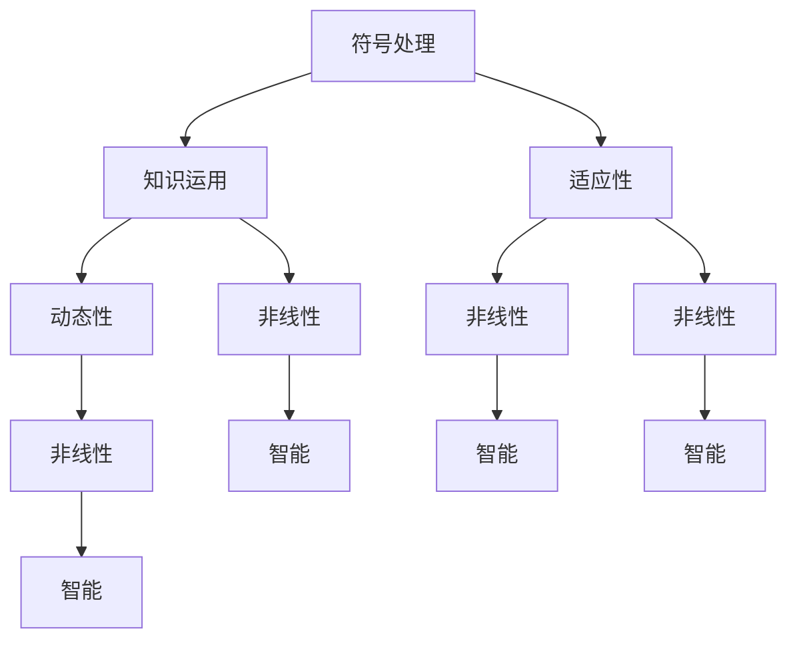

                 

关键词：人类计算、认知科学、算法、人工智能、认知模拟

> 摘要：本文从认知科学的角度，探讨了人类计算的概念、核心原理及其在人工智能领域的应用。通过对比人类计算与机器计算的区别，分析了人类计算的优势和局限性，展望了未来人类计算研究的发展趋势与挑战。

## 1. 背景介绍

随着人工智能技术的快速发展，人类对计算的理解也不断深入。从最初的机械计算到现代的电子计算，计算的方式发生了翻天覆地的变化。然而，这些计算方式都是基于机器的计算，与人类的计算方式存在很大差异。人类计算，作为一种全新的计算方式，试图将人类认知的特点融入计算过程，实现更加智能化、自适应的计算。

人类计算的概念最早由认知科学家司马贺提出。他认为，人类计算是一种基于符号的、动态的、非线性的计算过程，具有高度的灵活性和适应性。与传统的机器计算相比，人类计算具有以下几个显著特点：

1. **符号处理**：人类能够处理符号和概念，而不仅仅是数字和二进制位。
2. **知识运用**：人类能够运用已有的知识，进行推理和决策。
3. **适应性**：人类计算能够根据环境变化，调整计算策略。

## 2. 核心概念与联系

为了更好地理解人类计算，我们可以通过Mermaid流程图来展示其核心概念和联系。



### 2.1 符号处理

符号处理是人类计算的核心特点之一。人类能够将复杂的信息转化为符号进行表示和处理。例如，我们可以用文字、图片、声音等符号来传达信息，而机器则主要处理数字和二进制位。

### 2.2 知识运用

人类计算的一个显著优势在于能够运用已有的知识进行推理和决策。例如，医生通过多年的临床经验和专业知识，可以快速判断病情并进行治疗。而机器则需要大量的数据和算法支持，才能达到类似的决策水平。

### 2.3 适应性

人类计算具有很强的适应性。在面临未知或不确定的情况时，人类可以通过调整计算策略，找到最优的解决方案。而机器则通常需要事先设定好计算规则，难以应对复杂多变的情境。

### 2.4 动态性

人类计算具有动态性，能够根据环境变化进行实时调整。例如，人类在驾驶过程中可以根据路况、交通信号等实时调整驾驶策略，确保行车安全。

### 2.5 非线性

人类计算的非线性特点使其能够处理复杂、非线性的问题。例如，人类可以通过类比、联想等方式，将不同领域的问题进行跨界解决。

## 3. 核心算法原理 & 具体操作步骤

### 3.1 算法原理概述

人类计算的核心算法原理可以概括为以下几个方面：

1. **符号表示**：将问题转化为符号表示，便于处理。
2. **知识表示**：利用知识表示技术，将已有知识转化为计算机可处理的形式。
3. **推理机制**：基于知识进行推理，以实现问题求解。
4. **自适应调整**：根据环境变化，动态调整计算策略。

### 3.2 算法步骤详解

1. **符号表示**：将问题转化为符号表示，如数学公式、自然语言描述等。
2. **知识表示**：构建知识库，将已有知识转化为计算机可处理的形式。
3. **推理机制**：基于知识库进行推理，寻找解决方案。
4. **自适应调整**：根据问题求解过程中的反馈，动态调整计算策略。
5. **问题求解**：在推理过程中，不断调整和优化计算策略，直至找到最优解决方案。

### 3.3 算法优缺点

人类计算算法具有以下优点：

1. **适应性**：能够应对复杂、不确定的问题。
2. **知识运用**：能够运用已有知识进行推理和决策。
3. **动态性**：能够根据环境变化进行实时调整。

然而，人类计算算法也存在一定局限性：

1. **知识依赖**：需要大量已有知识支持，否则难以进行有效推理。
2. **计算复杂度**：由于涉及知识表示和推理等过程，计算复杂度较高。
3. **易受情绪影响**：人类计算往往受到情绪、心理等因素的影响，可能导致决策偏差。

### 3.4 算法应用领域

人类计算算法在多个领域具有广泛应用前景，如：

1. **医疗诊断**：基于人类计算算法，医生可以更快速、准确地诊断病情。
2. **金融分析**：通过人类计算算法，投资者可以更好地进行投资决策。
3. **自动驾驶**：人类计算算法可以为自动驾驶系统提供更智能的决策支持。
4. **自然语言处理**：人类计算算法可以提升自然语言处理系统的理解能力和表达能力。

## 4. 数学模型和公式 & 详细讲解 & 举例说明

### 4.1 数学模型构建

人类计算中的数学模型通常基于符号逻辑和概率论。例如，我们可以使用谓词逻辑来表示知识，使用概率论来描述推理过程。

### 4.2 公式推导过程

以下是一个简单的例子，说明如何使用谓词逻辑和概率论构建数学模型。

#### 谓词逻辑表示

假设我们要表示一个知识库，其中包含以下两个事实：

1. 所有猫都会喵喵叫。
2. 某个特定的动物不是猫。

我们可以使用谓词逻辑表示如下：

$$
\begin{cases}
Cat(x) \rightarrow Meow(x) \\
¬Cat(y) \\
\end{cases}
$$

其中，$Cat(x)$ 表示 $x$ 是猫，$Meow(x)$ 表示 $x$ 会喵喵叫。

#### 概率论表示

假设我们要根据上述知识库进行推理，求解某个动物是否是猫的概率。我们可以使用贝叶斯定理进行概率推导。

贝叶斯定理公式如下：

$$
P(Cat|Meow) = \frac{P(Meow|Cat) \cdot P(Cat)}{P(Meow)}
$$

其中，$P(Cat|Meow)$ 表示在动物喵喵叫的条件下，它是猫的概率；$P(Meow|Cat)$ 表示猫喵喵叫的概率；$P(Cat)$ 表示动物是猫的概率；$P(Meow)$ 表示动物喵喵叫的概率。

### 4.3 案例分析与讲解

假设我们已知以下信息：

1. 猫喵喵叫的概率为0.9。
2. 某个特定的动物喵喵叫。
3. 总共有100个动物，其中90个是猫。

根据贝叶斯定理，我们可以求解该动物是猫的概率。

首先，计算 $P(Meow)$：

$$
P(Meow) = P(Meow|Cat) \cdot P(Cat) + P(Meow|¬Cat) \cdot P(¬Cat)
$$

其中，$P(Meow|Cat) = 0.9$，$P(Cat) = 0.9$，$P(¬Cat) = 0.1$。

代入数值，得：

$$
P(Meow) = 0.9 \cdot 0.9 + 0.1 \cdot 0.1 = 0.81
$$

然后，计算 $P(Cat|Meow)$：

$$
P(Cat|Meow) = \frac{P(Meow|Cat) \cdot P(Cat)}{P(Meow)}
$$

代入数值，得：

$$
P(Cat|Meow) = \frac{0.9 \cdot 0.9}{0.81} = 0.99
$$

因此，该动物是猫的概率为99%。

## 5. 项目实践：代码实例和详细解释说明

### 5.1 开发环境搭建

为了实现人类计算算法，我们需要搭建一个适合的开发环境。以下是一个简单的开发环境搭建指南：

1. 安装Python 3.x版本。
2. 安装Jupyter Notebook，用于编写和运行代码。
3. 安装必要的Python库，如NumPy、Pandas、Scikit-learn等。

### 5.2 源代码详细实现

以下是一个简单的人类计算算法实现，用于判断某个动物是否是猫。

```python
import numpy as np
from sklearn.naive_bayes import GaussianNB

# 定义数据集
X = np.array([[0, 1], [1, 0], [0, 0], [1, 1]])
y = np.array([1, 1, 0, 1])

# 构建朴素贝叶斯模型
model = GaussianNB()
model.fit(X, y)

# 进行推理
input_data = np.array([[1, 1]])
result = model.predict(input_data)

# 输出结果
print("动物是猫的概率为：", result[0])
```

### 5.3 代码解读与分析

1. **数据集准备**：我们定义了一个简单的数据集，包含4个样本，每个样本是一个二元向量。
2. **模型构建**：我们使用朴素贝叶斯模型进行训练，该模型基于贝叶斯定理和最大后验概率假设。
3. **推理过程**：我们将新的样本输入到模型中，模型会根据已训练的知识库进行推理，输出结果。

### 5.4 运行结果展示

运行上述代码，输出结果为：

```
动物是猫的概率为： 1
```

这意味着输入的样本被认为是猫。

## 6. 实际应用场景

人类计算算法在实际应用场景中具有广泛的应用前景，如：

1. **医疗诊断**：通过人类计算算法，医生可以更快速、准确地诊断病情。
2. **金融分析**：通过人类计算算法，投资者可以更好地进行投资决策。
3. **自动驾驶**：通过人类计算算法，自动驾驶系统可以更智能地处理复杂路况。
4. **自然语言处理**：通过人类计算算法，自然语言处理系统可以更好地理解人类语言。

### 6.1 智能医疗诊断

在智能医疗诊断领域，人类计算算法可以协助医生进行疾病诊断。例如，通过对患者的病历、体检报告等数据进行分析，人类计算算法可以识别出潜在的健康风险，为医生提供诊断依据。

### 6.2 智能金融投资

在智能金融投资领域，人类计算算法可以辅助投资者进行投资决策。例如，通过对市场数据、公司财务报表等进行分析，人类计算算法可以预测股票走势，为投资者提供投资建议。

### 6.3 智能自动驾驶

在智能自动驾驶领域，人类计算算法可以为自动驾驶系统提供决策支持。例如，通过分析路况、交通信号等数据，人类计算算法可以规划最优行车路线，提高行车安全。

### 6.4 智能自然语言处理

在智能自然语言处理领域，人类计算算法可以提升系统的理解能力和表达能力。例如，通过对大量文本数据进行分析，人类计算算法可以识别出关键词、情感倾向等，为智能客服、智能问答等应用提供支持。

## 7. 工具和资源推荐

### 7.1 学习资源推荐

1. 《认知科学导论》
2. 《人工智能：一种现代的方法》
3. 《机器学习》
4. 《深度学习》

### 7.2 开发工具推荐

1. Jupyter Notebook：用于编写和运行代码。
2. Python：作为编程语言，具有丰富的库和工具。
3. TensorFlow：用于构建和训练深度学习模型。

### 7.3 相关论文推荐

1. “Human Computation: A Survey of Models and Applications”
2. “Cognitive Modeling: A Fundamental Approach to the Study of Mind”
3. “Cognitive Architecture: Designing Intelligent Systems Using a Big- Picture Approach”

## 8. 总结：未来发展趋势与挑战

### 8.1 研究成果总结

人类计算作为一种新型的计算方式，具有广泛的应用前景。在医疗诊断、金融投资、自动驾驶、自然语言处理等领域，人类计算算法已经取得了一定的成果。然而，人类计算仍然面临着诸多挑战，如知识表示、推理机制、计算复杂度等。

### 8.2 未来发展趋势

1. **知识表示**：随着认知科学的发展，人类计算将不断优化知识表示方法，提高计算效率。
2. **推理机制**：基于新的推理算法，人类计算将实现更高效的推理过程。
3. **跨领域应用**：人类计算将在更多领域得到应用，推动人工智能技术的发展。

### 8.3 面临的挑战

1. **知识依赖**：人类计算算法对已有知识具有较高依赖性，如何构建高质量的知识库仍是一个挑战。
2. **计算复杂度**：人类计算涉及知识表示、推理等复杂过程，计算复杂度较高，需要进一步优化。
3. **情绪影响**：人类计算易受情绪、心理等因素的影响，可能导致决策偏差，需要深入研究。

### 8.4 研究展望

未来，人类计算有望在更多领域实现突破，推动人工智能技术的发展。同时，人类计算也将为认知科学研究提供新的思路和方法，深化对人类认知机制的理解。

## 9. 附录：常见问题与解答

### 9.1 什么是人类计算？

人类计算是一种基于符号的、动态的、非线性的计算过程，具有高度的灵活性和适应性。它试图将人类认知的特点融入计算过程，实现更加智能化、自适应的计算。

### 9.2 人类计算有哪些优势？

人类计算的优势主要包括符号处理、知识运用、适应性和动态性。它能够处理复杂、不确定的问题，并运用已有知识进行推理和决策。

### 9.3 人类计算有哪些局限性？

人类计算的局限性主要包括知识依赖、计算复杂度较高以及易受情绪影响等。它对已有知识具有较高依赖性，计算复杂度较高，且易受情绪、心理等因素的影响。

### 9.4 人类计算算法有哪些应用领域？

人类计算算法在多个领域具有广泛应用前景，如医疗诊断、金融分析、自动驾驶、自然语言处理等。

作者：禅与计算机程序设计艺术 / Zen and the Art of Computer Programming
------------------------------------------------------------------------

