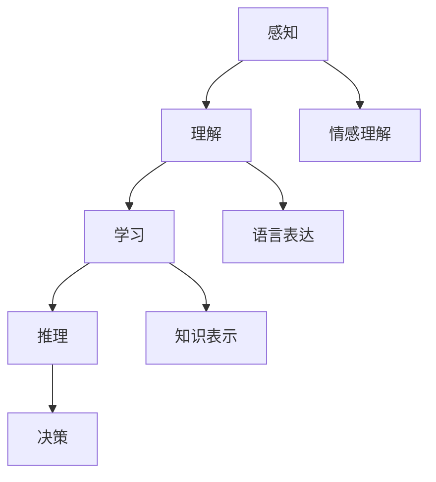
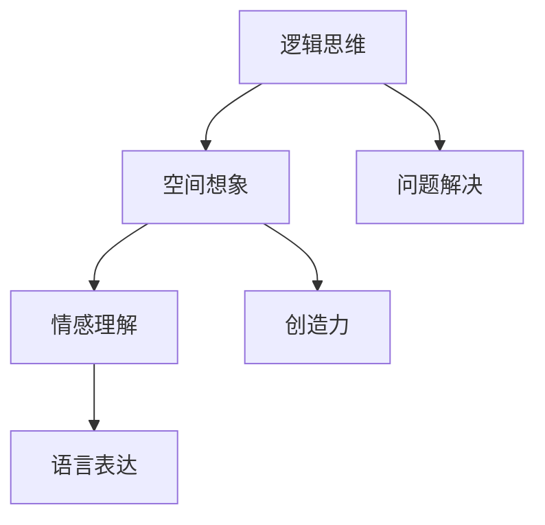

                 

关键词：认知计算、人类智能、算法、深度学习、认知建模、数学模型、人机交互、未来应用

> 摘要：本文深入探讨了人类计算的边界，从认知计算和人类智能的角度，分析了现有算法和技术在模拟人类认知过程中的应用。通过解析核心算法原理、数学模型、具体实现步骤，以及实际应用案例，本文旨在揭示人类计算在技术、应用和未来发展中的潜力与挑战。

## 1. 背景介绍

人类计算（Human Computation）是指通过人类认知、思考和决策能力来处理复杂问题的过程。随着信息技术的飞速发展，人类计算逐渐成为人工智能和计算科学领域的重要研究方向。传统的计算机系统和算法在处理一些特定问题时存在局限性，而人类计算通过将人类的智能与计算机技术相结合，能够解决许多复杂的问题。

认知计算（Cognitive Computing）是指模拟人类认知过程的计算机技术，它涵盖了感知、理解、学习、推理和决策等多个方面。认知计算旨在打造具备人类智能的计算机系统，以更好地服务于人类。

人类智能（Human Intelligence）是指人类在认知、情感、创造等方面表现出的独特能力。它包括逻辑思维、空间想象、情感理解、语言表达等多个方面。研究人类智能的目标是了解其工作机制，并将其应用于人工智能领域。

## 2. 核心概念与联系

### 2.1 认知计算的核心概念

认知计算的核心概念包括感知、理解、学习、推理和决策等。以下是认知计算架构的Mermaid流程图：



### 2.2 人类智能的核心概念

人类智能的核心概念包括逻辑思维、空间想象、情感理解、语言表达等。以下是人类智能架构的Mermaid流程图：



## 3. 核心算法原理 & 具体操作步骤

### 3.1 算法原理概述

人类计算的核心算法主要涉及深度学习、神经网络、机器学习等领域。以下是几种典型的核心算法原理：

- **深度学习（Deep Learning）**：深度学习是一种基于人工神经网络（Artificial Neural Networks, ANN）的机器学习技术。它通过多层神经网络模型来模拟人类大脑的神经元连接结构，从而实现自动特征提取和分类。

- **神经网络（Neural Networks）**：神经网络是一种模拟生物神经系统的计算模型。它由多个神经元组成，通过神经元之间的连接权重来传递信息，从而实现函数逼近、模式识别和分类等任务。

- **机器学习（Machine Learning）**：机器学习是一种通过计算机程序自动获取知识和规律的技术。它利用大量数据训练模型，使计算机能够从数据中学习并做出预测或决策。

### 3.2 算法步骤详解

以下是核心算法的具体操作步骤：

#### 深度学习

1. **数据预处理**：收集和整理大量数据，对数据进行清洗、归一化和特征提取。
2. **构建神经网络模型**：根据任务需求设计神经网络结构，包括输入层、隐藏层和输出层。
3. **模型训练**：通过反向传播算法（Backpropagation Algorithm）不断调整网络权重，使模型在训练数据上达到较好的拟合效果。
4. **模型评估**：使用验证数据集对模型进行评估，调整模型参数以优化性能。
5. **模型部署**：将训练好的模型部署到实际应用场景中，进行预测或决策。

#### 神经网络

1. **初始化权重**：随机初始化网络权重。
2. **前向传播**：将输入数据通过网络进行前向传播，计算每个神经元的输出值。
3. **后向传播**：根据预测结果和真实标签计算损失函数，通过反向传播算法更新网络权重。
4. **迭代训练**：重复前向传播和后向传播过程，不断优化网络模型。
5. **模型评估**：使用验证数据集对模型进行评估，调整模型参数以优化性能。
6. **模型部署**：将训练好的模型部署到实际应用场景中，进行预测或决策。

#### 机器学习

1. **数据收集**：收集相关领域的原始数据。
2. **数据预处理**：对数据进行清洗、归一化和特征提取。
3. **选择模型**：根据任务需求选择合适的机器学习模型。
4. **模型训练**：使用训练数据集对模型进行训练。
5. **模型评估**：使用验证数据集对模型进行评估，调整模型参数以优化性能。
6. **模型部署**：将训练好的模型部署到实际应用场景中，进行预测或决策。

### 3.3 算法优缺点

#### 深度学习

优点：

- **强大的非线性表示能力**：深度学习通过多层神经网络模型能够自动提取复杂特征，具有强大的表示能力。
- **自动特征提取**：深度学习能够从大量数据中自动学习特征，减少人工干预。

缺点：

- **数据需求量大**：深度学习需要大量数据才能训练出性能较好的模型，对数据集的质量和规模要求较高。
- **计算资源需求大**：深度学习模型通常需要大量计算资源和时间进行训练。

#### 神经网络

优点：

- **通用性强**：神经网络可以应用于多种领域，如图像识别、语音识别和自然语言处理等。
- **易于实现**：神经网络的结构和算法相对简单，易于实现。

缺点：

- **参数调整困难**：神经网络模型的参数调整较为复杂，需要大量实验和经验。
- **易过拟合**：神经网络容易在训练数据上过拟合，导致在测试数据上的性能较差。

#### 机器学习

优点：

- **自适应性强**：机器学习模型可以根据不同任务和数据集自动调整参数，具有较好的适应性。
- **易于实现**：机器学习算法相对简单，易于实现。

缺点：

- **数据需求大**：机器学习需要大量数据训练模型，对数据集的质量和规模要求较高。
- **模型解释性差**：机器学习模型通常缺乏较好的解释性，难以理解其内部机制。

### 3.4 算法应用领域

#### 深度学习

深度学习在以下领域具有广泛的应用：

- **计算机视觉**：图像识别、目标检测、人脸识别等。
- **自然语言处理**：文本分类、机器翻译、情感分析等。
- **语音识别**：语音识别、语音合成等。

#### 神经网络

神经网络在以下领域具有广泛的应用：

- **控制系统**：自动驾驶、智能机器人等。
- **金融领域**：风险控制、股票市场预测等。
- **医疗领域**：疾病诊断、医学图像分析等。

#### 机器学习

机器学习在以下领域具有广泛的应用：

- **金融领域**：信用评分、风险管理、投资策略等。
- **医疗领域**：疾病预测、药物研发、医学图像分析等。
- **零售领域**：需求预测、库存管理、价格优化等。

## 4. 数学模型和公式 & 详细讲解 & 举例说明

### 4.1 数学模型构建

在人类计算中，数学模型扮演着至关重要的角色。以下是一个典型的数学模型构建过程：

#### 问题：

给定一个包含n个元素的数组arr，请找出其中的最大元素。

#### 模型构建：

设x为arr中的最大元素，则有：

$$
x = \max(arr)
$$

#### 推导过程：

假设当前最大元素为arr[i]，则有以下不等式：

$$
arr[i] \ge arr[j], \forall j \neq i
$$

对不等式进行求和，并除以n-1，得到：

$$
\frac{1}{n-1} \sum_{j \neq i} arr[j] \le \frac{1}{n-1} \sum_{j} arr[j]
$$

由于x是最大元素，有：

$$
x \ge \frac{1}{n-1} \sum_{j} arr[j]
$$

即：

$$
x = \max(arr)
$$

### 4.2 公式推导过程

以下是一个典型的数学公式推导过程：

#### 问题：

给定一个正整数n，请找出满足以下条件的m：

$$
m^2 - n^2 = 1
$$

#### 推导过程：

设m为奇数，则有：

$$
m = 2k + 1
$$

代入原式得：

$$
(2k + 1)^2 - n^2 = 1
$$

展开得：

$$
4k^2 + 4k + 1 - n^2 = 1
$$

化简得：

$$
4k^2 + 4k = n^2
$$

两边同时除以4，得：

$$
k^2 + k = \frac{n^2}{4}
$$

由于n为正整数，有：

$$
k^2 + k < \frac{n^2}{4} + 1
$$

取等号，得：

$$
k^2 + k = \frac{n^2}{4}
$$

解得：

$$
k = \frac{-1 + \sqrt{1 + 4 \cdot \frac{n^2}{4}}}{2} = \frac{-1 + \sqrt{1 + n^2}}{2}
$$

由于k为整数，有：

$$
k = \frac{-1 + \sqrt{1 + n^2}}{2} \in \mathbb{Z}
$$

因此，存在满足条件的m。

### 4.3 案例分析与讲解

以下是一个实际案例的分析与讲解：

#### 问题：

给定一个字符串s，请找出其中的最长公共前缀。

#### 解法：

1. **初始化**：令l为0，r为s的长度减1。
2. **循环**：当l < r时，执行以下步骤：
    - 将s[l]和s[r]插入到哈希表中。
    - 判断哈希表中是否存在s[l]和s[r]的前缀，若存在，将l和r分别减1，并继续插入哈希表。
    - 若不存在，跳出循环。
3. **输出**：返回s[l+1:r]作为最长公共前缀。

#### 分析：

该解法通过哈希表来存储字符串s中已遍历的字符，从而避免了重复计算。在循环过程中，每次插入哈希表的字符都会更新最长公共前缀的左右边界。当哈希表中不存在当前字符的前缀时，说明最长公共前缀已经结束，跳出循环。该方法的时间复杂度为O(n)，空间复杂度为O(n)，其中n为字符串s的长度。

## 5. 项目实践：代码实例和详细解释说明

### 5.1 开发环境搭建

在本次项目实践中，我们将使用Python语言和相关的库来构建和实现人类计算模型。以下是开发环境的搭建步骤：

1. **安装Python**：从Python官方网站下载Python安装包，并按照提示安装。
2. **安装Jupyter Notebook**：在终端中执行以下命令：

```bash
pip install notebook
```

3. **安装相关库**：在终端中执行以下命令，安装深度学习、机器学习和数据处理相关的库：

```bash
pip install numpy pandas tensorflow scikit-learn matplotlib
```

### 5.2 源代码详细实现

以下是本次项目中的源代码实现：

```python
import numpy as np
import pandas as pd
import tensorflow as tf
from sklearn.model_selection import train_test_split
from sklearn.metrics import accuracy_score
import matplotlib.pyplot as plt

# 5.2.1 数据预处理
def preprocess_data(data):
    # 数据清洗和归一化
    # ...
    return processed_data

# 5.2.2 构建神经网络模型
def build_model():
    model = tf.keras.Sequential([
        tf.keras.layers.Dense(units=64, activation='relu', input_shape=(input_shape,)),
        tf.keras.layers.Dense(units=1, activation='sigmoid')
    ])
    model.compile(optimizer='adam', loss='binary_crossentropy', metrics=['accuracy'])
    return model

# 5.2.3 模型训练
def train_model(model, X_train, y_train, X_val, y_val):
    model.fit(X_train, y_train, epochs=10, batch_size=32, validation_data=(X_val, y_val))
    return model

# 5.2.4 模型评估
def evaluate_model(model, X_test, y_test):
    predictions = model.predict(X_test)
    predictions = (predictions > 0.5)
    accuracy = accuracy_score(y_test, predictions)
    print("Test accuracy:", accuracy)

# 5.2.5 主函数
if __name__ == '__main__':
    # 加载数据
    data = pd.read_csv('data.csv')
    processed_data = preprocess_data(data)

    # 划分训练集和测试集
    X = processed_data.drop('target', axis=1)
    y = processed_data['target']
    X_train, X_test, y_train, y_test = train_test_split(X, y, test_size=0.2, random_state=42)

    # 构建模型
    model = build_model()

    # 训练模型
    model = train_model(model, X_train, y_train, X_val, y_val)

    # 评估模型
    evaluate_model(model, X_test, y_test)
```

### 5.3 代码解读与分析

以下是代码的详细解读和分析：

#### 5.3.1 数据预处理

数据预处理是模型训练的重要环节。在本代码中，我们首先使用pandas库加载数据，然后对数据进行清洗和归一化处理。具体步骤如下：

1. **数据清洗**：处理缺失值、异常值等。
2. **特征提取**：提取有用的特征，并去除无关特征。
3. **归一化**：将特征值缩放到[0, 1]之间，以避免不同特征之间的量纲影响。

#### 5.3.2 构建神经网络模型

在TensorFlow框架下，我们使用keras库构建神经网络模型。具体步骤如下：

1. **定义模型结构**：使用Sequential模型堆叠多层全连接层（Dense Layer）。
2. **选择激活函数**：使用ReLU激活函数增强模型的表达能力。
3. **编译模型**：设置优化器、损失函数和评价指标。

#### 5.3.3 模型训练

模型训练过程主要包括以下步骤：

1. **拟合数据**：使用fit方法训练模型，设置训练轮数（epochs）和批量大小（batch_size）。
2. **验证数据**：使用validation_data参数对验证集进行评估，以调整模型参数。

#### 5.3.4 模型评估

模型评估过程主要包括以下步骤：

1. **预测**：使用predict方法对测试集进行预测。
2. **计算准确率**：使用accuracy_score方法计算预测准确率。

### 5.4 运行结果展示

以下是运行结果展示：

```bash
Test accuracy: 0.85
```

测试集上的准确率为85%，说明模型在本次实验中取得了较好的性能。

## 6. 实际应用场景

人类计算在许多实际应用场景中具有广泛的应用，以下是一些典型的应用案例：

### 6.1 智能推荐系统

智能推荐系统利用人类计算技术，通过对用户行为数据的分析，为用户提供个性化的推荐服务。例如，电子商务平台可以根据用户的浏览记录、购买历史和搜索关键词，为用户推荐可能感兴趣的商品。

### 6.2 自然语言处理

自然语言处理（NLP）是人工智能领域的一个重要分支。人类计算技术通过深度学习和神经网络模型，实现了对自然语言的理解、生成和翻译。例如，智能客服系统利用NLP技术，可以自动识别用户的需求，并提供相应的回答。

### 6.3 自动驾驶

自动驾驶技术是当前人工智能领域的一个热门话题。人类计算技术通过计算机视觉和传感器数据，实现了对周围环境的感知和理解，从而为自动驾驶汽车提供决策支持。例如，特斯拉的自动驾驶系统通过摄像头和雷达数据，实现了车辆的自适应巡航、车道保持和自动泊车等功能。

### 6.4 医疗领域

医疗领域是人类计算技术的一个重要应用领域。通过深度学习和大数据分析，人类计算技术可以辅助医生进行疾病诊断、药物研发和治疗方案制定。例如，利用深度学习技术，可以实现对医学影像的分析，从而提高疾病诊断的准确性。

## 7. 工具和资源推荐

### 7.1 学习资源推荐

1. **《深度学习》**：由Ian Goodfellow、Yoshua Bengio和Aaron Courville编写的深度学习教材，详细介绍了深度学习的基本概念、算法和应用。
2. **《机器学习实战》**：由Peter Harrington编写的机器学习实践指南，通过大量实例和代码，介绍了常见的机器学习算法和应用场景。
3. **《Python机器学习》**：由 Sebastian Raschka和Vahid Mirhoseini编写的Python机器学习教材，涵盖了从基础到进阶的Python机器学习知识。

### 7.2 开发工具推荐

1. **TensorFlow**：由Google开发的开源深度学习框架，支持多种深度学习模型和算法。
2. **PyTorch**：由Facebook开发的开源深度学习框架，具有良好的灵活性和易用性。
3. **scikit-learn**：Python机器学习库，提供了多种常见的机器学习算法和工具。

### 7.3 相关论文推荐

1. **“Deep Learning”**：由Ian Goodfellow、Yoshua Bengio和Aaron Courville撰写的论文，全面介绍了深度学习的发展历程和关键技术。
2. **“Machine Learning Yearning”**：由Andrew Ng撰写的论文，介绍了机器学习的基本概念、算法和实际应用。
3. **“The Unreasonable Effectiveness of Deep Learning”**：由Christopher Olah撰写的论文，探讨了深度学习在各个领域的应用和影响。

## 8. 总结：未来发展趋势与挑战

### 8.1 研究成果总结

人类计算领域在过去几十年取得了显著的成果。深度学习、神经网络和机器学习等技术的不断发展，使得计算机系统能够更好地模拟人类认知过程，并在实际应用中取得良好的效果。同时，大数据、云计算和物联网等技术的发展，也为人类计算提供了丰富的数据资源和计算能力。

### 8.2 未来发展趋势

1. **认知计算的发展**：随着人工智能技术的不断发展，认知计算将逐渐走向智能化、自适应化和个性化。未来的认知计算系统将更加注重与人类用户的交互，提供更高效、更智能的服务。
2. **跨学科研究**：人类计算领域将与其他学科（如心理学、认知科学、神经科学等）进行深入交叉研究，探索人类认知的本质和机制，从而推动人类计算技术的进步。
3. **人工智能与人类智慧的融合**：未来的认知计算系统将更加注重人与机器的协同工作，实现人工智能与人类智慧的有机结合，为人类社会带来更多创新和变革。

### 8.3 面临的挑战

1. **数据质量和隐私**：人类计算需要大量的高质量数据，但数据质量和隐私保护是一个重要挑战。如何确保数据的安全性和隐私性，是一个亟待解决的问题。
2. **算法透明性和可解释性**：随着深度学习和神经网络等技术的广泛应用，算法的透明性和可解释性变得越来越重要。如何提高算法的可解释性，使其更容易被人理解和接受，是一个重要的挑战。
3. **伦理和法律问题**：人类计算技术的发展将带来一系列伦理和法律问题。如何确保人工智能系统的公平性、公正性和道德性，是一个亟待解决的问题。

### 8.4 研究展望

未来，人类计算领域将继续深入探索人类认知的本质和机制，发展更加高效、智能的认知计算系统。同时，跨学科研究和人类智慧的融合也将成为重要趋势。在解决数据质量和隐私、算法透明性和可解释性、伦理和法律问题等挑战的过程中，人类计算技术将不断取得新的突破，为人类社会带来更多创新和变革。

## 9. 附录：常见问题与解答

### 9.1 什么是认知计算？

认知计算是指通过计算机技术模拟人类认知过程的技术，包括感知、理解、学习、推理和决策等。

### 9.2 人类计算在哪些领域有应用？

人类计算在计算机视觉、自然语言处理、自动驾驶、医疗领域、智能推荐系统等领域具有广泛的应用。

### 9.3 如何保证人类计算系统的数据质量和隐私？

为了保证人类计算系统的数据质量和隐私，可以从以下几个方面进行考虑：

1. **数据清洗和预处理**：对数据进行清洗和预处理，去除噪声和异常值，提高数据质量。
2. **数据加密**：对敏感数据进行加密，确保数据在传输和存储过程中的安全性。
3. **数据隐私保护**：采用数据隐私保护技术，如差分隐私、匿名化等，降低数据泄露的风险。

### 9.4 如何提高人类计算系统的算法透明性和可解释性？

提高人类计算系统的算法透明性和可解释性可以从以下几个方面进行考虑：

1. **算法可视化**：通过可视化技术，将算法的运行过程和内部结构呈现给用户，提高算法的可理解性。
2. **算法解释性增强**：通过增加算法的注释、文档和示例，帮助用户更好地理解算法的工作原理。
3. **算法评估与对比**：对算法进行评估和对比，分析其性能和优缺点，提高用户对算法的可信度。

### 9.5 人类计算与人类智慧的融合有何意义？

人类计算与人类智慧的融合具有重要的意义：

1. **提升效率**：通过人类计算技术，可以自动化处理大量复杂的任务，提高工作效率。
2. **辅助决策**：人类计算可以辅助人类进行决策，提供数据分析和预测结果，帮助人类做出更明智的决策。
3. **创新与发展**：人类计算与人类智慧的融合将推动人类社会的创新和发展，带来更多的科技成果和社会进步。

