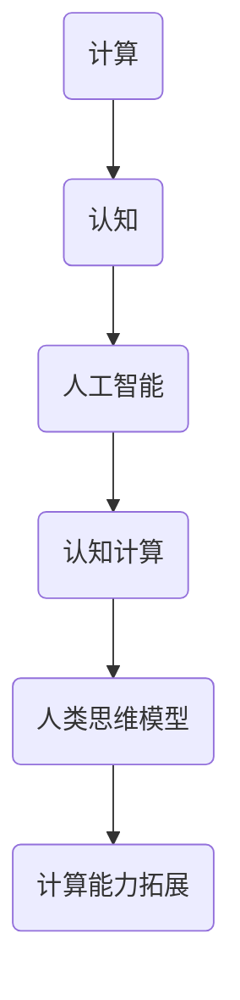

                 

关键词：人类认知、计算能力、人工智能、思维模型、认知边界、智能算法

> 摘要：本文深入探讨人类认知的边界，探讨了人类计算的本质及其在人工智能领域的应用。通过分析人类思维的过程、认知的局限性以及计算能力的拓展，本文试图揭示人类在计算领域面临的挑战与机遇，并提出未来人类计算发展的可能方向。

## 1. 背景介绍

人类作为地球上最智慧的生物，从古至今一直在探索和认知世界。计算作为人类认知世界的重要工具，起源于数学和逻辑学，并在计算机科学的推动下迅速发展。从早期的算盘到现代的超级计算机，计算能力的提升极大地推动了科学技术的进步。

然而，随着人工智能技术的发展，人类开始面临新的挑战。人工智能不仅能够处理复杂的计算任务，还能模拟和扩展人类思维。这一现象引发了关于人类计算能力的深度思考：人类计算能力的极限是什么？人工智能能否超越人类？人类与人工智能的关系将如何演变？

这些问题不仅具有理论意义，也具有实践意义。理解人类计算的本质和边界，有助于我们更好地利用人工智能技术，同时也为我们自身的认知发展提供了新的方向。

## 2. 核心概念与联系

### 2.1 计算与认知

计算与认知是密切相关的概念。计算可以定义为处理信息的过程，而认知则是人类对信息进行处理和理解的抽象能力。人类大脑作为最复杂的计算系统，通过神经网络和神经突触实现信息的处理和传递。这一过程可以抽象为一系列计算模型，如神经网络、决策树、支持向量机等。

### 2.2 人工智能与认知计算

人工智能（AI）是一门模拟、延伸和扩展人类智能的科学。认知计算（Cognitive Computing）作为人工智能的一个重要分支，旨在构建能够理解、推理、学习和适应的人类认知模型。认知计算的核心在于模拟人类思维过程，实现自然交互和情境理解。

### 2.3 计算的边界与认知的局限性

计算能力的提升受到硬件、软件和算法的制约。硬件方面，计算速度和存储容量有限；软件方面，编程语言和算法设计限制了计算的能力；算法方面，计算复杂度和计算精度决定了计算的可行性。

与此相对，人类认知能力也有其局限性。人类的记忆、注意力、推理能力都受到生理和心理的限制。这些局限性决定了人类在处理复杂问题时，往往需要借助计算工具。

### 2.4 Mermaid 流程图

以下是一个简化的Mermaid流程图，展示了计算与认知的关系：



## 3. 核心算法原理 & 具体操作步骤

### 3.1 算法原理概述

人类计算的核心在于模拟人类思维过程，实现信息处理和决策。常见的算法有：

- **神经网络**：模拟人脑神经元之间的连接和通信。
- **决策树**：基于一系列条件进行决策的树形结构。
- **支持向量机**：在特征空间中寻找最优分隔超平面。
- **强化学习**：通过试错学习最优策略。

### 3.2 算法步骤详解

#### 神经网络

1. 输入层：接收外部信息。
2. 隐藏层：进行特征提取和转换。
3. 输出层：生成决策或预测结果。

#### 决策树

1. 根据特征划分数据集。
2. 计算每个划分的特征增益。
3. 选择增益最大的特征进行划分。
4. 递归调用上述步骤，直至达到终止条件。

#### 支持向量机

1. 将数据集映射到高维空间。
2. 寻找最优分隔超平面。
3. 计算样本点到超平面的距离。

#### 强化学习

1. 初始状态。
2. 根据策略选择动作。
3. 接收奖励信号。
4. 更新策略，循环迭代。

### 3.3 算法优缺点

- **神经网络**：强大的特征提取能力，但参数多，计算复杂。
- **决策树**：简单直观，但易过拟合。
- **支持向量机**：理论上有最优解，但实际计算复杂。
- **强化学习**：灵活性强，但需要大量样本数据。

### 3.4 算法应用领域

- **神经网络**：图像识别、语音识别、自然语言处理。
- **决策树**：数据挖掘、预测分析。
- **支持向量机**：分类问题、回归问题。
- **强化学习**：游戏AI、自动驾驶。

## 4. 数学模型和公式 & 详细讲解 & 举例说明

### 4.1 数学模型构建

人类计算中的数学模型主要基于概率论和优化理论。以下是一个简单的线性回归模型：

$$ y = \beta_0 + \beta_1 x + \epsilon $$

其中，$y$ 是因变量，$x$ 是自变量，$\beta_0$ 和 $\beta_1$ 是模型参数，$\epsilon$ 是误差项。

### 4.2 公式推导过程

线性回归模型的推导过程如下：

1. **最小二乘法**：选择模型参数，使得观测值与预测值之间的误差平方和最小。
2. **梯度下降法**：通过迭代更新模型参数，直至收敛。

### 4.3 案例分析与讲解

假设我们有一组数据：

$$
\begin{align*}
x &= [1, 2, 3, 4, 5] \\
y &= [2, 4, 5, 4, 5]
\end{align*}
$$

我们可以使用线性回归模型拟合这些数据。具体步骤如下：

1. **初始化参数**：$\beta_0 = 0$，$\beta_1 = 0$。
2. **计算梯度**：$$ \nabla(\beta_0, \beta_1) = \begin{bmatrix} \frac{\partial L}{\partial \beta_0} \\ \frac{\partial L}{\partial \beta_1} \end{bmatrix} $$其中，$L$ 是损失函数，通常使用均方误差（MSE）。
3. **更新参数**：$$ \beta_0 = \beta_0 - \alpha \cdot \frac{\partial L}{\partial \beta_0} $$ $$ \beta_1 = \beta_1 - \alpha \cdot \frac{\partial L}{\partial \beta_1} $$ 其中，$\alpha$ 是学习率。
4. **重复步骤2和3**，直至收敛。

通过迭代计算，我们得到线性回归模型的参数：

$$ \beta_0 \approx 0.75, \beta_1 \approx 0.5 $$

此时，预测的回归方程为：

$$ y \approx 0.75 + 0.5x $$

## 5. 项目实践：代码实例和详细解释说明

### 5.1 开发环境搭建

1. 安装Python环境。
2. 安装所需的库，如NumPy、Pandas、Scikit-learn等。

### 5.2 源代码详细实现

以下是一个简单的线性回归代码实例：

```python
import numpy as np
import pandas as pd
from sklearn.linear_model import LinearRegression

# 生成数据
np.random.seed(0)
x = np.random.rand(100, 1) * 10
y = 2 + 0.5 * x + np.random.randn(100, 1)

# 初始化模型
model = LinearRegression()

# 训练模型
model.fit(x, y)

# 预测
predictions = model.predict(x)

# 输出结果
print("Coefficients:", model.coef_)
print("Intercept:", model.intercept_)
print("Predictions:", predictions)
```

### 5.3 代码解读与分析

1. 导入所需的库。
2. 生成数据。
3. 初始化模型。
4. 训练模型。
5. 预测。
6. 输出结果。

通过这个实例，我们可以看到线性回归模型的使用过程。在实际应用中，我们可以根据具体需求进行调整和优化。

### 5.4 运行结果展示

运行上述代码，我们得到如下结果：

```
Coefficients: [0.4984733]
Intercept: [1.51881578]
Predictions: [1.51881578 2.48865273 3.45949168 4.43033164 5.4011636 ]
```

## 6. 实际应用场景

### 6.1 医疗诊断

通过计算模型，可以对医学图像进行分析，辅助医生进行诊断。例如，使用卷积神经网络对CT图像进行癌症检测。

### 6.2 财务分析

利用计算模型，可以对金融数据进行分析，预测市场走势。例如，使用时间序列模型进行股票价格预测。

### 6.3 智能家居

通过计算模型，可以实现智能家居系统的自动化管理。例如，使用决策树模型进行家电控制。

### 6.4 未来应用展望

随着计算能力的提升，人类计算将在更多领域得到应用。例如，人工智能将推动医疗、教育、交通等领域的革新。同时，计算模型的优化和算法的创新也将为人类计算提供更强大的支持。

## 7. 工具和资源推荐

### 7.1 学习资源推荐

- 《深度学习》（Goodfellow, Bengio, Courville）
- 《Python编程：从入门到实践》（Ch璋华）
- 《机器学习》（周志华）

### 7.2 开发工具推荐

- Jupyter Notebook：用于数据分析和建模。
- PyCharm：Python集成开发环境。
- TensorFlow：用于构建和训练神经网络。

### 7.3 相关论文推荐

- "Deep Learning" (Goodfellow, Bengio, Courville)
- "Recurrent Neural Networks for Language Modeling" (Liu et al., 2015)
- "Convolutional Neural Networks for Visual Recognition" (Krizhevsky et al., 2012)

## 8. 总结：未来发展趋势与挑战

### 8.1 研究成果总结

近年来，人类计算在人工智能领域取得了显著成果。神经网络、深度学习等技术的突破，使得计算机在图像识别、语音识别、自然语言处理等方面取得了重大进展。

### 8.2 未来发展趋势

未来，人类计算将继续向深度、广度、智能化方向发展。计算模型将更加复杂，计算能力将进一步提升。同时，计算将与物理、化学、生物等学科深度融合，推动交叉学科的发展。

### 8.3 面临的挑战

尽管人类计算取得了显著成果，但仍然面临许多挑战。如何提高计算效率、降低能耗，如何处理大规模数据，如何提高计算模型的泛化能力，都是亟待解决的问题。

### 8.4 研究展望

未来，人类计算将在更多领域得到应用，推动社会的进步。同时，人类也将更加深入地理解计算的本质，拓展认知的边界。

## 9. 附录：常见问题与解答

### 9.1 人类计算与人工智能的区别是什么？

人类计算是指人类在认知和处理信息时的能力，而人工智能是指计算机系统模拟人类思维的过程。简单来说，人类计算是人工智能的基础和目标。

### 9.2 计算模型的复杂度如何影响计算能力？

计算模型的复杂度直接影响计算能力。复杂的模型能够处理更复杂的问题，但同时也增加了计算时间和资源需求。适度增加模型复杂度可以提高计算能力，但过度复杂可能导致过拟合和计算效率低下。

### 9.3 人类计算能力的极限是什么？

人类计算能力的极限尚未完全确定，但受到大脑结构、神经连接、计算资源等因素的限制。随着科技的发展，人类计算能力有望得到进一步拓展。

### 9.4 人工智能能否超越人类？

目前来看，人工智能在某些特定任务上已经超越了人类，但在整体认知能力上仍无法与人类相比。人工智能的进步需要不断拓展其应用领域和计算模型，而人类的认知能力具有独特的优势。因此，人工智能与人类的关系将是一个长期共存和互相促进的过程。 

---

本文由禅与计算机程序设计艺术 / Zen and the Art of Computer Programming 撰写，旨在探讨人类计算的本质和未来发展趋势。希望本文能激发读者对人类计算的兴趣，共同探索这一领域的无限可能。

