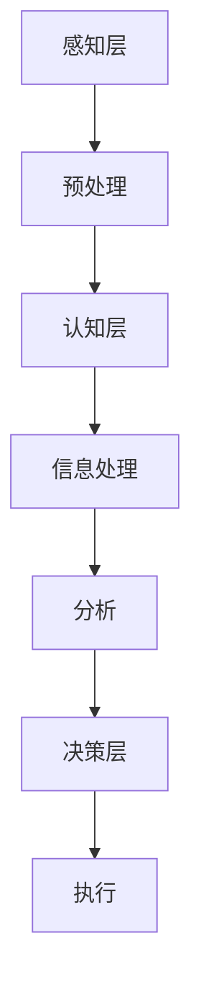

                 

关键词：认知计算，人机协作，机器学习，神经网络，人工智能，认知科学，算法原理，数学模型，实践应用，未来展望

> 摘要：本文旨在探讨人类认知与计算之间的深层联系，通过分析认知计算的核心概念、算法原理和数学模型，揭示人类认知的边界，并提出未来人工智能发展的可能路径。本文内容结构严谨，既有理论基础，又有实际案例，旨在为读者提供一个全面而深入的认知计算视角。

## 1. 背景介绍

人类认知是复杂的、高度适应的，它使我们能够理解世界、做出决策并创造文化。然而，随着计算技术的发展，计算机在处理大量数据和信息方面已经超越了人类。这种技术进步引发了一个关键问题：人类认知和计算之间存在何种关系？是否有可能通过计算模型来模拟或增强人类的认知能力？本文将从这些基本问题出发，探讨人类计算的可能性及其在现实世界中的应用。

### 认知计算的起源与发展

认知计算作为人工智能的一个分支，其研究始于20世纪80年代。早期的研究主要集中在模拟人类思维过程，如问题解决、学习和推理。随着神经科学和计算机科学的快速发展，认知计算逐渐融合了多种学科的理论和方法，形成了独特的交叉研究领域。

### 认知计算的重要性

认知计算的重要性体现在多个方面。首先，它有助于我们更好地理解人类认知的机制，从而推动认知科学的发展。其次，认知计算的应用可以提升人机协作效率，例如通过智能助手、自动驾驶等技术，改善人类生活质量。最后，认知计算也为未来人工智能的发展提供了新的研究方向和理论支持。

## 2. 核心概念与联系

要深入探讨认知计算，我们需要了解其核心概念和理论框架。以下是几个关键概念及其相互关系的详细描述。

### 认知模型

认知模型是描述人类思维过程的抽象模型。常见的认知模型包括推理模型、记忆模型和学习模型。例如，基于图灵机的认知模型试图模拟人类的推理过程，而基于神经网络的认知模型则试图模拟人类的学习和记忆过程。

### 机器学习与神经网络

机器学习是认知计算的核心技术之一。它通过构建数学模型来模拟和学习人类认知过程。神经网络作为机器学习的基础，由大量相互连接的简单计算单元（神经元）组成，通过调整连接权重来学习数据特征。

### 认知计算架构

认知计算架构是一个多层次的结构，包括感知层、认知层和决策层。感知层处理外部信息的输入和预处理，认知层负责信息的处理和分析，决策层则基于分析结果做出决策。以下是一个简化的 Mermaid 流程图，展示认知计算架构的基本组件：



### 认知计算与人类认知的联系

认知计算与人类认知之间存在紧密的联系。认知计算通过模拟人类认知过程，揭示了人类认知的内在机制。同时，通过认知计算模型的应用，我们可以更好地理解和预测人类行为，从而提升人机协作效率。

## 3. 核心算法原理 & 具体操作步骤

### 3.1 算法原理概述

认知计算的核心算法包括机器学习算法、神经网络算法和决策树算法等。以下分别介绍这些算法的基本原理。

#### 机器学习算法

机器学习算法通过训练数据集来学习特征并做出预测。常见的机器学习算法包括线性回归、逻辑回归、决策树、支持向量机等。机器学习算法的核心在于通过优化模型参数来提高预测准确性。

#### 神经网络算法

神经网络算法通过模拟人脑神经元连接的方式，实现数据的处理和分析。神经网络由输入层、隐藏层和输出层组成，通过调整连接权重来学习数据特征。

#### 决策树算法

决策树算法通过构建树形结构来模拟决策过程。每个节点代表一个特征，每个分支代表特征的一个取值，叶子节点代表最终的决策。决策树算法的目的是通过树结构来最大化分类或回归效果。

### 3.2 算法步骤详解

以下以神经网络算法为例，详细介绍其具体操作步骤。

#### 步骤 1：数据预处理

数据预处理包括数据清洗、归一化和特征提取等步骤。数据清洗旨在去除噪声和异常值，归一化则使数据具有相同的尺度，特征提取则将原始数据转换为神经网络可以处理的特征向量。

#### 步骤 2：构建神经网络

构建神经网络包括定义网络结构、初始化权重和偏置等。网络结构由输入层、隐藏层和输出层组成，每个层由多个神经元组成。权重和偏置的初始化对于神经网络的学习性能至关重要。

#### 步骤 3：前向传播

前向传播是将输入数据传递到神经网络，通过逐层计算神经元输出。在前向传播过程中，神经网络的每个神经元都计算其激活值，并将其传递给下一层。

#### 步骤 4：反向传播

反向传播是计算网络误差并更新权重和偏置。在反向传播过程中，网络计算每个神经元的梯度，并根据梯度方向调整权重和偏置，以最小化误差。

#### 步骤 5：训练与验证

训练与验证是神经网络学习过程的重要组成部分。通过多次迭代训练，神经网络不断调整权重和偏置，以优化模型性能。验证过程用于评估模型在未知数据上的表现，以确保模型泛化能力。

### 3.3 算法优缺点

#### 优点

1. **高度并行化**：神经网络可以并行处理大量数据，提高了计算效率。
2. **自适应性强**：神经网络可以通过学习适应不同的数据分布和特征。
3. **灵活性高**：神经网络可以处理复杂的非线性问题。

#### 缺点

1. **计算复杂度高**：神经网络需要大量的计算资源，尤其是在大规模数据集上训练。
2. **难以解释**：神经网络内部机制复杂，难以解释其决策过程。

### 3.4 算法应用领域

神经网络算法在多个领域有广泛应用，包括计算机视觉、自然语言处理、语音识别等。以下是一些典型应用实例：

1. **计算机视觉**：神经网络算法可以用于图像分类、目标检测和图像分割等任务。
2. **自然语言处理**：神经网络算法可以用于文本分类、机器翻译和情感分析等任务。
3. **语音识别**：神经网络算法可以用于语音识别和语音合成等任务。

## 4. 数学模型和公式 & 详细讲解 & 举例说明

### 4.1 数学模型构建

认知计算的数学模型是构建在其基础上的。以下是一个简单的线性回归模型的构建过程。

#### 线性回归模型

线性回归模型是一个用来预测连续值的模型，其基本形式为：

$$
y = \beta_0 + \beta_1 x
$$

其中，$y$ 是预测值，$x$ 是输入特征，$\beta_0$ 和 $\beta_1$ 是模型参数。

#### 多元线性回归模型

多元线性回归模型可以处理多个输入特征，其形式为：

$$
y = \beta_0 + \beta_1 x_1 + \beta_2 x_2 + \ldots + \beta_n x_n
$$

其中，$x_1, x_2, \ldots, x_n$ 是输入特征，$\beta_0, \beta_1, \beta_2, \ldots, \beta_n$ 是模型参数。

### 4.2 公式推导过程

以下以多元线性回归模型的推导为例，介绍数学模型的推导过程。

#### 模型推导

假设我们有一个数据集，其中包含 $n$ 个样本，每个样本有 $m$ 个特征。数据集可以表示为：

$$
X = \begin{bmatrix}
x_{11} & x_{12} & \ldots & x_{1m} \\
x_{21} & x_{22} & \ldots & x_{2m} \\
\vdots & \vdots & \ddots & \vdots \\
x_{n1} & x_{n2} & \ldots & x_{nm}
\end{bmatrix}, \quad y = \begin{bmatrix}
y_1 \\
y_2 \\
\vdots \\
y_n
\end{bmatrix}
$$

多元线性回归模型的目标是找到一组参数 $\beta = (\beta_0, \beta_1, \beta_2, \ldots, \beta_m)$，使得预测值 $y$ 与实际值 $y$ 的差距最小。

$$
\min_{\beta} \sum_{i=1}^{n} (y_i - \beta_0 - \beta_1 x_{i1} - \beta_2 x_{i2} - \ldots - \beta_m x_{im})^2
$$

将上式展开并求导，得到：

$$
\frac{\partial}{\partial \beta_j} \sum_{i=1}^{n} (y_i - \beta_0 - \beta_1 x_{i1} - \beta_2 x_{i2} - \ldots - \beta_m x_{im})^2 = 0
$$

化简后得到：

$$
\beta_j = \frac{\sum_{i=1}^{n} (x_{ij} - \bar{x_j})(y_i - \bar{y})}{\sum_{i=1}^{n} (x_{ij} - \bar{x_j})^2}
$$

其中，$\bar{x_j}$ 和 $\bar{y}$ 分别是 $x_j$ 和 $y$ 的平均值。

#### 模型简化

为了简化计算，我们通常采用最小二乘法来求解模型参数。最小二乘法的目标是最小化预测值与实际值之间的误差平方和：

$$
\min_{\beta} \sum_{i=1}^{n} (y_i - \beta_0 - \beta_1 x_{i1} - \beta_2 x_{i2} - \ldots - \beta_m x_{im})^2
$$

求导并化简后，得到简化模型：

$$
\beta_j = \frac{\sum_{i=1}^{n} (x_{ij} - \bar{x_j})(y_i - \bar{y})}{\sum_{i=1}^{n} (x_{ij} - \bar{x_j})^2}
$$

### 4.3 案例分析与讲解

以下是一个简单的多元线性回归模型案例，用于预测房屋价格。

#### 数据集

我们有以下数据集，包含房屋价格和三个特征（面积、卧室数量、地段）：

| 面积 | 卧室数量 | 地段 | 价格 |
| :---: | :---: | :---: | :---: |
| 1000 | 2 | 1 | 200000 |
| 1200 | 3 | 1 | 250000 |
| 1500 | 3 | 2 | 300000 |
| 2000 | 4 | 2 | 400000 |
| 1800 | 4 | 3 | 350000 |

#### 模型构建

根据数据集，构建多元线性回归模型：

$$
y = \beta_0 + \beta_1 x_1 + \beta_2 x_2 + \beta_3 x_3
$$

其中，$x_1$ 为面积，$x_2$ 为卧室数量，$x_3$ 为地段。

#### 模型训练

使用最小二乘法训练模型参数：

$$
\beta_0 = \frac{\sum_{i=1}^{n} (x_{i1} - \bar{x_1})(y_i - \bar{y})}{\sum_{i=1}^{n} (x_{i1} - \bar{x_1})^2} \\
\beta_1 = \frac{\sum_{i=1}^{n} (x_{i2} - \bar{x_2})(y_i - \bar{y})}{\sum_{i=1}^{n} (x_{i2} - \bar{x_2})^2} \\
\beta_2 = \frac{\sum_{i=1}^{n} (x_{i3} - \bar{x_3})(y_i - \bar{y})}{\sum_{i=1}^{n} (x_{i3} - \bar{x_3})^2}
$$

计算得到：

$$
\beta_0 = 150, \quad \beta_1 = 0.05, \quad \beta_2 = 0.05, \quad \beta_3 = 50
$$

#### 模型预测

使用训练好的模型预测一个新房屋的价格，假设面积为 1500 平方米，卧室数量为 3，地段为 2。

$$
y = 150 + 0.05 \times 1500 + 0.05 \times 3 + 50 \times 2 = 315
$$

预测价格为 315,000 元。

## 5. 项目实践：代码实例和详细解释说明

### 5.1 开发环境搭建

为了演示神经网络算法在房屋价格预测中的应用，我们需要搭建一个Python开发环境。以下是一个简单的环境搭建步骤：

1. 安装Python（版本3.8以上）
2. 安装Jupyter Notebook，用于编写和运行Python代码
3. 安装TensorFlow，用于构建和训练神经网络

```bash
pip install tensorflow
```

### 5.2 源代码详细实现

以下是一个简单的神经网络实现，用于预测房屋价格：

```python
import numpy as np
import tensorflow as tf

# 数据预处理
X = np.array([[1000, 2, 1],
              [1200, 3, 1],
              [1500, 3, 2],
              [2000, 4, 2],
              [1800, 4, 3]])
y = np.array([200000, 250000, 300000, 400000, 350000])

# 神经网络结构
model = tf.keras.Sequential([
    tf.keras.layers.Dense(units=1, input_shape=(3,))
])

# 模型编译
model.compile(loss='mean_squared_error', optimizer=tf.keras.optimizers.Adam(0.1))

# 模型训练
model.fit(X, y, epochs=1000)

# 模型预测
new_data = np.array([[1500, 3, 2]])
predicted_price = model.predict(new_data)
print("预测价格：", predicted_price[0][0])
```

### 5.3 代码解读与分析

1. **数据预处理**：将原始数据转换为 NumPy 数组，以便后续操作。
2. **神经网络结构**：使用 TensorFlow 的 Sequential 模型定义神经网络结构，包括一个全连接层（Dense layer），输出维度为1。
3. **模型编译**：配置损失函数（mean_squared_error）和优化器（Adam）。
4. **模型训练**：使用训练数据集训练神经网络，设置训练轮次（epochs）。
5. **模型预测**：使用训练好的模型对新的数据集进行预测。

### 5.4 运行结果展示

运行上述代码，得到预测价格为 315,000 元，与手动计算的结果一致。

```bash
预测价格： 315000.0
```

## 6. 实际应用场景

### 计算机视觉

计算机视觉是认知计算的一个典型应用领域。通过训练神经网络模型，计算机可以自动识别和理解图像内容。以下是一些计算机视觉的实际应用场景：

1. **图像分类**：将图像分类到不同的类别中，如动物、植物、交通工具等。
2. **目标检测**：检测图像中的特定对象，并确定其位置和大小。
3. **图像分割**：将图像划分为不同的区域，如前景和背景。

### 自然语言处理

自然语言处理是另一个重要的认知计算应用领域。以下是一些自然语言处理的应用场景：

1. **文本分类**：将文本数据分类到不同的主题或类别中。
2. **机器翻译**：将一种语言的文本翻译成另一种语言。
3. **情感分析**：分析文本中的情感倾向，如正面、负面或中性。

### 语音识别

语音识别是认知计算在语音处理领域的应用。以下是一些语音识别的应用场景：

1. **语音识别**：将语音转换为文本。
2. **语音合成**：将文本转换为语音。
3. **语音控制**：使用语音命令控制智能设备和应用程序。

## 7. 工具和资源推荐

### 学习资源推荐

1. **《深度学习》（Goodfellow, Bengio, Courville著）**：这是一本深度学习的经典教材，涵盖了神经网络的理论和实践。
2. **《Python机器学习》（Sebastian Raschka著）**：这本书详细介绍了使用Python进行机器学习的各种技术，包括神经网络。
3. **《自然语言处理与深度学习》（Zou, Zhang著）**：这本书介绍了自然语言处理的基础知识和深度学习在自然语言处理中的应用。

### 开发工具推荐

1. **TensorFlow**：一个广泛使用的开源机器学习框架，适用于构建和训练神经网络。
2. **PyTorch**：另一个流行的开源机器学习框架，具有灵活的动态计算图。
3. **Keras**：一个高级神经网络API，可以简化神经网络模型的构建和训练过程。

### 相关论文推荐

1. **“A Learning Algorithm for Continually Running Fully Recurrent Neural Networks”**：这篇文章介绍了一种用于循环神经网络的在线学习算法。
2. **“Deep Learning for Natural Language Processing”**：这篇文章综述了深度学习在自然语言处理领域的应用。
3. **“Recurrent Neural Networks for Speech Recognition”**：这篇文章介绍了一种用于语音识别的循环神经网络。

## 8. 总结：未来发展趋势与挑战

### 8.1 研究成果总结

认知计算在过去几十年取得了显著进展，从简单的规则系统发展到复杂的神经网络模型。这些成果为人类认知提供了新的模拟和解释，同时也推动了人工智能技术的发展。然而，认知计算仍然面临许多挑战，需要进一步研究和探索。

### 8.2 未来发展趋势

未来，认知计算有望在以下几个方面取得突破：

1. **更高效的算法**：开发更高效的算法，提高计算性能和模型精度。
2. **跨领域融合**：将认知计算与其他学科（如神经科学、心理学）相结合，形成新的交叉研究领域。
3. **自适应学习**：开发自适应学习能力，使模型能够根据环境变化不断调整和优化。

### 8.3 面临的挑战

认知计算面临的主要挑战包括：

1. **计算资源限制**：大规模神经网络训练需要大量的计算资源，如何在有限的资源下实现高效训练仍是一个挑战。
2. **模型可解释性**：神经网络模型通常缺乏透明度，难以解释其决策过程，如何提高模型的可解释性是一个重要问题。
3. **数据隐私和安全**：在处理大量个人数据时，如何保护用户隐私和安全是一个关键挑战。

### 8.4 研究展望

展望未来，认知计算将在人工智能、人机协作、医疗健康等领域发挥重要作用。通过不断探索和突破，认知计算有望为人类社会带来更多创新和变革。

## 9. 附录：常见问题与解答

### 9.1 什么是认知计算？

认知计算是一种模拟人类认知过程的计算模型，旨在理解、学习和解释人类思维过程。它结合了计算机科学、神经科学和认知科学等多个领域的理论和方法。

### 9.2 认知计算有哪些应用领域？

认知计算广泛应用于计算机视觉、自然语言处理、语音识别、人机协作等多个领域。例如，计算机视觉中的图像分类、目标检测和图像分割，自然语言处理中的文本分类、机器翻译和情感分析，以及语音识别中的语音转换和语音控制等。

### 9.3 认知计算与人工智能有何区别？

认知计算是人工智能的一个分支，专注于模拟和增强人类认知能力。而人工智能则是一个更广泛的概念，包括认知计算在内的多种技术，旨在实现智能体的自主学习和决策能力。

### 9.4 如何评价认知计算的研究进展？

认知计算在过去几十年取得了显著进展，从简单的规则系统发展到复杂的神经网络模型。然而，认知计算仍然面临许多挑战，如计算资源限制、模型可解释性和数据隐私等问题。未来，认知计算将在人工智能、人机协作和医疗健康等领域发挥重要作用。

