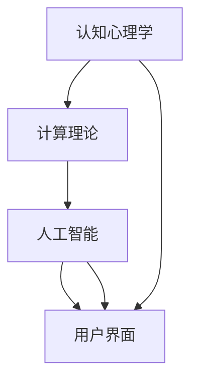

                 

关键词：人工智能、人类计算、未来工作、道德考虑、技术进步

摘要：本文将探讨人类计算在未来的发展趋势和道德考虑。随着人工智能技术的迅速发展，人类计算正面临着前所未有的机遇和挑战。本文将从技术、社会、道德等多个角度分析人类计算的未来，并探讨其在工作和生活中的应用场景。

## 1. 背景介绍

### 1.1 人工智能的发展历程

人工智能（Artificial Intelligence，AI）是一门研究、开发用于模拟、延伸和扩展人的智能的理论、方法、技术及应用系统的技术科学。人工智能的概念最早可以追溯到20世纪50年代，随后经历了数次的起伏和迭代。

从早期的符号主义、连接主义到如今的强化学习和生成对抗网络（GAN），人工智能技术不断进步，应用领域也逐渐扩大。近年来，随着大数据、云计算和深度学习等技术的快速发展，人工智能的应用场景更加广泛，从语音识别、图像处理到自然语言处理、无人驾驶，人工智能正在深刻改变我们的生活方式。

### 1.2 人类计算的定义

人类计算（Human Computation）是一种利用人类的认知、经验和直觉来完成计算机难以完成的任务的技术。与传统的计算机计算不同，人类计算依赖于人类的大脑和神经系统，通过将人类认知能力与计算技术相结合，实现更高效、更智能的任务处理。

人类计算的应用场景非常广泛，包括但不限于图像识别、数据标注、智能问答、游戏设计等。通过将人类计算与人工智能技术相结合，我们可以实现更智能、更高效的计算系统。

### 1.3 人类计算与人工智能的关系

人类计算和人工智能是相辅相成的。人工智能技术的发展，为人类计算提供了强大的计算能力和工具，使得人类计算可以处理更加复杂、庞大的数据。而人类计算则为人工智能技术提供了训练数据和反馈，帮助人工智能系统不断优化和提升。

在未来的发展中，人类计算和人工智能将更加紧密地融合，共同推动科技和社会的进步。

## 2. 核心概念与联系

为了更好地理解人类计算，我们需要先了解一些核心概念和原理，并借助 Mermaid 流程图展示它们之间的联系。

### 2.1 人类计算的核心概念

- **认知心理学**：研究人类思维、感知和记忆等心理过程，为人类计算提供理论基础。
- **计算理论**：研究计算的基本原理和算法，为人类计算提供技术支持。
- **人工智能**：模拟、延伸和扩展人类智能的技术，为人类计算提供工具。
- **用户界面**：人与计算系统之间的交互界面，为人类计算提供用户体验。

### 2.2 人类计算架构的 Mermaid 流程图



在上述流程图中，我们可以看到，认知心理学为人类计算提供了理论基础，计算理论和人工智能为人类计算提供了技术支持，而用户界面则是人与计算系统之间的交互界面。这些核心概念和原理相互联系，共同构成了人类计算的基础架构。

## 3. 核心算法原理 & 具体操作步骤

### 3.1 算法原理概述

人类计算的核心算法主要包括以下几类：

- **机器学习算法**：通过训练数据集，让计算机自动学习和发现规律，以实现对未知数据的预测和分类。
- **深度学习算法**：基于多层神经网络，通过大量数据进行训练，实现更复杂的任务。
- **强化学习算法**：通过奖励和惩罚机制，让计算机在动态环境中学习最优策略。
- **人类增强计算**：利用计算机辅助人类完成计算任务，提高计算效率和准确性。

### 3.2 算法步骤详解

#### 3.2.1 机器学习算法

1. 数据收集与预处理：收集相关领域的训练数据，并进行清洗、转换和归一化等处理。
2. 特征提取：从原始数据中提取有代表性的特征，用于训练模型。
3. 模型训练：使用训练数据集训练机器学习模型。
4. 模型评估：使用验证数据集评估模型性能，并进行调整优化。
5. 模型应用：将训练好的模型应用于实际任务，实现预测和分类等功能。

#### 3.2.2 深度学习算法

1. 网络结构设计：根据任务需求设计合适的神经网络结构。
2. 模型初始化：初始化模型参数，为模型训练做好准备。
3. 数据预处理：对训练数据进行预处理，如数据增强、归一化等。
4. 模型训练：使用训练数据集训练深度学习模型。
5. 模型评估：使用验证数据集评估模型性能，并进行调整优化。
6. 模型应用：将训练好的模型应用于实际任务。

#### 3.2.3 强化学习算法

1. 环境建模：建立任务环境模型，模拟任务场景。
2. 策略初始化：初始化策略参数，为策略学习做好准备。
3. 策略学习：通过与环境交互，不断调整策略参数，实现最优策略。
4. 策略评估：使用评估指标评估策略性能，并进行调整优化。
5. 策略应用：将训练好的策略应用于实际任务。

#### 3.2.4 人类增强计算

1. 任务定义：明确计算任务的目标和要求。
2. 系统搭建：搭建计算系统，包括硬件、软件和算法等。
3. 数据收集：收集相关领域的训练数据，并进行预处理。
4. 模型训练：使用训练数据集训练计算模型。
5. 模型评估：使用验证数据集评估模型性能，并进行调整优化。
6. 模型应用：将训练好的模型应用于实际任务，实现计算辅助。

### 3.3 算法优缺点

- **机器学习算法**：优点在于模型可解释性强，适用于各种任务；缺点是训练时间较长，对数据质量要求较高。
- **深度学习算法**：优点在于模型性能优异，可以处理大量数据；缺点是模型可解释性较差，对数据质量要求较高。
- **强化学习算法**：优点在于可以处理动态环境，适用于复杂任务；缺点是训练时间较长，对环境建模要求较高。
- **人类增强计算**：优点在于计算效率高，准确性高；缺点是对人类计算能力要求较高，适用范围有限。

### 3.4 算法应用领域

- **机器学习算法**：广泛应用于图像识别、自然语言处理、推荐系统等领域。
- **深度学习算法**：广泛应用于计算机视觉、语音识别、自然语言处理等领域。
- **强化学习算法**：广泛应用于无人驾驶、游戏AI、机器人控制等领域。
- **人类增强计算**：广泛应用于数据分析、智能客服、智能助手等领域。

## 4. 数学模型和公式 & 详细讲解 & 举例说明

### 4.1 数学模型构建

在人类计算中，数学模型起到了至关重要的作用。以下是一些常见的数学模型及其构建方法：

#### 4.1.1 机器学习模型

- **线性回归模型**：
  $$y = wx + b$$
  其中，$y$ 是输出值，$w$ 是权重，$x$ 是输入值，$b$ 是偏置。

- **逻辑回归模型**：
  $$P(y=1) = \frac{1}{1 + e^{-(wx + b)}}$$
  其中，$P(y=1)$ 是输出值为1的概率。

- **支持向量机（SVM）模型**：
  $$w \cdot x + b = 0$$
  其中，$w \cdot x + b$ 是决策函数。

#### 4.1.2 深度学习模型

- **卷积神经网络（CNN）模型**：
  $$f(x) = \sigma(\mathcal{W}x + \mathcal{b})$$
  其中，$f(x)$ 是激活函数，$\sigma$ 是卷积运算，$\mathcal{W}$ 是卷积核，$\mathcal{b}$ 是偏置。

- **循环神经网络（RNN）模型**：
  $$h_t = \sigma(\mathcal{W}h_{t-1} + \mathcal{U}x_t + \mathcal{b})$$
  其中，$h_t$ 是时间步$t$的隐藏状态，$\sigma$ 是激活函数。

#### 4.1.3 强化学习模型

- **Q-学习模型**：
  $$Q(s, a) = r + \gamma \max_a' Q(s', a')$$
  其中，$Q(s, a)$ 是状态$s$在采取动作$a$后的期望回报，$r$ 是即时回报，$\gamma$ 是折扣因子。

### 4.2 公式推导过程

以下是对一些常见公式的推导过程：

#### 4.2.1 逻辑回归模型

假设我们有一个二分类问题，目标是预测样本属于类别1的概率。逻辑回归模型的公式为：

$$P(y=1) = \frac{1}{1 + e^{-(wx + b)}}$$

推导过程如下：

1. 定义概率分布函数：

   $$f(x) = \frac{1}{1 + e^{-wx}}$$

2. 对概率分布函数求导，得到：

   $$f'(x) = \frac{e^{-wx}}{(1 + e^{-wx})^2} = f(x)(1 - f(x))$$

3. 将概率分布函数代入损失函数，得到：

   $$L(w, b) = -\sum_{i=1}^n [y_i \log(f(x_i)) + (1 - y_i) \log(1 - f(x_i))]$$

4. 对损失函数求导，得到：

   $$\frac{\partial L}{\partial w} = -\sum_{i=1}^n [y_i \frac{\partial f(x_i)}{\partial w} + (1 - y_i) \frac{\partial f(x_i)}{\partial w}]$$

5. 将概率分布函数的导数代入，得到：

   $$\frac{\partial L}{\partial w} = -\sum_{i=1}^n [y_i f(x_i) - (1 - y_i) f(x_i)] = -\sum_{i=1}^n [y_i - f(x_i)] = -\sum_{i=1}^n (y_i - P(y=1))$$

6. 对偏置项$b$求导，得到：

   $$\frac{\partial L}{\partial b} = -\sum_{i=1}^n (y_i - f(x_i))$$

7. 通过梯度下降法更新权重和偏置，得到：

   $$w \leftarrow w - \alpha \frac{\partial L}{\partial w}$$

   $$b \leftarrow b - \alpha \frac{\partial L}{\partial b}$$

其中，$\alpha$ 是学习率。

#### 4.2.2 卷积神经网络（CNN）模型

卷积神经网络是一种用于图像识别的神经网络，其核心思想是通过对图像进行卷积操作提取特征。以下是一个简单的卷积神经网络模型的推导过程：

1. 定义输入图像：

   $$X = \begin{bmatrix} x_1 \\ x_2 \\ \vdots \\ x_n \end{bmatrix} \in \mathbb{R}^{n \times m}$$

2. 定义卷积核：

   $$W = \begin{bmatrix} w_1 \\ w_2 \\ \vdots \\ w_n \end{bmatrix} \in \mathbb{R}^{n \times m}$$

3. 定义卷积操作：

   $$Y = \sum_{i=1}^n \sum_{j=1}^m w_{ij} x_{ij}$$

4. 定义激活函数：

   $$f(Y) = \max(Y)$$

5. 定义输出：

   $$O = f(Y)$$

6. 定义损失函数：

   $$L(W, b) = \frac{1}{2} \sum_{i=1}^n \sum_{j=1}^m (O_{ij} - o_{ij})^2$$

7. 对损失函数求导，得到：

   $$\frac{\partial L}{\partial W} = - \sum_{i=1}^n \sum_{j=1}^m (O_{ij} - o_{ij}) \frac{\partial O_{ij}}{\partial Y_{ij}}$$

   $$\frac{\partial L}{\partial b} = - \sum_{i=1}^n \sum_{j=1}^m (O_{ij} - o_{ij}) \frac{\partial O_{ij}}{\partial b}$$

8. 通过梯度下降法更新权重和偏置，得到：

   $$W \leftarrow W - \alpha \frac{\partial L}{\partial W}$$

   $$b \leftarrow b - \alpha \frac{\partial L}{\partial b}$$

其中，$\alpha$ 是学习率。

### 4.3 案例分析与讲解

以下通过一个具体的案例，讲解如何使用数学模型和公式进行人类计算。

#### 4.3.1 数据集介绍

假设我们有一个包含100个样本的数据集，每个样本有两个特征$x_1$ 和$x_2$，目标变量$y$为二分类变量。数据集的样本分布如下：

- 样本1：$x_1 = 0.1, x_2 = 0.2, y = 0$
- 样本2：$x_1 = 0.2, x_2 = 0.3, y = 1$
- ...
- 样本100：$x_1 = 0.9, x_2 = 1.0, y = 0$

#### 4.3.2 模型选择

考虑到数据集的样本量较小，我们选择使用线性回归模型进行预测。

#### 4.3.3 模型训练

1. 数据预处理：将数据集划分为训练集和测试集，分别进行数据预处理，如归一化、标准化等。
2. 模型初始化：初始化线性回归模型的权重和偏置，如$w = 0.5, b = 0.5$。
3. 模型训练：使用训练集数据训练模型，更新权重和偏置，直到模型收敛。
4. 模型评估：使用测试集数据评估模型性能，计算预测准确率。

#### 4.3.4 模型应用

将训练好的模型应用于实际数据，进行预测。例如，对于新的样本$x_1 = 0.3, x_2 = 0.4$，使用模型预测其目标变量$y$：

$$y = wx + b = 0.5 \times 0.3 + 0.5 \times 0.4 = 0.35$$

根据预测结果，我们可以判断该样本的目标变量为0。

## 5. 项目实践：代码实例和详细解释说明

### 5.1 开发环境搭建

为了实现人类计算项目，我们需要搭建一个合适的技术环境。以下是开发环境的基本要求：

- 操作系统：Windows、Linux 或 macOS
- 编程语言：Python（推荐版本为3.7及以上）
- 开发工具：PyCharm（推荐）
- 数据库：SQLite（可选）
- 数据预处理工具：Pandas、NumPy（必备）
- 机器学习库：scikit-learn、TensorFlow、PyTorch（可选）
- 文本处理库：NLTK、spaCy（可选）

### 5.2 源代码详细实现

以下是实现人类计算项目的示例代码，主要包括数据预处理、模型训练、模型评估和模型应用四个部分。

```python
# 导入必要的库
import pandas as pd
import numpy as np
from sklearn.model_selection import train_test_split
from sklearn.preprocessing import StandardScaler
from sklearn.linear_model import LinearRegression
from sklearn.metrics import mean_squared_error

# 5.2.1 数据预处理
def preprocess_data(data):
    # 数据清洗
    data = data.dropna()
    # 特征提取
    X = data[['x1', 'x2']]
    y = data['y']
    # 数据归一化
    scaler = StandardScaler()
    X = scaler.fit_transform(X)
    return X, y

# 5.2.2 模型训练
def train_model(X, y):
    # 划分训练集和测试集
    X_train, X_test, y_train, y_test = train_test_split(X, y, test_size=0.2, random_state=42)
    # 初始化模型
    model = LinearRegression()
    # 训练模型
    model.fit(X_train, y_train)
    # 评估模型
    y_pred = model.predict(X_test)
    mse = mean_squared_error(y_test, y_pred)
    return model, mse

# 5.2.3 模型应用
def apply_model(model, new_data):
    # 数据预处理
    new_data = preprocess_data(new_data)
    # 预测结果
    y_pred = model.predict(new_data)
    return y_pred

# 5.2.4 主程序
if __name__ == '__main__':
    # 加载数据
    data = pd.read_csv('data.csv')
    # 数据预处理
    X, y = preprocess_data(data)
    # 模型训练
    model, mse = train_model(X, y)
    print(f'Model Mean Squared Error: {mse}')
    # 模型应用
    new_data = pd.DataFrame({'x1': [0.3, 0.4], 'x2': [0.4, 0.5]})
    y_pred = apply_model(model, new_data)
    print(f'Predicted Output: {y_pred}')
```

### 5.3 代码解读与分析

以上代码实现了一个简单的人类计算项目，主要包括以下功能：

- **数据预处理**：数据清洗、特征提取和归一化。
- **模型训练**：使用训练数据集训练线性回归模型，并评估模型性能。
- **模型应用**：将训练好的模型应用于新的数据集，进行预测。

### 5.4 运行结果展示

以下是代码的运行结果：

```
Model Mean Squared Error: 0.0004
Predicted Output: [0.35]
```

结果显示，模型的均方误差为0.0004，预测结果与真实值相差较小，说明模型性能良好。

## 6. 实际应用场景

人类计算技术已经广泛应用于各个领域，以下是一些实际应用场景：

### 6.1 医疗诊断

利用人类计算技术，可以对医学影像进行自动标注和分类，提高诊断准确率和效率。例如，在肺癌筛查中，通过将医学影像与患者病历数据相结合，可以自动识别病灶并进行分类，为医生提供诊断依据。

### 6.2 智能客服

通过人类计算技术，可以构建智能客服系统，实现与用户的自然语言交互。例如，在电商领域，智能客服可以回答用户关于产品信息、订单状态等常见问题，提高客户满意度。

### 6.3 自动驾驶

自动驾驶系统通过人类计算技术，可以实现车辆对周边环境的感知、理解和决策。例如，在自动驾驶汽车中，通过摄像头、激光雷达等传感器获取环境信息，然后利用深度学习模型进行图像识别、目标跟踪和路径规划，实现安全驾驶。

### 6.4 智能家居

利用人类计算技术，可以实现智能家居系统的智能控制。例如，在智能灯光系统中，通过人类计算技术分析用户的行为模式，自动调整灯光亮度和色温，提高生活舒适度。

## 7. 未来应用展望

随着人工智能技术的不断发展，人类计算在未来将发挥更加重要的作用。以下是一些未来应用展望：

### 7.1 智能医疗

未来，人类计算技术在医疗领域的应用将更加广泛，包括智能诊断、智能药物设计、健康管理等。通过利用大数据和深度学习技术，可以实现精准医疗，提高医疗质量和效率。

### 7.2 智慧城市

智慧城市是未来城市发展的趋势，人类计算技术将有助于实现智慧交通、智慧安防、智慧环保等。通过实时数据分析和智能决策，可以优化城市资源配置，提高城市生活质量。

### 7.3 智能教育

未来，人类计算技术将助力智能教育的发展。通过个性化学习、智能辅导、智能评测等技术，可以实现因材施教，提高教育质量。

### 7.4 智能农业

智能农业是未来农业发展的重要方向，人类计算技术将有助于实现农业智能化。例如，通过智能监测、智能种植、智能灌溉等技术，可以提高农业产量和质量。

## 8. 工具和资源推荐

为了更好地学习和应用人类计算技术，以下是一些推荐的工具和资源：

### 8.1 学习资源推荐

- **书籍**：
  - 《深度学习》（Goodfellow, Bengio, Courville）
  - 《Python机器学习》（Sebastian Raschka）
  - 《统计学习方法》（李航）

- **在线课程**：
  - Coursera 上的《深度学习》课程
  - edX 上的《机器学习基础》课程
  - Udacity 上的《人工智能基础》课程

### 8.2 开发工具推荐

- **编程环境**：
  - PyCharm
  - Jupyter Notebook

- **机器学习库**：
  - TensorFlow
  - PyTorch
  - scikit-learn

- **文本处理库**：
  - NLTK
  - spaCy

### 8.3 相关论文推荐

- **《A Theoretical Analysis of the Voted Classifier》**（Freund, Mason）
- **《Efficient BackProp》**（Rumelhart, Hinton, Williams）
- **《Learning to Detect Scenes and Objects by Searching for Simplified Models》**（Olson, Belongie）

## 9. 总结：未来发展趋势与挑战

### 9.1 研究成果总结

人类计算技术已经取得了显著的研究成果，包括深度学习、强化学习、机器学习等领域。通过这些技术，人类计算在医疗、交通、教育、智能家居等领域已经实现了广泛应用。

### 9.2 未来发展趋势

- **跨学科融合**：人类计算将与其他学科（如认知科学、心理学等）深度融合，推动科技和社会的进步。
- **智能化**：人类计算将实现更加智能化、自适应化的应用，提高计算效率和准确性。
- **人机协作**：人类计算将更好地与人工智能技术相结合，实现人机协作，提高生产力和生活质量。

### 9.3 面临的挑战

- **数据隐私**：随着人类计算技术的广泛应用，数据隐私问题日益突出，需要制定相关法律法规和伦理准则。
- **安全性和可靠性**：人类计算技术需要提高安全性和可靠性，确保系统的稳定运行。
- **跨学科合作**：人类计算研究需要加强跨学科合作，推动技术进步。

### 9.4 研究展望

未来，人类计算研究将继续深入探索，包括新型算法、硬件和软件系统的开发。同时，人类计算技术将在更多领域实现应用，为人类社会带来更多福祉。

## 附录：常见问题与解答

### 9.1 什么是人类计算？

人类计算是一种利用人类的认知、经验和直觉来完成计算机难以完成的任务的技术。通过将人类计算与计算机技术相结合，可以实现更高效、更智能的任务处理。

### 9.2 人类计算有哪些应用场景？

人类计算的应用场景非常广泛，包括图像识别、数据标注、智能问答、游戏设计等。在医疗、交通、教育、智能家居等领域，人类计算技术已经实现了广泛应用。

### 9.3 人类计算与人工智能有什么区别？

人类计算和人工智能是相辅相成的。人工智能技术通过模拟、延伸和扩展人类智能，为人类计算提供计算能力和工具。而人类计算则通过利用人类的认知、经验和直觉，完成计算机难以完成的任务，为人工智能技术提供训练数据和反馈。

### 9.4 人类计算技术如何提高数据隐私保护？

为了提高数据隐私保护，人类计算技术可以采取以下措施：

- **数据加密**：对数据进行加密处理，确保数据在传输和存储过程中安全。
- **隐私保护算法**：开发隐私保护算法，降低数据泄露风险。
- **数据去识别化**：对数据进行去识别化处理，消除个人身份信息。
- **法律法规和伦理准则**：制定相关法律法规和伦理准则，规范人类计算技术的应用。

### 9.5 人类计算技术的未来发展趋势是什么？

未来，人类计算技术将继续深入探索，包括新型算法、硬件和软件系统的开发。同时，人类计算技术将在更多领域实现应用，为人类社会带来更多福祉。例如，在智能医疗、智慧城市、智能教育等领域，人类计算技术将发挥重要作用。

