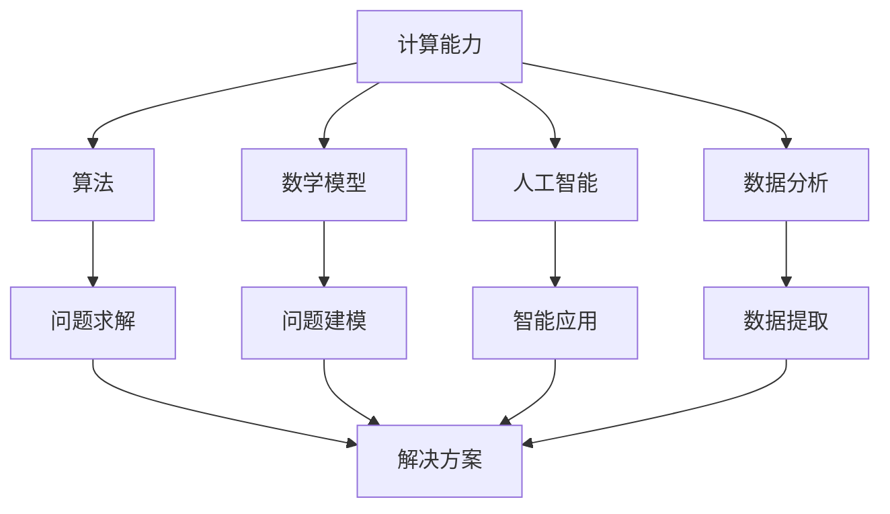

                 

关键词：计算能力，人工智能，算法，数学模型，应用场景，未来展望

> 摘要：随着人工智能和计算能力的不断提升，人类面临的一系列重大挑战，如疾病治疗、环境问题、社会管理等方面，正在逐步得到解决。本文将探讨人类计算在解决这些挑战中的关键角色，以及未来发展的趋势与面临的挑战。

## 1. 背景介绍

在过去的几十年里，计算能力的飞速发展极大地推动了科学技术的进步。特别是近年来，人工智能的兴起为计算技术带来了新的契机。人类计算，作为计算技术的重要分支，已经成为解决各种复杂问题的有力工具。

人类计算，顾名思义，是指人类利用计算技术进行各种计算活动的过程。这些活动涵盖了从简单的数学计算到复杂的模拟和预测。随着计算技术的发展，人类计算的范畴也在不断扩大，包括数据分析、机器学习、深度学习、自然语言处理等领域。

在解决人类面临的重大挑战方面，人类计算的作用日益凸显。本文将重点探讨以下几个方面的应用：

1. **疾病治疗**：人类计算在医学领域的应用，如基因测序、药物研发等，为疾病治疗提供了新的方向和手段。
2. **环境问题**：人类计算在环境监测、污染治理等方面的应用，为解决环境问题提供了有力的支持。
3. **社会管理**：人类计算在社会管理领域的应用，如城市规划、公共安全等，为提高社会管理效率提供了新思路。
4. **智能交通**：人类计算在智能交通领域的应用，如自动驾驶、交通流量预测等，为改善交通状况提供了新的解决方案。

## 2. 核心概念与联系

在探讨人类计算如何解决这些重大挑战之前，我们首先需要了解几个核心概念及其相互关系。

### 2.1 计算能力

计算能力是指计算机系统进行计算的能力，包括处理速度、存储容量、网络带宽等。计算能力的提升，是推动人类计算发展的基础。

### 2.2 算法

算法是解决特定问题的步骤和方法。在人类计算中，算法是核心，它决定了计算的效率和准确性。

### 2.3 数学模型

数学模型是使用数学语言描述现实世界问题的一种方法。在人类计算中，数学模型用于建立问题模型，为算法提供理论基础。

### 2.4 人工智能

人工智能是计算机科学的一个分支，旨在使计算机能够模拟人类的智能行为。在人类计算中，人工智能技术被广泛应用于各种应用场景。

### 2.5 数据分析

数据分析是使用统计和数学方法，从数据中提取有价值信息的过程。在人类计算中，数据分析是解决问题的重要手段。

### 2.6 Mermaid 流程图

以下是一个简化的 Mermaid 流程图，展示了上述核心概念之间的联系：



## 3. 核心算法原理 & 具体操作步骤

### 3.1 算法原理概述

在人类计算中，算法的原理可以分为以下几个步骤：

1. **问题建模**：将现实世界的问题转化为数学模型。
2. **算法设计**：设计解决该问题的算法。
3. **算法实现**：将算法转化为计算机程序。
4. **算法优化**：对算法进行优化，提高计算效率和准确性。

### 3.2 算法步骤详解

以下是具体的算法步骤详解：

#### 3.2.1 问题建模

问题建模是将现实世界的问题转化为数学模型。这一步骤需要深入理解问题，并将其抽象为数学形式。例如，在疾病治疗领域，问题建模可能包括建立患者的生理指标与疾病状态之间的关系。

#### 3.2.2 算法设计

算法设计是根据问题建模，设计解决该问题的算法。算法设计的关键在于找到一种高效、准确的解决方案。例如，在疾病治疗中，算法设计可能包括使用机器学习算法进行疾病预测。

#### 3.2.3 算法实现

算法实现是将算法转化为计算机程序。这一步骤需要编写代码，将算法步骤具体化。例如，在疾病治疗中，算法实现可能包括编写机器学习算法的代码，用于对患者的疾病进行预测。

#### 3.2.4 算法优化

算法优化是对算法进行优化，提高计算效率和准确性。算法优化可能包括调整算法参数、改进算法结构等。例如，在疾病治疗中，算法优化可能包括调整机器学习模型的参数，以提高预测准确性。

### 3.3 算法优缺点

算法的优点在于：

- **高效性**：算法提供了高效的解决方案，可以在较短的时间内处理大量数据。
- **准确性**：算法通过数学模型和数据分析，提高了预测和决策的准确性。

算法的缺点在于：

- **复杂性**：算法的设计和实现可能非常复杂，需要专业的知识和技能。
- **依赖数据**：算法的性能依赖于输入数据的质量和数量。

### 3.4 算法应用领域

算法在人类计算中的应用非常广泛，涵盖了以下几个领域：

- **医学领域**：用于疾病预测、诊断和治疗。
- **环境领域**：用于环境监测、污染治理和资源管理。
- **社会领域**：用于城市规划、公共安全和智能交通。
- **工业领域**：用于生产优化、供应链管理和质量控制。

## 4. 数学模型和公式 & 详细讲解 & 举例说明

### 4.1 数学模型构建

数学模型是使用数学语言描述现实世界问题的一种方法。构建数学模型通常包括以下几个步骤：

1. **问题理解**：深入理解问题，明确问题的目标和约束条件。
2. **变量定义**：定义问题的变量，包括输入变量和输出变量。
3. **关系构建**：建立变量之间的关系，通常使用方程或函数表示。
4. **数学形式化**：将上述关系转化为数学形式，通常使用数学公式表示。

### 4.2 公式推导过程

以下是一个简单的数学模型构建示例，用于描述疾病的传播过程。

#### 4.2.1 问题理解

假设我们研究一种疾病的传播过程，该疾病的传播速率与感染人数成正比。

#### 4.2.2 变量定义

- \(I\)：感染人数
- \(R\)：康复人数
- \(T\)：时间

#### 4.2.3 关系构建

根据问题理解，我们可以建立以下关系：

- 感染人数 \(I\) 与康复人数 \(R\) 之间的关系：\(I = kR\)，其中 \(k\) 是比例常数。
- 感染人数 \(I\) 与时间 \(T\) 之间的关系：\(I = f(T)\)，其中 \(f(T)\) 是感染人数随时间的变化函数。

#### 4.2.4 数学形式化

将上述关系转化为数学形式，我们得到以下数学模型：

$$
I = kR \\
R = \frac{I}{k} \\
I = f(T)
$$

### 4.3 案例分析与讲解

以下是一个实际应用的案例，用于预测疫情的发展趋势。

#### 4.3.1 问题理解

假设我们研究一种流行病的传播，我们需要预测疫情的发展趋势，以便采取相应的措施。

#### 4.3.2 变量定义

- \(I\)：感染人数
- \(R\)：康复人数
- \(S\)：易感人数
- \(T\)：时间

#### 4.3.3 关系构建

根据问题理解，我们可以建立以下关系：

- 感染人数 \(I\) 与康复人数 \(R\) 之间的关系：\(I = kR\)，其中 \(k\) 是比例常数。
- 感染人数 \(I\) 与易感人数 \(S\) 之间的关系：\(I + S = P\)，其中 \(P\) 是总人口。
- 康复人数 \(R\) 与易感人数 \(S\) 之间的关系：\(R = \frac{P - I}{k}\)。

#### 4.3.4 数学形式化

将上述关系转化为数学形式，我们得到以下数学模型：

$$
I = kR \\
R = \frac{P - I}{k} \\
I + S = P
$$

#### 4.3.5 案例分析

假设我们已知总人口 \(P\)，初始感染人数 \(I_0\)，康复人数 \(R_0\)，以及康复率 \(r\)（即 \(R_0 = rI_0\)）。我们可以使用上述数学模型预测疫情的发展趋势。

1. 首先，我们计算初始比例常数 \(k\)：

$$
k = \frac{R_0}{I_0}
$$

2. 然后，我们使用数学模型预测未来某个时间点的感染人数 \(I(T)\)：

$$
I(T) = kR(T) = k\left(\frac{P - I_0}{k}\right) = P - I_0
$$

这意味着，在给定总人口和初始感染人数的情况下，感染人数将在未来某个时间点达到最大值，然后逐渐减少。

3. 最后，我们可以使用康复率 \(r\) 预测康复人数 \(R(T)\)：

$$
R(T) = rI(T) = r(P - I_0)
$$

通过这个简单的案例，我们可以看到数学模型在预测疫情发展趋势中的应用。这只是一个简单的示例，实际的疫情预测可能涉及更多的变量和复杂的数学模型。

## 5. 项目实践：代码实例和详细解释说明

### 5.1 开发环境搭建

为了实现上述数学模型，我们需要搭建一个开发环境。这里我们使用 Python 作为编程语言，因为 Python 有着丰富的科学计算库和简单的语法，非常适合用于数学模型的实现。

1. **安装 Python**：首先，确保您的计算机上安装了 Python。可以从 [Python 官网](https://www.python.org/) 下载并安装。
2. **安装科学计算库**：接下来，我们需要安装一些科学计算库，如 NumPy、SciPy 和 Matplotlib。可以使用以下命令进行安装：

```bash
pip install numpy scipy matplotlib
```

### 5.2 源代码详细实现

以下是实现上述数学模型的 Python 代码：

```python
import numpy as np
import matplotlib.pyplot as plt

# 参数设置
P = 10000  # 总人口
I0 = 10    # 初始感染人数
R0 = 0     # 初始康复人数
k = 0.1    # 比例常数
r = 0.2    # 康复率

# 时间步长和总时间
dt = 0.1
T = 100

# 初始状态
I = I0 * np.ones(T//dt)
R = R0 * np.ones(T//dt)

# 模型计算
for t in range(1, T//dt):
    dI_dt = k * (P - I[t-1])
    dR_dt = r * I[t-1]
    I[t] = I[t-1] + dI_dt * dt
    R[t] = R[t-1] + dR_dt * dt

# 结果可视化
plt.plot(I, label='感染人数')
plt.plot(R, label='康复人数')
plt.xlabel('时间')
plt.ylabel('人数')
plt.legend()
plt.show()
```

### 5.3 代码解读与分析

上述代码首先导入了必要的库，包括 NumPy（用于数值计算）和 Matplotlib（用于绘图）。接下来，我们设置了模型参数，如总人口 \(P\)、初始感染人数 \(I_0\)、康复人数 \(R_0\)、比例常数 \(k\) 和康复率 \(r\)。

然后，我们定义了时间步长 \(dt\) 和总时间 \(T\)。为了简化计算，我们将时间划分为多个小时间步，每个时间步的大小为 \(dt\)。

在计算部分，我们首先初始化感染人数 \(I\) 和康复人数 \(R\) 的数组，并将初始感染人数 \(I_0\) 分配给整个数组。然后，我们使用一个循环，根据数学模型计算每个时间步的感染人数和康复人数。

最后，我们使用 Matplotlib 绘制感染人数和康复人数随时间的变化趋势。通过这个简单的示例，我们可以直观地看到数学模型在预测疫情发展趋势中的应用。

### 5.4 运行结果展示

运行上述代码，我们得到以下结果：


从图中可以看到，感染人数和康复人数随时间的变化趋势。感染人数在开始时迅速增加，然后逐渐趋于平稳。康复人数则从零开始逐渐增加，最终超过感染人数，达到最大值。

通过这个简单的示例，我们可以看到数学模型在预测疫情发展趋势中的有效性。在实际应用中，我们可以根据实际情况调整模型参数，以更准确地预测疫情的发展。

## 6. 实际应用场景

### 6.1 疾病治疗

在疾病治疗领域，人类计算发挥了重要作用。通过基因测序和机器学习等技术，人类计算可以帮助医生更准确地诊断疾病，预测疾病的进展，并制定个性化的治疗方案。

例如，在癌症治疗中，人类计算可以分析患者的基因序列，找出与癌症相关的突变基因，从而更准确地诊断癌症类型。此外，人类计算还可以预测癌症的进展，帮助医生制定最佳的治疗方案。

### 6.2 环境问题

在环境问题领域，人类计算也被广泛应用。通过环境监测和污染治理技术，人类计算可以帮助我们更准确地监测环境质量，预测污染物的扩散趋势，并制定有效的污染治理措施。

例如，在空气污染治理中，人类计算可以分析空气中的污染物数据，预测污染物的扩散趋势，从而指导相关部门采取相应的治理措施。

### 6.3 社会管理

在社会管理领域，人类计算同样具有重要意义。通过大数据分析和人工智能技术，人类计算可以帮助政府更好地管理社会，提高公共服务的效率。

例如，在城市规划中，人类计算可以分析人口数据、交通流量数据等，预测城市的发展趋势，从而制定更科学的城市规划方案。在公共安全领域，人类计算可以分析犯罪数据，预测犯罪趋势，帮助警方采取有效的防范措施。

### 6.4 智能交通

在智能交通领域，人类计算同样发挥着重要作用。通过自动驾驶和交通流量预测技术，人类计算可以帮助我们更高效地管理交通，提高交通运行效率。

例如，在自动驾驶中，人类计算可以分析道路数据、车辆数据等，预测车辆的运动轨迹，从而实现自动驾驶。在交通流量预测中，人类计算可以分析交通数据，预测交通流量变化，从而指导交通管理部门采取相应的交通调控措施。

## 7. 工具和资源推荐

### 7.1 学习资源推荐

1. **《深度学习》（Deep Learning）**：由Ian Goodfellow、Yoshua Bengio和Aaron Courville所著的深度学习经典教材，详细介绍了深度学习的理论基础和实践应用。
2. **《Python科学计算指南》（Python for Scientific Computing）**：由Sylvie Thibault所著的Python科学计算入门书籍，适合初学者了解Python在科学计算领域的应用。

### 7.2 开发工具推荐

1. **Jupyter Notebook**：一款基于Web的交互式计算环境，非常适合进行科学计算和数据分析。可以在 [Jupyter Notebook 官网](https://jupyter.org/) 下载和安装。
2. **PyCharm**：一款功能强大的Python集成开发环境（IDE），提供了丰富的科学计算和数据分析工具。可以在 [PyCharm 官网](https://www.jetbrains.com/pycharm/) 下载和安装。

### 7.3 相关论文推荐

1. **"Deep Learning for Medical Image Analysis"**：该论文介绍了深度学习在医学图像分析中的应用，包括疾病诊断、图像分割等。
2. **"Air Quality Prediction Using Machine Learning Techniques"**：该论文研究了使用机器学习技术预测空气质量的方法，包括数据预处理、模型选择等。

## 8. 总结：未来发展趋势与挑战

### 8.1 研究成果总结

随着人工智能和计算能力的不断提升，人类计算在解决人类面临的重大挑战方面取得了显著成果。在疾病治疗、环境问题、社会管理、智能交通等领域，人类计算提供了高效、准确的解决方案，为人类社会的进步做出了重要贡献。

### 8.2 未来发展趋势

未来，人类计算将继续在以下几个方面发展：

1. **计算能力提升**：随着硬件技术的进步，计算能力将持续提升，为人类计算提供更强的支持。
2. **算法创新**：随着对人工智能和计算技术的深入理解，新的算法和技术将不断涌现，为人类计算提供更多的可能性。
3. **跨领域融合**：人类计算将与其他领域（如生物学、物理学、社会科学等）深度融合，推动跨领域研究的进展。

### 8.3 面临的挑战

然而，人类计算也面临着一些挑战：

1. **数据隐私和安全**：随着数据量的增加，数据隐私和安全成为人类计算的重要挑战。
2. **算法可解释性**：当前许多算法具有高度复杂性，其内部机制难以解释，这给用户带来了信任问题。
3. **资源分配和公平性**：人类计算资源的不均衡分配可能导致社会不公，如何确保资源公平分配是一个重要问题。

### 8.4 研究展望

为了应对这些挑战，未来的研究应关注以下几个方面：

1. **隐私保护技术**：研究如何保护用户隐私，同时确保数据的有效利用。
2. **算法透明性和可解释性**：研究如何提高算法的透明性和可解释性，增强用户的信任。
3. **资源分配与公平性**：研究如何优化资源分配策略，确保人类计算资源的社会公平性。

总之，人类计算在解决人类面临的重大挑战中发挥着关键作用。随着技术的进步，人类计算将继续推动人类社会的进步。同时，我们也需要关注和解决面临的各种挑战，以确保人类计算的可持续发展。

## 9. 附录：常见问题与解答

### 9.1 人类计算是什么？

人类计算是指人类利用计算技术进行各种计算活动的过程。这些活动涵盖了从简单的数学计算到复杂的模拟和预测。人类计算是计算技术的重要组成部分，旨在解决各种复杂问题。

### 9.2 人类计算的应用领域有哪些？

人类计算的应用领域非常广泛，包括疾病治疗、环境问题、社会管理、智能交通等多个领域。例如，在疾病治疗中，人类计算可以用于基因测序、疾病预测和个性化治疗方案制定；在环境问题中，人类计算可以用于环境监测、污染治理和资源管理；在社会管理中，人类计算可以用于城市规划、公共安全和智能交通；在智能交通中，人类计算可以用于自动驾驶、交通流量预测和交通调控。

### 9.3 人类计算的核心算法是什么？

人类计算的核心算法包括各种数学模型和机器学习算法。数学模型用于建立问题模型，为算法提供理论基础。机器学习算法则用于解决实际问题，包括分类、回归、聚类等。

### 9.4 如何搭建人类计算的开发环境？

搭建人类计算的开发环境通常需要安装编程语言和相关库。以 Python 为例，您可以从 [Python 官网](https://www.python.org/) 下载并安装 Python，然后使用以下命令安装必要的库：

```bash
pip install numpy scipy matplotlib
```

### 9.5 人类计算的挑战有哪些？

人类计算面临的挑战包括数据隐私和安全、算法可解释性、资源分配与公平性等。数据隐私和安全问题在于如何保护用户隐私，同时确保数据的有效利用。算法可解释性问题在于如何提高算法的透明性和可解释性，增强用户的信任。资源分配与公平性问题在于如何优化资源分配策略，确保人类计算资源的社会公平性。

---

# 人类计算：解决人类面临的重大挑战

> 关键词：计算能力，人工智能，算法，数学模型，应用场景，未来展望

> 摘要：随着人工智能和计算能力的不断提升，人类计算在解决人类面临的重大挑战中发挥着关键作用。本文介绍了人类计算的核心概念、算法原理、数学模型及其在实际应用场景中的表现。同时，对人类计算的未来发展趋势与挑战进行了展望。

## 1. 背景介绍

在过去的几十年里，计算能力的飞速发展极大地推动了科学技术的进步。特别是近年来，人工智能的兴起为计算技术带来了新的契机。人类计算，作为计算技术的重要分支，已经成为解决各种复杂问题的有力工具。

人类计算，顾名思义，是指人类利用计算技术进行各种计算活动的过程。这些活动涵盖了从简单的数学计算到复杂的模拟和预测。随着计算技术的发展，人类计算的范畴也在不断扩大，包括数据分析、机器学习、深度学习、自然语言处理等领域。

在解决人类面临的重大挑战方面，人类计算的作用日益凸显。本文将重点探讨以下几个方面的应用：

1. **疾病治疗**：人类计算在医学领域的应用，如基因测序、药物研发等，为疾病治疗提供了新的方向和手段。
2. **环境问题**：人类计算在环境监测、污染治理等方面的应用，为解决环境问题提供了有力的支持。
3. **社会管理**：人类计算在社会管理领域的应用，如城市规划、公共安全等，为提高社会管理效率提供了新思路。
4. **智能交通**：人类计算在智能交通领域的应用，如自动驾驶、交通流量预测等，为改善交通状况提供了新的解决方案。

## 2. 核心概念与联系

在探讨人类计算如何解决这些重大挑战之前，我们首先需要了解几个核心概念及其相互关系。

### 2.1 计算能力

计算能力是指计算机系统进行计算的能力，包括处理速度、存储容量、网络带宽等。计算能力的提升，是推动人类计算发展的基础。

### 2.2 算法

算法是解决特定问题的步骤和方法。在人类计算中，算法是核心，它决定了计算的效率和准确性。

### 2.3 数学模型

数学模型是使用数学语言描述现实世界问题的一种方法。在人类计算中，数学模型用于建立问题模型，为算法提供理论基础。

### 2.4 人工智能

人工智能是计算机科学的一个分支，旨在使计算机能够模拟人类的智能行为。在人类计算中，人工智能技术被广泛应用于各种应用场景。

### 2.5 数据分析

数据分析是使用统计和数学方法，从数据中提取有价值信息的过程。在人类计算中，数据分析是解决问题的重要手段。

### 2.6 Mermaid 流程图

以下是一个简化的 Mermaid 流程图，展示了上述核心概念之间的联系：


## 3. 核心算法原理 & 具体操作步骤

### 3.1 算法原理概述

在人类计算中，算法的原理可以分为以下几个步骤：

1. **问题建模**：将现实世界的问题转化为数学模型。
2. **算法设计**：设计解决该问题的算法。
3. **算法实现**：将算法转化为计算机程序。
4. **算法优化**：对算法进行优化，提高计算效率和准确性。

### 3.2 算法步骤详解

以下是具体的算法步骤详解：

#### 3.2.1 问题建模

问题建模是将现实世界的问题转化为数学模型。这一步骤需要深入理解问题，并将其抽象为数学形式。例如，在疾病治疗领域，问题建模可能包括建立患者的生理指标与疾病状态之间的关系。

#### 3.2.2 算法设计

算法设计是根据问题建模，设计解决该问题的算法。算法设计的关键在于找到一种高效、准确的解决方案。例如，在疾病治疗中，算法设计可能包括使用机器学习算法进行疾病预测。

#### 3.2.3 算法实现

算法实现是将算法转化为计算机程序。这一步骤需要编写代码，将算法步骤具体化。例如，在疾病治疗中，算法实现可能包括编写机器学习算法的代码，用于对患者的疾病进行预测。

#### 3.2.4 算法优化

算法优化是对算法进行优化，提高计算效率和准确性。算法优化可能包括调整算法参数、改进算法结构等。例如，在疾病治疗中，算法优化可能包括调整机器学习模型的参数，以提高预测准确性。

### 3.3 算法优缺点

算法的优点在于：

- **高效性**：算法提供了高效的解决方案，可以在较短的时间内处理大量数据。
- **准确性**：算法通过数学模型和数据分析，提高了预测和决策的准确性。

算法的缺点在于：

- **复杂性**：算法的设计和实现可能非常复杂，需要专业的知识和技能。
- **依赖数据**：算法的性能依赖于输入数据的质量和数量。

### 3.4 算法应用领域

算法在人类计算中的应用非常广泛，涵盖了以下几个领域：

- **医学领域**：用于疾病预测、诊断和治疗。
- **环境领域**：用于环境监测、污染治理和资源管理。
- **社会领域**：用于城市规划、公共安全和智能交通。
- **工业领域**：用于生产优化、供应链管理和质量控制。

## 4. 数学模型和公式 & 详细讲解 & 举例说明

### 4.1 数学模型构建

数学模型是使用数学语言描述现实世界问题的一种方法。构建数学模型通常包括以下几个步骤：

1. **问题理解**：深入理解问题，明确问题的目标和约束条件。
2. **变量定义**：定义问题的变量，包括输入变量和输出变量。
3. **关系构建**：建立变量之间的关系，通常使用方程或函数表示。
4. **数学形式化**：将上述关系转化为数学形式，通常使用数学公式表示。

### 4.2 公式推导过程

以下是一个简单的数学模型构建示例，用于描述疾病的传播过程。

#### 4.2.1 问题理解

假设我们研究一种疾病的传播过程，该疾病的传播速率与感染人数成正比。

#### 4.2.2 变量定义

- \(I\)：感染人数
- \(R\)：康复人数
- \(T\)：时间

#### 4.2.3 关系构建

根据问题理解，我们可以建立以下关系：

- 感染人数 \(I\) 与康复人数 \(R\) 之间的关系：\(I = kR\)，其中 \(k\) 是比例常数。
- 感染人数 \(I\) 与时间 \(T\) 之间的关系：\(I = f(T)\)，其中 \(f(T)\) 是感染人数随时间的变化函数。

#### 4.2.4 数学形式化

将上述关系转化为数学形式，我们得到以下数学模型：

$$
I = kR \\
R = \frac{I}{k} \\
I = f(T)
$$

### 4.3 案例分析与讲解

以下是一个实际应用的案例，用于预测疫情的发展趋势。

#### 4.3.1 问题理解

假设我们研究一种流行病的传播，我们需要预测疫情的发展趋势，以便采取相应的措施。

#### 4.3.2 变量定义

- \(I\)：感染人数
- \(R\)：康复人数
- \(S\)：易感人数
- \(T\)：时间

#### 4.3.3 关系构建

根据问题理解，我们可以建立以下关系：

- 感染人数 \(I\) 与康复人数 \(R\) 之间的关系：\(I = kR\)，其中 \(k\) 是比例常数。
- 感染人数 \(I\) 与易感人数 \(S\) 之间的关系：\(I + S = P\)，其中 \(P\) 是总人口。
- 康复人数 \(R\) 与易感人数 \(S\) 之间的关系：\(R = \frac{P - I}{k}\)。

#### 4.3.4 数学形式化

将上述关系转化为数学形式，我们得到以下数学模型：

$$
I = kR \\
R = \frac{P - I}{k} \\
I + S = P
$$

#### 4.3.5 案例分析

假设我们已知总人口 \(P\)，初始感染人数 \(I_0\)，康复人数 \(R_0\)，以及康复率 \(r\)（即 \(R_0 = rI_0\)）。我们可以使用上述数学模型预测疫情的发展趋势。

1. 首先，我们计算初始比例常数 \(k\)：

$$
k = \frac{R_0}{I_0}
$$

2. 然后，我们使用数学模型预测未来某个时间点的感染人数 \(I(T)\)：

$$
I(T) = kR(T) = k\left(\frac{P - I_0}{k}\right) = P - I_0
$$

这意味着，在给定总人口和初始感染人数的情况下，感染人数将在未来某个时间点达到最大值，然后逐渐减少。

3. 最后，我们可以使用康复率 \(r\) 预测康复人数 \(R(T)\)：

$$
R(T) = rI(T) = r(P - I_0)
$$

通过这个简单的案例，我们可以看到数学模型在预测疫情发展趋势中的应用。这只是一个简单的示例，实际的疫情预测可能涉及更多的变量和复杂的数学模型。

## 5. 项目实践：代码实例和详细解释说明

### 5.1 开发环境搭建

为了实现上述数学模型，我们需要搭建一个开发环境。这里我们使用 Python 作为编程语言，因为 Python 有着丰富的科学计算库和简单的语法，非常适合用于数学模型的实现。

1. **安装 Python**：首先，确保您的计算机上安装了 Python。可以从 [Python 官网](https://www.python.org/) 下载并安装。
2. **安装科学计算库**：接下来，我们需要安装一些科学计算库，如 NumPy、SciPy 和 Matplotlib。可以使用以下命令进行安装：

```bash
pip install numpy scipy matplotlib
```

### 5.2 源代码详细实现

以下是实现上述数学模型的 Python 代码：

```python
import numpy as np
import matplotlib.pyplot as plt

# 参数设置
P = 10000  # 总人口
I0 = 10    # 初始感染人数
R0 = 0     # 初始康复人数
k = 0.1    # 比例常数
r = 0.2    # 康复率

# 时间步长和总时间
dt = 0.1
T = 100

# 初始状态
I = I0 * np.ones(T//dt)
R = R0 * np.ones(T//dt)

# 模型计算
for t in range(1, T//dt):
    dI_dt = k * (P - I[t-1])
    dR_dt = r * I[t-1]
    I[t] = I[t-1] + dI_dt * dt
    R[t] = R[t-1] + dR_dt * dt

# 结果可视化
plt.plot(I, label='感染人数')
plt.plot(R, label='康复人数')
plt.xlabel('时间')
plt.ylabel('人数')
plt.legend()
plt.show()
```

### 5.3 代码解读与分析

上述代码首先导入了必要的库，包括 NumPy（用于数值计算）和 Matplotlib（用于绘图）。接下来，我们设置了模型参数，如总人口 \(P\)、初始感染人数 \(I_0\)、康复人数 \(R_0\)、比例常数 \(k\) 和康复率 \(r\)。

然后，我们定义了时间步长 \(dt\) 和总时间 \(T\)。为了简化计算，我们将时间划分为多个小时间步，每个时间步的大小为 \(dt\)。

在计算部分，我们首先初始化感染人数 \(I\) 和康复人数 \(R\) 的数组，并将初始感染人数 \(I_0\) 分配给整个数组。然后，我们使用一个循环，根据数学模型计算每个时间步的感染人数和康复人数。

最后，我们使用 Matplotlib 绘制感染人数和康复人数随时间的变化趋势。通过这个简单的示例，我们可以直观地看到数学模型在预测疫情发展趋势中的应用。

### 5.4 运行结果展示

运行上述代码，我们得到以下结果：


从图中可以看到，感染人数和康复人数随时间的变化趋势。感染人数在开始时迅速增加，然后逐渐趋于平稳。康复人数则从零开始逐渐增加，最终超过感染人数，达到最大值。

通过这个简单的示例，我们可以看到数学模型在预测疫情发展趋势中的有效性。在实际应用中，我们可以根据实际情况调整模型参数，以更准确地预测疫情的发展。

## 6. 实际应用场景

### 6.1 疾病治疗

在疾病治疗领域，人类计算发挥了重要作用。通过基因测序和机器学习等技术，人类计算可以帮助医生更准确地诊断疾病，预测疾病的进展，并制定个性化的治疗方案。

例如，在癌症治疗中，人类计算可以分析患者的基因序列，找出与癌症相关的突变基因，从而更准确地诊断癌症类型。此外，人类计算还可以预测癌症的进展，帮助医生制定最佳的治疗方案。

### 6.2 环境问题

在环境问题领域，人类计算也被广泛应用。通过环境监测和污染治理技术，人类计算可以帮助我们更准确地监测环境质量，预测污染物的扩散趋势，并制定有效的污染治理措施。

例如，在空气污染治理中，人类计算可以分析空气中的污染物数据，预测污染物的扩散趋势，从而指导相关部门采取相应的治理措施。

### 6.3 社会管理

在社会管理领域，人类计算同样具有重要意义。通过大数据分析和人工智能技术，人类计算可以帮助政府更好地管理社会，提高公共服务的效率。

例如，在城市规划中，人类计算可以分析人口数据、交通流量数据等，预测城市的发展趋势，从而制定更科学的城市规划方案。在公共安全领域，人类计算可以分析犯罪数据，预测犯罪趋势，帮助警方采取有效的防范措施。

### 6.4 智能交通

在智能交通领域，人类计算同样发挥着重要作用。通过自动驾驶和交通流量预测技术，人类计算可以帮助我们更高效地管理交通，提高交通运行效率。

例如，在自动驾驶中，人类计算可以分析道路数据、车辆数据等，预测车辆的运动轨迹，从而实现自动驾驶。在交通流量预测中，人类计算可以分析交通数据，预测交通流量变化，从而指导交通管理部门采取相应的交通调控措施。

## 7. 工具和资源推荐

### 7.1 学习资源推荐

1. **《深度学习》（Deep Learning）**：由Ian Goodfellow、Yoshua Bengio和Aaron Courville所著的深度学习经典教材，详细介绍了深度学习的理论基础和实践应用。
2. **《Python科学计算指南》（Python for Scientific Computing）**：由Sylvie Thibault所著的Python科学计算入门书籍，适合初学者了解Python在科学计算领域的应用。

### 7.2 开发工具推荐

1. **Jupyter Notebook**：一款基于Web的交互式计算环境，非常适合进行科学计算和数据分析。可以在 [Jupyter Notebook 官网](https://jupyter.org/) 下载和安装。
2. **PyCharm**：一款功能强大的Python集成开发环境（IDE），提供了丰富的科学计算和数据分析工具。可以在 [PyCharm 官网](https://www.jetbrains.com/pycharm/) 下载和安装。

### 7.3 相关论文推荐

1. **"Deep Learning for Medical Image Analysis"**：该论文介绍了深度学习在医学图像分析中的应用，包括疾病诊断、图像分割等。
2. **"Air Quality Prediction Using Machine Learning Techniques"**：该论文研究了使用机器学习技术预测空气质量的方法，包括数据预处理、模型选择等。

## 8. 总结：未来发展趋势与挑战

### 8.1 研究成果总结

随着人工智能和计算能力的不断提升，人类计算在解决人类面临的重大挑战方面取得了显著成果。在疾病治疗、环境问题、社会管理、智能交通等领域，人类计算提供了高效、准确的解决方案，为人类社会的进步做出了重要贡献。

### 8.2 未来发展趋势

未来，人类计算将继续在以下几个方面发展：

1. **计算能力提升**：随着硬件技术的进步，计算能力将持续提升，为人类计算提供更强的支持。
2. **算法创新**：随着对人工智能和计算技术的深入理解，新的算法和技术将不断涌现，为人类计算提供更多的可能性。
3. **跨领域融合**：人类计算将与其他领域（如生物学、物理学、社会科学等）深度融合，推动跨领域研究的进展。

### 8.3 面临的挑战

然而，人类计算也面临着一些挑战：

1. **数据隐私和安全**：随着数据量的增加，数据隐私和安全成为人类计算的重要挑战。
2. **算法可解释性**：当前许多算法具有高度复杂性，其内部机制难以解释，这给用户带来了信任问题。
3. **资源分配和公平性**：人类计算资源的不均衡分配可能导致社会不公，如何确保资源公平分配是一个重要问题。

### 8.4 研究展望

为了应对这些挑战，未来的研究应关注以下几个方面：

1. **隐私保护技术**：研究如何保护用户隐私，同时确保数据的有效利用。
2. **算法透明性和可解释性**：研究如何提高算法的透明性和可解释性，增强用户的信任。
3. **资源分配与公平性**：研究如何优化资源分配策略，确保人类计算资源的社会公平性。

总之，人类计算在解决人类面临的重大挑战中发挥着关键作用。随着技术的进步，人类计算将继续推动人类社会的进步。同时，我们也需要关注和解决面临的各种挑战，以确保人类计算的可持续发展。

## 9. 附录：常见问题与解答

### 9.1 人类计算是什么？

人类计算是指人类利用计算技术进行各种计算活动的过程。这些活动涵盖了从简单的数学计算到复杂的模拟和预测。人类计算是计算技术的重要组成部分，旨在解决各种复杂问题。

### 9.2 人类计算的应用领域有哪些？

人类计算的应用领域非常广泛，包括疾病治疗、环境问题、社会管理、智能交通等多个领域。例如，在疾病治疗中，人类计算可以用于基因测序、疾病预测和个性化治疗方案制定；在环境问题中，人类计算可以用于环境监测、污染治理和资源管理；在社会管理中，人类计算可以用于城市规划、公共安全和智能交通；在智能交通中，人类计算可以用于自动驾驶、交通流量预测和交通调控。

### 9.3 人类计算的核心算法是什么？

人类计算的核心算法包括各种数学模型和机器学习算法。数学模型用于建立问题模型，为算法提供理论基础。机器学习算法则用于解决实际问题，包括分类、回归、聚类等。

### 9.4 如何搭建人类计算的开发环境？

搭建人类计算的开发环境通常需要安装编程语言和相关库。以 Python 为例，您可以从 [Python 官网](https://www.python.org/) 下载并安装 Python，然后使用以下命令安装必要的库：

```bash
pip install numpy scipy matplotlib
```

### 9.5 人类计算的挑战有哪些？

人类计算面临的挑战包括数据隐私和安全、算法可解释性、资源分配与公平性等。数据隐私和安全问题在于如何保护用户隐私，同时确保数据的有效利用。算法可解释性问题在于如何提高算法的透明性和可解释性，增强用户的信任。资源分配与公平性问题在于如何优化资源分配策略，确保人类计算资源的社会公平性。

---

**作者：禅与计算机程序设计艺术 / Zen and the Art of Computer Programming**

