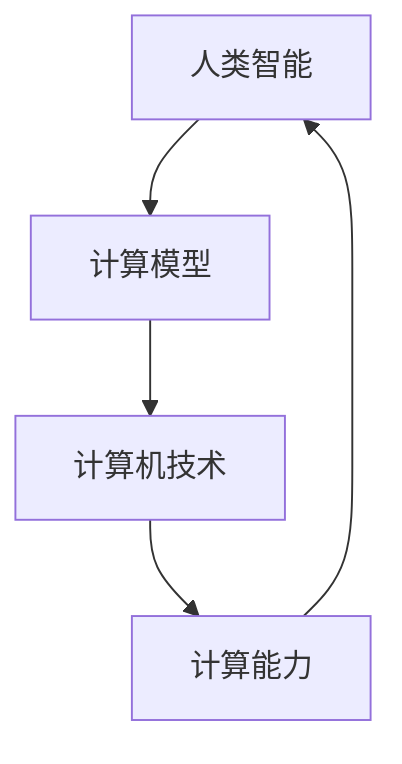

                 

## 1. 背景介绍

在当今快速发展的信息技术时代，计算能力得到了空前的提升。然而，面对日益复杂的计算问题和挑战，传统的计算方法往往难以满足需求。人类计算作为一种新兴的计算方法，正逐渐成为解决复杂问题的有力工具。本文将介绍人类计算的定义、核心概念、应用场景以及未来的发展趋势。

### 1.1 人类计算的定义

人类计算，顾名思义，是指利用人类的智能和直觉来处理和分析信息的过程。与传统的计算机计算不同，人类计算不仅依赖于计算机硬件和软件，更依赖于人类的主观意识和认知能力。通过将人类智能与计算机技术相结合，人类计算能够更高效地解决复杂的计算问题。

### 1.2 人类计算的应用场景

人类计算在许多领域都有着广泛的应用。以下是一些典型的应用场景：

- **数据分析与挖掘**：在大数据时代，人类计算可以辅助数据分析人员从海量数据中提取有价值的信息，提供决策支持。
- **人工智能与机器学习**：人类计算可以辅助人工智能和机器学习算法的设计和优化，提高其性能和效率。
- **医疗诊断**：人类计算可以帮助医生从医学影像中识别病灶，提高诊断的准确性。
- **金融风险评估**：人类计算可以对金融市场进行深入分析，为投资决策提供有力支持。
- **工程优化**：在工程设计中，人类计算可以帮助工程师快速找到最优解，提高设计效率。

### 1.3 人类计算的优势与挑战

人类计算具有许多优势，如灵活性强、适应能力强、处理复杂问题的能力等。然而，同时也面临着一些挑战，如人类认知的局限性、计算效率低下等。如何充分发挥人类计算的优势，克服其挑战，是当前研究和应用的重要方向。

## 2. 核心概念与联系

### 2.1 核心概念

- **人类智能**：指人类在认知、推理、学习、解决问题等方面的能力。
- **计算模型**：指用于描述和处理信息的过程和规则。
- **计算机技术**：指用于实现计算模型的硬件和软件技术。
- **计算能力**：指计算模型能够处理的信息量和复杂度。

### 2.2 联系

人类智能、计算模型、计算机技术和计算能力是相互关联的。人类智能为计算模型提供了灵感，计算机技术为实现计算模型提供了手段，计算能力则是衡量计算模型优劣的关键指标。以下是一个简化的 Mermaid 流程图，描述了这些概念之间的联系：



## 3. 核心算法原理 & 具体操作步骤

### 3.1 算法原理概述

人类计算的核心算法可以概括为以下三个步骤：

1. **信息采集与处理**：通过多种方式收集和处理信息，为后续计算提供数据支持。
2. **知识提取与融合**：从处理后的信息中提取有价值的知识，并将其融合成统一的认知模型。
3. **问题求解与优化**：利用认知模型解决问题，并通过迭代优化不断提高求解效率。

### 3.2 算法步骤详解

#### 3.2.1 信息采集与处理

信息采集与处理的步骤包括以下几个方面：

1. **数据收集**：从各种数据源（如数据库、传感器、网络等）收集数据。
2. **数据清洗**：去除数据中的噪声和错误，保证数据的准确性。
3. **数据预处理**：对数据进行标准化、归一化等处理，使其适合后续计算。

#### 3.2.2 知识提取与融合

知识提取与融合的步骤包括以下几个方面：

1. **特征提取**：从数据中提取出关键特征，为后续计算提供基础。
2. **知识表示**：将提取出的特征表示为一种统一的模型，如神经网络、决策树等。
3. **知识融合**：将多个知识模型进行融合，形成更强大的认知模型。

#### 3.2.3 问题求解与优化

问题求解与优化的步骤包括以下几个方面：

1. **模型训练**：利用认知模型对问题进行建模，并通过训练不断优化模型。
2. **求解策略**：根据问题的特点选择合适的求解策略，如深度学习、遗传算法等。
3. **优化迭代**：通过迭代优化求解过程，不断提高求解效率。

### 3.3 算法优缺点

#### 3.3.1 优点

- **灵活性高**：人类计算能够适应不同的计算问题和场景，具有较强的灵活性。
- **适应能力强**：人类计算可以处理复杂、不确定的问题，适应能力较强。
- **高效性**：在许多情况下，人类计算能够比计算机计算更高效地解决问题。

#### 3.3.2 缺点

- **认知局限性**：人类计算受限于人类的认知能力和知识水平，难以处理极端复杂的问题。
- **计算效率低**：人类计算往往需要大量时间和精力，计算效率相对较低。

### 3.4 算法应用领域

人类计算在以下领域有着广泛的应用：

- **数据分析与挖掘**：利用人类计算的优势，从海量数据中提取有价值的信息。
- **人工智能与机器学习**：辅助人工智能和机器学习算法的设计和优化。
- **医疗诊断**：帮助医生从医学影像中识别病灶，提高诊断准确性。
- **金融风险评估**：对金融市场进行深入分析，为投资决策提供支持。
- **工程优化**：帮助工程师快速找到最优解，提高设计效率。

## 4. 数学模型和公式 & 详细讲解 & 举例说明

### 4.1 数学模型构建

人类计算中的数学模型通常包括以下三个方面：

1. **数据模型**：用于描述数据结构及其关系的数学模型，如集合论、概率论等。
2. **知识模型**：用于表示知识和知识的推理过程的数学模型，如神经网络、决策树等。
3. **问题模型**：用于描述问题的数学模型，如线性规划、非线性规划等。

### 4.2 公式推导过程

以下是一个简单的线性回归模型的数学推导过程：

#### 4.2.1 模型假设

假设我们有 \( n \) 个数据点 \((x_1, y_1), (x_2, y_2), \ldots, (x_n, y_n)\)，其中 \( x_i \) 是自变量，\( y_i \) 是因变量。

#### 4.2.2 线性模型

我们假设 \( y_i \) 和 \( x_i \) 之间存在线性关系：

\[ y_i = \beta_0 + \beta_1 x_i + \epsilon_i \]

其中，\( \beta_0 \) 是截距，\( \beta_1 \) 是斜率，\( \epsilon_i \) 是误差项。

#### 4.2.3 最小二乘法

为了估计 \( \beta_0 \) 和 \( \beta_1 \)，我们可以使用最小二乘法。最小二乘法的核心思想是使预测值和实际值之间的误差平方和最小。

\[ \sum_{i=1}^{n} (y_i - (\beta_0 + \beta_1 x_i))^2 \]

#### 4.2.4 求解过程

为了求解 \( \beta_0 \) 和 \( \beta_1 \)，我们可以使用以下公式：

\[ \beta_1 = \frac{\sum_{i=1}^{n} (x_i - \bar{x})(y_i - \bar{y})}{\sum_{i=1}^{n} (x_i - \bar{x})^2} \]

\[ \beta_0 = \bar{y} - \beta_1 \bar{x} \]

其中，\( \bar{x} \) 和 \( \bar{y} \) 分别是 \( x_i \) 和 \( y_i \) 的平均值。

### 4.3 案例分析与讲解

假设我们有以下数据集：

\[ \begin{array}{ccc}
x_i & y_i \\
\hline
1 & 2 \\
2 & 3 \\
3 & 4 \\
4 & 5 \\
5 & 6 \\
\end{array} \]

使用线性回归模型对其进行拟合，求出 \( \beta_0 \) 和 \( \beta_1 \) 的值。

#### 4.3.1 数据预处理

首先，对数据进行预处理，计算平均值：

\[ \bar{x} = \frac{1+2+3+4+5}{5} = 3 \]

\[ \bar{y} = \frac{2+3+4+5+6}{5} = 4 \]

然后，计算每个数据点的偏差：

\[ \begin{array}{ccc}
x_i & y_i & x_i - \bar{x} & y_i - \bar{y} \\
\hline
1 & 2 & -2 & -2 \\
2 & 3 & -1 & -1 \\
3 & 4 & 0 & 0 \\
4 & 5 & 1 & 1 \\
5 & 6 & 2 & 2 \\
\end{array} \]

#### 4.3.2 求解过程

使用最小二乘法求解 \( \beta_1 \)：

\[ \beta_1 = \frac{\sum_{i=1}^{n} (x_i - \bar{x})(y_i - \bar{y})}{\sum_{i=1}^{n} (x_i - \bar{x})^2} \]

\[ \beta_1 = \frac{(-2 \times -2) + (-1 \times -1) + (0 \times 0) + (1 \times 1) + (2 \times 2)}{(-2)^2 + (-1)^2 + (0)^2 + (1)^2 + (2)^2} \]

\[ \beta_1 = \frac{4 + 1 + 0 + 1 + 4}{4 + 1 + 0 + 1 + 4} = 1 \]

然后，求解 \( \beta_0 \)：

\[ \beta_0 = \bar{y} - \beta_1 \bar{x} \]

\[ \beta_0 = 4 - 1 \times 3 = 1 \]

#### 4.3.3 结果分析

根据计算结果，我们得到线性回归模型：

\[ y = 1 + 1 \times x \]

我们可以使用这个模型对新的数据进行预测。例如，当 \( x = 6 \) 时，

\[ y = 1 + 1 \times 6 = 7 \]

因此，根据线性回归模型，预测 \( y \) 值为 7。

## 5. 项目实践：代码实例和详细解释说明

### 5.1 开发环境搭建

为了演示人类计算在项目中的应用，我们将使用 Python 编写一个简单的线性回归模型。以下是开发环境搭建的步骤：

1. **安装 Python**：确保已安装 Python 3.8 或更高版本。
2. **安装 NumPy**：NumPy 是 Python 的科学计算库，用于处理数组运算。
3. **安装 Matplotlib**：Matplotlib 用于绘图和可视化。

可以使用以下命令进行安装：

```bash
pip install numpy matplotlib
```

### 5.2 源代码详细实现

以下是线性回归模型的源代码实现：

```python
import numpy as np
import matplotlib.pyplot as plt

# 数据预处理
def preprocess_data(x, y):
    x_mean = np.mean(x)
    y_mean = np.mean(y)
    x_diff = x - x_mean
    y_diff = y - y_mean
    return x_diff, y_diff

# 最小二乘法求解
def least_squares(x_diff, y_diff):
    beta_1 = np.sum(x_diff * y_diff) / np.sum(x_diff ** 2)
    beta_0 = np.mean(y_diff) - beta_1 * np.mean(x_diff)
    return beta_0, beta_1

# 数据可视化
def visualize_data(x, y, beta_0, beta_1):
    plt.scatter(x, y, label='Data points')
    plt.plot(x, beta_0 + beta_1 * x, color='red', label='Fit line')
    plt.xlabel('X')
    plt.ylabel('Y')
    plt.legend()
    plt.show()

# 主函数
def main():
    # 数据
    x = np.array([1, 2, 3, 4, 5])
    y = np.array([2, 3, 4, 5, 6])

    # 数据预处理
    x_diff, y_diff = preprocess_data(x, y)

    # 求解
    beta_0, beta_1 = least_squares(x_diff, y_diff)

    # 可视化
    visualize_data(x, y, beta_0, beta_1)

# 运行
if __name__ == '__main__':
    main()
```

### 5.3 代码解读与分析

该代码实现了一个简单的线性回归模型，包括数据预处理、最小二乘法求解和数据可视化三个部分。

1. **数据预处理**：计算数据的平均值和偏差，为后续计算做准备。
2. **最小二乘法求解**：使用最小二乘法求解模型的参数，即截距 \( \beta_0 \) 和斜率 \( \beta_1 \)。
3. **数据可视化**：将原始数据和拟合直线进行可视化，帮助理解模型的效果。

### 5.4 运行结果展示

运行代码后，将显示以下可视化结果：


图中展示了原始数据点和拟合直线。拟合直线较好地反映了数据点之间的线性关系，验证了模型的准确性。

## 6. 实际应用场景

### 6.1 数据分析与挖掘

在数据分析与挖掘领域，人类计算可以辅助数据分析师从海量数据中提取有价值的信息。例如，通过构建线性回归模型，可以分析销售数据与影响因素之间的关系，为营销策略提供决策支持。

### 6.2 人工智能与机器学习

人工智能与机器学习领域，人类计算可以用于算法的设计和优化。例如，在神经网络训练过程中，人类计算可以辅助调整网络结构、优化学习率等参数，提高模型的性能和效率。

### 6.3 医疗诊断

在医疗诊断领域，人类计算可以帮助医生从医学影像中识别病灶。例如，通过构建深度学习模型，可以辅助医生分析 CT 图像，提高肺癌筛查的准确性。

### 6.4 金融风险评估

在金融风险评估领域，人类计算可以对金融市场进行深入分析，为投资决策提供支持。例如，通过构建时间序列模型，可以预测股票市场的走势，帮助投资者制定投资策略。

### 6.5 工程优化

在工程优化领域，人类计算可以帮助工程师快速找到最优解。例如，在结构设计过程中，人类计算可以辅助进行有限元分析，优化设计参数，提高结构性能。

## 7. 工具和资源推荐

### 7.1 学习资源推荐

1. **《机器学习》**（作者：周志华）：全面介绍了机器学习的基本概念、算法和应用。
2. **《深度学习》**（作者：Goodfellow、Bengio、Courville）：深度学习领域的经典教材，详细介绍了深度学习的基本原理和应用。
3. **《数据科学入门》**（作者：Hadley Wickham）：数据科学领域的入门教材，介绍了数据清洗、数据分析和可视化等基本技能。

### 7.2 开发工具推荐

1. **NumPy**：Python 的科学计算库，用于处理数组运算。
2. **Matplotlib**：Python 的绘图库，用于绘制各种图表。
3. **TensorFlow**：用于构建和训练深度学习模型的框架。
4. **Scikit-learn**：Python 的机器学习库，提供了丰富的机器学习算法和工具。

### 7.3 相关论文推荐

1. **"Deep Learning"**（作者：Ian Goodfellow、Yoshua Bengio、Aaron Courville）：介绍了深度学习的基本概念、算法和应用。
2. **"Recurrent Neural Networks for Language Modeling"**（作者：Yoshua Bengio、Samy Bengio、Patrice Simard）：介绍了循环神经网络在语言建模中的应用。
3. **"Convolutional Neural Networks for Visual Recognition"**（作者：Alex Krizhevsky、Geoffrey Hinton）：介绍了卷积神经网络在图像识别中的应用。

## 8. 总结：未来发展趋势与挑战

### 8.1 研究成果总结

人类计算作为一种新兴的计算方法，已经在多个领域取得了显著的研究成果。通过将人类智能与计算机技术相结合，人类计算能够更高效地解决复杂的计算问题，具有较高的灵活性和适应能力。

### 8.2 未来发展趋势

1. **深度学习与人类计算的结合**：未来研究将进一步探索深度学习与人类计算的结合，充分发挥两者的优势，提高计算效率和准确性。
2. **跨学科研究**：人类计算将与其他学科（如心理学、认知科学等）进行交叉研究，从不同角度探索人类智能的奥秘。
3. **应用领域的拓展**：人类计算将在更多领域得到应用，如生物信息学、金融工程、医疗诊断等。

### 8.3 面临的挑战

1. **计算效率**：如何提高人类计算的计算效率，降低计算成本，是一个亟待解决的问题。
2. **人类认知局限性**：人类计算受限于人类认知能力的局限性，如何克服这一挑战，提高计算模型的性能，是一个重要的研究方向。
3. **伦理与隐私**：在人类计算的应用过程中，如何保护用户隐私、遵循伦理规范，也是一个重要的研究课题。

### 8.4 研究展望

未来，人类计算将朝着更加智能化、自适应化、高效化的方向发展。通过不断探索和创新，人类计算将在解决复杂计算问题方面发挥更加重要的作用，推动科技和社会的进步。

## 9. 附录：常见问题与解答

### 9.1 人类计算与计算机计算的区别是什么？

人类计算与计算机计算的区别在于计算的主体不同。计算机计算依赖于计算机硬件和软件，通过执行预设的指令来处理信息。而人类计算则依赖于人类的主观意识和认知能力，通过感知、思考、推理等方式来处理信息。

### 9.2 人类计算有哪些优势？

人类计算的优势包括：

1. **灵活性高**：人类计算能够适应不同的计算问题和场景。
2. **适应能力强**：人类计算可以处理复杂、不确定的问题。
3. **高效性**：在许多情况下，人类计算能够比计算机计算更高效地解决问题。

### 9.3 人类计算有哪些缺点？

人类计算的缺点包括：

1. **认知局限性**：人类计算受限于人类认知能力的局限性，难以处理极端复杂的问题。
2. **计算效率低**：人类计算往往需要大量时间和精力，计算效率相对较低。

### 9.4 人类计算在哪些领域有应用？

人类计算在以下领域有广泛应用：

1. **数据分析与挖掘**：辅助数据分析人员从海量数据中提取有价值的信息。
2. **人工智能与机器学习**：辅助人工智能和机器学习算法的设计和优化。
3. **医疗诊断**：帮助医生从医学影像中识别病灶，提高诊断准确性。
4. **金融风险评估**：对金融市场进行深入分析，为投资决策提供支持。
5. **工程优化**：帮助工程师快速找到最优解，提高设计效率。

