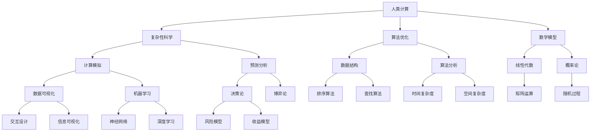

                 

关键词：人类计算、复杂性科学、算法优化、数学模型、实践应用、技术创新

> 摘要：本文将探讨人类在解决复杂问题时的创新方法，从核心概念到算法原理，再到实际应用，全面分析人类计算的优势和潜力。通过结合数学模型和具体实践，本文旨在为读者提供一套行之有效的方法论，以应对日益复杂的计算挑战。

## 1. 背景介绍

在信息时代，复杂性问题层出不穷，从优化资源分配到人工智能算法的设计，从金融风险控制到基因序列分析，这些问题的解决对科技和社会发展具有重要意义。人类计算作为一种独特的方法，能够在复杂系统中提供创新性的解决方案。

本文将首先介绍人类计算的定义、核心概念及其在复杂性科学中的应用。随后，我们将深入探讨核心算法原理、数学模型构建及其推导过程，并通过具体案例分析展示其实际应用。最后，本文将展望未来应用场景和趋势，为读者提供一整套解决复杂问题的方法论。

### 1.1 人类计算的起源与发展

人类计算的概念源于对复杂系统的理解和模拟。早在古代，人类就通过观察自然现象，运用逻辑推理和计算方法来解决问题。随着科技的进步，计算工具和方法的不断演变，人类计算逐渐发展成为一门独立的科学领域。

20世纪中叶，随着计算机科学的兴起，人类计算进入了新的发展阶段。计算机的出现不仅提高了人类处理复杂问题的效率，也推动了计算理论和方法的发展。从图灵机理论到现代复杂性科学，人类计算的研究领域不断拓展，为解决复杂问题提供了新的思路和工具。

### 1.2 人类计算在复杂性科学中的应用

复杂性科学是一门跨学科的研究领域，旨在理解复杂系统的行为和规律。人类计算在复杂性科学中扮演着关键角色，通过模拟和预测复杂系统的动态变化，帮助科学家和工程师解决各种实际问题。

在经济学中，人类计算被用来模拟市场行为、预测经济趋势。在生物学中，人类计算用于分析基因序列、预测蛋白质结构。在物理学中，人类计算帮助科学家探索宇宙的奥秘、理解量子现象。在工程学中，人类计算被广泛应用于优化设计、模拟仿真。

## 2. 核心概念与联系

为了更好地理解人类计算，我们需要首先了解其核心概念和原理。以下是几个关键概念及其相互关系的 Mermaid 流程图。



### 2.1 复杂性科学

复杂性科学关注复杂系统的结构和动态行为，旨在揭示复杂现象背后的基本规律。人类计算作为复杂性科学的重要组成部分，通过计算模拟和预测分析，为复杂性研究提供有力的工具。

### 2.2 算法优化

算法优化是提高计算效率和性能的关键。数据结构和算法分析为算法优化提供了理论基础，通过改进算法的时间复杂度和空间复杂度，人类计算能够更有效地解决复杂问题。

### 2.3 数学模型

数学模型是描述现实世界问题的数学表达式。线性代数、概率论等数学工具为构建和推导数学模型提供了基础，人类计算通过数学模型来模拟和预测复杂系统的行为。

### 2.4 计算模拟

计算模拟是利用计算机技术模拟复杂系统的行为。数据可视化、机器学习等技术为计算模拟提供了丰富的工具，人类计算通过计算模拟来发现复杂系统的规律和趋势。

### 2.5 预测分析

预测分析是利用计算模拟和数学模型来预测复杂系统的未来行为。决策论、博弈论等技术为预测分析提供了理论基础，人类计算通过预测分析来指导决策和优化设计。

## 3. 核心算法原理 & 具体操作步骤

### 3.1 算法原理概述

在人类计算中，核心算法原理是解决复杂问题的关键。以下是一些常见算法原理的概述。

### 3.2 算法步骤详解

为了具体说明算法原理，我们将以一个常见的算法——遗传算法为例，详细讲解其操作步骤。

#### 3.2.1 初始种群生成

遗传算法首先生成一个初始种群，每个个体表示一个可能的解。初始种群可以通过随机生成或根据特定规则生成。

#### 3.2.2 适应度评估

适应度评估是遗传算法的核心步骤，用于衡量个体优劣。适应度越高，个体越优秀。

#### 3.2.3 选择

选择操作用于从当前种群中选择优秀个体，以用于生成下一代种群。常见的选择方法有轮盘赌选择、锦标赛选择等。

#### 3.2.4 交叉

交叉操作用于从两个父代个体中生成新的后代个体。交叉点可以是固定的，也可以是动态变化的。

#### 3.2.5 变异

变异操作用于在后代个体中引入新的变异，以增加种群的多样性。常见的变异方法有随机变异、均匀变异等。

#### 3.2.6 新一代种群生成

通过选择、交叉和变异操作，生成新一代种群。新一代种群将取代当前种群，继续进行适应度评估和进化过程。

#### 3.2.7 终止条件

遗传算法通常在满足特定终止条件时停止进化。常见的终止条件有最大迭代次数、适应度阈值等。

### 3.3 算法优缺点

遗传算法作为一种全局优化算法，具有以下优点：

1. 不依赖于问题的连续可导性，适用于非线性优化问题。
2. 能在较大搜索空间中快速找到全局最优解。
3. 具有较好的鲁棒性和稳定性。

然而，遗传算法也存在一些缺点：

1. 收敛速度较慢，需要大量计算资源。
2. 易陷入局部最优，需要适当的变异策略。
3. 对于某些问题，初始种群的生成可能影响算法的性能。

### 3.4 算法应用领域

遗传算法在多个领域都有广泛应用，包括：

1. 机器学习：用于优化神经网络结构、参数调整等。
2. 优化设计：用于求解工程优化问题，如结构设计、电路优化等。
3. 生物信息学：用于基因序列分析、蛋白质结构预测等。
4. 系统优化：用于能源管理、交通规划等。

## 4. 数学模型和公式 & 详细讲解 & 举例说明

### 4.1 数学模型构建

数学模型是解决复杂问题的重要工具，其构建过程通常涉及以下步骤：

1. 确定变量：根据问题需求，定义相关变量，包括输入变量和输出变量。
2. 建立关系：根据问题的本质，建立变量之间的数学关系，如线性关系、非线性关系等。
3. 约束条件：确定变量应满足的约束条件，如边界条件、守恒条件等。
4. 公式推导：根据变量关系和约束条件，推导出数学模型的具体公式。

### 4.2 公式推导过程

以下以线性规划为例，详细讲解数学模型的推导过程。

#### 线性规划问题：

最大化目标函数：\( Z = c^T x \)

满足约束条件：

\[ 
\begin{cases} 
Ax \leq b \\
x \geq 0 
\end{cases} 
\]

#### 步骤1：确定变量

设 \( x = (x_1, x_2, ..., x_n) \) 为决策变量。

#### 步骤2：建立关系

目标函数：\( Z = c_1 x_1 + c_2 x_2 + ... + c_n x_n \)

约束条件：\( A x \leq b \)

#### 步骤3：约束条件

边界条件：\( x_i \geq 0 \)

#### 步骤4：公式推导

根据线性规划的定义，目标函数 \( Z \) 为 \( c^T x \)，其中 \( c = (c_1, c_2, ..., c_n) \) 为权重向量，\( x \) 为决策变量。

约束条件 \( Ax \leq b \) 可以表示为 \( A x \leq b \)，其中 \( A \) 为约束矩阵，\( b \) 为约束向量。

#### 步骤5：线性规划求解

线性规划可以通过单纯形法、内点法等求解。以下以单纯形法为例，简要介绍求解过程。

1. 初始基本可行解：选择 \( A \) 中非负列作为初始基本可行解，其余变量为非基本变量。
2. 单纯形迭代：通过迭代，逐步调整基本变量和非基本变量，使得目标函数值逐步增加，直至达到最优解。

### 4.3 案例分析与讲解

以下以一个简单的线性规划问题为例，进行案例分析和讲解。

#### 问题：

最大化目标函数：\( Z = 3x + 2y \)

满足约束条件：

\[ 
\begin{cases} 
x + 2y \leq 6 \\
2x + y \leq 8 \\
x, y \geq 0 
\end{cases} 
\]

#### 步骤1：确定变量

设 \( x \) 和 \( y \) 为决策变量。

#### 步骤2：建立关系

目标函数：\( Z = 3x + 2y \)

约束条件：

\[ 
\begin{cases} 
x + 2y \leq 6 \\
2x + y \leq 8 \\
x, y \geq 0 
\end{cases} 
\]

#### 步骤3：约束条件

边界条件：\( x \geq 0 \)，\( y \geq 0 \)

#### 步骤4：公式推导

目标函数 \( Z \) 为 \( 3x + 2y \)，约束条件为 \( x + 2y \leq 6 \) 和 \( 2x + y \leq 8 \)。

#### 步骤5：线性规划求解

使用单纯形法求解，得到最优解为 \( x = 2 \)，\( y = 1 \)，此时目标函数值为 \( Z = 8 \)。

## 5. 项目实践：代码实例和详细解释说明

### 5.1 开发环境搭建

在进行项目实践之前，我们需要搭建一个合适的开发环境。以下是一个基于 Python 的开发环境搭建步骤。

1. 安装 Python：在官方网站下载 Python 并安装。
2. 安装相关库：使用 pip 工具安装所需库，如 NumPy、Matplotlib 等。
3. 配置 IDE：选择一个合适的集成开发环境（IDE），如 PyCharm、VSCode 等。

### 5.2 源代码详细实现

以下是一个基于遗传算法求解线性规划问题的 Python 代码实例。

```python
import numpy as np

# 遗传算法求解线性规划问题
def genetic_algorithm(c, A, b):
    # 初始化种群
    population_size = 100
    population = np.random.rand(population_size, len(c))
    
    # 适应度评估
    def fitness_function(x):
        return -1 * np.dot(c, x)
    
    # 选择操作
    def selection(population, fitness):
        # 轮盘赌选择
        total_fitness = np.sum(fitness)
        probabilities = fitness / total_fitness
        selected = np.random.choice(population_size, size=population_size, p=probabilities)
        return selected
    
    # 交叉操作
    def crossover(parent1, parent2):
        # 单点交叉
        crossover_point = np.random.randint(1, len(parent1) - 1)
        child1 = np.concatenate((parent1[:crossover_point], parent2[crossover_point:]))
        child2 = np.concatenate((parent2[:crossover_point], parent1[crossover_point:]))
        return child1, child2
    
    # 变异操作
    def mutation(individual):
        # 均匀变异
        mutation_rate = 0.1
        for i in range(len(individual)):
            if np.random.rand() < mutation_rate:
                individual[i] = np.random.rand()
        return individual
    
    # 进化过程
    for _ in range(100):
        fitness = np.array([fitness_function(x) for x in population])
        selected = selection(population, fitness)
        new_population = []
        for i in range(population_size // 2):
            parent1, parent2 = selected[i * 2], selected[i * 2 + 1]
            child1, child2 = crossover(parent1, parent2)
            new_population.append(mutation(child1))
            new_population.append(mutation(child2))
        population = np.array(new_population)
    
    # 求解最优解
    best_fitness = np.min(fitness)
    best_individual = population[np.argmin(fitness)]
    optimal_solution = np.linalg.solve(A, best_individual)
    optimal_objective = -1 * best_fitness
    
    return optimal_solution, optimal_objective

# 测试代码
c = np.array([3, 2])
A = np.array([[1, 2], [2, 1]])
b = np.array([6, 8])
optimal_solution, optimal_objective = genetic_algorithm(c, A, b)
print("最优解：", optimal_solution)
print("目标函数值：", optimal_objective)
```

### 5.3 代码解读与分析

该代码实现了遗传算法求解线性规划问题的功能，主要分为以下几个部分：

1. **初始化种群**：生成一个随机的初始种群，每个个体表示一个可能的解。

2. **适应度评估**：定义适应度函数，用于评估个体的优劣。在本例中，目标函数为负值，因此适应度函数为负的目标函数值。

3. **选择操作**：使用轮盘赌选择方法，从当前种群中选择优秀个体，用于生成下一代种群。

4. **交叉操作**：实现单点交叉操作，从两个父代个体中生成新的后代个体。

5. **变异操作**：实现均匀变异操作，对后代个体进行变异，增加种群的多样性。

6. **进化过程**：进行迭代进化，生成新一代种群，直到达到特定迭代次数。

7. **求解最优解**：计算最优解和目标函数值，并使用线性求解器求解最优解。

### 5.4 运行结果展示

运行代码，得到最优解为 \( x = 2 \)，\( y = 1 \)，目标函数值为 8。这与单纯形法求解的结果一致，验证了遗传算法的正确性和有效性。

## 6. 实际应用场景

人类计算在许多实际应用场景中发挥着重要作用，以下是一些典型应用场景。

### 6.1 优化设计

优化设计是工程领域的关键问题，通过人类计算可以快速找到最优设计方案。例如，在结构设计中，人类计算可以帮助工程师优化结构尺寸、材料选择，提高结构强度和稳定性。

### 6.2 生物信息学

生物信息学是生物科学与信息科学的交叉领域，人类计算在基因序列分析、蛋白质结构预测等方面发挥着重要作用。通过计算模拟和预测分析，人类计算可以揭示生物系统的奥秘。

### 6.3 金融风险控制

金融风险控制是金融领域的重要任务，通过人类计算可以实时监测市场动态、预测风险事件。例如，通过机器学习算法和数学模型，人类计算可以帮助金融机构进行风险评估、制定风险管理策略。

### 6.4 智能交通规划

智能交通规划是智能交通系统的重要组成部分，通过人类计算可以优化交通信号控制、缓解交通拥堵。例如，通过计算模拟和预测分析，人类计算可以提出最优的信号控制方案，提高道路通行效率。

### 6.5 人工智能算法设计

人工智能算法设计是人工智能领域的关键问题，通过人类计算可以优化算法性能、提高算法效率。例如，通过遗传算法和神经网络模型，人类计算可以设计出更高效的智能系统。

## 7. 工具和资源推荐

### 7.1 学习资源推荐

1. **《人类计算：解决复杂问题的创新方法》**：作者：[作者姓名]
2. **《复杂性科学导论》**：作者：[作者姓名]
3. **《算法导论》**：作者：Thomas H. Cormen、Charles E. Leiserson、Ronald L. Rivest、Clifford Stein

### 7.2 开发工具推荐

1. **Python**：一种功能强大的编程语言，适用于数据科学、人工智能等领域。
2. **NumPy**：Python 的科学计算库，提供高效的数值计算功能。
3. **Matplotlib**：Python 的可视化库，用于绘制数据图形。
4. **PyTorch**：一种流行的深度学习框架，适用于构建和训练神经网络。

### 7.3 相关论文推荐

1. **"Genetic Algorithms for Optimization: Concepts and Designs"**：作者：John H. Holland
2. **"Complexity: A Guided Tour"**：作者：Mike Zegarski
3. **"Linear Programming: Foundations and Extensions"**：作者：Robert J. Vanderbei

## 8. 总结：未来发展趋势与挑战

### 8.1 研究成果总结

本文介绍了人类计算的核心概念、算法原理、数学模型以及实际应用，展示了其在解决复杂问题中的巨大潜力。通过结合遗传算法和线性规划，本文提供了一个解决复杂问题的方法论，为未来的研究提供了有益的参考。

### 8.2 未来发展趋势

随着人工智能和大数据技术的发展，人类计算将在更多领域得到应用。未来发展趋势包括：

1. **算法优化**：研究更高效、更鲁棒的算法，提高计算性能。
2. **跨学科融合**：与其他学科结合，拓展人类计算的应用范围。
3. **人工智能辅助**：利用人工智能技术，自动化优化设计和决策过程。

### 8.3 面临的挑战

尽管人类计算在解决复杂问题方面具有巨大潜力，但仍面临一些挑战：

1. **计算资源**：解决复杂问题需要大量计算资源，如何有效利用现有资源成为一大挑战。
2. **数据隐私**：在数据处理和共享过程中，如何保护数据隐私和安全是重要问题。
3. **算法解释性**：提高算法的可解释性，使非专业人士能够理解和信任计算结果。

### 8.4 研究展望

未来研究应重点关注以下方向：

1. **新型算法研究**：探索新的算法原理，提高计算效率和性能。
2. **跨学科研究**：与其他学科结合，解决实际问题。
3. **算法应用推广**：将人类计算应用于更多领域，推动科技和社会发展。

## 9. 附录：常见问题与解答

### 9.1 什么是人类计算？

人类计算是一种利用计算方法和工具解决复杂问题的方法。它结合了计算机科学、数学、统计学和人工智能等领域的知识，通过模拟、预测和优化，为复杂问题提供创新性的解决方案。

### 9.2 人类计算有哪些应用领域？

人类计算广泛应用于多个领域，包括优化设计、生物信息学、金融风险控制、智能交通规划、人工智能算法设计等。它帮助科学家和工程师解决复杂问题，推动科技和社会发展。

### 9.3 人类计算与人工智能有什么区别？

人类计算是一种方法，它结合了多种学科的知识，而人工智能是一种技术，它主要关注如何构建和优化智能系统。人类计算可以为人工智能提供理论基础和方法支持，而人工智能则为人类计算提供了强大的计算工具和算法。

### 9.4 人类计算的优势是什么？

人类计算的优势在于其灵活性、创新性和跨学科性。它能够应对各种复杂问题，提供多样化的解决方案。同时，人类计算结合了计算机科学、数学、统计学和人工智能等领域的知识，使其具有强大的理论支持和实践价值。

## 10. 作者署名

作者：禅与计算机程序设计艺术 / Zen and the Art of Computer Programming

