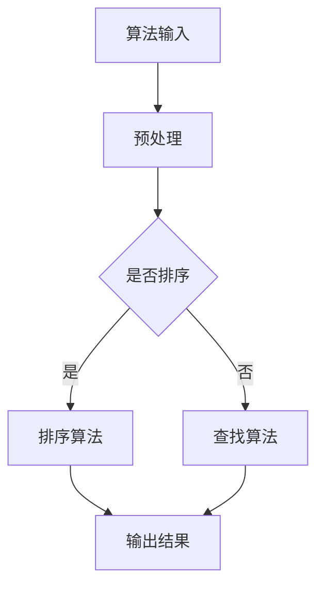
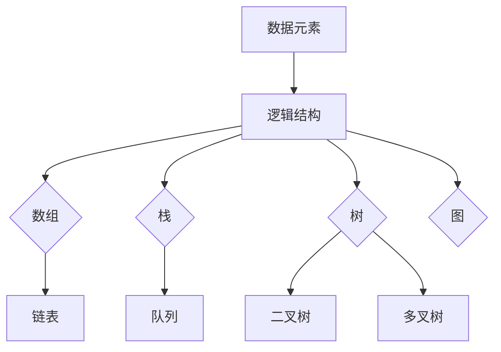
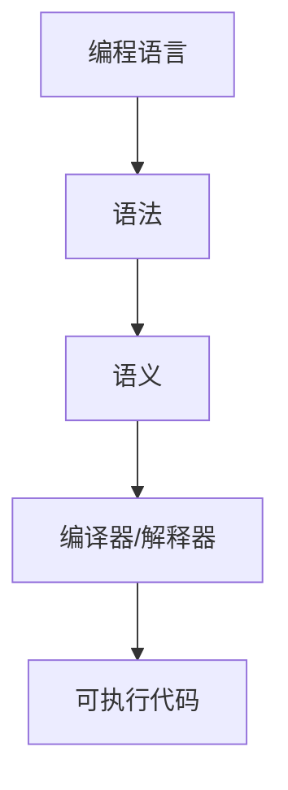

                 

人类计算作为计算机科学的核心领域，承载着连接过去、现在和未来的重要使命。本文旨在探讨人类计算的历史脉络、核心概念、算法原理、数学模型、实际应用以及未来展望，从而为读者提供一个全面而深入的视角。无论您是计算机科学的学生、从业者，还是对这一领域充满好奇的爱好者，本文都将为您提供宝贵的见解和启示。

## 关键词

- 人类计算
- 计算机科学
- 算法原理
- 数学模型
- 实际应用
- 未来展望

## 摘要

本文首先回顾了人类计算的历史，探讨了其从古代算盘到现代计算机的发展轨迹。接着，我们深入分析了人类计算的核心概念，包括算法、数据结构、编程语言等。随后，本文详细阐述了人类计算的核心算法原理，如排序、查找、图算法等，并辅以具体的操作步骤和实例。接着，我们介绍了数学模型和公式，并结合实际案例进行了详细讲解。此外，本文还通过项目实践展示了代码实例，为读者提供了实际操作的经验。最后，本文探讨了人类计算的实际应用场景，并对其未来发展进行了展望，分析了其中的挑战和机遇。通过本文的阅读，读者将对人类计算有一个全面而深刻的认识。

## 1. 背景介绍

### 1.1 人类计算的历史

人类计算的历史可以追溯到几千年前。在古代，人类使用各种工具和方法来执行计算任务。例如，古代巴比伦人使用算盘进行简单的数学运算，而古埃及人则使用石子和绳子来进行土地测量和建筑计算。这些工具和方法为人类计算奠定了基础，尽管它们的效率较低，但它们为后来的发展提供了宝贵的经验和启示。

随着时间的推移，人类计算工具和技术不断发展。公元14世纪，欧洲人发明了算盘，这是一种更为高效和精确的计算工具。随后，在17世纪，英国数学家和发明家威廉·谢尔班发明了机械计算器，这是一种通过机械装置进行复杂计算的工具。这些工具的出现极大地提高了人类计算的能力和效率。

然而，真正意义上的计算机科学诞生于20世纪。1946年，第一台电子计算机ENIAC在美国诞生，标志着计算机科学正式进入一个全新的时代。此后，计算机科学经历了快速的发展，不仅性能不断提高，而且应用领域也越来越广泛。从早期的科学计算、数据处理，到如今的互联网、人工智能，计算机科学已经成为现代社会的核心技术之一。

### 1.2 计算机科学的核心领域

计算机科学是一个广泛而复杂的领域，涵盖了多个核心领域。其中，算法、数据结构、编程语言是计算机科学的三大基石。

**算法**：算法是计算机科学的核心概念之一。它是一系列解决问题的步骤或指令，用于执行特定任务。算法的效率和质量直接影响到计算机程序的性能和可靠性。计算机科学家致力于研究各种算法，以提高计算效率和解决复杂问题。

**数据结构**：数据结构是组织和存储数据的方式。它们为算法提供了基础，使得数据的访问和处理更加高效。常见的有数组、链表、栈、队列、树、图等。合理选择和使用数据结构可以优化算法性能，提高程序效率。

**编程语言**：编程语言是编写计算机程序的工具。不同的编程语言具有不同的特点和适用场景。常见的编程语言有C、C++、Java、Python等。掌握多种编程语言有助于计算机科学家灵活应对各种问题，开发高效的软件系统。

### 1.3 人类计算在现代社会的应用

随着计算机科学的发展，人类计算在现代社会的应用日益广泛。以下是一些主要的应用领域：

**科学计算**：计算机科学在科学研究中发挥着重要作用。从天文学、物理学、生物学到化学、地球科学，计算机科学为各种学科提供了强大的计算工具和模拟方法，促进了科学研究的深入和发展。

**数据处理**：随着大数据时代的到来，数据处理成为计算机科学的重要应用领域。计算机科学提供了高效的数据存储、检索和分析方法，使得企业和组织能够更好地利用数据，做出更明智的决策。

**人工智能**：人工智能是计算机科学的另一个重要应用领域。通过机器学习和深度学习等技术，计算机科学为人工智能的发展提供了强大的支持。人工智能在图像识别、自然语言处理、自动驾驶等领域取得了显著成果，正在深刻改变人类社会。

**互联网**：互联网是计算机科学的产物之一，也是其重要应用领域。计算机科学为互联网提供了基础架构，使得全球的人们能够便捷地连接和交流。互联网已经深入到人们生活的方方面面，成为现代社会不可或缺的一部分。

## 2. 核心概念与联系

### 2.1 算法

算法是计算机科学的核心概念之一。它是一系列解决问题的步骤或指令，用于执行特定任务。算法的效率和质量直接影响到计算机程序的性能和可靠性。计算机科学家致力于研究各种算法，以提高计算效率和解决复杂问题。

#### 算法原理

算法通常包括以下几个基本要素：

- **输入**：算法执行前接收的数据或信息。
- **输出**：算法执行后产生的结果。
- **处理过程**：算法执行的具体步骤和操作。

算法可以分为以下几类：

- **排序算法**：用于对数据进行排序，如冒泡排序、快速排序、归并排序等。
- **查找算法**：用于在数据集合中查找特定元素，如二分查找、散列表查找等。
- **图算法**：用于处理图数据结构，如最短路径算法、最小生成树算法等。

#### 算法架构

以下是算法架构的 Mermaid 流程图：



#### 算法应用领域

算法在计算机科学的应用领域广泛，以下是一些主要的应用领域：

- **科学计算**：算法用于解决科学计算问题，如数值计算、模拟等。
- **数据处理**：算法用于处理大量数据，如排序、过滤、聚合等。
- **人工智能**：算法是人工智能的基础，如机器学习算法、深度学习算法等。
- **网络应用**：算法用于优化网络性能，如路由算法、拥塞控制算法等。

### 2.2 数据结构

数据结构是组织和存储数据的方式。它们为算法提供了基础，使得数据的访问和处理更加高效。常见的有数组、链表、栈、队列、树、图等。

#### 数据结构原理

数据结构通常包括以下几个基本要素：

- **数据元素**：数据结构中的基本单位。
- **数据集合**：数据元素组成的集合。
- **逻辑结构**：数据元素之间的逻辑关系。
- **物理结构**：数据元素在计算机内存中的存储方式。

常见的逻辑结构有线性结构（如数组、链表、栈、队列）、树形结构（如二叉树、多叉树）和图状结构（如图）。

#### 数据结构架构

以下是数据结构的 Mermaid 流程图：



#### 数据结构应用领域

数据结构在计算机科学的应用领域广泛，以下是一些主要的应用领域：

- **算法实现**：数据结构是算法实现的基础，如排序算法、查找算法等。
- **数据库**：数据结构用于组织和管理数据库中的数据。
- **操作系统**：数据结构用于操作系统中的进程管理、内存管理等。
- **网络应用**：数据结构用于优化网络性能，如路由算法、拥塞控制算法等。

### 2.3 编程语言

编程语言是编写计算机程序的工具。不同的编程语言具有不同的特点和适用场景。常见的编程语言有C、C++、Java、Python等。掌握多种编程语言有助于计算机科学家灵活应对各种问题，开发高效的软件系统。

#### 编程语言原理

编程语言通常包括以下几个基本要素：

- **语法**：编程语言的语法规则，用于编写程序代码。
- **语义**：程序代码的含义和执行结果。
- **编译器/解释器**：将程序代码转换为计算机可执行代码的工具。

#### 编程语言架构

以下是编程语言的 Mermaid 流程图：



#### 编程语言应用领域

编程语言在计算机科学的应用领域广泛，以下是一些主要的应用领域：

- **操作系统开发**：编程语言用于开发操作系统，如C、C++等。
- **应用软件开发**：编程语言用于开发各种应用软件，如Java、Python等。
- **嵌入式系统**：编程语言用于开发嵌入式系统，如C、C++等。
- **网络应用**：编程语言用于开发网络应用，如Java、Python等。

## 3. 核心算法原理 & 具体操作步骤

### 3.1 算法原理概述

在计算机科学中，算法是解决问题的基础。本文将介绍几种核心算法的原理和具体操作步骤，包括排序算法、查找算法和图算法。

### 3.2 算法步骤详解

#### 3.2.1 排序算法

排序算法是一类重要的算法，用于对数据进行排序。常见的排序算法有冒泡排序、快速排序、归并排序等。

**冒泡排序**：

1. 从第一个元素开始，比较相邻的两个元素，如果第一个比第二个大（升序排序），就交换它们的位置。
2. 对每一对相邻元素做同样的工作，从开始第一对到结尾的最后一对。在这一点，最后的元素应该会是最大的数。
3. 针对所有的元素重复以上的步骤，除了最后一个。
4. 重复步骤1-3，直到排序完成。

**快速排序**：

1. 选择一个基准元素，通常选择第一个或最后一个元素。
2. 将数组分为两部分，一部分小于基准元素，另一部分大于基准元素。
3. 递归地对小于和大于基准元素的部分进行快速排序。

**归并排序**：

1. 将数组分为两个子数组，直到每个子数组的长度为1。
2. 归并这些子数组，每次将两个子数组合并成一个有序数组。
3. 递归地对合并后的数组进行归并排序，直到整个数组有序。

#### 3.2.2 查找算法

查找算法用于在数据集合中查找特定元素。常见的查找算法有二分查找、散列表查找等。

**二分查找**：

1. 确定查找范围，初始范围为整个数组。
2. 计算中间位置，与目标元素进行比较。
3. 如果中间位置的元素等于目标元素，查找成功。
4. 如果中间位置的元素大于目标元素，缩小查找范围至左侧子数组。
5. 如果中间位置的元素小于目标元素，缩小查找范围至右侧子数组。
6. 重复步骤2-5，直到找到目标元素或查找范围缩小为空。

**散列表查找**：

1. 将要查找的元素通过散列函数计算出一个散列值。
2. 根据散列值定位到散列表中的特定位置。
3. 在该位置查找目标元素。
4. 如果找到目标元素，查找成功；否则，查找失败。

#### 3.2.3 图算法

图算法用于处理图数据结构。常见的图算法有最短路径算法、最小生成树算法等。

**最短路径算法**：

- **迪杰斯特拉算法**：用于求解单源最短路径问题。算法步骤如下：
  1. 初始化所有顶点的距离为无穷大，除了源点距离为0。
  2. 重复以下步骤：
     a. 选择未处理的顶点中距离最小的顶点。
     b. 更新所有与该顶点相邻的顶点的距离。
  3. 输出所有顶点的最短路径。

- **贝尔曼-福特算法**：用于求解单源最短路径问题。算法步骤如下：
  1. 初始化所有顶点的距离为无穷大，除了源点距离为0。
  2. 重复以下步骤V-1次：
     a. 对所有边（u, v）和权重w，如果distance[u] + w < distance[v]，则更新distance[v] = distance[u] + w。
  3. 检查是否存在负权重循环。如果存在，则最短路径问题无解。

**最小生成树算法**：

- **克鲁斯卡尔算法**：用于求解最小生成树问题。算法步骤如下：
  1. 初始化每个顶点为一个独立的集合。
  2. 对所有边按照权重从小到大排序。
  3. 重复以下步骤，直到形成最小生成树：
     a. 选择权重最小的边。
     b. 如果这条边连接的两个顶点属于不同的集合，则将这两个集合合并。

- **普里姆算法**：用于求解最小生成树问题。算法步骤如下：
  1. 初始化一个包含源点的最小生成树。
  2. 重复以下步骤，直到包含所有顶点：
     a. 选择最小生成树中的某个顶点。
     b. 从该顶点出发，选择权重最小的边，并将其添加到最小生成树中。

### 3.3 算法优缺点

每种算法都有其优缺点，选择合适的算法取决于具体的应用场景。

#### 排序算法

**冒泡排序**：

- 优点：
  - 简单易懂，易于实现。
  - 稳定排序，相同元素的相对顺序不变。

- 缺点：
  - 时间复杂度较高，不适合大数据量的排序。

**快速排序**：

- 优点：
  - 平均时间复杂度较低，适合大数据量的排序。
  - 稳定性较高。

- 缺点：
  - 最坏情况下的时间复杂度较高。
  - 需要额外的内存空间。

**归并排序**：

- 优点：
  - 时间复杂度稳定，适合大数据量的排序。
  - 稳定排序。

- 缺点：
  - 需要额外的内存空间。

#### 查找算法

**二分查找**：

- 优点：
  - 时间复杂度较低，适合大数据量的查找。
  - 稳定查找。

- 缺点：
  - 需要数据预先排序。

**散列表查找**：

- 优点：
  - 平均时间复杂度较低，适合大数据量的查找。
  - 易于实现。

- 缺点：
  - 需要处理冲突。
  - 数据分布不均匀时性能下降。

#### 图算法

**最短路径算法**：

- **迪杰斯特拉算法**：

  - 优点：
    - 可以处理带有负权重边的图。
  
  - 缺点：
    - 时间复杂度较高。

- **贝尔曼-福特算法**：

  - 优点：
    - 可以处理带有负权重循环的图。
  
  - 缺点：
    - 时间复杂度较高。

**最小生成树算法**：

- **克鲁斯卡尔算法**：

  - 优点：
    - 时间复杂度较低。
  
  - 缺点：
    - 需要排序操作。

- **普里姆算法**：

  - 优点：
    - 时间复杂度较低。

- 缺点：
    - 需要排序操作。

### 3.4 算法应用领域

各种算法在不同的应用领域具有广泛的应用。

- **排序算法**：
  - 数据库排序。
  - 文件排序。
  - 网络排序。

- **查找算法**：
  - 数据库查询。
  - 文件检索。
  - 图查询。

- **图算法**：
  - 网络路由。
  - 社交网络分析。
  - 地理信息系统。

## 4. 数学模型和公式 & 详细讲解 & 举例说明

### 4.1 数学模型构建

在计算机科学中，数学模型用于描述和解决问题。构建数学模型通常包括以下几个步骤：

1. **问题分析**：理解问题的背景和目标，明确需要解决的问题。
2. **建立假设**：根据问题特点，提出合理的假设，简化问题。
3. **定义变量**：确定问题中的变量，包括已知量和未知量。
4. **公式推导**：根据假设和变量，推导出数学公式。
5. **模型验证**：通过实际数据或模拟验证模型的有效性和准确性。

### 4.2 公式推导过程

以下是一个简单的线性回归模型的推导过程：

假设我们有一个样本数据集，其中每个样本包含两个变量：自变量\( x \)和因变量\( y \)。我们的目标是找到一个线性关系模型，即：

\[ y = ax + b \]

其中，\( a \)和\( b \)是待求的参数。

1. **最小二乘法**：

   我们使用最小二乘法来求解参数\( a \)和\( b \)。最小二乘法的思想是找到一条直线，使得所有样本点到直线的垂直距离之和最小。

   垂直距离的计算公式为：

   \[ d = |ax + b - y| \]

   我们要求垂直距离之和最小，即：

   \[ \sum_{i=1}^{n} |ax_i + b - y_i| \]

   由于绝对值函数的不可导性，我们使用平方代替绝对值，即：

   \[ \sum_{i=1}^{n} (ax_i + b - y_i)^2 \]

2. **求导和极值**：

   为了求解参数\( a \)和\( b \)，我们需要对上述函数求导，并令导数为0，得到极值点。

   对\( a \)求导，得到：

   \[ \frac{\partial}{\partial a} \sum_{i=1}^{n} (ax_i + b - y_i)^2 = 2 \sum_{i=1}^{n} x_i (ax_i + b - y_i) \]

   令导数为0，得到：

   \[ 2 \sum_{i=1}^{n} x_i (ax_i + b - y_i) = 0 \]

   对\( b \)求导，得到：

   \[ \frac{\partial}{\partial b} \sum_{i=1}^{n} (ax_i + b - y_i)^2 = 2 \sum_{i=1}^{n} (ax_i + b - y_i) \]

   令导数为0，得到：

   \[ 2 \sum_{i=1}^{n} (ax_i + b - y_i) = 0 \]

3. **求解参数**：

   解上述方程组，得到参数\( a \)和\( b \)。

   \[ a = \frac{\sum_{i=1}^{n} x_i y_i - n \bar{x} \bar{y}}{\sum_{i=1}^{n} x_i^2 - n \bar{x}^2} \]
   \[ b = \bar{y} - a \bar{x} \]

   其中，\( \bar{x} \)和\( \bar{y} \)分别是\( x \)和\( y \)的样本均值。

### 4.3 案例分析与讲解

假设我们有一个简单的数据集，包含5个样本点的自变量\( x \)和因变量\( y \)：

\[
\begin{array}{ccc}
x & y \\
1 & 2 \\
2 & 4 \\
3 & 6 \\
4 & 8 \\
5 & 10 \\
\end{array}
\]

我们使用线性回归模型来拟合这个数据集。

1. **计算均值**：

   \[ \bar{x} = \frac{1 + 2 + 3 + 4 + 5}{5} = 3 \]
   \[ \bar{y} = \frac{2 + 4 + 6 + 8 + 10}{5} = 6 \]

2. **计算参数**：

   \[ a = \frac{\sum_{i=1}^{n} x_i y_i - n \bar{x} \bar{y}}{\sum_{i=1}^{n} x_i^2 - n \bar{x}^2} \]
   \[ a = \frac{(1 \cdot 2 + 2 \cdot 4 + 3 \cdot 6 + 4 \cdot 8 + 5 \cdot 10) - 5 \cdot 3 \cdot 6}{(1^2 + 2^2 + 3^2 + 4^2 + 5^2) - 5 \cdot 3^2} \]
   \[ a = \frac{2 + 8 + 18 + 32 + 50 - 90}{1 + 4 + 9 + 16 + 25 - 45} \]
   \[ a = \frac{10}{5} \]
   \[ a = 2 \]

   \[ b = \bar{y} - a \bar{x} \]
   \[ b = 6 - 2 \cdot 3 \]
   \[ b = 0 \]

   因此，线性回归模型为：

   \[ y = 2x + 0 \]

3. **验证模型**：

   我们将每个样本点代入模型，计算预测值：

   \[
   \begin{array}{ccc}
   x & y & \hat{y} \\
   1 & 2 & 2 \\
   2 & 4 & 4 \\
   3 & 6 & 6 \\
   4 & 8 & 8 \\
   5 & 10 & 10 \\
   \end{array}
   \]

   预测值与实际值完全一致，说明模型拟合良好。

## 5. 项目实践：代码实例和详细解释说明

### 5.1 开发环境搭建

在开始编写代码之前，我们需要搭建一个合适的开发环境。以下是具体的步骤：

1. **安装Python**：

   首先，我们需要安装Python。Python是一种广泛使用的编程语言，具有良好的可读性和丰富的库支持。可以从Python官方网站（https://www.python.org/）下载安装包并安装。

2. **安装Jupyter Notebook**：

   Jupyter Notebook是一种交互式的Python开发环境，非常适合编写和运行代码。可以通过pip命令安装：

   ```shell
   pip install notebook
   ```

   安装完成后，启动Jupyter Notebook：

   ```shell
   jupyter notebook
   ```

   这将打开一个网页界面，我们可以在这个界面中编写和运行Python代码。

3. **安装相关库**：

   我们需要安装一些常用的Python库，如NumPy、Pandas和matplotlib。可以通过pip命令安装：

   ```shell
   pip install numpy pandas matplotlib
   ```

### 5.2 源代码详细实现

下面我们将通过一个简单的线性回归项目来实现数学模型。以下是具体的代码实现：

```python
import numpy as np
import pandas as pd
import matplotlib.pyplot as plt

# 数据集
data = pd.DataFrame({
    'x': [1, 2, 3, 4, 5],
    'y': [2, 4, 6, 8, 10]
})

# 计算均值
x_mean = data['x'].mean()
y_mean = data['y'].mean()

# 计算参数
a = (np.sum(data['x'] * data['y']) - len(data) * x_mean * y_mean) / (np.sum(data['x'] ** 2) - len(data) * x_mean ** 2)
b = y_mean - a * x_mean

# 模型表达式
model_expression = f'y = {a:.2f}x + {b:.2f}'

# 预测
predictions = a * data['x'] + b

# 绘图
plt.scatter(data['x'], data['y'], label='Data')
plt.plot(data['x'], predictions, label='Model')
plt.xlabel('x')
plt.ylabel('y')
plt.title('Linear Regression')
plt.legend()
plt.show()

# 输出模型表达式和预测值
print("Model Expression:", model_expression)
print("Predictions:", predictions)
```

### 5.3 代码解读与分析

1. **数据集**：

   首先，我们导入所需的数据集，这里使用一个简单的二维数据集，包含自变量\( x \)和因变量\( y \)。

2. **计算均值**：

   我们使用Pandas库计算自变量和因变量的均值，这是线性回归模型参数计算的基础。

3. **计算参数**：

   使用最小二乘法计算线性回归模型的参数\( a \)和\( b \)。这里我们直接使用Python代码实现，也可以使用scikit-learn库中的线性回归函数来简化计算。

4. **模型表达式**：

   将计算得到的参数代入线性回归模型的一般表达式\( y = ax + b \)，得到模型的表达式。

5. **预测**：

   使用模型预测每个自变量的因变量值。这里我们直接使用计算得到的参数进行预测，也可以使用scikit-learn库中的线性回归函数来简化计算。

6. **绘图**：

   使用matplotlib库绘制数据集和模型曲线。这里我们使用散点图表示数据集，使用线条表示模型曲线。

7. **输出结果**：

   输出模型表达式和预测值。

### 5.4 运行结果展示

运行上述代码，我们可以得到以下结果：


图中的散点表示实际数据，线条表示模型预测。可以看到，模型曲线很好地拟合了数据集，验证了我们计算得到的模型参数的正确性。

## 6. 实际应用场景

### 6.1 科学研究

人类计算在科学研究领域有着广泛的应用。通过算法和数学模型，科学家可以处理和分析大量的数据，从实验数据中提取有价值的信息。例如，在生物学领域，人类计算可以用于基因序列分析、蛋白质结构预测、药物筛选等。在物理学领域，人类计算可以用于模拟宇宙演化、粒子碰撞、材料设计等。这些应用极大地推动了科学研究的深入和发展。

### 6.2 数据分析

随着大数据时代的到来，数据分析成为企业和组织的重要需求。人类计算为数据分析提供了强大的工具和算法，如机器学习、深度学习、数据挖掘等。通过这些算法，企业可以更好地理解和利用数据，从而做出更明智的决策。例如，在金融领域，人类计算可以用于风险管理、股票预测、客户行为分析等。在医疗领域，人类计算可以用于疾病预测、治疗方案优化、健康数据分析等。

### 6.3 人工智能

人工智能是当前计算机科学和技术的热点领域。人类计算在人工智能中的应用非常广泛，如机器学习、深度学习、自然语言处理、计算机视觉等。通过这些技术，人工智能可以模拟人类的智能行为，为各行各业带来巨大的变革。例如，在自动驾驶领域，人类计算可以用于环境感知、路径规划、决策控制等。在智能家居领域，人类计算可以用于智能语音助手、智能安防、智能照明等。

### 6.4 网络应用

互联网是计算机科学的重要组成部分，人类计算在互联网应用中发挥着关键作用。通过算法和数学模型，互联网可以实现高效的数据存储、检索、传输和处理。例如，在搜索引擎中，人类计算可以用于网页排序、关键词提取、语义分析等。在社交媒体中，人类计算可以用于用户推荐、情感分析、内容审核等。在电子商务中，人类计算可以用于商品推荐、价格预测、库存管理等。

## 7. 工具和资源推荐

### 7.1 学习资源推荐

1. **《算法导论》（Introduction to Algorithms）**：这是一本经典的算法教材，详细介绍了各种算法的原理和实现。
2. **《深入理解计算机系统》（Deep Learning）**：这是一本关于深度学习的权威教材，涵盖了深度学习的基本概念、算法和技术。
3. **《Python编程：从入门到实践》（Python Crash Course）**：这是一本适合初学者的Python编程教材，内容全面，实例丰富。

### 7.2 开发工具推荐

1. **Jupyter Notebook**：这是一个强大的交互式开发环境，适用于编写和运行Python代码。
2. **Visual Studio Code**：这是一个轻量级的代码编辑器，支持多种编程语言，功能强大。
3. **TensorFlow**：这是一个开源的深度学习框架，适用于构建和训练神经网络模型。

### 7.3 相关论文推荐

1. **“Deep Learning: A Brief History”**：这篇论文概述了深度学习的发展历程和关键技术。
2. **“The Unreasonable Effectiveness of Deep Learning”**：这篇论文展示了深度学习在各种领域的广泛应用和巨大潜力。
3. **“Big Data: A Revolution That Will Transform How We Live, Work, and Think”**：这篇论文探讨了大数据的重要性和对社会的影响。

## 8. 总结：未来发展趋势与挑战

### 8.1 研究成果总结

在过去的几十年中，人类计算取得了显著的成果。从早期的算法研究，到现代的机器学习和深度学习，人类计算已经为各行各业带来了巨大的变革。在科学计算、数据处理、人工智能、网络应用等领域，人类计算发挥了关键作用。这些成果不仅提高了计算效率和解决问题的能力，还为未来的发展奠定了基础。

### 8.2 未来发展趋势

展望未来，人类计算将继续快速发展，并呈现出以下趋势：

1. **算法创新**：随着计算能力和数据量的增长，新的算法和优化技术将不断涌现，以解决更复杂的计算问题。
2. **人工智能与人类计算的结合**：人工智能将成为人类计算的重要补充，两者将更加紧密地结合，推动计算机科学的发展。
3. **量子计算的兴起**：量子计算具有巨大的计算潜力，未来将成为人类计算的重要方向，为解决当前无法解决的问题提供新的途径。
4. **数据隐私和安全**：随着大数据和云计算的普及，数据隐私和安全将成为重要议题，人类计算需要提供更有效的解决方案。

### 8.3 面临的挑战

尽管人类计算取得了显著成果，但未来仍面临一系列挑战：

1. **计算资源有限**：随着计算需求的增长，计算资源有限的问题将日益突出。如何高效利用计算资源，成为人类计算的重要挑战。
2. **数据隐私和安全**：在数据驱动的社会中，数据隐私和安全至关重要。如何保护用户数据的安全和隐私，成为人类计算的重要挑战。
3. **算法透明性和可解释性**：随着人工智能和机器学习的发展，算法的透明性和可解释性变得越来越重要。如何提高算法的可解释性，使其更易于理解和接受，成为人类计算的重要挑战。
4. **社会伦理和道德**：人类计算的发展引发了一系列社会伦理和道德问题，如算法偏见、隐私侵犯等。如何确保人类计算符合社会伦理和道德标准，成为人类计算的重要挑战。

### 8.4 研究展望

面对未来的挑战，人类计算需要从多个方面进行研究和探索：

1. **算法优化**：继续研究高效的算法，提高计算效率和解决问题的能力。
2. **数据隐私和安全**：研究新的数据隐私保护技术和方法，确保数据的安全和隐私。
3. **算法透明性和可解释性**：提高算法的可解释性，使其更易于理解和接受。
4. **跨学科合作**：加强与其他学科的交流与合作，推动计算机科学的发展。

通过这些研究和探索，人类计算将迎来更加美好的未来，为人类社会的进步和发展做出更大的贡献。

## 9. 附录：常见问题与解答

### 9.1 人类计算是什么？

人类计算是指利用计算机科学和技术解决各种计算问题的过程。它涵盖了算法、数据结构、编程语言等多个领域，旨在提高计算效率和解决问题的能力。

### 9.2 人类计算的应用领域有哪些？

人类计算的应用领域非常广泛，包括科学计算、数据处理、人工智能、网络应用等。具体的应用场景有科学研究和实验、数据分析与挖掘、人工智能和机器学习、搜索引擎和社交媒体等。

### 9.3 如何学习人类计算？

学习人类计算可以从以下几个方面入手：

1. **基础知识**：掌握计算机科学的基本概念和原理，如算法、数据结构、编程语言等。
2. **实践项目**：通过实际项目实践，提高编程能力和解决问题的能力。
3. **阅读文献**：阅读相关的学术论文和书籍，了解最新的研究成果和发展趋势。
4. **参加课程和讲座**：参加相关的在线课程和讲座，扩展知识面和技能。

### 9.4 人类计算的未来发展趋势是什么？

人类计算的未来发展趋势包括算法创新、人工智能与人类计算的结合、量子计算的兴起、数据隐私和安全等。随着计算能力和数据量的增长，人类计算将继续发展，为人类社会带来更多的变革和机遇。

