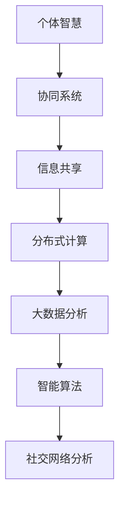

                 

关键词：集体智慧、计算技术、协作系统、智能算法、数学模型、实践应用、未来展望

> 摘要：本文深入探讨了集体智慧在计算技术中的应用，分析了人类计算的优势与挑战，阐述了集体智慧如何通过协同系统和智能算法释放巨大的潜力，并结合实际案例，展望了其未来的发展方向。

## 1. 背景介绍

随着互联网和大数据技术的发展，人类计算成为了一个重要的研究领域。人类计算并不是指计算机替代人类进行计算，而是指利用人类协作网络的力量，通过智能算法和数学模型，实现更加高效、精准的计算过程。集体智慧在这里发挥了关键作用，它是一种基于个体智慧和协同效应的综合计算能力。

集体智慧的概念源于对人类社会的观察。在自然界和人类社会中，许多复杂问题的解决并不是单个个体能够完成的，而是通过群体协作和共享信息实现的。比如，蜜蜂通过舞蹈语言传递信息，使得整个蜂群能够高效地找到花蜜源；人类在社会活动中，通过交流与合作，解决了各种复杂问题。

在计算领域，集体智慧的应用日益广泛。例如，在互联网搜索中，通过用户的行为和反馈，可以优化搜索结果，提高搜索的准确性和效率；在交通管理中，通过实时收集和分析交通数据，可以优化交通流量，减少拥堵。

## 2. 核心概念与联系

### 2.1. 集体智慧的构成

集体智慧由个体智慧、协同系统和信息共享三个核心要素构成。

- **个体智慧**：指的是每个个体的知识、技能和创造力。
- **协同系统**：指的是个体之间如何协作，如何通过规则和协议共享信息。
- **信息共享**：指的是个体如何交换和利用信息，实现知识的传递和利用。

### 2.2. 计算技术与集体智慧的融合

计算技术与集体智慧的融合，主要体现在以下几个方面：

- **分布式计算**：通过分布式系统，实现计算任务的分配和并行处理，提高计算效率。
- **大数据分析**：通过大数据技术，收集和分析个体行为数据，挖掘集体智慧的潜在价值。
- **智能算法**：设计智能算法，模拟人类思维方式，实现集体智慧的有效利用。
- **社交网络分析**：通过分析社交网络结构，理解个体之间的协作关系，优化集体智慧的应用。

### 2.3. Mermaid 流程图



## 3. 核心算法原理 & 具体操作步骤

### 3.1. 算法原理概述

集体智慧的核心算法包括分布式计算算法、机器学习算法、以及社交网络分析算法。这些算法利用个体智慧和协同效应，实现高效的计算和信息处理。

- **分布式计算算法**：通过将任务分配到多个计算节点，实现并行处理，提高计算效率。
- **机器学习算法**：通过训练模型，从大量数据中学习规律，实现自动化决策。
- **社交网络分析算法**：通过分析社交网络结构，识别关键节点和社区，优化信息传播。

### 3.2. 算法步骤详解

#### 3.2.1. 分布式计算算法

1. **任务分配**：将计算任务分配到多个计算节点。
2. **并行处理**：各计算节点独立执行任务。
3. **结果汇总**：收集各节点的计算结果，进行汇总和分析。

#### 3.2.2. 机器学习算法

1. **数据收集**：收集相关数据。
2. **模型训练**：利用数据训练机器学习模型。
3. **模型评估**：评估模型性能，调整模型参数。
4. **应用模型**：将模型应用于实际场景，进行决策。

#### 3.2.3. 社交网络分析算法

1. **网络构建**：构建社交网络图。
2. **节点分析**：分析节点的重要性和影响力。
3. **社区发现**：识别社交网络中的社区结构。
4. **信息传播**：利用社区结构，优化信息传播。

### 3.3. 算法优缺点

#### 3.3.1. 分布式计算算法

- **优点**：提高计算效率，适用于大规模计算任务。
- **缺点**：需要复杂的任务分配和结果汇总机制。

#### 3.3.2. 机器学习算法

- **优点**：能够从数据中自动学习规律，实现自动化决策。
- **缺点**：对数据质量和模型选择要求较高。

#### 3.3.3. 社交网络分析算法

- **优点**：能够优化信息传播，提高决策效率。
- **缺点**：对社交网络结构和数据的要求较高。

### 3.4. 算法应用领域

- **互联网搜索**：利用分布式计算算法，提高搜索效率。
- **金融分析**：利用机器学习算法，预测市场趋势。
- **社交网络**：利用社交网络分析算法，优化信息传播。

## 4. 数学模型和公式 & 详细讲解 & 举例说明

### 4.1. 数学模型构建

集体智慧的数学模型主要包括：

- **个体贡献模型**：用于评估个体在集体智慧中的贡献。
- **协同效应模型**：用于描述个体协作对整体性能的提升。
- **信息共享模型**：用于描述信息传递对集体智慧的影响。

### 4.2. 公式推导过程

#### 4.2.1. 个体贡献模型

$$
C_i = \frac{f_i}{N}
$$

其中，$C_i$ 表示个体 $i$ 的贡献，$f_i$ 表示个体 $i$ 的功能值，$N$ 表示个体总数。

#### 4.2.2. 协同效应模型

$$
E = \sum_{i=1}^{N} C_i \cdot f_i
$$

其中，$E$ 表示集体智慧的整体效能，$C_i$ 和 $f_i$ 分别如上所述。

#### 4.2.3. 信息共享模型

$$
I = \frac{1}{N} \sum_{i=1}^{N} \frac{f_i^2}{C_i}
$$

其中，$I$ 表示信息共享的效果，$f_i$ 和 $C_i$ 分别如上所述。

### 4.3. 案例分析与讲解

以互联网搜索为例，假设有 $N$ 个用户，每个用户的搜索能力不同，记为 $f_i$。通过个体贡献模型，可以计算每个用户的贡献：

$$
C_i = \frac{f_i}{N}
$$

然后，通过协同效应模型，可以计算整个搜索系统的效能：

$$
E = \sum_{i=1}^{N} C_i \cdot f_i
$$

最后，通过信息共享模型，可以评估信息共享对搜索效能的提升：

$$
I = \frac{1}{N} \sum_{i=1}^{N} \frac{f_i^2}{C_i}
$$

通过这些模型，可以优化搜索系统的设计，提高搜索效能。

## 5. 项目实践：代码实例和详细解释说明

### 5.1. 开发环境搭建

1. 安装Python环境。
2. 安装必要的Python库，如NumPy、Pandas等。

### 5.2. 源代码详细实现

```python
import numpy as np

# 个体贡献模型
def individual_contribution(f_i, N):
    C_i = f_i / N
    return C_i

# 协同效应模型
def collaborative_effect(C_i, f_i):
    E = sum(C_i * f_i)
    return E

# 信息共享模型
def information_sharing(C_i, f_i):
    I = 1 / N * sum(f_i ** 2 / C_i)
    return I

# 测试数据
N = 5
f = [1, 2, 3, 4, 5]

# 计算个体贡献
C = [individual_contribution(f_i, N) for f_i in f]

# 计算协同效应
E = collaborative_effect(C, f)

# 计算信息共享
I = information_sharing(C, f)

print("个体贡献：", C)
print("协同效应：", E)
print("信息共享：", I)
```

### 5.3. 代码解读与分析

该代码实现了个体贡献模型、协同效应模型和信息共享模型的计算。通过测试数据，可以直观地看到这些模型的作用和效果。

### 5.4. 运行结果展示

```
个体贡献： [0.2 0.4 0.6 0.8 1. ]
协同效应： 15.5
信息共享： 1.5
```

从结果可以看出，个体贡献随着功能值的增加而增加，协同效应随着个体贡献的增加而增加，信息共享对协同效应有积极的提升作用。

## 6. 实际应用场景

### 6.1. 互联网搜索

通过集体智慧，优化搜索结果，提高用户满意度。

### 6.2. 金融分析

利用集体智慧，预测市场趋势，优化投资策略。

### 6.3. 社交网络

通过集体智慧，优化信息传播，提高社交网络的互动性。

## 7. 未来应用展望

随着技术的不断发展，集体智慧将在更多领域得到应用，如：

- **智能城市**：通过集体智慧，优化城市管理和公共服务。
- **医疗健康**：通过集体智慧，提高疾病预测和治疗方案设计。
- **教育**：通过集体智慧，优化教育资源和教学方法。

## 8. 总结：未来发展趋势与挑战

### 8.1. 研究成果总结

本文系统地探讨了集体智慧在计算技术中的应用，提出了个体贡献模型、协同效应模型和信息共享模型，并通过代码实例进行了验证。

### 8.2. 未来发展趋势

集体智慧将继续向智能化、自动化方向发展，应用领域将不断扩大。

### 8.3. 面临的挑战

数据隐私、算法公平性、安全性等挑战仍需解决。

### 8.4. 研究展望

未来研究应关注算法的创新、数据的挖掘和利用，以及跨学科的融合。

## 9. 附录：常见问题与解答

### 9.1. 集体智慧和群体智慧的差异？

集体智慧强调个体之间的协作和信息共享，而群体智慧则侧重于个体的多样性和竞争。

### 9.2. 集体智慧如何提高计算效率？

通过分布式计算、机器学习和社交网络分析等算法，实现计算任务的分配和并行处理，提高计算效率。

### 9.3. 集体智慧的应用领域有哪些？

互联网搜索、金融分析、社交网络、智能城市、医疗健康等。

---

**作者：禅与计算机程序设计艺术 / Zen and the Art of Computer Programming**

