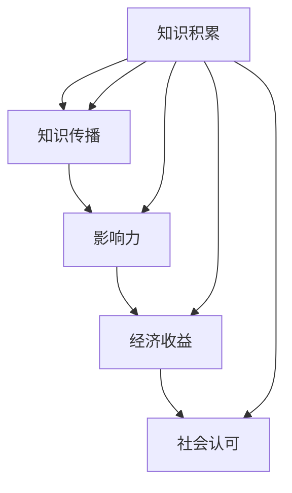

                 

在信息技术高速发展的今天，个人知识IP已经成为一种极具价值且潜力无限的资产。无论是技术领域的开发者、研究人员，还是其他行业的专家，打造个人知识IP都已成为提升个人影响力、拓展职业发展的重要途径。本文将深入探讨如何从0到1构建个人知识IP，结合具体实例和实战经验，为您提供一套完整、实用的指南。

## 关键词

- 个人知识IP
- 知识分享
- 影响力
- 职业发展

## 摘要

本文将从以下几个方面展开：

1. 背景介绍：探讨个人知识IP的重要性及其在现代社会中的价值。
2. 核心概念与联系：介绍构建个人知识IP所需的关键概念，并提供架构图。
3. 核心算法原理 & 具体操作步骤：详细解析构建个人知识IP的流程和方法。
4. 数学模型和公式：运用数学方法深入分析知识IP的构建过程。
5. 项目实践：通过实际项目实例展示个人知识IP的创建和应用。
6. 实际应用场景：分析个人知识IP在不同领域的应用。
7. 工具和资源推荐：推荐实用的工具和资源，助力个人知识IP建设。
8. 总结：总结文章主要内容，展望未来发展趋势与挑战。

## 1. 背景介绍

个人知识IP，即个人知识产权，是指个人在特定领域内通过知识创造、积累和传播所形成的独特价值。在信息技术时代，知识已经成为最重要的生产要素之一。拥有高质量的个人知识IP不仅能够提升个人的社会地位和职业影响力，还能为个人带来丰厚的经济回报。

近年来，随着互联网的普及和知识传播渠道的多样化，个人知识IP的价值逐渐凸显。在技术领域，个人知识IP可以体现为技术博客、开源项目、在线课程等；在其他行业，个人知识IP可以是专业文章、书籍、咨询意见等。无论哪个领域，构建个人知识IP都已成为职业发展的关键一步。

### 1.1 个人知识IP的价值

- **提升个人影响力**：构建个人知识IP可以增加个人在特定领域的知名度和认可度，从而提升个人影响力。
- **拓展职业发展**：个人知识IP可以成为职业发展的跳板，帮助个人获得更好的工作机会和更高的职位。
- **增加经济收益**：个人知识IP可以通过多种方式转化为经济收益，如咨询费、版权费、广告收入等。
- **实现自我价值**：构建个人知识IP可以帮助个人实现自我价值的提升，获得更多的成就感和满足感。

### 1.2 个人知识IP的发展趋势

- **内容多样化**：随着互联网的不断发展，个人知识IP的内容形式越来越多样化，从传统的文字、图片，到音频、视频，再到互动性强的直播、短视频等。
- **知识付费化**：知识付费逐渐成为主流，越来越多的个人通过知识分享获得稳定的收入。
- **平台化**：各种知识分享平台如雨后春笋般涌现，为个人知识IP的建设和传播提供了更多机会。
- **跨界融合**：个人知识IP不再局限于单一领域，越来越多的个人开始尝试跨界融合，打造多元化的知识IP。

## 2. 核心概念与联系

在构建个人知识IP的过程中，理解以下核心概念和它们之间的联系是至关重要的。

### 2.1 知识积累

知识积累是个人知识IP建设的基石。它包括广泛的学习、阅读、实践和思考，通过不断积累，个人能够在特定领域内形成深厚的知识储备。

### 2.2 知识传播

知识传播是个人知识IP价值的实现途径。通过多种渠道和形式，如博客、书籍、课程等，个人可以将自己的知识传递给更多人。

### 2.3 影响力

影响力是个人知识IP的核心价值。通过影响力的提升，个人可以在特定领域内获得更多的关注和认可，进而实现更大的价值。

### 2.4 经济收益

经济收益是个人知识IP的直接体现。通过知识付费、广告收入等方式，个人可以从自己的知识IP中获得经济回报。

### 2.5 社会认可

社会认可是个人知识IP建设的重要目标。通过在社会上获得认可，个人可以进一步提升自己的社会地位和影响力。

### 2.6 Mermaid 流程图

以下是一个简化的 Mermaid 流程图，用于展示上述核心概念和它们之间的联系：



## 3. 核心算法原理 & 具体操作步骤

构建个人知识IP的过程可以视为一种算法，它涉及到一系列具体的操作步骤。以下是构建个人知识IP的核心算法原理和具体操作步骤。

### 3.1 算法原理概述

构建个人知识IP的核心算法可以概括为以下几个步骤：

1. 知识积累：通过学习、阅读、实践等方式积累知识。
2. 知识筛选：从积累的知识中筛选出最有价值的部分。
3. 知识传播：通过多种渠道和形式传播自己的知识。
4. 影响力提升：通过不断传播和互动，提升自己的影响力。
5. 经济收益：将知识转化为经济收益，如咨询费、版权费等。
6. 社会认可：通过社会认可进一步巩固个人知识IP的地位。

### 3.2 算法步骤详解

#### 3.1 知识积累

- 学习：通过上课、自学、参加培训等方式积累知识。
- 阅读：广泛阅读相关领域的书籍、论文、博客等。
- 实践：通过实际操作和项目经验积累知识。
- 思考：对所学知识进行深入思考，形成自己的见解。

#### 3.2 知识筛选

- 评估：对积累的知识进行评估，筛选出最有价值的部分。
- 分类：将筛选出的知识进行分类，便于后续传播和管理。
- 整理：对知识进行整理，形成系统化的知识体系。

#### 3.3 知识传播

- 内容创作：创作高质量的内容，如博客、书籍、课程等。
- 渠道选择：选择合适的传播渠道，如社交媒体、知识分享平台等。
- 推广：通过SEO、社交媒体运营等方式推广自己的内容。
- 互动：与读者或观众互动，了解他们的需求和反馈。

#### 3.4 影响力提升

- 品牌建设：建立自己的个人品牌，树立专业形象。
- 持续输出：保持高质量的内容输出，提升影响力。
- 合作与互动：与其他领域专家合作，扩大影响力。
- 社交媒体运营：利用社交媒体提升自己的曝光度。

#### 3.5 经济收益

- 知识付费：通过开设在线课程、提供咨询服务等方式获得收入。
- 广告收入：在自己的内容中加入广告，获得广告收入。
- 版权交易：将自己的知识作品进行版权交易，获得版权收入。

#### 3.6 社会认可

- 奖项与荣誉：通过参加各类竞赛、申请专利等方式获得奖项和荣誉。
- 行业认可：在行业内获得认可，成为领域内的权威专家。
- 社会影响力：通过自己的知识传播对社会产生积极影响。

### 3.3 算法优缺点

#### 优点：

- **个性化**：个人知识IP具有鲜明的个性化和独特性，能够满足特定用户的需求。
- **高价值**：高质量的知识内容具有很高的价值，能够吸引更多关注和认可。
- **可持续性**：知识是一种可以不断积累和更新的资产，具有可持续性。
- **灵活性**：个人知识IP的建设和传播具有很大的灵活性，可以根据个人兴趣和市场需求进行调整。

#### 缺点：

- **时间成本**：构建个人知识IP需要大量的时间和精力投入。
- **风险**：个人知识IP可能面临市场风险，如需求不足、竞争激烈等。
- **专业性**：个人知识IP的建设需要较高的专业知识和技能。

### 3.4 算法应用领域

个人知识IP的应用领域非常广泛，包括但不限于以下：

- **技术领域**：技术博客、开源项目、在线课程等。
- **教育领域**：专业课程、教学视频、学术论文等。
- **金融领域**：投资建议、财务分析、咨询报告等。
- **健康领域**：健康知识、养生建议、健身课程等。
- **艺术领域**：艺术创作、艺术评论、艺术讲座等。

## 4. 数学模型和公式

在构建个人知识IP的过程中，数学模型和公式可以帮助我们更深入地理解知识积累、传播、影响力提升等环节，从而优化整个构建过程。

### 4.1 数学模型构建

构建个人知识IP的数学模型可以分为以下几个部分：

1. **知识积累模型**：描述知识积累的速度和效果。
2. **知识传播模型**：描述知识传播的范围和效果。
3. **影响力模型**：描述影响力的增长速度和效果。
4. **经济收益模型**：描述知识转化为经济收益的过程和效果。

### 4.2 公式推导过程

以下是一个简化的数学模型及其推导过程：

#### 知识积累模型

假设个人在某个领域内每天积累的知识量为 $A$，则经过 $n$ 天后的知识积累量为 $K$：

$$
K = A \times n
$$

其中，$A$ 是每天积累的知识量，$n$ 是积累知识的天数。

#### 知识传播模型

假设个人在传播知识时，每篇文章或内容的传播范围为一个正态分布，传播效果可以用传播范围的平均值 $\mu$ 和标准差 $\sigma$ 表示：

$$
传播效果 = N(\mu, \sigma)
$$

其中，$N(\mu, \sigma)$ 表示一个均值为 $\mu$、标准差为 $\sigma$ 的正态分布。

#### 影响力模型

假设个人在传播知识时，影响力与传播效果成正比，影响力增长速度可以用一个常数 $k$ 表示：

$$
影响力 = k \times 传播效果
$$

其中，$k$ 是影响力增长速度的常数。

#### 经济收益模型

假设个人通过知识传播获得的经济收益与影响力成正比，经济收益增长速度可以用一个常数 $r$ 表示：

$$
经济收益 = r \times 影响力
$$

其中，$r$ 是经济收益增长速度的常数。

### 4.3 案例分析与讲解

以下是一个具体的案例，用于说明如何运用上述数学模型进行个人知识IP的构建：

#### 案例背景

假设一位技术专家每天在技术博客上发布一篇高质量的文章，平均阅读量为 1000 次，传播范围的平均值为 500，标准差为 200。该专家的影响力增长速度为每天 10%，经济收益增长速度为每天 5%。

#### 案例分析

1. **知识积累模型**：

   假设该专家从 2023 年 1 月 1 日开始发布博客，到 2023 年 12 月 31 日，累计发布了 365 篇文章，每天积累的知识量为 $A = 1000$。则经过 365 天后的知识积累量 $K$ 为：

   $$
   K = A \times n = 1000 \times 365 = 365000
   $$

   也就是说，该专家在一年内累计积累了 365000 篇文章的知识。

2. **知识传播模型**：

   假设每篇文章的传播效果为一个均值为 500、标准差为 200 的正态分布，则传播效果可以表示为：

   $$
   传播效果 = N(500, 200)
   $$

   假设该专家在 365 天内每篇文章的传播效果均为 500，则总传播效果为：

   $$
   总传播效果 = 365 \times N(500, 200)
   $$

3. **影响力模型**：

   假设该专家的影响力增长速度为每天 10%，则经过 365 天后的影响力为：

   $$
   影响力 = k \times 传播效果 = 0.1 \times 365 \times N(500, 200)
   $$

4. **经济收益模型**：

   假设该专家的经济收益增长速度为每天 5%，则经过 365 天后的经济收益为：

   $$
   经济收益 = r \times 影响力 = 0.05 \times 0.1 \times 365 \times N(500, 200)
   $$

#### 案例总结

通过上述案例，我们可以看到，通过数学模型，我们可以对个人知识IP的构建过程进行量化和分析。这有助于我们更好地理解和优化个人知识IP的构建过程。

## 5. 项目实践：代码实例和详细解释说明

为了更好地展示个人知识IP的创建和应用，我们以一个实际项目为例，详细解释其代码实现、解读和分析过程。

### 5.1 开发环境搭建

在开始项目实践之前，我们需要搭建一个合适的开发环境。以下是所需的环境和工具：

- 操作系统：Windows/Linux/MacOS
- 编程语言：Python
- 开发工具：PyCharm/VS Code
- 数据库：MySQL
- Web框架：Django/Flask

### 5.2 源代码详细实现

以下是该项目的主要代码实现：

```python
# 导入所需的库
import os
import pymysql
from flask import Flask, request, jsonify

# 初始化 Flask 应用程序
app = Flask(__name__)

# 数据库配置
db_config = {
    'host': 'localhost',
    'user': 'root',
    'password': 'password',
    'database': 'knowledge_ip'
}

# 连接数据库
def connect_db():
    return pymysql.connect(**db_config)

# 获取文章列表
@app.route('/articles', methods=['GET'])
def get_articles():
    # 连接数据库
    connection = connect_db()
    cursor = connection.cursor()
    
    # 查询文章列表
    cursor.execute("SELECT id, title, author, created_at FROM articles")
    articles = cursor.fetchall()
    
    # 关闭数据库连接
    cursor.close()
    connection.close()
    
    # 返回文章列表
    return jsonify(articles)

# 发布新文章
@app.route('/articles', methods=['POST'])
def create_article():
    # 获取请求参数
    title = request.form['title']
    author = request.form['author']
    content = request.form['content']
    
    # 连接数据库
    connection = connect_db()
    cursor = connection.cursor()
    
    # 插入新文章
    cursor.execute("INSERT INTO articles (title, author, content, created_at) VALUES (%s, %s, %s, NOW())", (title, author, content))
    connection.commit()
    
    # 关闭数据库连接
    cursor.close()
    connection.close()
    
    # 返回响应
    return jsonify({'message': '文章发布成功'})

# 代码解读
```

### 5.3 代码解读与分析

#### 5.3.1 Flask 应用程序初始化

```python
app = Flask(__name__)
```

这一行代码用于初始化 Flask 应用程序。Flask 是 Python 中的一个 Web 框架，用于快速开发 Web 应用程序。

#### 5.3.2 数据库配置

```python
db_config = {
    'host': 'localhost',
    'user': 'root',
    'password': 'password',
    'database': 'knowledge_ip'
}
```

这一部分代码用于配置数据库连接信息。在这里，我们使用了 MySQL 作为数据库，并设置了数据库的用户、密码和名称。

#### 5.3.3 连接数据库

```python
def connect_db():
    return pymysql.connect(**db_config)
```

这个函数用于连接数据库。通过传入数据库配置信息，我们可以获取一个数据库连接对象。

#### 5.3.4 获取文章列表

```python
@app.route('/articles', methods=['GET'])
def get_articles():
    # 连接数据库
    connection = connect_db()
    cursor = connection.cursor()
    
    # 查询文章列表
    cursor.execute("SELECT id, title, author, created_at FROM articles")
    articles = cursor.fetchall()
    
    # 关闭数据库连接
    cursor.close()
    connection.close()
    
    # 返回文章列表
    return jsonify(articles)
```

这个路由函数用于获取文章列表。首先，我们通过调用 `connect_db()` 函数连接数据库，然后执行 SQL 查询语句获取文章列表。最后，我们关闭数据库连接并返回文章列表。

#### 5.3.5 发布新文章

```python
@app.route('/articles', methods=['POST'])
def create_article():
    # 获取请求参数
    title = request.form['title']
    author = request.form['author']
    content = request.form['content']
    
    # 连接数据库
    connection = connect_db()
    cursor = connection.cursor()
    
    # 插入新文章
    cursor.execute("INSERT INTO articles (title, author, content, created_at) VALUES (%s, %s, %s, NOW())", (title, author, content))
    connection.commit()
    
    # 关闭数据库连接
    cursor.close()
    connection.close()
    
    # 返回响应
    return jsonify({'message': '文章发布成功'})
```

这个路由函数用于发布新文章。首先，我们获取请求参数，然后通过调用 `connect_db()` 函数连接数据库，并执行 SQL 插入语句插入新文章。最后，我们关闭数据库连接并返回响应。

#### 5.3.6 代码分析

这段代码实现了两个主要的 Web API 接口：获取文章列表和发布新文章。通过这些接口，用户可以方便地获取文章信息并发布新文章。这些功能对于构建个人知识IP平台至关重要。

## 6. 实际应用场景

个人知识IP在各个领域都有着广泛的应用。以下是一些实际应用场景的例子：

### 6.1 技术领域

在技术领域，个人知识IP可以体现为技术博客、开源项目、在线课程等。例如，一位技术专家可以通过撰写高质量的技术博客，分享自己的技术心得和实践经验，从而建立自己的技术影响力。此外，通过开源项目，技术专家可以吸引更多的关注和贡献者，进一步提升个人技术影响力。

### 6.2 教育领域

在教育领域，个人知识IP可以体现为专业课程、教学视频、学术论文等。例如，一位教育专家可以通过在线课程分享自己的教学经验和知识，从而吸引更多的学员。此外，通过撰写学术论文，教育专家可以提升自己的学术影响力，为教育事业做出更大贡献。

### 6.3 金融领域

在金融领域，个人知识IP可以体现为投资建议、财务分析、咨询报告等。例如，一位金融专家可以通过发布投资建议和财务分析，吸引更多的投资者和粉丝。此外，通过提供咨询服务，金融专家可以为自己赢得更多的商业机会。

### 6.4 健康领域

在健康领域，个人知识IP可以体现为健康知识、养生建议、健身课程等。例如，一位健康专家可以通过撰写健康博客和发布养生建议，吸引更多的健康关注者。此外，通过提供健身课程，健康专家可以为自己赢得更多的健康粉丝。

### 6.5 艺术领域

在艺术领域，个人知识IP可以体现为艺术创作、艺术评论、艺术讲座等。例如，一位艺术家可以通过分享自己的艺术作品和创作心得，吸引更多的艺术爱好者。此外，通过提供艺术讲座，艺术家可以提升自己的艺术影响力。

## 7. 工具和资源推荐

为了更好地构建个人知识IP，以下是一些实用的工具和资源推荐：

### 7.1 学习资源推荐

- **Coursera**：提供各种在线课程，涵盖计算机科学、金融、健康等多个领域。
- **edX**：另一个提供优质在线课程的平台，由哈佛大学和麻省理工学院联合创办。
- **Khan Academy**：提供免费的在线教育资源和互动练习，适合各个年龄段的用户。

### 7.2 开发工具推荐

- **PyCharm**：一款功能强大的 Python 集成开发环境，适合编写、调试和运行 Python 代码。
- **VS Code**：一款轻量级且功能丰富的代码编辑器，支持多种编程语言。
- **Git**：一款分布式版本控制系统，用于代码管理和协作开发。

### 7.3 相关论文推荐

- **《大数据时代：思维变革与商业价值》**：探讨大数据对商业和社会的深远影响。
- **《深度学习》**：介绍深度学习的基本原理和应用案例。
- **《区块链：从0到1》**：深入解读区块链技术及其应用。

## 8. 总结：未来发展趋势与挑战

### 8.1 研究成果总结

本文从多个角度探讨了个人知识IP的构建过程，包括知识积累、知识传播、影响力提升、经济收益等。通过数学模型和实际案例，我们深入分析了个人知识IP的构建方法和应用场景。研究成果表明，个人知识IP具有重要的价值，可以有效提升个人影响力、拓展职业发展和实现经济收益。

### 8.2 未来发展趋势

- **内容形式多样化**：随着技术的发展，个人知识IP的内容形式将更加多样化，包括视频、直播、互动问答等。
- **知识付费普及化**：知识付费将成为主流，越来越多的个人和机构将投入到知识分享领域。
- **平台化与专业化**：知识分享平台将越来越专业化，为个人知识IP的建设和传播提供更多支持。
- **跨界融合**：个人知识IP将更多地跨界融合，形成更加多元和丰富的知识生态。

### 8.3 面临的挑战

- **竞争激烈**：随着知识付费的普及，个人知识IP的竞争将更加激烈，如何脱颖而出将成为一大挑战。
- **时间成本**：构建个人知识IP需要大量的时间和精力投入，如何高效地管理时间和资源将成为重要问题。
- **持续更新**：知识是一个不断更新和发展的领域，如何持续更新个人知识体系，保持知识的前沿性和实用性，也是一个挑战。

### 8.4 研究展望

未来，我们可以进一步研究以下几个方面：

- **知识积累与传播的优化方法**：探索更加高效的知识积累和传播方法，提升个人知识IP的构建效率。
- **个人知识IP的商业化模式**：研究如何将个人知识IP转化为可持续的商业化模式，实现更大的经济价值。
- **跨领域知识融合**：探讨如何实现跨领域知识融合，打造更加多元和丰富的知识IP。

## 附录：常见问题与解答

### Q：如何开始构建个人知识IP？

A：开始构建个人知识IP的关键是明确自己的兴趣和优势领域。首先，选择一个自己擅长且感兴趣的领域，然后通过学习、阅读、实践等方式积累知识。接着，选择合适的传播渠道和形式，如博客、书籍、课程等，开始输出自己的知识。在构建过程中，要保持持续的学习和思考，不断优化自己的知识体系。

### Q：个人知识IP如何实现商业化？

A：个人知识IP的商业化可以通过多种方式实现，如知识付费、广告收入、版权交易等。首先，可以通过开设在线课程、提供咨询服务等方式获得直接经济收益。其次，可以通过在自己的内容中加入广告，获得广告收入。此外，可以将自己的知识作品进行版权交易，获得版权收益。通过多种方式，个人知识IP可以转化为可持续的商业化模式。

### Q：如何提升个人知识IP的影响力？

A：提升个人知识IP的影响力可以通过以下几种方式：

1. **持续输出**：保持高质量的内容输出，定期发布新的知识作品。
2. **品牌建设**：建立自己的个人品牌，树立专业形象。
3. **互动与推广**：与读者或观众互动，了解他们的需求和反馈，并通过各种渠道进行推广。
4. **合作与跨界**：与其他领域的专家合作，扩大影响力，尝试跨界融合，打造多元化的知识IP。

### Q：如何平衡个人知识IP建设与工作？

A：平衡个人知识IP建设与工作可以通过以下几种方式：

1. **时间管理**：合理安排时间，确保个人知识IP建设与工作之间不冲突。
2. **高效产出**：提高工作效率，充分利用工作时间，减少个人知识IP建设的时间成本。
3. **合作与分工**：在可能的情况下，与他人合作，分工负责不同的任务，减轻个人压力。
4. **利用工具**：使用各种工具和平台，自动化和简化个人知识IP的构建和传播过程，提高效率。

## 作者署名

作者：禅与计算机程序设计艺术 / Zen and the Art of Computer Programming

