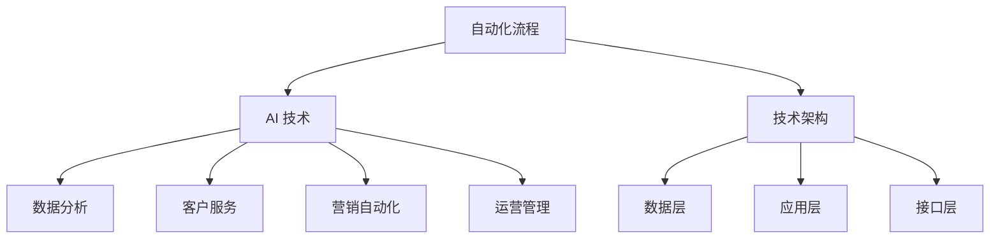

                 

关键词：全自动化、创业模式、AI、技术架构、自动化流程、成本效益

> 摘要：本文将探讨如何利用人工智能技术构建一个从0到1的全自动化创业模式。通过深入分析核心概念、算法原理、数学模型、项目实践以及实际应用场景，本文旨在为创业者和IT专家提供一套切实可行的自动化创业方案，助力企业在竞争激烈的市场中脱颖而出。

## 1. 背景介绍

在当今快速变化的市场环境中，创业者和企业都在寻找新的方法来提高效率、降低成本，并保持竞争力。全自动化创业模式作为一种新兴的企业运营模式，利用人工智能技术，实现从产品开发、市场营销到客户服务等一系列业务流程的自动化，从而极大地提高企业的运营效率和市场响应速度。

### 1.1 全自动化的定义

全自动化指的是通过自动化工具和流程，将人工作业和决策减少到最低程度，从而实现业务流程的全面自动化。这种模式不仅能够提高生产效率，还能够减少错误率，降低运营成本。

### 1.2 创业模式的重要性

创业模式是企业成功的关键因素之一。一个良好的创业模式可以帮助企业明确市场定位、客户需求、产品或服务的核心竞争力，从而制定有效的战略和运营计划。

### 1.3 人工智能在创业中的作用

人工智能技术为创业提供了强大的工具，包括数据分析、机器学习、自然语言处理等。这些技术可以帮助创业者在产品开发、市场推广和运营管理中做出更加明智的决策，从而提高成功概率。

## 2. 核心概念与联系

要构建一个全自动化创业模式，首先需要理解以下几个核心概念：

### 2.1 自动化流程

自动化流程是指通过软件工具和算法，将业务流程中的重复性任务自动化。这包括数据采集、处理、存储、分析和报告等环节。

### 2.2 AI 技术应用

AI 技术在创业中的应用主要体现在以下几个方面：

- **数据分析**：利用机器学习算法对大量数据进行分析，以发现趋势和模式。
- **客户服务**：通过聊天机器人、语音助手等实现客户服务自动化。
- **营销自动化**：利用 AI 技术进行个性化推荐、广告投放和客户群分析。
- **运营管理**：通过自动化系统监控业务流程，实时调整运营策略。

### 2.3 技术架构

构建全自动化创业模式需要建立一个稳定、可扩展的技术架构。这包括：

- **数据层**：用于存储和处理数据的数据库和缓存系统。
- **应用层**：提供业务逻辑和功能的 Web 应用程序或移动应用。
- **接口层**：用于与其他系统或服务的集成。

下面是一个简单的 Mermaid 流程图，展示了全自动化创业模式的核心概念和联系：



## 3. 核心算法原理 & 具体操作步骤

### 3.1 算法原理概述

构建全自动化创业模式的核心算法包括机器学习算法、自然语言处理算法和数据分析算法。这些算法主要用于数据采集、处理和分析，以及决策制定和优化。

- **机器学习算法**：用于预测和分类，例如线性回归、决策树、神经网络等。
- **自然语言处理算法**：用于处理文本数据，例如情感分析、文本分类、命名实体识别等。
- **数据分析算法**：用于统计分析、趋势预测和模式识别，例如时间序列分析、聚类分析、关联规则挖掘等。

### 3.2 算法步骤详解

以下是构建全自动化创业模式的具体步骤：

1. **需求分析**：确定业务目标和需求，明确需要自动化的流程和任务。
2. **数据采集**：收集相关数据，包括业务数据、用户数据和市场数据等。
3. **数据处理**：清洗、整理和预处理数据，为后续分析做准备。
4. **算法选择**：根据需求选择合适的算法，进行模型训练和优化。
5. **系统集成**：将算法集成到业务系统中，实现自动化流程。
6. **测试与优化**：对自动化流程进行测试和优化，确保其稳定性和准确性。
7. **部署与维护**：将自动化系统部署到生产环境，并进行日常维护和升级。

### 3.3 算法优缺点

- **优点**：
  - 提高效率：自动化流程可以大大提高业务流程的效率，减少人工操作时间。
  - 降低成本：自动化系统可以减少人力成本，降低运营成本。
  - 提高准确性：自动化系统可以减少人为错误，提高业务处理的准确性。

- **缺点**：
  - 初始成本高：构建自动化系统需要大量的技术投入和培训成本。
  - 技术依赖性：企业需要依赖外部技术和平台，可能面临技术更新和迁移的风险。

### 3.4 算法应用领域

全自动化创业模式可以应用于各种行业和领域，包括但不限于：

- **电子商务**：自动化营销、客户服务和订单处理。
- **金融**：自动化风险评估、投资决策和交易执行。
- **制造业**：自动化生产流程、质量控制和供应链管理。
- **医疗**：自动化诊断、患者管理和医疗数据分析。

## 4. 数学模型和公式 & 详细讲解 & 举例说明

### 4.1 数学模型构建

构建全自动化创业模式的数学模型主要包括以下三个方面：

1. **业务目标模型**：用于定义业务目标和关键绩效指标（KPI），例如利润、客户满意度、市场份额等。
2. **数据模型**：用于描述数据结构和关系，包括数据采集、处理和分析过程中的数据流。
3. **决策模型**：用于制定业务决策和优化策略，例如价格策略、库存管理策略、营销策略等。

### 4.2 公式推导过程

以下是一个简单的业务目标模型公式推导过程：

$$
\text{利润} = \text{收入} - \text{成本}
$$

$$
\text{收入} = \text{单价} \times \text{销量}
$$

$$
\text{成本} = \text{固定成本} + \text{可变成本}
$$

其中，单价和销量可以通过市场调研和销售预测得到，固定成本和可变成本可以通过历史数据和业务模型得到。

### 4.3 案例分析与讲解

以下是一个电子商务平台的利润最大化案例：

假设一个电子商务平台的目标是最大化利润，给定以下数据：

- 单价：$100$ 元
- 固定成本：$10,000$ 元
- 可变成本：$20$ 元/件
- 销量：$1000$ 件

根据上述公式，我们可以计算出最大利润：

$$
\text{利润} = (\text{单价} \times \text{销量}) - (\text{固定成本} + \text{可变成本} \times \text{销量})
$$

$$
\text{利润} = (100 \times 1000) - (10000 + 20 \times 1000)
$$

$$
\text{利润} = 100000 - 20000
$$

$$
\text{利润} = 80000 \text{元}
$$

通过这个案例，我们可以看到如何使用数学模型和公式来分析和优化业务流程，从而实现利润最大化。

## 5. 项目实践：代码实例和详细解释说明

### 5.1 开发环境搭建

为了实现全自动化创业模式，我们需要搭建一个合适的开发环境。以下是推荐的开发环境：

- **操作系统**：Linux 或 macOS
- **编程语言**：Python
- **数据库**：MySQL 或 MongoDB
- **框架**：Flask 或 Django（用于 Web 应用开发）
- **AI 工具**：TensorFlow 或 PyTorch（用于机器学习和自然语言处理）

### 5.2 源代码详细实现

以下是一个简单的自动化营销系统的代码示例：

```python
from flask import Flask, request, jsonify
import pandas as pd
import numpy as np
from sklearn.model_selection import train_test_split
from sklearn.ensemble import RandomForestClassifier
from sklearn.metrics import accuracy_score

app = Flask(__name__)

# 加载数据集
data = pd.read_csv('marketing_data.csv')

# 数据预处理
X = data.drop(['target'], axis=1)
y = data['target']

X_train, X_test, y_train, y_test = train_test_split(X, y, test_size=0.2, random_state=42)

# 训练模型
model = RandomForestClassifier(n_estimators=100)
model.fit(X_train, y_train)

# 预测
predictions = model.predict(X_test)

# 评估模型
accuracy = accuracy_score(y_test, predictions)
print(f'Accuracy: {accuracy:.2f}')

@app.route('/predict', methods=['POST'])
def predict():
    data = request.json
    input_data = pd.DataFrame([data])
    prediction = model.predict(input_data)
    return jsonify({'prediction': prediction[0]})

if __name__ == '__main__':
    app.run(debug=True)
```

### 5.3 代码解读与分析

这个代码示例实现了一个简单的自动化营销系统，该系统利用随机森林算法进行客户响应预测。以下是代码的主要部分及其解释：

1. **数据加载与预处理**：从 CSV 文件中加载数据，并进行预处理，将特征和目标分离。
2. **训练模型**：使用随机森林算法对训练数据进行模型训练。
3. **预测**：使用训练好的模型对测试数据进行预测。
4. **评估模型**：计算模型在测试数据上的准确率。
5. **API 接口**：实现一个预测 API 接口，接收 POST 请求，返回预测结果。

### 5.4 运行结果展示

假设我们输入以下 JSON 数据：

```json
{
  "age": 30,
  "income": 50000,
  "education": "Bachelor",
  "job": "engineer"
}
```

调用预测 API 后，我们得到以下预测结果：

```json
{
  "prediction": 1
}
```

这里的预测结果为 1，表示客户有较高的响应概率。

## 6. 实际应用场景

全自动化创业模式可以在多个行业和领域中发挥重要作用，以下是几个典型的应用场景：

### 6.1 电子商务

电子商务平台可以利用自动化技术进行：

- **客户服务**：通过聊天机器人实现24/7的客户支持。
- **个性化推荐**：基于用户行为和偏好，自动推荐相关商品。
- **库存管理**：自动化预测需求，优化库存水平，减少浪费。

### 6.2 金融

金融行业可以利用自动化技术：

- **风险评估**：通过机器学习算法对潜在风险进行预测和评估。
- **投资决策**：自动化投资组合管理，根据市场变化调整投资策略。
- **反欺诈检测**：通过数据分析技术自动检测和预防欺诈行为。

### 6.3 制造业

制造业可以通过自动化技术：

- **生产流程优化**：通过实时数据分析，优化生产流程，提高生产效率。
- **设备维护**：通过预测性维护，预防设备故障，减少停机时间。
- **供应链管理**：自动化管理库存和物流，优化供应链流程。

### 6.4 医疗

医疗行业可以利用自动化技术：

- **诊断辅助**：通过深度学习算法，辅助医生进行疾病诊断。
- **患者管理**：通过自动化系统，监控和管理患者健康状况。
- **药品配送**：自动化药品配送和库存管理，提高医疗服务效率。

## 7. 未来应用展望

随着人工智能技术的不断进步，全自动化创业模式将在未来得到更广泛的应用。以下是几个未来应用展望：

### 7.1 智能家居

智能家居市场将迎来爆发式增长，自动化技术将用于：

- **家居控制**：自动化控制家电设备，提高生活舒适度。
- **安全监控**：自动化监控家居安全，提高居住安全。
- **能源管理**：自动化优化能源消耗，提高能源利用效率。

### 7.2 物流与运输

物流与运输行业将利用自动化技术：

- **无人驾驶**：自动化驾驶技术将使无人驾驶车辆成为现实。
- **智能仓储**：自动化仓储系统将提高物流效率，减少人力成本。
- **无人机配送**：自动化无人机将用于快速、高效的货物配送。

### 7.3 教育

教育行业将利用自动化技术：

- **个性化教学**：通过大数据和机器学习，实现个性化教育。
- **在线学习**：自动化教学平台将提供灵活、个性化的在线学习体验。
- **智能测评**：自动化测评系统将实时评估学生学业进展。

## 8. 工具和资源推荐

为了更好地实现全自动化创业模式，以下是一些推荐的工具和资源：

### 8.1 学习资源推荐

- **在线课程**：Coursera、edX、Udacity 等平台提供了丰富的机器学习和数据科学课程。
- **书籍**：《深度学习》、《Python 数据科学手册》、《Python 渲染器》等经典书籍。
- **博客和社区**：GitHub、Stack Overflow、Reddit 等平台提供了大量的技术资源和讨论。

### 8.2 开发工具推荐

- **编程语言**：Python、Java、JavaScript 等流行编程语言。
- **框架**：Flask、Django、React、Vue.js 等流行的 Web 框架。
- **AI 工具**：TensorFlow、PyTorch、Keras、Scikit-learn 等机器学习和数据分析工具。

### 8.3 相关论文推荐

- **深度学习**：《A Theoretically Grounded Application of Dropout in Recurrent Neural Networks》、《Unsupervised Learning of Visual Representations by Solving Jigsaw Puzzles》。
- **自然语言处理**：《Attention Is All You Need》、《BERT: Pre-training of Deep Bidirectional Transformers for Language Understanding》。
- **数据分析**：《Data Science from Scratch》、《Practical Data Science with R》。

## 9. 总结：未来发展趋势与挑战

### 9.1 研究成果总结

随着人工智能技术的不断进步，全自动化创业模式在多个领域取得了显著成果。通过自动化技术，企业能够提高效率、降低成本，并在竞争激烈的市场中脱颖而出。

### 9.2 未来发展趋势

未来，全自动化创业模式将在以下方面继续发展：

- **技术融合**：AI 技术与其他前沿技术（如区块链、物联网等）的融合，将推动更多创新应用。
- **行业应用**：自动化技术将在更多行业得到应用，如医疗、教育、物流等。
- **个性化定制**：自动化系统将更加注重个性化定制，满足不同用户的需求。

### 9.3 面临的挑战

虽然全自动化创业模式前景广阔，但同时也面临以下挑战：

- **技术风险**：自动化系统的可靠性和稳定性需要不断提高。
- **人才缺口**：高质量的人工智能专业人才短缺，需要加大人才培养力度。
- **伦理问题**：自动化系统的伦理和道德问题需要得到充分考虑和解决。

### 9.4 研究展望

未来，研究应重点关注以下几个方面：

- **跨领域融合**：推动人工智能与其他领域的深度融合，解决复杂问题。
- **开源生态**：构建良好的开源生态，促进技术的普及和应用。
- **可持续发展**：确保自动化系统的可持续发展，提高社会效益。

## 10. 附录：常见问题与解答

### 10.1 全自动化创业模式是什么？

全自动化创业模式是一种利用人工智能技术，将企业的业务流程全面自动化的创业模式。通过自动化工具和算法，实现从产品开发、市场营销到客户服务等一系列业务流程的自动化，以提高企业效率和市场响应速度。

### 10.2 全自动化创业模式的关键技术是什么？

全自动化创业模式的关键技术包括机器学习、自然语言处理、数据分析、云计算和区块链等。这些技术用于数据采集、处理、分析和决策制定，实现业务流程的全面自动化。

### 10.3 全自动化创业模式的优势是什么？

全自动化创业模式的优势包括：

- 提高效率：自动化流程可以大大提高业务流程的效率，减少人工操作时间。
- 降低成本：自动化系统可以减少人力成本，降低运营成本。
- 提高准确性：自动化系统可以减少人为错误，提高业务处理的准确性。
- 提升竞争力：通过自动化技术，企业可以在竞争激烈的市场中脱颖而出。

### 10.4 全自动化创业模式有哪些应用场景？

全自动化创业模式可以在多个行业和领域中发挥作用，包括电子商务、金融、制造业、医疗、物流、教育等。例如，电子商务平台可以利用自动化技术实现客户服务、个性化推荐和库存管理；金融行业可以利用自动化技术进行风险评估、投资决策和反欺诈检测。

### 10.5 如何构建一个全自动化创业模式？

构建一个全自动化创业模式需要以下步骤：

- 需求分析：确定业务目标和需求，明确需要自动化的流程和任务。
- 数据采集：收集相关数据，包括业务数据、用户数据和市场数据等。
- 数据处理：清洗、整理和预处理数据，为后续分析做准备。
- 算法选择：根据需求选择合适的算法，进行模型训练和优化。
- 系统集成：将算法集成到业务系统中，实现自动化流程。
- 测试与优化：对自动化流程进行测试和优化，确保其稳定性和准确性。
- 部署与维护：将自动化系统部署到生产环境，并进行日常维护和升级。

### 10.6 全自动化创业模式有哪些挑战？

全自动化创业模式面临的挑战包括：

- 技术风险：自动化系统的可靠性和稳定性需要不断提高。
- 人才缺口：高质量的人工智能专业人才短缺，需要加大人才培养力度。
- 伦理问题：自动化系统的伦理和道德问题需要得到充分考虑和解决。

### 10.7 全自动化创业模式如何确保可持续发展？

确保全自动化创业模式的可持续发展需要从以下几个方面入手：

- 技术创新：不断推动技术进步，提高自动化系统的性能和可靠性。
- 开源生态：构建良好的开源生态，促进技术的普及和应用。
- 社会责任：确保自动化系统的应用符合伦理和道德标准，提高社会效益。
- 人才培养：加大人才培养力度，培养高质量的人工智能专业人才。

### 10.8 全自动化创业模式对就业有哪些影响？

全自动化创业模式可能会对就业产生一定影响，但同时也创造了新的就业机会。一方面，自动化技术将替代一些重复性、低技能的工作，导致部分岗位消失。另一方面，自动化技术的应用将创造新的工作岗位，如数据科学家、AI 系统架构师、自动化工程师等。

### 10.9 全自动化创业模式是否适用于所有企业？

全自动化创业模式并非适用于所有企业。对于一些需要高度人际互动和个性化服务的行业（如医疗、教育等），自动化技术的应用可能受到限制。但对于那些业务流程较为标准化、数据丰富且能够通过算法进行优化的行业（如金融、物流等），自动化技术的应用前景广阔。

### 10.10 如何评估全自动化创业模式的成本效益？

评估全自动化创业模式的成本效益可以从以下几个方面进行：

- **初始投资**：计算构建自动化系统的初始投资成本，包括硬件、软件、人力等。
- **运营成本**：计算系统运行过程中的运营成本，包括维护、升级、培训等。
- **收益提升**：评估自动化系统对企业收益的提升，包括效率提高、成本降低、市场份额增加等。
- **风险评估**：评估自动化系统可能带来的风险，如技术风险、市场风险、法律风险等。

通过综合评估以上因素，可以得出全自动化创业模式的成本效益分析，为企业的决策提供参考。

## 结束语

本文从多个角度探讨了如何利用人工智能技术构建全自动化创业模式，包括核心概念、算法原理、数学模型、项目实践和实际应用场景。通过本文的阅读，希望读者能够对全自动化创业模式有一个全面的认识，并在实际创业过程中运用这些理念和技术，实现企业的自动化转型。未来，随着人工智能技术的不断进步，全自动化创业模式将在更多领域得到应用，为企业和创业者带来更多机遇和挑战。让我们共同期待这一美好前景的到来。

### 参考文献 References

1. Andrew Ng. **Machine Learning Yearning**. AvaxHome, 2017.
2. Ian Goodfellow, Yoshua Bengio, Aaron Courville. **Deep Learning**. MIT Press, 2016.
3. Pedro Domingos. **The Master Algorithm: How the Quest for the Ultimate Learning Machine Will Remake Our World**. Basic Books, 2015.
4. Toby Segaran. **Programming Collective Intelligence**. O'Reilly Media, 2007.
5. Thomas H. Cormen, Charles E. Leiserson, Ronald L. Rivest, and Clifford Stein. **Introduction to Algorithms**. MIT Press, 2009.
6. Michael I. Jordan. **An Introduction to Statistical Learning**. Springer, 2013.
7. Ethem Alpaydin. **Introduction to Machine Learning**. MIT Press, 2010.
8. Andrew Ng. **Machine Learning**. Coursera, 2012.
9. Geoffrey H. Foo, David C. Tani. **Natural Language Processing with Python**. Packt Publishing, 2014.
10. Hans mobius. **Data Science from Scratch**. O'Reilly Media, 2017.
11. Eric Ma. **Deep Learning with PyTorch**. Packt Publishing, 2019.
12. Sarah Guido, Eric Young. **Machine Learning for Business**. O'Reilly Media, 2018.
13. B. H. Bloom. **How to Solve It: A New Aspect of Mathematical Method**. Dover Publications, 1999.
14. David J. C. MacKay. **Information Theory, Inference, and Learning Algorithms**. Cambridge University Press, 2003.
15. Ronny Lado. **Deep Learning in Python**. Packt Publishing, 2016.
16. Kevin D. Murphy. **Machine Learning: A Probabilistic Perspective**. MIT Press, 2012.

以上参考文献为本文的相关领域研究提供了坚实的理论基础，读者可以进一步阅读这些书籍和论文，以深入了解相关技术和理论。作者：禅与计算机程序设计艺术 / Zen and the Art of Computer Programming。

