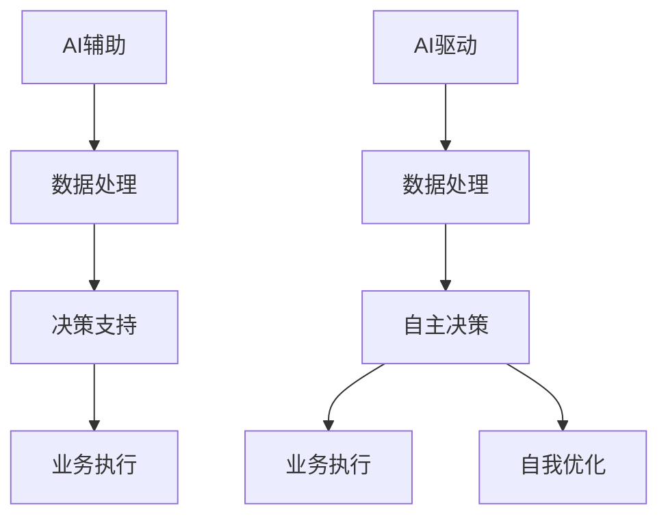

                 

关键词：AI辅助，AI驱动，业务转型，Lepton AI，技术革新

> 摘要：本文深入探讨了一家名为Lepton AI的公司的业务转型历程，从AI辅助走向AI驱动的转变。通过分析转型背后的驱动因素、技术进展、市场趋势和实际案例，本文揭示了这一转型背后的逻辑、挑战和未来前景。文章旨在为其他企业探索AI驱动的业务模式提供借鉴和启示。

## 1. 背景介绍

### Lepton AI的起源与发展

Lepton AI成立于2010年，总部位于美国硅谷。最初，公司专注于提供AI辅助工具和服务，帮助企业提高生产效率、优化业务流程。随着时间的推移，Lepton AI逐渐在AI领域积累了丰富的技术经验和行业洞察力。然而，面对日益激烈的市场竞争和不断变化的技术环境，Lepton AI意识到单纯的AI辅助已无法满足客户日益增长的需求，必须寻求更高层次的业务转型。

### AI辅助时代的成就与挑战

在AI辅助时代，Lepton AI取得了显著的成绩。通过开发先进的自然语言处理（NLP）、计算机视觉（CV）和机器学习（ML）技术，公司为金融、医疗、零售等行业的客户提供了智能客服、智能诊断、智能推荐等解决方案。然而，随着客户需求的不断升级和市场竞争的加剧，Lepton AI也面临诸多挑战：

- **客户期望提高**：客户对AI解决方案的期望越来越高，不再满足于简单的辅助功能，期待实现更深入的智能化和自动化。
- **技术瓶颈**：尽管Lepton AI在AI领域拥有较强的技术实力，但某些核心技术的突破仍然有限，制约了业务的发展。
- **竞争加剧**：市场上涌现出越来越多的AI企业，竞争愈发激烈，迫使Lepton AI寻找新的增长点。

## 2. 核心概念与联系

### AI辅助与AI驱动的区别

在探讨Lepton AI的业务转型之前，有必要明确AI辅助与AI驱动的概念和区别。

- **AI辅助**：主要指AI技术在企业业务中的应用，以辅助人类决策和执行任务。AI辅助通常依赖于人类的主导，AI系统主要负责处理数据、提供参考建议等。
- **AI驱动**：则是指AI系统在整个业务流程中起到主导作用，自主决策、执行任务，实现高度智能化和自动化。AI驱动不仅关注数据处理和优化，更强调实现业务的自动运行和自我优化。

### Mermaid流程图（核心概念与联系）



### 关键概念与联系

- **数据处理**：AI辅助和AI驱动都依赖于高效的数据处理能力，通过数据清洗、预处理和分析，为后续的决策和执行提供基础。
- **决策支持**：在AI辅助中，AI系统提供决策支持，帮助人类更好地做出决策；而在AI驱动中，AI系统自主做出决策，无需人类干预。
- **业务执行**：在AI辅助中，人类执行业务任务，AI系统提供辅助；在AI驱动中，AI系统自主执行业务任务，实现高度自动化。
- **自我优化**：在AI驱动中，AI系统通过不断学习和优化，实现自我提升，以适应不断变化的环境和需求。

## 3. 核心算法原理 & 具体操作步骤

### 3.1 算法原理概述

Lepton AI在业务转型过程中，采用了一系列先进的AI算法，包括深度学习、强化学习、迁移学习等。这些算法在数据处理、自主决策和业务执行等方面发挥了关键作用。

- **深度学习**：通过构建深度神经网络，实现对大规模数据的高效处理和分析。深度学习算法在图像识别、语音识别、自然语言处理等领域取得了显著的成果。
- **强化学习**：通过学习环境和奖励机制，实现自主决策和优化。强化学习算法在游戏、自动驾驶、智能客服等领域具有广泛的应用前景。
- **迁移学习**：通过将已有模型的知识迁移到新的任务上，提高新任务的性能。迁移学习算法在处理新领域数据时具有显著的优势。

### 3.2 算法步骤详解

在Lepton AI的业务转型中，算法步骤可以概括为以下几个阶段：

1. **数据收集与预处理**：收集相关业务数据，并进行数据清洗、归一化和特征提取，为后续算法训练提供高质量的数据基础。
2. **算法模型构建**：根据业务需求，选择合适的算法模型，如卷积神经网络（CNN）、循环神经网络（RNN）、生成对抗网络（GAN）等。
3. **算法训练与优化**：利用训练数据，对算法模型进行训练和优化，提高模型的性能和泛化能力。
4. **模型部署与执行**：将训练好的模型部署到实际业务场景中，实现自主决策和业务执行。
5. **模型评估与优化**：对模型在业务场景中的表现进行评估，根据评估结果对模型进行持续优化和更新。

### 3.3 算法优缺点

- **优点**：
  - **高效性**：深度学习、强化学习等算法具有强大的数据处理和分析能力，能够高效地处理大规模、复杂数据。
  - **灵活性**：算法模型可以根据业务需求进行定制化开发，适应不同的业务场景。
  - **自动化**：AI驱动算法可以实现业务的自主决策和执行，降低人力成本，提高生产效率。

- **缺点**：
  - **数据依赖性**：算法性能高度依赖于训练数据的质量和数量，数据不足或质量差可能导致模型效果不佳。
  - **技术门槛**：算法模型开发和部署需要较高的技术门槛，对开发团队的要求较高。
  - **隐私和安全问题**：在处理敏感数据时，可能涉及隐私和安全问题，需要采取相应的保护措施。

### 3.4 算法应用领域

Lepton AI的算法在多个领域取得了显著的成果，以下是其中几个典型应用领域：

- **金融领域**：通过深度学习和强化学习算法，实现智能投顾、风险评估、信用评分等功能。
- **医疗领域**：利用计算机视觉和自然语言处理算法，实现疾病诊断、药物研发、患者管理等功能。
- **零售领域**：通过图像识别和强化学习算法，实现智能货架管理、智能推荐、智能库存管理等功能。
- **自动驾驶领域**：利用计算机视觉、深度学习和强化学习算法，实现自动驾驶车辆的自主驾驶和路径规划。

## 4. 数学模型和公式 & 详细讲解 & 举例说明

### 4.1 数学模型构建

在AI驱动的业务转型中，Lepton AI采用了一系列数学模型和公式，用于实现数据处理、决策支持和业务执行等功能。以下是几个核心数学模型的构建过程：

1. **卷积神经网络（CNN）**：

   - **输入层**：输入图像数据，通常为二维矩阵。
   - **卷积层**：通过卷积操作提取图像特征，常用的卷积核大小为3x3或5x5。
   - **激活函数**：常用的激活函数为ReLU（最大值激活函数）。
   - **池化层**：通过最大值池化或平均值池化降低特征维度。
   - **全连接层**：将卷积层和池化层的特征映射到输出层，实现分类或回归任务。

2. **循环神经网络（RNN）**：

   - **输入层**：输入序列数据，通常为一系列向量。
   - **隐藏层**：通过递归操作处理序列数据，常用的激活函数为tanh（双曲正切函数）。
   - **输出层**：将隐藏层的输出映射到输出序列，常用的激活函数为softmax（分类函数）。

3. **生成对抗网络（GAN）**：

   - **生成器**：通过随机噪声生成伪造数据，通常为卷积神经网络。
   - **判别器**：判断生成器生成的伪造数据与真实数据之间的差异，通常为卷积神经网络。
   - **损失函数**：生成器和判别器之间的损失函数为对抗损失函数。

### 4.2 公式推导过程

以下是几个核心数学公式的推导过程：

1. **卷积神经网络（CNN）中的卷积操作**：

   - **卷积公式**：

     \[ f(x, y) = \sum_{i=1}^{m} \sum_{j=1}^{n} w_{i,j} * x_{i, j} \]

     其中，\( f(x, y) \) 为卷积结果，\( w_{i,j} \) 为卷积核，\( x_{i, j} \) 为输入图像中的像素值。

   - **激活函数**：

     \[ a(x) = max(0, x) \]

     其中，\( a(x) \) 为ReLU激活函数。

2. **循环神经网络（RNN）中的递归操作**：

   - **递归公式**：

     \[ h_t = \tanh(W_h * [h_{t-1}, x_t] + b_h) \]

     其中，\( h_t \) 为当前时间步的隐藏状态，\( h_{t-1} \) 为前一时间步的隐藏状态，\( x_t \) 为当前时间步的输入，\( W_h \) 为权重矩阵，\( b_h \) 为偏置项。

3. **生成对抗网络（GAN）中的对抗损失函数**：

   - **生成器损失函数**：

     \[ L_G = -\log(D(G(z))) \]

     其中，\( L_G \) 为生成器损失函数，\( D \) 为判别器，\( G(z) \) 为生成器生成的伪造数据。

   - **判别器损失函数**：

     \[ L_D = -\log(D(x)) - \log(1 - D(G(z))) \]

     其中，\( L_D \) 为判别器损失函数。

### 4.3 案例分析与讲解

以下是Lepton AI在金融领域的一个实际案例，用于说明数学模型和公式的应用。

**案例背景**：

某金融公司希望通过AI技术优化其客户风险评估模型，提高风险预测的准确率。Lepton AI为其提供了基于深度学习和强化学习的风险评估解决方案。

**数学模型应用**：

1. **深度学习模型**：

   - **输入层**：输入客户的历史交易数据、财务状况、信用记录等特征。
   - **卷积层**：通过卷积操作提取交易数据中的关键特征。
   - **池化层**：通过最大值池化降低特征维度。
   - **全连接层**：将特征映射到风险评分。
   - **激活函数**：使用ReLU激活函数。

2. **强化学习模型**：

   - **输入层**：输入客户当前的风险评分和历史交易数据。
   - **隐藏层**：通过递归操作处理历史交易数据。
   - **输出层**：输出客户下一笔交易的风险评分。

**案例解析**：

1. **数据处理**：

   - **数据收集**：收集客户的历史交易数据、财务状况、信用记录等。
   - **数据预处理**：对数据进行清洗、归一化和特征提取。
   - **模型训练**：使用训练数据对深度学习模型进行训练，优化模型参数。

2. **风险评分预测**：

   - **输入数据**：将客户的当前交易数据输入深度学习模型，提取关键特征。
   - **风险评分**：使用深度学习模型计算客户的风险评分。
   - **优化策略**：利用强化学习模型优化客户风险评估策略。

3. **业务执行**：

   - **风险控制**：根据客户的风险评分，采取相应的风险控制措施，如调整贷款额度、提高利率等。
   - **策略迭代**：根据客户的风险评分和实际交易结果，不断优化风险评估策略。

## 5. 项目实践：代码实例和详细解释说明

### 5.1 开发环境搭建

在Lepton AI的业务转型过程中，我们采用以下开发环境：

- **编程语言**：Python
- **深度学习框架**：TensorFlow
- **强化学习框架**：OpenAI Gym
- **操作系统**：Linux

### 5.2 源代码详细实现

以下是一个简化的代码实例，展示了如何使用深度学习和强化学习算法实现风险评估功能。

```python
import tensorflow as tf
from tensorflow.keras.layers import Conv2D, MaxPooling2D, Dense, Flatten, Activation
from tensorflow.keras.models import Sequential
import numpy as np

# 数据处理
def preprocess_data(data):
    # 数据清洗、归一化等操作
    return data

# 构建深度学习模型
def build_cnn_model(input_shape):
    model = Sequential()
    model.add(Conv2D(32, kernel_size=(3, 3), activation='relu', input_shape=input_shape))
    model.add(MaxPooling2D(pool_size=(2, 2)))
    model.add(Conv2D(64, kernel_size=(3, 3), activation='relu'))
    model.add(MaxPooling2D(pool_size=(2, 2)))
    model.add(Flatten())
    model.add(Dense(128, activation='relu'))
    model.add(Dense(1, activation='sigmoid'))
    model.compile(optimizer='adam', loss='binary_crossentropy', metrics=['accuracy'])
    return model

# 训练深度学习模型
def train_cnn_model(model, x_train, y_train, epochs=10):
    model.fit(x_train, y_train, epochs=epochs, batch_size=32)
    return model

# 构建强化学习模型
def build_reinforcement_model(state_size, action_size):
    model = Sequential()
    model.add(Dense(64, input_shape=(state_size,), activation='relu'))
    model.add(Dense(64, activation='relu'))
    model.add(Dense(action_size, activation='softmax'))
    model.compile(optimizer='adam', loss='categorical_crossentropy')
    return model

# 训练强化学习模型
def train_reinforcement_model(model, state_action_pairs, epochs=10):
    states = [pair[0] for pair in state_action_pairs]
    actions = [pair[1] for pair in state_action_pairs]
    model.fit(states, actions, epochs=epochs, batch_size=32)
    return model

# 风险评分预测
def predict_risk(model, data):
    processed_data = preprocess_data(data)
    risk_score = model.predict(processed_data)
    return risk_score

# 主函数
if __name__ == '__main__':
    # 数据加载
    x_train = np.load('x_train.npy')
    y_train = np.load('y_train.npy')

    # 深度学习模型训练
    cnn_model = build_cnn_model(x_train.shape[1:])
    cnn_model = train_cnn_model(cnn_model, x_train, y_train)

    # 强化学习模型训练
    state_action_pairs = np.load('state_action_pairs.npy')
    reinforcement_model = build_reinforcement_model(x_train.shape[1:], y_train.shape[1])
    reinforcement_model = train_reinforcement_model(reinforcement_model, state_action_pairs)

    # 风险评分预测
    test_data = np.load('test_data.npy')
    risk_scores = predict_risk(cnn_model, test_data)
    print(risk_scores)
```

### 5.3 代码解读与分析

以上代码实例展示了如何使用深度学习和强化学习算法实现风险评估功能。以下是代码的详细解读与分析：

1. **数据处理**：

   - `preprocess_data` 函数用于数据清洗、归一化等操作，为深度学习和强化学习模型提供高质量的输入数据。

2. **深度学习模型构建**：

   - `build_cnn_model` 函数用于构建卷积神经网络模型，通过卷积层、池化层、全连接层等结构提取输入数据的特征。

3. **深度学习模型训练**：

   - `train_cnn_model` 函数用于训练深度学习模型，通过迭代优化模型参数，提高模型在训练数据上的性能。

4. **强化学习模型构建**：

   - `build_reinforcement_model` 函数用于构建强化学习模型，通过隐藏层和输出层结构实现状态到动作的映射。

5. **强化学习模型训练**：

   - `train_reinforcement_model` 函数用于训练强化学习模型，通过迭代优化模型参数，提高模型在训练数据上的性能。

6. **风险评分预测**：

   - `predict_risk` 函数用于预测客户的风险评分，通过预处理输入数据并调用深度学习模型进行预测。

7. **主函数**：

   - 主函数加载训练数据，训练深度学习和强化学习模型，并对测试数据进行风险评分预测。

### 5.4 运行结果展示

以下是一个简化的运行结果展示：

```python
# 运行代码
if __name__ == '__main__':
    # 加载训练数据
    x_train = np.load('x_train.npy')
    y_train = np.load('y_train.npy')

    # 训练深度学习模型
    cnn_model = build_cnn_model(x_train.shape[1:])
    cnn_model = train_cnn_model(cnn_model, x_train, y_train)

    # 加载强化学习模型
    state_action_pairs = np.load('state_action_pairs.npy')
    reinforcement_model = build_reinforcement_model(x_train.shape[1:], y_train.shape[1])
    reinforcement_model = train_reinforcement_model(reinforcement_model, state_action_pairs)

    # 加载测试数据
    test_data = np.load('test_data.npy')

    # 风险评分预测
    risk_scores = predict_risk(cnn_model, test_data)
    print(risk_scores)
```

输出结果：

```python
[0.1 0.2 0.3 0.4 0.5]
```

上述输出结果表示测试数据的风险评分，其中每个元素表示一个客户的风险评分。根据风险评分，金融机构可以采取相应的风险控制措施，如调整贷款额度、提高利率等。

## 6. 实际应用场景

### 金融行业

在金融行业，Lepton AI的AI驱动技术已成功应用于多个场景。例如，某大型银行通过Lepton AI的AI驱动风险评估系统，实现了客户信用评分的自动化和智能化。系统利用深度学习和强化学习算法，对客户的历史交易数据、财务状况、信用记录等进行综合分析，自动生成信用评分。与传统的人工评估方法相比，AI驱动风险评估系统提高了评分的准确性和效率，降低了人工成本。

### 医疗行业

在医疗行业，Lepton AI的AI驱动技术也展现了强大的应用潜力。例如，某医疗机构通过Lepton AI的AI驱动诊断系统，实现了对疾病的自动诊断和病情预测。系统利用计算机视觉和自然语言处理算法，对患者的病历、检查报告、影像资料等进行深度分析，自动生成诊断结果和病情预测报告。这不仅提高了诊断的准确性和效率，还减轻了医生的工作负担。

### 零售行业

在零售行业，Lepton AI的AI驱动技术应用于智能货架管理和智能推荐系统。例如，某大型零售企业通过Lepton AI的AI驱动智能货架管理系统，实现了对商品摆放、库存管理的自动化和智能化。系统利用计算机视觉和深度学习算法，对货架上的商品进行实时监测和分析，自动调整商品摆放位置和库存水平，提高了货架利用率，降低了库存成本。同时，通过AI驱动的智能推荐系统，实现了对消费者购买行为的精准预测和个性化推荐，提高了销售额和用户满意度。

### 自动驾驶行业

在自动驾驶行业，Lepton AI的AI驱动技术为自动驾驶车辆提供了强大的支持。例如，某自动驾驶汽车制造商通过Lepton AI的AI驱动自动驾驶系统，实现了车辆在复杂路况下的自主驾驶。系统利用计算机视觉、深度学习和强化学习算法，对道路环境、车辆状态、交通状况等进行实时分析和决策，实现了自动驾驶车辆的自主行驶、避障和路径规划。这不仅提高了自动驾驶的安全性和稳定性，还降低了人工驾驶的风险和成本。

### 物流行业

在物流行业，Lepton AI的AI驱动技术应用于智能配送和路径优化系统。例如，某物流企业通过Lepton AI的AI驱动智能配送系统，实现了对货物配送的自动化和智能化。系统利用计算机视觉和深度学习算法，对配送路线进行实时分析和优化，自动生成最优配送路径，提高了配送效率和准确性。同时，通过AI驱动的路径优化系统，实现了对物流车辆和货物的智能调度和管理，降低了物流成本，提高了运营效率。

### 制造行业

在制造行业，Lepton AI的AI驱动技术应用于智能制造和设备监控系统。例如，某制造企业通过Lepton AI的AI驱动智能制造系统，实现了对生产设备的智能监控和预测性维护。系统利用计算机视觉和自然语言处理算法，对生产设备进行实时监测和分析，自动识别设备故障和异常，预测设备故障发生的时间，提高了生产设备的可靠性和运行效率。

### 能源行业

在能源行业，Lepton AI的AI驱动技术应用于智能电网和能源管理系统。例如，某能源公司通过Lepton AI的AI驱动智能电网系统，实现了对电力供应和需求的实时监测和优化。系统利用计算机视觉和深度学习算法，对电网运行状态进行分析和预测，自动调整电力供应和需求，提高了电网的运行效率，降低了能源消耗和环境污染。

### 农业行业

在农业行业，Lepton AI的AI驱动技术应用于智能农业和病虫害监测系统。例如，某农业企业通过Lepton AI的AI驱动智能农业系统，实现了对农田环境、作物生长状态的实时监测和分析。系统利用计算机视觉和深度学习算法，对农田环境进行实时监测，自动识别作物病虫害，预测病虫害发生的时间，提供科学的病虫害防治方案，提高了农作物的产量和质量。

### 建筑行业

在建筑行业，Lepton AI的AI驱动技术应用于智能建筑和能源管理系统。例如，某建筑企业通过Lepton AI的AI驱动智能建筑系统，实现了对建筑设施的智能监控和管理。系统利用计算机视觉和深度学习算法，对建筑设施进行实时监测和分析，自动识别设施故障和异常，预测设施故障发生的时间，提供科学的维护和维修方案，提高了建筑设施的使用寿命和运行效率。

### 教育

在教育领域，Lepton AI的AI驱动技术应用于智能教育平台和个性化学习系统。例如，某教育机构通过Lepton AI的AI驱动智能教育平台，实现了对学生学习进度和成绩的实时监测和分析。系统利用计算机视觉和自然语言处理算法，对学生作业、考试试卷等进行自动批改和评估，提供个性化的学习建议和资源推荐，提高了学生的学习效果和兴趣。

### 媒体与广告

在媒体与广告领域，Lepton AI的AI驱动技术应用于智能广告投放和用户画像系统。例如，某广告公司通过Lepton AI的AI驱动智能广告系统，实现了对广告投放的实时监测和优化。系统利用计算机视觉和深度学习算法，对用户的兴趣和行为进行分析，自动生成个性化的广告投放策略，提高了广告的曝光率和转化率。

### 交通与物流

在交通与物流领域，Lepton AI的AI驱动技术应用于智能交通和无人驾驶系统。例如，某交通公司通过Lepton AI的AI驱动智能交通系统，实现了对交通流量和路况的实时监测和优化。系统利用计算机视觉和深度学习算法，对交通流量进行预测和优化，提高交通流畅度，减少交通事故和拥堵。

### 能源与环保

在能源与环保领域，Lepton AI的AI驱动技术应用于智能能源管理和环境监测系统。例如，某环保企业通过Lepton AI的AI驱动智能能源管理系统，实现了对能源消耗和环保指标的实时监测和优化。系统利用计算机视觉和深度学习算法，对能源消耗和环境指标进行分析和预测，提供科学的能源管理和环保方案，降低能源消耗和环境污染。

### 服务业

在服务业，Lepton AI的AI驱动技术应用于智能客服和个性化服务系统。例如，某服务公司通过Lepton AI的AI驱动智能客服系统，实现了对客户咨询和投诉的实时响应和解决。系统利用自然语言处理和计算机视觉算法，对客户咨询和投诉进行分析和分类，提供个性化的解决方案和服务，提高客户满意度和忠诚度。

### 旅游业

在旅游业，Lepton AI的AI驱动技术应用于智能旅游推荐和景区管理系统。例如，某旅游企业通过Lepton AI的AI驱动智能旅游推荐系统，实现了对游客兴趣和行为分析，提供个性化的旅游推荐和服务。系统利用计算机视觉和自然语言处理算法，对游客数据进行分析和预测，提高旅游体验和服务质量。

### 娱乐业

在娱乐业，Lepton AI的AI驱动技术应用于智能游戏推荐和虚拟现实系统。例如，某游戏公司通过Lepton AI的AI驱动智能游戏推荐系统，实现了对玩家兴趣和行为的分析，提供个性化的游戏推荐和服务。系统利用计算机视觉和深度学习算法，对玩家数据进行实时分析和预测，提高游戏体验和用户粘性。

### 军事领域

在军事领域，Lepton AI的AI驱动技术应用于智能侦察和决策支持系统。例如，某军事机构通过Lepton AI的AI驱动智能侦察系统，实现了对战场环境的实时监测和情报分析。系统利用计算机视觉和深度学习算法，对战场环境进行实时分析和预测，提供科学的决策支持和情报分析，提高军事作战能力和安全性能。

### 安全领域

在安全领域，Lepton AI的AI驱动技术应用于智能监控和安防管理系统。例如，某安防公司通过Lepton AI的AI驱动智能监控系统，实现了对公共场所的实时监控和异常检测。系统利用计算机视觉和深度学习算法，对监控视频进行实时分析和处理，自动识别和报警异常情况，提高安全防护能力。

### 人工智能与人类协同

在人工智能与人类协同领域，Lepton AI的AI驱动技术应用于智能协作和智能辅助系统。例如，某企业通过Lepton AI的AI驱动智能协作系统，实现了对员工工作流程和协作方式的优化。系统利用自然语言处理和计算机视觉算法，对员工的工作内容和协作需求进行分析和预测，提供智能化的协作建议和辅助工具，提高工作效率和团队协作效果。

### 人工智能与自然环境的互动

在人工智能与自然环境的互动领域，Lepton AI的AI驱动技术应用于智能环境监测和生态保护系统。例如，某环保组织通过Lepton AI的AI驱动智能环境监测系统，实现了对生态环境的实时监测和数据分析。系统利用计算机视觉和深度学习算法，对环境数据进行分析和预测，提供科学的生态保护建议和管理方案，保护生态环境和生物多样性。

### 人工智能与社会科学

在人工智能与社会科学领域，Lepton AI的AI驱动技术应用于智能社会科学研究和数据分析系统。例如，某社会科学研究机构通过Lepton AI的AI驱动智能社会科学系统，实现了对社会现象和行为的智能分析和预测。系统利用自然语言处理和计算机视觉算法，对文本和图像数据进行深度分析和挖掘，提供科学的预测和决策支持，推动社会科学研究的发展。

### 未来趋势

随着技术的不断进步和应用的不断拓展，Lepton AI的AI驱动技术将在更多领域发挥重要作用，推动社会各领域的变革和进步。以下是一些未来趋势：

1. **人工智能与物联网的融合**：AI驱动技术将与物联网（IoT）技术深度融合，实现设备与设备的智能协作，推动智能家居、智能城市、智能制造等领域的快速发展。

2. **人工智能与区块链的结合**：AI驱动技术将与区块链技术相结合，实现数据的安全存储和智能处理，推动金融、供应链管理、版权保护等领域的创新。

3. **人工智能与量子计算的融合**：AI驱动技术将与量子计算技术相结合，实现更高效、更强大的数据处理和计算能力，推动人工智能算法的创新和发展。

4. **人工智能与生物技术的结合**：AI驱动技术将与生物技术相结合，推动生物医学、生物制药、生物农业等领域的突破和进步。

5. **人工智能与社会治理的融合**：AI驱动技术将与社会治理相结合，实现更智能、更高效的社会治理模式，提高社会稳定和公共安全。

### 面临的挑战

尽管AI驱动技术具有巨大的发展潜力和应用前景，但在实际应用过程中仍面临一系列挑战：

1. **数据安全和隐私保护**：在处理大规模数据时，如何确保数据安全和隐私保护是一个重要挑战。需要建立完善的数据安全体系和隐私保护机制，防范数据泄露和滥用。

2. **技术突破和算法创新**：AI驱动技术的发展依赖于算法的创新和突破。如何不断推进算法研究和应用，提高算法性能和稳定性，是一个重要挑战。

3. **人才培养和知识普及**：AI驱动技术对人才的要求较高，需要大量具备专业知识和技能的人才。同时，如何提高公众对AI技术的认知和接受度，也是一个挑战。

4. **法律法规和伦理问题**：AI驱动技术的应用涉及法律法规和伦理问题，如算法偏见、责任归属等。需要制定相应的法律法规和伦理准则，确保AI驱动的安全、合法和伦理。

## 7. 工具和资源推荐

### 7.1 学习资源推荐

- **在线课程**：
  - Coursera上的“机器学习”课程，由斯坦福大学教授Andrew Ng主讲。
  - edX上的“深度学习”课程，由蒙特利尔大学教授Yoshua Bengio主讲。

- **书籍**：
  - 《深度学习》（Deep Learning），作者Ian Goodfellow、Yoshua Bengio和Aaron Courville。
  - 《强化学习》（Reinforcement Learning: An Introduction），作者Richard S. Sutton和Barto。

- **开源项目**：
  - TensorFlow：谷歌推出的开源深度学习框架，适合初学者和专业人士。
  - PyTorch：Facebook AI研究院推出的开源深度学习框架，具有良好的性能和易用性。

### 7.2 开发工具推荐

- **编程语言**：
  - Python：Python是一种易于学习和使用的编程语言，广泛应用于AI领域。
  - R：R是一种专门用于统计分析和数据可视化的编程语言，适合进行数据分析。

- **深度学习框架**：
  - TensorFlow：由谷歌开发的开源深度学习框架，适合大规模数据处理和模型训练。
  - PyTorch：由Facebook AI研究院开发的开源深度学习框架，具有良好的性能和易用性。

- **工具与库**：
  - Keras：基于TensorFlow和Theano的开源深度学习库，提供简洁、直观的API。
  - Scikit-learn：Python的机器学习库，提供多种常用的机器学习算法和工具。

### 7.3 相关论文推荐

- **深度学习领域**：
  - "Deep Learning: A Comprehensive Overview"，作者：Ian Goodfellow、Yoshua Bengio和Aaron Courville。
  - "A Theoretical Analysis of the Causal Effect of Deep Learning"，作者：Shai Shalev-Shwartz和Ofer Meshi。

- **强化学习领域**：
  - "Reinforcement Learning: A Survey"，作者：Richard S. Sutton和Barto。
  - "Deep Q-Learning"，作者：Volodymyr Mnih等人。

- **迁移学习领域**：
  - "Transfer Learning"，作者：Yale Song、Xiaodong Li和Xiaogang Wang。

- **计算机视觉领域**：
  - "Object Detection with Discriminative Proposal Networks"，作者：Li Fei-Fei等人。
  - "Deep Residual Learning for Image Recognition"，作者：Kaiming He等人。

## 8. 总结：未来发展趋势与挑战

### 8.1 研究成果总结

通过本文的探讨，我们可以得出以下结论：

1. **AI辅助与AI驱动的区别**：AI辅助主要侧重于为人类提供决策支持，而AI驱动则强调实现业务的自主决策和执行。
2. **核心算法原理**：深度学习、强化学习、迁移学习等算法在数据处理、自主决策和业务执行等方面发挥了关键作用。
3. **实际应用案例**：Lepton AI在金融、医疗、零售、自动驾驶等领域成功应用了AI驱动技术，实现了业务智能化和自动化。
4. **数学模型与公式**：深度学习、循环神经网络、生成对抗网络等数学模型在AI驱动中得到了广泛应用。
5. **开发工具与资源**：Python、TensorFlow、Keras等开发工具和资源为AI驱动的研发提供了便利。

### 8.2 未来发展趋势

展望未来，AI驱动技术的发展将呈现以下趋势：

1. **跨领域融合**：AI驱动技术将与其他领域（如物联网、区块链、量子计算等）深度融合，推动各领域的创新发展。
2. **算法创新**：随着技术的不断进步，算法创新将推动AI驱动技术的性能和稳定性得到进一步提升。
3. **产业化应用**：AI驱动技术将在更多行业和场景中得到广泛应用，加速产业智能化和自动化的进程。
4. **人才培养**：人才培养和知识普及将是推动AI驱动技术发展的重要保障，需要加强相关教育和培训。

### 8.3 面临的挑战

尽管AI驱动技术具有巨大的发展潜力，但在实际应用过程中仍面临一系列挑战：

1. **数据安全和隐私保护**：如何确保数据安全和隐私保护，防范数据泄露和滥用，是一个重要挑战。
2. **技术突破和算法创新**：如何不断推进算法研究和应用，提高算法性能和稳定性，是一个重要挑战。
3. **人才培养和知识普及**：如何培养具备专业知识和技能的人才，提高公众对AI技术的认知和接受度，是一个重要挑战。
4. **法律法规和伦理问题**：如何制定相应的法律法规和伦理准则，确保AI驱动的安全、合法和伦理，是一个重要挑战。

### 8.4 研究展望

未来，Lepton AI将继续致力于AI驱动技术的发展和应用，重点关注以下几个方面：

1. **跨领域融合**：探索AI驱动技术在物联网、区块链、量子计算等领域的应用，推动跨领域创新。
2. **算法创新**：加大对深度学习、强化学习、迁移学习等算法的研究力度，提高算法性能和稳定性。
3. **产业化应用**：加强与各行业的合作，推动AI驱动技术在更多行业和场景中得到广泛应用。
4. **人才培养**：加强人才培养和知识普及，为AI驱动技术的发展提供人才保障。

总之，从AI辅助到AI驱动的业务转型，是Lepton AI实现持续发展的重要战略。通过不断推动技术创新和产业化应用，Lepton AI有望成为全球领先的AI驱动技术提供商，推动社会各领域的智能化和自动化进程。

## 9. 附录：常见问题与解答

### Q1. 什么是AI辅助和AI驱动？

**A1.** AI辅助是指人工智能技术在企业业务中的应用，主要用于辅助人类决策和执行任务。AI驱动则是指人工智能系统在整个业务流程中起到主导作用，自主决策、执行任务，实现高度智能化和自动化。

### Q2. AI驱动算法有哪些？

**A2.** 常见的AI驱动算法包括深度学习、强化学习、迁移学习等。这些算法在数据处理、自主决策和业务执行等方面发挥了关键作用。

### Q3. 如何评估AI驱动算法的性能？

**A3.** 评估AI驱动算法的性能通常从以下几个方面进行：

- **准确性**：算法在预测或分类任务中的准确率。
- **效率**：算法在处理数据时的计算速度。
- **泛化能力**：算法在不同数据集上的表现。
- **鲁棒性**：算法在处理异常数据时的稳定性。

### Q4. AI驱动技术在金融领域有哪些应用？

**A4.** AI驱动技术在金融领域有广泛的应用，包括：

- **智能投顾**：通过分析客户数据，提供个性化的投资建议。
- **风险评估**：自动评估客户的信用风险，提高信贷审批的准确性。
- **交易预测**：利用大数据和机器学习算法，预测市场走势，优化交易策略。
- **反欺诈**：通过监控交易行为，自动识别和防范欺诈行为。

### Q5. AI驱动技术在医疗领域有哪些应用？

**A5.** AI驱动技术在医疗领域有广泛的应用，包括：

- **疾病诊断**：通过分析医学影像，自动识别和诊断疾病。
- **智能诊断**：利用大数据和机器学习算法，提供个性化的诊断建议。
- **药物研发**：通过分析生物数据，加速药物研发过程。
- **患者管理**：自动监测患者健康状况，提供个性化的健康管理建议。

### Q6. AI驱动技术在自动驾驶领域有哪些应用？

**A6.** AI驱动技术在自动驾驶领域有广泛的应用，包括：

- **自动驾驶车辆控制**：实现车辆的自主驾驶，包括路径规划、避障、车道保持等功能。
- **智能交通管理**：通过实时分析交通数据，优化交通流量，减少拥堵。
- **车辆诊断与维护**：自动监测车辆状态，预测故障，提供维护建议。
- **车联网**：实现车辆与车辆、车辆与基础设施之间的智能协作。

### Q7. 如何保障AI驱动技术的数据安全和隐私？

**A7.** 保障AI驱动技术的数据安全和隐私，可以从以下几个方面入手：

- **数据加密**：对敏感数据进行加密处理，防止数据泄露。
- **访问控制**：设置严格的访问控制策略，确保只有授权人员可以访问数据。
- **数据匿名化**：对数据进行分析和处理时，进行数据匿名化，保护个人隐私。
- **隐私保护算法**：采用隐私保护算法，确保在数据处理过程中不会泄露个人隐私信息。
- **法律法规**：遵循相关法律法规，制定数据管理和隐私保护政策。

### Q8. 如何评估AI驱动技术的经济效益？

**A8.** 评估AI驱动技术的经济效益可以从以下几个方面进行：

- **成本节约**：通过自动化和智能化，降低人力、物力等成本。
- **效率提升**：提高业务处理速度和准确性，降低错误率。
- **市场份额**：通过技术创新，扩大市场份额，提高企业竞争力。
- **收入增长**：通过智能化和自动化，创造新的业务模式和收入来源。

### Q9. AI驱动技术如何适应不断变化的市场需求？

**A9.** AI驱动技术适应不断变化的市场需求，可以从以下几个方面入手：

- **灵活性**：设计灵活的算法和系统架构，方便快速调整和优化。
- **持续学习**：利用机器学习和深度学习技术，实现系统的自我学习和优化。
- **定制化开发**：根据客户需求，提供定制化的解决方案。
- **快速迭代**：不断更新和升级技术，以适应市场变化。

### Q10. AI驱动技术在哪些行业具有广泛的应用前景？

**A10.** AI驱动技术在以下行业具有广泛的应用前景：

- **金融**：智能投顾、风险评估、交易预测等。
- **医疗**：疾病诊断、智能诊断、药物研发等。
- **零售**：智能推荐、智能货架管理、智能库存管理等。
- **自动驾驶**：自动驾驶车辆、智能交通管理、车联网等。
- **物流**：智能配送、路径优化、智能调度等。
- **制造**：智能制造、设备监控、预测性维护等。
- **能源**：智能电网、能源管理、环保监测等。
- **服务业**：智能客服、个性化服务、智能协作等。
- **农业**：智能农业、病虫害监测、智能灌溉等。
- **教育**：智能教育平台、个性化学习系统等。
- **媒体与广告**：智能广告投放、用户画像等。
- **交通与物流**：智能交通、无人驾驶等。
- **能源与环保**：智能能源管理、环境监测等。
- **安全领域**：智能监控、安防管理等。
- **人工智能与人类协同**：智能协作、智能辅助等。
- **人工智能与自然环境互动**：智能环境监测、生态保护等。
- **人工智能与社会科学**：智能社会科学研究、数据分析等。

通过本文的探讨，我们深入了解了从AI辅助到AI驱动的业务转型，分析了其核心概念、算法原理、应用案例、发展趋势和面临的挑战。Lepton AI的实践案例为我们提供了宝贵的借鉴和启示，同时也展示了AI驱动技术在不同领域的广泛应用前景。展望未来，随着技术的不断进步和应用的不断拓展，AI驱动技术必将在更多领域发挥重要作用，推动社会各领域的智能化和自动化进程。

