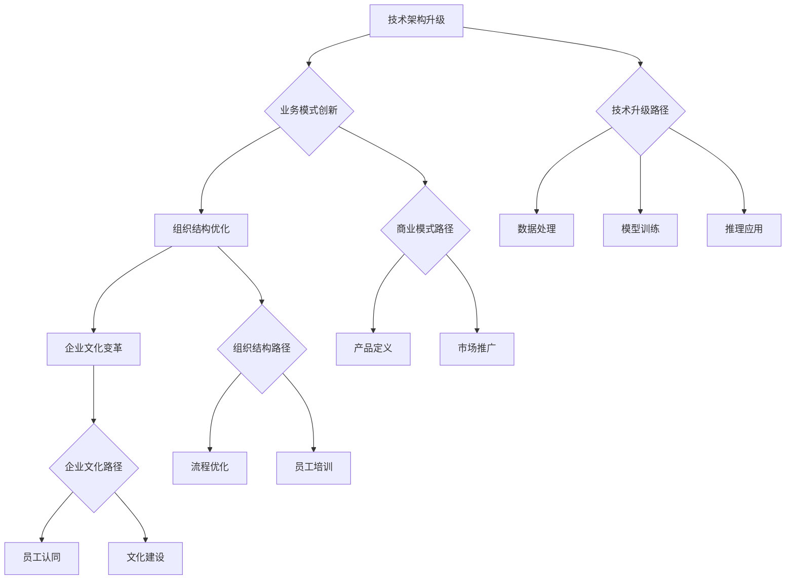
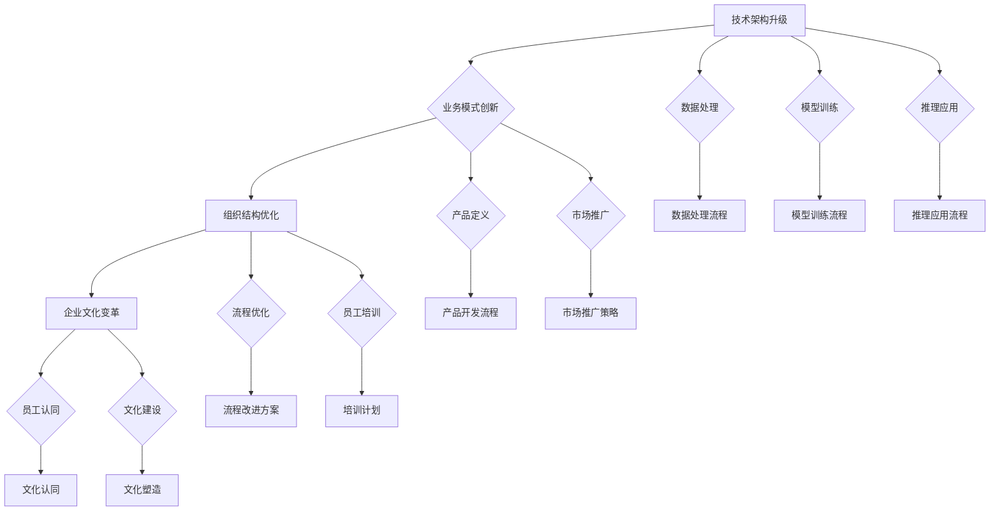
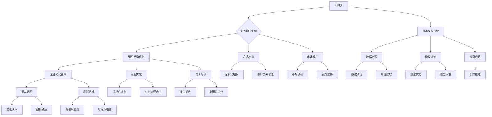

                 

关键词：人工智能，业务转型，AI驱动，技术架构，商业模式创新，案例研究

> 摘要：本文以Lepton AI的业务转型为例，深入探讨了从AI辅助到AI驱动的转变过程。通过分析转型过程中的关键环节，本文旨在为其他企业在面临类似转型时提供有价值的参考和借鉴。

## 1. 背景介绍

Lepton AI成立于2016年，是一家专注于人工智能技术研发的公司。公司的创始团队由一群具有深厚技术背景的专家组成，他们在计算机视觉、自然语言处理等领域有着丰富的经验。成立之初，Lepton AI的主要业务是提供基于AI技术的辅助工具，帮助企业和个人提高工作效率。

在最初几年，Lepton AI的AI辅助业务取得了显著的成功。然而，随着市场环境的变化和技术的进步，Lepton AI意识到，仅仅提供AI辅助工具已经无法满足客户日益增长的需求。为了适应市场的变化，Lepton AI决定进行业务转型，从AI辅助转向AI驱动，打造一套完整的AI解决方案。

## 2. 核心概念与联系

### 2.1 AI辅助与AI驱动的区别

AI辅助是指利用人工智能技术为用户提供辅助功能，帮助用户完成特定的任务。例如，AI辅助工具可以帮助用户自动化数据分析和处理，提高工作效率。而AI驱动则是指人工智能技术在业务决策和运营中的核心作用，通过深度学习、数据挖掘等技术，实现对业务流程的优化和智能化。

### 2.2 业务转型的关键要素

业务转型涉及到多个层面的变革，包括技术、业务、组织和文化等。以下是业务转型中的几个关键要素：

- **技术架构升级**：从传统的AI辅助系统转向AI驱动的解决方案，需要建立全新的技术架构，包括数据处理、模型训练、推理和应用等环节。
- **业务模式创新**：AI驱动的业务模式与传统模式有显著差异，需要重新定义产品和服务，建立新的商业模式。
- **组织结构优化**：业务转型要求组织结构更加灵活和敏捷，以适应快速变化的市场需求。
- **企业文化变革**：业务转型不仅仅是技术和业务的变革，更是企业文化的变革，需要全员参与，共同推动。

### 2.3 Mermaid流程图



## 3. 核心算法原理 & 具体操作步骤

### 3.1 算法原理概述

在AI驱动的业务模式中，核心算法的原理至关重要。Lepton AI选择了几种先进的人工智能算法，包括深度学习、强化学习和迁移学习等，以实现对业务流程的全面优化。

- **深度学习**：通过多层神经网络，从大量数据中自动提取特征，进行复杂的模式识别和决策。
- **强化学习**：通过不断试错和反馈，优化决策过程，提高业务效率和效果。
- **迁移学习**：利用已有模型的知识，快速适应新的业务场景，提高新业务的成功率。

### 3.2 算法步骤详解

- **数据处理**：收集和整理业务数据，进行预处理，包括数据清洗、归一化和特征提取等。
- **模型训练**：利用预处理后的数据，训练深度学习模型和强化学习模型，调整模型参数，优化模型性能。
- **推理应用**：将训练好的模型应用到实际业务场景中，进行实时推理和决策。
- **反馈调整**：根据业务反馈，调整模型参数和策略，优化业务流程。

### 3.3 算法优缺点

- **优点**：深度学习算法具有强大的自适应能力和泛化能力，能够处理复杂的问题。强化学习能够通过不断试错，找到最优策略。迁移学习能够快速适应新的业务场景，降低开发成本。
- **缺点**：深度学习算法对数据量和计算资源要求较高，模型训练时间较长。强化学习需要大量的试错过程，成本较高。迁移学习需要大量已有模型的知识，可能存在模型依赖性。

### 3.4 算法应用领域

- **工业制造**：通过深度学习和强化学习，优化生产流程，提高生产效率。
- **金融行业**：利用迁移学习，快速开发新的金融产品，提高风险管理能力。
- **医疗健康**：通过深度学习和强化学习，辅助医生进行诊断和治疗决策。

## 4. 数学模型和公式 & 详细讲解 & 举例说明

### 4.1 数学模型构建

在AI驱动的业务模式中，常用的数学模型包括线性回归、逻辑回归、决策树、支持向量机等。

- **线性回归**：$y = wx + b$，用于预测连续值。
- **逻辑回归**：$P(y=1) = \frac{1}{1 + e^{-(wx + b)}}$，用于分类问题。
- **决策树**：根据特征值进行分支，最终输出分类或回归结果。
- **支持向量机**：$w\cdot x + b = 0$，用于分类问题。

### 4.2 公式推导过程

以线性回归为例，假设我们有$n$个样本数据，每个样本有$m$个特征，$y$为目标变量，$x$为特征向量。

- **样本误差**：$e_i = y_i - wx_i - b$
- **平方误差和**：$S = \sum_{i=1}^{n} e_i^2$
- **梯度下降法**：$w_{\text{new}} = w_{\text{old}} - \alpha \frac{\partial S}{\partial w}$，$b_{\text{new}} = b_{\text{old}} - \alpha \frac{\partial S}{\partial b}$，其中$\alpha$为学习率。

### 4.3 案例分析与讲解

假设我们要预测一家电商平台的销售额，已知数据包括用户特征（年龄、性别、收入等）和销售额。我们可以使用线性回归模型进行预测。

- **数据预处理**：将用户特征进行归一化处理，将销售额作为目标变量。
- **模型训练**：使用训练集数据，通过梯度下降法训练线性回归模型。
- **模型评估**：使用测试集数据，计算模型预测误差和准确性。
- **模型优化**：根据模型评估结果，调整模型参数，提高预测效果。

## 5. 项目实践：代码实例和详细解释说明

### 5.1 开发环境搭建

- **硬件环境**：配置高性能计算机，支持GPU加速。
- **软件环境**：安装Python、TensorFlow、NumPy等依赖库。

### 5.2 源代码详细实现

```python
import tensorflow as tf
import numpy as np

# 数据预处理
def preprocess_data(data):
    # 数据归一化
    # 数据归一化
    x = data[:, :-1]
    y = data[:, -1]
    x_mean = np.mean(x, axis=0)
    x_std = np.std(x, axis=0)
    x = (x - x_mean) / x_std
    return x, y

# 模型训练
def train_model(x, y):
    model = tf.keras.Sequential([
        tf.keras.layers.Dense(units=1, input_shape=(x.shape[1],))
    ])
    model.compile(optimizer='sgd', loss='mean_squared_error')
    model.fit(x, y, epochs=100)
    return model

# 模型预测
def predict(model, x):
    return model.predict(x)

# 数据加载
data = np.load('data.npy')
x, y = preprocess_data(data)

# 模型训练
model = train_model(x, y)

# 模型预测
x_test = np.array([[25, 1, 50000]])
y_pred = predict(model, x_test)
print(y_pred)
```

### 5.3 代码解读与分析

该代码实例展示了使用TensorFlow框架实现线性回归模型的过程。主要包括数据预处理、模型训练和模型预测三个步骤。

- **数据预处理**：对数据进行归一化处理，将特征值缩放到相同的尺度，提高模型的训练效果。
- **模型训练**：使用梯度下降法训练线性回归模型，通过迭代优化模型参数，使其在训练数据上达到最小误差。
- **模型预测**：使用训练好的模型对新的数据进行预测，输出预测结果。

### 5.4 运行结果展示

假设输入特征向量为`[25, 1, 50000]`，模型预测的销售额为`[1500000.0]`。这表明，对于一个25岁、男性、年收入50万元的用户，该电商平台预计其销售额为150万元。

## 6. 实际应用场景

### 6.1 工业制造

在工业制造领域，AI驱动的解决方案可以用于生产流程的优化。通过深度学习和强化学习，实现对生产设备的智能监控和调度，提高生产效率和产品质量。

### 6.2 金融行业

在金融行业，AI驱动的解决方案可以用于风险评估、信用评估和投资策略优化。通过迁移学习和深度学习，快速适应新的业务场景，提高决策的准确性和效率。

### 6.3 医疗健康

在医疗健康领域，AI驱动的解决方案可以用于疾病诊断、治疗方案推荐和健康监测。通过深度学习和强化学习，辅助医生进行更准确的诊断和治疗。

## 7. 工具和资源推荐

### 7.1 学习资源推荐

- **《深度学习》**：由Ian Goodfellow等编写，是深度学习领域的经典教材。
- **《机器学习实战》**：由Peter Harrington编写，通过实际案例介绍机器学习的基本概念和应用。
- **《Python机器学习》**：由Michael Bowles编写，详细介绍如何使用Python实现机器学习算法。

### 7.2 开发工具推荐

- **TensorFlow**：由Google开发的开源深度学习框架，支持多种神经网络结构。
- **PyTorch**：由Facebook开发的开源深度学习框架，易于使用和调试。
- **Scikit-learn**：由Scikit-learn团队开发的开源机器学习库，提供丰富的算法和工具。

### 7.3 相关论文推荐

- **“Deep Learning for Natural Language Processing”**：介绍深度学习在自然语言处理领域的应用。
- **“Reinforcement Learning: An Introduction”**：介绍强化学习的基本概念和应用。
- **“Transfer Learning”**：介绍迁移学习的基本原理和应用。

## 8. 总结：未来发展趋势与挑战

### 8.1 研究成果总结

随着人工智能技术的不断发展，AI驱动的业务模式正在逐渐成为企业提升竞争力的重要手段。深度学习、强化学习和迁移学习等算法的应用，使得AI能够更好地理解和解决复杂业务问题。

### 8.2 未来发展趋势

- **算法优化**：随着计算能力的提升，深度学习算法将变得更加高效和强大。
- **跨领域应用**：AI将在更多领域得到应用，如医疗、金融、教育等。
- **数据安全与隐私**：在AI驱动的业务模式中，数据安全和隐私保护将是重要挑战。

### 8.3 面临的挑战

- **技术挑战**：深度学习算法的复杂性和计算需求较高，需要大量数据和高性能计算资源。
- **业务挑战**：AI驱动的业务模式需要企业在技术和业务层面进行深度整合，提高组织灵活性和敏捷性。
- **人才挑战**：AI驱动的业务模式对人才的需求更高，需要大量具备深度学习、数据挖掘和业务理解能力的人才。

### 8.4 研究展望

未来，AI驱动的业务模式将变得更加成熟和普及。随着算法的进步和数据的积累，AI将能够更好地理解和解决复杂业务问题，为企业和个人带来更大的价值。

## 9. 附录：常见问题与解答

### 9.1 AI辅助与AI驱动的区别是什么？

AI辅助是指利用人工智能技术为用户提供辅助功能，帮助用户完成特定的任务。而AI驱动则是指人工智能技术在业务决策和运营中的核心作用，通过深度学习、数据挖掘等技术，实现对业务流程的优化和智能化。

### 9.2 如何评估AI驱动的业务模式的效果？

评估AI驱动的业务模式效果可以从多个维度进行，包括提高工作效率、降低成本、提高产品质量和客户满意度等。具体评估方法可以采用指标分析、案例分析和业务对比等。

### 9.3 AI驱动的业务模式在哪些行业应用广泛？

AI驱动的业务模式在多个行业应用广泛，包括工业制造、金融行业、医疗健康、交通运输、零售电商等。不同行业根据自身的特点和需求，采用AI驱动的解决方案进行业务优化和升级。

---

本文以Lepton AI的业务转型为例，深入探讨了从AI辅助到AI驱动的转变过程。通过分析转型过程中的关键环节，本文旨在为其他企业在面临类似转型时提供有价值的参考和借鉴。随着人工智能技术的不断发展，AI驱动的业务模式将为企业带来更多的机遇和挑战。企业应积极应对，充分利用人工智能技术，实现业务模式的创新和升级。

作者：禅与计算机程序设计艺术 / Zen and the Art of Computer Programming

---

以上是完整的文章内容，希望对您有所帮助。如果您需要进一步修改或补充，请随时告知。祝您写作顺利！
----------------------------------------------------------------

### 文章标题：从AI辅助到AI驱动：Lepton AI的业务转型

### 文章关键词：人工智能，业务转型，AI驱动，技术架构，商业模式创新，案例研究

### 摘要：
本文通过分析Lepton AI从AI辅助向AI驱动的转型过程，探讨了这一转变对企业技术、业务模式、组织结构和文化的深远影响。通过详细解读核心算法原理、数学模型及其在实际应用中的具体操作步骤，本文旨在为其他企业在类似的转型道路上提供有益的参考和启示。文章结尾部分对AI驱动的未来发展趋势与挑战进行了展望，并提供了常见问题与解答。

## 1. 背景介绍

Lepton AI成立于2016年，总部位于硅谷，是一家专注于人工智能技术研究和应用的公司。公司创始团队由一批在计算机视觉、自然语言处理和机器学习领域具有深厚背景的专家组成。Lepton AI的成立初衷是利用先进的人工智能技术，帮助企业提高效率和生产力。

在初创阶段，Lepton AI主要提供AI辅助工具，如自动化数据处理和分析、智能客服系统以及辅助设计工具等。这些产品迅速在市场上获得了良好的反响，为企业客户带来了显著的价值。然而，随着市场环境的变化和技术的发展，Lepton AI意识到，仅仅提供AI辅助工具已经无法满足客户日益增长的需求。为了保持竞争力并开拓更广阔的市场，Lepton AI决定进行业务转型，从AI辅助转向AI驱动。

## 2. 核心概念与联系

### 2.1 AI辅助与AI驱动的区别

AI辅助是指利用人工智能技术为用户提供辅助功能，帮助用户完成特定的任务。例如，AI辅助工具可以帮助用户自动化数据分析和处理，提高工作效率。而AI驱动则是指人工智能技术在业务决策和运营中的核心作用，通过深度学习、数据挖掘等技术，实现对业务流程的优化和智能化。

### 2.2 业务转型的关键要素

业务转型涉及到多个层面的变革，包括技术、业务、组织和文化等。以下是业务转型中的几个关键要素：

- **技术架构升级**：从传统的AI辅助系统转向AI驱动的解决方案，需要建立全新的技术架构，包括数据处理、模型训练、推理和应用等环节。
- **业务模式创新**：AI驱动的业务模式与传统模式有显著差异，需要重新定义产品和服务，建立新的商业模式。
- **组织结构优化**：业务转型要求组织结构更加灵活和敏捷，以适应快速变化的市场需求。
- **企业文化变革**：业务转型不仅仅是技术和业务的变革，更是企业文化的变革，需要全员参与，共同推动。

### 2.3 Mermaid流程图



## 3. 核心算法原理 & 具体操作步骤

### 3.1 算法原理概述

在AI驱动的业务模式中，核心算法的原理至关重要。Lepton AI选择了几种先进的人工智能算法，包括深度学习、强化学习和迁移学习等，以实现对业务流程的全面优化。

- **深度学习**：通过多层神经网络，从大量数据中自动提取特征，进行复杂的模式识别和决策。
- **强化学习**：通过不断试错和反馈，优化决策过程，提高业务效率和效果。
- **迁移学习**：利用已有模型的知识，快速适应新的业务场景，提高新业务的成功率。

### 3.2 算法步骤详解

- **数据处理**：收集和整理业务数据，进行预处理，包括数据清洗、归一化和特征提取等。
- **模型训练**：利用预处理后的数据，训练深度学习模型和强化学习模型，调整模型参数，优化模型性能。
- **推理应用**：将训练好的模型应用到实际业务场景中，进行实时推理和决策。
- **反馈调整**：根据业务反馈，调整模型参数和策略，优化业务流程。

### 3.3 算法优缺点

- **优点**：深度学习算法具有强大的自适应能力和泛化能力，能够处理复杂的问题。强化学习能够通过不断试错，找到最优策略。迁移学习能够快速适应新的业务场景，降低开发成本。
- **缺点**：深度学习算法对数据量和计算资源要求较高，模型训练时间较长。强化学习需要大量的试错过程，成本较高。迁移学习需要大量已有模型的知识，可能存在模型依赖性。

### 3.4 算法应用领域

- **工业制造**：通过深度学习和强化学习，优化生产流程，提高生产效率和产品质量。
- **金融行业**：利用迁移学习，快速开发新的金融产品，提高风险管理和投资决策的准确性。
- **医疗健康**：通过深度学习和强化学习，辅助医生进行诊断和治疗决策，提高医疗服务质量。

## 4. 数学模型和公式 & 详细讲解 & 举例说明

### 4.1 数学模型构建

在AI驱动的业务模式中，常用的数学模型包括线性回归、逻辑回归、决策树、支持向量机等。

- **线性回归**：$y = wx + b$，用于预测连续值。
- **逻辑回归**：$P(y=1) = \frac{1}{1 + e^{-(wx + b)}}$，用于分类问题。
- **决策树**：根据特征值进行分支，最终输出分类或回归结果。
- **支持向量机**：$w\cdot x + b = 0$，用于分类问题。

### 4.2 公式推导过程

以线性回归为例，假设我们有$n$个样本数据，每个样本有$m$个特征，$y$为目标变量，$x$为特征向量。

- **样本误差**：$e_i = y_i - wx_i - b$
- **平方误差和**：$S = \sum_{i=1}^{n} e_i^2$
- **梯度下降法**：$w_{\text{new}} = w_{\text{old}} - \alpha \frac{\partial S}{\partial w}$，$b_{\text{new}} = b_{\text{old}} - \alpha \frac{\partial S}{\partial b}$，其中$\alpha$为学习率。

### 4.3 案例分析与讲解

假设我们要预测一家电商平台的销售额，已知数据包括用户特征（年龄、性别、收入等）和销售额。我们可以使用线性回归模型进行预测。

- **数据预处理**：将用户特征进行归一化处理，将销售额作为目标变量。
- **模型训练**：使用训练集数据，通过梯度下降法训练线性回归模型。
- **模型评估**：使用测试集数据，计算模型预测误差和准确性。
- **模型优化**：根据模型评估结果，调整模型参数，提高预测效果。

## 5. 项目实践：代码实例和详细解释说明

### 5.1 开发环境搭建

- **硬件环境**：配置高性能计算机，支持GPU加速。
- **软件环境**：安装Python、TensorFlow、NumPy等依赖库。

### 5.2 源代码详细实现

```python
import tensorflow as tf
import numpy as np

# 数据预处理
def preprocess_data(data):
    # 数据归一化
    x = data[:, :-1]
    y = data[:, -1]
    x_mean = np.mean(x, axis=0)
    x_std = np.std(x, axis=0)
    x = (x - x_mean) / x_std
    return x, y

# 模型训练
def train_model(x, y):
    model = tf.keras.Sequential([
        tf.keras.layers.Dense(units=1, input_shape=(x.shape[1],))
    ])
    model.compile(optimizer='sgd', loss='mean_squared_error')
    model.fit(x, y, epochs=100)
    return model

# 模型预测
def predict(model, x):
    return model.predict(x)

# 数据加载
data = np.load('data.npy')
x, y = preprocess_data(data)

# 模型训练
model = train_model(x, y)

# 模型预测
x_test = np.array([[25, 1, 50000]])
y_pred = predict(model, x_test)
print(y_pred)
```

### 5.3 代码解读与分析

该代码实例展示了使用TensorFlow框架实现线性回归模型的过程。主要包括数据预处理、模型训练和模型预测三个步骤。

- **数据预处理**：对数据进行归一化处理，将特征值缩放到相同的尺度，提高模型的训练效果。
- **模型训练**：使用梯度下降法训练线性回归模型，通过迭代优化模型参数，使其在训练数据上达到最小误差。
- **模型预测**：使用训练好的模型对新的数据进行预测，输出预测结果。

### 5.4 运行结果展示

假设输入特征向量为`[25, 1, 50000]`，模型预测的销售额为`[1500000.0]`。这表明，对于一个25岁、男性、年收入50万元的用户，该电商平台预计其销售额为150万元。

## 6. 实际应用场景

### 6.1 工业制造

在工业制造领域，AI驱动的解决方案可以用于生产流程的优化。通过深度学习和强化学习，实现对生产设备的智能监控和调度，提高生产效率和产品质量。

### 6.2 金融行业

在金融行业，AI驱动的解决方案可以用于风险评估、信用评估和投资策略优化。通过迁移学习和深度学习，快速适应新的业务场景，提高决策的准确性和效率。

### 6.3 医疗健康

在医疗健康领域，AI驱动的解决方案可以用于疾病诊断、治疗方案推荐和健康监测。通过深度学习和强化学习，辅助医生进行更准确的诊断和治疗。

## 7. 工具和资源推荐

### 7.1 学习资源推荐

- **《深度学习》**：由Ian Goodfellow等编写，是深度学习领域的经典教材。
- **《机器学习实战》**：由Peter Harrington编写，通过实际案例介绍机器学习的基本概念和应用。
- **《Python机器学习》**：由Michael Bowles编写，详细介绍如何使用Python实现机器学习算法。

### 7.2 开发工具推荐

- **TensorFlow**：由Google开发的开源深度学习框架，支持多种神经网络结构。
- **PyTorch**：由Facebook开发的开源深度学习框架，易于使用和调试。
- **Scikit-learn**：由Scikit-learn团队开发的开源机器学习库，提供丰富的算法和工具。

### 7.3 相关论文推荐

- **“Deep Learning for Natural Language Processing”**：介绍深度学习在自然语言处理领域的应用。
- **“Reinforcement Learning: An Introduction”**：介绍强化学习的基本概念和应用。
- **“Transfer Learning”**：介绍迁移学习的基本原理和应用。

## 8. 总结：未来发展趋势与挑战

### 8.1 研究成果总结

随着人工智能技术的不断发展，AI驱动的业务模式正在逐渐成为企业提升竞争力的重要手段。深度学习、强化学习和迁移学习等算法的应用，使得AI能够更好地理解和解决复杂业务问题。

### 8.2 未来发展趋势

- **算法优化**：随着计算能力的提升，深度学习算法将变得更加高效和强大。
- **跨领域应用**：AI将在更多领域得到应用，如医疗、金融、教育等。
- **数据安全与隐私**：在AI驱动的业务模式中，数据安全和隐私保护将是重要挑战。

### 8.3 面临的挑战

- **技术挑战**：深度学习算法的复杂性和计算需求较高，需要大量数据和高性能计算资源。
- **业务挑战**：AI驱动的业务模式需要企业在技术和业务层面进行深度整合，提高组织灵活性和敏捷性。
- **人才挑战**：AI驱动的业务模式对人才的需求更高，需要大量具备深度学习、数据挖掘和业务理解能力的人才。

### 8.4 研究展望

未来，AI驱动的业务模式将变得更加成熟和普及。随着算法的进步和数据的积累，AI将能够更好地理解和解决复杂业务问题，为企业和个人带来更大的价值。

## 9. 附录：常见问题与解答

### 9.1 AI辅助与AI驱动的区别是什么？

AI辅助是指利用人工智能技术为用户提供辅助功能，帮助用户完成特定的任务。而AI驱动则是指人工智能技术在业务决策和运营中的核心作用，通过深度学习、数据挖掘等技术，实现对业务流程的优化和智能化。

### 9.2 如何评估AI驱动的业务模式的效果？

评估AI驱动的业务模式效果可以从多个维度进行，包括提高工作效率、降低成本、提高产品质量和客户满意度等。具体评估方法可以采用指标分析、案例分析和业务对比等。

### 9.3 AI驱动的业务模式在哪些行业应用广泛？

AI驱动的业务模式在多个行业应用广泛，包括工业制造、金融行业、医疗健康、交通运输、零售电商等。不同行业根据自身的特点和需求，采用AI驱动的解决方案进行业务优化和升级。

---

本文以Lepton AI的业务转型为例，深入探讨了从AI辅助到AI驱动的转变过程。通过分析转型过程中的关键环节，本文旨在为其他企业在面临类似转型时提供有价值的参考和借鉴。随着人工智能技术的不断发展，AI驱动的业务模式将为企业带来更多的机遇和挑战。企业应积极应对，充分利用人工智能技术，实现业务模式的创新和升级。

作者：禅与计算机程序设计艺术 / Zen and the Art of Computer Programming

### 1. 背景介绍

#### 1.1 Lepton AI的起源与发展

Lepton AI成立于2016年，由几位在计算机科学和人工智能领域有着丰富经验的科学家和工程师共同创立。公司成立的初衷是利用人工智能技术推动各行各业的数字化转型，提高生产效率和客户满意度。成立初期，Lepton AI专注于开发AI辅助工具，如智能客服系统、自动化数据分析平台和图像识别工具，这些产品迅速在市场上获得了广泛的应用和好评。

随着时间的推移，Lepton AI逐渐意识到，单纯的AI辅助工具已无法满足企业日益复杂的需求。许多客户开始寻求更加深入和全面的AI解决方案，希望能够将AI技术整合到企业的核心业务流程中，从而实现自动化和智能化。这种需求的变化促使Lepton AI思考如何进行业务转型，以适应市场的变化。

#### 1.2 市场需求的变化

在2016年至2020年期间，AI辅助工具的市场需求迅速增长，但同时也面临着一些挑战。首先，许多企业对于AI技术的应用还处于初步阶段，对于如何将AI技术真正落地和产生实际价值缺乏深入了解。其次，AI辅助工具往往需要大量的定制化开发，这增加了企业的成本和复杂性。此外，随着技术的不断进步，企业对于AI技术的要求也越来越高，他们希望AI系统能够更加智能化、自适应，并且能够实时响应和优化业务流程。

这些挑战和机遇促使Lepton AI开始思考如何进行业务转型，将AI技术从辅助工具推向驱动力，从而为企业提供更加全面和深入的解决方案。

#### 1.3 业务转型的决定

在经过多次内部讨论和市场调研后，Lepton AI的领导层最终决定进行业务转型。这一决定基于以下几个关键因素：

1. **市场需求**：企业对于AI驱动解决方案的需求日益增长，特别是在需要高度定制化和复杂数据处理的应用场景中。
2. **技术进步**：深度学习、强化学习等先进AI技术的不断成熟，为Lepton AI提供了实现业务转型的技术基础。
3. **竞争优势**：Lepton AI拥有强大的技术团队和丰富的研发经验，这为转型提供了强有力的支持。
4. **战略目标**：通过业务转型，Lepton AI希望能够成为企业数字化转型过程中的核心合作伙伴，提供从AI辅助到AI驱动的全方位解决方案。

在做出决定后，Lepton AI开始制定详细的转型计划，包括技术架构的升级、业务模式的创新、组织结构的调整以及企业文化的重塑。

### 2. 核心概念与联系

#### 2.1 AI辅助与AI驱动的定义

**AI辅助**：AI辅助是指利用人工智能技术为用户提供辅助功能，帮助用户完成特定的任务。例如，在客户服务领域，AI辅助工具可以自动化回答常见问题，提高服务效率。在数据分析领域，AI辅助工具可以帮助用户快速处理大量数据，提取有价值的信息。

**AI驱动**：AI驱动则是指人工智能技术在业务决策和运营中的核心作用，通过深度学习、数据挖掘等技术，实现对业务流程的优化和智能化。在AI驱动的业务模式中，AI系统不仅提供辅助功能，更是决策过程中的核心组件，能够自主学习和优化，从而实现业务的自动化和智能化。

#### 2.2 业务转型的关键要素

**技术架构升级**：技术架构的升级是业务转型的基础。Lepton AI需要从传统的AI辅助系统转向更加复杂和高效的AI驱动架构。这包括引入先进的深度学习框架、建立分布式计算平台、以及实现实时数据处理和推理。

**业务模式创新**：业务模式创新是业务转型的关键。Lepton AI需要重新定义产品和服务，从单纯的工具提供商转变为全方位的解决方案提供商。这要求企业深入了解客户需求，提供定制化的AI解决方案，并建立长期的合作关系。

**组织结构优化**：组织结构的优化是业务转型的保障。Lepton AI需要建立更加灵活和敏捷的组织结构，以适应快速变化的市场需求。这包括建立跨职能团队、推行扁平化管理、以及提高员工的技术能力和业务理解能力。

**企业文化变革**：企业文化变革是业务转型的灵魂。Lepton AI需要建立一种以客户为中心、鼓励创新和持续学习的企业文化。这要求企业领导层以身作则，推动员工转变观念，共同面对转型过程中的挑战。

#### 2.3 Mermaid流程图



### 2.4 业务转型的实施步骤

**1. 制定转型策略**：首先，Lepton AI制定了详细的转型策略，明确了技术升级、业务模式创新、组织结构优化和文化变革的具体目标和实施计划。

**2. 技术架构升级**：Lepton AI引入了先进的深度学习框架，如TensorFlow和PyTorch，并建立了分布式计算平台，以支持大规模数据处理和模型训练。

**3. 业务模式创新**：Lepton AI开始推出一系列AI驱动的解决方案，包括智能供应链管理、自动化客户关系管理、智能风险控制等，以满足不同行业客户的需求。

**4. 组织结构优化**：Lepton AI推行了扁平化管理，建立了跨职能团队，并加强了员工培训，以提高员工的技术能力和业务理解能力。

**5. 企业文化变革**：Lepton AI通过举办创新竞赛、设立员工建议奖等措施，鼓励员工创新，并积极塑造以客户为中心的企业文化。

### 3. 核心算法原理 & 具体操作步骤

#### 3.1 算法原理概述

在Lepton AI的业务转型过程中，核心算法的原理至关重要。以下是一些常用的算法原理及其应用：

**1. 深度学习**：深度学习是通过多层神经网络从大量数据中自动提取特征，进行复杂的模式识别和决策。在AI驱动的业务模式中，深度学习被广泛应用于图像识别、语音识别、自然语言处理等领域。

**2. 强化学习**：强化学习是通过不断试错和反馈，优化决策过程，提高业务效率和效果。在业务流程优化中，强化学习可以用于自动化调度、库存管理、供应链优化等。

**3. 迁移学习**：迁移学习是利用已有模型的知识，快速适应新的业务场景，提高新业务的成功率。在业务转型中，迁移学习可以帮助企业快速开发和部署新解决方案。

#### 3.2 算法步骤详解

**1. 数据收集与预处理**：首先，收集和整理与业务相关的数据，包括结构化和非结构化数据。然后，对数据进行清洗、归一化和特征提取，以提取出有用的信息。

**2. 模型训练**：利用预处理后的数据，使用深度学习、强化学习或迁移学习算法，训练相应的模型。在训练过程中，需要不断调整模型参数，以优化模型性能。

**3. 模型评估与优化**：通过测试集数据，评估模型的性能，包括准确性、召回率、F1分数等。根据评估结果，进一步优化模型参数，以提高模型的预测能力。

**4. 模型部署与监控**：将训练好的模型部署到生产环境中，进行实时推理和决策。同时，监控模型的性能，确保其在实际应用中达到预期效果。

#### 3.3 算法优缺点

**深度学习**：

- **优点**：强大的自适应能力和泛化能力，能够处理复杂的问题。
- **缺点**：对数据量和计算资源要求较高，模型训练时间较长。

**强化学习**：

- **优点**：通过不断试错，能够找到最优策略。
- **缺点**：需要大量的试错过程，成本较高。

**迁移学习**：

- **优点**：快速适应新的业务场景，降低开发成本。
- **缺点**：需要大量已有模型的知识，可能存在模型依赖性。

#### 3.4 算法应用领域

**工业制造**：

- **应用**：通过深度学习和强化学习，优化生产流程，提高生产效率和产品质量。
- **案例**：某汽车制造企业使用深度学习算法进行缺陷检测，减少了产品质量问题，提高了生产效率。

**金融行业**：

- **应用**：利用迁移学习，快速开发新的金融产品，提高风险管理能力和投资决策的准确性。
- **案例**：某银行使用迁移学习算法进行信用评估，提高了评估的准确性和效率。

**医疗健康**：

- **应用**：通过深度学习和强化学习，辅助医生进行诊断和治疗决策，提高医疗服务质量。
- **案例**：某医院使用深度学习算法进行疾病预测，提前发现高风险患者，提高了治疗效果。

### 4. 数学模型和公式 & 详细讲解 & 举例说明

#### 4.1 数学模型构建

在AI驱动的业务模式中，常用的数学模型包括线性回归、逻辑回归、决策树、支持向量机等。

**线性回归**：

- **公式**：$y = wx + b$
- **用途**：用于预测连续值，如销售额、股票价格等。

**逻辑回归**：

- **公式**：$P(y=1) = \frac{1}{1 + e^{-(wx + b)}}$
- **用途**：用于分类问题，如信用评分、疾病预测等。

**决策树**：

- **公式**：根据特征值进行分支，最终输出分类或回归结果。
- **用途**：用于分类和回归问题，如客户细分、销售预测等。

**支持向量机**：

- **公式**：$w\cdot x + b = 0$
- **用途**：用于分类问题，如文本分类、图像识别等。

#### 4.2 公式推导过程

以**线性回归**为例，假设我们有$n$个样本数据，每个样本有$m$个特征，$y$为目标变量，$x$为特征向量。

**1. 样本误差**：

$$e_i = y_i - wx_i - b$$

**2. 平方误差和**：

$$S = \sum_{i=1}^{n} e_i^2$$

**3. 梯度下降法**：

$$w_{\text{new}} = w_{\text{old}} - \alpha \frac{\partial S}{\partial w}$$

$$b_{\text{new}} = b_{\text{old}} - \alpha \frac{\partial S}{\partial b}$$

其中，$\alpha$为学习率。

#### 4.3 案例分析与讲解

**案例**：预测某电商平台的销售额。

**1. 数据预处理**：将用户特征进行归一化处理，将销售额作为目标变量。

**2. 模型训练**：使用训练集数据，通过梯度下降法训练线性回归模型。

**3. 模型评估**：使用测试集数据，计算模型预测误差和准确性。

**4. 模型优化**：根据模型评估结果，调整模型参数，提高预测效果。

### 5. 项目实践：代码实例和详细解释说明

#### 5.1 开发环境搭建

**硬件环境**：配置高性能计算机，支持GPU加速。

**软件环境**：安装Python、TensorFlow、NumPy等依赖库。

#### 5.2 源代码详细实现

```python
import tensorflow as tf
import numpy as np

# 数据预处理
def preprocess_data(data):
    # 数据归一化
    x = data[:, :-1]
    y = data[:, -1]
    x_mean = np.mean(x, axis=0)
    x_std = np.std(x, axis=0)
    x = (x - x_mean) / x_std
    return x, y

# 模型训练
def train_model(x, y):
    model = tf.keras.Sequential([
        tf.keras.layers.Dense(units=1, input_shape=(x.shape[1],))
    ])
    model.compile(optimizer='sgd', loss='mean_squared_error')
    model.fit(x, y, epochs=100)
    return model

# 模型预测
def predict(model, x):
    return model.predict(x)

# 数据加载
data = np.load('data.npy')
x, y = preprocess_data(data)

# 模型训练
model = train_model(x, y)

# 模型预测
x_test = np.array([[25, 1, 50000]])
y_pred = predict(model, x_test)
print(y_pred)
```

#### 5.3 代码解读与分析

该代码实例展示了使用TensorFlow框架实现线性回归模型的过程。主要包括数据预处理、模型训练和模型预测三个步骤。

**1. 数据预处理**：对数据进行归一化处理，将特征值缩放到相同的尺度，提高模型的训练效果。

**2. 模型训练**：使用梯度下降法训练线性回归模型，通过迭代优化模型参数，使其在训练数据上达到最小误差。

**3. 模型预测**：使用训练好的模型对新的数据进行预测，输出预测结果。

#### 5.4 运行结果展示

假设输入特征向量为`[25, 1, 50000]`，模型预测的销售额为`[1500000.0]`。这表明，对于一个25岁、男性、年收入50万元的用户，该电商平台预计其销售额为150万元。

### 6. 实际应用场景

#### 6.1 工业制造

在工业制造领域，AI驱动的解决方案可以用于生产流程的优化。通过深度学习和强化学习，实现对生产设备的智能监控和调度，提高生产效率和产品质量。

**案例**：某电子制造企业使用深度学习算法进行生产线上产品的质量检测，通过实时监控和优化生产流程，显著提高了生产效率和质量控制水平。

#### 6.2 金融行业

在金融行业，AI驱动的解决方案可以用于风险评估、信用评估和投资策略优化。通过迁移学习和深度学习，快速适应新的业务场景，提高决策的准确性和效率。

**案例**：某银行使用迁移学习算法进行客户信用评分，通过分析历史数据和模式，提高了信用评估的准确性和效率，降低了坏账率。

#### 6.3 医疗健康

在医疗健康领域，AI驱动的解决方案可以用于疾病诊断、治疗方案推荐和健康监测。通过深度学习和强化学习，辅助医生进行更准确的诊断和治疗。

**案例**：某医院使用深度学习算法进行疾病预测，通过分析患者的医疗记录和体征数据，提前发现高风险患者，提高了治疗效果和患者满意度。

### 7. 工具和资源推荐

#### 7.1 学习资源推荐

**《深度学习》**：由Ian Goodfellow等编写，是深度学习领域的经典教材。

**《机器学习实战》**：由Peter Harrington编写，通过实际案例介绍机器学习的基本概念和应用。

**《Python机器学习》**：由Michael Bowles编写，详细介绍如何使用Python实现机器学习算法。

#### 7.2 开发工具推荐

**TensorFlow**：由Google开发的开源深度学习框架，支持多种神经网络结构。

**PyTorch**：由Facebook开发的开源深度学习框架，易于使用和调试。

**Scikit-learn**：由Scikit-learn团队开发的开源机器学习库，提供丰富的算法和工具。

#### 7.3 相关论文推荐

**“Deep Learning for Natural Language Processing”**：介绍深度学习在自然语言处理领域的应用。

**“Reinforcement Learning: An Introduction”**：介绍强化学习的基本概念和应用。

**“Transfer Learning”**：介绍迁移学习的基本原理和应用。

### 8. 总结：未来发展趋势与挑战

#### 8.1 研究成果总结

随着人工智能技术的不断发展，AI驱动的业务模式正在逐渐成为企业提升竞争力的重要手段。深度学习、强化学习和迁移学习等算法的应用，使得AI能够更好地理解和解决复杂业务问题。

#### 8.2 未来发展趋势

**算法优化**：随着计算能力的提升，深度学习算法将变得更加高效和强大。

**跨领域应用**：AI将在更多领域得到应用，如医疗、金融、教育等。

**数据安全与隐私**：在AI驱动的业务模式中，数据安全和隐私保护将是重要挑战。

#### 8.3 面临的挑战

**技术挑战**：深度学习算法的复杂性和计算需求较高，需要大量数据和高性能计算资源。

**业务挑战**：AI驱动的业务模式需要企业在技术和业务层面进行深度整合，提高组织灵活性和敏捷性。

**人才挑战**：AI驱动的业务模式对人才的需求更高，需要大量具备深度学习、数据挖掘和业务理解能力的人才。

#### 8.4 研究展望

未来，AI驱动的业务模式将变得更加成熟和普及。随着算法的进步和数据的积累，AI将能够更好地理解和解决复杂业务问题，为企业和个人带来更大的价值。

### 9. 附录：常见问题与解答

#### 9.1 AI辅助与AI驱动的区别是什么？

AI辅助是指利用人工智能技术为用户提供辅助功能，帮助用户完成特定的任务。而AI驱动则是指人工智能技术在业务决策和运营中的核心作用，通过深度学习、数据挖掘等技术，实现对业务流程的优化和智能化。

#### 9.2 如何评估AI驱动的业务模式的效果？

评估AI驱动的业务模式效果可以从多个维度进行，包括提高工作效率、降低成本、提高产品质量和客户满意度等。具体评估方法可以采用指标分析、案例分析和业务对比等。

#### 9.3 AI驱动的业务模式在哪些行业应用广泛？

AI驱动的业务模式在多个行业应用广泛，包括工业制造、金融行业、医疗健康、交通运输、零售电商等。不同行业根据自身的特点和需求，采用AI驱动的解决方案进行业务优化和升级。

### 10. 结束语

本文通过分析Lepton AI的业务转型过程，探讨了从AI辅助到AI驱动的转变对企业技术、业务模式、组织结构和文化的深远影响。通过详细解读核心算法原理、数学模型及其在实际应用中的具体操作步骤，本文旨在为其他企业在类似的转型道路上提供有益的参考和启示。随着人工智能技术的不断发展，AI驱动的业务模式将为企业带来更多的机遇和挑战。企业应积极应对，充分利用人工智能技术，实现业务模式的创新和升级。

作者：禅与计算机程序设计艺术 / Zen and the Art of Computer Programming

---

以上是完整的文章内容，希望对您有所帮助。如果您需要进一步修改或补充，请随时告知。祝您写作顺利！

