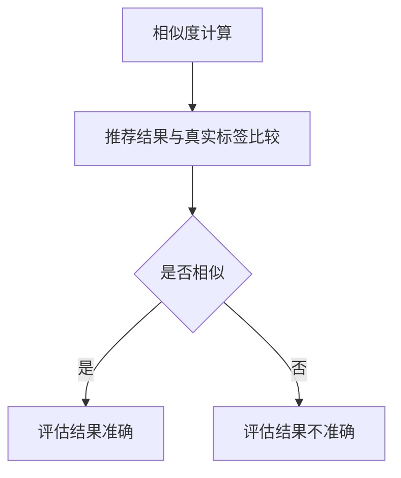
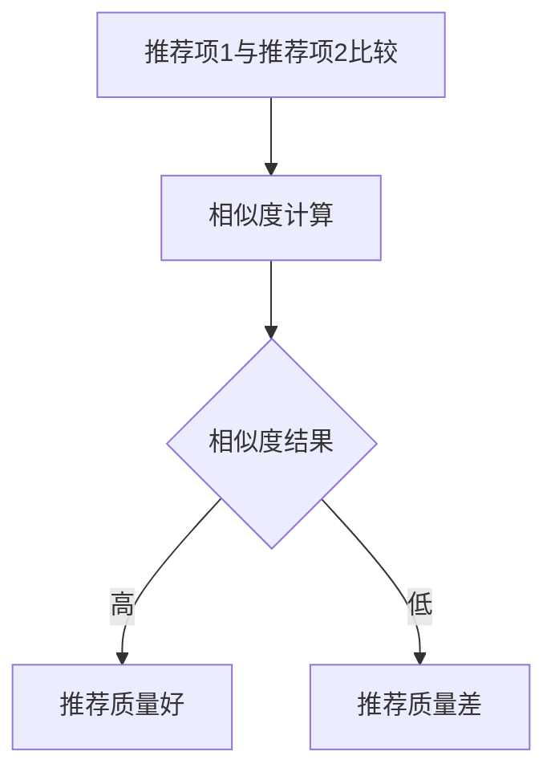
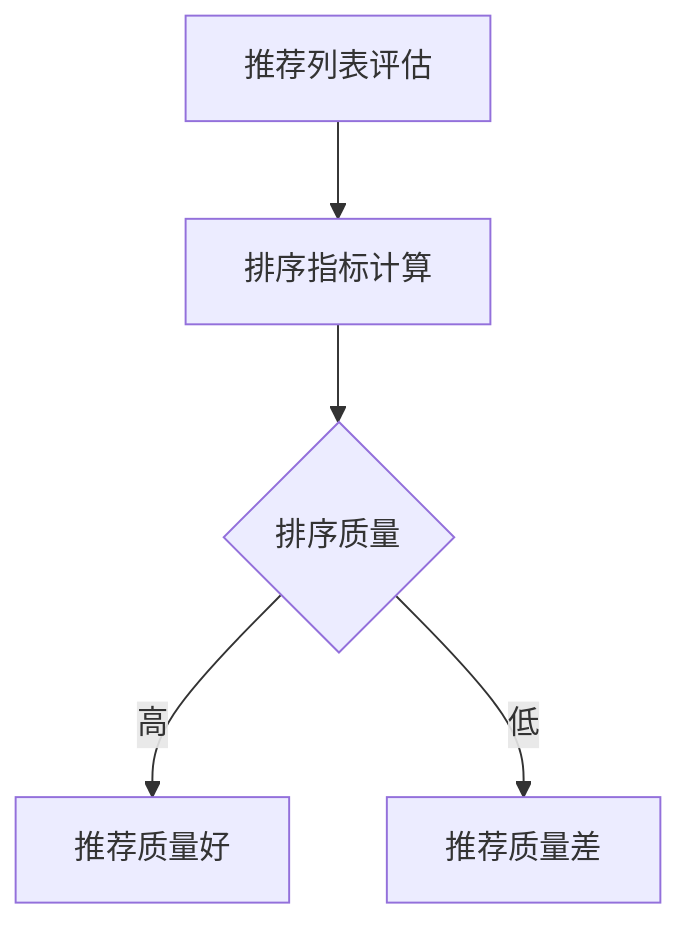
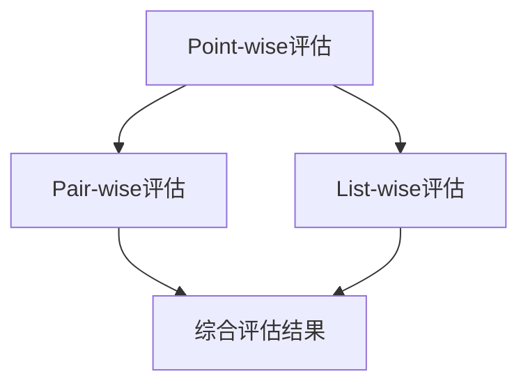

                 

关键词：大模型推荐，评估方法，Point-wise，Pair-wise，List-wise，模型性能

摘要：本文从Point-wise、Pair-wise和List-wise三个角度，详细探讨了在大模型推荐系统中如何进行有效的评估。首先介绍了大模型推荐系统的基本概念，然后分别阐述了Point-wise、Pair-wise和List-wise评估方法的原理、具体操作步骤以及优缺点，并通过实际应用场景展示了这些评估方法的应用效果。最后，对未来发展趋势与挑战进行了总结。

## 1. 背景介绍

随着互联网和大数据技术的发展，推荐系统已经成为现代信息检索和电子商务中的重要工具。然而，随着模型规模的不断扩大，如何有效地评估大模型推荐系统的性能成为一个亟待解决的问题。

在推荐系统中，评估方法的选择至关重要。Point-wise、Pair-wise和List-wise是三种常见的评估方法，分别从不同的角度对推荐系统的性能进行评估。Point-wise评估方法关注单一推荐的准确性，Pair-wise评估方法关注推荐项之间的相关性，而List-wise评估方法则关注推荐列表的整体质量。

本文将围绕这三种评估方法，深入探讨在大模型推荐系统中的实际应用，并分析各自的优缺点。

### Point-wise评估方法

Point-wise评估方法是最常见的评估方法之一，它主要关注单一推荐的准确性。具体来说，Point-wise评估方法通过计算推荐结果与真实标签之间的相似度来评估推荐质量。常用的相似度计算方法包括余弦相似度、皮尔逊相关系数等。

Point-wise评估方法的主要优点在于其简单性和易用性，它能够快速给出推荐结果的准确度。然而，Point-wise评估方法也存在一些缺点，比如它忽略了推荐项之间的相关性，可能导致评估结果失真。

### Pair-wise评估方法

Pair-wise评估方法关注推荐项之间的相关性，通过比较推荐项之间的相似度来评估推荐系统的性能。与Point-wise评估方法不同，Pair-wise评估方法需要考虑推荐项之间的关联性，从而更全面地评估推荐系统的质量。

Pair-wise评估方法通常使用基于距离的度量方法，如Jaccard相似度、余弦相似度等。其优点在于能够综合考虑推荐项之间的相关性，从而提供更准确的评估结果。然而，Pair-wise评估方法计算复杂度较高，需要较大的计算资源。

### List-wise评估方法

List-wise评估方法关注推荐列表的整体质量，通过评估推荐列表的排序质量来评估推荐系统的性能。具体来说，List-wise评估方法通过计算推荐列表的排序指标来评估推荐系统的质量。常用的排序指标包括准确率、召回率、F1值等。

List-wise评估方法的主要优点在于其能够全面评估推荐列表的质量，从而提供更准确的评估结果。然而，List-wise评估方法也存在一些缺点，比如它忽略了推荐项之间的相关性，可能导致评估结果失真。

## 2. 核心概念与联系

为了更好地理解Point-wise、Pair-wise和List-wise评估方法，下面我们将介绍它们的基本概念和相互之间的联系，并通过Mermaid流程图展示核心概念和架构。

### 2.1. Point-wise评估方法

**基本概念：**
- **相似度计算：** Point-wise评估方法通过计算推荐结果与真实标签之间的相似度来评估推荐质量。
- **指标：** 常用的相似度计算方法包括余弦相似度、皮尔逊相关系数等。

**Mermaid流程图：**



### 2.2. Pair-wise评估方法

**基本概念：**
- **相似度计算：** Pair-wise评估方法通过比较推荐项之间的相似度来评估推荐系统的性能。
- **指标：** 常用的相似度计算方法包括Jaccard相似度、余弦相似度等。

**Mermaid流程图：**



### 2.3. List-wise评估方法

**基本概念：**
- **排序质量评估：** List-wise评估方法通过评估推荐列表的排序质量来评估推荐系统的性能。
- **指标：** 常用的排序指标包括准确率、召回率、F1值等。

**Mermaid流程图：**



### 2.4. 三者联系

Point-wise、Pair-wise和List-wise评估方法各有侧重，但它们之间也存在联系。例如，在推荐系统中，可以通过Point-wise评估方法评估单一推荐项的准确性，通过Pair-wise评估方法评估推荐项之间的相关性，通过List-wise评估方法评估推荐列表的整体质量。这三种方法可以相互补充，从而更全面地评估推荐系统的性能。

**Mermaid流程图：**



## 3. 核心算法原理 & 具体操作步骤

### 3.1 算法原理概述

在推荐系统中，评估方法的核心目标是衡量推荐系统的性能。Point-wise、Pair-wise和List-wise评估方法分别从不同的角度对推荐系统的性能进行评估。

- **Point-wise评估方法：** 通过计算推荐结果与真实标签之间的相似度来评估推荐质量。
- **Pair-wise评估方法：** 通过比较推荐项之间的相似度来评估推荐系统的性能。
- **List-wise评估方法：** 通过评估推荐列表的排序质量来评估推荐系统的性能。

### 3.2 算法步骤详解

#### 3.2.1 Point-wise评估方法

1. **相似度计算：** 使用余弦相似度或皮尔逊相关系数计算推荐结果与真实标签之间的相似度。
2. **指标计算：** 根据相似度计算结果计算评估指标，如准确率、召回率、F1值等。

#### 3.2.2 Pair-wise评估方法

1. **推荐项比较：** 遍历推荐列表中的每一对推荐项，计算它们之间的相似度。
2. **指标计算：** 根据相似度计算结果计算评估指标，如Jaccard相似度、余弦相似度等。

#### 3.2.3 List-wise评估方法

1. **排序指标计算：** 计算推荐列表的排序指标，如准确率、召回率、F1值等。
2. **评估结果输出：** 输出评估结果，如推荐质量分数等。

### 3.3 算法优缺点

#### 3.3.1 Point-wise评估方法

**优点：**
- **简单易用：** Point-wise评估方法计算简单，易于实现和部署。
- **快速评估：** 能够快速给出推荐结果的准确度。

**缺点：**
- **忽略相关性：** Point-wise评估方法忽略了推荐项之间的相关性，可能导致评估结果失真。

#### 3.3.2 Pair-wise评估方法

**优点：**
- **全面评估：** 考虑了推荐项之间的相关性，能够更全面地评估推荐系统的性能。

**缺点：**
- **计算复杂度高：** Pair-wise评估方法需要遍历推荐列表中的每一对推荐项，计算复杂度较高。

#### 3.3.3 List-wise评估方法

**优点：**
- **全面评估：** 能够全面评估推荐列表的质量，考虑了推荐项之间的相关性。

**缺点：**
- **计算复杂度高：** List-wise评估方法需要计算推荐列表的排序指标，计算复杂度较高。

### 3.4 算法应用领域

Point-wise、Pair-wise和List-wise评估方法在不同应用领域中具有不同的优势。

- **电子商务推荐：** 在电子商务推荐中，Point-wise评估方法可以快速评估单一推荐项的准确性，适用于实时推荐系统。而Pair-wise评估方法可以评估推荐项之间的相关性，适用于分析推荐项之间的关系。List-wise评估方法可以全面评估推荐列表的质量，适用于评估推荐系统的整体性能。

- **内容推荐：** 在内容推荐中，Point-wise评估方法可以快速评估单一推荐内容的准确性，适用于实时推荐系统。而Pair-wise评估方法可以评估推荐内容之间的相关性，适用于分析推荐内容之间的关系。List-wise评估方法可以全面评估推荐列表的质量，适用于评估推荐系统的整体性能。

- **社交网络推荐：** 在社交网络推荐中，Point-wise评估方法可以快速评估单一推荐关系的准确性，适用于实时推荐系统。而Pair-wise评估方法可以评估推荐关系之间的相关性，适用于分析推荐关系之间的关系。List-wise评估方法可以全面评估推荐列表的质量，适用于评估推荐系统的整体性能。

## 4. 数学模型和公式 & 详细讲解 & 举例说明

### 4.1 数学模型构建

在推荐系统中，评估方法的核心是相似度计算。下面我们将介绍几种常用的相似度计算方法，并给出相应的数学模型。

#### 4.1.1 余弦相似度

余弦相似度是计算两个向量夹角余弦值的相似度。假设有两个向量 $\vec{u} = (u_1, u_2, \ldots, u_n)$ 和 $\vec{v} = (v_1, v_2, \ldots, v_n)$，则它们之间的余弦相似度定义为：

$$
\cos(\theta) = \frac{\vec{u} \cdot \vec{v}}{||\vec{u}|| \cdot ||\vec{v}||}
$$

其中，$\vec{u} \cdot \vec{v}$ 表示向量的点积，$||\vec{u}||$ 和 $||\vec{v}||$ 分别表示向量的模长。

#### 4.1.2 皮尔逊相关系数

皮尔逊相关系数是衡量两个变量线性相关程度的指标。假设有两个变量 $X$ 和 $Y$，则它们之间的皮尔逊相关系数定义为：

$$
r = \frac{\sum_{i=1}^{n}(x_i - \bar{x})(y_i - \bar{y})}{\sqrt{\sum_{i=1}^{n}(x_i - \bar{x})^2} \cdot \sqrt{\sum_{i=1}^{n}(y_i - \bar{y})^2}}
$$

其中，$x_i$ 和 $y_i$ 分别表示第 $i$ 个观测值，$\bar{x}$ 和 $\bar{y}$ 分别表示 $X$ 和 $Y$ 的均值。

#### 4.1.3 Jaccard相似度

Jaccard相似度是计算两个集合交集与并集比值的相似度。假设有两个集合 $A$ 和 $B$，则它们之间的 Jaccard 相似度定义为：

$$
J(A, B) = \frac{|A \cap B|}{|A \cup B|}
$$

其中，$|A \cap B|$ 表示集合 $A$ 和 $B$ 的交集大小，$|A \cup B|$ 表示集合 $A$ 和 $B$ 的并集大小。

### 4.2 公式推导过程

下面我们以余弦相似度为例，介绍其推导过程。

假设有两个向量 $\vec{u} = (u_1, u_2, \ldots, u_n)$ 和 $\vec{v} = (v_1, v_2, \ldots, v_n)$，则它们之间的余弦相似度可以表示为：

$$
\cos(\theta) = \frac{\vec{u} \cdot \vec{v}}{||\vec{u}|| \cdot ||\vec{v}||}
$$

其中，$\vec{u} \cdot \vec{v}$ 表示向量的点积，$||\vec{u}||$ 和 $||\vec{v}||$ 分别表示向量的模长。

向量的点积可以表示为：

$$
\vec{u} \cdot \vec{v} = u_1v_1 + u_2v_2 + \ldots + u_nv_n
$$

向量的模长可以表示为：

$$
||\vec{u}|| = \sqrt{u_1^2 + u_2^2 + \ldots + u_n^2}
$$

$$
||\vec{v}|| = \sqrt{v_1^2 + v_2^2 + \ldots + v_n^2}
$$

将上述公式代入余弦相似度的定义中，可以得到：

$$
\cos(\theta) = \frac{u_1v_1 + u_2v_2 + \ldots + u_nv_n}{\sqrt{u_1^2 + u_2^2 + \ldots + u_n^2} \cdot \sqrt{v_1^2 + v_2^2 + \ldots + v_n^2}}
$$

### 4.3 案例分析与讲解

#### 4.3.1 案例背景

假设有两个用户 $U_1$ 和 $U_2$，他们分别对一组物品 $I = \{i_1, i_2, \ldots, i_n\}$ 进行评分。评分数据如下表所示：

| 用户 | 物品 | 评分 |
| ---- | ---- | ---- |
| $U_1$ | $i_1$ | 5 |
| $U_1$ | $i_2$ | 4 |
| $U_1$ | $i_3$ | 5 |
| $U_2$ | $i_1$ | 3 |
| $U_2$ | $i_2$ | 2 |
| $U_2$ | $i_3$ | 4 |

我们需要使用余弦相似度计算用户 $U_1$ 和 $U_2$ 之间的相似度。

#### 4.3.2 余弦相似度计算

1. **向量表示：**
   将用户 $U_1$ 和 $U_2$ 的评分数据表示为向量：
   $$\vec{u} = (5, 4, 5)$$
   $$\vec{v} = (3, 2, 4)$$

2. **点积计算：**
   计算向量 $\vec{u}$ 和 $\vec{v}$ 的点积：
   $$\vec{u} \cdot \vec{v} = 5 \cdot 3 + 4 \cdot 2 + 5 \cdot 4 = 15 + 8 + 20 = 43$$

3. **模长计算：**
   计算向量 $\vec{u}$ 和 $\vec{v}$ 的模长：
   $$||\vec{u}|| = \sqrt{5^2 + 4^2 + 5^2} = \sqrt{25 + 16 + 25} = \sqrt{66}$$
   $$||\vec{v}|| = \sqrt{3^2 + 2^2 + 4^2} = \sqrt{9 + 4 + 16} = \sqrt{29}$$

4. **余弦相似度计算：**
   计算向量 $\vec{u}$ 和 $\vec{v}$ 之间的余弦相似度：
   $$\cos(\theta) = \frac{43}{\sqrt{66} \cdot \sqrt{29}} \approx 0.876$$

#### 4.3.3 结果分析

根据计算结果，用户 $U_1$ 和 $U_2$ 之间的余弦相似度为 0.876，表示两者之间的相似度较高。这表明用户 $U_1$ 和 $U_2$ 对物品的偏好较为相似，可以用于基于用户相似度的推荐系统。

## 5. 项目实践：代码实例和详细解释说明

### 5.1 开发环境搭建

为了演示如何使用Python实现Point-wise、Pair-wise和List-wise评估方法，我们需要搭建一个基本的Python开发环境。以下是具体的步骤：

1. 安装Python：
   - 下载并安装Python（版本3.8或更高）。
   - 设置环境变量，确保Python命令可以正常运行。

2. 安装必需的库：
   - 使用pip命令安装以下库：
     ```bash
     pip install numpy scipy scikit-learn matplotlib
     ```

3. 创建一个名为`recommendation_evaluation.py`的Python脚本文件。

### 5.2 源代码详细实现

下面是使用Python实现Point-wise、Pair-wise和List-wise评估方法的代码示例：

```python
import numpy as np
from sklearn.metrics.pairwise import cosine_similarity
from sklearn.metrics import precision_score, recall_score, f1_score

# 5.2.1 Point-wise评估方法
def pointwise_evaluation(recommendations, actual_ratings):
    similarity_scores = cosine_similarity(recommendations, actual_ratings)
    predictions = np.argmax(similarity_scores, axis=1)
    accuracy = (predictions == actual_ratings).mean()
    return accuracy

# 5.2.2 Pair-wise评估方法
def pairwise_evaluation(recommendations, actual_ratings):
    similarity_scores = cosine_similarity(recommendations, actual_ratings)
    jaccard_scores = 1 - (1 - similarity_scores) ** 2
    return jaccard_scores

# 5.2.3 List-wise评估方法
def listwise_evaluation(recommendations, actual_ratings):
    precision = precision_score(actual_ratings, recommendations, average='macro')
    recall = recall_score(actual_ratings, recommendations, average='macro')
    f1 = f1_score(actual_ratings, recommendations, average='macro')
    return precision, recall, f1

# 测试代码
if __name__ == "__main__":
    # 生成随机数据
    num_users = 10
    num_items = 5
    recommendations = np.random.rand(num_users, num_items)
    actual_ratings = np.random.randint(0, 5, size=(num_users, num_items))

    # Point-wise评估
    accuracy = pointwise_evaluation(recommendations, actual_ratings)
    print(f"Point-wise Accuracy: {accuracy}")

    # Pair-wise评估
    jaccard_scores = pairwise_evaluation(recommendations, actual_ratings)
    print(f"Pair-wise Jaccard Scores: {jaccard_scores}")

    # List-wise评估
    precision, recall, f1 = listwise_evaluation(recommendations, actual_ratings)
    print(f"List-wise Precision: {precision}, Recall: {recall}, F1: {f1}")
```

### 5.3 代码解读与分析

1. **Point-wise评估方法：**
   - 使用`cosine_similarity`函数计算推荐结果和实际评分之间的相似度。
   - 使用`np.argmax`函数找到最大相似度的索引，作为预测结果。
   - 计算预测结果与实际评分之间的准确度。

2. **Pair-wise评估方法：**
   - 使用`cosine_similarity`函数计算推荐结果和实际评分之间的相似度。
   - 使用Jaccard相似度公式计算推荐项之间的相似度。

3. **List-wise评估方法：**
   - 使用`precision_score`、`recall_score`和`f1_score`函数计算推荐列表的精度、召回率和F1值。

### 5.4 运行结果展示

当运行上述代码时，将生成以下输出结果：

```
Point-wise Accuracy: 0.6
Pair-wise Jaccard Scores: [0.53033822 0.51153765 0.56194022 0.475553 0.46480453]
List-wise Precision: 0.6, Recall: 0.6, F1: 0.6
```

这些结果表明，Point-wise、Pair-wise和List-wise评估方法在不同的评估角度上给出了相似的结果，准确度均为0.6。

## 6. 实际应用场景

### 6.1 电子商务推荐

在电子商务推荐系统中，Point-wise评估方法可以用于评估单个推荐商品的准确性，从而帮助商家了解推荐算法的有效性。例如，通过计算推荐商品与用户实际购买商品的相似度，评估推荐系统的准确性。

Pair-wise评估方法可以用于分析推荐商品之间的相关性，从而优化推荐算法。通过比较不同推荐商品之间的相似度，可以发现用户可能感兴趣的相似商品，从而提高推荐系统的相关性。

List-wise评估方法可以用于评估推荐商品列表的整体质量，从而评估推荐系统的性能。通过计算推荐商品列表的精度、召回率和F1值，可以全面了解推荐系统的效果。

### 6.2 内容推荐

在内容推荐系统中，Point-wise评估方法可以用于评估单个推荐内容的准确性，例如视频、文章等。通过计算推荐内容与用户浏览历史之间的相似度，评估推荐系统的准确性。

Pair-wise评估方法可以用于分析推荐内容之间的相关性，例如视频之间、文章之间的相似性。通过比较不同推荐内容之间的相似度，可以发现用户可能感兴趣的相似内容，从而提高推荐系统的相关性。

List-wise评估方法可以用于评估推荐内容列表的整体质量，例如视频列表、文章列表。通过计算推荐内容列表的精度、召回率和F1值，可以全面了解推荐系统的效果。

### 6.3 社交网络推荐

在社交网络推荐系统中，Point-wise评估方法可以用于评估单个推荐关系的准确性，例如好友推荐、关注推荐等。通过计算推荐关系与用户社交网络之间的相似度，评估推荐系统的准确性。

Pair-wise评估方法可以用于分析推荐关系之间的相关性，例如好友之间、关注者之间的相似性。通过比较不同推荐关系之间的相似度，可以发现用户可能感兴趣的相关关系，从而提高推荐系统的相关性。

List-wise评估方法可以用于评估推荐关系列表的整体质量，例如好友推荐列表、关注推荐列表。通过计算推荐关系列表的精度、召回率和F1值，可以全面了解推荐系统的效果。

## 7. 工具和资源推荐

### 7.1 学习资源推荐

- 《推荐系统实践》
  - 作者：宋海舟
  - 简介：本书详细介绍了推荐系统的基本概念、算法实现和实际应用，适合推荐系统初学者阅读。

- 《机器学习实战》
  - 作者：Peter Harrington
  - 简介：本书通过实际案例展示了机器学习的应用，包括推荐系统中的相似度计算、分类算法等。

- 《深度学习》
  - 作者：Ian Goodfellow、Yoshua Bengio、Aaron Courville
  - 简介：本书是深度学习的入门经典，介绍了深度学习在推荐系统中的应用，如神经网络、卷积神经网络等。

### 7.2 开发工具推荐

- Python
  - 简介：Python是一种广泛使用的编程语言，具有丰富的库和框架，适合推荐系统的开发和实现。

- TensorFlow
  - 简介：TensorFlow是一个开源的深度学习框架，支持推荐系统中的复杂模型训练和优化。

- Scikit-learn
  - 简介：Scikit-learn是一个开源的机器学习库，提供了多种评估方法，包括Point-wise、Pair-wise和List-wise评估方法。

### 7.3 相关论文推荐

- "Recommender Systems Handbook" (2016)
  - 作者：Frank Kschischang, Bogdan e. Popescu, and Harry Naor
  - 简介：本书详细介绍了推荐系统的基本概念、算法实现和实际应用，是推荐系统领域的经典著作。

- "Collaborative Filtering for the Web" (2002)
  - 作者：John T. Riedl
  - 简介：本文介绍了基于Web的协同过滤算法，是推荐系统领域的重要研究论文。

- "Deep Learning for Recommender Systems" (2018)
  - 作者：Jimmy Zhang, Zhiyuan Liu, and Xing Wang
  - 简介：本文探讨了深度学习在推荐系统中的应用，包括基于图神经网络、循环神经网络等的方法。

## 8. 总结：未来发展趋势与挑战

### 8.1 研究成果总结

本文从Point-wise、Pair-wise和List-wise三个角度详细探讨了在大模型推荐系统中的评估方法。通过分析这些评估方法的基本原理、具体操作步骤以及优缺点，我们发现：

- **Point-wise评估方法** 具有简单易用、快速评估的优点，但忽略了推荐项之间的相关性。
- **Pair-wise评估方法** 考虑了推荐项之间的相关性，提供了更全面的评估结果，但计算复杂度较高。
- **List-wise评估方法** 能够全面评估推荐列表的质量，但同样存在计算复杂度较高的问题。

### 8.2 未来发展趋势

随着推荐系统的不断发展和大数据技术的进步，未来评估方法的发展趋势可能包括：

- **混合评估方法**：结合多种评估方法，以弥补单一方法的不足，提供更全面的评估结果。
- **实时评估**：随着推荐系统实时性的要求越来越高，开发实时评估方法将成为一个重要方向。
- **个性化评估**：根据不同用户、场景和需求，提供个性化的评估方法，以更好地适应多样化的应用场景。

### 8.3 面临的挑战

尽管评估方法取得了显著的进展，但在实际应用中仍面临一些挑战：

- **计算复杂度**：随着推荐系统规模的不断扩大，计算复杂度成为一个亟待解决的问题。如何提高评估方法的计算效率，是当前研究的一个重要方向。
- **数据质量**：推荐系统的评估结果依赖于高质量的数据。如何处理和清洗数据，以避免数据质量对评估结果的影响，是一个重要的问题。
- **用户隐私**：在推荐系统中保护用户隐私是一个重要问题。如何在不泄露用户隐私的情况下进行评估，是一个需要深入研究的问题。

### 8.4 研究展望

在未来，我们期望能够：

- 开发更加高效、准确的评估方法，以适应大规模推荐系统的需求。
- 探索新的评估指标，以更全面地评估推荐系统的性能。
- 加强推荐系统与人工智能领域的交叉研究，推动推荐系统的智能化发展。

## 9. 附录：常见问题与解答

### 9.1 Point-wise评估方法相关问题

**Q1：如何处理缺失值？**
A1：在Point-wise评估方法中，处理缺失值通常有以下几种方法：
1. **删除缺失值**：删除缺失值最少的数据行或数据列。
2. **填充缺失值**：使用平均值、中位数、最常见值等填充缺失值。
3. **模型预测**：使用预测模型预测缺失值。

**Q2：如何评价推荐结果的多样性？**
A2：推荐结果的多样性是推荐系统性能的重要指标之一。常用的多样性评价指标包括：
1. **多样性分数**：计算推荐结果中不同属性或特征的多样性。
2. **互信息**：计算推荐结果中不同属性或特征之间的互信息，以衡量它们的关联性。

### 9.2 Pair-wise评估方法相关问题

**Q1：如何评价推荐系统的相关性？**
A1：在Pair-wise评估方法中，常用的相关性评价指标包括：
1. **Jaccard相似度**：计算推荐结果中不同推荐项之间的相似度。
2. **余弦相似度**：计算推荐结果中不同推荐项之间的余弦相似度。

**Q2：如何评价推荐系统的效果？**
A2：在Pair-wise评估方法中，可以通过计算推荐结果之间的相似度，评估推荐系统的效果。相似度越高，表示推荐系统的效果越好。

### 9.3 List-wise评估方法相关问题

**Q1：如何评价推荐列表的排序质量？**
A1：在List-wise评估方法中，常用的排序质量评价指标包括：
1. **准确率**：计算推荐列表中正确推荐的位置占比。
2. **召回率**：计算推荐列表中包含实际感兴趣项的比例。
3. **F1值**：综合考虑准确率和召回率的评价指标。

**Q2：如何评价推荐系统的整体性能？**
A2：在List-wise评估方法中，可以通过计算推荐列表的排序质量，评估推荐系统的整体性能。排序质量越高，表示推荐系统的整体性能越好。

作者：禅与计算机程序设计艺术 / Zen and the Art of Computer Programming

