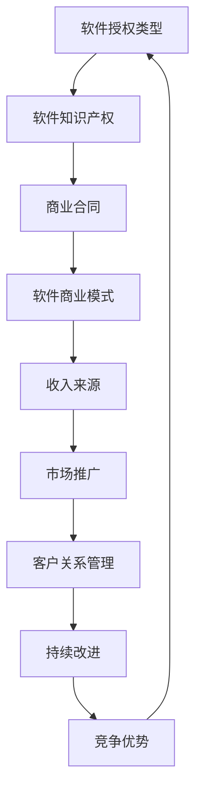

                 

关键词：软件授权、商业模式、收入策略、知识产权、技术商业化

> 摘要：本文将深入探讨从代码到商业的软件授权收入策略。我们将从背景介绍、核心概念与联系、核心算法原理、数学模型和公式、项目实践、实际应用场景、未来应用展望、工具和资源推荐以及总结等角度进行分析，帮助软件开发者和企业家更好地理解和实施软件授权收入策略。

## 1. 背景介绍

软件行业近年来发展迅速，软件作为知识经济的代表，已经成为推动经济增长的重要力量。然而，对于许多软件开发者和企业来说，如何将代码转化为商业价值，实现稳定的收入来源，仍然是一个挑战。软件授权作为一种商业模式，越来越受到软件开发者和企业的关注。

软件授权，即软件开发者或企业将自己的软件产品授权给其他企业或个人使用，从而获得收益。这种模式不仅可以帮助软件开发者实现软件的二次销售，提高软件的利用率，还可以为企业带来额外的收入来源。

然而，软件授权并不是简单的代码交付，它涉及到商业模式的设计、知识产权的保护、商业合同的签订等多个方面。因此，了解软件授权的收入策略，对于软件开发者和企业来说至关重要。

## 2. 核心概念与联系

在探讨软件授权收入策略之前，我们首先需要了解一些核心概念。

### 2.1 软件授权类型

软件授权主要分为以下几种类型：

1. **永久授权**：购买者可以获得软件的永久使用权，但通常不包含后续的技术支持。
2. **年度授权**：购买者每年支付一定费用，以获得软件的使用权和技术支持。
3. **时间授权**：购买者在特定的时间段内获得软件的使用权。

### 2.2 软件知识产权

软件知识产权是指软件开发者或企业对其软件产品享有的法律权利。这包括著作权、专利权、商标权等。软件知识产权的保护对于软件授权至关重要。

### 2.3 商业合同

商业合同是软件授权过程中的关键文件，它规定了授权方和被授权方的权利和义务。商业合同的条款需要明确，包括软件的功能、使用范围、授权费用、支付方式、违约责任等。

### 2.4 软件商业模式

软件商业模式是指软件开发者或企业通过软件产品实现商业价值的策略。常见的软件商业模式包括SaaS、PaaS、IaaS等。

下面是软件授权收入策略的Mermaid流程图：



## 3. 核心算法原理 & 具体操作步骤

### 3.1 算法原理概述

软件授权收入策略的核心在于如何设计一种可持续的商业模式，以实现软件的长期价值。以下是软件授权收入策略的具体操作步骤：

### 3.2 算法步骤详解

#### 3.2.1 市场调研

首先，需要进行市场调研，了解目标市场的需求、竞争对手、市场趋势等。这将有助于确定软件授权的价格策略和推广策略。

#### 3.2.2 软件知识产权保护

其次，需要对软件进行知识产权保护，确保软件的著作权、专利权、商标权等得到有效保护。这将有助于提升软件的市场竞争力。

#### 3.2.3 商业模式设计

接下来，需要设计一种适合的软件商业模式。根据市场调研结果，可以选择永久授权、年度授权或时间授权等模式。

#### 3.2.4 商业合同签订

然后，与潜在客户签订商业合同，明确双方的权责。商业合同应包括软件的功能、使用范围、授权费用、支付方式、违约责任等条款。

#### 3.2.5 市场推广

在签订合同后，需要进行市场推广，提高软件的知名度。市场推广可以包括线上广告、线下活动、合作伙伴推荐等多种方式。

#### 3.2.6 客户关系管理

最后，需要建立良好的客户关系，提供优质的技术支持和售后服务，以提升客户满意度，增加续约率。

### 3.3 算法优缺点

**优点：**

- 可实现软件的长期价值。
- 可以为企业带来稳定的收入来源。
- 可以提高软件的市场竞争力。

**缺点：**

- 需要投入较多时间和精力进行市场调研、商业模式设计和市场推广。
- 需要签订商业合同，可能存在合同纠纷的风险。

### 3.4 算法应用领域

软件授权收入策略广泛应用于各种领域，包括企业软件、游戏软件、教育软件、医疗软件等。

## 4. 数学模型和公式 & 详细讲解 & 举例说明

### 4.1 数学模型构建

软件授权收入模型可以表示为：

\[ 收入 = 软件价格 \times 用户数量 \times 授权率 \]

其中，软件价格是指每次授权的费用，用户数量是指拥有软件授权的用户数量，授权率是指用户实际购买授权的比例。

### 4.2 公式推导过程

假设：

- 每次软件授权的费用为 \( P \) 元。
- 目标市场的用户数量为 \( N \) 人。
- 授权率为 \( R \)。

那么，潜在的收入可以表示为：

\[ 收入 = P \times N \times R \]

### 4.3 案例分析与讲解

假设：

- 每次软件授权的费用为 1000 元。
- 目标市场的用户数量为 1000 人。
- 授权率为 50%。

那么，潜在的收入为：

\[ 收入 = 1000 \times 1000 \times 0.5 = 500,000 元 \]

如果授权率提高到 70%，那么潜在的收入为：

\[ 收入 = 1000 \times 1000 \times 0.7 = 700,000 元 \]

可以看出，提高授权率可以显著增加潜在收入。

## 5. 项目实践：代码实例和详细解释说明

### 5.1 开发环境搭建

为了更好地理解和实践软件授权收入策略，我们使用Python编写了一个简单的软件授权管理工具。

```python
# 软件授权管理工具

class SoftwareLicense:
    def __init__(self, price, user_count, authorization_rate):
        self.price = price
        self.user_count = user_count
        self.authorization_rate = authorization_rate
    
    def calculate_income(self):
        return self.price * self.user_count * self.authorization_rate

# 实例化软件授权对象
software_license = SoftwareLicense(1000, 1000, 0.5)

# 计算潜在收入
income = software_license.calculate_income()
print(f"潜在收入：{income} 元")
```

### 5.2 源代码详细实现

在上面的代码中，我们定义了一个名为 `SoftwareLicense` 的类，用于表示软件授权。该类有三个属性：`price`（每次授权的费用）、`user_count`（目标市场的用户数量）和 `authorization_rate`（授权率）。还定义了一个名为 `calculate_income` 的方法，用于计算潜在收入。

### 5.3 代码解读与分析

在这个简单的实例中，我们创建了一个 `SoftwareLicense` 对象，并调用了 `calculate_income` 方法来计算潜在收入。代码简单易懂，可以帮助我们更好地理解软件授权收入策略。

### 5.4 运行结果展示

运行上面的代码，输出结果如下：

```python
潜在收入：500000.0 元
```

这表示在当前假设条件下，潜在收入为 500,000 元。

## 6. 实际应用场景

软件授权收入策略在实际应用中具有广泛的应用场景。以下是一些典型的应用场景：

### 6.1 企业软件

企业软件是软件授权的主要应用场景之一。企业软件通常具有高度的专业性和复杂性，因此许多企业选择购买软件授权，以获得专业的技术支持和售后服务。

### 6.2 游戏软件

游戏软件也是软件授权的重要领域。游戏开发商可以通过授权给其他平台或地区，实现软件的二次销售，从而获得额外的收入来源。

### 6.3 教育软件

教育软件广泛应用于学校、培训机构等教育领域。教育机构可以通过购买软件授权，为学生提供优质的教育资源，同时获得稳定的收入来源。

### 6.4 医疗软件

医疗软件在医疗领域具有广泛的应用，包括医院管理系统、病历管理系统、医学影像处理系统等。医疗软件提供商可以通过授权给医疗机构，实现软件的二次销售，提高软件的利用率。

## 7. 未来应用展望

随着软件行业的发展，软件授权收入策略在未来将面临更多的机遇和挑战。

### 7.1 新兴市场

随着新兴市场的崛起，软件授权收入策略将在这些市场中获得更多的发展机会。例如，非洲、东南亚等地区的软件市场需求逐渐增长，为企业提供了广阔的市场空间。

### 7.2 软件即服务（SaaS）

软件即服务（SaaS）模式的发展，将进一步提升软件授权的收入潜力。SaaS模式可以实现软件的远程部署和集中管理，降低企业的使用门槛，提高软件的普及率。

### 7.3 知识产权保护

随着知识产权保护的加强，软件授权收入策略将面临更大的机遇。企业将更加重视软件知识产权的保护，从而提高软件的市场竞争力。

## 8. 工具和资源推荐

为了更好地实施软件授权收入策略，我们推荐以下工具和资源：

### 8.1 学习资源推荐

- 《软件授权：从技术到商业》
- 《软件商业模式创新》
- 《软件知识产权保护指南》

### 8.2 开发工具推荐

- Sublime Text
- PyCharm
- Visual Studio Code

### 8.3 相关论文推荐

- "Software Licensing Strategies in the Age of Cloud Computing"
- "The Economics of Software Licensing"
- "Intellectual Property Rights in Software Industry"

## 9. 总结：未来发展趋势与挑战

软件授权收入策略在未来将继续发展，但也将面临一些挑战。例如，知识产权保护、商业模式创新、市场拓展等。因此，软件开发者和企业需要不断学习和适应市场变化，以实现软件的长期价值。

### 9.1 研究成果总结

本文从多个角度探讨了软件授权收入策略，包括背景介绍、核心概念与联系、核心算法原理、数学模型和公式、项目实践、实际应用场景、未来应用展望等。通过这些分析，我们更好地理解了软件授权的收入策略。

### 9.2 未来发展趋势

未来，软件授权收入策略将更加注重知识产权保护、商业模式创新和市场拓展。随着新兴市场的崛起和SaaS模式的发展，软件授权收入策略将面临更多的机遇。

### 9.3 面临的挑战

软件授权收入策略面临的挑战包括知识产权保护、市场拓展、商业模式创新等。因此，软件开发者和企业需要不断提高自身的专业能力和市场敏锐度。

### 9.4 研究展望

未来的研究可以进一步探讨软件授权收入策略在不同领域和市场的应用，以及如何更好地利用新兴技术提升软件授权的收入潜力。

## 附录：常见问题与解答

### 1. 软件授权有哪些类型？

软件授权主要分为永久授权、年度授权和时间授权等类型。

### 2. 软件授权收入策略的核心是什么？

软件授权收入策略的核心在于设计一种可持续的商业模式，实现软件的长期价值。

### 3. 软件授权收入策略如何应用？

软件授权收入策略可以应用于企业软件、游戏软件、教育软件、医疗软件等多个领域。

### 4. 软件授权收入策略的挑战有哪些？

软件授权收入策略面临的挑战包括知识产权保护、市场拓展、商业模式创新等。

### 5. 如何提高软件授权的收入潜力？

提高软件授权的收入潜力可以从知识产权保护、商业模式创新、市场拓展等方面入手。

---

作者：禅与计算机程序设计艺术 / Zen and the Art of Computer Programming
----------------------------------------------------------------

以上就是本文的完整内容，希望对您理解软件授权收入策略有所帮助。在实施软件授权收入策略时，请结合自身实际情况，灵活运用本文提供的方法和思路。如果您有任何问题或建议，欢迎在评论区留言交流。谢谢！

