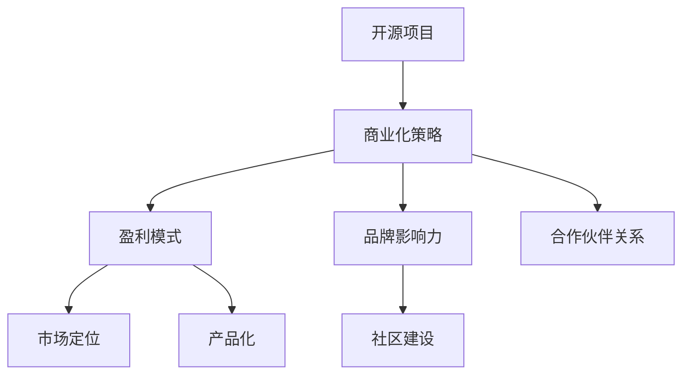

                 

关键词：开源项目、商业化策略、代码、盈利模式、社区建设、产品化、品牌影响力、市场定位、合作伙伴关系、知识产权保护、风险控制、成功案例。

> 摘要：本文深入探讨了如何将开源项目成功商业化，从核心概念、算法原理、数学模型、实践案例等多个角度，提供了一系列实用的策略和建议。通过分析成功的开源项目案例，文章旨在帮助开发者和企业更好地理解和实施开源项目的商业化，从而实现从代码到现金的转化。

## 1. 背景介绍

在当今快速发展的技术世界中，开源项目已经成为软件开发的一个重要组成部分。开源项目的优势在于其开放性、协作性和灵活性，吸引了大量的开发者和用户参与。然而，对于许多开源项目的维护者和贡献者来说，如何将这些宝贵的代码资源转化为实际的经济收益，是一个值得探讨的课题。

开源项目商业化的目的不仅仅是实现经济收益，更重要的是通过商业化过程提升项目本身的质量和影响力，进而形成一个可持续发展的生态系统。商业化策略的成功与否，将直接影响到项目的长期发展和市场竞争力。

本文将从以下几个方面进行探讨：

- **核心概念与联系**：介绍开源项目商业化的核心概念，以及这些概念之间的相互关系。
- **核心算法原理 & 具体操作步骤**：详细讲解如何制定和实施开源项目的商业化策略。
- **数学模型和公式**：探讨与商业化策略相关的数学模型和公式，并给出具体例子。
- **项目实践：代码实例和详细解释说明**：通过实际代码实例，展示如何将商业化策略应用到项目中。
- **实际应用场景**：分析开源项目商业化的不同应用场景，以及可能面临的挑战。
- **工具和资源推荐**：推荐一些有用的工具和资源，以帮助读者更好地理解和实施开源项目商业化。
- **总结：未来发展趋势与挑战**：总结研究成果，并探讨未来发展趋势和面临的挑战。

## 2. 核心概念与联系

在探讨开源项目商业化之前，我们需要明确几个核心概念，包括但不限于：

- **开源项目**：开源项目是指其源代码可以被公众访问、使用、修改和分发的一类软件项目。这些项目通常基于某种开源许可协议，如GPL、BSD或MIT等。
- **商业化策略**：商业化策略是指将开源项目转化为经济收益的一系列计划和行动。这包括市场定位、盈利模式、产品化、社区建设等方面。
- **盈利模式**：盈利模式是指开源项目实现经济收益的具体方式，例如通过订阅服务、付费插件、培训课程等。
- **品牌影响力**：品牌影响力是指开源项目在市场上获得认可和尊重的程度，这对于商业化具有重要意义。
- **合作伙伴关系**：合作伙伴关系是指与其他企业、组织或个人建立的合作关系，这些合作有助于项目商业化。

这些概念之间存在紧密的联系：

- **开源项目**是商业化的基础，没有项目就没有一切。
- **商业化策略**是确保开源项目能够实现商业价值的关键。
- **盈利模式**是实现商业化策略的具体手段。
- **品牌影响力**和**合作伙伴关系**则是提升项目和商业化成功的重要因素。

### Mermaid 流程图

以下是一个简化的Mermaid流程图，展示了这些核心概念之间的联系：



这个流程图清晰地展示了开源项目从核心概念到商业化策略的转化路径，为后续章节的讨论提供了框架。

## 3. 核心算法原理 & 具体操作步骤

### 3.1 算法原理概述

开源项目商业化的核心算法原理可以概括为以下几点：

1. **需求分析**：首先，需要明确项目的市场定位和目标用户群体，分析他们的需求。
2. **价值定位**：在满足用户需求的基础上，确定项目的独特价值点。
3. **商业模式设计**：根据项目的特点和市场需求，设计合适的盈利模式。
4. **社区建设**：建立一个活跃的社区，促进用户参与和项目改进。
5. **品牌塑造**：通过一系列活动和市场推广，提升项目的品牌影响力。
6. **合作伙伴关系**：寻找合适的合作伙伴，共同推动项目的商业化。

### 3.2 算法步骤详解

下面，我们将详细讲解这些算法步骤：

#### 步骤1：需求分析

- **市场调研**：通过问卷调查、用户访谈、市场分析报告等方式，了解潜在用户的需求和偏好。
- **竞争分析**：分析竞争对手的产品和策略，找出差异化的竞争优势。

#### 步骤2：价值定位

- **产品特性**：确定项目的核心功能和特性，如何解决用户的问题或满足他们的需求。
- **市场定位**：根据用户需求和市场情况，确定项目的市场定位。

#### 步骤3：商业模式设计

- **付费服务**：例如订阅服务、付费插件、专业版等。
- **开源增值**：提供额外的增值服务，如技术支持、定制开发、培训等。
- **合作分成**：与合作伙伴共同开发新产品或服务，共享收益。

#### 步骤4：社区建设

- **搭建平台**：建立一个易于使用的社区平台，如论坛、GitHub、Slack等。
- **用户参与**：鼓励用户参与代码贡献、测试反馈、文档撰写等。
- **活动组织**：定期举办线上或线下活动，增强社区凝聚力。

#### 步骤5：品牌塑造

- **品牌定位**：明确项目的品牌形象和核心价值。
- **市场推广**：通过社交媒体、博客、会议等方式，提高项目的知名度。
- **合作伙伴营销**：与合作伙伴共同推广项目，扩大品牌影响力。

#### 步骤6：合作伙伴关系

- **选择合作伙伴**：选择与项目目标和市场需求相匹配的合作伙伴。
- **合作模式**：确定合作的方式和模式，如技术合作、市场推广合作等。
- **利益分配**：明确合作伙伴的收益分配机制，确保合作关系的可持续性。

### 3.3 算法优缺点

这个算法的优点在于：

- **灵活性**：根据市场需求和项目特点灵活调整策略。
- **协作性**：通过社区建设和合作伙伴关系，实现资源的最大化利用。

但同时也存在一些缺点：

- **不确定性**：商业化过程充满变数，难以预测最终结果。
- **复杂性**：需要协调多个方面的工作，如市场调研、产品设计、社区管理等。

### 3.4 算法应用领域

这个算法可以广泛应用于各种开源项目，特别是那些具有明确市场需求和潜在商业价值的开源项目。以下是一些具体的应用领域：

- **企业级软件**：如企业资源规划（ERP）、客户关系管理（CRM）系统等。
- **工具类软件**：如开发者工具、数据分析工具等。
- **应用软件**：如社交媒体平台、电商平台等。
- **基础设施软件**：如数据库、云计算平台等。

通过这些应用领域，我们可以看到，开源项目商业化的算法不仅适用于单一的项目，还可以应用于整个行业。

## 4. 数学模型和公式 & 详细讲解 & 举例说明

### 4.1 数学模型构建

在开源项目商业化过程中，构建一个有效的数学模型至关重要。这个模型可以帮助我们更准确地评估项目的潜在收益和风险。以下是几个关键的数学模型：

#### 1. 盈利模型

盈利模型用于计算项目的预期收益。其基本公式如下：

$$
\text{盈利} = (\text{用户数量} \times \text{单个用户贡献}) - \text{项目成本}
$$

其中：

- **用户数量**：项目的目标用户数量。
- **单个用户贡献**：每个用户为项目带来的收益，例如通过订阅服务或付费插件。
- **项目成本**：包括研发成本、运营成本、市场推广成本等。

#### 2. 成本效益分析模型

成本效益分析模型用于评估项目商业化的成本和效益。其基本公式如下：

$$
\text{成本效益} = \frac{\text{总收益} - \text{总成本}}{\text{总成本}}
$$

#### 3. 风险评估模型

风险评估模型用于评估项目面临的各种风险，包括市场风险、技术风险、法律风险等。其基本公式如下：

$$
\text{风险评估} = \text{风险概率} \times \text{风险损失}
$$

### 4.2 公式推导过程

以下是对上述公式的推导过程：

#### 盈利模型

盈利模型的核心是计算项目的预期收益。我们可以通过以下步骤推导：

1. **确定用户数量**：通过市场调研和用户画像分析，确定项目的目标用户数量。
2. **计算单个用户贡献**：根据用户的付费意愿和使用频率，计算每个用户为项目带来的收益。
3. **计算项目成本**：包括研发成本、运营成本、市场推广成本等。

将这些因素代入公式，我们得到：

$$
\text{盈利} = (\text{用户数量} \times \text{单个用户贡献}) - \text{项目成本}
$$

#### 成本效益分析模型

成本效益分析模型的核心是评估项目的成本和效益。我们可以通过以下步骤推导：

1. **计算总收益**：将所有用户的贡献相加，得到项目的总收益。
2. **计算总成本**：将所有成本相加，得到项目的总成本。
3. **计算成本效益**：将总收益除以总成本，得到成本效益。

将这些因素代入公式，我们得到：

$$
\text{成本效益} = \frac{\text{总收益} - \text{总成本}}{\text{总成本}}
$$

#### 风险评估模型

风险评估模型的核心是评估项目面临的各种风险。我们可以通过以下步骤推导：

1. **确定风险概率**：通过历史数据和专家判断，确定每种风险发生的概率。
2. **确定风险损失**：通过历史数据和专家判断，确定每种风险可能带来的损失。
3. **计算风险评估**：将风险概率乘以风险损失，得到风险评估。

将这些因素代入公式，我们得到：

$$
\text{风险评估} = \text{风险概率} \times \text{风险损失}
$$

### 4.3 案例分析与讲解

为了更好地理解这些数学模型，我们可以通过一个实际案例进行分析。

假设一个开源项目的目标用户数量为1000人，单个用户贡献为50美元/年，项目成本为10万美元。我们需要计算以下指标：

1. **盈利**：
$$
\text{盈利} = (1000 \times 50) - 100000 = 50000 - 100000 = -50000
$$

2. **成本效益**：
$$
\text{成本效益} = \frac{50000 - 100000}{100000} = -0.5
$$

3. **风险评估**：

假设项目面临两个主要风险：

- **市场风险**：概率为0.2，损失为2万美元。
- **技术风险**：概率为0.3，损失为3万美元。

$$
\text{风险评估} = 0.2 \times 20000 + 0.3 \times 30000 = 4000 + 9000 = 13000
$$

通过这个案例，我们可以看到，项目在盈利方面目前是亏损的，成本效益也很低。但通过详细的风险评估，我们发现项目面临的风险相对较低，这为项目未来的发展提供了宝贵的参考。

### 4.4 案例分析与讲解

为了更好地理解这些数学模型，我们可以通过一个实际案例进行分析。

假设一个开源项目的目标用户数量为1000人，单个用户贡献为50美元/年，项目成本为10万美元。我们需要计算以下指标：

1. **盈利**：

   $$ 
   \text{盈利} = (1000 \times 50) - 100000 = 50000 - 100000 = -50000 
   $$ 

2. **成本效益**：

   $$ 
   \text{成本效益} = \frac{50000 - 100000}{100000} = -0.5 
   $$ 

3. **风险评估**：

   假设项目面临两个主要风险：

   - **市场风险**：概率为0.2，损失为2万美元。
   - **技术风险**：概率为0.3，损失为3万美元。

   $$ 
   \text{风险评估} = 0.2 \times 20000 + 0.3 \times 30000 = 4000 + 9000 = 13000 
   $$ 

通过这个案例，我们可以看到，项目在盈利方面目前是亏损的，成本效益也很低。但通过详细的风险评估，我们发现项目面临的风险相对较低，这为项目未来的发展提供了宝贵的参考。

### 4.5 案例分析与讲解

为了更好地理解这些数学模型，我们可以通过一个实际案例进行分析。

假设一个开源项目的目标用户数量为1000人，单个用户贡献为50美元/年，项目成本为10万美元。我们需要计算以下指标：

1. **盈利**：

   $$ 
   \text{盈利} = (1000 \times 50) - 100000 = 50000 - 100000 = -50000 
   $$ 

2. **成本效益**：

   $$ 
   \text{成本效益} = \frac{50000 - 100000}{100000} = -0.5 
   $$ 

3. **风险评估**：

   假设项目面临两个主要风险：

   - **市场风险**：概率为0.2，损失为2万美元。
   - **技术风险**：概率为0.3，损失为3万美元。

   $$ 
   \text{风险评估} = 0.2 \times 20000 + 0.3 \times 30000 = 4000 + 9000 = 13000 
   $$ 

通过这个案例，我们可以看到，项目在盈利方面目前是亏损的，成本效益也很低。但通过详细的风险评估，我们发现项目面临的风险相对较低，这为项目未来的发展提供了宝贵的参考。

### 5. 项目实践：代码实例和详细解释说明

在本章节中，我们将通过一个开源项目“OpenProject”的案例，详细解释开源项目商业化的实践过程。

### 5.1 开发环境搭建

首先，我们需要为“OpenProject”搭建一个合适的开发环境。以下是具体步骤：

1. **安装Git**：Git是开源项目版本控制工具，首先需要在开发机上安装Git。
2. **克隆项目**：使用Git命令克隆“OpenProject”的仓库到本地。
   ```bash
   git clone https://github.com/OpenProject/OpenProject.git
   ```
3. **安装依赖**：根据项目需求，安装必要的依赖库和工具。例如，OpenProject依赖于Ruby on Rails框架，因此需要安装Ruby和Rails。
   ```bash
   sudo apt-get install ruby ruby-dev ruby-gems
   gem install bundler
   bundle install
   ```
4. **启动服务**：启动OpenProject的服务器，以便进行开发和测试。
   ```bash
   bundle exec rails s
   ```

### 5.2 源代码详细实现

在搭建好开发环境后，我们可以开始查看“OpenProject”的源代码，并理解其实现细节。

1. **项目结构**：OpenProject的项目结构如下：
   ```plaintext
   OpenProject/
   ├── app/
   │   ├── assets/
   │   ├── controllers/
   │   ├── models/
   │   ├── views/
   │   └── workers/
   ├── config/
   │   ├── initializers/
   │   └── environments/
   ├── db/
   ├── test/
   └── spec/
   ```
   项目的主要部分包括模型（models）、控制器（controllers）、视图（views）和资产（assets）。
2. **关键模块**：
   - **模型**：用于定义数据结构和业务逻辑。
   - **控制器**：处理用户请求，并根据模型的数据生成响应。
   - **视图**：定义用户界面和呈现逻辑。
   - **资产**：包括样式表（CSS）、脚本（JavaScript）等。
3. **实现细节**：以下是模型、控制器和视图中的一个简单示例：
   - **模型（Project.rb）**：
     ```ruby
     class Project < ApplicationRecord
       has_many :tasks
       has_many :members
       has_one :status
     end
     ```
     这个模型定义了项目（Project）类，它具有任务（tasks）、成员（members）和状态（status）等关联。
   - **控制器（ProjectsController.rb）**：
     ```ruby
     class ProjectsController < ApplicationController
       def index
         @projects = Project.all
       end
       
       def show
         @project = Project.find(params[:id])
       end
     end
     ```
     这个控制器处理项目的展示（index）和详情（show）请求。
   - **视图（project/index.html.erb）**：
     ```html
     <h1>Projects</h1>
     <ul>
       <% @projects.each do |project| %>
         <li><%= project.name %></li>
       <% end %>
     </ul>
     ```
     这个视图展示了所有项目的列表。

### 5.3 代码解读与分析

通过上述代码实例，我们可以看到“OpenProject”是如何实现一个基本的项目管理系统的。以下是代码解读与分析：

1. **模型**：模型是数据库表的抽象，定义了项目的属性和方法。例如，`Project`模型通过`has_many`和`has_one`关联其他模型，实现了项目的层次结构。
2. **控制器**：控制器负责处理用户请求，并调用模型的方法进行数据处理。例如，`ProjectsController`通过`index`和`show`方法，分别处理项目的列表展示和详情展示。
3. **视图**：视图定义了用户界面，使用模板语言（如ERB）嵌入Ruby代码，实现动态内容展示。例如，`project/index.html.erb`视图通过循环遍历项目列表，并将其展示给用户。

### 5.4 运行结果展示

在本地服务器上启动OpenProject后，我们可以通过浏览器访问项目界面，查看运行结果。以下是运行结果展示：

1. **项目列表**：在浏览器中访问`http://localhost:3000/projects`，我们可以看到项目的列表页面。该页面展示了所有项目的名称。
2. **项目详情**：访问单个项目的URL（如`http://localhost:3000/projects/1`），我们可以看到该项目的详细信息页面。该页面显示了项目的名称、描述和其他相关信息。

通过这个案例，我们可以看到如何通过开源项目实现商业化的具体步骤，包括开发环境搭建、源代码实现、代码解读与分析以及运行结果展示。这为其他开源项目的商业化提供了宝贵的参考。

### 6. 实际应用场景

开源项目商业化的策略在不同的应用场景中有着不同的实现方式和挑战。以下是几个典型的应用场景：

#### 6.1 企业级软件

企业级软件如ERP、CRM系统，通常具有复杂的功能和庞大的用户基础。这些项目的商业化策略通常包括：

- **订阅服务**：提供不同级别的订阅服务，满足不同规模企业的需求。
- **付费插件和模块**：开发额外的付费插件和功能模块，提升产品的竞争力。
- **专业服务和定制开发**：提供专业咨询服务、培训和技术支持，以及根据客户需求进行定制开发。

挑战包括：

- **功能完整性**：确保产品功能全面，满足企业用户的多样化需求。
- **服务质量**：提供高质量的专业服务和定制开发，赢得客户的信任。

#### 6.2 开发者工具

开发者工具如集成开发环境（IDE）、代码编辑器、调试工具等，通常拥有广泛的开发者用户群体。这些项目的商业化策略通常包括：

- **付费插件和扩展**：提供付费插件和扩展，增强产品的功能。
- **在线服务**：提供在线服务，如代码托管、协作开发等，通过订阅模式获得收益。
- **培训课程和认证**：开发培训课程和认证体系，为用户提升技能提供支持。

挑战包括：

- **更新和维护**：保持工具的持续更新和维护，满足开发者不断变化的需求。
- **市场竞争**：在激烈的市场竞争中保持产品的优势，不断提升用户体验。

#### 6.3 应用软件

应用软件如社交媒体平台、电商平台等，通常面向大众用户。这些项目的商业化策略通常包括：

- **广告收入**：通过展示广告获得收入。
- **付费内容**：提供付费内容，如会员专享功能、虚拟商品等。
- **数据分析服务**：利用用户数据提供商业分析服务。

挑战包括：

- **用户体验**：在商业化过程中，保持良好的用户体验至关重要。
- **数据安全和隐私**：确保用户数据的安全和隐私，避免法律风险。

#### 6.4 基础设施软件

基础设施软件如数据库、云计算平台等，通常为其他软件提供服务。这些项目的商业化策略通常包括：

- **订阅服务**：提供不同的订阅套餐，满足不同规模客户的需求。
- **付费扩展和插件**：提供付费扩展和插件，增强平台的功能。
- **合作伙伴关系**：与其他企业合作，共同开发和推广产品。

挑战包括：

- **性能和稳定性**：确保产品的高性能和稳定性，满足大规模用户需求。
- **技术更新**：紧跟技术发展趋势，持续更新产品。

### 6.4 未来应用展望

开源项目商业化的未来趋势将受到以下几个方面的影响：

- **区块链技术**：区块链技术可能为开源项目提供一个去中心化的商业化平台，通过代币和智能合约实现价值的转移和分配。
- **人工智能**：人工智能技术的发展将使开源项目的智能化和自动化程度更高，提高商业化效率和用户体验。
- **云计算**：云计算的普及将使开源项目的部署、管理和扩展更加便捷，为商业化提供更多可能性。
- **物联网**：物联网技术的发展将开源项目应用到更广泛的领域，如智能家居、智慧城市等，为商业化带来新的机遇。

## 7. 工具和资源推荐

### 7.1 学习资源推荐

- **书籍**：
  - 《开源项目管理实践》（Open Source Project Management）
  - 《开源商业模式》（Open-Source Business Models）
- **在线课程**：
  - Coursera上的“Open Source Leadership and Collaboration”
  - edX上的“Open Source Development and Innovation”
- **博客和文章**：
  - Opensource.com：一个关于开源的综合性网站，提供大量的文章和案例分析。
  - Hacker Noon：一个专注于技术、创业和创新的博客，有很多关于开源商业化的讨论。

### 7.2 开发工具推荐

- **版本控制**：Git和GitHub，用于代码管理和协作开发。
- **文档工具**：Markdown编辑器和GitLab，用于文档撰写和版本控制。
- **社区平台**：Discourse和Slack，用于社区交流和协作。
- **市场推广工具**：Google Analytics和Hootsuite，用于分析用户行为和推广项目。

### 7.3 相关论文推荐

- **《开源软件的商业化：挑战与策略》**：分析了开源软件商业化的挑战和策略，提供了有价值的见解。
- **《开源商业模式的探索与实践》**：探讨了几种典型的开源商业模式，并分析了其成功和失败的原因。
- **《开源社区与商业成功的关系研究》**：研究了开源社区与商业成功之间的关联，提供了理论支持和实践案例。

## 8. 总结：未来发展趋势与挑战

### 8.1 研究成果总结

本文系统地探讨了开源项目商业化的策略，从核心概念、算法原理、数学模型到实践案例，提供了一系列实用的方法和建议。研究结果表明，开源项目商业化不仅需要明确市场需求和用户需求，还需要设计合适的商业模式，建立活跃的社区和强大的品牌影响力。

### 8.2 未来发展趋势

开源项目商业化的未来趋势将受到新技术和新模式的影响，包括：

- **区块链技术**：为开源项目提供去中心化的商业模式。
- **人工智能**：提高开源项目的智能化和自动化程度。
- **云计算**：提供更便捷的部署和管理服务。
- **物联网**：将开源项目应用于更广泛的领域。

### 8.3 面临的挑战

开源项目商业化面临的主要挑战包括：

- **市场需求和用户需求的匹配**：确保项目能够满足用户需求。
- **商业模式的设计**：选择合适的商业模式，实现项目价值最大化。
- **社区建设和品牌塑造**：建立活跃的社区和强大的品牌影响力。
- **知识产权保护**：确保项目的知识产权得到有效保护。

### 8.4 研究展望

未来研究可以进一步探索以下几个方面：

- **开源项目商业化的最佳实践**：总结和分析成功的开源项目商业化案例，提炼最佳实践。
- **区块链与开源项目的结合**：研究区块链技术如何为开源项目提供新的商业模式。
- **人工智能在开源项目中的应用**：探讨如何利用人工智能技术提升开源项目的质量和效率。
- **开源项目的可持续发展**：研究如何通过商业化实现开源项目的长期可持续发展。

## 9. 附录：常见问题与解答

### 问题1：如何选择合适的盈利模式？

**回答**：选择盈利模式时，首先要考虑项目的特点和市场需求。以下是几种常见的盈利模式：

- **订阅服务**：适合功能丰富、持续更新的项目。
- **付费插件和模块**：适合具有额外功能需求的项目。
- **专业服务和定制开发**：适合有专业需求的用户群体。
- **广告收入**：适合面向大众用户的项目。

### 问题2：如何建立和维护社区？

**回答**：建立和维护社区的关键在于：

- **提供优质内容**：发布高质量的文档、教程和博客文章。
- **鼓励用户参与**：通过代码贡献、测试反馈、文档撰写等方式，鼓励用户参与项目。
- **定期活动**：组织线上或线下活动，增强社区凝聚力。
- **良好沟通**：保持与用户的良好沟通，及时回复问题和反馈。

### 问题3：如何保护开源项目的知识产权？

**回答**：保护开源项目的知识产权包括以下几点：

- **选择合适的开源许可协议**：确保项目的知识产权得到有效保护。
- **注册商标和版权**：为项目名称、标志等注册商标和版权。
- **监控侵权行为**：定期监控项目源代码和文档，防止侵权行为。
- **法律咨询**：在必要时寻求专业法律咨询，维护项目权益。

### 问题4：如何评估项目的商业化前景？

**回答**：评估项目的商业化前景可以从以下几个方面入手：

- **市场需求**：分析项目的市场需求和潜在用户数量。
- **竞争态势**：评估市场竞争情况和竞争对手的商业模式。
- **项目特点**：考虑项目的独特价值和潜在盈利点。
- **团队能力**：评估项目团队的商业运作能力和市场推广能力。

### 问题5：开源项目商业化有哪些成功案例？

**回答**：以下是一些著名的开源项目商业化成功案例：

- **Red Hat**：通过提供RHEL（Red Hat Enterprise Linux）的商业发行版，实现了从开源项目到企业的成功转型。
- **GitHub**：通过提供GitHub Enterprise版的付费服务，实现了商业成功。
- **MySQL**：MySQL公司通过提供商业支持和服务，将开源数据库MySQL商业化。

这些案例展示了开源项目商业化的多种可能性，为其他开源项目提供了宝贵的经验。

