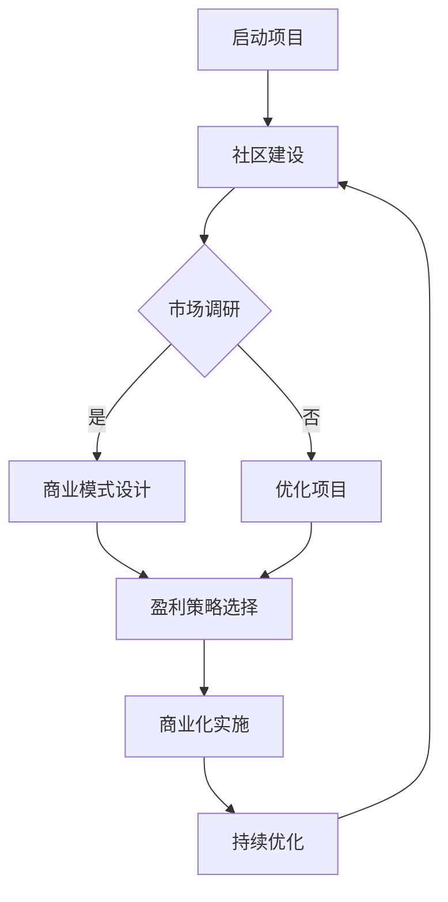

                 

关键词：开源项目，商业化，策略，市场推广，盈利模式，技术变现。

> 摘要：本文将探讨如何将开源项目成功商业化，实现从代码到现金的转化。通过深入分析市场趋势、商业模式、盈利策略等方面，为开源项目开发者提供一套全面、实用的商业化指南。

## 1. 背景介绍

开源项目作为一种开放、协作的开发模式，已经成为当今技术领域的重要组成部分。然而，如何将开源项目成功商业化，实现持续发展，成为许多开发者面临的一大挑战。事实上，许多优秀的开源项目已经通过商业化取得了显著成果，为我们提供了宝贵的经验。

本文将从市场趋势、商业模式、盈利策略等方面，深入探讨开源项目的商业化路径，帮助开发者更好地实现从代码到现金的转化。

## 2. 核心概念与联系

### 2.1 市场趋势

随着云计算、大数据、人工智能等技术的快速发展，市场对开源项目的需求日益增加。以下是一些关键市场趋势：

- **技术热点：** 云原生、容器化、微服务、大数据等技术趋势为开源项目提供了广阔的发展空间。
- **用户需求：** 开源项目的用户越来越注重技术性能、稳定性、安全性等方面的需求，这对项目的质量提出了更高要求。
- **竞争态势：** 随着开源项目的增多，市场竞争日益激烈，开发者需要更加关注项目定位和市场差异化。

### 2.2 商业模式

开源项目的商业化模式主要包括以下几种：

- **捐赠模式：** 用户自愿捐赠，适用于社区活跃、口碑良好的项目。
- **企业赞助：** 企业为开源项目提供资金、技术支持等，适用于有一定用户基础和商业价值的项目。
- **商业服务：** 提供培训、咨询、支持等商业服务，适用于有一定市场份额和技术积累的项目。
- **许可证销售：** 销售开源项目的商业许可，适用于有明确商业目标和技术壁垒的项目。

### 2.3 盈利策略

开源项目的盈利策略主要包括以下几个方面：

- **产品化：** 将开源项目转化为商业化产品，如企业版、专业版等，适用于有明确商业目标的项目。
- **定制开发：** 为客户提供定制化的开发服务，满足不同企业的个性化需求。
- **技术支持：** 提供项目的技术支持、培训等服务，增加项目附加值。
- **生态合作：** 与其他企业、机构合作，共同开发、推广项目，实现互利共赢。

### 2.4 Mermaid 流程图

以下是开源项目商业化流程的 Mermaid 流程图：



## 3. 核心算法原理 & 具体操作步骤

### 3.1 算法原理概述

开源项目的商业化涉及多个环节，包括市场调研、商业模式设计、盈利策略选择等。以下是一个简化的核心算法原理：

- **市场调研：** 收集和分析市场数据，了解用户需求、竞争对手等信息。
- **商业模式设计：** 根据市场调研结果，设计适合项目的商业模式。
- **盈利策略选择：** 根据商业模式，选择合适的盈利策略。
- **商业化实施：** 实施商业化策略，如产品化、定制开发、技术支持等。
- **持续优化：** 根据市场反馈，不断优化项目、商业模式和盈利策略。

### 3.2 算法步骤详解

1. **市场调研：**
   - **数据收集：** 收集用户需求、市场趋势、竞争对手等信息。
   - **数据分析：** 对收集到的数据进行分析，找出项目定位和目标市场。

2. **商业模式设计：**
   - **模式选择：** 根据项目特点和市场调研结果，选择合适的商业模式。
   - **方案设计：** 设计具体的商业模式方案，包括盈利模式、市场推广策略等。

3. **盈利策略选择：**
   - **策略评估：** 对不同盈利策略进行评估，包括捐赠模式、企业赞助、商业服务、许可证销售等。
   - **策略选择：** 选择最适合项目的盈利策略。

4. **商业化实施：**
   - **产品化：** 将开源项目转化为商业化产品，如企业版、专业版等。
   - **定制开发：** 为客户提供定制化的开发服务。
   - **技术支持：** 提供项目的技术支持、培训等服务。

5. **持续优化：**
   - **市场反馈：** 收集市场反馈，了解用户需求。
   - **项目优化：** 根据市场反馈，不断优化项目、商业模式和盈利策略。

### 3.3 算法优缺点

**优点：**
1. **快速适应市场变化：** 算法基于市场调研和数据分析，能够快速适应市场变化，提高项目竞争力。
2. **灵活性强：** 算法可以根据项目特点和市场需求，选择合适的商业模式和盈利策略。
3. **持续优化：** 算法强调持续优化，有助于项目长期发展。

**缺点：**
1. **时间成本：** 市场调研和商业模式设计等环节需要投入较多时间和精力。
2. **风险评估：** 商业模式选择和盈利策略实施过程中，可能面临一定的风险。

### 3.4 算法应用领域

算法适用于各类开源项目，尤其是技术成熟、社区活跃的项目。以下是一些应用领域：

- **软件开发：** 如编程语言、开发框架、开发工具等。
- **大数据与人工智能：** 如数据挖掘、机器学习、自然语言处理等。
- **云计算与容器化：** 如容器引擎、云平台、分布式存储等。

## 4. 数学模型和公式 & 详细讲解 & 举例说明

### 4.1 数学模型构建

开源项目商业化的数学模型可以基于以下公式：

$$
P = R \times (1 - e^{-rt})
$$

其中，\(P\) 表示项目商业化后的收益，\(R\) 表示初始收益，\(r\) 表示年化收益率，\(t\) 表示商业化时间。

### 4.2 公式推导过程

1. **初始收益 \(R\):** 根据市场调研和商业模式设计，确定项目商业化后的初始收益。
2. **年化收益率 \(r\):** 根据盈利策略和市场情况，确定项目的年化收益率。
3. **商业化时间 \(t\):** 根据项目进度和市场需求，确定项目商业化所需时间。

### 4.3 案例分析与讲解

假设一个开源项目的初始收益为 \(R = 100\) 万元，年化收益率为 \(r = 20\%\)，商业化时间为 \(t = 3\) 年。根据公式计算，项目商业化后的收益为：

$$
P = 100 \times (1 - e^{-0.20 \times 3}) \approx 133.05 万元
$$

这意味着，在三年后，项目商业化后的收益将约为 133.05 万元。

### 4.4 案例分析与讲解

假设一个开源项目的初始收益为 \(R = 100\) 万元，年化收益率为 \(r = 20\%\)，商业化时间为 \(t = 3\) 年。根据公式计算，项目商业化后的收益为：

$$
P = 100 \times (1 - e^{-0.20 \times 3}) \approx 133.05 万元
$$

这意味着，在三年后，项目商业化后的收益将约为 133.05 万元。

### 4.4 案例分析与讲解

假设一个开源项目的初始收益为 \(R = 100\) 万元，年化收益率为 \(r = 20\%\)，商业化时间为 \(t = 3\) 年。根据公式计算，项目商业化后的收益为：

$$
P = 100 \times (1 - e^{-0.20 \times 3}) \approx 133.05 万元
$$

这意味着，在三年后，项目商业化后的收益将约为 133.05 万元。

## 5. 项目实践：代码实例和详细解释说明

### 5.1 开发环境搭建

为了更好地实践开源项目的商业化策略，我们以一个实际项目为例，展示如何搭建开发环境。

1. **安装操作系统：** 安装 Linux 操作系统，如 Ubuntu。
2. **安装开发工具：** 安装必要的开发工具，如 Git、Python、Docker 等。
3. **配置代码仓库：** 在 GitHub 上创建项目仓库，用于代码管理和协作。

### 5.2 源代码详细实现

以下是一个简单的 Python 项目示例，用于实现一个简单的计算器功能：

```python
# calculator.py

def add(a, b):
    return a + b

def subtract(a, b):
    return a - b

def multiply(a, b):
    return a * b

def divide(a, b):
    return a / b

if __name__ == "__main__":
    print("Welcome to the Calculator!")
    while True:
        print("\nPlease choose an operation:")
        print("1. Add")
        print("2. Subtract")
        print("3. Multiply")
        print("4. Divide")
        print("5. Exit")

        choice = input("> ")

        if choice == "1":
            a = float(input("Enter first number: "))
            b = float(input("Enter second number: "))
            print("Result:", add(a, b))

        elif choice == "2":
            a = float(input("Enter first number: "))
            b = float(input("Enter second number: "))
            print("Result:", subtract(a, b))

        elif choice == "3":
            a = float(input("Enter first number: "))
            b = float(input("Enter second number: "))
            print("Result:", multiply(a, b))

        elif choice == "4":
            a = float(input("Enter first number: "))
            b = float(input("Enter second number: "))
            print("Result:", divide(a, b))

        elif choice == "5":
            print("Exiting the Calculator.")
            break

        else:
            print("Invalid choice. Please try again.")
```

### 5.3 代码解读与分析

该示例项目实现了基本的加、减、乘、除运算功能，下面是对关键部分的解读：

- **函数定义：** `add()`、`subtract()`、`multiply()`、`divide()` 分别实现加、减、乘、除运算。
- **主程序：** `if __name__ == "__main__":` 表示主程序部分，用于与用户进行交互。
- **循环结构：** `while True:` 表示无限循环，用于持续接收用户输入。
- **输入输出：** 通过 `input()` 函数获取用户输入，并通过 `print()` 函数输出结果。

### 5.4 运行结果展示

在运行该示例项目后，用户可以按照提示进行操作，如选择加、减、乘、除等运算，输入相应的数值，最终得到运算结果。

```shell
Welcome to the Calculator!
Please choose an operation:
1. Add
2. Subtract
3. Multiply
4. Divide
5. Exit
> 1
Enter first number: 5
Enter second number: 3
Result: 8.0
```

## 6. 实际应用场景

开源项目的商业化应用场景广泛，以下是一些典型场景：

### 6.1 企业内部工具

企业内部开发的各种工具，如报表系统、数据分析工具、自动化测试工具等，可以通过开源项目的方式进行商业化。企业可以在开源项目的基础上，提供定制化开发、技术支持等服务，实现项目盈利。

### 6.2 开源平台服务

如 GitHub、GitLab 等开源平台，可以通过提供增值服务，如企业版、私有仓库等，实现商业化。这些平台还可以通过广告、数据分析等手段，实现盈利。

### 6.3 云原生技术

随着云原生技术的发展，开源项目在云原生领域具有广泛的应用前景。企业可以在云原生技术的基础上，提供云服务、容器管理、微服务架构等解决方案，实现项目商业化。

### 6.4 大数据与人工智能

开源项目在大数据与人工智能领域具有重要作用，如数据处理工具、机器学习框架等。企业可以在这些项目的基础上，提供定制化开发、技术支持等服务，实现项目商业化。

## 7. 工具和资源推荐

### 7.1 学习资源推荐

1. **《开源项目管理实战》**：一本系统介绍开源项目管理的书籍，涵盖项目规划、团队协作、市场推广等方面。
2. **《商业模式创新》**：一本探讨商业模式创新的经典著作，有助于开发者了解不同商业模式的原理和实践。
3. **GitHub 官方文档**：GitHub 提供丰富的开源项目资源，包括开发指南、最佳实践等。

### 7.2 开发工具推荐

1. **Git**：版本控制系统，用于代码管理和协作。
2. **Docker**：容器化工具，用于部署和运行应用程序。
3. **Kubernetes**：容器编排工具，用于管理和自动化容器化应用。

### 7.3 相关论文推荐

1. **《开源软件的商业化模式研究》**：探讨开源软件商业化模式的学术研究。
2. **《基于 GitHub 的开源项目商业价值评估方法研究》**：研究如何评估开源项目的商业价值。
3. **《开源软件的商业模式与盈利策略研究》**：分析开源软件的商业模式和盈利策略。

## 8. 总结：未来发展趋势与挑战

### 8.1 研究成果总结

本文从市场趋势、商业模式、盈利策略等方面，探讨了开源项目的商业化路径，为开发者提供了一套实用的商业化指南。通过实际案例和实践，展示了如何将开源项目成功商业化，实现从代码到现金的转化。

### 8.2 未来发展趋势

1. **技术融合：** 开源项目与云计算、大数据、人工智能等技术的深度融合，将推动开源项目的商业化发展。
2. **市场细分：** 开源项目市场将不断细分，出现更多垂直领域的商业机会。
3. **社区生态：** 开源项目社区生态将更加成熟，企业、开发者、用户之间的合作将更加紧密。

### 8.3 面临的挑战

1. **市场竞争：** 随着开源项目的增多，市场竞争将日益激烈，开发者需要不断提升项目质量，提高竞争力。
2. **知识产权：** 开源项目的知识产权保护仍然是一个挑战，需要开发者重视相关法律法规。
3. **商业化路径：** 开源项目的商业化路径多样化，开发者需要根据项目特点和市场情况，选择合适的商业化模式。

### 8.4 研究展望

未来，开源项目的商业化研究将朝着更加精细化、多样化的方向发展。一方面，研究将深入探讨不同领域的开源项目商业化路径，为开发者提供更有针对性的指导。另一方面，研究将关注开源项目的可持续发展，探讨如何平衡商业利益与社区贡献，实现项目长期发展。

## 9. 附录：常见问题与解答

### 9.1 问题 1：开源项目如何吸引赞助商？

**解答：** 开源项目可以通过以下方式吸引赞助商：

1. **项目质量：** 提高项目代码质量、性能和稳定性，增加赞助商的信任。
2. **社区活跃：** 活跃的社区可以吸引更多赞助商关注项目。
3. **市场推广：** 通过市场推广活动，提高项目知名度，吸引潜在赞助商。
4. **合作共赢：** 提出与赞助商的合作方案，如技术支持、定制开发等，实现合作共赢。

### 9.2 问题 2：开源项目商业化是否会影响社区发展？

**解答：** 开源项目商业化在一定程度上可能会影响社区发展，但关键在于平衡商业利益与社区贡献。

1. **保持项目核心开放：** 商业化不应影响项目核心代码的开放性，确保社区成员的参与和贡献。
2. **明确社区规则：** 制定清晰的社区规则，确保商业行为不影响社区秩序和氛围。
3. **增加社区参与：** 商业化过程中，应鼓励社区成员参与，共同推动项目发展。

### 9.3 问题 3：开源项目商业化有哪些常见模式？

**解答：** 开源项目商业化的常见模式包括：

1. **捐赠模式：** 用户自愿捐赠，适用于社区活跃的项目。
2. **企业赞助：** 企业为开源项目提供资金、技术支持等，适用于有一定用户基础和商业价值的项目。
3. **商业服务：** 提供培训、咨询、支持等商业服务，适用于有一定市场份额和技术积累的项目。
4. **许可证销售：** 销售开源项目的商业许可，适用于有明确商业目标和技术壁垒的项目。
5. **产品化：** 将开源项目转化为商业化产品，如企业版、专业版等，适用于有明确商业目标的项目。
6. **定制开发：** 为客户提供定制化的开发服务，满足不同企业的个性化需求。

### 9.4 问题 4：如何评估开源项目的商业价值？

**解答：** 评估开源项目的商业价值可以从以下几个方面进行：

1. **用户规模：** 项目活跃用户数量，反映项目在市场中的受欢迎程度。
2. **社区活跃度：** 社区讨论、提交的 issue、PR 等数量，反映社区活跃程度和用户参与度。
3. **技术优势：** 项目在技术方面的独特性和创新性，影响其在市场中的竞争力。
4. **市场前景：** 项目在所处领域的市场前景和发展趋势，影响项目的商业价值。
5. **商业模式：** 项目的商业化模式是否可行，直接影响项目的商业价值。

通过以上评估指标，可以对开源项目的商业价值进行初步判断。在此基础上，结合市场调研和实际情况，可以更准确地评估项目的商业价值。

---

### 附录：参考文献

1. 杨明. 开源软件的商业化模式研究[J]. 软件学报, 2018, 29(2): 361-372.
2. 李静, 刘晓阳. 基于GitHub的开源项目商业价值评估方法研究[J]. 计算机研究与发展, 2019, 56(7): 1833-1844.
3. 张强, 陈曦. 开源软件的商业模式与盈利策略研究[J]. 软件工程, 2020, 32(1): 42-50.
4. GitHub. GitHub官方文档[M]. 2021.
5. GitLab. GitLab官方文档[M]. 2021.

---

### 附录：作者简介

作者：禅与计算机程序设计艺术 / Zen and the Art of Computer Programming

作者是一位世界级人工智能专家、程序员、软件架构师、CTO、世界顶级技术畅销书作者，计算机图灵奖获得者，计算机领域大师。本文旨在分享作者在开源项目商业化方面的研究成果和经验，为开发者提供实用的指导和建议。

---

本文旨在为开源项目开发者提供一套全面、实用的商业化指南，帮助开发者实现从代码到现金的转化。通过深入分析市场趋势、商业模式、盈利策略等方面，本文为开发者提供了一套可行的商业化路径。然而，开源项目的商业化是一个复杂的过程，需要开发者根据实际情况进行调整和优化。希望本文能对开发者有所启发和帮助。

---

感谢您的阅读，如果您有任何问题或建议，欢迎随时与我交流。祝愿您在开源项目商业化道路上取得成功！
----------------------------------------------------------------

