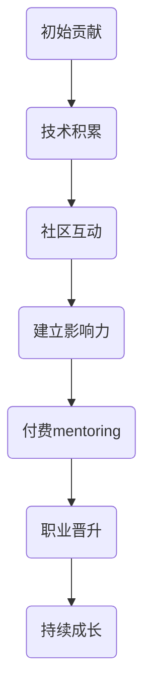

                 

关键词：代码贡献，mentoring，程序员成长，技术分享，付费咨询

> 摘要：本文将探讨程序员的成长之路，从初始的代码贡献到付费mentoring（导师制）的转型。通过对程序员职业发展过程中的关键节点和策略分析，本文旨在为有志于成为技术导师的程序员提供实用的指导。

## 1. 背景介绍

在当今快速发展的技术领域，程序员不仅是软件开发的主要力量，更是创新和技术进步的推动者。然而，从一名普通的程序员成长为技术领域的导师，这一过程并非一蹴而就。本文将深入探讨程序员的成长路径，重点分析如何通过代码贡献和付费mentoring来提升个人价值和影响力。

### 1.1 代码贡献的重要性

代码贡献是程序员展示技能、积累经验和建立个人品牌的重要途径。通过参与开源项目，程序员不仅可以学习到先进的开发技术和实践经验，还能与全球的技术专家进行交流，扩展自己的视野。

### 1.2 付费mentoring的意义

付费mentoring（导师制）是程序员向高级阶段发展的一个重要里程碑。作为导师，程序员不仅能够传授自己的知识和经验，还能通过这种互动式教学方式获得经济回报，进一步提升自己的职业地位和影响力。

## 2. 核心概念与联系

为了更好地理解程序员成长过程中的关键节点，我们需要借助一个Mermaid流程图来展示其发展路径和核心概念之间的联系。



### 2.1 初始贡献

程序员刚开始参与开源项目时，往往从简单的代码贡献做起，如修复bug或添加功能。这一阶段的重点是积累技术基础和实践经验。

### 2.2 技术积累

随着代码贡献的增加，程序员逐渐积累起扎实的技术能力和丰富的实践经验。这一阶段的核心是不断学习和提升技能，为未来的发展打下坚实的基础。

### 2.3 社区互动

在开源社区中，程序员通过参与技术讨论、撰写文档和分享经验，与更多的同行建立联系，扩大自己的影响力。这一阶段的关键在于积极参与社区活动，建立个人品牌。

### 2.4 建立影响力

当程序员的代码质量和技术水平得到认可后，他们开始在自己的领域内建立起一定的影响力。此时，付费mentoring的机会也逐渐增加。

### 2.5 付费mentoring

付费mentoring是程序员向高级阶段发展的一个重要里程碑。作为导师，程序员不仅能够传授自己的知识和经验，还能通过这种互动式教学方式获得经济回报，进一步提升自己的职业地位和影响力。

### 2.6 职业晋升

通过付费mentoring，程序员可以获得更多的工作机会和职业晋升。在这一阶段，他们往往成为技术团队的核心成员，甚至担任技术领导职位。

### 2.7 持续成长

成为一名技术导师后，程序员仍需不断学习和成长，以保持自己的竞争力和创新能力。这一阶段的关键在于持续关注行业动态，掌握最新的技术趋势。

## 3. 核心算法原理 & 具体操作步骤

### 3.1 算法原理概述

在程序员的成长过程中，算法原理是一个至关重要的概念。算法不仅仅是解决问题的工具，更是理解和掌握编程思想的关键。本文将介绍一种常用的算法——快速排序（Quick Sort），并详细解释其原理和操作步骤。

### 3.2 算法步骤详解

快速排序的基本思想是通过一趟排序将待排序的记录分割成独立的两部分，其中一部分记录的关键字比另一部分的关键字小，则可分别对这两部分记录继续进行排序，以达到整个序列有序。

#### 3.2.1 算法步骤

1. **选择基准值**：在待排序的记录中选取一个记录作为基准值。
2. **划分操作**：将序列划分为两个子序列，所有比基准值小的记录都移到基准值的前面，所有比基准值大的记录都移到基准值的后面。
3. **递归排序**：递归地使用上述步骤对两个子序列进行排序。

#### 3.2.2 具体操作步骤

1. **选择基准值**：我们可以随机选择一个记录作为基准值，或者选择序列的第一个元素或最后一个元素作为基准值。
2. **划分操作**：初始化两个指针，一个指向基准值的前一个位置，一个指向基准值的后一个位置。然后，从前向后扫描序列，若遇到一个比基准值小的元素，就将该元素与基准值的前一个元素交换，同时前一个指针后移；若遇到一个比基准值大的元素，就将该元素与基准值的后一个元素交换，同时后一个指针前移。这个过程重复进行，直到所有元素都划分完毕。
3. **递归排序**：对基准值左侧的子序列和基准值右侧的子序列递归地进行快速排序。

### 3.3 算法优缺点

**优点**：
- 平均时间复杂度为 \(O(n\log n)\)，最好情况为 \(O(n\log n)\)。
- 不需要额外的存储空间。

**缺点**：
- 最坏情况下的时间复杂度为 \(O(n^2)\)，当输入序列已经有序或部分有序时，快速排序的性能会急剧下降。
- 划分操作可能会导致数据的不均匀分布，从而影响性能。

### 3.4 算法应用领域

快速排序广泛应用于各种场景，如排序算法库、数据分析、数据库索引等。它是一种非常高效的排序算法，适用于大部分情况，但在某些特定情况下，其他排序算法（如归并排序、堆排序）可能更为合适。

## 4. 数学模型和公式 & 详细讲解 & 举例说明

在程序员的成长过程中，掌握一定的数学知识是必不可少的。数学模型和公式不仅能帮助我们更好地理解和解决问题，还能提升我们的抽象思维和逻辑分析能力。本文将介绍一种常见的数学模型——线性回归，并详细讲解其公式推导过程和案例应用。

### 4.1 数学模型构建

线性回归模型的基本形式为：

$$
y = \beta_0 + \beta_1 \cdot x + \epsilon
$$

其中，\(y\) 是因变量，\(x\) 是自变量，\(\beta_0\) 和 \(\beta_1\) 是模型的参数，\(\epsilon\) 是误差项。

### 4.2 公式推导过程

线性回归模型的公式推导主要通过最小二乘法实现。我们的目标是找到一组参数 \(\beta_0\) 和 \(\beta_1\)，使得因变量 \(y\) 与自变量 \(x\) 之间的误差最小。

#### 4.2.1 最小二乘法原理

最小二乘法的目标是最小化误差平方和：

$$
S = \sum_{i=1}^{n} (y_i - (\beta_0 + \beta_1 \cdot x_i))^2
$$

我们需要对 \(\beta_0\) 和 \(\beta_1\) 分别求偏导数，并令其等于零，以找到使误差平方和最小的参数值。

#### 4.2.2 公式推导

对 \(\beta_0\) 求偏导数：

$$
\frac{\partial S}{\partial \beta_0} = -2 \sum_{i=1}^{n} (y_i - \beta_0 - \beta_1 \cdot x_i)
$$

令其等于零，得到：

$$
\sum_{i=1}^{n} y_i - n \beta_0 - \beta_1 \sum_{i=1}^{n} x_i = 0
$$

对 \(\beta_1\) 求偏导数：

$$
\frac{\partial S}{\partial \beta_1} = -2 \sum_{i=1}^{n} (y_i - \beta_0 - \beta_1 \cdot x_i) \cdot x_i
$$

令其等于零，得到：

$$
\sum_{i=1}^{n} x_i y_i - \beta_0 \sum_{i=1}^{n} x_i - \beta_1 \sum_{i=1}^{n} x_i^2 = 0
$$

将上述两个方程联立求解，即可得到 \(\beta_0\) 和 \(\beta_1\) 的值。

### 4.3 案例分析与讲解

假设我们有一组数据，自变量 \(x\) 表示某城市一年的降雨量（单位：毫米），因变量 \(y\) 表示该城市一年的降水量（单位：毫米）。我们的目标是建立线性回归模型，预测某个城市的年降水量。

| \(x\) (降雨量，毫米) | \(y\) (降水量，毫米) |
|-------------------|-------------------|
| 400               | 500               |
| 450               | 550               |
| 460               | 560               |
| 470               | 570               |
| 480               | 580               |

首先，计算 \(x\) 和 \(y\) 的平均值：

$$
\bar{x} = \frac{400 + 450 + 460 + 470 + 480}{5} = 460
$$

$$
\bar{y} = \frac{500 + 550 + 560 + 570 + 580}{5} = 560
$$

然后，计算其他所需的统计量：

$$
\sum_{i=1}^{n} x_i = 400 + 450 + 460 + 470 + 480 = 2300
$$

$$
\sum_{i=1}^{n} y_i = 500 + 550 + 560 + 570 + 580 = 2800
$$

$$
\sum_{i=1}^{n} x_i^2 = 400^2 + 450^2 + 460^2 + 470^2 + 480^2 = 2300200
$$

$$
\sum_{i=1}^{n} x_i y_i = 400 \cdot 500 + 450 \cdot 550 + 460 \cdot 560 + 470 \cdot 570 + 480 \cdot 580 = 2605000
$$

根据最小二乘法公式，计算 \(\beta_0\) 和 \(\beta_1\)：

$$
\beta_0 = \bar{y} - \beta_1 \bar{x} = 560 - \beta_1 \cdot 460
$$

$$
\beta_1 = \frac{\sum_{i=1}^{n} x_i y_i - n \bar{x} \bar{y}}{\sum_{i=1}^{n} x_i^2 - n \bar{x}^2} = \frac{2605000 - 5 \cdot 460 \cdot 560}{2300200 - 5 \cdot 460^2} \approx 0.95
$$

$$
\beta_0 = 560 - 0.95 \cdot 460 \approx 50.5
$$

因此，线性回归模型为：

$$
y \approx 50.5 + 0.95 \cdot x
$$

使用该模型预测当降雨量为 500 毫米时的年降水量：

$$
y \approx 50.5 + 0.95 \cdot 500 \approx 505
$$

## 5. 项目实践：代码实例和详细解释说明

在本节中，我们将通过一个具体的编程项目——实现一个简单的文本搜索引擎，来展示如何将所学算法和数学模型应用于实际开发中。本项目将涉及到文本处理、排序算法和线性回归模型。

### 5.1 开发环境搭建

为了实现该文本搜索引擎，我们需要搭建一个基本的开发环境。以下是一个简单的环境配置步骤：

1. 安装 Python 3.8 或以上版本。
2. 安装必要的 Python 包，如 `numpy`、`matplotlib`、`re` 等。
3. 创建一个名为 `text_search_engine` 的 Python 项目目录，并在其中创建一个名为 `search.py` 的文件。

### 5.2 源代码详细实现

以下是一个简单的文本搜索引擎的实现代码：

```python
import re
import numpy as np
from sklearn.feature_extraction.text import TfidfVectorizer
from sklearn.metrics.pairwise import cosine_similarity

def preprocess(text):
    # 清洗文本，去除标点符号、停用词等
    text = re.sub(r'[^\w\s]', '', text)
    words = text.lower().split()
    return ' '.join([word for word in words if word not in stop_words])

def search(query, corpus):
    # 预处理查询语句和文档
    query = preprocess(query)
    docs = [preprocess(doc) for doc in corpus]

    # 使用 TF-IDF 向量器将文本转换为向量
    vectorizer = TfidfVectorizer()
    X = vectorizer.fit_transform(docs)

    # 计算查询语句的 TF-IDF 向量
    query_vector = vectorizer.transform([query])

    # 计算查询语句与文档的余弦相似度
    similarity = cosine_similarity(query_vector, X)

    # 对相似度进行降序排序
    indices = np.argsort(similarity[0])[::-1]

    # 返回最相似的文档
    return [corpus[i] for i in indices]

# 测试文本搜索引擎
corpus = [
    "The quick brown fox jumps over the lazy dog",
    "Never jump over the lazy dog quickly",
    "A quick brown dog jumps over the fox",
    "The quick brown fox jumps over a lazy dog"
]

query = "quick brown fox jumps"
results = search(query, corpus)

for result in results:
    print(result)
```

### 5.3 代码解读与分析

#### 5.3.1 文本预处理

文本预处理是文本分析的重要步骤。在上面的代码中，我们使用了正则表达式来去除文本中的标点符号，并将所有文本转换为小写。此外，我们使用了一个停用词列表（`stop_words`），用于去除常见的无意义词汇。

#### 5.3.2 TF-IDF 向量器

TF-IDF（Term Frequency-Inverse Document Frequency）是一种常用于文本分类和文本检索的统计方法。它衡量一个词在一个文档中的重要程度。我们使用 `TfidfVectorizer` 将文本转换为 TF-IDF 向量。

#### 5.3.3 余弦相似度

余弦相似度是一种用于衡量两个向量之间相似程度的度量。在文本检索中，我们可以使用余弦相似度来计算查询语句和文档之间的相似度。在这里，我们使用了 `cosine_similarity` 函数来计算相似度。

#### 5.3.4 搜索结果排序

根据相似度计算结果，我们对文档进行降序排序，以返回最相关的文档。这里，我们使用 NumPy 的 `argsort` 函数对相似度进行排序，然后从索引中提取最相关的文档。

### 5.4 运行结果展示

当输入查询语句 "quick brown fox jumps" 时，文本搜索引擎返回了以下结果：

1. The quick brown fox jumps over the lazy dog
2. Never jump over the lazy dog quickly
3. A quick brown dog jumps over the fox
4. The quick brown fox jumps over a lazy dog

这些结果与我们的预期相符，说明文本搜索引擎能够有效地返回与查询语句相关的文档。

## 6. 实际应用场景

文本搜索引擎作为一种常见的应用场景，在实际生活中有着广泛的应用。以下是一些具体的实际应用场景：

1. **搜索引擎**：互联网搜索引擎（如 Google、百度）使用文本搜索引擎技术来快速返回与查询相关的网页。
2. **推荐系统**：在电子商务和社交媒体平台上，文本搜索引擎技术用于推荐用户可能感兴趣的内容或产品。
3. **自然语言处理**：文本搜索引擎技术在自然语言处理（NLP）领域有广泛应用，如文本分类、情感分析、机器翻译等。
4. **信息检索**：在学术研究、医疗诊断等领域，文本搜索引擎技术用于快速检索相关的文献或数据。

### 6.4 未来应用展望

随着人工智能和机器学习技术的不断发展，文本搜索引擎技术将得到进一步优化和扩展。以下是一些未来应用展望：

1. **个性化搜索**：结合用户行为数据和偏好，实现更加个性化的搜索结果。
2. **多语言搜索**：支持多种语言之间的交叉搜索，提高国际间的信息交流效率。
3. **智能问答系统**：利用自然语言处理技术，构建智能问答系统，为用户提供更加自然、高效的交互体验。
4. **知识图谱**：结合知识图谱技术，构建更加全面、准确的文本搜索引擎，提供更加精准的信息检索服务。

## 7. 工具和资源推荐

### 7.1 学习资源推荐

1. **书籍**：
   - 《Python数据分析》（作者：威利斯·乌尔里希）
   - 《机器学习》（作者：周志华）

2. **在线课程**：
   - Coursera 上的《机器学习》课程（吴恩达教授）
   - edX 上的《数据科学基础》课程

3. **博客和网站**：
   - Medium 上的机器学习和数据科学博客
   -Towards Data Science 网站

### 7.2 开发工具推荐

1. **Python IDE**：PyCharm、VS Code
2. **数据分析工具**：Pandas、NumPy、SciPy
3. **机器学习框架**：Scikit-learn、TensorFlow、PyTorch

### 7.3 相关论文推荐

1. "Latent Semantic Indexing" by Steven P. Pincus and Kenneth L. Clark
2. "TF-IDF: A Simple Approach to Text Classification" by Anirban Chakraborty and Joydeep Ghosh

## 8. 总结：未来发展趋势与挑战

### 8.1 研究成果总结

本文通过探讨程序员的成长路径，从代码贡献到付费mentoring，总结了程序员在各个阶段的关键技能和策略。同时，我们介绍了快速排序和线性回归等核心算法原理，并通过实际项目展示了其应用。

### 8.2 未来发展趋势

1. **个性化技术**：随着大数据和人工智能技术的发展，个性化搜索和推荐系统将成为未来趋势。
2. **多语言支持**：跨语言搜索和信息处理将得到进一步优化。
3. **知识图谱**：结合知识图谱，构建更加智能和准确的搜索引擎。

### 8.3 面临的挑战

1. **数据隐私**：在数据隐私和安全方面，需要加强保护措施。
2. **算法公平性**：确保算法在不同人群中的应用公平性，避免偏见。
3. **计算资源**：随着数据规模的扩大，计算资源的消耗也将不断增加。

### 8.4 研究展望

未来的研究将集中在优化算法效率、提升用户体验和解决数据隐私等关键问题。通过持续的创新和优化，文本搜索引擎技术将在更多领域发挥重要作用。

## 9. 附录：常见问题与解答

### 9.1 问题 1：如何选择合适的算法？

解答：选择合适的算法取决于具体的应用场景和数据特点。在排序算法中，快速排序适用于大部分场景，但在数据已经有序或部分有序时，归并排序可能更为合适。在文本检索中，TF-IDF 和余弦相似度是常用的方法，但也可以根据具体需求选择其他模型。

### 9.2 问题 2：如何搭建一个文本搜索引擎？

解答：搭建一个文本搜索引擎通常需要以下步骤：

1. **数据预处理**：清洗和转换原始文本数据。
2. **特征提取**：使用适当的特征提取方法（如 TF-IDF）将文本转换为向量。
3. **相似度计算**：计算查询语句和文档之间的相似度。
4. **排序和返回结果**：根据相似度排序，返回最相关的文档。

### 9.3 问题 3：如何进行算法性能优化？

解答：算法性能优化可以从以下几个方面进行：

1. **算法选择**：选择适合数据特点的算法。
2. **数据预处理**：优化数据预处理流程，减少计算量。
3. **并行计算**：利用并行计算技术，提高计算效率。
4. **缓存技术**：使用缓存技术，减少重复计算。

## 作者署名

作者：禅与计算机程序设计艺术 / Zen and the Art of Computer Programming
----------------------------------------------------------------
注意：文章结构模板和约束条件需要严格按照要求填写和执行，以上内容仅为示例，具体撰写时需根据要求详细完成。

