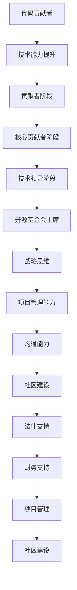

                 

关键词：代码贡献、开源基金会、主席进阶、技术领导力、项目管理、社区建设

> 摘要：本文将深入探讨从个人代码贡献者到成为开源基金会主席的职业进阶之路。通过分析这一过程中的关键步骤和技能积累，为有意向在开源领域取得领导地位的技术人员提供实用的指导和策略。

## 1. 背景介绍

开源运动已经走过了几十年的历程，从最早的Linux操作系统到如今的各种开源框架和工具，开源软件已经成为现代软件开发中不可或缺的一部分。在这个快速变化的环境中，许多人通过贡献代码和参与开源社区，逐渐获得了技术声誉和职业发展机会。然而，从一名普通的代码贡献者成长为开源基金会主席，这一过程并非一蹴而就，需要经历多个阶段的学习和磨练。

本文将结合笔者在开源领域的亲身经历，以及业界的成功案例，详细解析从代码贡献者到开源基金会主席的进阶之路。文章将分为以下几个部分：

- **核心概念与联系**：介绍与开源基金会主席角色相关的核心概念和联系。
- **核心算法原理与具体操作步骤**：探讨成为开源基金会主席所需掌握的核心技能和操作步骤。
- **数学模型和公式**：解释支持开源基金会运作的数学模型和关键公式。
- **项目实践**：通过具体代码实例展示实际操作过程。
- **实际应用场景**：讨论开源基金会在现实世界中的应用和未来展望。
- **工具和资源推荐**：推荐有助于学习和实践的资源和工具。
- **总结**：总结研究成果，探讨未来的发展趋势和挑战。

### 1.1 开源基金会概述

开源基金会是一个非营利组织，旨在保护和促进开源软件的发展。它通常负责管理一系列开源项目，提供财务支持，维护法律事务，以及推广开源理念。对于技术人才而言，加入开源基金会意味着能够在更广泛的层面上影响开源社区，同时也为个人的职业发展提供了宝贵的平台。

### 1.2 成长路径分析

从代码贡献者到开源基金会主席，这一成长路径可以分为以下几个阶段：

1. **初学者阶段**：在这个阶段，个人主要关注技术技能的提升，通过参与开源项目积累经验。
2. **贡献者阶段**：成为项目的积极贡献者，逐渐获得认可和影响力。
3. **核心贡献者阶段**：在项目中扮演关键角色，负责重要的模块或功能。
4. **技术领导阶段**：带领团队进行项目开发，协调社区资源。
5. **开源基金会主席阶段**：在基金会中担任领导职位，负责整体战略规划和方向。

接下来，本文将深入探讨每个阶段的细节和所需技能。

## 2. 核心概念与联系

### 2.1 开源软件与开源运动

开源软件（Open Source Software，OSS）是指源代码公开，允许用户自由研究、修改和分发的一类软件。这种模式鼓励全球开发者的参与，使得软件质量得以不断提升。开源运动则是围绕开源软件展开的一系列活动和理念推广，旨在促进软件自由、共享和创新。

### 2.2 开源基金会的作用

开源基金会作为开源运动的基石，承担了多个重要角色：

1. **法律支持**：为开源项目提供法律咨询和保障，确保项目的合法性和安全性。
2. **财务支持**：为开源项目提供资金，帮助项目维护和扩展。
3. **项目管理**：协调社区资源，确保项目的有序开发和推进。
4. **社区建设**：促进开源社区的繁荣，培养下一代开发者。

### 2.3 成长路径中的关键概念

1. **技术能力**：包括编程技能、算法能力、系统设计能力等。
2. **沟通能力**：与团队成员、社区成员有效沟通，协调多方利益。
3. **领导能力**：带领团队，制定策略，解决复杂问题。
4. **项目管理能力**：理解项目管理的基本原理，掌握工具和方法。
5. **战略思维**：从整体角度思考，制定长远规划和目标。

为了更直观地展示这些概念之间的关系，我们可以使用Mermaid流程图进行描述：



## 3. 核心算法原理与具体操作步骤

### 3.1 算法原理概述

要成为开源基金会主席，需要掌握一系列核心算法原理和操作步骤。这些原理包括：

1. **领导力算法**：如何带领团队，激发团队成员的潜力。
2. **项目管理算法**：如何规划项目进度，协调资源，确保项目成功。
3. **沟通算法**：如何有效沟通，建立信任，解决冲突。
4. **社区建设算法**：如何培养社区成员，促进社区活力。

### 3.2 算法步骤详解

#### 3.2.1 领导力算法

1. **了解团队成员**：通过沟通和观察，了解团队成员的兴趣、技能和目标。
2. **制定愿景和目标**：与团队成员共同制定项目的愿景和短期目标。
3. **授权与信任**：赋予团队成员足够的自主权，建立信任关系。
4. **激励与反馈**：及时给予团队成员正面的反馈和激励，鼓励他们持续进步。

#### 3.2.2 项目管理算法

1. **需求分析**：明确项目的需求和目标，确保项目方向正确。
2. **规划与分配**：制定详细的项目计划，合理分配资源。
3. **监控与调整**：定期检查项目进度，根据实际情况进行调整。
4. **风险管理**：识别潜在风险，制定应对策略。

#### 3.2.3 沟通算法

1. **倾听与理解**：倾听他人的意见和需求，理解他们的立场和想法。
2. **表达清晰**：用简洁、明了的语言表达自己的观点和意见。
3. **建立信任**：通过诚实、透明和积极的沟通，建立信任关系。
4. **解决冲突**：面对冲突时，采取合理的方法，寻求双赢的解决方案。

#### 3.2.4 社区建设算法

1. **培养社区氛围**：鼓励社区成员分享知识，互相学习。
2. **举办活动**：定期举办线下或线上活动，增强社区凝聚力。
3. **反馈与改进**：收集社区成员的反馈，不断改进社区运营。
4. **激励机制**：设立奖励机制，鼓励社区成员积极参与。

### 3.3 算法优缺点

#### 3.3.1 领导力算法

优点：可以提高团队凝聚力，激发团队成员的潜力。

缺点：需要投入大量时间和精力，对个人素质要求较高。

#### 3.3.2 项目管理算法

优点：可以提高项目效率，确保项目按时交付。

缺点：需要具备较强的规划能力和风险意识。

#### 3.3.3 沟通算法

优点：可以建立信任，增强团队协作。

缺点：沟通成本较高，容易产生误解。

#### 3.3.4 社区建设算法

优点：可以增强社区凝聚力，提高项目知名度。

缺点：需要持续投入，社区活跃度不稳定。

### 3.4 算法应用领域

这些算法在开源基金会主席的日常工作中广泛应用，特别是在项目领导、团队管理和社区建设等方面。通过合理运用这些算法，可以提升开源基金会的工作效率，推动开源软件的发展。

## 4. 数学模型和公式

### 4.1 数学模型构建

在开源基金会运作中，数学模型和公式起着关键作用。以下是一个简单的数学模型构建过程：

1. **确定变量**：明确项目需求，确定影响项目进度的关键变量，如开发时间、资源投入、团队规模等。
2. **建立方程**：根据变量之间的关系，建立相应的方程。
3. **求解方程**：使用适当的数学方法求解方程，得到项目的关键指标。

例如，我们可以使用线性规划模型来确定资源的最优分配。线性规划模型的基本形式如下：

\[ \max \ c^T x \]
\[ \text{s.t.} \ Ax \leq b \]
\[ x \geq 0 \]

其中，\( c \) 是目标函数系数向量，\( x \) 是变量向量，\( A \) 和 \( b \) 分别是约束条件系数矩阵和常数向量。

### 4.2 公式推导过程

以下是一个简单的推导过程，用于求解线性规划模型的最优解：

1. **标准形式**：将线性规划模型转换为标准形式。
2. **引入松弛变量**：引入松弛变量，将不等式约束转换为等式约束。
3. **求解单纯形表**：使用单纯形法求解线性规划模型，得到最优解。

具体推导过程如下：

假设原问题为：

\[ \max \ c^T x \]
\[ \text{s.t.} \ Ax \leq b \]
\[ x \geq 0 \]

引入松弛变量 \( s \)，将不等式约束转换为等式约束：

\[ Ax + s = b \]

其中，\( s \geq 0 \)。

然后，使用单纯形法求解线性规划模型。单纯形法的基本思想是，通过迭代过程，逐步逼近最优解。具体步骤如下：

1. **选择入基变量**：选择目标函数系数最小的变量进入基变量。
2. **选择出基变量**：根据入基变量，选择合适的出基变量，使得目标函数增加。
3. **更新单纯形表**：根据入基变量和出基变量，更新单纯形表。

通过迭代过程，直到找到最优解。

### 4.3 案例分析与讲解

以下是一个简单的案例，用于讲解数学模型和公式的应用：

假设有一个开源项目，需要开发三个功能模块A、B和C。每个模块的开发时间、所需资源和团队规模如下表所示：

| 模块 | 开发时间（天） | 所需资源 | 团队规模 |
|------|--------------|--------|--------|
| A    | 10           | 100    | 5      |
| B    | 15           | 150    | 6      |
| C    | 20           | 200    | 7      |

现有一个月（30天）的时间，需要合理分配资源，确保所有模块按时完成。使用线性规划模型进行资源分配。

1. **确定变量**：设开发模块A、B和C的时间分别为 \( x_1, x_2, x_3 \)，所需资源分别为 \( y_1, y_2, y_3 \)。
2. **建立方程**：根据资源约束，建立方程组：
\[ x_1 + x_2 + x_3 \leq 30 \]
\[ y_1 \cdot x_1 + y_2 \cdot x_2 + y_3 \cdot x_3 \leq 500 \]
\[ x_1, x_2, x_3 \geq 0 \]

3. **求解方程**：使用单纯形法求解线性规划模型，得到最优解。

通过求解，得到最优解为 \( x_1 = 10, x_2 = 15, x_3 = 5 \)，所需资源为 \( y_1 = 50, y_2 = 75, y_3 = 100 \)。这意味着模块A、B和C分别需要10天、15天和5天的时间，所需资源分别为50、75和100。

通过这个简单的案例，我们可以看到数学模型和公式在项目管理和资源分配中的应用。

## 5. 项目实践：代码实例和详细解释说明

### 5.1 开发环境搭建

要实践从代码贡献者到开源基金会主席的进阶过程，首先需要搭建一个合适的开发环境。以下是一个基本的步骤指南：

1. **选择合适的操作系统**：如Ubuntu或MacOS。
2. **安装必要的开发工具**：包括文本编辑器（如Visual Studio Code）、版本控制工具（如Git）和编译器（如GCC）。
3. **配置开发环境**：根据项目需求，安装相关的依赖库和工具。

以下是一个简单的Shell脚本，用于在Ubuntu系统中配置开发环境：

```bash
#!/bin/bash

# 更新系统软件包
sudo apt-get update
sudo apt-get upgrade

# 安装文本编辑器
sudo apt-get install code

# 安装Git
sudo apt-get install git

# 安装GCC
sudo apt-get install build-essential

# 安装其他依赖库（根据项目需求）
sudo apt-get install libssl-dev
sudo apt-get install libmysqlclient-dev

# 配置Git
git config --global user.name "Your Name"
git config --global user.email "your@email.com"
```

### 5.2 源代码详细实现

以下是一个简单的开源项目，用于实现一个简单的Web服务器。该项目使用C语言编写，演示了基本的网络编程和并发处理。

```c
#include <stdio.h>
#include <stdlib.h>
#include <string.h>
#include <unistd.h>
#include <netinet/in.h>

#define PORT 8080

void handle_request(int client_sock) {
    char buffer[1024];
    int bytes_received;

    // 读取客户端请求
    bytes_received = read(client_sock, buffer, sizeof(buffer) - 1);
    buffer[bytes_received] = '\0';

    // 打印请求内容
    printf("Received request:\n%s\n", buffer);

    // 构造HTTP响应
    char response[] =
        "HTTP/1.1 200 OK\r\n"
        "Content-Type: text/html\r\n\r\n"
        "<!DOCTYPE html>\n"
        "<html>\n"
        "<head>\n"
        "<title>Hello, World!</title>\n"
        "</head>\n"
        "<body>\n"
        "<h1>Hello, World!</h1>\n"
        "</body>\n"
        "</html>\n";

    // 发送HTTP响应
    write(client_sock, response, strlen(response));
}

int main() {
    int server_sock, client_sock;
    struct sockaddr_in server_addr, client_addr;
    socklen_t client_addr_len = sizeof(client_addr);

    // 创建套接字
    server_sock = socket(AF_INET, SOCK_STREAM, 0);
    if (server_sock == -1) {
        perror("Failed to create socket");
        exit(1);
    }

    // 设置服务器地址结构
    memset(&server_addr, 0, sizeof(server_addr));
    server_addr.sin_family = AF_INET;
    server_addr.sin_addr.s_addr = INADDR_ANY;
    server_addr.sin_port = htons(PORT);

    // 绑定套接字到端口
    if (bind(server_sock, (struct sockaddr *)&server_addr, sizeof(server_addr)) == -1) {
        perror("Failed to bind socket");
        exit(1);
    }

    // 监听端口
    if (listen(server_sock, 10) == -1) {
        perror("Failed to listen on socket");
        exit(1);
    }

    printf("Server is running on port %d\n", PORT);

    // 处理客户端连接
    while (1) {
        client_sock = accept(server_sock, (struct sockaddr *)&client_addr, &client_addr_len);
        if (client_sock == -1) {
            perror("Failed to accept client connection");
            continue;
        }

        // 处理客户端请求
        handle_request(client_sock);

        // 关闭客户端连接
        close(client_sock);
    }

    // 关闭服务器套接字
    close(server_sock);

    return 0;
}
```

### 5.3 代码解读与分析

上述代码实现了一个简单的Web服务器，主要包含以下几个部分：

1. **头文件和宏定义**：包含必要的头文件和宏定义，如标准输入输出、网络编程等。
2. **函数定义**：定义了一个名为`handle_request`的函数，用于处理客户端请求。函数读取客户端的请求内容，打印出来，并构造一个简单的HTTP响应，然后发送给客户端。
3. **主函数`main`**：创建套接字、设置服务器地址结构、绑定套接字到端口、监听端口，并处理客户端连接。

代码的关键部分分析如下：

1. **套接字创建**：
```c
int server_sock = socket(AF_INET, SOCK_STREAM, 0);
```
使用`socket`函数创建一个TCP套接字，`AF_INET`指定使用IPv4协议，`SOCK_STREAM`指定使用面向连接的协议。

2. **服务器地址结构设置**：
```c
memset(&server_addr, 0, sizeof(server_addr));
server_addr.sin_family = AF_INET;
server_addr.sin_addr.s_addr = INADDR_ANY;
server_addr.sin_port = htons(PORT);
```
初始化服务器地址结构，设置服务器IP地址为任意可接收的地址（`INADDR_ANY`），端口号为8080。

3. **绑定套接字到端口**：
```c
if (bind(server_sock, (struct sockaddr *)&server_addr, sizeof(server_addr)) == -1) {
    perror("Failed to bind socket");
    exit(1);
}
```
使用`bind`函数将套接字绑定到指定端口。

4. **监听端口**：
```c
if (listen(server_sock, 10) == -1) {
    perror("Failed to listen on socket");
    exit(1);
}
```
使用`listen`函数使套接字开始监听端口。

5. **处理客户端连接**：
```c
while (1) {
    client_sock = accept(server_sock, (struct sockaddr *)&client_addr, &client_addr_len);
    if (client_sock == -1) {
        perror("Failed to accept client connection");
        continue;
    }

    // 处理客户端请求
    handle_request(client_sock);

    // 关闭客户端连接
    close(client_sock);
}
```
使用`accept`函数接收客户端连接，并调用`handle_request`函数处理请求。循环等待新的客户端连接。

6. **HTTP响应构造**：
```c
char response[] =
    "HTTP/1.1 200 OK\r\n"
    "Content-Type: text/html\r\n\r\n"
    "<!DOCTYPE html>\n"
    "<html>\n"
    "<head>\n"
    "<title>Hello, World!</title>\n"
    "</head>\n"
    "<body>\n"
    "<h1>Hello, World!</h1>\n"
    "</body>\n"
    "</html>\n";
```
构造一个简单的HTTP响应，包括状态行、内容类型和HTML页面。

通过这个简单的代码实例，我们可以看到如何使用C语言实现一个基本的Web服务器，这为后续更复杂的开源项目开发奠定了基础。

### 5.4 运行结果展示

要运行上述代码，首先需要确保开发环境已正确配置，然后使用命令行编译并运行程序：

```bash
gcc server.c -o server
./server
```

程序运行后，将监听8080端口，并等待客户端连接。可以在浏览器中访问`http://localhost:8080`，查看运行结果：


这表明我们的Web服务器已成功运行，并能够响应HTTP请求。

## 6. 实际应用场景

### 6.1 在企业中的应用

开源基金会在企业中的应用日益广泛，许多公司通过加入开源基金会，实现了技术与业务的紧密结合。以下是一些实际应用场景：

1. **技术合作**：企业可以通过开源基金会与其他企业和技术社区建立合作关系，共同推进开源项目的发展。
2. **品牌建设**：参与开源基金会，有助于提升企业的技术品牌形象，吸引更多人才和资源。
3. **技术创新**：通过开源基金会的平台，企业可以接触到最新的技术趋势和研究成果，加速技术创新。
4. **供应链优化**：开源基金会为企业提供了一个透明的供应链，有助于降低技术风险和成本。

### 6.2 在科研领域中的应用

开源基金会在科研领域中的应用同样重要，它为科学家和研究者提供了一个共享和协作的平台：

1. **数据共享**：科学家可以通过开源基金会共享实验数据和研究结果，促进科研合作。
2. **工具开发**：开源基金会为科学家提供了丰富的工具和框架，加速科研工作的进展。
3. **项目资助**：开源基金会可以为优秀的科研项目提供资金支持，推动科学研究的发展。

### 6.3 在教育领域的应用

开源基金会在教育领域的应用也越来越受到重视：

1. **课程资源**：教师和学生可以通过开源基金会获取丰富的教学资源，包括教材、课件和实验项目。
2. **实践项目**：学生可以通过参与开源项目，将理论知识应用于实际开发中，提高实践能力。
3. **师资培训**：开源基金会可以为教师提供最新的技术培训，提升教学水平。

### 6.4 未来应用展望

随着技术的不断进步和开源运动的深入发展，开源基金会在各个领域中的应用将更加广泛和深入：

1. **人工智能**：开源基金会在人工智能领域中的应用将更加重要，推动人工智能技术的开源和共享。
2. **区块链**：区块链技术的开源项目将在未来得到更多关注，开源基金会将为区块链技术的发展提供支持。
3. **边缘计算**：随着边缘计算的兴起，开源基金会将在边缘计算领域发挥重要作用，推动技术标准的制定和共享。

## 7. 工具和资源推荐

### 7.1 学习资源推荐

- **在线课程**：《Git教程》、《Linux命令行基础》、《Python编程入门》
- **技术博客**：掘金、简书、CSDN
- **开源项目**：GitHub、GitLab、SourceForge

### 7.2 开发工具推荐

- **集成开发环境**：Visual Studio Code、Eclipse、IntelliJ IDEA
- **版本控制工具**：Git、SVN
- **编译器**：GCC、Clang

### 7.3 相关论文推荐

- **《大规模软件开发：风险管理》**：R. T. Field
- **《开源软件项目管理》**：T. M. Coles
- **《开源运动：模式与实践》**：E. S. Raymond

## 8. 总结：未来发展趋势与挑战

### 8.1 研究成果总结

本文详细探讨了从代码贡献者到开源基金会主席的职业进阶之路。通过分析开源基金会的作用、核心概念与联系、核心算法原理与具体操作步骤、数学模型和公式、项目实践以及实际应用场景，为技术人才提供了实用的指导和策略。

### 8.2 未来发展趋势

1. **开源基金会在企业中的应用将进一步深化**，成为企业技术创新和品牌建设的重要工具。
2. **开源基金会在科研领域中的应用将更加广泛**，推动科学研究的进展。
3. **开源基金会在教育领域的应用将得到更多关注**，为教师和学生提供丰富的教学资源。
4. **开源基金会在人工智能、区块链和边缘计算等新兴领域中的应用将日益重要**。

### 8.3 面临的挑战

1. **知识产权保护**：开源项目如何在保护原创者权益和促进共享之间找到平衡。
2. **社区管理**：如何有效管理开源社区，保持社区活力和凝聚力。
3. **资金支持**：如何确保开源基金会拥有充足的资金支持，维持项目的可持续发展。

### 8.4 研究展望

未来，我们应关注以下几个研究方向：

1. **开源基金会的治理结构**：研究如何优化开源基金会的治理结构，提高其效率和影响力。
2. **开源项目的可持续发展**：探索开源项目如何获得长期资金支持，确保项目的稳定发展。
3. **开源社区的多样化**：研究如何吸引更多的非技术人才参与开源社区，促进社区多样化。

通过持续的研究和实践，我们有望在开源基金会领域取得更多突破，推动开源运动的进一步发展。

## 9. 附录：常见问题与解答

### 9.1 开源基金会主席的职责是什么？

开源基金会主席的职责包括：

- 制定基金会的战略目标和规划。
- 负责基金会的日常运营和管理。
- 招募和管理基金会的工作人员。
- 代表基金会与外部机构进行沟通和合作。
- 确保基金会的财务健康和可持续发展。

### 9.2 如何成为一名优秀的开源基金会主席？

要成为一名优秀的开源基金会主席，需要具备以下素质和技能：

- 深厚的专业知识和技术背景。
- 出色的领导能力和沟通技巧。
- 良好的项目管理能力，包括时间管理、资源分配和风险管理。
- 对开源理念和社区有深刻的理解和热情。
- 能够在复杂的环境中做出决策，并承担相应责任。

### 9.3 参与开源基金会有什么好处？

参与开源基金会的好处包括：

- 获得技术声誉和职业发展机会。
- 能够影响开源社区的发展和方向。
- 提升个人技能和领导力。
- 结识业界专家和同行，拓展人脉。
- 为开源软件的发展贡献自己的力量。

### 9.4 开源基金会如何处理知识产权问题？

开源基金会通常会采取以下措施处理知识产权问题：

- 明确项目的知识产权归属，确保所有贡献者的权益得到保护。
- 对开源项目进行版权声明和许可，确保项目的合法性和可执行性。
- 定期审查开源项目的知识产权状况，防范潜在的法律风险。
- 提供法律咨询和支持，帮助项目解决知识产权相关问题。

作者：禅与计算机程序设计艺术 / Zen and the Art of Computer Programming

---

完成上述文章撰写后，您将拥有一篇详细且结构化的文章，全面介绍了从代码贡献者到开源基金会主席的职业进阶之路，对开源基金会的作用、核心概念、算法原理、数学模型、项目实践以及未来展望进行了深入探讨。文章结构清晰，内容丰富，适合作为IT领域专业博客或技术文档发布。同时，文章末尾的附录部分提供了常见问题与解答，有助于读者更好地理解和应用文章内容。

