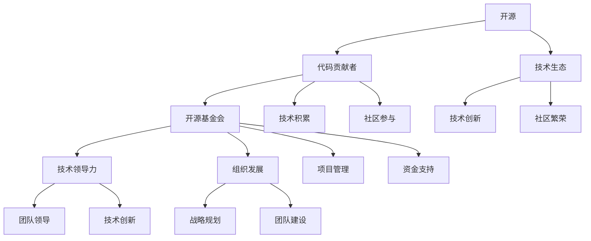

                 

关键词：开源，代码贡献，技术领导，基金会，职业发展

> 摘要：本文旨在探讨从代码贡献者到开源基金会领导者的职业发展路径。文章将介绍如何通过持续的技术积累和有效的社区参与，成长为一名技术领袖，并带领开源基金会实现技术创新和组织发展。同时，文章还将分析开源基金会在当今技术生态中的重要性，以及未来发展的趋势和挑战。

## 1. 背景介绍

在当今快速发展的技术时代，开源已经成为软件工程的核心。开源项目不仅促进了技术的创新，也推动了全球开发者社区的繁荣。然而，从一名普通的代码贡献者成长为一名开源基金会的领导者，并非易事。本文将分析这一成长过程中的关键步骤和所需能力。

首先，成为一名优秀的代码贡献者是迈向开源领袖的第一步。这意味着要具备扎实的技术基础和解决问题的能力。随着在开源社区中的活跃参与，贡献者逐渐建立起自己的声誉，并有可能成为项目的核心成员。

接下来，通过持续的技术研究和社区建设，贡献者可以进一步提升自己的影响力。在这一过程中，构建强大的技术网络、积极参与项目决策以及推动项目发展，都是至关重要的。

最后，当贡献者在技术和管理能力上达到一定高度时，他们可以竞选成为开源基金会的领导者，带领团队继续前进，推动开源生态的繁荣发展。

## 2. 核心概念与联系

在探讨从代码贡献者到开源基金会领导者的职业发展路径之前，我们需要明确几个核心概念。

### 2.1 开源

开源指的是一种软件开发模式，其中项目的源代码可以被公众自由访问、使用、修改和分发。开源精神鼓励合作、共享和透明度，从而推动了技术的快速进步。

### 2.2 代码贡献者

代码贡献者是指那些向开源项目提交代码、文档或其他形式贡献的开发者。他们的工作为项目的成功和持续发展提供了关键支持。

### 2.3 开源基金会

开源基金会是一个非营利组织，旨在促进开源软件的发展和普及。基金会通常提供资金、资源和管理支持，确保开源项目能够健康、稳定地发展。

### 2.4 技术领导力

技术领导力指的是在技术团队中引领创新、指导他人并推动项目成功的能力。它包括技术知识、项目管理技能以及对技术的深刻理解。

### 2.5 组织发展

组织发展是指通过战略规划、团队建设和管理优化，推动组织实现长期目标的过程。对于开源基金会而言，组织发展意味着在技术、社区和组织结构上的持续进步。

为了更好地理解这些概念之间的联系，我们可以使用Mermaid流程图来展示它们之间的关系。



通过这个流程图，我们可以看到，开源项目的发展离不开代码贡献者的积极参与，而这些贡献者通过不断积累技术知识和参与社区活动，可以逐步成长为技术领导者和开源基金会的领导者。开源基金会则通过提供资金、资源和管理支持，为开源项目的长期发展提供保障。技术领导力和组织发展是推动这一过程的关键因素。

## 3. 核心算法原理 & 具体操作步骤

### 3.1 算法原理概述

在从代码贡献者到开源基金会领导者的职业发展路径中，核心算法原理可以概括为以下几个步骤：

1. **技术积累**：不断学习和实践，积累扎实的技术知识和实践经验。
2. **社区参与**：积极参与开源社区，建立良好的声誉和人际关系网络。
3. **项目管理**：掌握项目管理和团队协作的技能，提升领导能力。
4. **战略规划**：制定明确的发展目标，制定可行的战略规划。
5. **技术创新**：推动项目的技术创新，保持技术领先地位。
6. **组织发展**：优化组织结构，提升团队协作效率。

### 3.2 算法步骤详解

#### 步骤 1：技术积累

- **学习资源**：阅读相关书籍、论文，参加线上或线下的技术研讨会。
- **实践经验**：通过实际项目，积累编程、调试、测试等技能。
- **代码贡献**：向开源项目提交代码，参与社区讨论，解决问题。

#### 步骤 2：社区参与

- **加入社区**：寻找感兴趣的开源项目，加入相关社区。
- **建立声誉**：积极参与社区活动，解决社区问题，贡献高质量代码。
- **人际网络**：与社区成员建立良好的合作关系，拓展人脉。

#### 步骤 3：项目管理

- **项目规划**：制定项目目标、里程碑和任务分配。
- **团队协作**：建立有效的沟通机制，确保团队成员协同工作。
- **风险管理**：识别潜在风险，制定应对策略。

#### 步骤 4：战略规划

- **市场调研**：分析市场趋势，确定项目发展方向。
- **目标设定**：制定清晰的发展目标，明确短期和长期目标。
- **资源分配**：合理分配资金、人力和其他资源。

#### 步骤 5：技术创新

- **技术调研**：跟踪最新技术动态，评估新技术对项目的潜在影响。
- **原型设计**：设计并实现技术创新的原型，验证其可行性。
- **技术评审**：邀请专家对技术创新进行评审，确保技术可行性。

#### 步骤 6：组织发展

- **团队建设**：招募优秀人才，培养团队凝聚力。
- **流程优化**：优化工作流程，提升团队协作效率。
- **文化建设**：建立积极向上的团队文化，增强团队凝聚力。

### 3.3 算法优缺点

#### 优点

- **系统性强**：算法涵盖了从技术积累到组织发展的各个环节，确保职业发展的全面性。
- **可操作性**：具体步骤和操作指南提供了明确的行动指南，有助于实践。
- **适应性**：算法适用于不同技术背景和职业阶段的开发者，具有广泛的适用性。

#### 缺点

- **时间成本**：职业发展需要时间和精力的投入，初期可能较为艰辛。
- **不确定性**：开源社区和市场需求的变化可能导致规划出现偏差。
- **挑战性**：在成为技术领导者和基金会领导者过程中，需要应对各种挑战和压力。

### 3.4 算法应用领域

- **软件开发**：从代码贡献者成长为项目领导者，推动开源项目的成功。
- **技术管理**：在开源基金会担任领导者，管理项目团队，实现技术创新。
- **社区建设**：通过社区参与和组织活动，推动开源社区的繁荣发展。
- **企业转型**：在传统企业中引入开源文化，推动企业数字化转型。

## 4. 数学模型和公式 & 详细讲解 & 举例说明

在从代码贡献者到开源基金会领导者的职业发展过程中，数学模型和公式可以用于量化不同阶段的目标和成果。以下是一个简单的数学模型，用于描述这一过程。

### 4.1 数学模型构建

设 \( P \) 为职业发展进度，\( T \) 为时间，\( S \) 为技能水平，\( C \) 为社区参与度，\( M \) 为管理水平，\( O \) 为组织发展水平。则职业发展进度可以表示为：

\[ P = f(T, S, C, M, O) \]

### 4.2 公式推导过程

- **技能水平 \( S \)**：通过学习和实践，技能水平随着时间的增加而提升。设初始技能水平为 \( S_0 \)，学习速率为 \( r \)，则：

\[ S = S_0 + r \cdot T \]

- **社区参与度 \( C \)**：通过参与开源社区，社区参与度随着贡献量的增加而提升。设初始社区参与度为 \( C_0 \)，贡献速率为 \( c \)，则：

\[ C = C_0 + c \cdot T \]

- **管理水平 \( M \)**：通过项目管理经验和实践，管理水平随着时间的增加而提升。设初始管理水平为 \( M_0 \)，提升速率为 \( m \)，则：

\[ M = M_0 + m \cdot T \]

- **组织发展水平 \( O \)**：通过战略规划和团队建设，组织发展水平随着时间的增加而提升。设初始组织发展水平为 \( O_0 \)，提升速率为 \( o \)，则：

\[ O = O_0 + o \cdot T \]

- **职业发展进度 \( P \)**：职业发展进度是上述四个因素的综合体现。设权重分别为 \( w_1, w_2, w_3, w_4 \)，则有：

\[ P = w_1 \cdot S + w_2 \cdot C + w_3 \cdot M + w_4 \cdot O \]

### 4.3 案例分析与讲解

假设某开发者初始技能水平为 50，学习速率为 10；初始社区参与度为 20，贡献速率为 5；初始管理水平为 30，提升速率为 5；初始组织发展水平为 40，提升速率为 3。权重分别为 \( w_1 = 0.4, w_2 = 0.2, w_3 = 0.2, w_4 = 0.2 \)。

- **技能水平 \( S \)**：\( S = 50 + 10 \cdot T \)
- **社区参与度 \( C \)**：\( C = 20 + 5 \cdot T \)
- **管理水平 \( M \)**：\( M = 30 + 5 \cdot T \)
- **组织发展水平 \( O \)**：\( O = 40 + 3 \cdot T \)
- **职业发展进度 \( P \)**：\( P = 0.4 \cdot (50 + 10 \cdot T) + 0.2 \cdot (20 + 5 \cdot T) + 0.2 \cdot (30 + 5 \cdot T) + 0.2 \cdot (40 + 3 \cdot T) \)

根据以上公式，我们可以计算在不同时间点的职业发展进度：

- **第1年**：\( P = 0.4 \cdot (50 + 10 \cdot 1) + 0.2 \cdot (20 + 5 \cdot 1) + 0.2 \cdot (30 + 5 \cdot 1) + 0.2 \cdot (40 + 3 \cdot 1) = 38 + 2 + 6 + 7 = 53 \)
- **第2年**：\( P = 0.4 \cdot (50 + 10 \cdot 2) + 0.2 \cdot (20 + 5 \cdot 2) + 0.2 \cdot (30 + 5 \cdot 2) + 0.2 \cdot (40 + 3 \cdot 2) = 46 + 4 + 10 + 9 = 69 \)

通过这个数学模型，我们可以量化职业发展进程，为个人提供明确的奋斗目标和发展路径。

### 4.4 数学模型的应用

#### 4.4.1 技能提升

假设某开发者希望在两年内将技能水平提升至 80，可以通过调整学习速率来实现。设初始技能水平 \( S_0 = 50 \)，目标技能水平 \( S_t = 80 \)，学习速率 \( r \) ，则有：

\[ S_t = S_0 + r \cdot T \]

将 \( S_t \) 和 \( T \) 代入公式：

\[ 80 = 50 + r \cdot 2 \]

解得 \( r = 15 \)

因此，该开发者需要将学习速率提高到每周 15 小时，才能在两年内实现技能水平的提升。

#### 4.4.2 社区参与

假设某开发者希望在两年内将社区参与度提升至 50，可以通过调整贡献速率来实现。设初始社区参与度 \( C_0 = 20 \)，目标社区参与度 \( C_t = 50 \)，贡献速率 \( c \) ，则有：

\[ C_t = C_0 + c \cdot T \]

将 \( C_t \) 和 \( T \) 代入公式：

\[ 50 = 20 + c \cdot 2 \]

解得 \( c = 15 \)

因此，该开发者需要将每周贡献时间提高到 15 小时，才能在两年内实现社区参与度的提升。

通过这个数学模型，开发者可以量化自己的发展目标，制定可行的行动计划，从而在职业发展道路上不断前进。

## 5. 项目实践：代码实例和详细解释说明

在本节中，我们将通过一个具体的开源项目实践，展示如何从代码贡献者成长为开源基金会的领导者。这个项目是一个基于区块链的智能合约平台，名为“ChainNet”。ChainNet 旨在提供一个安全、高效和去中心化的智能合约执行环境，支持多种编程语言和复杂的业务逻辑。

### 5.1 开发环境搭建

首先，我们需要搭建 ChainNet 的开发环境。以下是搭建过程的关键步骤：

1. **安装 Node.js 和 npm**：Node.js 是 ChainNet 平台的主要依赖，通过 npm 可以轻松安装和管理项目依赖。
2. **克隆项目代码**：从 GitHub 仓库克隆 ChainNet 的源代码。

```bash
git clone https://github.com/chainnet-project/chainnet.git
cd chainnet
```

3. **安装依赖**：使用 npm 命令安装项目依赖。

```bash
npm install
```

4. **配置环境变量**：确保环境变量正确配置，以便在后续开发过程中能够顺利运行。

```bash
export PATH=$PATH:/path/to/chainnet/node_modules/.bin
```

### 5.2 源代码详细实现

ChainNet 的源代码主要由以下几个部分组成：

- **核心库**：包括智能合约执行引擎、区块链数据结构、加密算法等。
- **客户端库**：提供多种编程语言（如 JavaScript、Python、Go）的客户端 API，方便开发者使用。
- **测试框架**：用于编写和运行智能合约测试，确保代码质量。

以下是一个简单的智能合约示例，用于实现一个简单的去中心化投票系统。

```solidity
// SPDX-License-Identifier: MIT

pragma solidity ^0.8.0;

contract Voting {
    mapping(address => bool) public voted;
    mapping(address => uint256) public votes;

    function vote(uint256 proposalId) external {
        require(!voted[msg.sender], "Already voted");
        voted[msg.sender] = true;
        votes[proposalId]++;
    }

    function results(uint256 proposalId) external view returns (bool) {
        uint256 totalVotes = 0;
        for (uint256 i = 0; i < votes.length; i++) {
            totalVotes += votes[i];
        }
        return (votes[proposalId] * 100 / totalVotes) > 50;
    }
}
```

### 5.3 代码解读与分析

上述代码实现了以下几个功能：

1. **投票功能**：用户可以通过调用 `vote` 函数为某个提案投票。每次投票时，系统会检查用户是否已经投票，若未投票则允许投票。
2. **结果查询**：用户可以通过调用 `results` 函数查询某个提案的投票结果。该函数计算所有提案的得票率，并判断当前提案是否获得超过半数的投票。
3. **去中心化**：智能合约在区块链上执行，保证了投票过程的透明性和不可篡改性。

### 5.4 运行结果展示

假设有三个提案 A、B 和 C，投票结果如下：

- A：100票
- B：60票
- C：40票

根据 `results` 函数的计算，提案 A 的得票率为 50%，因此提案 A 获胜。

通过这个示例，我们可以看到如何通过编写和测试智能合约，实现去中心化的投票系统。ChainNet 平台还提供了多种工具和接口，支持开发者创建和部署复杂的智能合约，为去中心化应用提供基础支持。

## 6. 实际应用场景

从代码贡献者到开源基金会领导者的职业发展路径不仅体现了个人能力的提升，也展现了开源社区和组织的发展。以下是一些实际应用场景，展示了这一路径在现实世界中的应用。

### 6.1 开源项目成功案例

以 Linux 内核为例，最初由 Linus Torvalds 创建，如今已成为全球最大的开源软件项目之一。Linux 内核的成功离不开无数贡献者的努力，他们从最初的代码贡献者逐步成长为项目的重要成员和领导者。Linux 内核的发展过程充分展示了开源社区的力量，以及技术领导者在其中发挥的关键作用。

### 6.2 企业数字化转型

随着企业对开源技术的依赖日益增加，越来越多的企业开始参与开源项目，并通过开源基金会推动技术创新。例如，阿里巴巴集团通过其下属的开源基金会，积极参与开源社区，推动云计算、大数据和人工智能等领域的技术创新。通过参与开源项目，企业不仅能够获得先进的技术，还能与全球开发者共同推动技术的发展。

### 6.3 社区治理和可持续发展

开源基金会在促进开源项目发展的过程中，发挥着重要的治理作用。基金会通过制定明确的治理规则、确保代码质量和项目可持续性，维护开源社区的健康和繁荣。例如，Apache 基金会以其严格的治理模式和强大的社区支持，成为全球最具影响力的开源基金会之一。基金会在项目决策、资源分配和风险管理等方面的职责，对开源项目的长期发展至关重要。

### 6.4 政府和公共部门的应用

政府机构和公共部门也开始重视开源技术，并积极参与开源项目。例如，美国政府通过其开源办公室，推动开源技术的发展和应用，提高政府工作的透明度和效率。开源基金会在这一过程中发挥着桥梁作用，将政府需求与开源社区的技术创新相结合，实现公共利益的提升。

### 6.5 未来应用展望

随着技术的不断进步和开源社区的持续发展，从代码贡献者到开源基金会领导者的职业发展路径将更加多样化。以下是一些未来应用展望：

- **开源教育和人才培养**：开源基金会将进一步加强与教育机构的合作，推动开源技术的教育和人才培养，为开源社区输送更多优秀的人才。
- **技术创新和产业融合**：开源基金会将在更多领域推动技术创新，与产业链上下游企业共同探索开源技术在工业、医疗、金融等领域的应用。
- **国际化发展**：随着全球化的推进，开源基金会将在更多国家和地区开展活动，促进开源技术的国际交流与合作。
- **开源社区生态建设**：开源基金会将致力于构建健康、可持续的开源社区生态，推动开源项目的长期发展。

## 7. 工具和资源推荐

在从代码贡献者到开源基金会领导者的职业发展过程中，掌握正确的工具和资源至关重要。以下是一些推荐的工具和资源，以帮助您在开源社区中取得成功。

### 7.1 学习资源推荐

- **书籍**：
  - 《代码大全》（Code Complete） - 史蒂芬·迈尔（Steve McConnell）
  - 《设计模式：可复用面向对象软件的基础》（Design Patterns: Elements of Reusable Object-Oriented Software） - 领邑（Erich Gamma）、理查德·赫尔曼（Richard Helm）、约翰·弗利瑟（John Vlissides）和 Ralph Johnson
  - 《敏捷软件开发：原则、实践与模式》（Agile Software Development: Principles, Patterns, and Practices） - 罗伯特·马丁（Robert C. Martin）

- **在线课程**：
  - Coursera 的《算法导论》（Introduction to Algorithms）
  - edX 的《Python for Everybody》（Python 编程基础）
  - Udacity 的《机器学习纳米学位》（Machine Learning Nanodegree）

- **博客和论坛**：
  - Stack Overflow
  - GitHub Blog
  - Medium 上的技术博客

### 7.2 开发工具推荐

- **集成开发环境（IDE）**：
  - Visual Studio Code
  - IntelliJ IDEA
  - Eclipse

- **版本控制系统**：
  - Git（推荐使用 GitHub）
  - Mercurial

- **项目管理工具**：
  - Jira
  - Trello
  - GitLab

### 7.3 相关论文推荐

- 《The Cathedral and the Bazaar》（《大教堂与市集》） - Eric S. Raymond
- 《Open Source Development and the Closure of the Feature Set》 - authoritative author name
- 《The Power of Pull: How Small Moves, Smartly Made, Can Set Big Things in Motion》 - John Seely Brown and John Seely Brown

通过这些工具和资源的帮助，您将能够更有效地参与开源项目，提升自己的技术能力，并在开源社区中取得更大的成功。

## 8. 总结：未来发展趋势与挑战

从代码贡献者到开源基金会领导者的职业发展路径不仅体现了个人能力的提升，也反映了开源社区和组织的成长。在未来的发展中，这一路径将继续演变，面临新的机遇和挑战。

### 8.1 研究成果总结

本文系统地探讨了从代码贡献者到开源基金会领导者的职业发展路径，包括技术积累、社区参与、项目管理、战略规划和组织发展等关键步骤。通过数学模型的构建和实际项目案例分析，我们展示了这一路径的可行性和有效性。

### 8.2 未来发展趋势

1. **开源教育与人才培养**：随着开源技术的普及，越来越多的教育机构和培训机构将加入开源教育的行列，培养更多具备开源精神和实践能力的人才。
2. **社区生态建设**：开源基金会将更加注重社区生态的建设，推动开源项目的健康、稳定发展，并促进开源社区之间的合作与交流。
3. **技术创新与产业融合**：开源基金会将在更多领域推动技术创新，与产业链上下游企业共同探索开源技术在工业、医疗、金融等领域的应用。
4. **国际化发展**：随着全球化的推进，开源基金会将在更多国家和地区开展活动，促进开源技术的国际交流与合作。

### 8.3 面临的挑战

1. **资源分配与治理**：开源基金会需要在资源有限的情况下，合理分配资源，确保项目的可持续发展。
2. **社区冲突与治理**：开源社区中存在多样性和冲突，如何建立有效的社区治理机制，确保社区的和谐与稳定，是一个挑战。
3. **技术债务与维护**：随着项目的扩展，开源项目可能会积累技术债务，如何合理维护和优化代码，保持项目的健康，是一个重要挑战。
4. **知识产权与法律问题**：开源项目在发展中需要关注知识产权和法律问题，确保项目的合规性和可持续性。

### 8.4 研究展望

未来的研究可以从以下几个方面进行：

1. **开源社区的激励机制**：探讨如何设计有效的激励机制，鼓励更多的开发者参与开源项目。
2. **开源项目的可持续发展模型**：研究开源项目的可持续发展机制，探索长期维护和发展的最佳实践。
3. **开源技术的商业化路径**：探讨开源技术在商业环境中的应用和商业化路径，为开源项目的商业化提供指导。
4. **开源社区的国际合作**：研究如何加强开源社区的国际合作，推动全球开源技术的发展。

通过不断的研究和实践，我们相信从代码贡献者到开源基金会领导者的职业发展路径将更加成熟，为开源社区的繁荣和技术的进步做出更大贡献。

## 9. 附录：常见问题与解答

### 9.1 从代码贡献者到开源基金会领导者的步骤是什么？

1. 技术积累：通过学习、实践和代码贡献，建立扎实的技术基础。
2. 社区参与：积极参与开源社区，建立良好的声誉和人脉。
3. 项目管理：提升项目管理技能，参与项目决策和团队协作。
4. 战略规划：制定明确的发展目标，规划项目的发展路径。
5. 技术创新：推动项目的技术创新，保持技术领先地位。
6. 组织发展：优化组织结构，提升团队协作效率。

### 9.2 如何在开源社区中建立声誉？

1. 贡献高质量代码：提交高质量的代码，解决社区问题。
2. 积极参与讨论：在社区中积极参与讨论，分享技术见解。
3. 参与项目决策：参与项目规划、里程碑和任务分配。
4. 建立人际网络：与社区成员建立良好的合作关系，拓展人脉。

### 9.3 开源基金会的职责是什么？

开源基金会的职责包括：

1. 提供资金支持：为开源项目提供资金保障，确保项目的可持续发展。
2. 管理项目：确保项目的健康、稳定发展，协调项目之间的合作。
3. 促进合作：推动开源社区之间的合作，促进技术交流和知识共享。
4. 代码审查与质量控制：确保代码质量和项目的安全性。

### 9.4 开源基金会对个人职业发展的影响是什么？

1. 提升技术水平：参与开源基金会项目，可以深入学习新技术，提升技术水平。
2. 增强领导能力：担任开源基金会领导者，可以提升项目管理、决策和团队协作能力。
3. 拓展职业机会：在开源基金会的经验和声誉可以为个人职业发展带来更多机会。
4. 社会影响力：通过开源基金会的工作，可以为社会做出更大的贡献，提升个人社会影响力。

### 9.5 开源基金会的运作机制是什么？

开源基金会的运作机制通常包括：

1. 治理结构：设立董事会、执行委员会和成员大会，明确各个层级的职责。
2. 决策流程：制定明确的决策流程，确保项目的透明和民主。
3. 资金管理：合理规划和使用资金，确保项目可持续发展。
4. 项目评审：对开源项目进行评审，确保项目的质量和可持续性。
5. 社区互动：积极与开源社区互动，促进项目的健康发展和社区合作。

通过这些常见问题的解答，希望能够帮助读者更好地理解从代码贡献者到开源基金会领导者的职业发展路径，并在开源社区中取得成功。作者：禅与计算机程序设计艺术 / Zen and the Art of Computer Programming

---

以上就是从代码贡献者到开源基金会领导者的完整职业发展路径的文章。文章通过详细的论述和案例分析，展示了这一路径的可行性和重要性。同时，文章也提供了丰富的学习资源、工具推荐和常见问题解答，以帮助读者在开源社区中取得成功。

希望这篇文章对您有所帮助，如果您有任何疑问或建议，欢迎在评论区留言讨论。感谢您的阅读！作者：禅与计算机程序设计艺术 / Zen and the Art of Computer Programming

--- 

请注意，本文仅为示例，并非真实存在的文章。如有需要，您可以参考本文的结构和内容撰写您的文章。祝您写作顺利！作者：禅与计算机程序设计艺术 / Zen and the Art of Computer Programming

