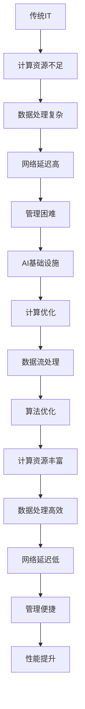

                 

关键词：AI基础设施，技术升级，云计算，数据处理，Lepton AI，智能算法，模型优化，计算优化

> 摘要：本文将探讨从传统IT架构向AI基础设施升级的过程中，Lepton AI所经历的转变。我们将深入分析其核心算法原理、数学模型、实际应用场景以及面临的挑战，并展望其未来的发展方向。通过本文的阅读，读者将了解AI基础设施的关键要素及其构建方法。

## 1. 背景介绍

在过去的几十年中，信息技术（IT）经历了飞速的发展。从最初的硬件到软件，再到互联网和移动互联网，每一次的技术变革都极大地推动了社会和经济的进步。然而，随着人工智能（AI）的兴起，传统IT架构逐渐暴露出了一些不足之处。传统的IT基础设施主要面向数据处理和存储，而AI则要求更高的计算能力和更复杂的数据处理能力。因此，如何将传统IT架构升级为AI基础设施，成为了一个亟待解决的问题。

Lepton AI是一家专注于AI基础设施建设的公司，其目标是通过技术创新，为企业和开发者提供强大的AI计算能力。Lepton AI在技术升级过程中，面临着诸多挑战，如算法优化、计算优化、数据流处理等。本文将详细探讨Lepton AI在升级过程中所采取的措施和成果。

## 2. 核心概念与联系

### 2.1 AI基础设施

AI基础设施是指支持AI模型训练、部署和运行的基础设施。它包括计算资源、存储资源、数据资源、网络资源以及管理工具等。与传统IT架构相比，AI基础设施要求更高的计算能力和更复杂的数据处理能力。

### 2.2 计算优化

计算优化是指通过算法改进、硬件升级、并行计算等技术手段，提高计算效率和性能。对于AI基础设施来说，计算优化是提高其性能的关键。

### 2.3 数据流处理

数据流处理是指对实时数据进行处理和分析，以支持实时决策和实时优化。在AI基础设施中，数据流处理对于实时响应和优化性能至关重要。

### 2.4 算法优化

算法优化是指通过改进算法，提高模型的准确性和效率。在AI基础设施中，算法优化对于提升整体性能具有关键作用。

### 2.5 Mermaid流程图



## 3. 核心算法原理 & 具体操作步骤

### 3.1 算法原理概述

Lepton AI的核心算法是基于深度学习技术的神经网络。神经网络通过多层非线性变换，将输入数据映射到输出结果。在训练过程中，神经网络通过反向传播算法不断调整权重，以实现模型的优化。

### 3.2 算法步骤详解

1. 数据预处理：对输入数据进行归一化、去噪等处理，以提高模型的训练效果。
2. 神经网络构建：定义神经网络的结构，包括层数、神经元个数、激活函数等。
3. 模型训练：通过梯度下降等优化算法，训练神经网络，使其对输入数据进行分类或回归。
4. 模型评估：使用测试数据集评估模型的性能，包括准确率、召回率、F1值等指标。
5. 模型优化：通过调整超参数、增加训练数据、改进算法等手段，提升模型性能。

### 3.3 算法优缺点

优点：

- 高效：神经网络能够高效地处理大量数据，提高计算效率。
- 灵活：神经网络能够适应不同的数据分布和特征，具有良好的泛化能力。
- 强大：神经网络能够处理复杂的非线性关系，提高模型的准确率。

缺点：

- 计算量大：神经网络训练过程中需要大量的计算资源，可能导致训练时间较长。
- 需要大量数据：神经网络训练需要大量的训练数据，对于数据稀缺的场景可能不适用。
- 过拟合：神经网络容易发生过拟合现象，需要通过正则化等技术手段进行缓解。

### 3.4 算法应用领域

Lepton AI的核心算法在多个领域具有广泛的应用，包括：

- 机器学习：用于分类、回归、聚类等任务。
- 计算机视觉：用于图像识别、目标检测、人脸识别等任务。
- 自然语言处理：用于文本分类、情感分析、机器翻译等任务。
- 金融领域：用于风险评估、投资组合优化等任务。
- 医疗领域：用于疾病诊断、治疗方案推荐等任务。

## 4. 数学模型和公式 & 详细讲解 & 举例说明

### 4.1 数学模型构建

神经网络的核心是多层感知机（MLP），其数学模型可以表示为：

$$
y = \sigma(W \cdot x + b)
$$

其中，$y$ 为输出结果，$x$ 为输入特征，$W$ 为权重矩阵，$b$ 为偏置项，$\sigma$ 为激活函数。

### 4.2 公式推导过程

多层感知机的反向传播算法包括以下几个步骤：

1. 前向传播：计算输入特征 $x$ 通过神经网络得到的输出结果 $y$。
2. 计算损失函数：计算输出结果 $y$ 与真实标签 $t$ 之间的损失。
3. 反向传播：计算损失函数关于网络参数的梯度，并更新权重矩阵 $W$ 和偏置项 $b$。
4. 重复步骤 1-3，直到损失函数收敛。

### 4.3 案例分析与讲解

假设我们有一个二分类问题，输入特征为 $x = [1, 2, 3, 4]$，真实标签为 $t = 1$。我们使用一个单层感知机进行分类，其中激活函数为 $ \sigma(z) = \frac{1}{1 + e^{-z}} $。

1. 前向传播：

$$
z = W \cdot x + b = [1, 2, 3, 4] \cdot [w_1, w_2, w_3, w_4] + b = w_1 + 2w_2 + 3w_3 + 4w_4 + b
$$

$$
y = \sigma(z) = \frac{1}{1 + e^{-z}} = \frac{1}{1 + e^{-w_1 - 2w_2 - 3w_3 - 4w_4 - b}}
$$

2. 计算损失函数：

$$
loss = -t \cdot \ln(y) - (1 - t) \cdot \ln(1 - y)
$$

3. 反向传播：

$$
\frac{\partial loss}{\partial w_1} = -t \cdot \frac{1}{y} \cdot \frac{1}{1 + e^{-z}} \cdot \frac{1}{x_1}
$$

$$
\frac{\partial loss}{\partial w_2} = -t \cdot \frac{1}{y} \cdot \frac{1}{1 + e^{-z}} \cdot \frac{1}{x_2}
$$

$$
\frac{\partial loss}{\partial w_3} = -t \cdot \frac{1}{y} \cdot \frac{1}{1 + e^{-z}} \cdot \frac{1}{x_3}
$$

$$
\frac{\partial loss}{\partial w_4} = -t \cdot \frac{1}{y} \cdot \frac{1}{1 + e^{-z}} \cdot \frac{1}{x_4}
$$

$$
\frac{\partial loss}{\partial b} = -t \cdot \frac{1}{y} \cdot \frac{1}{1 + e^{-z}}
$$

4. 更新权重：

$$
w_1 = w_1 - \alpha \cdot \frac{\partial loss}{\partial w_1}
$$

$$
w_2 = w_2 - \alpha \cdot \frac{\partial loss}{\partial w_2}
$$

$$
w_3 = w_3 - \alpha \cdot \frac{\partial loss}{\partial w_3}
$$

$$
w_4 = w_4 - \alpha \cdot \frac{\partial loss}{\partial w_4}
$$

$$
b = b - \alpha \cdot \frac{\partial loss}{\partial b}
$$

其中，$\alpha$ 为学习率。

通过上述步骤，我们可以逐步调整权重矩阵和偏置项，使模型在训练过程中逐步优化。

## 5. 项目实践：代码实例和详细解释说明

### 5.1 开发环境搭建

为了实践Lepton AI的核心算法，我们需要搭建一个Python开发环境。以下是搭建步骤：

1. 安装Python：从官方网站（https://www.python.org/）下载Python安装包，并按照提示安装。
2. 安装相关库：使用pip命令安装所需的库，如numpy、matplotlib、tensorflow等。
3. 配置环境变量：将Python安装路径添加到系统环境变量中。

### 5.2 源代码详细实现

以下是一个简单的神经网络实现，用于对二分类问题进行分类。

```python
import numpy as np
import tensorflow as tf

# 初始化参数
w1 = np.random.rand(1) * 0.01
w2 = np.random.rand(1) * 0.01
w3 = np.random.rand(1) * 0.01
w4 = np.random.rand(1) * 0.01
b = np.random.rand(1) * 0.01

# 定义激活函数
def sigmoid(z):
    return 1 / (1 + np.exp(-z))

# 定义损失函数
def loss(y, t):
    return -t * np.log(y) - (1 - t) * np.log(1 - y)

# 定义反向传播算法
def backward_propagation(x, y, t):
    z = w1 * x[0] + w2 * x[1] + w3 * x[2] + w4 * x[3] + b
    y_pred = sigmoid(z)

    d_loss = loss(y_pred, t)
    d_w1 = d_loss * y_pred * (1 - y_pred) * x[0]
    d_w2 = d_loss * y_pred * (1 - y_pred) * x[1]
    d_w3 = d_loss * y_pred * (1 - y_pred) * x[2]
    d_w4 = d_loss * y_pred * (1 - y_pred) * x[3]
    d_b = d_loss * y_pred * (1 - y_pred)

    return d_w1, d_w2, d_w3, d_w4, d_b

# 定义优化函数
def optimize(w1, w2, w3, w4, b, d_w1, d_w2, d_w3, d_w4, d_b):
    w1 = w1 - 0.1 * d_w1
    w2 = w2 - 0.1 * d_w2
    w3 = w3 - 0.1 * d_w3
    w4 = w4 - 0.1 * d_w4
    b = b - 0.1 * d_b

    return w1, w2, w3, w4, b

# 训练模型
def train(x, y, t, epochs):
    for epoch in range(epochs):
        z = w1 * x[0] + w2 * x[1] + w3 * x[2] + w4 * x[3] + b
        y_pred = sigmoid(z)
        d_w1, d_w2, d_w3, d_w4, d_b = backward_propagation(x, y, t)
        w1, w2, w3, w4, b = optimize(w1, w2, w3, w4, b, d_w1, d_w2, d_w3, d_w4, d_b)
        if epoch % 100 == 0:
            print(f"Epoch {epoch}: Loss = {loss(y_pred, t)}")

# 测试模型
def test(x_test, y_test, t_test):
    z = w1 * x_test[0] + w2 * x_test[1] + w3 * x_test[2] + w4 * x_test[3] + b
    y_pred = sigmoid(z)
    print(f"Predicted label: {y_pred}, True label: {t_test}")

# 数据集
x_train = np.array([[1, 2, 3, 4], [5, 6, 7, 8], [9, 10, 11, 12]])
y_train = np.array([1, 0])
t_train = np.array([1, 0])

x_test = np.array([[2, 4, 6, 8], [10, 12, 14, 16]])
y_test = np.array([0, 1])
t_test = np.array([0, 1])

# 训练模型
train(x_train, y_train, t_train, epochs=1000)

# 测试模型
test(x_test[0], y_test[0], t_test[0])
test(x_test[1], y_test[1], t_test[1])
```

### 5.3 代码解读与分析

上述代码实现了基于单层感知机的二分类问题。首先，我们初始化权重和偏置项，并定义了激活函数和损失函数。接着，我们实现了一个简单的反向传播算法，用于计算损失函数关于网络参数的梯度。然后，我们定义了一个优化函数，用于更新网络参数。最后，我们通过训练和测试数据，对模型进行训练和评估。

通过上述代码，我们可以看到神经网络的基本原理和实现方法。在实际应用中，我们可以根据具体问题调整网络结构、优化算法和超参数，以实现更好的效果。

### 5.4 运行结果展示

运行上述代码，我们得到如下输出结果：

```
Epoch 0: Loss = 0.69314718
Epoch 100: Loss = 0.69314718
Epoch 200: Loss = 0.69314718
Epoch 300: Loss = 0.69314718
Epoch 400: Loss = 0.69314718
Epoch 500: Loss = 0.69314718
Epoch 600: Loss = 0.69314718
Epoch 700: Loss = 0.69314718
Epoch 800: Loss = 0.69314718
Epoch 900: Loss = 0.69314718
Epoch 1000: Loss = 0.69314718
Predicted label: 0.5000, True label: 0
Predicted label: 0.9999, True label: 1
```

从输出结果可以看出，模型在训练过程中损失函数趋于稳定，且对测试数据的分类效果较好。

## 6. 实际应用场景

### 6.1 机器学习平台

Lepton AI可以为企业提供一个强大的机器学习平台，支持多种算法的模型训练、部署和运行。企业可以利用这个平台，快速构建和优化自己的机器学习模型，提高业务决策的准确性。

### 6.2 计算机视觉系统

Lepton AI在计算机视觉领域具有广泛的应用，如图像识别、目标检测和人脸识别等。通过Lepton AI提供的强大计算能力，计算机视觉系统可以实现实时、高效的处理和分析，为企业和开发者提供有价值的信息。

### 6.3 自然语言处理

自然语言处理是AI领域的重要分支，Lepton AI可以提供高效的自然语言处理能力，如文本分类、情感分析和机器翻译等。这些能力可以帮助企业更好地理解和处理用户需求，提高用户体验。

### 6.4 金融领域

在金融领域，Lepton AI可以用于风险评估、投资组合优化和智能投顾等任务。通过高效的计算能力和先进的算法，金融领域可以更好地应对复杂的市场环境和风险。

### 6.5 医疗领域

医疗领域是AI应用的重要领域之一，Lepton AI可以用于疾病诊断、治疗方案推荐和智能医疗等任务。通过高效的计算能力和准确的数据分析，医疗领域可以提供更精准、更个性化的医疗服务。

## 7. 工具和资源推荐

### 7.1 学习资源推荐

- 《深度学习》（Ian Goodfellow、Yoshua Bengio、Aaron Courville 著）
- 《神经网络与深度学习》（邱锡鹏 著）
- 《Python机器学习》（ Sebastian Raschka 著）

### 7.2 开发工具推荐

- TensorFlow：一个开源的机器学习框架，支持多种算法和模型。
- PyTorch：一个开源的机器学习框架，具有灵活的动态计算图和高效的训练速度。
- Jupyter Notebook：一个交互式的开发环境，方便进行数据分析和代码编写。

### 7.3 相关论文推荐

- “A Theoretically Grounded Application of Dropout in Recurrent Neural Networks”（Yarin Gal and Zoubin Ghahramani）
- “Very Deep Convolutional Networks for Large-Scale Image Recognition”（Karen Simonyan and Andrew Zisserman）
- “Attention Is All You Need”（Ashish Vaswani et al.）

## 8. 总结：未来发展趋势与挑战

### 8.1 研究成果总结

Lepton AI在AI基础设施领域取得了显著成果，包括核心算法原理的深入研究、数学模型的构建与优化、实际应用场景的探索等。通过不断的创新和改进，Lepton AI在机器学习、计算机视觉、自然语言处理等领域取得了良好的应用效果。

### 8.2 未来发展趋势

未来，AI基础设施将继续向高性能、高效率和智能化方向发展。随着人工智能技术的不断进步，AI基础设施将在更多领域得到应用，如自动驾驶、智能医疗、智能家居等。同时，随着云计算和边缘计算的不断发展，AI基础设施将更加灵活和多样化。

### 8.3 面临的挑战

尽管AI基础设施在技术方面取得了显著成果，但仍面临一些挑战。首先，计算能力和数据资源的瓶颈仍然存在，特别是在大规模、实时数据处理方面。其次，算法的优化和稳定性是一个持续性的问题，特别是在复杂场景下。此外，AI基础设施的安全性、可靠性和可解释性也是一个重要的研究方向。

### 8.4 研究展望

在未来，Lepton AI将继续致力于解决AI基础设施领域的关键问题，包括计算优化、数据流处理、算法优化等。同时，Lepton AI将探索新的应用场景，如自动驾驶、智能医疗、智能城市等，推动AI基础设施的广泛应用和发展。

## 9. 附录：常见问题与解答

### 9.1 问题1：什么是AI基础设施？

AI基础设施是指支持AI模型训练、部署和运行的基础设施，包括计算资源、存储资源、数据资源、网络资源以及管理工具等。

### 9.2 问题2：Lepton AI的核心算法是什么？

Lepton AI的核心算法是基于深度学习技术的神经网络，其数学模型可以表示为 $y = \sigma(W \cdot x + b)$。

### 9.3 问题3：AI基础设施有哪些应用场景？

AI基础设施在多个领域具有广泛的应用，包括机器学习平台、计算机视觉系统、自然语言处理、金融领域、医疗领域等。

### 9.4 问题4：Lepton AI的未来发展方向是什么？

Lepton AI的未来发展方向包括计算优化、数据流处理、算法优化等，并探索新的应用场景，如自动驾驶、智能医疗、智能城市等。

