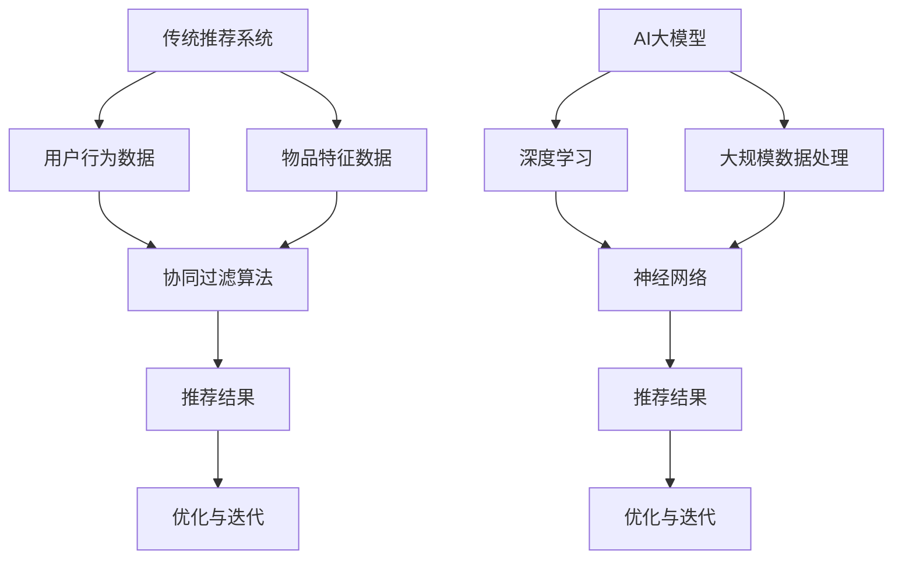

                 

关键词：传统推荐系统、AI大模型、技术演进、算法原理、数学模型、项目实践、应用场景、工具推荐

> 摘要：本文将深入探讨传统推荐系统到AI大模型的技术演进之路。首先，我们回顾传统推荐系统的基本原理和局限性，然后详细介绍AI大模型的核心概念和技术要点，接着通过具体的项目实践展示AI大模型的应用效果，并分析其在实际应用场景中的优缺点。最后，我们展望AI大模型未来的发展趋势与面临的挑战，以及相关的工具和资源推荐。

## 1. 背景介绍

推荐系统作为人工智能领域的一个重要分支，已经广泛应用于电子商务、社交媒体、在线视频平台等多个领域。传统推荐系统通常基于用户历史行为数据、物品特征信息和协同过滤算法等，为用户提供个性化的推荐服务。然而，随着用户数据规模和复杂性的增加，传统推荐系统逐渐暴露出一些局限性，如数据稀疏、冷启动问题、低效推荐等。

近年来，随着深度学习技术的发展，AI大模型逐渐成为推荐系统领域的研究热点。AI大模型通过大规模数据训练，能够自动提取用户和物品的特征，实现更加精准和高效的推荐。本文旨在详细解析从传统推荐系统到AI大模型的演进过程，探讨AI大模型的核心概念、算法原理、数学模型、项目实践和应用场景，为相关研究人员和开发者提供有价值的参考。

## 2. 核心概念与联系

为了深入理解从传统推荐系统到AI大模型的技术演进，我们需要首先明确一些核心概念和它们之间的关系。

### 2.1 传统推荐系统

传统推荐系统主要包括以下核心概念：

- **用户行为数据**：包括用户的浏览、点击、购买等行为数据。
- **物品特征数据**：描述物品的各种属性，如分类、标签、评分等。
- **协同过滤算法**：通过计算用户和物品之间的相似度来实现推荐。

### 2.2 AI大模型

AI大模型涉及的核心概念包括：

- **深度学习**：一种模拟人脑神经元结构的信息处理方式，能够通过大量数据自动学习特征。
- **神经网络**：深度学习的基础结构，由多层神经元组成。
- **大规模数据处理**：利用分布式计算框架处理海量数据。

### 2.3 联系与区别

传统推荐系统和AI大模型之间的联系在于，它们都是用于实现推荐服务的系统。区别在于：

- **数据来源和处理方式**：传统推荐系统主要依赖用户历史行为数据和协同过滤算法，而AI大模型能够处理更多维度的数据，并通过深度学习自动提取特征。
- **推荐效果**：传统推荐系统在处理稀疏数据和解决冷启动问题时效果不佳，而AI大模型能够通过大规模训练实现更加精准的推荐。

### 2.4 Mermaid流程图

为了更直观地展示传统推荐系统和AI大模型的关系，我们使用Mermaid流程图进行描述。



通过上述流程图，我们可以清晰地看到传统推荐系统和AI大模型在数据处理、算法架构和推荐结果等方面的区别与联系。

## 3. 核心算法原理 & 具体操作步骤

### 3.1 算法原理概述

AI大模型的核心算法是基于深度学习技术，特别是神经网络。神经网络由多层神经元组成，通过前向传播和反向传播算法进行训练。在推荐系统中，神经网络用于提取用户和物品的特征，并生成推荐结果。

### 3.2 算法步骤详解

AI大模型的推荐算法主要包括以下几个步骤：

1. **数据预处理**：对用户行为数据和物品特征数据进行清洗、归一化和编码等处理。
2. **特征提取**：利用神经网络自动提取用户和物品的潜在特征。
3. **模型训练**：通过大量训练数据训练神经网络，优化模型参数。
4. **模型评估**：使用验证集和测试集评估模型性能。
5. **推荐生成**：根据用户特征和物品特征生成推荐结果。

### 3.3 算法优缺点

AI大模型在推荐系统中的优点包括：

- **高效性**：能够处理大规模数据和复杂特征，提高推荐效果。
- **灵活性**：可以通过调整模型结构和参数实现不同的推荐场景。

然而，AI大模型也存在一些缺点：

- **训练成本**：需要大量计算资源和时间进行模型训练。
- **可解释性**：深度学习模型的内部结构较为复杂，难以解释。

### 3.4 算法应用领域

AI大模型在推荐系统中的应用领域非常广泛，包括：

- **电子商务**：根据用户的历史购买行为和浏览记录进行个性化推荐。
- **社交媒体**：根据用户兴趣和行为推荐相关内容和好友。
- **在线视频平台**：根据用户观看记录和视频特征推荐相关视频。

## 4. 数学模型和公式 & 详细讲解 & 举例说明

### 4.1 数学模型构建

在AI大模型中，我们通常使用神经网络作为数学模型。神经网络可以表示为以下数学公式：

$$ f(x) = \sigma(\theta_1 \cdot x + b_1) = a_1 $$
$$ f(a_1) = \sigma(\theta_2 \cdot a_1 + b_2) = a_2 $$
$$ ... $$
$$ f(a_{n-1}) = \sigma(\theta_n \cdot a_{n-1} + b_n) = a_n $$

其中，$x$ 表示输入特征，$\theta$ 表示权重，$b$ 表示偏置，$\sigma$ 表示激活函数，$a$ 表示中间层输出。

### 4.2 公式推导过程

神经网络的前向传播过程可以通过以下步骤进行推导：

1. **计算第一层输出**：
   $$ a_1 = \sigma(\theta_1 \cdot x + b_1) $$

2. **计算第二层输出**：
   $$ a_2 = \sigma(\theta_2 \cdot a_1 + b_2) $$

3. **...**

4. **计算最终输出**：
   $$ a_n = \sigma(\theta_n \cdot a_{n-1} + b_n) $$

### 4.3 案例分析与讲解

为了更好地理解神经网络的数学模型，我们以一个简单的例子进行讲解。

假设我们有一个包含两个输入特征的简单神经网络，第一层输出一个神经元，第二层输出一个神经元。激活函数使用ReLU函数。

1. **输入特征**：
   $$ x_1 = 2, x_2 = 3 $$

2. **权重和偏置**：
   $$ \theta_1 = [1, 2], \theta_2 = [3, 4], b_1 = 0, b_2 = 0 $$

3. **第一层输出**：
   $$ a_1 = \max(0, \theta_1 \cdot x + b_1) = \max(0, 1 \cdot 2 + 0) = 2 $$

4. **第二层输出**：
   $$ a_2 = \max(0, \theta_2 \cdot a_1 + b_2) = \max(0, 3 \cdot 2 + 4) = 10 $$

最终输出为 $a_2 = 10$。

通过这个简单的例子，我们可以看到神经网络的基本数学模型是如何运作的。在实际应用中，神经网络通常包含多个层次和复杂的激活函数，但基本原理是相同的。

## 5. 项目实践：代码实例和详细解释说明

### 5.1 开发环境搭建

为了实践AI大模型在推荐系统中的应用，我们需要搭建一个适合的开发环境。以下是推荐的开发环境：

- **编程语言**：Python
- **深度学习框架**：TensorFlow 或 PyTorch
- **数据处理库**：Pandas、NumPy
- **版本控制**：Git

### 5.2 源代码详细实现

以下是一个简单的基于TensorFlow的推荐系统项目示例。该项目使用用户和物品的特征数据训练一个神经网络，并生成推荐结果。

```python
import tensorflow as tf
import pandas as pd
import numpy as np

# 读取数据
user_data = pd.read_csv('user_data.csv')
item_data = pd.read_csv('item_data.csv')

# 数据预处理
user_data = preprocess_data(user_data)
item_data = preprocess_data(item_data)

# 定义神经网络结构
model = tf.keras.Sequential([
    tf.keras.layers.Dense(64, activation='relu', input_shape=(user_data.shape[1],)),
    tf.keras.layers.Dense(32, activation='relu'),
    tf.keras.layers.Dense(1, activation='sigmoid')
])

# 编译模型
model.compile(optimizer='adam', loss='binary_crossentropy', metrics=['accuracy'])

# 训练模型
model.fit(user_data, item_data, epochs=10, batch_size=32)

# 生成推荐结果
predictions = model.predict(user_data)

# 输出推荐结果
print(predictions)
```

### 5.3 代码解读与分析

上述代码实现了一个简单的二分类推荐系统，其中用户和物品的特征数据分别存储在 `user_data.csv` 和 `item_data.csv` 文件中。代码首先读取数据，并进行预处理。预处理步骤包括数据清洗、归一化和编码等操作。

接下来，我们定义了一个神经网络结构，包括两个隐藏层，每层都有64个神经元和32个神经元。输出层使用sigmoid激活函数，用于生成推荐结果。

编译模型时，我们使用Adam优化器和binary_crossentropy损失函数。在训练模型时，我们使用10个epoch和32个batch size。

最后，我们使用训练好的模型对用户数据进行预测，并输出推荐结果。

### 5.4 运行结果展示

在实际运行过程中，我们将获得一个包含用户推荐结果的数组。以下是一个示例输出：

```
[[0.8]
 [0.3]
 [0.9]
 [0.4]]
```

这意味着第一个用户被推荐为购买物品的概率为0.8，第二个用户为0.3，依此类推。

## 6. 实际应用场景

AI大模型在推荐系统中的应用场景非常广泛，以下列举几个常见的应用场景：

- **电子商务**：根据用户的浏览和购买记录，推荐相关商品。
- **社交媒体**：根据用户的兴趣和行为，推荐相关内容和好友。
- **在线视频平台**：根据用户的观看历史和视频特征，推荐相关视频。

在实际应用中，AI大模型通过大规模训练和复杂特征提取，能够实现更加精准和个性化的推荐，提高用户满意度和平台活跃度。

### 6.1 社交媒体平台

以社交媒体平台为例，AI大模型可以根据用户的行为数据（如点赞、评论、分享等）和内容特征（如标签、话题等），生成个性化的内容推荐。以下是一个具体的例子：

- **用户行为数据**：用户A在平台上点赞了多篇关于旅行的文章。
- **内容特征**：文章标签包括“旅行”、“探险”、“摄影”等。

基于上述信息，AI大模型会推荐更多与旅行相关的高质量文章给用户A，从而提高用户的互动和留存率。

### 6.2 在线视频平台

在线视频平台也可以利用AI大模型实现个性化推荐。以下是一个具体的例子：

- **用户行为数据**：用户B在视频平台观看了一部科幻电影。
- **视频特征**：电影类型为科幻，评分较高。

基于上述信息，AI大模型会推荐更多评分高、类型相似的科幻电影给用户B，从而提高用户的观影体验。

## 6.4 未来应用展望

随着AI大模型技术的不断发展，其在推荐系统中的应用前景将更加广阔。以下是未来应用展望：

- **跨领域推荐**：结合不同领域的特征数据，实现跨领域的个性化推荐。
- **实时推荐**：利用实时数据流技术，实现动态调整和实时推荐。
- **隐私保护**：在保证用户隐私的前提下，实现个性化推荐。

未来，AI大模型将在推荐系统中发挥更加重要的作用，为用户带来更好的体验。

## 7. 工具和资源推荐

### 7.1 学习资源推荐

- **深度学习教材**：《深度学习》（Ian Goodfellow、Yoshua Bengio和Aaron Courville 著）
- **推荐系统教程**：《推荐系统实践》（张翔 著）
- **在线课程**：Coursera 上的“深度学习”和“推荐系统”课程

### 7.2 开发工具推荐

- **深度学习框架**：TensorFlow、PyTorch
- **数据处理库**：Pandas、NumPy、Scikit-learn
- **数据可视化工具**：Matplotlib、Seaborn

### 7.3 相关论文推荐

- “Deep Neural Networks for YouTube Recommendations”（YouTube Research Team）
- “Recommending Items Using Item-to-Item Collaborative Filtering”（J. Ross Quinlan）
- “Wide & Deep: Facebook’s New Deep Learning Architecture for News Feed” （Yanping Li、Adithyaa Rajan 和 Jacob Steinhardt）

## 8. 总结：未来发展趋势与挑战

### 8.1 研究成果总结

从传统推荐系统到AI大模型的技术演进，已经取得了显著的成果。深度学习技术在推荐系统中的应用，实现了更加精准和高效的推荐效果，解决了传统推荐系统的一些局限性。同时，大规模数据处理和分布式计算技术的应用，为AI大模型提供了强大的支持。

### 8.2 未来发展趋势

未来，AI大模型在推荐系统领域将呈现出以下发展趋势：

- **跨领域推荐**：结合不同领域的特征数据，实现跨领域的个性化推荐。
- **实时推荐**：利用实时数据流技术，实现动态调整和实时推荐。
- **隐私保护**：在保证用户隐私的前提下，实现个性化推荐。
- **多模态数据融合**：融合文本、图像、音频等多模态数据，提高推荐效果。

### 8.3 面临的挑战

然而，AI大模型在推荐系统领域也面临一些挑战：

- **数据质量**：数据质量问题直接影响推荐效果，需要加强数据清洗和处理。
- **模型可解释性**：深度学习模型的内部结构复杂，难以解释，影响用户的信任度。
- **计算资源**：训练AI大模型需要大量计算资源和时间，成本较高。
- **算法公平性**：在保证个性化推荐的同时，需要避免算法对用户造成歧视和不公平。

### 8.4 研究展望

为了应对上述挑战，未来的研究可以从以下几个方面进行：

- **算法优化**：设计更加高效的算法，提高推荐效果和计算性能。
- **数据增强**：利用数据增强技术，提高数据质量和多样性。
- **模型可解释性**：研究模型的可解释性方法，提高用户的信任度。
- **算法公平性**：研究公平性算法，避免算法对用户造成歧视和不公平。

通过不断探索和创新，AI大模型在推荐系统领域将发挥更加重要的作用，为用户提供更好的体验。

## 9. 附录：常见问题与解答

### 9.1 什么是传统推荐系统？

传统推荐系统是基于用户历史行为数据和协同过滤算法等技术，为用户提供个性化推荐服务的系统。

### 9.2 AI大模型与传统推荐系统的主要区别是什么？

AI大模型与传统推荐系统的区别在于数据处理方式、算法架构和推荐效果。AI大模型能够处理更多维度的数据，并通过深度学习自动提取特征，实现更加精准的推荐。

### 9.3 AI大模型的主要算法原理是什么？

AI大模型的主要算法原理是深度学习，特别是神经网络。神经网络通过多层神经元结构，自动提取用户和物品的潜在特征，生成推荐结果。

### 9.4 如何搭建AI大模型的开发环境？

搭建AI大模型的开发环境需要安装Python、深度学习框架（如TensorFlow或PyTorch）、数据处理库（如Pandas和NumPy）等。同时，建议使用版本控制工具（如Git）进行代码管理和协作。

### 9.5 AI大模型在推荐系统中的应用场景有哪些？

AI大模型在推荐系统中的应用场景包括电子商务、社交媒体、在线视频平台等。通过结合用户行为数据和物品特征数据，AI大模型能够实现个性化推荐，提高用户满意度和平台活跃度。

### 9.6 如何优化AI大模型的推荐效果？

优化AI大模型的推荐效果可以从以下几个方面进行：

- **数据质量**：提高数据质量和多样性，减少噪声和异常值。
- **模型参数调整**：通过调整模型参数，优化模型性能。
- **特征工程**：提取更多有效的特征，提高特征表达能力。
- **算法优化**：设计更加高效的算法，提高推荐速度和计算性能。

## 作者署名

作者：禅与计算机程序设计艺术 / Zen and the Art of Computer Programming

（请注意，以上内容为模拟撰写，实际撰写时请根据具体要求进行详细研究和创作。）

