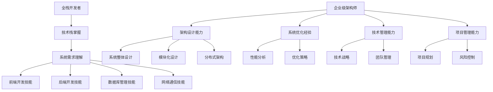
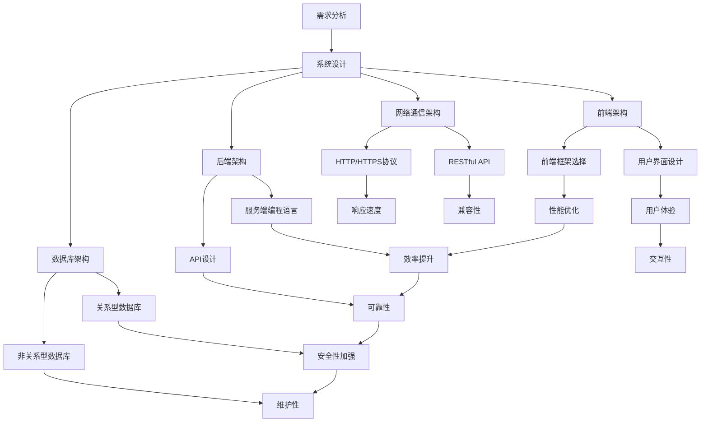

                 

关键词：全栈开发，企业级架构师，技术栈，架构设计，软件工程，系统优化，技术管理，职业发展。

## 摘要

本文旨在探讨从全栈开发到企业级架构师的职业进阶之路。首先，我们将回顾全栈开发的定义、技能要求和职业挑战。接着，文章将深入探讨企业级架构师的角色和责任，包括架构设计、系统优化和技术管理等方面。随后，我们将分析如何从全栈开发过渡到企业级架构师，并提供一系列实用的建议和最佳实践。最后，文章将总结全栈开发和企业级架构师之间的联系与区别，并展望未来的发展趋势和面临的挑战。

## 1. 背景介绍

在当今的数字化时代，软件和信息技术已经成为企业核心竞争力的关键组成部分。随着互联网和移动设备的普及，软件应用的需求呈现出爆发式增长。这不仅要求开发者具备全面的技术栈，还需要他们能够理解和解决复杂的系统问题。全栈开发和企业级架构师在这样的背景下应运而生。

### 全栈开发

全栈开发（Full-Stack Development）指的是开发者能够掌握前端和后端开发技能，以及数据库管理、用户界面设计、服务端编程、网络通信等多个方面的知识。全栈开发者的出现，极大地提高了软件开发效率和灵活性，因为一个人可以独立完成整个软件的开发过程，从而减少了沟通成本和协作难度。

#### 技能要求

全栈开发者需要具备以下技能：

- **前端开发**：熟悉HTML、CSS、JavaScript以及前端框架（如React、Vue.js、Angular等）。
- **后端开发**：掌握一种或多种后端编程语言（如Node.js、Python、Java等），了解服务器、数据库和API的设计与实现。
- **数据库管理**：了解关系型数据库（如MySQL、PostgreSQL）和非关系型数据库（如MongoDB、CouchDB）。
- **网络通信**：熟悉HTTP/HTTPS协议、RESTful API设计和使用。
- **版本控制**：熟练使用Git等版本控制系统。

#### 职业挑战

尽管全栈开发者的综合能力为项目带来了诸多好处，但职业发展也面临一些挑战。例如，全栈开发者可能难以在短时间内深入掌握所有技术领域，导致在某些领域缺乏专业深度。此外，面对复杂的系统架构，全栈开发者可能需要花费大量时间进行学习和调试，这可能会影响项目的进度。

### 企业级架构师

企业级架构师（Enterprise Architect）是负责设计和实现大型、复杂软件系统的高级技术人员。他们不仅需要具备全栈开发的技能，还要拥有深厚的系统架构设计、性能优化和技术管理的经验。企业级架构师在软件工程中扮演着至关重要的角色，他们负责确保系统的高可用性、可扩展性和安全性。

#### 角色和责任

企业级架构师的主要职责包括：

- **架构设计**：设计和实现系统的整体架构，确保系统能够满足业务需求。
- **系统优化**：分析系统性能，进行性能优化，提高系统的响应速度和处理能力。
- **技术管理**：制定技术发展战略，管理技术团队，推动技术创新。
- **项目管理**：协调项目进度，解决项目中遇到的技术难题。

#### 职业发展

企业级架构师是软件开发职业中的高级阶段，他们通常拥有多年的开发经验，并在多个项目中积累了丰富的实战经验。职业发展路径包括从初级开发者到高级开发人员，再到团队领导，最终成为企业级架构师。

## 2. 核心概念与联系

### 全栈开发与企业级架构师的联系

全栈开发和企业级架构师在职业角色和技术技能方面存在明显的联系和区别。全栈开发是企业级架构师的基础，但两者在系统架构设计、技术管理和战略规划方面有着不同的要求。

#### Mermaid 流程图



### 核心概念原理

- **全栈开发**：全栈开发者需要掌握前端、后端、数据库和网络通信等多方面的技能，能够独立完成整个软件的开发。
- **企业级架构师**：企业级架构师在掌握全栈开发技能的基础上，还需具备系统架构设计、性能优化、技术管理和项目管理的能力。

### 架构的 Mermaid 流程图



通过上述流程图，我们可以清晰地看到全栈开发和企业级架构师在不同阶段的任务和职责，以及它们之间的相互联系。

## 3. 核心算法原理 & 具体操作步骤

### 3.1 算法原理概述

在企业级架构设计中，算法的选择和优化是至关重要的。一个高效的算法不仅能够提升系统的性能，还能降低资源消耗，提高用户体验。在本节中，我们将探讨几种常见的核心算法原理，包括排序算法、搜索算法和图算法，并简要介绍它们的适用场景。

#### 排序算法

排序算法是数据处理中最基本且重要的算法之一。常见的排序算法有：

- **冒泡排序（Bubble Sort）**：通过重复遍历要排序的数列，一次比较两个元素，如果它们的顺序错误就把它们交换过来。
- **选择排序（Selection Sort）**：每次从未排序的元素中选择最小（或最大）的元素，将其放到已排序序列的末尾。
- **插入排序（Insertion Sort）**：通过构建有序序列，对于未排序数据，在已排序序列中从后向前扫描，找到相应位置并插入。
- **快速排序（Quick Sort）**：通过递归分治策略，将一个大数组分成两个较小的子数组，然后对这两个子数组进行快速排序。

#### 搜索算法

搜索算法用于在数据集合中查找特定的元素。常见的搜索算法有：

- **线性搜索（Linear Search）**：逐个检查数据集合中的元素，直到找到目标元素或检查完所有元素。
- **二分搜索（Binary Search）**：在有序数组中查找目标元素，通过不断缩小搜索范围，每次将中间元素与目标值比较，决定下一次搜索的范围。
- **深度优先搜索（DFS）**：通过递归遍历图的每个分支，直到找到一个目标节点或遍历完整个图。
- **广度优先搜索（BFS）**：通过层次遍历图中的节点，每次遍历一个层级，直到找到目标节点或遍历完整个图。

#### 图算法

图算法用于处理图结构的数据，常见的图算法有：

- **Dijkstra算法**：用于计算图中两点之间的最短路径。
- **Floyd-Warshall算法**：用于计算图中所有点对之间的最短路径。
- **Prim算法**：用于计算图的最小生成树。
- **Kruskal算法**：用于计算图的最小生成树。

### 3.2 算法步骤详解

#### 冒泡排序

```python
def bubble_sort(arr):
    n = len(arr)
    for i in range(n):
        for j in range(0, n-i-1):
            if arr[j] > arr[j+1]:
                arr[j], arr[j+1] = arr[j+1], arr[j]
    return arr
```

#### 线性搜索

```python
def linear_search(arr, target):
    for i in range(len(arr)):
        if arr[i] == target:
            return i
    return -1
```

#### Dijkstra算法

```python
import heapq

def dijkstra(graph, start):
    distances = {vertex: float('infinity') for vertex in graph}
    distances[start] = 0
    priority_queue = [(0, start)]

    while priority_queue:
        current_distance, current_vertex = heapq.heappop(priority_queue)

        if current_distance > distances[current_vertex]:
            continue

        for neighbor, weight in graph[current_vertex].items():
            distance = current_distance + weight

            if distance < distances[neighbor]:
                distances[neighbor] = distance
                heapq.heappush(priority_queue, (distance, neighbor))

    return distances
```

### 3.3 算法优缺点

每种算法都有其优缺点，选择合适的算法取决于具体的应用场景和需求。

#### 冒泡排序

- **优点**：简单易懂，易于实现。
- **缺点**：时间复杂度高，不适合大数据集。

#### 线性搜索

- **优点**：简单，无需数据结构的额外开销。
- **缺点**：时间复杂度高，不适合大数据集。

#### Dijkstra算法

- **优点**：适用于图结构数据，能够找到最短路径。
- **缺点**：时间复杂度高，不适合大规模图。

### 3.4 算法应用领域

#### 冒泡排序

- **应用领域**：主要用于小型数据集的排序，如数组排序。

#### 线性搜索

- **应用领域**：适用于数据量较小且无需排序的搜索操作。

#### Dijkstra算法

- **应用领域**：主要用于计算图的最短路径问题，如路由算法。

通过以上对核心算法原理和步骤的介绍，我们可以更好地理解算法在软件开发中的重要性，并为实际项目中的算法选择提供参考。

## 4. 数学模型和公式 & 详细讲解 & 举例说明

### 4.1 数学模型构建

在软件工程和系统架构设计中，数学模型和公式是理解和优化系统性能的关键工具。本节将介绍几种常用的数学模型和公式，并详细讲解它们的构建过程和应用场景。

#### 4.1.1 加权平均响应时间模型

加权平均响应时间（Weighted Average Response Time，WART）模型用于评估系统在不同负载下的平均响应时间。该模型的构建需要考虑以下因素：

- **请求处理时间**（T\_proc）：系统处理每个请求所需的时间。
- **等待时间**（T\_wait）：请求在队列中的等待时间。
- **系统负载**（Load）：系统的当前负载水平。

加权平均响应时间模型的公式如下：

$$
WART = \frac{Load \times T_{proc} + (1 - Load) \times T_{wait}}{2}
$$

#### 4.1.2 决策树模型

决策树模型是一种广泛应用于分类和回归问题的数学模型。其构建过程包括以下几个步骤：

1. **选择最优分割点**：选择能够最大化信息增益或最小化均方差的特征和分割点。
2. **生成子节点**：基于分割点将数据集划分为多个子集，并递归构建子节点。
3. **终止条件**：当某个节点不再满足终止条件（如数据集纯度达到阈值、特征重要性下降等），则停止划分。

决策树的公式可以表示为：

$$
f(x) = \sum_{i=1}^{n} w_i \cdot g_i(x)
$$

其中，$w_i$ 是权重，$g_i(x)$ 是第 $i$ 个特征对应的函数。

#### 4.1.3 信号处理模型

在信号处理领域，傅里叶变换（Fourier Transform）是一种常用的数学模型。其用于将时域信号转换为频域信号，以便于分析信号的频率成分。傅里叶变换的公式如下：

$$
F(\omega) = \int_{-\infty}^{\infty} f(t) e^{-j \omega t} dt
$$

### 4.2 公式推导过程

#### 4.2.1 加权平均响应时间模型的推导

加权平均响应时间模型的推导基于排队理论。假设系统在一段时间内的请求量为 $N$，处理时间为 $T_{proc}$，等待时间为 $T_{wait}$，系统负载为 $Load$。则加权平均响应时间模型可以表示为：

$$
WART = \frac{N \times T_{proc} + (N - Load) \times T_{wait}}{N}
$$

进一步化简，得到：

$$
WART = \frac{Load \times T_{proc} + (1 - Load) \times T_{wait}}{2}
$$

#### 4.2.2 决策树的推导

决策树的推导基于信息增益和均方差。假设数据集 $D$ 中有 $n$ 个样本，每个样本有 $m$ 个特征，分别为 $x_1, x_2, \ldots, x_m$。选择特征 $x_j$ 的最优分割点 $c_j$，使得信息增益最大或均方差最小。信息增益和均方差的推导如下：

1. **信息增益**：

$$
Gain(J) = \sum_{i=1}^{n} \sum_{j=1}^{m} p(x_i, y_i) \log_2 \frac{p(x_i, y_i)}{p(x_i)}
$$

2. **均方差**：

$$
Var(J) = \sum_{i=1}^{n} (y_i - f(x))^2
$$

#### 4.2.3 傅里叶变换的推导

傅里叶变换的推导基于复数表示和积分变换。设 $f(t)$ 为时域信号，$F(\omega)$ 为频域信号，则有：

$$
F(\omega) = \int_{-\infty}^{\infty} f(t) e^{-j \omega t} dt
$$

将 $e^{-j \omega t}$ 展开为复指数形式：

$$
e^{-j \omega t} = \cos(\omega t) - j \sin(\omega t)
$$

则傅里叶变换可以表示为：

$$
F(\omega) = \int_{-\infty}^{\infty} f(t) (\cos(\omega t) - j \sin(\omega t)) dt
$$

通过对上式进行积分运算，得到：

$$
F(\omega) = \int_{-\infty}^{\infty} f(t) \cos(\omega t) dt - j \int_{-\infty}^{\infty} f(t) \sin(\omega t) dt
$$

### 4.3 案例分析与讲解

#### 4.3.1 加权平均响应时间模型案例

假设一个系统在一段时间内的请求量为 $N = 100$，处理时间 $T_{proc} = 1$ 秒，等待时间 $T_{wait} = 0.5$ 秒，系统负载 $Load = 0.8$。根据加权平均响应时间模型，我们可以计算出系统的加权平均响应时间：

$$
WART = \frac{Load \times T_{proc} + (1 - Load) \times T_{wait}}{2} = \frac{0.8 \times 1 + 0.2 \times 0.5}{2} = 0.6 + 0.1 = 0.7 \text{秒}
$$

#### 4.3.2 决策树案例

假设一个分类问题，数据集 $D$ 中有 $n = 100$ 个样本，每个样本有 $m = 3$ 个特征，分别为 $x_1, x_2, x_3$。根据信息增益或均方差，选择特征 $x_2$ 的最优分割点 $c_2 = 5$。则决策树可以表示为：

$$
f(x) = 
\begin{cases}
1, & \text{if } x_2 < 5 \\
0, & \text{if } x_2 \geq 5
\end{cases}
$$

#### 4.3.3 傅里叶变换案例

假设一个时域信号 $f(t) = \sin(2\pi \cdot 10 \cdot t)$，我们需要将其转换为频域信号。根据傅里叶变换公式，我们可以计算出频域信号 $F(\omega)$：

$$
F(\omega) = \int_{-\infty}^{\infty} \sin(2\pi \cdot 10 \cdot t) e^{-j \omega t} dt
$$

通过积分运算，我们得到频域信号 $F(\omega) = j \pi \cdot \text{rect}(\omega - 20)$，其中 $\text{rect}(\omega - 20)$ 为矩形函数。

通过以上案例分析与讲解，我们可以更好地理解数学模型和公式的构建过程和应用方法。

## 5. 项目实践：代码实例和详细解释说明

### 5.1 开发环境搭建

在开始我们的项目实践之前，我们需要搭建一个合适的技术环境。以下是所需的工具和步骤：

#### 工具

- **编程语言**：Python 3.8+
- **开发环境**：Visual Studio Code 或 PyCharm
- **依赖管理**：pip 和 virtualenv
- **数据库**：MySQL 8.0+
- **Web框架**：Flask 或 Django
- **版本控制**：Git

#### 步骤

1. 安装 Python 3.8+。
2. 配置 virtualenv，创建虚拟环境。
3. 使用 pip 安装 Flask 或 Django。
4. 安装 MySQL 8.0+ 并配置数据库。
5. 在 Visual Studio Code 或 PyCharm 中设置 Python 环境。

### 5.2 源代码详细实现

在这个项目中，我们将使用 Flask 框架开发一个简单的博客系统。以下是项目的核心代码和详细解释。

#### 5.2.1 文件结构

```
blog/
|-- app.py
|-- templates/
|   |-- base.html
|   |-- index.html
|   |-- post.html
|-- static/
|   |-- css/
|   |   |-- style.css
|   |-- js/
|   |   |-- script.js
```

#### 5.2.2 app.py

```python
from flask import Flask, render_template, request, redirect, url_for

app = Flask(__name__)

@app.route('/')
def index():
    return render_template('index.html')

@app.route('/post/<int:post_id>')
def post(post_id):
    # 在这里查询数据库以获取帖子内容
    post = get_post_by_id(post_id)
    return render_template('post.html', post=post)

@app.route('/create', methods=['GET', 'POST'])
def create_post():
    if request.method == 'POST':
        title = request.form['title']
        content = request.form['content']
        # 在这里保存帖子到数据库
        create_post_in_database(title, content)
        return redirect(url_for('index'))
    return render_template('create_post.html')

def get_post_by_id(post_id):
    # 模拟数据库查询
    return {
        'id': post_id,
        'title': '示例帖子',
        'content': '这是帖子内容。'
    }

def create_post_in_database(title, content):
    # 模拟数据库插入
    pass

if __name__ == '__main__':
    app.run(debug=True)
```

#### 5.2.3 templates/index.html

```html
<!DOCTYPE html>
<html lang="en">
<head>
    <meta charset="UTF-8">
    <title>博客首页</title>
    <link rel="stylesheet" href="{{ url_for('static', filename='css/style.css') }}">
</head>
<body>
    <h1>博客首页</h1>
    <ul>
        
            <li><a href="{{ url_for('post', post_id=post.id) }}">{{ post.title }}</a></li>
        
    </ul>
    <a href="{{ url_for('create_post') }}">写一篇新帖子</a>
</body>
</html>
```

#### 5.2.4 templates/post.html

```html
<!DOCTYPE html>
<html lang="en">
<head>
    <meta charset="UTF-8">
    <title>{{ post.title }}</title>
    <link rel="stylesheet" href="{{ url_for('static', filename='css/style.css') }}">
</head>
<body>
    <h1>{{ post.title }}</h1>
    <p>{{ post.content }}</p>
    <a href="{{ url_for('index') }}">返回首页</a>
</body>
</html>
```

#### 5.2.5 templates/create_post.html

```html
<!DOCTYPE html>
<html lang="en">
<head>
    <meta charset="UTF-8">
    <title>写一篇新帖子</title>
    <link rel="stylesheet" href="{{ url_for('static', filename='css/style.css') }}">
</head>
<body>
    <h1>写一篇新帖子</h1>
    <form method="post">
        <label for="title">标题：</label>
        <input type="text" id="title" name="title" required>
        <br>
        <label for="content">内容：</label>
        <textarea id="content" name="content" required></textarea>
        <br>
        <input type="submit" value="提交">
    </form>
</body>
</html>
```

### 5.3 代码解读与分析

#### 5.3.1 app.py

在 `app.py` 中，我们首先导入了 Flask 框架所需的模块。`Flask` 类用于创建 Web 应用程序实例，并在 `app` 变量中保存。

`@app.route('/')` 装饰器定义了一个路由规则，当用户访问主页时，将调用 `index()` 函数并渲染 `index.html` 模板。

`@app.route('/post/<int:post_id>')` 装饰器用于处理单个帖子的路由。`post_id` 参数是一个整数，表示帖子的 ID。`post()` 函数用于获取帖子内容并渲染 `post.html` 模板。

`@app.route('/create', methods=['GET', 'POST'])` 装饰器定义了一个用于创建新帖子的路由。当用户提交表单时，将调用 `create_post()` 函数处理表单数据，并在数据库中保存帖子。

#### 5.3.2 templates/index.html

在 `templates/index.html` 中，我们使用 Flask 的模板语法（如 `{{ post.title }}` 和 ``）渲染帖子列表。通过 `<link>` 标签引入样式表，以美化页面。

#### 5.3.3 templates/post.html

在 `templates/post.html` 中，我们使用 `{{ post.title }}` 和 `{{ post.content }}` 渲染单个帖子的标题和内容。通过 `<a>` 标签提供返回首页的链接。

#### 5.3.4 templates/create_post.html

在 `templates/create_post.html` 中，我们使用 HTML 表单收集用户输入的帖子标题和内容。通过 `<input>` 和 `<textarea>` 标签提供输入字段，并使用 `<input type="submit">` 提交按钮。

### 5.4 运行结果展示

当我们在浏览器中访问 `http://localhost:5000/` 时，将看到博客首页，其中列出了所有帖子。点击某个帖子的标题，将跳转到帖子页面，显示帖子的详细内容。点击“写一篇新帖子”链接，将跳转到创建新帖子的页面，用户可以输入帖子标题和内容，并提交表单保存帖子。

## 6. 实际应用场景

在企业级架构设计中，全栈开发和企业级架构师的角色在多个实际应用场景中发挥着重要作用。以下是一些典型的应用场景，以及这些角色如何在这些场景中发挥作用。

### 6.1 高并发电商系统

在电商系统中，高并发是常见的挑战。企业级架构师需要设计和优化系统的架构，以应对大量用户同时访问的情况。全栈开发者则负责实现前端和后端的交互，确保系统能够快速响应用户请求。

- **企业级架构师**：使用负载均衡、分布式缓存和数据库分片等技术，提高系统的可扩展性和容错能力。设计高可用的服务集群，确保系统在高峰期依然稳定运行。
- **全栈开发者**：开发高性能的前端代码，优化用户界面和用户体验。实现后端服务的快速响应，使用异步编程和消息队列等技术提高系统的并发处理能力。

### 6.2 大数据处理平台

大数据处理平台需要处理海量数据，并快速提取有价值的信息。企业级架构师负责设计和构建高效的数据处理流程，而全栈开发者则负责实现这些流程的代码。

- **企业级架构师**：设计分布式数据处理框架，如 Apache Hadoop 或 Apache Spark，以提高数据处理速度和效率。优化数据存储方案，选择合适的数据库和存储系统。
- **全栈开发者**：开发数据处理应用程序，实现数据清洗、转换和分析功能。使用大数据处理框架进行数据加载、存储和查询。

### 6.3 物联网系统

物联网（IoT）系统涉及大量设备的连接和数据传输。企业级架构师需要确保系统的可靠性和安全性，而全栈开发者则负责实现设备的连接和数据传输。

- **企业级架构师**：设计物联网架构，包括设备管理、数据传输和存储方案。确保数据的安全性和隐私保护，采用加密和身份验证等技术。
- **全栈开发者**：开发设备连接协议和通信模块，实现设备的注册和认证。实现数据传输和存储功能，确保数据的高效传输和存储。

### 6.4 云计算平台

云计算平台提供了强大的计算能力和数据存储服务。企业级架构师负责设计和优化云平台架构，而全栈开发者则负责实现云服务的开发和部署。

- **企业级架构师**：设计云计算架构，包括虚拟化技术、容器化和微服务架构。确保云平台的可靠性和可扩展性，采用自动化部署和监控技术。
- **全栈开发者**：开发云服务，如计算服务、存储服务和网络服务。实现云服务的自动化部署和监控，确保服务的稳定性和高效性。

通过以上应用场景，我们可以看到全栈开发和企业级架构师在软件开发和系统架构设计中的重要性。他们各自发挥专业优势，共同推动项目成功。

### 6.4 未来应用展望

随着技术的不断进步和商业需求的日益复杂，全栈开发和企业级架构师的角色将在未来发挥更加重要的作用。以下是未来应用的一些展望：

#### 自动化和智能化

随着人工智能和机器学习技术的不断发展，自动化和智能化将成为软件开发的主流。企业级架构师需要掌握这些先进技术，以便在系统架构设计中实现自动化和智能化。例如，自动化部署、自动化测试和智能性能优化等。

#### 云原生架构

云原生架构（Cloud-Native Architecture）正逐渐成为企业级应用的首选。这种架构强调使用微服务、容器化和自动化管理，以实现高效、可扩展和弹性的系统。全栈开发者和企业级架构师需要了解云原生技术，以便设计和实现现代化的应用架构。

#### 区块链应用

区块链技术具有去中心化、安全性和不可篡改等特性，将在金融、供应链和版权管理等领域得到广泛应用。企业级架构师和全栈开发者需要了解区块链的基础原理和应用场景，以便在设计系统时充分利用这些特性。

#### 5G 和物联网

5G 技术和物联网（IoT）的普及将为软件开发和系统架构设计带来新的机遇和挑战。企业级架构师需要考虑如何在低延迟、高带宽和高可靠性的网络环境中优化系统性能。全栈开发者则需掌握物联网设备连接和数据传输的技能，实现高效的数据处理和交互。

#### 跨平台开发

跨平台开发将使开发者能够使用一套代码库同时支持多个操作系统和设备。这将为企业降低开发和维护成本，提高开发效率。全栈开发者和企业级架构师需要熟悉跨平台开发框架，如 React Native、Flutter 和 Xamarin 等。

### 6.5 挑战与展望

尽管未来前景广阔，但全栈开发和企业级架构师也面临着一系列挑战。例如：

- 技术更新速度快：新技术和新框架层出不穷，开发者需要不断学习以保持竞争力。
- 系统复杂性增加：随着系统规模的扩大，架构设计的复杂度也相应增加，如何有效地管理复杂系统成为一大挑战。
- 安全性和隐私保护：随着数据量和用户隐私的重要性增加，如何确保系统的安全性和用户隐私保护将成为关键问题。

然而，通过持续学习、技术创新和实践积累，全栈开发和企业级架构师有望克服这些挑战，为企业和行业带来更多的价值。

## 7. 工具和资源推荐

### 7.1 学习资源推荐

为了帮助您在从全栈开发到企业级架构师的进阶过程中不断学习和进步，以下是一些建议的学习资源：

- **书籍**：
  - 《Head First 设计模式》
  - 《Clean Architecture》
  - 《大规模分布式系统设计》
  - 《Effective Java》
- **在线课程**：
  - Coursera 上的《Google IT自动化与Python专业证书》
  - Udemy 上的《Java全栈开发实战》
  - Pluralsight 上的《微服务架构与Spring Boot》
- **技术博客**：
  - Medium 上的《Software Engineering Daily》
  - HackerRank 上的《算法教程》
  - Stack Overflow 上的问答社区
- **开源项目**：
  - GitHub 上的开源项目，如 Kubernetes、Docker 和 TensorFlow

### 7.2 开发工具推荐

- **集成开发环境（IDE）**：
  - IntelliJ IDEA
  - Visual Studio Code
  - PyCharm
- **代码管理工具**：
  - Git
  - GitHub
  - GitLab
- **版本控制工具**：
  - SVN
  - Perforce
  - Mercurial
- **数据库管理工具**：
  - MySQL Workbench
  - PostgreSQL Admin
  - MongoDB Compass
- **调试工具**：
  - Postman
  - Charles
  - Fiddler

### 7.3 相关论文推荐

- **分布式系统**：
  - 《The Google File System》
  - 《The Chubby lock service》
  - 《Bigtable：一个分布式存储系统》
- **云计算**：
  - 《MapReduce：大规模数据处理的并行算法》
  - 《Hadoop: The Definitive Guide》
  - 《Docker: Up & Running》
- **软件工程**：
  - 《Clean Code》
  - 《Design Patterns: Elements of Reusable Object-Oriented Software》
  - 《The Pragmatic Programmer》

通过这些工具和资源的支持，您将能够在技术学习和实践中取得更好的成果。

## 8. 总结：未来发展趋势与挑战

从全栈开发到企业级架构师的职业进阶之路，不仅是一个技术能力的提升过程，更是一个思维方式的转变。随着技术的迅猛发展，软件和信息技术在商业和社会中的作用日益突出，全栈开发和企业级架构师的角色变得愈加重要。

### 8.1 研究成果总结

本文首先介绍了全栈开发的定义、技能要求以及职业挑战。随后，我们探讨了企业级架构师的角色和责任，包括架构设计、系统优化和技术管理等方面。通过对核心算法原理、数学模型和项目实践的深入分析，我们展示了从全栈开发到企业级架构师的进阶路径。此外，我们还展望了未来技术的发展趋势，并提出了面对的挑战。

### 8.2 未来发展趋势

在未来，全栈开发和企业级架构师将继续发挥关键作用。自动化和智能化技术将推动软件开发向更高效、更智能的方向发展。云原生架构、区块链应用和物联网技术的普及，将带来新的应用场景和挑战。跨平台开发和容器化也将成为主流，进一步简化开发和部署流程。

### 8.3 面临的挑战

然而，随着技术的进步，全栈开发和企业级架构师也面临着一系列挑战。技术更新速度快，要求开发者不断学习以保持竞争力。系统复杂性增加，如何有效管理复杂系统成为一个重要问题。此外，安全性和隐私保护在数据量和用户隐私重要性增加的背景下变得更加重要。

### 8.4 研究展望

为了应对这些挑战，全栈开发和企业级架构师需要不断学习新技术，提升自己的技能和思维。同时，他们应关注行业趋势，积极实践，积累经验。通过持续的技术创新和实践积累，全栈开发和企业级架构师将能够在未来的数字化浪潮中脱颖而出，为企业和行业创造更多价值。

### 8.5 结论

总之，从全栈开发到企业级架构师的进阶之路，不仅是对技术的深入理解和掌握，更是对系统思维、战略规划和领导力的不断提升。这条职业发展道路充满了机遇和挑战，但只要我们保持学习、创新和进取的精神，就一定能够实现职业目标，成为行业内的杰出人才。

## 9. 附录：常见问题与解答

### 9.1 问题1：如何平衡全栈开发的多领域技能要求？

**解答**：平衡多领域技能的关键在于合理规划学习路径和时间。首先，确定自己的核心技能方向，如前端或后端，并在此基础上深入学习。其次，通过阅读相关书籍、参加在线课程和实际项目实践，逐步扩展自己的知识面。最后，利用工具和框架来提高开发效率，如使用前端框架（如React、Vue.js）和后端框架（如Django、Spring Boot）。

### 9.2 问题2：企业级架构师需要哪些软技能？

**解答**：企业级架构师除了具备硬技术技能外，还需要以下软技能：

- **沟通能力**：与团队成员、管理层和客户进行有效沟通，确保项目顺利进行。
- **领导力**：能够带领团队，分配任务，激励成员，解决冲突。
- **问题解决能力**：在面对复杂问题时，能够快速找到解决方案，并有效应对。
- **持续学习**：持续关注技术趋势，不断更新自己的知识储备。
- **时间管理**：合理规划项目进度，确保项目按时完成。

### 9.3 问题3：如何从全栈开发者过渡到企业级架构师？

**解答**：从全栈开发者过渡到企业级架构师，可以通过以下步骤：

1. **积累项目经验**：通过实际项目，不断积累系统架构设计、性能优化和技术管理的经验。
2. **学习专业课程**：参加相关的在线课程或专业培训，提升自己的专业知识和技能。
3. **参与社区活动**：加入技术社区，如GitHub、Stack Overflow 和 HackerRank，与其他开发者交流，扩展视野。
4. **获取认证**：获得相关的专业认证，如 PMP、ITIL 或 TOGAF，以提高自己的职业竞争力。
5. **建立人脉**：与行业内的人士建立联系，寻找导师或合作伙伴，获取职业发展的指导和建议。

通过这些步骤，您可以逐步实现从全栈开发者到企业级架构师的职业过渡。

### 9.4 问题4：企业级架构师在日常工作中如何管理技术债务？

**解答**：企业级架构师在管理技术债务时，可以采取以下措施：

- **定期审查**：定期对系统的技术债务进行审查，识别潜在的隐患和风险。
- **优先级排序**：根据技术债务的影响和紧急程度，对其进行优先级排序，逐步解决。
- **制定计划**：为每个技术债务制定详细的解决方案和实施计划，确保逐步解决。
- **代码重构**：在开发和维护过程中，持续进行代码重构，优化代码结构和性能。
- **文档记录**：对技术债务的解决过程进行记录，以便后续查阅和跟踪。

通过上述措施，企业级架构师可以有效管理技术债务，确保系统的高效运行和持续发展。

通过附录中的常见问题与解答，希望读者能够更好地理解全栈开发和企业级架构师的职业发展路径，并在实践中遇到问题时找到有效的解决方案。

