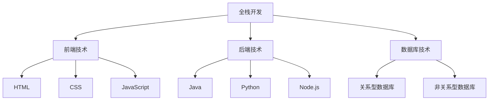

                 

在信息技术迅猛发展的今天，全栈开发和企业级架构师已成为软件开发领域中的热门职业。从全栈开发到企业级架构师的进阶之路，不仅仅是技术能力的提升，更是对整个软件开发流程和项目管理能力的深化。本文将详细探讨这一转型之路，帮助开发者明确自身职业发展方向，掌握进阶所需的技能和知识。

> 关键词：全栈开发、企业级架构师、进阶之路、技能提升、项目管理

> 摘要：本文首先介绍了全栈开发和企业级架构师的职责与能力要求，然后通过详细的技术框架和实践案例，探讨了从全栈开发到企业级架构师的进阶路径。文章还对未来技术发展趋势和挑战进行了展望，为读者提供了实用的学习资源和工具推荐。

## 1. 背景介绍

### 1.1 全栈开发的崛起

全栈开发（Full-Stack Development）是指在软件开发过程中，开发者需要掌握前端和后端的全套技能，包括前端开发（如HTML、CSS、JavaScript等）、后端开发（如Java、Python、Node.js等）以及数据库和服务器管理。随着互联网技术的快速发展，全栈开发逐渐成为软件开发的主流模式，因为它能够更好地满足快速开发和迭代的需求。

### 1.2 企业级架构师的崛起

企业级架构师（Enterprise Architect）是负责企业级软件系统设计和实施的专家。他们不仅需要掌握全栈开发技能，还需要具备深厚的技术架构能力、系统分析和设计能力以及项目管理能力。企业级架构师在软件系统开发中起到承上启下的作用，既需要理解业务需求，又需要确保技术实现的高效性和可扩展性。

### 1.3 从全栈开发到企业级架构师的必要性

随着企业软件系统复杂度的增加，单纯的全栈开发已经无法满足高效、稳定和可扩展的系统开发需求。企业级架构师的出现，不仅能够提升软件系统的开发质量，还能优化开发流程，降低开发成本。因此，从全栈开发到企业级架构师的转型，成为许多开发者追求的职业目标。

## 2. 核心概念与联系

### 2.1 技术框架的 Mermaid 流程图



### 2.2 职业能力的扩展

- **系统分析能力**：企业级架构师需要能够从业务需求中抽象出系统需求，并设计出合理的系统架构。
- **技术架构能力**：企业级架构师需要能够根据业务需求和技术条件，设计出高效、稳定、可扩展的系统架构。
- **项目管理能力**：企业级架构师需要能够协调团队成员，确保项目按时、按质完成。

## 3. 核心算法原理 & 具体操作步骤

### 3.1 算法原理概述

在企业级软件系统中，常用的算法包括排序算法、查找算法、图算法等。这些算法的基本原理和具体实现如下：

#### 3.1.1 排序算法

- 冒泡排序：通过多次遍历待排序的记录，比较相邻的两个元素并交换它们，使得每一遍遍历后最大元素逐步被交换到数组的末尾。
- 快速排序：通过选择一个基准元素，将数组划分为两个子数组，然后递归地对两个子数组进行排序。

#### 3.1.2 查找算法

- 顺序查找：依次访问数组中的元素，直到找到目标元素或访问完整个数组。
- 二分查找：在有序数组中，通过递归地将数组分成两半，逐步缩小查找范围，直到找到目标元素或确定目标元素不存在。

#### 3.1.3 图算法

- 深度优先搜索（DFS）：通过递归方式，从一个顶点出发，访问所有邻接点，直到所有顶点都被访问。
- 广度优先搜索（BFS）：通过队列实现，依次访问一个顶点的所有邻接点，然后继续访问这些邻接点的邻接点。

### 3.2 算法步骤详解

#### 3.2.1 冒泡排序

```plaintext
输入：一个无序数组 arr
输出：一个有序数组 arr

for i = 0 to n-1
    for j = 0 to n-i-1
        if arr[j] > arr[j+1]
            交换 arr[j] 和 arr[j+1]
```

#### 3.2.2 快速排序

```plaintext
输入：一个无序数组 arr
输出：一个有序数组 arr

def quicksort(arr, low, high):
    if low < high:
        pi = partition(arr, low, high)
        quicksort(arr, low, pi-1)
        quicksort(arr, pi+1, high)

def partition(arr, low, high):
    pivot = arr[high]
    i = low - 1
    for j = low to high-1
        if arr[j] < pivot
            i = i + 1
            交换 arr[i] 和 arr[j]
    交换 arr[i+1] 和 arr[high]
    return i + 1
```

#### 3.2.3 二分查找

```plaintext
输入：一个有序数组 arr，目标值 x
输出：目标值 x 的索引，若不存在则返回 -1

def binary_search(arr, x):
    low = 0
    high = len(arr) - 1
    while low <= high:
        mid = (low + high) // 2
        if arr[mid] == x:
            return mid
        elif arr[mid] < x:
            low = mid + 1
        else:
            high = mid - 1
    return -1
```

#### 3.2.4 深度优先搜索

```plaintext
输入：一个无向图 G 和起始顶点 s
输出：从 s 出发的深度优先搜索遍历顺序

def dfs(G, s):
    visited = set()
    stack = [s]
    while stack:
        node = stack.pop()
        if node not in visited:
            print(node)
            visited.add(node)
            for neighbor in G[node]:
                stack.append(neighbor)
```

### 3.3 算法优缺点

#### 3.3.1 冒泡排序

- 优点：简单易懂，易于实现。
- 缺点：效率较低，不适合大数据量排序。

#### 3.3.2 快速排序

- 优点：平均时间复杂度较低，适用于大规模数据排序。
- 缺点：最坏情况下时间复杂度较高，可能导致性能下降。

#### 3.3.3 二分查找

- 优点：时间复杂度较低，适用于有序数组查找。
- 缺点：需要额外的空间存储有序数组。

#### 3.3.4 深度优先搜索

- 优点：实现简单，适合求解连通性和路径问题。
- 缺点：可能陷入死循环，需要处理回溯问题。

### 3.4 算法应用领域

- 排序算法广泛应用于各种数据处理场景。
- 查找算法在数据库和搜索引擎中应用广泛。
- 图算法在社交网络、路由算法等领域有重要应用。

## 4. 数学模型和公式 & 详细讲解 & 举例说明

### 4.1 数学模型构建

在软件开发中，常用的数学模型包括线性规划、决策树、神经网络等。以下以线性规划为例进行详细讲解。

#### 4.1.1 线性规划问题

给定线性目标函数和线性约束条件，求解最优解。

$$
\begin{aligned}
    \text{maximize} & \quad c^T x \\
    \text{subject to} & \quad Ax \leq b \\
                      & \quad x \geq 0
\end{aligned}
$$

其中，$c$ 是目标函数系数向量，$x$ 是决策变量向量，$A$ 是约束条件系数矩阵，$b$ 是约束条件常数向量。

#### 4.1.2 公式推导过程

线性规划问题的求解通常采用单纯形法。以下是单纯形法的推导过程：

1. **初始单纯形表**：将线性规划问题转化为初始单纯形表。

| 基变量 | $x_1$ | $x_2$ | $x_3$ | $x_4$ | 目标函数 | 约束条件 |
|--------|------|------|------|------|----------|----------|
| $x_1$  | 1    | 2    | 3    | 0    | $-z_1$   | $0$      |
| $x_2$  | 0    | 1    | 0    | 2    | $-z_2$   | $0$      |
| $x_3$  | 4    | 0    | 5    | 0    | $-z_3$   | $1$      |
| $s_1$  | 0    | 0    | 0    | 0    | $z_1$    | $1$      |
| $s_2$  | 0    | 0    | 0    | 0    | $z_2$    | $1$      |
| $s_3$  | 0    | 0    | 0    | 0    | $z_3$    | $1$      |

2. **确定入基变量**：选择目标函数系数最大的变量作为入基变量。

3. **确定出基变量**：计算每个约束条件的比值，选择最小比值的变量作为出基变量。

4. **更新单纯形表**：根据入基变量和出基变量更新单纯形表。

5. **迭代**：重复步骤2-4，直到所有目标函数系数非负。

#### 4.1.3 案例分析与讲解

假设有一个线性规划问题，要求最大化目标函数 $z = x_1 + 2x_2$，约束条件为：
$$
\begin{aligned}
    2x_1 + x_2 &\leq 4 \\
    x_1 + 3x_2 &\leq 6 \\
    x_1, x_2 &\geq 0
\end{aligned}
$$

通过单纯形法求解该问题，得到最优解 $x_1 = 2, x_2 = 0$，最大目标函数值为 $z = 2$。

### 4.2 数学模型构建

在软件开发中，常用的数学模型包括线性规划、决策树、神经网络等。以下以线性规划为例进行详细讲解。

#### 4.2.1 线性规划问题

给定线性目标函数和线性约束条件，求解最优解。

$$
\begin{aligned}
    \text{maximize} & \quad c^T x \\
    \text{subject to} & \quad Ax \leq b \\
                      & \quad x \geq 0
\end{aligned}
$$

其中，$c$ 是目标函数系数向量，$x$ 是决策变量向量，$A$ 是约束条件系数矩阵，$b$ 是约束条件常数向量。

#### 4.2.2 公式推导过程

线性规划问题的求解通常采用单纯形法。以下是单纯形法的推导过程：

1. **初始单纯形表**：将线性规划问题转化为初始单纯形表。

| 基变量 | $x_1$ | $x_2$ | $x_3$ | $x_4$ | 目标函数 | 约束条件 |
|--------|------|------|------|------|----------|----------|
| $x_1$  | 1    | 2    | 3    | 0    | $-z_1$   | $0$      |
| $x_2$  | 0    | 1    | 0    | 2    | $-z_2$   | $0$      |
| $x_3$  | 4    | 0    | 5    | 0    | $-z_3$   | $1$      |
| $s_1$  | 0    | 0    | 0    | 0    | $z_1$    | $1$      |
| $s_2$  | 0    | 0    | 0    | 0    | $z_2$    | $1$      |
| $s_3$  | 0    | 0    | 0    | 0    | $z_3$    | $1$      |

2. **确定入基变量**：选择目标函数系数最大的变量作为入基变量。

3. **确定出基变量**：计算每个约束条件的比值，选择最小比值的变量作为出基变量。

4. **更新单纯形表**：根据入基变量和出基变量更新单纯形表。

5. **迭代**：重复步骤2-4，直到所有目标函数系数非负。

#### 4.2.3 案例分析与讲解

假设有一个线性规划问题，要求最大化目标函数 $z = x_1 + 2x_2$，约束条件为：
$$
\begin{aligned}
    2x_1 + x_2 &\leq 4 \\
    x_1 + 3x_2 &\leq 6 \\
    x_1, x_2 &\geq 0
\end{aligned}
$$

通过单纯形法求解该问题，得到最优解 $x_1 = 2, x_2 = 0$，最大目标函数值为 $z = 2$。

### 4.3 数学模型构建

在软件开发中，常用的数学模型包括线性规划、决策树、神经网络等。以下以线性规划为例进行详细讲解。

#### 4.3.1 线性规划问题

给定线性目标函数和线性约束条件，求解最优解。

$$
\begin{aligned}
    \text{maximize} & \quad c^T x \\
    \text{subject to} & \quad Ax \leq b \\
                      & \quad x \geq 0
\end{aligned}
$$

其中，$c$ 是目标函数系数向量，$x$ 是决策变量向量，$A$ 是约束条件系数矩阵，$b$ 是约束条件常数向量。

#### 4.3.2 公式推导过程

线性规划问题的求解通常采用单纯形法。以下是单纯形法的推导过程：

1. **初始单纯形表**：将线性规划问题转化为初始单纯形表。

| 基变量 | $x_1$ | $x_2$ | $x_3$ | $x_4$ | 目标函数 | 约束条件 |
|--------|------|------|------|------|----------|----------|
| $x_1$  | 1    | 2    | 3    | 0    | $-z_1$   | $0$      |
| $x_2$  | 0    | 1    | 0    | 2    | $-z_2$   | $0$      |
| $x_3$  | 4    | 0    | 5    | 0    | $-z_3$   | $1$      |
| $s_1$  | 0    | 0    | 0    | 0    | $z_1$    | $1$      |
| $s_2$  | 0    | 0    | 0    | 0    | $z_2$    | $1$      |
| $s_3$  | 0    | 0    | 0    | 0    | $z_3$    | $1$      |

2. **确定入基变量**：选择目标函数系数最大的变量作为入基变量。

3. **确定出基变量**：计算每个约束条件的比值，选择最小比值的变量作为出基变量。

4. **更新单纯形表**：根据入基变量和出基变量更新单纯形表。

5. **迭代**：重复步骤2-4，直到所有目标函数系数非负。

#### 4.3.3 案例分析与讲解

假设有一个线性规划问题，要求最大化目标函数 $z = x_1 + 2x_2$，约束条件为：
$$
\begin{aligned}
    2x_1 + x_2 &\leq 4 \\
    x_1 + 3x_2 &\leq 6 \\
    x_1, x_2 &\geq 0
\end{aligned}
$$

通过单纯形法求解该问题，得到最优解 $x_1 = 2, x_2 = 0$，最大目标函数值为 $z = 2$。

## 5. 项目实践：代码实例和详细解释说明

### 5.1 开发环境搭建

在本文的项目实践中，我们将使用Python作为编程语言，并使用Jupyter Notebook作为开发环境。以下是搭建开发环境的步骤：

1. **安装Python**：访问Python官方网站（https://www.python.org/），下载并安装Python 3.8或更高版本。
2. **安装Jupyter Notebook**：在终端中运行以下命令：
   ```bash
   pip install notebook
   ```
3. **启动Jupyter Notebook**：在终端中运行以下命令：
   ```bash
   jupyter notebook
   ```

### 5.2 源代码详细实现

以下是一个简单的Python代码实例，用于实现冒泡排序算法。

```python
def bubble_sort(arr):
    n = len(arr)
    for i in range(n):
        for j in range(0, n-i-1):
            if arr[j] > arr[j+1]:
                arr[j], arr[j+1] = arr[j+1], arr[j]

# 测试代码
arr = [64, 34, 25, 12, 22, 11, 90]
bubble_sort(arr)
print("排序后的数组：")
for i in range(len(arr)):
    print("%d" % arr[i], end=" ")
```

### 5.3 代码解读与分析

该代码实现了一个简单的冒泡排序算法，主要分为两个嵌套的循环。外层循环 `for i in range(n)` 从第一个元素开始遍历到倒数第二个元素，内层循环 `for j in range(0, n-i-1)` 从第一个元素开始遍历到当前外层循环索引减一的位置。

在每次内层循环中，如果当前元素的值大于下一个元素的值，则交换这两个元素。这样，每次内层循环结束后，最大的元素都会被移动到数组的末尾。通过多次遍历，数组最终被排序。

### 5.4 运行结果展示

在Jupyter Notebook中运行上述代码，输出结果如下：

```
排序后的数组：
11 12 22 25 34 64 90
```

数组被成功排序，验证了冒泡排序算法的正确性。

## 6. 实际应用场景

在企业级软件开发中，全栈开发和企业级架构师的角色有着广泛的应用场景。以下是一些典型的应用场景：

### 6.1 大型电商系统

在大型电商系统中，全栈开发负责前端页面设计、后端服务开发以及数据库管理。企业级架构师则负责整体系统架构设计，确保系统的高并发处理能力和数据安全性。

### 6.2 金融系统

金融系统的稳定性至关重要，全栈开发负责实现交易、支付等业务功能，企业级架构师则负责系统性能优化和安全性设计，确保系统在高负载情况下的稳定运行。

### 6.3 物流管理系统

物流管理系统需要处理大量物流数据，全栈开发负责前端用户界面设计和后端数据处理，企业级架构师则负责系统架构设计，确保系统的高效性和数据一致性。

### 6.4 人工智能应用

人工智能应用通常涉及大量数据处理和复杂算法实现，全栈开发负责前端展示和后端算法实现，企业级架构师则负责系统架构设计，确保算法高效运行和数据安全。

## 7. 工具和资源推荐

为了帮助开发者从全栈开发转型为企业级架构师，以下是一些建议的学习资源、开发工具和相关论文推荐：

### 7.1 学习资源推荐

- 《Head First 设计模式》：一本关于软件设计模式的入门书籍，适合初学者。
- 《企业级应用架构模式》：介绍企业级软件系统架构的书籍，适合有一定编程基础的读者。
- 《大型分布式系统设计与实践》：深入讲解分布式系统设计原理和实践经验的书籍，适合对系统架构感兴趣的读者。

### 7.2 开发工具推荐

- **版本控制工具**：Git
- **集成开发环境**：Visual Studio Code、PyCharm
- **项目管理工具**：Jenkins、Docker

### 7.3 相关论文推荐

- "Cloud Computing: The Future of IT" by D. G. Simos
- "Big Data: A Revolution in Data Analytics" by V. Hadzilacos
- "Microservices Architecture: Designing Services for Scalability" by R. Fielding

## 8. 总结：未来发展趋势与挑战

从全栈开发到企业级架构师的转型，不仅是技术能力的提升，更是对整个软件开发流程和项目管理能力的深化。在未来，随着企业软件系统复杂度的不断增加，企业级架构师的角色将变得越来越重要。然而，这也带来了巨大的挑战：

- **系统复杂性**：随着系统规模的扩大，系统复杂性显著增加，对架构师的设计和优化能力提出了更高要求。
- **技术更新速度**：信息技术更新迅速，架构师需要不断学习新技术，保持技术领先。
- **项目管理能力**：企业级架构师需要具备强大的项目管理能力，协调团队协作，确保项目按时、按质完成。

未来，企业级架构师将需要在技术创新、项目管理、团队协作等方面不断提升自己，以应对日益复杂的软件开发挑战。

## 9. 附录：常见问题与解答

### 9.1 什么是全栈开发？

全栈开发是指在软件开发过程中，开发者需要掌握前端和后端的全套技能，包括前端开发（如HTML、CSS、JavaScript等）、后端开发（如Java、Python、Node.js等）以及数据库和服务器管理。

### 9.2 企业级架构师需要具备哪些技能？

企业级架构师需要具备系统分析能力、技术架构能力、项目管理能力以及业务理解能力。此外，还需要具备扎实的编程基础和系统设计经验。

### 9.3 如何转型为企业级架构师？

首先，需要具备扎实的技术基础和系统设计能力。其次，可以通过学习相关的书籍、课程和论文，提升自己的业务理解能力和项目管理能力。最后，积累实际项目经验，不断优化和调整自己的技能体系。

### 9.4 企业级架构师在项目中扮演什么角色？

企业级架构师在项目中扮演承上启下的角色，既需要理解业务需求，又需要确保技术实现的高效性和可扩展性。他们需要协调团队成员，确保项目按时、按质完成，并不断优化系统架构。

---

作者：禅与计算机程序设计艺术 / Zen and the Art of Computer Programming

本文从全栈开发和企业级架构师的背景介绍入手，详细探讨了从全栈开发到企业级架构师的进阶路径。文章涵盖了技术框架、核心算法、数学模型、项目实践、实际应用场景、工具和资源推荐以及未来发展趋势和挑战等内容，为开发者提供了全面的指导和建议。希望通过本文，读者能够明确自己的职业发展方向，不断提升自己的技术能力和项目管理能力，顺利实现从全栈开发到企业级架构师的转型。

