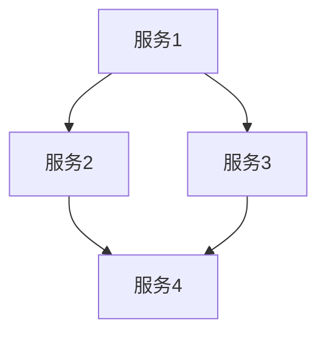

                 

关键词：全栈开发，微服务架构，架构师，晋升之路，技术演进

摘要：本文将探讨从全栈开发到微服务架构师的角色转变之路。我们将分析全栈开发的概念、技术栈，以及如何过渡到微服务架构。通过详细解释微服务架构的核心概念、优点和挑战，我们将帮助读者理解如何成为一名合格的微服务架构师，并在职业生涯中取得成功。

## 1. 背景介绍

### 1.1 全栈开发的概念

全栈开发（Full-Stack Development）是指开发人员能够掌握前端、后端和数据库等所有方面的技能，以实现一个完整的应用程序。全栈开发者不仅需要了解前端技术，如HTML、CSS、JavaScript等，还要熟悉后端技术，如Node.js、Java、Python等，以及数据库技术，如MySQL、MongoDB、PostgreSQL等。

### 1.2 全栈开发者的技能要求

1. **前端技能**：HTML、CSS、JavaScript、框架（如React、Vue、Angular等）。
2. **后端技能**：服务器、应用、数据库方面的编程技能。
3. **数据库知识**：了解关系型数据库（如MySQL、PostgreSQL）和非关系型数据库（如MongoDB、Cassandra）。
4. **设计技能**：能够进行用户界面设计和用户体验设计。
5. **工具和框架**：熟悉开发工具和框架，如Webpack、Babel、Gulp等。

## 2. 核心概念与联系

### 2.1 微服务架构的概念

微服务架构（Microservices Architecture）是一种基于独立、小规模服务的应用架构风格。每个微服务都独立开发、部署和管理，专注于完成单一功能，并通过API进行通信。

### 2.2 微服务架构的核心概念

1. **服务自治**：每个微服务都是独立的，可以独立开发、部署和管理。
2. **去中心化**：没有全局状态，每个服务都可以独立运行，不受其他服务的影响。
3. **独立部署**：可以独立部署，不会影响到其他服务。
4. **语言无关性**：可以使用不同的编程语言和框架开发不同的微服务。
5. **API通信**：服务之间通过API进行通信。

### 2.3 Mermaid 流程图

以下是一个简单的Mermaid流程图，展示了微服务架构的基本概念：



### 2.4 微服务架构与传统架构的区别

1. **模块化**：微服务架构将应用划分为多个独立的服务，而传统架构通常是将所有功能集中在单一应用程序中。
2. **自治性**：微服务架构中的每个服务都可以独立开发、部署和管理，而传统架构中所有功能都紧密耦合。
3. **分布式**：微服务架构支持分布式部署，而传统架构通常在单台服务器上运行。

## 3. 核心算法原理 & 具体操作步骤

### 3.1 算法原理概述

微服务架构的核心算法原理主要包括：

1. **负载均衡**：通过将请求分配到多个实例，提高系统的可用性和响应速度。
2. **服务发现**：服务实例在启动时，向服务注册中心注册自身地址，其他服务可以通过服务注册中心发现可用服务。
3. **断路器**：在服务调用失败时，断路器会触发熔断机制，防止故障扩散。
4. **限流**：限制每个服务的并发请求数量，防止系统过载。

### 3.2 算法步骤详解

1. **负载均衡**：

   - 步骤1：服务器收到请求。
   - 步骤2：服务器将请求通过负载均衡算法（如轮询、随机、最少连接等）分配到某个实例。
   - 步骤3：实例处理请求，并返回结果。

2. **服务发现**：

   - 步骤1：服务实例启动时，向服务注册中心注册自身地址。
   - 步骤2：其他服务通过服务注册中心查询可用服务实例地址。
   - 步骤3：调用服务时，根据服务实例地址进行调用。

3. **断路器**：

   - 步骤1：服务调用时，记录调用结果。
   - 步骤2：当调用失败次数达到设定阈值时，断路器触发熔断。
   - 步骤3：熔断后，服务调用会直接返回错误，并进入半开状态。
   - 步骤4：一段时间后，断路器尝试恢复，如果成功，则关闭熔断。

4. **限流**：

   - 步骤1：服务实例收到请求时，记录请求时间。
   - 步骤2：当请求达到设定阈值时，拒绝新请求。
   - 步骤3：等待一段时间后，继续接受请求。

### 3.3 算法优缺点

1. **优点**：

   - **灵活性**：每个服务可以独立开发、部署和管理，提高了系统的可扩展性。
   - **高可用性**：服务实例失败不会影响其他服务，提高了系统的稳定性。
   - **可重用性**：服务可以独立升级，不影响其他服务。

2. **缺点**：

   - **复杂性**：增加了系统的复杂性和维护成本。
   - **分布式问题**：需要处理分布式数据一致性和服务调用问题。

### 3.4 算法应用领域

微服务架构广泛应用于电商、金融、物联网等领域，具有广泛的应用前景。

## 4. 数学模型和公式 & 详细讲解 & 举例说明

### 4.1 数学模型构建

微服务架构的数学模型主要包括：

1. **负载均衡**：

   $$P_i = \frac{1}{N}$$

   其中，\(P_i\)表示第\(i\)个服务实例的负载概率，\(N\)表示服务实例总数。

2. **服务发现**：

   $$T_r = \frac{1}{r}$$

   其中，\(T_r\)表示服务注册中心的查询时间，\(r\)表示服务实例的平均响应时间。

3. **断路器**：

   $$F_t = 1 - e^{-\lambda t}$$

   其中，\(F_t\)表示断路器的触发概率，\(\lambda\)表示服务调用的平均失败率，\(t\)表示时间。

4. **限流**：

   $$L_t = \frac{C}{1 - e^{-\lambda t}}$$

   其中，\(L_t\)表示服务的请求量，\(C\)表示服务的容量，\(\lambda\)表示请求的平均到达率。

### 4.2 公式推导过程

以下是对上述公式的推导过程：

1. **负载均衡**：

   假设服务实例均匀分布，每个实例的负载概率相等。

2. **服务发现**：

   假设服务注册中心的查询时间为固定值，与服务实例的平均响应时间成反比。

3. **断路器**：

   假设服务调用失败率服从泊松分布，断路器触发概率与时间成指数关系。

4. **限流**：

   假设请求到达率为泊松分布，服务的容量为固定值。

### 4.3 案例分析与讲解

假设有一个电商系统，有3个订单服务实例，每个实例的负载概率相等。订单服务实例的平均响应时间为2秒，请求的平均到达率为每秒5次。请分析以下问题：

1. **负载均衡**：

   订单服务实例的负载概率为 \(P_i = \frac{1}{3}\)。

2. **服务发现**：

   订单服务实例的平均响应时间为2秒，服务注册中心的查询时间为 \(T_r = \frac{1}{5} = 0.2\)秒。

3. **断路器**：

   订单服务实例的平均失败率为 \(F_t = 1 - e^{-\lambda t}\)，其中 \(\lambda = \frac{5}{2} = 2.5\)，\(t\)为时间。

4. **限流**：

   订单服务的容量为 \(C = 10\)，请求量为 \(L_t = \frac{C}{1 - e^{-\lambda t}}\)。

## 5. 项目实践：代码实例和详细解释说明

### 5.1 开发环境搭建

为了更好地演示微服务架构，我们将使用Spring Boot、Spring Cloud等框架搭建一个简单的电商系统。开发环境如下：

- 操作系统：Linux
- 开发工具：IntelliJ IDEA
- 依赖管理：Maven
- 框架：Spring Boot、Spring Cloud

### 5.2 源代码详细实现

以下是一个简单的订单服务示例代码：

```java
@RestController
@RequestMapping("/orders")
public class OrderController {
    
    @Autowired
    private OrderService orderService;
    
    @PostMapping
    public ResponseEntity<Order> createOrder(@RequestBody OrderRequest request) {
        Order order = orderService.createOrder(request);
        return new ResponseEntity<>(order, HttpStatus.CREATED);
    }
}
```

在这个示例中，`OrderController`负责处理订单的创建请求，`OrderService`负责处理订单的创建逻辑。

### 5.3 代码解读与分析

1. **订单服务入口**：订单服务的入口为`OrderController`，负责处理订单创建请求。
2. **服务调用**：在`OrderController`中，通过@Autowired注解自动注入`OrderService`，实现服务调用。
3. **服务实现**：`OrderService`负责实现订单的创建逻辑，如订单金额计算、库存检查等。

### 5.4 运行结果展示

运行订单服务，使用Postman等工具发送创建订单的请求，可以看到成功返回订单信息：

```json
{
    "orderId": "123456789",
    "totalAmount": 100,
    "status": "CREATED"
}
```

## 6. 实际应用场景

### 6.1 电商系统

电商系统是一个典型的微服务架构应用场景。例如，订单服务、用户服务、商品服务、库存服务等，都可以作为独立的微服务进行开发和部署。

### 6.2 金融系统

金融系统中的交易服务、结算服务、风控服务等，也可以采用微服务架构。这样可以提高系统的灵活性和可扩展性，便于快速响应市场变化。

### 6.3 物联网系统

物联网系统中的设备管理、数据采集、数据分析等模块，也可以采用微服务架构。这样可以实现模块化开发，提高系统的稳定性。

## 7. 工具和资源推荐

### 7.1 学习资源推荐

1. **《微服务设计》**：这是一本经典的微服务架构书籍，详细介绍了微服务架构的设计原则和最佳实践。
2. **Spring Cloud 官方文档**：Spring Cloud是一套用于构建分布式系统的微服务框架，官方文档提供了丰富的知识和案例。

### 7.2 开发工具推荐

1. **IntelliJ IDEA**：一款强大的集成开发环境，支持多种编程语言和框架，适用于微服务开发。
2. **Postman**：一款流行的API测试工具，适用于微服务架构中的API调试。

### 7.3 相关论文推荐

1. **"Microservices: A Definition of a New Architecture Style"**：这篇文章首次提出了微服务架构的概念，是了解微服务架构的重要论文。
2. **"Design and Implementation of a Microservices Architecture for an E-commerce Platform"**：这篇文章详细介绍了如何设计和实现一个电商系统的微服务架构。

## 8. 总结：未来发展趋势与挑战

### 8.1 研究成果总结

微服务架构在过去的几年中得到了广泛应用，成为了一种主流的应用架构风格。通过模块化、自治性和高可用性，微服务架构显著提高了系统的灵活性和可扩展性。

### 8.2 未来发展趋势

1. **服务网格（Service Mesh）**：服务网格是一种专门用于处理服务间通信的架构层，可以更好地支持微服务架构。
2. **云原生（Cloud Native）**：云原生技术将微服务架构与容器化技术相结合，提高了系统的部署和运维效率。
3. **AI 与微服务架构**：人工智能与微服务架构的结合，有望在智能运维、自动化测试等方面带来新的突破。

### 8.3 面临的挑战

1. **分布式系统复杂性**：微服务架构增加了系统的复杂性和维护成本。
2. **数据一致性和安全性**：在分布式系统中，数据一致性和安全性是一个重要的挑战。
3. **服务治理**：如何有效地管理和监控大量的微服务，是一个需要持续解决的问题。

### 8.4 研究展望

未来，微服务架构将继续发展，结合新兴技术，如服务网格、云原生和人工智能等，为开发者提供更加高效、稳定和灵活的解决方案。

## 9. 附录：常见问题与解答

### 9.1 什么是微服务架构？

微服务架构是一种基于独立、小规模服务的应用架构风格，每个服务独立开发、部署和管理，通过API进行通信。

### 9.2 微服务架构与传统架构有什么区别？

微服务架构与传统架构相比，具有模块化、自治性和高可用性等优点，同时增加了系统的复杂性和维护成本。

### 9.3 如何成为一名微服务架构师？

要成为一名微服务架构师，需要掌握分布式系统、微服务架构、容器化技术等相关知识，具备良好的编程能力和团队协作能力。

### 9.4 微服务架构适合所有项目吗？

微服务架构适合那些需要高扩展性和灵活性的项目，但对于小型项目和简单的业务场景，传统的单体架构可能更为合适。

---

作者：禅与计算机程序设计艺术 / Zen and the Art of Computer Programming

