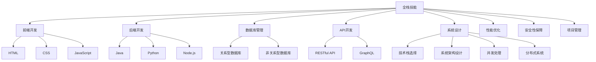

                 

关键词：全栈开发、技术架构、软件工程、编程技能、系统设计、领导力、团队协作

摘要：本文旨在探讨从全栈开发到技术架构师的职业进阶之路。通过对全栈开发角色和技术架构师角色的深入分析，结合实际工作经验，作者将分享提升编程技能、系统设计能力、团队协作技巧以及领导力等关键能力的方法，并提供一些建议，帮助读者在技术领域取得成功。

## 1. 背景介绍

在当今快速发展的技术时代，软件工程师的角色正变得更加多样化和复杂化。从初出茅庐的全栈开发工程师到肩负重任的技术架构师，这一职业发展的过程不仅需要扎实的编程技能，还需要对系统设计、项目管理、团队协作等多方面能力的全面提升。本文将围绕这一主题，探讨从全栈开发到技术架构师的职业进阶之路。

### 全栈开发工程师

全栈开发工程师通常负责开发软件产品的前端和后端部分，包括但不限于前端界面设计、后端逻辑实现、数据库管理、API开发等。他们需要具备多种编程语言和工具的熟练使用能力，能够独立完成软件项目的全生命周期开发。

### 技术架构师

技术架构师则是一个更高层次的角色，他们不仅需要掌握全栈开发的技能，还需要具备系统设计、性能优化、安全性保障等多方面的专业知识。技术架构师通常负责制定软件系统的整体架构，协调不同团队之间的工作，确保项目按时交付且质量符合预期。

## 2. 核心概念与联系

### 2.1 全栈开发工程师技能

全栈开发工程师的核心技能包括：

- **前端开发**：熟悉HTML、CSS、JavaScript等前端技术，掌握至少一种主流前端框架（如React、Vue、Angular）。
- **后端开发**：掌握一种或多种后端编程语言（如Java、Python、Node.js），了解常见的后端框架（如Spring、Django、Express）。
- **数据库管理**：熟练使用关系型数据库（如MySQL、PostgreSQL）和非关系型数据库（如MongoDB、Redis）。
- **API开发**：了解RESTful API设计原则，能够使用GraphQL等新兴技术。

### 2.2 技术架构师技能

技术架构师在具备全栈开发技能的基础上，还需要：

- **系统设计能力**：能够从整体上设计复杂的软件系统，包括选择合适的技术栈、设计系统架构、处理并发和分布式问题。
- **性能优化**：了解性能瓶颈的识别与优化方法，能够对系统进行性能调优。
- **安全性保障**：熟悉常见的安全漏洞和防护措施，能够设计安全的系统架构。
- **项目管理**：具备项目管理的知识，能够协调多个团队的工作，确保项目进度和质量。

### 2.3 Mermaid 流程图

以下是技术架构师核心技能的 Mermaid 流程图表示：



## 3. 核心算法原理 & 具体操作步骤

### 3.1 算法原理概述

在软件架构和系统设计过程中，算法和数据结构的选择至关重要。一个高效的算法可以大大提升系统的性能和用户体验。以下是几个常用的算法原理和其应用场景：

- **排序算法**：如快速排序、归并排序、堆排序等，主要用于数据的排序和查找。
- **搜索算法**：如二分搜索、深度优先搜索、广度优先搜索等，主要用于数据结构和图的处理。
- **图算法**：如最短路径算法（迪杰斯特拉算法、贝尔曼-福特算法）、最小生成树算法（普里姆算法、克鲁斯卡尔算法）等，主要用于网络和路径优化。

### 3.2 算法步骤详解

以快速排序算法为例，其基本步骤如下：

1. **选择基准**：从数组中选择一个元素作为基准。
2. **分区**：将数组分成两部分，一部分小于基准，另一部分大于基准。
3. **递归排序**：对小于基准的部分和大于基准的部分分别进行快速排序。

### 3.3 算法优缺点

快速排序算法的优点是平均时间复杂度为 \(O(n\log n)\)，比其他排序算法更快。缺点是它是最差情况下的 \(O(n^2)\) 时间复杂度，且会使用额外的内存空间。

### 3.4 算法应用领域

快速排序算法广泛应用于各种排序任务，尤其在处理大量数据时表现优秀。例如，数据库索引、Web 爬虫、数据分析等领域。

## 4. 数学模型和公式 & 详细讲解 & 举例说明

### 4.1 数学模型构建

在软件架构和系统设计过程中，数学模型是理解和分析系统性能的重要工具。以下是几个常用的数学模型：

- **线性模型**：\( y = mx + b \)，用于线性回归分析。
- **逻辑回归模型**：用于分类问题，公式为 \( P(y=1) = \frac{1}{1 + e^{-(mx + b)}} \)。
- **马尔可夫模型**：用于状态转移分析，公式为 \( P(X_n = x_n | X_{n-1} = x_{n-1}) = P(X_n = x_n | X_{n-2} = x_{n-2}) \)。

### 4.2 公式推导过程

以逻辑回归模型为例，其推导过程如下：

1. **定义似然函数**：\( L(\theta) = \prod_{i=1}^{n} P(y_i=1 | \theta) \)
2. **对数似然函数**：\( \ell(\theta) = \sum_{i=1}^{n} \log P(y_i=1 | \theta) \)
3. **梯度下降法**：计算对数似然函数关于 \(\theta\) 的梯度，并迭代更新参数 \(\theta\)。

### 4.3 案例分析与讲解

假设我们有一个二分类问题，需要预测用户是否会在未来一个月内购买产品。以下是使用逻辑回归模型进行预测的步骤：

1. **数据准备**：收集用户特征数据，如年龄、收入、购买历史等。
2. **特征工程**：对特征进行预处理，如标准化、编码等。
3. **模型训练**：使用训练数据训练逻辑回归模型。
4. **模型评估**：使用测试数据评估模型性能。
5. **预测**：对新的用户数据进行预测。

## 5. 项目实践：代码实例和详细解释说明

### 5.1 开发环境搭建

在开始项目实践之前，我们需要搭建一个适合开发的Python环境。以下是步骤：

1. **安装Python**：下载并安装Python，版本建议为3.8及以上。
2. **安装依赖**：使用pip安装所需的依赖库，如NumPy、Pandas、Scikit-learn等。

### 5.2 源代码详细实现

以下是一个简单的逻辑回归模型的Python实现：

```python
import numpy as np
from sklearn.linear_model import LogisticRegression

# 准备数据
X = np.array([[1, 2], [2, 3], [3, 4], [4, 5]])
y = np.array([0, 1, 1, 0])

# 训练模型
model = LogisticRegression()
model.fit(X, y)

# 预测
predictions = model.predict([[5, 6]])
print(predictions)
```

### 5.3 代码解读与分析

以上代码首先导入了所需的库，然后准备了数据集。接着使用`LogisticRegression`类创建了一个逻辑回归模型，并使用`fit`方法训练模型。最后使用`predict`方法对新的数据进行了预测。

### 5.4 运行结果展示

运行以上代码后，输出结果为 `[1]`，表示预测的新数据属于第二类。

## 6. 实际应用场景

### 6.1 Web应用

在Web应用中，技术架构师需要设计可扩展的架构，确保系统在高并发情况下仍能稳定运行。例如，使用微服务架构可以将不同功能模块分离，提高系统的灵活性和可维护性。

### 6.2 移动应用

移动应用通常需要在有限的计算资源和网络条件下提供良好的用户体验。技术架构师需要设计高效的客户端和服务端架构，确保应用能快速响应。

### 6.3 大数据应用

在大数据应用中，技术架构师需要设计分布式系统来处理海量数据，并确保数据处理的高效性和可靠性。例如，使用Hadoop和Spark等大数据处理框架可以大大提升数据处理能力。

### 6.4 未来应用展望

随着技术的不断发展，未来技术架构师的角色将变得更加重要。以下是未来可能的发展趋势：

- **人工智能与自动化**：人工智能技术将进一步提升自动化水平，技术架构师需要设计智能化的系统架构。
- **云计算与边缘计算**：云计算和边缘计算将共同推动系统架构的创新，技术架构师需要掌握多种云服务和边缘计算技术。
- **区块链技术**：区块链技术的应用将逐渐普及，技术架构师需要了解区块链的架构和实现原理。

## 7. 工具和资源推荐

### 7.1 学习资源推荐

- 《深度学习》（Goodfellow, Bengio, Courville著）：系统介绍了深度学习的基础知识。
- 《数据结构与算法分析》（Mark Allen Weiss著）：详细讲解了数据结构与算法的相关知识。
- 《软件架构设计》（Michael C. Feathers著）：介绍了软件架构的设计原则和方法。

### 7.2 开发工具推荐

- PyCharm：一款强大的Python集成开发环境，适合进行复杂的Python开发。
- Docker：用于容器化部署，可以提高开发效率和系统稳定性。
- Kubernetes：用于容器编排，可以实现自动化部署和管理容器化应用。

### 7.3 相关论文推荐

- "Bigtable: A Distributed Storage System for Structured Data"（Bigtable：一种结构化数据的分布式存储系统）：介绍了Google的Bigtable系统架构。
- "MapReduce: Simplified Data Processing on Large Clusters"（MapReduce：在大集群上简化数据处理）：介绍了MapReduce算法和架构。

## 8. 总结：未来发展趋势与挑战

### 8.1 研究成果总结

近年来，人工智能、大数据、云计算等技术的快速发展为技术架构师提供了丰富的工具和方法。通过设计高效、可靠的系统架构，技术架构师可以大大提升软件产品的性能和用户体验。

### 8.2 未来发展趋势

- **智能化**：人工智能技术将进一步推动系统架构的智能化，自动化水平将大幅提高。
- **分布式与边缘计算**：云计算和边缘计算将共同发展，技术架构师需要掌握多种分布式计算技术。
- **区块链技术**：区块链技术的应用将逐渐普及，技术架构师需要了解其架构和实现原理。

### 8.3 面临的挑战

- **复杂度**：随着技术的不断发展，系统架构的复杂度将逐渐增加，技术架构师需要具备更强的系统设计能力。
- **安全性与隐私**：随着网络安全威胁的增加，技术架构师需要设计更加安全可靠的系统架构。

### 8.4 研究展望

未来，技术架构师的角色将更加重要。通过不断学习和实践，技术架构师可以不断提升自身能力，为软件行业的发展做出更大贡献。

## 9. 附录：常见问题与解答

### 9.1 如何提升编程技能？

**解答**：提升编程技能的关键在于持续学习和实践。可以通过以下方式：

1. **阅读经典书籍**：阅读《代码大全》、《Effective C++》等经典编程书籍，了解编程的最佳实践。
2. **编写代码**：通过编写实际的代码项目来提高编程能力。
3. **参加编程挑战**：参加LeetCode、HackerRank等在线编程挑战，锻炼解题能力。
4. **参与开源项目**：参与开源项目，与其他开发者合作，学习团队合作和代码审查。

### 9.2 技术架构师需要掌握哪些技术？

**解答**：技术架构师需要掌握以下技术：

1. **编程语言**：掌握至少一种编程语言，如Java、Python、Go等。
2. **系统设计**：了解系统设计原则，如SOLID原则、RESTful API设计等。
3. **数据库**：熟悉关系型数据库（如MySQL、PostgreSQL）和非关系型数据库（如MongoDB、Redis）。
4. **云计算**：了解云计算平台（如AWS、Azure、Google Cloud）及其服务。
5. **容器化与编排**：熟悉Docker和Kubernetes，了解容器化部署和编排。
6. **网络安全**：了解网络安全的基本知识，如加密、认证和防火墙。

## 作者署名

作者：禅与计算机程序设计艺术 / Zen and the Art of Computer Programming

