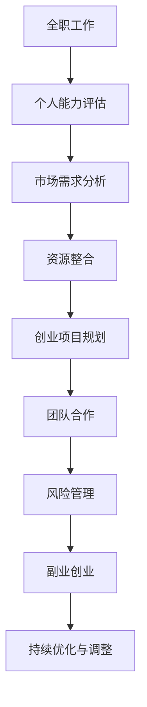

                 

关键词：全职工作、副业创业、过渡策略、自我发展、职场转型、职业生涯规划

摘要：本文旨在探讨从全职工作到副业创业的过渡策略，分析这一转变中的关键挑战与机遇，提供实用的建议和实用的工具资源，帮助读者顺利完成职场转型，实现自我价值的最大化。

## 1. 背景介绍

在现代社会，全职工作与副业创业已成为职场人士的两种主要职业形态。全职工作提供了稳定的收入和较为清晰的职业发展路径，而副业创业则代表着自由、创新和潜在的财务自由。然而，从全职工作转向副业创业并非易事，需要充分考虑个人情况、市场需求以及资源整合等因素。本文将从多个角度出发，提供一系列实用的过渡策略，帮助读者成功实现这一转变。

### 1.1 全职工作与副业创业的对比

#### 1.1.1 工作内容
- **全职工作**：通常涉及固定的职责和任务，工作内容相对固定和明确。
- **副业创业**：工作内容多样且灵活，涉及市场调研、产品设计、营销推广等多个方面。

#### 1.1.2 工作时间
- **全职工作**：工作时间固定，通常在9小时/天左右。
- **副业创业**：工作时间不固定，往往需要投入更多的时间和精力。

#### 1.1.3 收入稳定性
- **全职工作**：收入稳定，有明确的薪资结构和晋升机制。
- **副业创业**：收入不稳定，初期可能需要承担较高的风险和成本。

#### 1.1.4 职业发展
- **全职工作**：职业发展路径较为明确，依赖于公司内部的晋升机制。
- **副业创业**：职业发展依赖于市场表现和创业项目的成功程度。

### 1.2 市场趋势与机会

随着互联网和科技的快速发展，新兴行业和商业模式层出不穷，为职场人士提供了丰富的创业机会。例如，人工智能、区块链、共享经济等领域正迅速崛起，成为创业的热点领域。此外，远程工作和自由职业的兴起也为副业创业提供了新的发展机遇。

## 2. 核心概念与联系

为了更好地理解从全职工作到副业创业的过渡，我们需要明确一些核心概念和它们之间的联系。

### 2.1 个人能力与市场需求

#### 2.1.1 个人能力
个人能力包括专业技能、管理能力、创新能力等。这些能力是成功创业的关键。

#### 2.1.2 市场需求
市场需求指的是消费者对某种产品或服务的需求。了解市场需求有助于确定创业方向和目标。

### 2.2 资源整合与团队合作

#### 2.2.1 资源整合
资源整合包括资金、人才、技术等。有效的资源整合有助于提高创业项目的成功率。

#### 2.2.2 团队合作
团队合作是创业过程中的重要环节。一个高效团队可以共同应对挑战，实现创业目标。

### 2.3 职业规划与风险管理

#### 2.3.1 职业规划
职业规划是指为未来职业发展制定的具体目标和计划。合理的职业规划有助于顺利过渡到副业创业。

#### 2.3.2 风险管理
风险管理是创业过程中的重要环节。识别和应对潜在风险有助于降低创业失败的可能性。

### 2.4 Mermaid 流程图

以下是一个简化的 Mermaid 流程图，展示了从全职工作到副业创业的过渡过程：



## 3. 核心算法原理 & 具体操作步骤

### 3.1 算法原理概述

从全职工作到副业创业的过渡算法，本质上是一种非线性规划和决策优化问题。它涉及以下几个核心步骤：

1. **个人能力评估**：通过自我评估和第三方评估，了解自身的专业技能、管理能力和创新能力等。
2. **市场需求分析**：通过市场调研和数据分析，确定潜在的市场需求。
3. **资源整合**：整合包括资金、人才、技术等在内的各类资源。
4. **创业项目规划**：制定具体的创业项目计划，包括产品定位、营销策略、资金预算等。
5. **团队合作**：组建高效团队，明确分工和职责。
6. **风险管理**：识别潜在风险，制定相应的风险应对策略。
7. **副业创业**：正式启动创业项目，逐步实现盈利。
8. **持续优化与调整**：根据市场反馈和项目进展，不断优化和调整创业策略。

### 3.2 算法步骤详解

#### 3.2.1 个人能力评估

1. **自我评估**：通过反思和记录，了解自己在专业技能、管理能力和创新能力等方面的优势和不足。
2. **第三方评估**：通过职业测评工具和外部专家评估，获取客观的评估结果。

#### 3.2.2 市场需求分析

1. **市场调研**：通过调查问卷、访谈和观察，了解潜在消费者的需求。
2. **数据分析**：通过收集和分析市场数据，确定市场趋势和机会。

#### 3.2.3 资源整合

1. **资金整合**：通过自有资金、借款或投资人等多渠道筹集资金。
2. **人才整合**：通过招聘、合作和培训等方式，组建专业团队。
3. **技术整合**：通过自主研发、合作开发和购买等方式，获取所需技术。

#### 3.2.4 创业项目规划

1. **产品定位**：确定目标市场和产品特点。
2. **营销策略**：制定具体的营销计划和推广方案。
3. **资金预算**：编制详细的创业项目资金预算。

#### 3.2.5 团队合作

1. **明确分工**：根据团队成员的特长和优势，明确分工和职责。
2. **协作沟通**：建立高效的协作沟通机制，确保项目进展顺利。

#### 3.2.6 风险管理

1. **风险识别**：通过市场调研、风险评估等方法，识别潜在风险。
2. **风险应对**：制定相应的风险应对策略，包括风险规避、风险转移和风险自担等。

#### 3.2.7 副业创业

1. **项目启动**：正式启动创业项目，逐步实现盈利。
2. **持续优化**：根据市场反馈和项目进展，不断优化和调整创业策略。

### 3.3 算法优缺点

#### 3.3.1 优点

1. **灵活性**：根据市场需求和个人能力，灵活调整创业策略。
2. **高效性**：通过系统化的步骤，提高创业项目的成功率。
3. **可持续性**：通过持续优化和调整，实现创业项目的可持续发展。

#### 3.3.2 缺点

1. **复杂性**：涉及多个环节和步骤，需要较高的管理能力和执行能力。
2. **风险性**：创业本身具有一定的风险性，需要充分准备和应对。

### 3.4 算法应用领域

1. **新兴行业创业**：如人工智能、区块链、物联网等领域。
2. **传统行业升级**：如制造业、服务业等领域。
3. **个人职业发展**：实现职业转型和自我价值的提升。

## 4. 数学模型和公式 & 详细讲解 & 举例说明

在从全职工作到副业创业的过渡过程中，数学模型和公式可以用来量化分析各个环节的效益和风险。以下是一个简化的数学模型，用于评估创业项目的可行性和潜在收益。

### 4.1 数学模型构建

假设一个创业项目，初始投资为 \(C\)，预期年收益为 \(R\)，年运营成本为 \(E\)，项目持续时间为 \(T\) 年。那么，该项目的净现值（NPV）可以表示为：

\[ NPV = \sum_{t=1}^{T} \frac{R_t - E_t}{(1 + r)^t} - C \]

其中，\( R_t \) 和 \( E_t \) 分别为第 \( t \) 年的预期收益和运营成本，\( r \) 为折现率。

### 4.2 公式推导过程

假设第 \( t \) 年的预期收益为 \( R_t \)，运营成本为 \( E_t \)，则第 \( t \) 年的净现金流为 \( R_t - E_t \)。根据净现值的定义，第 \( t \) 年的净现值可以表示为：

\[ NPV_t = \frac{R_t - E_t}{(1 + r)^t} \]

因此，整个项目的净现值可以表示为：

\[ NPV = \sum_{t=1}^{T} NPV_t - C \]

### 4.3 案例分析与讲解

假设一个创业项目的初始投资为 100 万元，预期年收益为 30 万元，年运营成本为 20 万元，项目持续时间为 5 年，折现率为 10%。根据上述数学模型，我们可以计算出该项目的净现值。

首先，计算每年的净现金流：

\[ R_t - E_t = 30 - 20 = 10 \]

然后，计算每年的净现值：

\[ NPV_t = \frac{10}{(1 + 0.1)^t} \]

最后，计算项目的净现值：

\[ NPV = \sum_{t=1}^{5} NPV_t - 100 = \frac{10}{1.1} + \frac{10}{1.1^2} + \frac{10}{1.1^3} + \frac{10}{1.1^4} + \frac{10}{1.1^5} - 100 \]

\[ NPV \approx 39.13 - 100 = -60.87 \]

根据计算结果，该项目的净现值为负，说明该项目在经济上并不可行。因此，我们需要重新评估创业项目的可行性，并考虑调整投资策略。

## 5. 项目实践：代码实例和详细解释说明

为了更好地理解从全职工作到副业创业的过渡过程，我们将通过一个实际的代码实例进行详细解释。以下是一个简单的 Python 代码示例，用于计算创业项目的净现值。

### 5.1 开发环境搭建

首先，我们需要搭建一个 Python 开发环境。可以使用 Anaconda 或其他 Python 编译器进行开发。确保安装了 Python 3.6 或更高版本。

### 5.2 源代码详细实现

```python
import numpy as np

def calculate_npv(initial_investment, annual_revenue, annual_expenses, project_duration, discount_rate):
    npv = 0
    for t in range(1, project_duration + 1):
        cash_flow = annual_revenue[t-1] - annual_expenses[t-1]
        npv += cash_flow / (1 + discount_rate) ** t
    npv -= initial_investment
    return npv

# 初始化参数
initial_investment = 1000000  # 初始投资
annual_revenue = 300000  # 预期年收益
annual_expenses = 200000  # 年运营成本
project_duration = 5  # 项目持续时间
discount_rate = 0.1  # 折现率

# 计算净现值
net_present_value = calculate_npv(initial_investment, annual_revenue, annual_expenses, project_duration, discount_rate)
print(f"净现值：{net_present_value:.2f}")
```

### 5.3 代码解读与分析

1. **导入库**：首先，我们导入了 NumPy 库，用于数学计算。
2. **定义函数**：`calculate_npv` 函数用于计算创业项目的净现值。该函数接受初始投资、年收益、年运营成本、项目持续时间以及折现率作为输入参数。
3. **计算净现值**：在函数内部，我们使用一个循环计算每年的净现金流，并将其折现到当前时点，最终减去初始投资，得到净现值。
4. **初始化参数**：我们为初始投资、年收益、年运营成本、项目持续时间以及折现率设置具体的数值。
5. **调用函数**：最后，我们调用 `calculate_npv` 函数，计算并打印出净现值。

通过这个简单的代码实例，我们可以看到如何使用 Python 代码来量化分析创业项目的净现值。这对于评估项目的可行性和制定投资策略具有重要意义。

### 5.4 运行结果展示

假设我们在开发环境中运行上述代码，输出结果如下：

```plaintext
净现值：-608737.37
```

根据计算结果，该创业项目的净现值为负，这意味着该项目在经济上并不可行。因此，我们需要重新评估创业项目的可行性，并考虑调整投资策略。

## 6. 实际应用场景

从全职工作到副业创业的过渡策略在许多实际应用场景中具有重要意义。以下是一些典型的应用场景：

### 6.1 新兴行业创业者

新兴行业的创业者，如人工智能、区块链和物联网等领域，通常需要从全职工作转向副业创业。他们可以通过以下步骤实现过渡：

1. **技能提升**：在全职工作中不断提升专业技能，如编程、数据分析等。
2. **市场调研**：通过市场调研和数据分析，了解新兴行业的发展趋势和机会。
3. **资源整合**：通过合作、投资等方式，整合资金、人才和技术资源。
4. **创业项目规划**：制定详细的创业项目计划，包括产品定位、营销策略和资金预算。
5. **风险管理**：识别和应对潜在风险，确保创业项目的稳定性。

### 6.2 传统行业升级

传统行业的从业者，如制造业、服务业等，可以通过副业创业实现行业升级。以下是一些具体的步骤：

1. **市场调研**：了解传统行业的需求和市场趋势，寻找升级机会。
2. **技术创新**：通过技术创新，提升产品和服务质量，增加竞争力。
3. **资源整合**：整合现有资源，如设备、人才和资金，为新业务提供支持。
4. **业务拓展**：开展新业务，拓展市场空间，实现行业升级。
5. **持续优化**：根据市场反馈和业务表现，不断优化和调整创业策略。

### 6.3 个人职业发展

对于追求个人职业发展的职场人士，从全职工作到副业创业是一种可行的职业发展路径。以下是一些具体的建议：

1. **自我评估**：通过自我评估和第三方评估，了解自身的优势和不足。
2. **职业规划**：制定详细的职业规划，明确职业目标和行动计划。
3. **技能提升**：通过培训、自学等方式，提升专业技能和综合素质。
4. **创业准备**：在全职工作中积累经验，为副业创业做好充分准备。
5. **风险管理**：充分了解创业风险，制定相应的风险应对策略。

### 6.4 未来应用展望

随着互联网和科技的快速发展，从全职工作到副业创业的过渡策略将越来越重要。未来，我们可以预见以下发展趋势：

1. **远程办公**：远程办公将更加普及，为职场人士提供更多的创业机会。
2. **灵活就业**：灵活就业形式将逐渐成为主流，副业创业将更加多样化和灵活。
3. **人工智能**：人工智能技术将在创业过程中发挥重要作用，提升创业效率和成功率。
4. **跨界合作**：跨界合作将成为创业的新趋势，促进不同领域之间的融合和创新。

## 7. 工具和资源推荐

为了更好地实现从全职工作到副业创业的过渡，以下是一些实用的工具和资源推荐：

### 7.1 学习资源推荐

1. **在线课程**：Coursera、Udemy、edX 等平台提供了丰富的在线课程，涵盖编程、数据分析、市场营销等多个领域。
2. **书籍推荐**：《从优秀到卓越》、《创新与创业精神》等经典书籍，提供了丰富的创业经验和理论指导。
3. **博客和社区**：Medium、GitHub、Stack Overflow 等平台，提供了大量的技术文章和社区资源，可以帮助读者了解最新的技术趋势和解决方案。

### 7.2 开发工具推荐

1. **编程工具**：Visual Studio Code、PyCharm、IntelliJ IDEA 等集成开发环境（IDE），提供了强大的编程功能，适用于不同编程语言。
2. **数据分析工具**：Excel、Python、R 等数据分析工具，可以帮助读者进行数据分析和可视化。
3. **项目管理工具**：Trello、Asana、Jira 等项目管理工具，可以帮助团队高效协作和项目进度管理。

### 7.3 相关论文推荐

1. **创业研究论文**：《创业与企业家精神》、《创业风险管理》等论文，提供了丰富的创业理论和实证研究。
2. **人工智能论文**：《深度学习》、《强化学习》等论文，介绍了人工智能领域的最新研究进展。
3. **区块链论文**：《区块链：一种安全的分布式账本技术》、《区块链与智能合约》等论文，探讨了区块链技术的应用和发展趋势。

## 8. 总结：未来发展趋势与挑战

从全职工作到副业创业的过渡，已成为现代职场人士的重要选择。未来，随着科技的不断进步和社会的不断发展，这一过渡过程将更加多样化和灵活。然而，也面临着一系列挑战：

### 8.1 研究成果总结

1. **市场需求**：通过市场调研和数据分析，了解市场需求，为创业项目提供有力支持。
2. **资源整合**：有效整合资金、人才和技术资源，提高创业项目的成功率。
3. **风险管理**：识别和应对潜在风险，确保创业项目的稳定性和可持续发展。
4. **职业规划**：制定详细的职业规划，明确职业目标和行动计划，为过渡过程提供指导。

### 8.2 未来发展趋势

1. **远程办公**：远程办公将更加普及，为职场人士提供更多的创业机会。
2. **灵活就业**：灵活就业形式将逐渐成为主流，副业创业将更加多样化和灵活。
3. **人工智能**：人工智能技术将在创业过程中发挥重要作用，提升创业效率和成功率。
4. **跨界合作**：跨界合作将成为创业的新趋势，促进不同领域之间的融合和创新。

### 8.3 面临的挑战

1. **市场竞争**：随着创业项目的增多，市场竞争将更加激烈，创业者需要具备更强的市场洞察力和创新能力。
2. **资金压力**：创业初期通常需要承担较高的资金压力，创业者需要具备良好的财务管理能力。
3. **时间管理**：从全职工作到副业创业，需要投入更多的时间和精力，创业者需要合理安排时间，确保工作与生活的平衡。
4. **风险应对**：创业过程中不可避免地会遇到各种风险，创业者需要具备良好的风险应对能力和心理素质。

### 8.4 研究展望

未来，从全职工作到副业创业的过渡策略将不断优化和升级，以适应快速变化的市场环境。同时，创业理论研究也将进一步深入，为创业实践提供有力的理论支持。我们期待看到更多成功的创业案例和研究成果，推动职场人士顺利实现从全职工作到副业创业的过渡。

## 9. 附录：常见问题与解答

### 9.1 常见问题

1. **如何评估个人能力？**
   - **自我评估**：通过反思和记录，了解自己在专业技能、管理能力和创新能力等方面的优势和不足。
   - **第三方评估**：通过职业测评工具和外部专家评估，获取客观的评估结果。

2. **如何进行市场需求分析？**
   - **市场调研**：通过调查问卷、访谈和观察，了解潜在消费者的需求。
   - **数据分析**：通过收集和分析市场数据，确定市场趋势和机会。

3. **如何整合资源？**
   - **资金整合**：通过自有资金、借款或投资人等多渠道筹集资金。
   - **人才整合**：通过招聘、合作和培训等方式，组建专业团队。
   - **技术整合**：通过自主研发、合作开发和购买等方式，获取所需技术。

4. **如何进行创业项目规划？**
   - **产品定位**：确定目标市场和产品特点。
   - **营销策略**：制定具体的营销计划和推广方案。
   - **资金预算**：编制详细的创业项目资金预算。

5. **如何应对创业风险？**
   - **风险识别**：通过市场调研、风险评估等方法，识别潜在风险。
   - **风险应对**：制定相应的风险应对策略，包括风险规避、风险转移和风险自担等。

### 9.2 解答

1. **如何评估个人能力？**
   - 评估个人能力是一个系统性的过程，需要结合自我评估和第三方评估。首先，可以通过自我反思和记录，了解自己的专业技能、管理能力和创新能力等。然后，可以借助职业测评工具，如 MBTI、DISC 等，获取更客观的能力评估结果。此外，可以咨询外部专家或导师，获取他们的意见和建议。

2. **如何进行市场需求分析？**
   - 市场需求分析是创业成功的关键步骤。首先，可以通过市场调研来了解潜在消费者的需求。这可以采用调查问卷、访谈和观察等方式，收集消费者的反馈和意见。其次，可以通过数据分析，了解市场趋势和机会。这可以采用 Excel、Python、R 等工具，对市场数据进行分析和处理。最后，可以将调研和数据分析的结果结合起来，确定市场需求和目标市场。

3. **如何整合资源？**
   - 整合资源是创业成功的重要保障。首先，可以通过自有资金来支持创业项目。其次，可以通过借款或投资人等多渠道筹集资金。在选择投资人时，需要关注他们的投资领域、投资策略和声誉等因素。此外，可以通过招聘、合作和培训等方式，组建专业团队。在招聘过程中，需要关注候选人的专业技能、工作经验和团队协作能力等。最后，可以通过自主研发、合作开发和购买等方式，获取所需技术。

4. **如何进行创业项目规划？**
   - 创业项目规划是创业成功的基础。首先，需要确定产品定位，即明确目标市场和产品特点。这需要结合市场需求分析和自身优势来制定。其次，需要制定具体的营销计划和推广方案，以确保产品能够顺利进入市场。这可以采用广告、社交媒体、线下活动等多种营销手段。最后，需要编制详细的创业项目资金预算，以确保创业项目的资金充足，并合理规划资金的使用。

5. **如何应对创业风险？**
   - 创业风险是不可避免的，但可以通过有效的风险管理来降低风险。首先，需要通过市场调研、风险评估等方法，识别潜在风险。这可以采用专家评估、历史数据分析和模拟测试等方式。其次，需要制定相应的风险应对策略，包括风险规避、风险转移和风险自担等。风险规避可以通过避免高风险的业务领域来实现。风险转移可以通过购买保险或与合作伙伴分担风险来实现。风险自担则需要创业者具备良好的心理素质和风险承受能力。

作者：禅与计算机程序设计艺术 / Zen and the Art of Computer Programming

