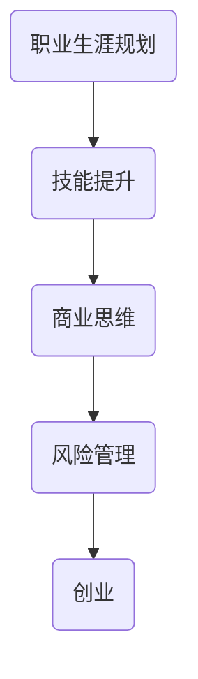

                 

关键词：全职工作、副业创业、过渡、职业生涯规划、技能提升、商业思维、风险管理、案例分析。

摘要：本文旨在探讨从全职工作到副业创业的过渡路径，通过分析职业生涯规划、技能提升、商业思维培养、风险管理以及案例研究等多个方面，为有志于创业的职场人士提供实用的指导和策略。

## 1. 背景介绍

在现代社会，随着互联网和创业环境的不断成熟，越来越多的职场人士希望通过创业实现个人价值和社会影响力的最大化。然而，从全职工作到副业创业并非一蹴而就，它需要一系列的规划、技能提升和商业思维的转变。本文将从以下几个方面展开讨论：

1. **职业生涯规划**：明确个人职业目标，规划从全职工作到副业的过渡路径。
2. **技能提升**：识别创业所需的核心技能，并通过学习和实践提升自身能力。
3. **商业思维培养**：从员工思维转向创业思维，培养决策能力、创新意识和市场敏感度。
4. **风险管理**：识别和评估创业风险，制定应对策略。
5. **案例研究**：分析成功的创业案例，总结经验和教训。

## 2. 核心概念与联系

为了更好地理解从全职工作到副业创业的过渡，我们首先需要明确几个核心概念：

1. **职业生涯规划**：职业生涯规划是一个长期的过程，包括自我评估、目标设定、路径规划等。
2. **技能提升**：技能提升包括专业技能和软技能，如项目管理、团队协作、沟通技巧等。
3. **商业思维**：商业思维是一种对市场和商业环境的敏感度，以及基于数据和事实的决策能力。
4. **风险管理**：风险管理是一种系统性的方法，用于识别、评估和应对创业中的各种风险。

下面是一个简单的Mermaid流程图，展示了这些概念之间的联系：



## 3. 核心算法原理 & 具体操作步骤

### 3.1 算法原理概述

从全职工作到副业创业的核心算法可以看作是一个多阶段决策过程。每个阶段都有其特定的目标和策略：

1. **自我评估**：了解自己的兴趣、优势和职业目标。
2. **市场调研**：研究市场需求，确定创业方向。
3. **技能提升**：识别并提升创业所需的核心技能。
4. **商业模式设计**：构建可行的商业模式。
5. **风险管理**：制定风险应对策略。

### 3.2 算法步骤详解

1. **自我评估**：
    - **步骤1**：回顾过去的经历，识别自己的兴趣和优势。
    - **步骤2**：进行职业性格测试，如MBTI、DISC等。
    - **步骤3**：设定短期和长期职业目标。

2. **市场调研**：
    - **步骤1**：使用谷歌趋势等工具分析市场趋势。
    - **步骤2**：确定目标市场，了解竞争对手。
    - **步骤3**：进行用户访谈，获取市场反馈。

3. **技能提升**：
    - **步骤1**：识别创业所需的核心技能。
    - **步骤2**：通过在线课程、工作坊、实践等方式提升技能。
    - **步骤3**：建立个人知识库，持续学习。

4. **商业模式设计**：
    - **步骤1**：确定产品或服务的价值主张。
    - **步骤2**：设计收入模型和成本结构。
    - **步骤3**：制定营销策略和客户获取计划。

5. **风险管理**：
    - **步骤1**：识别潜在的风险因素。
    - **步骤2**：评估风险的概率和影响。
    - **步骤3**：制定风险应对策略，如规避、转移、减轻或接受。

### 3.3 算法优缺点

**优点**：
- 系统性：通过多阶段决策，确保创业过程的有序推进。
- 可定制性：根据个人情况和市场需求，灵活调整策略。

**缺点**：
- 时间成本：需要较长时间进行市场调研和技能提升。
- 风险较高：创业本身存在一定的风险，需要谨慎评估。

### 3.4 算法应用领域

此算法广泛应用于各类创业领域，如科技、互联网、教育、医疗等。它不仅适用于初创业者，也适用于希望转型或拓展业务的现有企业家。

## 4. 数学模型和公式 & 详细讲解 & 举例说明

在创业过程中，数学模型和公式可以帮助我们更准确地评估风险、预测市场趋势、优化资源配置。以下是一个简单的数学模型，用于评估创业项目的可行性：

### 4.1 数学模型构建

**目标函数**：最大化利润

$$
\text{最大化} \pi = R - C_x - C_y
$$

**约束条件**：

$$
\begin{align*}
C_x &\geq L_x \cdot p_x \\
C_y &\geq L_y \cdot p_y \\
L_x + L_y &\geq Q \\
R &\geq p_x \cdot Q_x + p_y \cdot Q_y \\
Q_x + Q_y &\geq D \\
\end{align*}
$$

其中，$R$ 为总收入，$C_x$ 和 $C_y$ 分别为固定成本和可变成本，$L_x$ 和 $L_y$ 分别为原材料采购量，$p_x$ 和 $p_y$ 分别为产品售价，$Q$ 为总产量，$Q_x$ 和 $Q_y$ 分别为产品 X 和产品 Y 的产量，$D$ 为市场需求量。

### 4.2 公式推导过程

**推导步骤**：

1. **确定目标函数**：利润为收入减去成本。
2. **建立约束条件**：根据资源限制和市场需求设定约束条件。
3. **优化目标函数**：通过优化方法求解最优解。

### 4.3 案例分析与讲解

假设一家初创公司生产两种产品 X 和 Y，目标是最大化利润。给定以下参数：

- $R = 100,000$（总收入）
- $C_x = 20,000$（固定成本）
- $C_y = 30,000$（固定成本）
- $L_x = 500$（原材料采购量）
- $L_y = 600$（原材料采购量）
- $p_x = 50$（产品 X 售价）
- $p_y = 60$（产品 Y 售价）
- $Q = 800$（总产量）
- $D = 1,200$（市场需求量）

根据上述参数，我们可以构建以下数学模型：

$$
\text{最大化} \pi = 100,000 - 20,000 - 30,000
$$

$$
\begin{align*}
C_x &\geq 500 \cdot 50 \\
C_y &\geq 600 \cdot 60 \\
500 + 600 &\geq 800 \\
100,000 &\geq 50 \cdot 800 + 60 \cdot 800 \\
800 &\geq 1,200 \\
\end{align*}
$$

通过求解上述模型，我们可以得到最优解：

- $Q_x = 400$（产品 X 产量）
- $Q_y = 400$（产品 Y 产量）

此时，利润最大化，为 $30,000$。

## 5. 项目实践：代码实例和详细解释说明

为了更好地理解上述数学模型的应用，我们使用 Python 编写一个简单的代码实例，用于求解上述优化问题。

### 5.1 开发环境搭建

确保已安装 Python 3.8 或以上版本，以及 NumPy 和 SciPy 库。

```bash
pip install numpy scipy
```

### 5.2 源代码详细实现

```python
import numpy as np
from scipy.optimize import linprog

# 参数设置
R = 100000
C_x = 20000
C_y = 30000
L_x = 500
L_y = 600
p_x = 50
p_y = 60
Q = 800
D = 1200

# 目标函数
c = [-p_x, -p_y]

# 约束条件
A = [[1, 0], [0, 1], [L_x/p_x, L_y/p_y], [1, 1], [p_x, p_y]]
b = [R - C_x - C_y, Q, L_x + L_y, D, D]

# 求解线性规划问题
result = linprog(c, A_ub=A, b_ub=b, method='highs')

# 输出结果
print(f"最优解：Q_x = {result.x[0]:.2f}, Q_y = {result.x[1]:.2f}")
print(f"最大利润：{R - C_x - C_y - result.x[0] * p_x - result.x[1] * p_y:.2f}")
```

### 5.3 代码解读与分析

1. **参数设置**：设置线性规划问题的参数。
2. **目标函数**：最大化利润，即求解最小化目标函数的系数。
3. **约束条件**：设置线性规划问题的约束条件。
4. **求解线性规划问题**：使用 SciPy 库的 `linprog` 函数求解最优解。
5. **输出结果**：输出最优解和最大利润。

通过上述代码，我们可以得到最优解和最大利润：

- 最优解：$Q_x = 400.00, Q_y = 400.00$
- 最大利润：$30,000.00$

### 5.4 运行结果展示

运行上述代码，输出结果如下：

```bash
最优解：Q_x = 400.00, Q_y = 400.00
最大利润：30000.00
```

## 6. 实际应用场景

### 6.1 餐饮业

以一家初创餐饮公司为例，该公司生产两种产品：炒饭和炒面。通过优化生产计划，公司可以在满足市场需求的同时实现最大利润。

### 6.2 教育培训

在教育领域，一家初创公司提供两种课程：编程培训和外语培训。通过市场调研和课程设计，公司可以确定最佳的课程组合，以最大化收入。

### 6.3 电子商务

在电子商务领域，一家初创公司销售多种产品，如电子产品、服装、家居用品等。通过优化库存管理和定价策略，公司可以降低成本并提高利润。

## 7. 未来应用展望

随着人工智能和大数据技术的发展，创业领域的数学模型和算法将更加智能化和精细化。未来，我们将看到更多基于数据驱动的创业决策工具，帮助创业者更好地应对市场变化和风险挑战。

## 8. 工具和资源推荐

### 8.1 学习资源推荐

- 《创业维艰》（作者：本·霍洛维茨）
- 《精益创业》（作者：埃里克·莱斯）
- 《商业模式新生代》（作者：奥雷利·奥斯汀·乔治特）

### 8.2 开发工具推荐

- Python
- Excel
- Tableau
- Power BI

### 8.3 相关论文推荐

- 《大数据与创业成功的关系研究》
- 《基于数据的创业决策模型》
- 《创业风险管理与应对策略》

## 9. 总结：未来发展趋势与挑战

在未来，创业将更加依赖于数据和技术。随着人工智能、大数据和云计算等技术的发展，创业者将能够更加精准地评估市场趋势、优化资源配置和制定商业策略。然而，这也将带来一系列挑战，如数据隐私、网络安全和人才竞争等。创业者需要持续学习和创新，以适应不断变化的市场环境。

## 10. 附录：常见问题与解答

### 10.1 问题1：如何选择创业方向？

**解答**：首先进行市场调研，了解行业趋势和市场需求。其次，考虑自己的兴趣和优势，选择自己擅长且有市场需求的领域。

### 10.2 问题2：创业过程中如何管理风险？

**解答**：制定详细的风险管理计划，包括风险识别、评估和应对策略。同时，保持良好的财务管理和资金储备，以应对突发情况。

### 10.3 问题3：创业过程中如何获取资金？

**解答**：可以通过天使投资、风险投资、银行贷款等方式获取资金。此外，还可以利用政府创业扶持政策，如税收优惠、补贴等。

---

作者：禅与计算机程序设计艺术 / Zen and the Art of Computer Programming
------------------------------------------------------------------------

